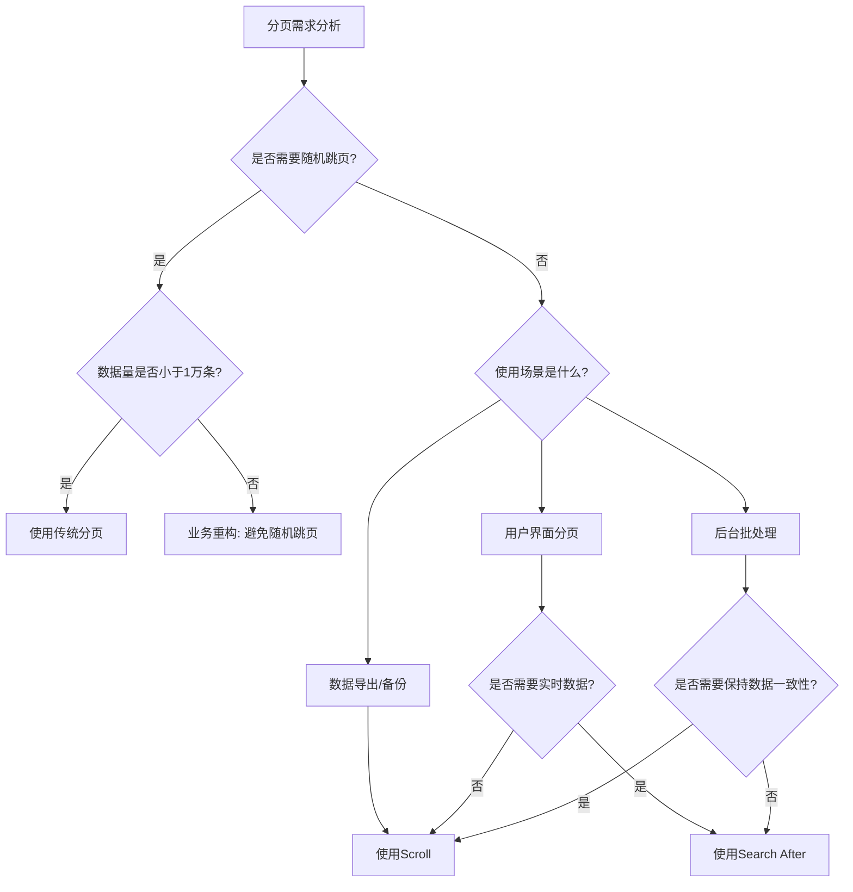

# ElasticSearch 深度分页问题详情

# 问题本质和原理

## 深分页问题的本质

当使用 `from + size` 参数进行深层页码查询时（如第1000页，每页10条），ElasticSearch 需要：

- 从每个分片中获取前 `from + size` 条数据
- 协调节点收集所有分片的数据（共 `分片数 × (from + size)` 条）
- 对所有结果进行全局排序
- 丢弃前 `from` 条，返回剩余的 `size` 条

## 核心问题原理

下列通过伪代码说明处理流程

```java
for (每个分片 shard) {
    查询结果 = shard.search(query);
    获取前(from + size)条数据;  // 内存中保存
    发送到协调节点;
}

// 协调节点
所有数据 = 收集所有分片数据();    // 数据量：分片数 × (from + size)
排序后的数据 = **全局排序**(所有数据);
返回数据 = 截取(from, from + size);
```

因此内存消耗公式：内存占用 ≈ 分片数 × (from + size) × 文档大小

并且全局排序消耗CPU。

## **默认限制**

ElasticSearch 默认配置值 `index.max_result_window = 10000`，它是一个重要的保护性设置，用于限制了您在一次查询中**使用 `from`和 `size` 参数进行分页时所能获取的最大文档数量**。

- 防止单个查询耗尽内存
- 避免查询响应时间过长
- 保护集群稳定性

# **解决方案对比分析**

## **方案一：Scroll API（滚动查询）- 快照原理**

### 实现原理

[Scroll 原理分析](ElasticSearch%20%E6%B7%B1%E5%BA%A6%E5%88%86%E9%A1%B5%E9%97%AE%E9%A2%98%E8%AF%A6%E6%83%85/Scroll%20%E5%8E%9F%E7%90%86%E5%88%86%E6%9E%90%202fad60c9df5180fe8580f9933058b7a4.md)

```java
// 1. 初始化（创建快照上下文）
POST /index/_search?scroll=5m
{
  "size": 100,
  "query": { "match_all": {} }
}
// 返回：_scroll_id（快照指针）

// 2. 后续查询（使用游标）
POST /_search/scroll
{
  "scroll": "5m",
  "scroll_id": "快照ID"
}
```

### 核心机制

- 创建**数据快照**（Snapshot），冻结查询时的索引状态
- 在协调节点维护**排序上下文**（Context）
- 每次请求通过 scroll_id 按顺序遍历下一批快照数据，无需重新排序

### 本质

空间换时间，用内存保存查询状态，避免重复排序。

```java
# 类比：数据库游标
class Scroll:
    def __init__(self):
        self.snapshot = create_snapshot()  # 数据快照
        self.context = create_context()    # 排序上下文
        self.position = 0                  # 当前位置
    
    def next_batch(self, size):
        # 直接从快照的position位置读取size条
        return read_from_snapshot(self.position, size)
```

### **内存优化对比**

```
传统分页：分片数 × (from + size) 条数据在内存
Search After：分片数 × size 条数据在内存 + 上下文快照
```

### 优缺点

- ✅ 优点：适合大数据量遍历
- ❌ 缺点：快照占用内存，非实时数据

### **适用场景**

- 数据导出
- 离线批处理 / 报表
- 全量数据迁移

## 方案二：Search After（搜索之后）- 游标机制

### **实现原理**

[**Search After 原理**](ElasticSearch%20%E6%B7%B1%E5%BA%A6%E5%88%86%E9%A1%B5%E9%97%AE%E9%A2%98%E8%AF%A6%E6%83%85/Search%20After%20%E5%8E%9F%E7%90%86%202fad60c9df518074afb8d5d1b416bc55.md)

```java
// 第一次查询
GET /index/_search
{
  "size": 10,
  "sort": [
    {"timestamp": "desc"},
    {"_id": "asc"}  // 二级排序确保唯一性
  ]
}

// 后续查询（使用最后一条的排序值）
GET /index/_search
{
  "size": 10,
  "sort": [
    {"timestamp": "desc"},
    {"_id": "asc"}
  ],
  "search_after": [上次最后的时间戳, 上次最后的ID]
}
```

### **核心机制**

- 基于**排序值游标**，而非页码
- 将 `from` 的**全局跳转**变**局部查找**
- 每个分片只需要定位 `search_after` 位置，然后取 `size` 条数据

### 本质

将上一页最后一条记录的排序值作为“游标”。查询时，**每个分片只须从该游标位置开始，在本分片内向后顺序扫描**，返回满足条件的后续文档，从而避免全局排序。

### **内存优化对比**

```
传统分页：分片数 × (from + size) 条数据在内存
Search After：分片数 × size 条数据在内存
```

### 优缺点

- ✅ 优点：基于排序值实现，适合实时深度分页
- ❌ 缺点：只支持顺序翻页，且排序字段要保证唯一

### **必要条件**：

1. 排序字段必须**唯一或组合唯一**（否则可能导致数据丢失）。
2. 查询必须使用相同的排序规则
3. 只能顺序遍历，不能随机跳页

### **适用场景**

- 移动端无限滚动列表 / 实时数据分页展示

# **四、方案选型指南**

> 在具体的场景下，需要权衡实时性和数据一致性。
> 
> 
> scroll适合导出但不适合实时查询，search_after适合深分页但必须顺序访问。
> 

## 决策流程图



## 场景化建议

| 场景 | 推荐方案 | 理由 |
| --- | --- | --- |
| 用户界面分页 | Search After | 实时性强，内存占用可控 |
| 数据导出/备份 | Scroll | 数据一致性要求高 |
| 第1-100页访问 | 传统分页 | 实现简单，性能可接受 |
| 跳转特定页码 | 重新设计业务逻辑 | ES不支持高效随机跳页 |

# **五、最佳实践补充**

## 1. **Search After的排序优化**

```java
// 推荐：使用组合字段确保唯一性
"sort": [
  {"@timestamp": "desc"},
  {"_id": "asc"},      // 确保唯一性
  {"business_id": "asc"} // 业务字段辅助排序
]
```

## 2. **Scroll的性能优化**

```java
// 调整scroll时间窗口
POST /_search?scroll=2m  // 根据数据量调整

// 清理不再使用的scroll
DELETE /_search/scroll
{
  "scroll_id": ["id1", "id2"]
}
```

## 3. **业务层面的优化**

```java
// 伪代码：限制最大分页深度
public PageResult search(int page, int size) {
    if (page > MAX_PAGE) {  // 如MAX_PAGE=100
        // 方案1：返回空或提示
        // 方案2：使用Search After重写查询
        return searchWithSearchAfter(lastSortValues);
    }
    return traditionalSearch(page, size);
}
```

## 4. 产品设计逻辑

- 使用**无限滚动**替代页码分页或者限制最大显示页数
- 添加**时间范围筛选**减少数据量
- 实现**搜索条件记忆**，避免深层分页

# 总结

Elasticsearch深度分页问题的**核心矛盾**是：`全局排序 + 内存缓冲`带来的资源消耗。

**解决本质**：

- **Scroll**：用快照固化数据视图，避免重复排序
- **Search After**：用游标替代页码，变全局遍历为局部查找

**根本原则**：在分布式系统中，应尽量避免需要全局排序和跳转的查询模式，而是采用基于游标的顺序访问模式。

| 分页方式 | 实现原理 | 时间复杂度 | 优点 | 缺点 | 适用场景 |
| --- | --- | --- | --- | --- | --- |
| **from + size** | 指定跳过文档数(`from`)和返回大小(`size`) | O(from+size) | ✅ 支持随机跳页 | ❌ 受 `max_result_window`限制
❌ 深度分页时有性能问题 | Top N (N ≤ 10000) 查询、需要随机跳页且数据量不大的场景 |
| **Scroll** | 一次查询生成数据快照，通过游标(`scroll_id`)分批遍历 | O(1) | ✅ 适合处理大量数据
✅ 遍历期间结果一致 | ❌ 数据非实时
❌ 占用资源直到游标关闭 | 数据导出、离线批处理等非实时性任务 |
| **Search After** | 利用上一页结果的排序值作为“书签”检索下一页 | O(size) | ✅ 适合深度分页
✅ 查询实时数据 | ❌ 不支持随机跳页
❌ 需要稳定的排序规则 | 无限下拉、实时日志流等连续翻页场景 |