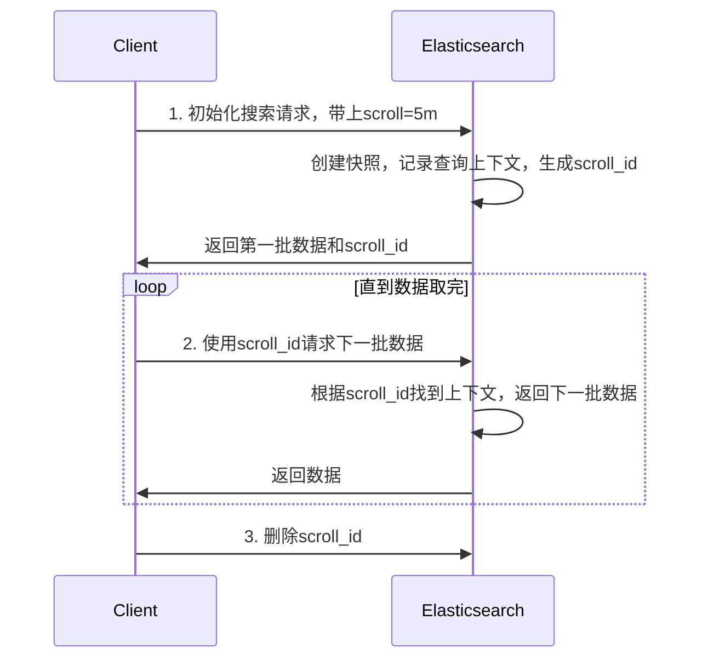
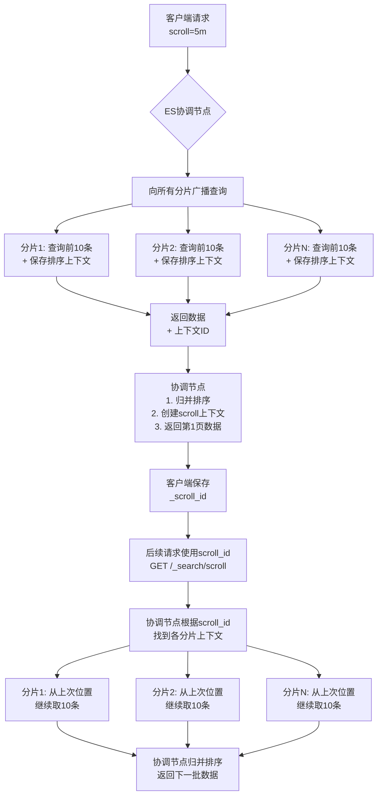

# Scroll 原理分析

Scroll 可以理解为ES维护了一个当前查询的快照（snapshot），然后通过一个游标（scroll_id）来遍历这个快照。由于是快照，所以在遍历过程中，即使有新的数据写入，也不会被包含到查询结果中。

**具体过程：**

1. **初始化阶段**：客户端发起一次搜索请求，并指定scroll参数（如1m），表示这个scroll上下文在ES中要保持1分钟。ES会返回第一批数据和一个scroll_id。
2. **后续滚动**：客户端使用这个scroll_id，不断请求下一批数据，直到没有数据返回为止。
3. **删除scroll**：在使用完毕后，应该主动删除scroll以释放资源。

**内存占用**：ES会在内存中维护这个scroll上下文，直到超时。所以，如果scroll时间设置过长，而又有大量的scroll在同时进行，可能会占用大量内存。



**注意**：Scroll不适合实时搜索，因为它是在快照上查询。另外，每次请求都会刷新scroll的过期时间。

**Scroll 实现过程**

```java
# 初始化，获取第一批数据，设置scroll过期时间为5分钟
POST /my_index/_search?scroll=5m
{
  "size": 100,
  "query": {
    "match_all": {}
  }
}

// 返回：{
//   "_scroll_id": "DXF1ZXJ5QW5kRmV0Y2gBAAAAAAA...",
//   "hits": { "total": 100000, "hits": [...] }
// }

# 后续使用scroll_id获取数据
POST /_search/scroll
{
  "scroll": "5m",
  "scroll_id": "DnF1ZXJ5VGhlbkZldGNoBQAAAAAA..." 
}
```

**核心机制原理图**

