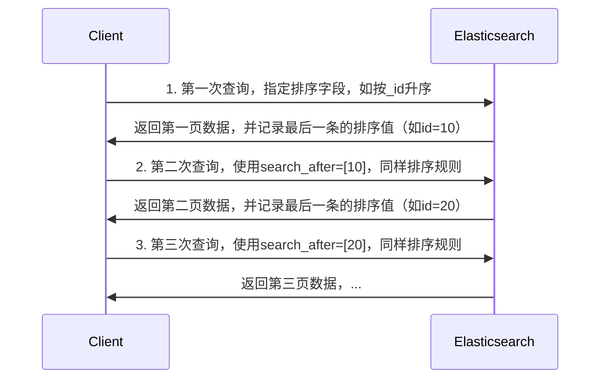
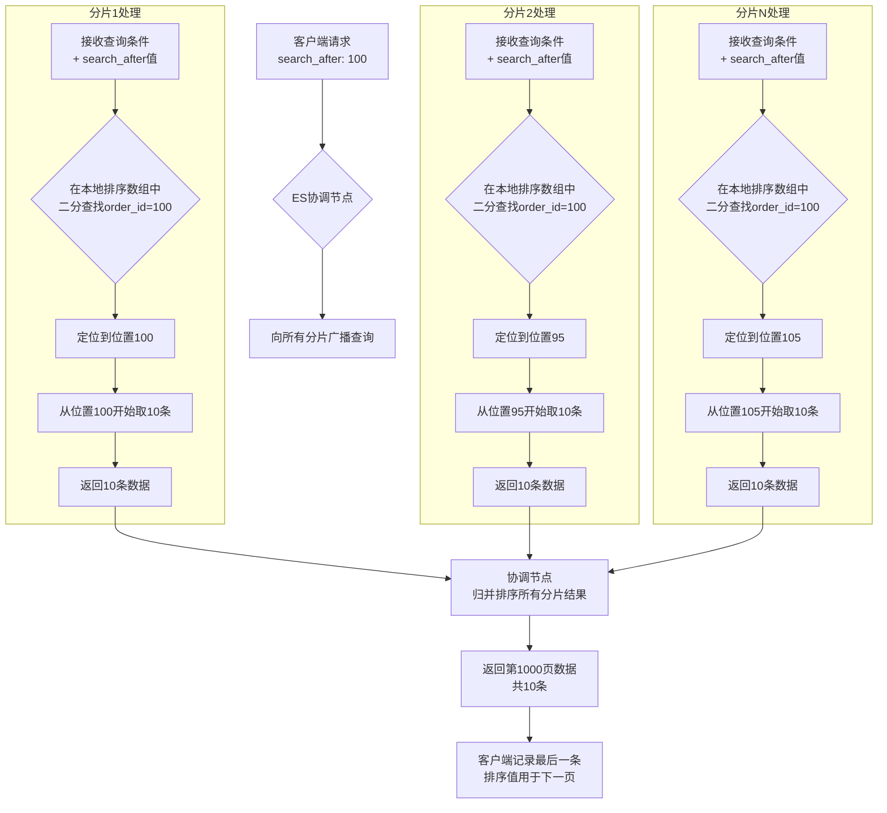

# Search After 原理

Search After是一种基于上一页最后一行的排序值来检索下一页数据的方法。它要求查询必须指定一个唯一的排序字段（或者多个字段组合成唯一），通常是用`_id`（因为唯一）或者时间戳加上其他字段来确保唯一性和稳定性。

**具体过程：**

1. 第一次查询：指定排序字段（比如`_id`），返回第一页数据。
2. 获取最后一行的排序值（比如`_id`的值），在第二次查询时，将这些排序值作为`search_after`参数，这样就可以获取下一页数据。

**注意**：使用Search After时，跳页只能一页一页地往下翻，不能跳转到任意页面。而且，如果两次查询之间数据有变动（比如新增或删除），可能会影响分页结果。



**实现过程**

```java
# 第一次查询，按_id升序（确保唯一排序），获取排序边界值
POST /my_index/_search
{
  "size": 100,
  "query": {
    "match_all": {}
  },
  "sort": [
    {"_id": "asc"}
  ]
}

# 第二次查询，使用search_after，参数为上一页最后一条的_id
POST /my_index/_search
{
  "size": 100,
  "query": {
    "match_all": {}
  },
  "sort": [
    {"_id": "asc"}
  ],
  "search_after": [100]  # 假设上一页最后一条的_id是100
}
```

**核心机制原理图**

