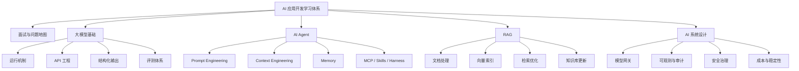

# AI 应用开发学习体系

这篇笔记先把 JavaGuide 的 AI 应用开发专题整理成自己的学习地图，目标是边学习边沉淀可复用的知识库结构。后续每学完一篇文章，可以在对应主题下扩写成独立笔记，再回链到这篇总览。

> [!info] 新版学习工作区
> 更细的 Java 后端转型路线、分阶段专题骨架与实践验收清单已迁移到 [[Java 转 AI 应用开发/index|Java 转 AI 应用开发索引]]。本页保留为 JavaGuide AI 专题的粗粒度总览。

官方/来源：

- JavaGuide AI 应用开发知识体系：<https://javaguide.cn/ai/>
- GitHub 原始 Markdown：<https://raw.githubusercontent.com/Snailclimb/JavaGuide/main/docs/ai/README.md>
- 域内 raw 记录：[[.raw/articles/JavaGuide AI 应用开发知识体系来源记录]]

[TOC]

## 目录

- [Key Takeaways](#key-takeaways)
- [学习主线](#学习主线)
- [知识体系分层](#知识体系分层)
- [建议阅读顺序](#建议阅读顺序)
- [主题笔记规划](#主题笔记规划)
- [核心问题清单](#核心问题清单)
- [Comparison Table](#comparison-table)
- [Architecture or Flow](#architecture-or-flow)
- [Related Pages](#related-pages)
- [参考来源](#参考来源)

## Key Takeaways

- AI 应用开发不是简单调用大模型 API，而是把模型、上下文、检索、工具、评测和治理接进真实工程系统。
- 学习顺序应从“高频问题总览”开始，再进入 LLM 调用链路、Agent、RAG、系统设计和评测治理。
- Prompt Engineering 解决的是“如何表达任务”，Context Engineering 解决的是“模型每次推理能看到什么”，两者都需要工程化约束。
- RAG 的主要风险常在召回链路，而不是生成阶段；排查时要看文档处理、切分、检索、重排和上下文压缩。
- MCP、Function Calling、Tool Calling 主要解决工具接入问题，但生产环境还要补权限、审计、回滚和可观测。
- 生产级 AI 应用需要模型网关、评测集、Trace 回放、成本控制、安全治理和稳定性兜底。

## 学习主线

这套体系可以按一条工程化主线理解：

1. 先知道 AI 应用开发会被问什么、项目复盘会追什么。
2. 再理解大模型运行机制、API 调用、上下文窗口、采样参数和结构化输出。
3. 接着学习 Agent、Prompt、Context、Memory、MCP、Skills 和 Harness Engineering。
4. 然后补齐 RAG 的文档处理、向量索引、检索优化、GraphRAG 和知识库更新。
5. 最后把 Demo 放进生产系统，学习模型网关、评测、可观测、安全治理和系统设计。

## 知识体系分层

### 1. 面试与复习路线

这一层适合用来建立全局问题清单：

- AI 应用开发面试指南
- 大模型基础面试题
- AI Agent 面试题
- RAG 面试题
- AI 系统设计面试题

学习目标不是背题，而是把高频问题转成自己的索引：哪些概念需要理解机制，哪些场景需要能画架构，哪些追问需要结合项目经验回答。

### 2. 大模型基础

这一层解决“模型调用链路能不能被工程化控制”的问题：

- Token、上下文窗口、Temperature、Top P 等运行机制
- Prompt 组装、流式响应、重试、限流和异常处理
- JSON Schema、Function Calling、Tool Calling 与结构化输出
- Golden Set、LLM-as-Judge、Trace 回放和线上灰度

这里的关键不是知道参数名，而是理解这些参数如何影响稳定性、成本、延迟和输出格式。

### 3. AI Agent

这一层解决“模型如何在多步骤任务中使用工具和状态”的问题：

- Agent 和传统 Workflow 的区别
- Agent Loop、Tools 注册、观察、规划、行动和反思
- 短期记忆、长期记忆和记忆生命周期
- Prompt Engineering 与 Context Engineering
- MCP、Skills、Harness Engineering、Workflow/Graph/Loop

可以和已有笔记 [[../Agent/AI Agent 的 Harness Engineering]] 交叉阅读：Agent 能否生产化，关键在模型外部是否有足够稳定的控制面。

### 4. RAG 检索增强生成

这一层解决“如何让模型基于企业知识回答”的问题：

- RAG 基础概念、优势和局限
- 文档解析、清洗、结构化、切分和多模态处理
- HNSW、IVFFLAT 等向量索引与向量数据库选型
- Hybrid Search、Query Rewrite、Rerank、上下文压缩
- GraphRAG、增量更新、版本控制、去重和全量重建

RAG 学习要避免只看生成结果。更好的方式是把每次错误拆成：输入问题、召回结果、排序结果、上下文拼装、模型回答和引用证据。

### 5. AI 系统设计

这一层解决“如何把 AI 能力接入真实后端系统”的问题：

- Prompt 管理、模型网关、RAG、Memory、Tool 调用
- 多模型路由、fallback、限流配额、成本归因、观测审计和缓存
- VAD、ASR、LLM、TTS、流式播放和打断处理等语音链路
- 可观测、评测、安全合规和线上治理

这一层应和 `Tech/Architecture/`、`Tech/Backend/` 里的系统设计、服务治理、可观测和高可用知识连接起来。

## 建议阅读顺序

| 顺序 | 主题 | 目标 | JavaGuide 入口 |
| --- | --- | --- | --- |
| 1 | AI 应用开发面试指南 | 建立高频问题地图 | <https://javaguide.cn/ai/interview-questions/ai-interview-guide.html> |
| 2 | LLM 运行机制与 API 工程 | 理解模型调用、上下文和结构化返回 | <https://javaguide.cn/ai/llm-basis/> |
| 3 | Agent、Prompt、Context | 建立 Agent 和上下文工程基础 | <https://javaguide.cn/ai/agent/> |
| 4 | RAG 基础、文档处理、检索优化 | 补齐企业知识库问答主线 | <https://javaguide.cn/ai/rag/> |
| 5 | AI 应用系统设计、模型网关、评测 | 把 Demo 放进生产工程链路 | <https://javaguide.cn/ai/system-design/> |

## 主题笔记规划

后续可以按下面结构逐步拆分正式笔记：

- `Tech/AI/大模型基础.md`
- `Tech/AI/大模型 API 调用工程实践.md`
- `Tech/AI/大模型结构化输出.md`
- `Tech/AI/AI 应用评测体系.md`
- `Tech/AI/Prompt Engineering.md`
- `Tech/AI/Context Engineering.md`
- `Tech/AI/MCP 协议.md`
- `Tech/AI/Agent Skills.md`
- `Tech/AI/RAG 基础.md`
- `Tech/AI/RAG 文档处理与切分.md`
- `Tech/AI/RAG 检索优化.md`
- `Tech/AI/GraphRAG.md`
- `Tech/AI/RAG 知识库更新.md`
- `Tech/AI/AI 应用系统设计.md`
- `Tech/AI/大模型网关.md`

如果某篇内容明显偏 Agent 控制面或交付方法论，可以放到 `Tech/Agent/`，再从这篇总览双向链接。

## 核心问题清单

- 大模型的 Token、上下文窗口、Temperature、Top P 分别影响什么？
- 为什么结构化输出不能只依赖 Prompt？
- JSON Schema、Function Calling、Tool Calling 和 MCP 分别解决什么问题？
- Agent 和 Workflow 有什么区别？
- Agent Loop 中观察、规划、行动、反思如何协作？
- Prompt Engineering 和 Context Engineering 的边界在哪里？
- RAG 答非所问时，如何从召回、排序、上下文压缩和生成阶段排查？
- 向量数据库如何选型？HNSW、IVFFLAT 适合什么场景？
- AI 应用怎么评测？Golden Set、LLM-as-Judge、线上灰度和 Trace 回放如何串起来？
- 生产级 AI 应用为什么需要模型网关？如何做限流、fallback、成本控制和审计？

## Comparison Table

| 主题 | 主要解决的问题 | 容易踩坑的点 | 产出笔记重点 |
| --- | --- | --- | --- |
| 大模型基础 | 模型如何接入、调用和返回 | 把模型当黑盒 API，忽略参数、上下文和格式约束 | 参数机制、调用链路、结构化输出、异常兜底 |
| Prompt Engineering | 如何表达任务和约束输出 | 以为一句“严格输出 JSON”就足够 | 任务、上下文、格式、示例和安全边界 |
| Context Engineering | 模型每次推理能看到什么 | 长任务中上下文漂移、状态丢失、Token 超限 | 上下文装配、预算、降级、持久化 |
| Agent | 如何让模型多步骤使用工具完成任务 | 只关注自动调工具，忽略 Memory 和控制面 | Agent Loop、Tools、Memory、Workflow、Harness |
| MCP/Tool Calling | 工具如何标准化接入模型 | 忽略权限、审计、失败回滚和数据边界 | 协议边界、工具注册、权限治理、生产实践 |
| RAG | 如何基于外部知识回答 | 只换模型，不排查召回链路 | 文档处理、检索、重排、上下文压缩、更新 |
| AI 系统设计 | 如何生产化交付 AI 应用 | Demo 能跑，但缺少治理、评测和成本控制 | 网关、观测、评测、安全、灰度、成本 |

## Architecture or Flow

## Related Pages

- [[Java 转 AI 应用开发/index|Java 转 AI 应用开发索引]]
- [[Java 转 AI 应用开发/Java 后端转 AI 应用开发学习路线]]
- [[../Agent/AI Agent 的 Harness Engineering]]
- [[wiki/learning/_index]]
- [[.raw/articles/JavaGuide AI 应用开发知识体系来源记录]]

## 参考来源

- JavaGuide AI 应用开发知识体系：<https://javaguide.cn/ai/>
- GitHub 原始 Markdown：<https://raw.githubusercontent.com/Snailclimb/JavaGuide/main/docs/ai/README.md>
- JavaGuide GitHub 编辑入口：<https://github.com/Snailclimb/JavaGuide/edit/main/docs/ai/README.md>
