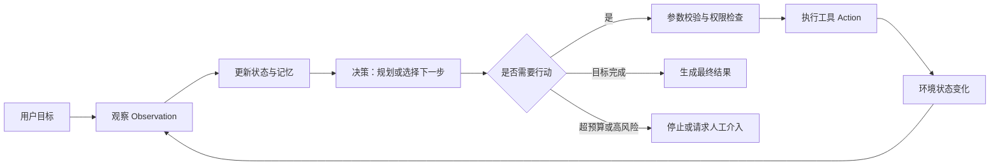
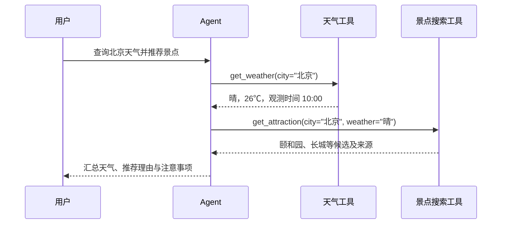
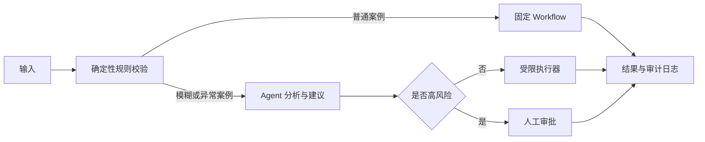

# 第一章 初识智能体

智能体不是“会聊天的模型”，而是一个能在环境中持续感知、决策和行动，并依据反馈推进目标的系统。本章从经典 AI 的 Agent 定义出发，建立 LLM 智能体的基础认知，并用旅行助手说明其最小工程闭环。

> [!info] 笔记定位
> 本文是对 Datawhale《Hello-Agents》第一章的个人学习整理，不是原文复刻。内容在原课程基础上补充了概念边界、生产安全、评估指标和更稳健的工具调用设计。

## 目录

- [Key Takeaways](#key-takeaways)
- [1. 智能体是什么](#1-智能体是什么)
  - [1.1 经典定义](#11-经典定义)
  - [1.2 Agent、LLM、工具与工作流的边界](#12-agentllm工具与工作流的边界)
  - [1.3 传统智能体的决策架构](#13-传统智能体的决策架构)
  - [1.4 LLM 驱动的新范式](#14-llm-驱动的新范式)
  - [1.5 三个互补的分类维度](#15-三个互补的分类维度)
- [2. 任务环境与运行原理](#2-任务环境与运行原理)
  - [2.1 用 PEAS 描述任务环境](#21-用-peas-描述任务环境)
  - [2.2 环境特性决定系统设计](#22-环境特性决定系统设计)
  - [2.3 Agent Loop](#23-agent-loop)
  - [2.4 Thought、Action 与 Observation](#24-thoughtaction-与-observation)
- [3. 最小实践：智能旅行助手](#3-最小实践智能旅行助手)
  - [3.1 任务与工具](#31-任务与工具)
  - [3.2 决策协议](#32-决策协议)
  - [3.3 主循环](#33-主循环)
  - [3.4 三轮执行过程](#34-三轮执行过程)
  - [3.5 从 Demo 到可用系统](#35-从-demo-到可用系统)
- [4. 智能体的协作模式](#4-智能体的协作模式)
  - [4.1 开发者工具与自主协作者](#41-开发者工具与自主协作者)
  - [4.2 单智能体、多智能体与状态图](#42-单智能体多智能体与状态图)
  - [4.3 Workflow 与 Agent](#43-workflow-与-agent)
- [5. 局限、安全与评估](#5-局限安全与评估)
- [6. 本章小结](#6-本章小结)
- [7. 复习与练习](#7-复习与练习)
- [相关笔记](#相关笔记)
- [参考来源](#参考来源)

## Key Takeaways

1. **Agent 是系统，不只是模型**：LLM 通常只是决策组件；工具、记忆、状态、控制循环和安全边界共同构成智能体。
2. **核心闭环是“观察 → 决策 → 行动 → 新观察”**：只有输出文本、不能影响环境的模型调用，通常不构成完整 Agent。
3. **自主性是连续光谱**：从固定流程中的局部选择，到动态规划和自主工具调用，并非简单的“是/否”。
4. **经典分类仍然有效**：反射式、模型式、目标式、效用式描述决策依据；学习能力可以叠加在这些架构之上。
5. **任务环境决定架构**：部分可观察、随机、动态、序贯的环境，需要记忆、重试、监控和持续重规划。
6. **Workflow 与 Agent 不是对立关系**：生产系统常用确定性 Workflow 约束边界，让 Agent 只处理需要语义判断和动态决策的局部。
7. **工具调用必须由受信任的运行时执行**：模型只能提出动作，权限校验、参数验证、超时、重试和审计应由代码负责。
8. **评价 Agent 不能只看准确率**：还要关注任务成功率、成本、延迟、工具调用正确率、安全性、稳定性和可恢复性。

## 1. 智能体是什么

### 1.1 经典定义

在经典人工智能中，**智能体（Agent）**是能够通过传感器感知环境，并通过执行器采取行动，以实现目标或最大化性能指标的实体。

其抽象关系可以写成：

$$
f: P^* \rightarrow A
$$

- $P^*$：截至当前时刻的感知历史（percept sequence）；
- $A$：可采取的行动集合；
- $f$：将感知历史映射为行动的智能体函数。

这一定义包含五个关键概念：

| 要素 | 含义 | 物理世界示例 | 数字世界示例 |
| --- | --- | --- | --- |
| 环境（Environment） | 智能体所处并可受其影响的外部世界 | 道路、车辆、行人 | 文件系统、网页、数据库、API |
| 传感器（Sensors） | 获取环境信息的通道 | 摄像头、雷达、麦克风 | 用户输入、API 响应、日志、检索结果 |
| 执行器（Actuators） | 对环境施加影响的通道 | 方向盘、制动器、机械臂 | 函数调用、写文件、发请求、执行代码 |
| 目标或性能度量 | 判断行动是否有效的标准 | 安全到达、能耗最低 | 任务完成、正确率、成本、延迟 |
| 自主性（Autonomy） | 在授权边界内依据观察和内部状态选择行动 | 自动刹车与变道 | 自主选择工具、调整计划、停止任务 |

> [!note] 自主不等于无限权限
> 自主性描述的是“如何选择行动”，不是“可以做任何事情”。可靠系统必须给 Agent 设置明确的工具白名单、权限边界、预算和人工审批点。

### 1.2 Agent、LLM、工具与工作流的边界

这些概念经常混用，可以用“是否有目标、状态和闭环行动”来区分：

| 概念 | 核心职责 | 是否自主选择下一步 | 是否直接改变环境 |
| --- | --- | --- | --- |
| LLM | 根据上下文预测并生成内容 | 单次调用中有限 | 通常不能 |
| Tool | 执行一个明确操作 | 否 | 可以 |
| Workflow | 按预定义控制流编排步骤 | 通常较低 | 可以 |
| Agent | 围绕目标，根据反馈动态选择行动 | 是，程度可高可低 | 通过工具或执行器可以 |

因此：

- 一次普通问答是 **LLM 调用**，不必然是 Agent；
- “固定调用检索，再调用模型总结”更接近 **Workflow**；
- “根据检索结果判断是否继续搜索、换关键词或结束”开始具备 **Agentic** 特征；
- Agent 可以嵌入 Workflow，Workflow 也可以调用 Agent 节点。

### 1.3 传统智能体的决策架构

经典 AI 常按行动选择机制划分智能体：

| 类型 | 决策依据 | 回答的问题 | 优势 | 局限 | 示例 |
| --- | --- | --- | --- | --- | --- |
| 简单反射式 | 当前感知与条件—动作规则 | “现在看到什么就做什么？” | 快、稳定、成本低 | 无记忆，难处理部分可观察环境 | 恒温器、安全气囊 |
| 基于模型的反射式 | 当前感知 + 内部状态/世界模型 | “世界现在可能是什么状态？” | 能处理不可直接观察的信息 | 模型错误会累积 | 目标跟踪、自动驾驶状态估计 |
| 基于目标式 | 世界模型 + 目标 + 搜索/规划 | “怎样到达目标？” | 能比较行动序列 | 规划成本高 | 路径规划、任务调度 |
| 基于效用式 | 状态效用与不确定性 | “哪个结果总体更好？” | 能权衡时间、风险、成本等冲突目标 | 效用函数难设计 | 风险决策、资源分配 |
| 学习型 | 经验、反馈或奖励 | “怎样通过经验改进策略？” | 能适应环境变化 | 依赖反馈质量，训练与探索有成本 | 强化学习智能体 |

这里有两个重要边界：

1. 这五类并非严格互斥。一个系统可以同时拥有世界模型、效用函数和学习能力。
2. “学习型”更像一种可叠加的能力，而不是与前四类平行且互斥的决策结构。

### 1.4 LLM 驱动的新范式

LLM 为 Agent 提供了通用的语言理解、知识迁移、任务分解和工具选择能力，使开发者可以用自然语言描述目标与约束，而不必为所有情况手写规则。

以“规划一次厦门旅行”为例，LLM Agent 可以：

1. **任务分解**：确认日期和预算 → 查询天气与交通 → 生成行程 → 等待确认；
2. **工具使用**：调用天气、地图、搜索和预订接口获取外部信息；
3. **上下文整合**：将“预算有限”“不吃海鲜”等偏好加入后续判断；
4. **动态修正**：酒店售罄或用户拒绝方案后，重新规划而不是从固定脚本失败退出；
5. **结果合成**：把多个工具结果组织成对用户可读的方案。

LLM Agent 与传统 Agent 的主要差异如下：

| 维度 | 传统智能体 | LLM 驱动智能体 |
| --- | --- | --- |
| 决策核心 | 规则、搜索、规划器、策略网络 | LLM + 提示/上下文 + 控制器 |
| 知识来源 | 显式规则、领域模型、训练策略 | 预训练参数、上下文、检索和工具结果 |
| 输入形式 | 结构化状态居多 | 自然语言与多种非结构化输入 |
| 泛化范围 | 常面向窄领域 | 更容易迁移到开放式语言任务 |
| 可预测性 | 通常较高 | 输出具有概率性，较难完全预测 |
| 主要风险 | 规则覆盖不足、模型失真 | 幻觉、提示注入、错误工具调用、上下文污染 |

> [!warning] 不要把 LLM 当作事实源
> 模型参数中的知识可能过时或错误。涉及实时信息、精确数据或高风险决策时，应通过工具获取证据，并由运行时验证结果。

### 1.5 三个互补的分类维度

#### 按决策时间：反应式、规划式与混合式

| 类型 | 特点 | 适用场景 | 主要代价 |
| --- | --- | --- | --- |
| 反应式（Reactive） | 感知后立即响应，几乎不做长程规划 | 安全控制、实时告警 | 容易短视 |
| 规划式（Deliberative） | 行动前评估多个未来状态和行动序列 | 路线、研究、复杂任务 | 延迟和计算成本高 |
| 混合式（Hybrid） | 快速反应层 + 审慎规划层 | 复杂动态环境 | 架构与协调更复杂 |

现代 LLM Agent 通常采用混合方式：先制定粗粒度计划，再通过“行动—观察”微循环逐步执行；遇到异常时局部重规划。

#### 按知识表示：符号、亚符号与混合系统

- **符号主义**：使用规则、逻辑、知识图谱等显式表示；可审计，但知识维护成本高。
- **亚符号主义**：知识分布在神经网络参数中；模式识别强，但内部机制难解释。
- **神经符号混合**：让神经模型负责感知或语义理解，让符号系统负责约束、验证、规划或执行。

卡尼曼的“系统 1 / 系统 2”可以帮助理解快反应与慢推理，但它是认知心理学类比，不是 AI 架构的一一对应关系。

> [!important] 概念修正
> LLM 生成 JSON、计划或 API 参数，并不能自动证明系统属于严格意义上的神经符号 AI。只有当显式符号表示、逻辑约束或符号推理模块真正参与计算与校验时，称为“神经符号混合系统”才更严谨。

## 2. 任务环境与运行原理

### 2.1 用 PEAS 描述任务环境

PEAS 用于在实现前明确 Agent 的任务边界：

- **P — Performance**：怎样算做得好？
- **E — Environment**：系统在哪个世界中运行？
- **A — Actuators**：它能执行哪些动作？
- **S — Sensors**：它能获得哪些观察？

以智能旅行助手为例：

| PEAS 要素 | 设计内容 |
| --- | --- |
| Performance | 满足预算与偏好、信息准确、行程可执行、响应及时、调用成本可控、无未经确认的消费 |
| Environment | 用户、天气、交通、地图、景点、酒店、票务平台、政策与实时库存 |
| Actuators | 搜索、查询天气、生成路线、创建草案、发起预订请求、向用户提问 |
| Sensors | 用户输入、历史偏好、API 响应、库存与价格变化、工具错误、用户反馈 |

PEAS 的价值不只是列清单，而是提前回答三个工程问题：

1. **成功标准是什么？** 否则 Agent 可能完成了步骤，却没有满足用户目标。
2. **Agent 能看到什么？** 不可观察的信息不能被默认当作事实。
3. **Agent 能做什么？** 高风险执行器必须缩小权限并增加审批。

### 2.2 环境特性决定系统设计

| 环境维度 | 旅行助手的表现 | 对设计的影响 |
| --- | --- | --- |
| 完全 / 部分可观察 | 无法一次获得全部实时库存 | 需要记忆、检索、补问和不确定性标记 |
| 确定 / 随机 | 价格和余票会变化 | 需要重试、幂等、过期时间和执行前复核 |
| 单幕 / 序贯 | 前一步选择影响后续路线和预算 | 需要状态管理与长期计划 |
| 静态 / 动态 | Agent 思考时环境仍可能变化 | 需要超时、重新查询和局部重规划 |
| 单智能体 / 多智能体 | 用户、商家、其他预订者都在行动 | 需要并发冲突处理和状态校验 |
| 已知 / 未知 | API 规则已知，但真实结果不总可预测 | 需要错误处理、探索与降级方案 |

### 2.3 Agent Loop

Agent 通常不是一次性生成答案，而是在预算和停止条件内循环执行：



一个可用的循环至少包含：

- **目标**：当前要完成什么；
- **状态**：已知事实、约束、已完成步骤和待办；
- **记忆**：跨轮或跨会话保存的相关信息；
- **策略/模型**：决定下一步行动；
- **工具**：与外部世界交互；
- **控制器**：限制步骤、时间、成本和权限；
- **停止条件**：成功、失败、超预算或需要人工确认。

### 2.4 Thought、Action 与 Observation

教学中常使用 `Thought → Action → Observation` 描述循环：

```text
Decision: 需要查询北京实时天气。
Action: get_weather(city="北京")
Observation: 北京当前晴，26℃，数据时间为 10:00。
```

三者的职责是：

| 组件 | 含义 | 工程注意点 |
| --- | --- | --- |
| Thought / Decision | 根据当前状态判断下一步 | 生产系统通常只需要简短决策摘要，不应依赖或暴露模型的完整内部推理 |
| Action | 模型提出的工具名和参数 | 必须经过结构校验、权限检查和参数约束 |
| Observation | 环境或工具返回的结果 | 应保留来源、时间、错误类型；不能把不可信网页内容当作系统指令 |

实际开发中应优先使用模型提供的**结构化输出或原生工具调用协议**，而不是用正则表达式解析自由文本。执行工具的代码应与模型隔离：模型负责“建议做什么”，受信任的运行时负责“是否允许以及怎样执行”。

## 3. 最小实践：智能旅行助手

### 3.1 任务与工具

用户任务：

> 查询今天北京的天气，并根据天气推荐一个合适的旅游景点。

最小工具集：

```python
def get_weather(city: str) -> dict:
    """返回城市、天气、温度、观测时间和数据来源。"""

def get_attraction(city: str, weather: str) -> list[dict]:
    """返回适合当前天气的候选景点及推荐理由。"""
```

工具返回结构化数据比直接返回长段自然语言更易验证、裁剪和记录。网络工具还应设置超时，并区分“未找到”“参数错误”“服务不可用”等错误。

### 3.2 决策协议

与其要求模型输出自由格式文本，更稳健的做法是约束为两类决策：

```json
{
  "type": "tool_call",
  "tool": "get_weather",
  "arguments": {"city": "北京"},
  "reason": "需要实时天气作为推荐依据"
}
```

或：

```json
{
  "type": "finish",
  "answer": "今天北京天气晴朗，适合前往颐和园……"
}
```

提示词至少应说明：角色、目标、工具说明、输出 schema、每轮只执行一个动作、停止条件，以及哪些操作必须请求用户确认。

### 3.3 主循环

下面是与具体模型供应商无关的控制逻辑：

```python
MAX_STEPS = 5
state = {
    "goal": "查询北京天气并推荐景点",
    "observations": [],
}

for step in range(MAX_STEPS):
    decision = llm.decide(state)             # 返回已校验的结构化对象

    if decision.type == "finish":
        final_answer = decision.answer
        break

    if decision.tool not in available_tools:
        state["observations"].append({
            "ok": False,
            "error": "tool_not_allowed",
            "tool": decision.tool,
        })
        continue

    arguments = validate_arguments(
        tool=decision.tool,
        arguments=decision.arguments,
    )

    try:
        result = available_tools[decision.tool](**arguments)
        observation = {"ok": True, "tool": decision.tool, "result": result}
    except ToolError as exc:
        observation = {"ok": False, "tool": decision.tool, "error": str(exc)}

    state["observations"].append(observation)
else:
    final_answer = "任务未在步骤预算内完成，需要调整计划或人工处理。"
```

这段代码刻意把以下职责放在模型之外：

- 工具白名单；
- 参数验证；
- 异常处理；
- 最大步骤数；
- 最终停止与降级策略。

### 3.4 三轮执行过程



这个过程体现了四项基本能力：

1. **任务分解**：识别“先天气、后景点”的依赖关系；
2. **工具调用**：选择正确工具并构造参数；
3. **上下文利用**：把天气观察用于下一轮决策；
4. **结果合成**：将多个工具结果组织为最终答复。

### 3.5 从 Demo 到可用系统

原始教学 Demo 使用文本格式和正则解析，适合理解原理，但进入真实项目时需要补齐：

| 风险 | Demo 常见做法 | 更稳健的实现 |
| --- | --- | --- |
| 输出格式漂移 | 正则解析 `Action:` | JSON Schema 或原生 tool calling |
| 密钥泄露 | 在源码中写 API Key | 环境变量或密钥管理服务 |
| 网络卡死 | 无超时请求 | connect/read timeout、有限重试 |
| 无限循环 | 直到模型主动结束 | 步骤、时间、Token、金额四类预算 |
| 重复副作用 | 重试时再次下单 | 幂等键、事务状态、执行前复核 |
| 提示注入 | 直接把网页全文送入模型 | 内容隔离、工具结果标记、指令优先级 |
| 错误不可追踪 | 只打印自然语言 | 结构化日志、trace ID、工具耗时与错误码 |
| 高风险误操作 | 模型可直接执行 | 最小权限、沙箱、人工确认 |

## 4. 智能体的协作模式

### 4.1 开发者工具与自主协作者

| 模式 | 人的角色 | Agent 的角色 | 典型任务 |
| --- | --- | --- | --- |
| 开发者工具 | 持续提出局部需求并审核 | 补全、解释、编辑、测试、检索 | IDE 辅助、代码审查、故障分析 |
| 自主协作者 | 委托高层目标并设置边界 | 规划、执行、检查、汇报 | 研究报告、跨文件开发、数据分析 |

二者的差异主要是**委托粒度、自主性和责任边界**，不是产品名称。即便是同一个编码 Agent，在“补全一行代码”和“完成一个功能并验证”时也处于不同自主性水平。

### 4.2 单智能体、多智能体与状态图

常见架构可以概括为：

1. **单智能体循环**：一个 Agent 负责规划、工具调用和反思；结构简单，但上下文和职责容易膨胀。
2. **多智能体协作**：按研究、编码、审查等角色拆分；有助于隔离上下文和并行处理，但沟通成本、错误传播和一致性问题更突出。
3. **状态图/控制流架构**：把步骤、分支、循环、人工介入和恢复点显式建模；可预测性与可观测性通常更好。

多智能体不是天然更强。只有当任务确实存在可分离的角色、上下文或并行子任务时，拆分才可能带来收益。

### 4.3 Workflow 与 Agent

| 维度 | Workflow | Agent |
| --- | --- | --- |
| 控制流 | 预先定义 | 根据状态动态决定 |
| 可预测性 | 高 | 相对低 |
| 灵活性 | 较低 | 较高 |
| 调试与审计 | 较容易 | 需要完整轨迹与状态记录 |
| 成本与延迟 | 较稳定 | 可能随循环次数波动 |
| 适用任务 | 规则稳定、边界明确、高合规 | 开放输入、路径难预定义、需要语义判断 |

更实用的选择通常是**混合架构**：



例如退款系统可以让 Workflow 处理明确政策，让 Agent 汇总证据、识别异常和生成建议，但把大额退款或政策例外交给人工审批。

## 5. 局限、安全与评估

### 常见局限

- **幻觉**：模型优化目标是生成高概率文本，不是保证事实为真；缺少证据、上下文冲突或工具失败都会放大问题。
- **循环失控**：停止条件不清、观察无新信息或错误恢复策略不当，可能导致重复调用和成本失控。
- **长程任务漂移**：执行轮数增加后，目标、约束和中间事实可能被遗忘或污染。
- **工具误用**：工具描述相似、参数不完整或模型误判时，可能选错工具或产生无效调用。
- **外部内容攻击**：网页、邮件和文档中可能包含提示注入，诱导 Agent 泄露信息或越权执行。
- **不可重复性**：模型与外部环境具有概率性和动态性，同一任务未必产生同样轨迹。

### 安全控制

1. 最小权限和工具白名单；
2. 参数 schema、业务规则和权限的代码级校验；
3. 对写入、支付、删除、发送等副作用操作设置人工确认；
4. 步骤、时间、Token、金额和并发预算；
5. 沙箱、幂等键、回滚或补偿机制；
6. 对不可信内容进行隔离，并保留来源与时间；
7. 全链路记录决策摘要、工具参数、观察、错误和最终结果。

### 评估指标

| 维度 | 示例指标 |
| --- | --- |
| 任务结果 | 端到端任务成功率、约束满足率、人工验收得分 |
| 决策质量 | 工具选择准确率、参数正确率、无效步骤占比 |
| 事实质量 | 引用支持率、事实错误率、信息时效性 |
| 效率 | 平均步骤数、延迟、Token 与 API 成本 |
| 稳定性 | 多次运行成功率、恢复成功率、方差 |
| 安全性 | 越权调用率、危险动作拦截率、敏感数据泄漏率 |
| 人机协作 | 人工接管率、审批命中率、用户满意度 |

准确率只衡量结果的一部分。一个答案正确但调用了错误账户、成本过高或执行了未授权动作的 Agent，仍然是不合格的系统。

## 6. 本章小结

本章建立了理解智能体的基础框架：

- Agent 通过传感器感知环境，通过执行器行动，并在目标或性能指标指导下自主选择下一步；
- LLM 扩展了自然语言理解、规划和工具选择能力，但并未替代运行时控制、安全和事实验证；
- PEAS 用来定义任务环境，Agent Loop 用来描述持续交互机制；
- 反射式、规划式、混合式，以及符号、亚符号等分类是在不同维度描述系统，不能混为一谈；
- Workflow 强调确定性编排，Agent 强调动态决策，生产系统通常结合二者；
- 真正可用的 Agent 需要明确的权限、预算、停止条件、可观测性和多维评估。

一句话总结：

> **Agent = 模型/策略 + 状态与记忆 + 工具 + 运行循环 + 目标 + 安全控制。**

## 7. 复习与练习

### 概念检查

1. 一台高算力计算机为什么不必然是 Agent？
2. “基于模型的反射式”中的模型，与 LLM 中的“语言模型”有什么不同？
3. 为什么学习能力可以叠加到多种智能体架构上？
4. Workflow 和 Agent 的界线为什么不是绝对的？
5. 为什么生产系统不应依赖正则表达式解析自由格式 Action？

### 设计练习

1. 使用 PEAS 描述“智能健身教练”，并判断其环境是否部分可观察、随机、动态和序贯。
2. 为退款系统设计“规则 Workflow + Agent 建议 + 人工审批”的混合架构，明确每一层的责任边界。
3. 扩展旅行助手：加入用户偏好记忆、售罄后的备选方案，以及连续三次拒绝后的策略反思。
4. 为旅行助手设计评估集，至少覆盖正常流程、工具超时、错误参数、提示注入和高风险预订五类场景。

## 相关笔记

- [[../index|Hello-Agents 学习索引]]
- [吴恩达 Agentic AI 课程笔记](../../../../AI/AI%20Developer/Agent/吴恩达%20Agentic%20AI%20课程笔记.md)
- [[AI Agent 的 Harness Engineering]]

## 参考来源

1. Datawhale. [Hello-Agents：第一章 初识智能体](https://github.com/datawhalechina/Hello-Agents/blob/main/docs/chapter1/%E7%AC%AC%E4%B8%80%E7%AB%A0%20%E5%88%9D%E8%AF%86%E6%99%BA%E8%83%BD%E4%BD%93.md). 本笔记主要学习来源，访问于 2026-06-22。
2. Russell, S. J., & Norvig, P. *Artificial Intelligence: A Modern Approach* (4th ed.). Pearson, 2020.
3. Kahneman, D. *Thinking, Fast and Slow*. Farrar, Straus and Giroux, 2011.
4. Anthropic. [Building effective agents](https://www.anthropic.com/research/building-effective-agents). 关于 Workflow、Agent 及组合模式的工程说明。
