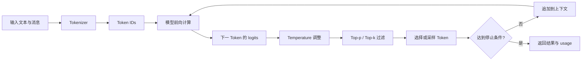
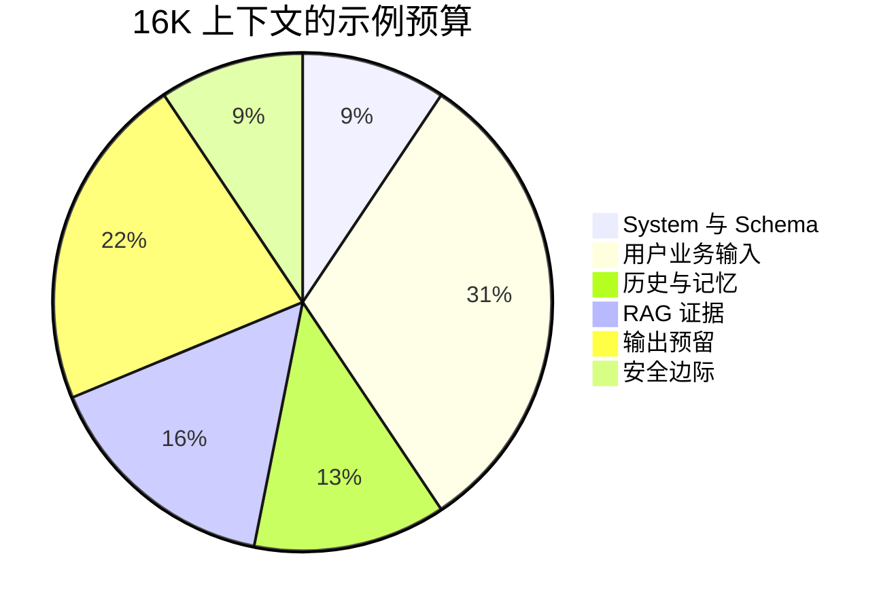
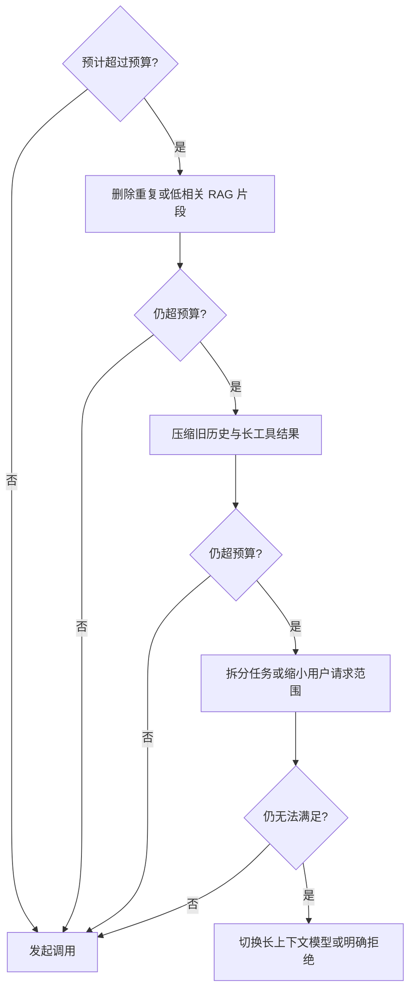
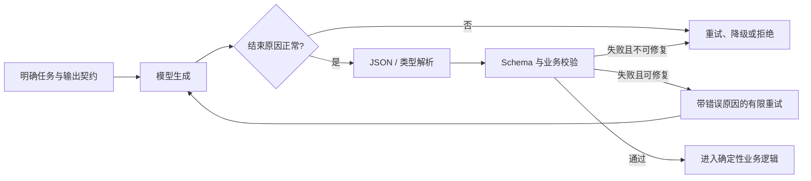

# LLM 运行机制：Token、上下文窗口与采样参数

这篇笔记不讨论模型训练，而是回答 AI 应用开发中最常见的三个问题：为什么低温下结构化输出仍会失败，为什么长上下文会忽略关键内容，以及如何用采样参数与 Token 预算控制稳定性、延迟和成本。

## 目录

[TOC]

## Key Takeaways

- LLM 通过自回归方式逐个生成 Token；每一步都基于当前上下文计算候选 Token 的概率分布。
- Token 是模型处理、上下文容量和 API 计费的共同单位，但不能简单等同于字或词。
- 上下文窗口是一份共享预算：System Prompt、历史消息、RAG 片段、工具 Schema、图片和输出都会竞争容量。
- 长上下文只表示“可以放进去”，不保证模型能同等有效地利用每个位置；信息过多还会增加延迟、成本和攻击面。
- Temperature、Top-p、Top-k 控制解码时的候选分布与候选集合，不能替代 Schema、业务校验和评测。
- `max_tokens` 或 `max_completion_tokens` 是输出上限。预算过小会直接截断 JSON、代码或列表。
- 精确 Token 数、支持的参数、窗口上限、价格和缓存策略都与模型版本及供应商有关，生产环境应以官方文档和 API `usage` 为准。

## 从真实问题建立心智模型

### 三类高频故障

| 现象 | 常见误判 | 更可能的原因 |
| --- | --- | --- |
| `Temperature=0`，JSON 仍解析失败 | 温度不够低 | 输出被截断、Schema 未强制、提示冲突、供应商未提供严格结构化输出 |
| 塞入大量文档后答非所问 | 模型上下文不够长 | 证据被噪声稀释、关键信息位于中间、输入被截断或检索本身错误 |
| 同一请求多次输出不同 | 模型“不稳定” | 概率采样、服务端并行计算、模型版本或系统指令变化 |

这三类问题分别指向三个底层变量：

- **Token**：模型实际读取和生成的基本单位。
- **Context Window**：单次推理可使用的 Token 总预算。
- **Decoding Strategy**：模型如何从候选 Token 中选择下一步输出。

### 自回归生成

LLM 不会一次性写出完整答案。它先根据已有上下文预测下一个 Token，再把新 Token 追加到上下文中，继续预测下一步，直到遇到停止条件。



用概率表示，第 (t) 个 Token 的生成依赖此前所有 Token：

```text
P(x₁, x₂, ..., xₙ) = ∏ P(xₜ | x₁, ..., xₜ₋₁)
```

前面某一步的选择发生变化，后续条件也随之变化，因此差异可能在长输出中逐步放大。

## Token：模型的处理与计量单位

### Token 不是字，也不是词

Tokenizer 会把文本切成 Token，并映射为模型词表中的整数 ID。常见方案包括 BPE、Unigram 等子词算法，其目标是在词表规模、序列长度和未知词处理之间取得平衡。

- 高频片段可能对应一个 Token。
- 生僻词、专业术语、代码和混合语言可能被拆成多个 Token。
- 空格、标点、大小写和换行都可能改变切分结果。
- 同一文本在不同模型或 Tokenizer 中可能得到完全不同的 Token 序列。

因此，`1 Token = 1 个汉字` 或 `1 Token = 1 个英文单词` 都不是可靠规则。

### 如何估算

经验值只能用于早期容量规划：

- 英文常见为每 Token 约 3～4 个字符。
- 中文常见为每 Token 约 1～2 个汉字。
- 代码、JSON、表格、数字、专业术语和中英混排可能明显偏离经验值。

工程上应采用两级策略：

1. 调用前使用与目标模型匹配的 Tokenizer 估算，决定是否裁剪或降级。
2. 调用后读取 API 返回的 `usage`，用于精确计费、监控与容量校准。

> [!warning] 不要跨模型复用估算器
> Token 数与模型词表及消息封装格式相关。即使 API 协议兼容，也不代表 Tokenizer 相同。

### 隐形 Token 开销

模型实际处理的内容通常比用户看到的文本更多：

| 开销 | 说明 |
| --- | --- |
| 消息角色与分隔标记 | System、User、Assistant 等消息的内部封装 |
| 特殊 Token | BOS、EOS、工具调用边界等；具体实现因模型而异 |
| 工具 Schema | 工具名称、描述、参数及返回协议 |
| 结构化输出 Schema | 字段、类型、枚举和约束 |
| 多轮历史 | 历史消息及历史工具调用结果 |
| 多模态输入 | 图片、音频或视频经过供应商编码后的计量单位 |

聊天 API 可能不会直接暴露这些内部标记，但它们通常会反映在输入 Token 用量中。

### 多模态 Token

图片不是零成本输入。供应商通常会按图片尺寸、细节模式、分块策略或内部视觉编码计算费用和上下文占用。

长期有效的工程原则是：

- 图片 Token 必须进入调用预算和成本看板。
- 只需文字时，可以比较“直接视觉理解”和“OCR 后输入文本”的质量、延迟与成本。
- 图片 Token 的具体算法和数量变化较快，不应把某个模型的固定数字写成通用结论。

## 上下文窗口：单次推理的共享预算

### 上下文窗口包含什么

上下文窗口可以理解为 LLM 的运行时工作区。一次调用通常包含：

```text
System Prompt
+ Tool / Output Schema
+ User Input
+ Conversation History
+ RAG Context
+ Tool Results / Memory
+ Multimodal Input
+ Generated Output
```

模型标称的 128K、200K 或更长窗口，不等于业务正文可以使用的容量。窗口是否同时计算输入和输出、最大生成长度是否单独限制，也取决于具体 API。

### 上下文窗口不等于最大输出长度

需要同时检查两个限制：

- **Context Window**：模型在一次推理中可处理的总序列上限。
- **Maximum Output / Completion Tokens**：单次最多生成多少 Token。

即使模型支持很长输入，输出也可能受较小上限约束。参数名可能是 `max_tokens`、`max_completion_tokens` 或供应商自定义字段。

### 长上下文的计算与效果边界

标准稠密 Self-Attention 对序列长度的理论计算复杂度为 (O(N^2))。现代模型会使用 FlashAttention、GQA/MQA、滑动窗口或稀疏注意力等手段降低内存和计算成本，但这不代表长上下文是免费的。

上下文变长后通常会出现：

- 输入预处理和 TTFT 增加。
- 请求成本上升。
- 关键信息被噪声稀释。
- Prompt Injection 和敏感信息暴露面扩大。
- 中间位置的信息召回弱于开头或结尾，即 Lost in the Middle。

> [!note] “能放下”不等于“能用好”
> 上下文窗口描述容量边界，不是准确率承诺。长文本任务应通过真实评测验证不同位置、长度和信息密度下的表现。

### 上下文过载的表现

| 表现 | 排查方向 |
| --- | --- |
| 忽略早期格式要求 | 检查指令层级、位置、冲突和上下文长度 |
| 中间证据未被使用 | 调整证据排序、压缩内容并做位置敏感性测试 |
| RAG 答非所问 | 先检查召回与 Rerank，再检查上下文噪声 |
| 回答后半段漂移 | 检查输出长度、停止条件和任务是否应拆分 |
| TTFT 或成本突增 | 按组成拆分输入 Token，检查历史、Schema 和 Top-K |

## Token 预算

### 基本公式

最小约束可以写成：

```text
context_window >= estimated_input_tokens + reserved_output_tokens + safety_margin
```

其中输入至少包括：

```text
input_tokens = system
             + tool_and_output_schema
             + user_input
             + conversation_history
             + rag_context
             + tool_results_and_memory
             + multimodal_input
```

对于会产生隐藏或显式 reasoning tokens 的模型，预算口径以供应商文档和 API `usage` 为准，不应假设所有模型都按同一方式计算。

### 预算分配示例

下面仅展示思路，不是固定比例：



预算应从业务输出倒推，而不是把所有输入塞完后再看剩余空间：

1. 根据响应契约确定输出上限。
2. 预留 10%～20% 安全边际；实际比例需要用生产 usage 校准。
3. 为不可删除的 System Prompt、Schema 和当前用户任务保留容量。
4. 将剩余预算分配给 RAG、历史、记忆和工具结果。
5. 超预算时执行可解释的降级策略，并记录被删除的内容。

### 推荐淘汰顺序

淘汰顺序必须按业务设计，下面是常见起点：



核心指令、权限约束和当前任务不可被静默截断。相关策略见 [[../02-Prompt 与上下文/上下文工程]]。

## 从 logits 到下一 Token

### Logits 与 Softmax

模型会为词表中的每个候选 Token 计算一个未归一化分数，即 logits。Softmax 将 logits 转换为概率分布：

```text
pᵢ = exp(zᵢ) / Σⱼ exp(zⱼ)
```

Temperature、Top-p、Top-k 和 Penalty 都作用于“得到 logits 后、选出下一 Token 前”的解码阶段。

### Temperature

Temperature (T) 通过缩放 logits 改变概率分布：

```text
pᵢ(T) = softmax(zᵢ / T)
```

- (T < 1)：分布更尖锐，更偏向高概率候选。
- (T = 1)：保持原始分布。
- (T > 1)：分布更平坦，低概率候选更容易被选中。

低温提高稳定性，但不能保证业务正确，也不能修复截断、指令冲突或无效 Schema。

### Top-k 与 Top-p

| 参数 | 过滤方式 | 优点 | 风险 |
| --- | --- | --- | --- |
| Top-k | 只保留概率最高的固定 k 个候选 | 简单、候选规模可控 | 不能适应分布忽然集中或分散 |
| Top-p | 保留累计概率达到阈值的最小候选集合 | 候选数随分布动态变化 | 与 Temperature 同时调节时不易归因 |

初期不要同时大幅调整 Temperature、Top-p 和 Top-k。一次只改变一个变量，才能知道输出变化由什么导致。

### Penalty 参数

不同供应商的精确定义可能不同，常见语义如下：

| 参数 | 目标 | 主要风险 |
| --- | --- | --- |
| Repetition Penalty | 降低已出现 Token 再次出现的概率 | 破坏 JSON、XML、代码等必要重复结构 |
| Presence Penalty | 鼓励引入未出现过的内容 | RAG 问答可能偏离证据、增加幻觉 |
| Frequency Penalty | 出现次数越多，惩罚越强 | 长文术语一致性和字段重复可能受损 |

结构化输出和忠实型 RAG 问答应优先保持默认值，先用 Schema、证据约束和输出校验解决问题。

### Seed 与“确定性”

部分供应商提供 `seed`，用于提高相同输入与参数下的可复现性。但它通常只是 best effort，以下变化仍会影响结果：

- 模型权重或服务版本变化。
- 系统 Prompt、工具 Schema 或消息序列变化。
- 推理基础设施和并行计算差异。
- 供应商对参数的具体实现变化。

因此，生产测试不应对自由文本做严格字符串相等断言。确定性业务逻辑应使用 Mock；真实模型调用用于评测和冒烟测试。

## 停止条件与输出截断

### 输出上限

最大输出 Token 是硬上限。达到上限时，模型可能在任意位置停止，造成：

- JSON 缺少闭合括号。
- 代码块、列表或句子不完整。
- 结构化结果缺少后半部分字段。

调用端应记录供应商返回的结束原因，例如 `stop`、`length`、`content_filter` 或对应枚举。检测到长度截断时，不要把半成品直接传给下游。

### Stop Sequences

Stop Sequence 在匹配指定文本时提前结束生成。它适合边界明确的协议，但设计不当会误匹配正常内容。

使用前应覆盖：

- 停止词出现在用户内容中的情况。
- 多字节字符和流式分片跨边界的情况。
- 停止词是否出现在最终返回内容中。

### 推理模型的差异

推理模型可能单独统计 reasoning tokens，也可能把它们纳入 completion 用量；部分模型还会忽略 Temperature 或 Penalty 参数。不能将某个模型的行为泛化到所有供应商。

工程上需要在模型注册信息中记录：

- 支持的采样参数。
- 输入、输出和 reasoning tokens 的计量口径。
- 最大输入、最大输出和总上下文限制。
- 是否返回 reasoning content，以及它是否应进入下一轮历史。

## 采样参数配置起点

下面是实验起点，不是跨模型通用配置：

| 场景 | Temperature | Top-p / Top-k | Penalty | 更重要的工程措施 |
| --- | --- | --- | --- | --- |
| JSON / 信息提取 | 0～0.2 | 保持供应商默认 | 默认 | Strict Schema、解析校验、截断检测、有限重试 |
| 忠实型 RAG 问答 | 0～0.3 | 默认或较保守 | 不建议 Presence Penalty | 引用证据、拒答规则、Faithfulness 评测 |
| 分类 / 路由 | 0 或最低可用值 | 默认 | 默认 | 枚举约束、置信区间与兜底路由 |
| 技术分析 / 摘要 | 0.2～0.7 | 可从 0.9 附近实验 | 默认 | Golden Set、事实与格式校验 |
| 创意写作 / 头脑风暴 | 0.7～1.2 | 可适度放宽 | 按需实验 | 接受多样性，隔离其业务执行权限 |
| 推理模型 | 按官方支持配置 | 按官方支持配置 | 按官方支持配置 | 重点控制任务、预算、工具和最终输出契约 |

如果供应商只建议调 Temperature 或 Top-p 之一，应遵循其模型文档。参数范围和默认值也可能不同。

## 稳定输出依赖工程闭环

采样参数只影响“如何生成”，不能把概率模型变成确定性接口。结构化输出应采用以下链路：



更完整的实现见 [[大模型结构化输出：从 JSON 契约到 Function Calling 落地]]。

## 成本与 Prompt Caching

### 成本核算

输入、输出、缓存读取和 reasoning tokens 可能使用不同价格。具体价格变化频繁，长期笔记不保存某个时间点的价格表，而应保存计算方法：

```text
request_cost = input_tokens × input_unit_price
             + output_tokens × output_unit_price
             + reasoning_tokens × reasoning_unit_price
             + cache_write_tokens × cache_write_unit_price
             + cache_read_tokens × cache_read_unit_price
```

并非所有供应商都会返回上述全部字段。成本服务应保留带生效时间的模型价格版本，避免历史账单被新价格重算。

### Prompt Caching

Prompt Caching 通常复用请求中的稳定前缀。要提高命中率：

1. 将稳定的 System Prompt 和工具定义放在前面。
2. 将变化频繁的用户输入放在后面。
3. 保证序列化结果稳定，避免无意义的空格、字段顺序和时间戳变化。
4. 监控缓存写入、读取 Token 和实际折扣，验证优化是否生效。

缓存最小前缀、有效期、写入费用和折扣都由供应商决定。RAG 片段只有在内容和顺序稳定时才可能有效复用。

## 流式输出、TTFT 与 Logprobs

### 流式输出

流式输出让客户端更早看到结果，主要优化感知延迟：

- **TTFT**：从请求发出到收到第一个 Token 的时间。
- **Inter-Token Latency**：相邻输出块的时间间隔。
- **E2E Latency**：完整请求总耗时。

流式不会自动减少总 Token、模型计算量或费用。结构化输出流式传输时，前端只能把片段视为增量文本，不能在结束前假设 JSON 完整。

### Logprobs

部分模型可以返回候选 Token 的对数概率。它适合分析模型在局部 Token 选择上的分布，例如比较候选标签或发现输出分布漂移。

> [!warning] Logprobs 不是事实置信度
> 模型可以非常“确信”地生成错误内容。未经任务级校准，不应把平均 logprob 直接解释为答案正确概率或自动审批依据。

## 故障排查清单

| 问题 | 优先检查 | 处理策略 |
| --- | --- | --- |
| JSON 偶发破损 | 结束原因、输出预算、Strict Schema 支持 | 增加合理输出预算，启用严格 Schema 和服务端校验 |
| 长文忽略关键指令 | 输入组成、指令位置、冲突、证据排序 | 减少噪声，将不可违反约束置于明确指令层并做回归测试 |
| RAG 证据未使用 | 召回结果、Rerank、Chunk 数和位置 | 先修检索，再减少上下文和调整排序 |
| 输出差异过大 | 模型版本、参数、Prompt 版本 | 固定版本与参数，使用 Golden Set 判断业务波动 |
| 模型不断重复 | Stop、输出长度、Prompt 和 Penalty | 先缩短任务和明确终止条件，再谨慎调整 Penalty |
| 成本突然升高 | 历史、RAG Top-K、Schema、输出和 reasoning 用量 | 按输入组成归因，设置单请求和租户预算 |
| TTFT 突然升高 | 上下文长度、图片、缓存命中和模型路由 | 对照 Trace 和模型版本，分离输入处理与生成耗时 |

## 生产可观测字段

至少记录以下信息，并对敏感输入做脱敏：

- 模型供应商、模型名称和可识别的模型版本。
- Prompt 版本、工具 Schema 版本、知识库或检索策略版本。
- Temperature、Top-p、Top-k、Penalty、Seed 和输出上限。
- 输入、输出、缓存与 reasoning Token 用量（供应商支持时）。
- 结束原因、重试次数、限流和降级原因。
- TTFT、E2E 延迟、流式中断位置。
- 输入预算各组成部分，而不只是总 Token。
- 结构化解析、Schema 校验与业务校验结果。

## 实践与验证

### 实验 1：Tokenizer 差异

- [ ] 选择中文、英文、代码、JSON 和中英混排样本。
- [ ] 使用目标模型的官方 Tokenizer 统计。
- [ ] 比较经验估算与 API `usage`，记录误差。

### 实验 2：长上下文位置敏感性

- [ ] 将同一关键事实分别放在开头、中间和结尾。
- [ ] 在不同上下文长度下重复测试。
- [ ] 记录召回正确率、TTFT 和输入 Token。

### 实验 3：采样参数矩阵

- [ ] 固定模型、Prompt 和输入，一次只调整一个参数。
- [ ] 比较输出格式通过率、内容一致性和任务指标。
- [ ] 不使用肉眼观感代替 Golden Set。

### 实验 4：截断与恢复

- [ ] 刻意降低最大输出 Token，复现半截 JSON。
- [ ] 验证 `finish_reason=length` 或供应商等价信号。
- [ ] 确认半成品不会进入下游业务系统。

### 实验 5：Prompt Caching

- [ ] 固定前缀并批量执行一组请求。
- [ ] 改变消息顺序或前缀内容，观察命中变化。
- [ ] 通过实际 usage 和费用验证收益。

## 注意点与边界

- 具体模型价格、Tokenizer 压缩率、窗口上限、图片 Token 算法、缓存折扣和参数支持情况都属于时效性数据，使用前应查询官方文档。
- Temperature 推荐区间是实验起点，不是模型无关的最佳实践。
- 长上下文性能不能只用单个“针尖测试”判断，应覆盖任务分布、证据位置与上下文噪声。
- Token 优化不能以删除权限约束、关键证据或业务契约为代价。
- 自由文本的随机性不等于不可测试；应把断言提升到格式、事实、引用、工具轨迹和业务成功率层面。

## 相关页面

- [[大模型结构化输出：从 JSON 契约到 Function Calling 落地]]
- [[../02-Prompt 与上下文/上下文工程]]
- [[../02-Prompt 与上下文/大模型提示词工程（Prompt Engineering）是什么？提示词技巧有哪些？]]
- [[../03-RAG/RAG 检索优化]]
- [[../05-工程化/大模型网关]]
- [[../05-工程化/AI 应用评测体系]]
- [[../Java 后端转 AI 应用开发学习路线]]

## 参考来源

- JavaGuide，LLM 运行机制：<https://javaguide.cn/ai/llm-basis/llm-operation-mechanism.html>
- OpenAI Tokenizer：<https://platform.openai.com/tokenizer>
- [[.raw/articles/JavaGuide LLM 运行机制来源记录]]

## 待确认

- 在选定生产模型后，补充其官方 Tokenizer、上下文和输出限制文档。
- 在实际 Java SDK 中确认 usage、cached tokens、reasoning tokens 和结束原因的字段映射。
- 用项目 Golden Set 校准本页的参数起点与 Token 安全边际。
