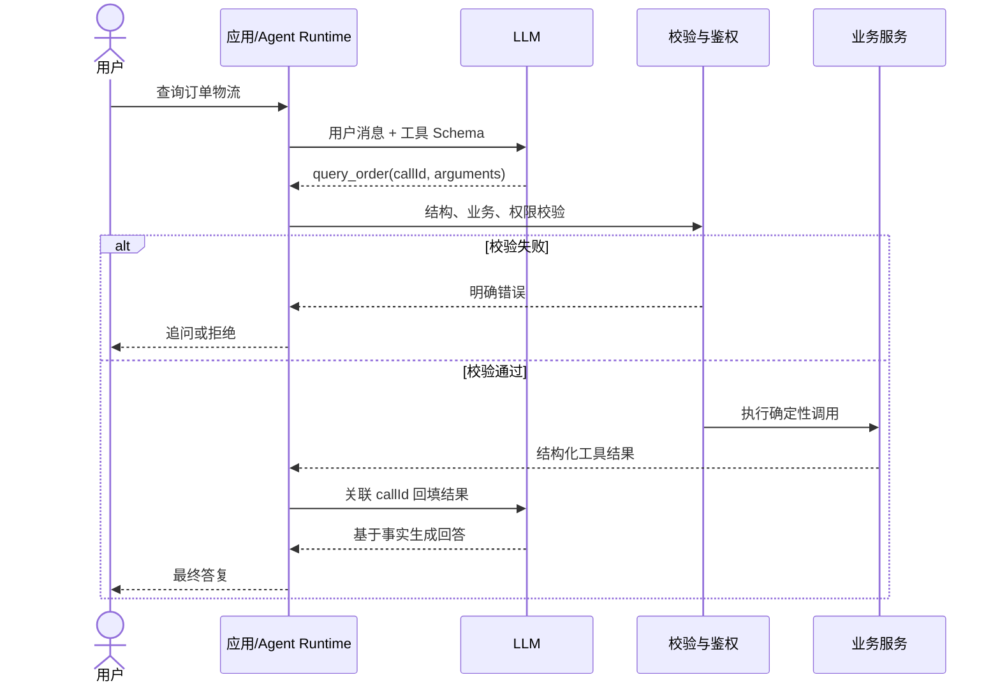
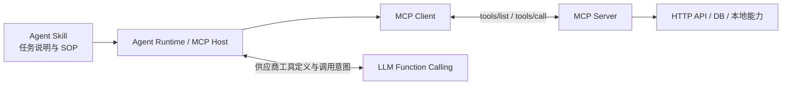
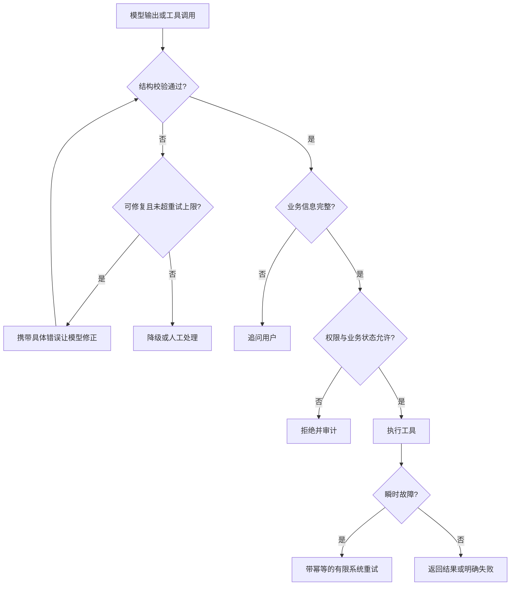

# 大模型结构化输出：从 JSON 契约到 Function Calling 落地

“请返回 JSON”只是在自然语言里表达期望，不是后端可以信任的工程契约。要让模型输出进入分类、抽取、RAG 或 Agent 链路，必须把生成约束、服务端校验、工具执行和安全治理分层设计。

## 目录


## Key Takeaways

- **JSON Mode 管语法，JSON Schema 描述契约，Structured Outputs 把契约前移到生成阶段。** 三者不能混用，也都不能替代服务端业务校验。
- **Function Calling 不等于函数已执行。** 模型只生成工具名和参数，参数校验、鉴权、执行、幂等、审计均由应用或 Agent Runtime 负责。
- **MCP 标准化工具发现与调用，HTTP API 提供确定性业务能力，Skill 描述更高层的任务流程。** 它们是相邻层次，不是互相替代的同类方案。
- 面向模型的 Schema 应尽量简单、可移植；服务端可以使用更完整的 JSON Schema、Bean Validation 和业务规则做二次约束。
- `userId`、`tenantId`、权限、幂等键等可信运行时元数据不应由模型生成，应从认证上下文或服务端产生。
- 校验失败要按原因处理：格式错误有限重试，信息不足追问用户，越权直接拒绝，瞬时工具错误才考虑带幂等的系统重试。

## 一、为什么“请返回 JSON”不可靠

自然语言 Prompt 只能表达意图，不能保证程序可消费性。常见故障如下：

| 故障类型 | 表现 | 后端风险 | 主要防线 |
| --- | --- | --- | --- |
| 格式漂移 | JSON 前后出现解释、Markdown 代码块 | 解析失败 | JSON Mode 或 Structured Outputs |
| 字段缺失 | 省略必填字段 | DTO、规则引擎或数据库链路中断 | `required` + 服务端校验 |
| 类型错误 | 布尔值、数字被输出成字符串 | 宽松转换掩盖上游错误 | 严格反序列化与 Schema 校验 |
| 枚举越界 | 输出 `URGENT`，系统只认识 `HIGH` | 路由和状态机异常 | `enum` + 明确的未知状态 |
| 边界条件崩溃 | 模糊输入或注入指令让模型放弃格式 | 输出不可控或越权调用 | 指令隔离、原生约束、权限控制 |
| 截断 | JSON 缺右括号或列表未结束 | 语法合法性丢失 | 输出预算、终止原因检查、降级 |

例如下面的输出是合法 JSON，却不是合法业务数据：

```json
{
  "category": "pay",
  "priority": "urgent",
  "confidence": "very high"
}
```

因此结构化输出不能只问“能不能解析”，还要问：字段是否完整、类型是否严格、值域是否合法、业务状态是否允许、调用者是否有权限。

## 二、从语法到执行的四层契约


### 2.1 JSON Mode：保证“像 JSON”

JSON Mode 通常保证输出是合法 JSON，但不保证字段齐全、类型正确或枚举合法。它适合简单输出，不能单独承担生产级数据契约。

### 2.2 JSON Schema：描述“应该是什么”

JSON Schema 用来声明对象字段、类型、必填项、枚举和额外属性等规则。它是契约描述规范，本身既不生成内容，也不执行工具。

常用关键字：

| 关键字 | 作用 | 工程建议 |
| --- | --- | --- |
| `type` | 声明类型 | 对每个对象和字段显式声明 |
| `properties` | 声明对象属性 | 字段保持原子化 |
| `required` | 声明必填字段 | 未知值用 `null` 或状态表达，不用缺字段表达 |
| `enum` | 限制离散值域 | 分类、状态、风险等级优先使用 |
| `additionalProperties` | 控制未声明字段 | 模型输出通常设为 `false` |
| `minimum` / `maximum` | 限制数值范围 | 置信度、金额等仍需业务层复核 |
| `pattern` / `format` | 限制字符串格式 | 供应商支持度不同，服务端应再次校验 |

### 2.3 Structured Outputs：在生成阶段遵守契约

Structured Outputs 是供应商 API 的结构化生成能力。它接收 JSON Schema 或类似定义，在生成阶段让结果贴合指定结构。它降低结构错误率，但不负责业务真实性、权限、状态流转和工具执行。

### 2.4 服务端执行契约：最终可信边界

无论模型侧约束多强，服务端仍要完成：

1. JSON 解析和结构校验。
2. 业务规则校验，例如订单状态是否允许退款。
3. 身份、租户和数据权限校验。
4. 幂等、超时、重试和审计。
5. 工具结果校验与敏感信息过滤。

## 三、核心概念边界

| 能力 | 本质 | 解决的问题 | 谁执行 | 不能保证什么 |
| --- | --- | --- | --- | --- |
| JSON Mode | 输出格式开关 | 生成合法 JSON | 模型 | 字段和业务语义正确 |
| JSON Schema | 数据结构规范 | 描述字段、类型和值域 | 校验器或生成系统使用 | 自动生成和外部调用 |
| Structured Outputs | 模型 API 能力 | 让生成结果符合 Schema | 模型侧生成 | 业务真实性与权限 |
| Function/Tool Calling | 工具调用意图机制 | 自然语言转工具名和参数 | 模型生成，应用执行 | 工具一定该被执行 |
| MCP | 应用层协议 | 标准化工具发现、调用和结果返回 | MCP Host、Client、Server | 模型推理和业务授权 |
| HTTP API | 确定性业务接口 | 实际查询或写入业务系统 | 后端服务 | 自然语言理解 |
| Agent Skill | 任务说明与 SOP | 注入上下文并编排复杂步骤 | Agent Runtime | 通用协议或固定工具机制 |

一句话理解：**Function Calling 生成调用意图，MCP 规范工具接入，HTTP API 执行业务，Skill 组织任务流程。**

## 四、响应结构化输出

工单分类、信息抽取和风险打分等任务，只需要模型返回结构化结果，不需要访问外部系统，优先考虑 Structured Outputs。

```json
{
  "type": "object",
  "properties": {
    "schemaVersion": {
      "type": "string",
      "enum": ["ticket_classification_v1"]
    },
    "category": {
      "type": "string",
      "enum": ["PAYMENT", "LOGISTICS", "AFTER_SALE", "ACCOUNT", "NEED_MORE_INFO"],
      "description": "信息不足且无法判断时选择 NEED_MORE_INFO。"
    },
    "priority": {
      "type": "string",
      "enum": ["LOW", "MEDIUM", "HIGH"]
    },
    "confidence": {
      "type": "number",
      "minimum": 0,
      "maximum": 1
    },
    "reason": {
      "type": "string"
    }
  },
  "required": ["schemaVersion", "category", "priority", "confidence", "reason"],
  "additionalProperties": false
}
```

### 供应商能力边界（核验于 2026-06-22）

- OpenAI 的 strict 工具模式要求对象关闭 `additionalProperties`，并把 `properties` 中的字段列入 `required`；仅支持 JSON Schema 子集。
- Anthropic 当前提供 strict tool use，可约束工具参数匹配输入 Schema。
- Gemini Structured Output 支持 JSON Schema 子集，官方文档说明不受支持的属性可能被忽略。
- 各厂商对 `pattern`、`format`、组合关键字和递归引用的支持不同。生产使用前必须核对目标模型的 supported schema 文档。

因此，正式系统应维护两份相关但职责不同的 Schema：

- **模型侧 Schema**：使用供应商支持的可移植子集，重点限制字段、类型、必填和枚举。
- **服务端 Schema**：可增加正则、长度、跨字段规则和 Bean Validation，作为最终防线。

## 五、Function Calling 的完整链路

Function Calling 的输出不是业务结果，而是“建议调用哪个工具、参数是什么”。



完整步骤：

1. 应用注册工具名、用途描述和参数 Schema。
2. 模型根据用户意图选择工具并生成参数。
3. 应用保存并原样关联供应商返回的调用 ID。
4. 服务端校验参数、身份、租户、资源归属和业务状态。
5. 应用调用 HTTP API、数据库或内部服务。
6. 应用把工具结果与调用 ID 回填模型。
7. 模型基于工具事实生成最终回答。

> [!warning] 执行权边界
> 模型选择工具不代表系统应该执行。应用必须拥有最终决策权，并对工具建立白名单和风险策略。

## 六、MCP、Function Calling 与业务 API 如何协作



典型转换过程：

1. Runtime 通过 MCP `tools/list` 发现工具。
2. Runtime 把 MCP 工具定义转换为目标模型的 Function Calling 格式。
3. 模型返回工具调用意图。
4. Runtime 将其转换为 MCP `tools/call` 请求。
5. MCP Server 调用真实业务 API，并把结果返回 Runtime。

MCP 解决跨客户端和跨工具提供方的标准化，不会自动解决权限、输入验证、沙箱、审批和审计。

## 七、Schema 设计原则

### 7.1 字段保持原子化

不要把分类、优先级和动作混在一个字符串里：

```json
{
  "category": "PAYMENT",
  "priority": "HIGH",
  "needManualReview": true,
  "reason": "用户已支付但订单状态未同步"
}
```

### 7.2 明确未知状态

未知不是解析异常。可使用：

- `NEED_MORE_INFO` 表示必须追问。
- `null` 表示契约允许但当前未知。
- 独立 `status` 字段表达业务分支。

不要用字段缺失暗示未知，也不要让模型为满足 `required` 编造值。

### 7.3 字段描述写清边界

描述应说明“何时使用、何时不用、信息不足怎么办”，而不只是重复字段名。工具说明同样要写明适用场景、禁止场景和副作用。

### 7.4 枚举优先于自由文本

分类、状态、动作和风险等级优先使用 `enum`。枚举扩展属于契约变更，要评估旧消费者是否认识新值。

### 7.5 Schema 与 Prompt 一起版本化

记录 `promptVersion`、`schemaVersion`、模型版本和解析代码版本。新增字段、删除字段和枚举扩展均应灰度验证。

### 7.6 可信元数据由运行时产生

以下字段不应交给模型生成：

- `userId`、`tenantId`、角色和 ACL。
- traceId、审批状态和风控结论。
- 写操作的 `idempotencyKey`。
- 服务端时间、签名和内部资源定位信息。

这些值必须来自认证上下文、业务数据库或服务端运行时。

## 八、失败处理：重试、追问还是拒绝



| 失败类型 | 正确处理 | 不应做什么 |
| --- | --- | --- |
| JSON 解析或 Schema 失败 | 带具体错误让模型修正 1～2 次 | 原样无限重跑 |
| 缺少订单号等业务信息 | 追问用户 | 让模型猜测 |
| 权限失败 | 立即拒绝并审计 | 换个参数继续尝试 |
| 工具超时或限流 | 满足幂等条件时有限重试 | 让模型编造成功结果 |
| 永久业务错误 | 返回明确错误码 | 把错误包装成成功 |
| 非关键字段缺失 | 契约允许时采用默认值并告警 | 静默吞掉所有异常 |

校验错误重试 Prompt 应包含字段路径、失败原因和原始输出，并要求只修复结构。重试仍失败时进入人工队列、规则引擎或明确降级。

## 九、工具调用安全

### 三层校验

1. **结构校验**：类型、必填、枚举、长度和格式。
2. **业务校验**：资源是否存在、状态是否允许、金额是否合理。
3. **权限校验**：身份、角色、租户、对象归属和数据范围。

### 风险分级

| 风险 | 示例 | 最低控制要求 |
| --- | --- | --- |
| 低 | 天气、公开文档查询 | 限流、超时、日志 |
| 中 | 订单、用户资料查询 | 身份、租户和数据范围校验 |
| 高 | 退款、发券、改地址、发短信 | 二次确认、幂等、审计、最小权限 |
| 极高 | 删除数据、任意 SQL、批量操作 | 默认禁用，人工审批或专用后台 |

高风险动作适合拆成准备与确认两步，例如 `prepare_refund` 只生成预案，`confirm_refund` 在可信确认后执行。

### 其他安全底线

- 工具名采用白名单，未知工具直接拒绝。
- 写操作由服务端生成幂等键，并使用唯一约束或幂等存储。
- 查询工具设置超时；写操作只有在可安全重试时才重试。
- 工具结果也属于不可信输入，回填模型前要校验、截断和脱敏。
- 审计日志中的参数和结果必须脱敏，不能原样记录密钥、PII 或完整业务数据。

## 十、Java 示例：可校验的订单查询工具

模型只负责生成业务参数：

```json
{
  "type": "object",
  "properties": {
    "orderId": {
      "type": "string",
      "description": "用户明确提供或经可信订单列表解析出的订单号。"
    },
    "includeLogistics": {
      "type": "boolean",
      "description": "用户询问发货、配送、签收或快递状态时为 true。"
    }
  },
  "required": ["orderId", "includeLogistics"],
  "additionalProperties": false
}
```

`userId`、`tenantId` 来自认证上下文；查询工具不需要模型生成幂等键。服务端可以对订单号追加正则和业务规则。

```java
public final class ToolCallDispatcher {
    private static final Set<String> ALLOWED_TOOLS = Set.of("query_order");

    private final ObjectMapper objectMapper;
    private final JsonSchema queryOrderSchema;
    private final OrderService orderService;
    private final PermissionService permissionService;
    private final AuditLogService auditLogService;

    public ToolResult dispatch(ToolCall call, UserContext context) {
        Instant startedAt = Instant.now();
        ToolResult result;

        if (!ALLOWED_TOOLS.contains(call.name())) {
            result = ToolResult.failed("UNSUPPORTED_TOOL", "不支持的工具");
            audit(call, context, result, startedAt);
            return result;
        }

        try {
            result = handleQueryOrder(call.argumentsJson(), context);
        } catch (JsonProcessingException ex) {
            result = ToolResult.failed("INVALID_JSON", "工具参数不是合法 JSON");
        } catch (ToolTimeoutException ex) {
            result = ToolResult.failed("TOOL_TIMEOUT", "订单服务暂时不可用");
        } catch (Exception ex) {
            result = ToolResult.failed("TOOL_EXECUTION_FAILED", "工具执行失败");
        }

        audit(call, context, result, startedAt);
        return result;
    }

    private ToolResult handleQueryOrder(String json, UserContext context)
            throws JsonProcessingException {
        JsonNode input = objectMapper.readTree(json);
        Set<ValidationMessage> violations = queryOrderSchema.validate(input);
        if (!violations.isEmpty()) {
            return ToolResult.failed("INVALID_ARGUMENTS", format(violations));
        }

        QueryOrderArgs args = objectMapper.treeToValue(input, QueryOrderArgs.class);
        if (!args.orderId().matches("^O[0-9]{12,20}$")) {
            return ToolResult.failed("INVALID_ORDER_ID", "订单号格式错误");
        }
        if (!permissionService.canReadOrder(
                context.userId(), context.tenantId(), args.orderId())) {
            return ToolResult.failed("FORBIDDEN", "无权查询该订单");
        }

        OrderView order = orderService.queryOrder(
                context.tenantId(), args.orderId(), args.includeLogistics());
        if (order == null) {
            return ToolResult.failed("ORDER_NOT_FOUND", "未查询到订单");
        }

        return ToolResult.success(new OrderToolData(
                order.orderId(), order.status(), order.amount(),
                order.paidAt(), order.logistics()));
    }

    private void audit(
            ToolCall call, UserContext context, ToolResult result, Instant startedAt) {
        auditLogService.record(new AuditEvent(
                call.callId(), context.userId(), context.tenantId(), call.name(),
                redact(call.argumentsJson()), result.code(), result.success(), startedAt));
    }

    public record ToolCall(String callId, String name, String argumentsJson) {}
    public record QueryOrderArgs(String orderId, boolean includeLogistics) {}
    public record UserContext(String userId, String tenantId) {}
    public record OrderToolData(
            String orderId, String status, BigDecimal amount,
            Instant paidAt, LogisticsView logistics) {}
    public record ToolResult(boolean success, String code, Object data, String message) {
        static ToolResult success(Object data) {
            return new ToolResult(true, "OK", data, "");
        }
        static ToolResult failed(String code, String message) {
            return new ToolResult(false, code, null, message);
        }
    }
}
```

示例重点：

- 未知工具在分发前拒绝。
- 先做 Schema 校验，再做格式、业务和权限校验。
- 返回 typed record，避免 `Map.of` 遇到可空字段时抛出异常。
- 审计参数先脱敏，调用 ID 用于关联模型调用和工具结果。
- 真实项目还要补充超时、熔断、指标和安全的错误映射。

## 十一、可观测性与版本治理

一次工具调用至少应关联以下字段：

| 分类 | 建议字段 |
| --- | --- |
| 请求 | `traceId`、`userId`、`tenantId`、场景 |
| 模型 | provider、model、promptVersion、schemaVersion |
| 调用 | callId、工具名、脱敏参数、校验结果 |
| 安全 | 鉴权结果、审批结果、风险等级 |
| 执行 | 下游服务、结果码、重试次数、耗时 |
| 输出 | 终止原因、最终响应状态、降级方式 |

重点指标包括：Schema 首次通过率、修正成功率、工具选择准确率、参数准确率、越权拒绝数、工具超时率、不必要调用率和人工接管率。

## 十二、方案选择

| 需求 | 推荐方案 |
| --- | --- |
| 轻量 JSON 且字段约束弱 | JSON Mode + 服务端校验 |
| 分类、抽取、评分 | Structured Outputs + JSON Schema |
| 查询或操作外部系统 | Function/Tool Calling + 服务端执行层 |
| 多客户端共享大量工具 | MCP + Runtime 适配模型工具格式 |
| 固定的复杂任务 SOP | Agent Skill + Workflow/工具组合 |

不要因为工具数量多就默认上 MCP，也不要因为能 Function Calling 就把所有业务能力暴露给模型。选择依据是复用范围、执行风险和治理需求。

## 十三、上线检查清单

### Schema 与模型

- [ ] 字段原子化，枚举覆盖未知或信息不足状态。
- [ ] `required` 和 `additionalProperties` 明确。
- [ ] 模型侧 Schema 只使用目标供应商支持的子集。
- [ ] 输出 Token 足够，检查截断、拒绝和异常终止原因。
- [ ] Prompt、Schema、模型和解析代码均可追踪版本。

### 服务端执行

- [ ] 工具白名单、结构校验、业务校验和权限校验完整。
- [ ] 用户、租户和幂等信息来自可信上下文。
- [ ] 写操作可幂等，高风险操作需要二次确认或人工审批。
- [ ] 工具超时后短路，不允许模型猜测结果。
- [ ] 输入、工具结果和审计日志均做脱敏与长度限制。

### 失败与评测

- [ ] 格式修正重试有次数和总耗时上限。
- [ ] 信息不足、越权、瞬时故障和永久故障分别处理。
- [ ] 降级路径包括追问、规则兜底或人工队列。
- [ ] 保存失败样本，持续回归工具选择和参数准确率。

## 十四、常见误区

1. **Temperature 为 0 就一定稳定**：它不能解决 Schema 不完整、截断、冲突指令、模型升级和服务端业务错误。
2. **Structured Outputs 可以取代校验**：生成约束不负责权限、状态和数据真实性。
3. **Schema 越复杂越好**：复杂关键字降低跨供应商可移植性，也增加模型和维护成本。
4. **工具越多 Agent 越强**：候选工具越多，误选和参数混淆风险通常越高，应按场景路由工具集。
5. **Function Calling 可以绕过业务权限**：模型参数永远不能成为授权依据。
6. **工具结果天然可信**：网页、数据库文本和第三方 API 都可能携带错误或间接 Prompt Injection。

## 十五、复习问题

1. JSON Mode、JSON Schema 和 Structured Outputs 分别约束哪一层？
2. 为什么 Function Calling 的结果不能直接传给业务服务？
3. MCP 如何与供应商 Function Calling 格式衔接？
4. 哪些参数必须由服务端生成，不能交给模型？
5. Schema 错误、缺业务信息、越权和工具超时应如何分别处理？
6. 如何评估工具选择正确但参数错误的情况？

## 实践与验证

- [ ] 实现工单分类 Structured Outputs，注入缺字段、错类型、额外字段和截断样本。
- [ ] 实现只读订单工具，验证非法订单号、跨租户查询和未知工具均被拒绝。
- [ ] 为写操作实现服务端幂等键、二次确认和重复请求测试。
- [ ] 建立 50 条工具调用基准集，记录工具选择准确率和参数准确率。
- [ ] 对比目标供应商实际支持的 JSON Schema 子集并记录差异。

## 待确认

- 目标 Java 项目采用 Spring AI、LangChain4j 还是自建适配层后，再补对应框架的完整调用代码。
- 各模型的 Schema 子集、strict 行为和参数限制会变化，上线前需按目标模型版本复核。

## 相关页面

- [[LLM 运行机制：Token、上下文窗口与采样参数]]
- [[LLM API 调用工程]]
- [[../02-Prompt 与上下文/大模型提示词工程与实用技巧指南]]
- [[../04-Agent/AI Agent 基础]]
- [[../04-Agent/MCP 协议]]
- [[../04-Agent/Agent Skills]]

## 参考来源

- [JavaGuide：大模型结构化输出详解](https://javaguide.cn/ai/llm-basis/structured-output-function-calling.html)
- [OpenAI：Structured Outputs](https://platform.openai.com/docs/guides/structured-outputs)
- [OpenAI：Function Calling](https://platform.openai.com/docs/guides/function-calling)
- [Anthropic：Tool Use](https://platform.claude.com/docs/en/agents-and-tools/tool-use/overview)
- [Gemini：Structured Outputs](https://ai.google.dev/gemini-api/docs/structured-output)
- [Gemini：Function Calling](https://ai.google.dev/gemini-api/docs/function-calling)
- [MCP：Basic Protocol](https://modelcontextprotocol.io/specification/latest/basic)
- [MCP：Tools](https://modelcontextprotocol.io/specification/latest/server/tools)
- [JSON Schema：Objects](https://json-schema.org/understanding-json-schema/reference/object)
- [JSON Schema：Enumerated Values](https://json-schema.org/understanding-json-schema/reference/enum)
