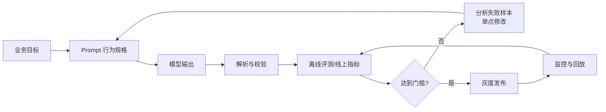
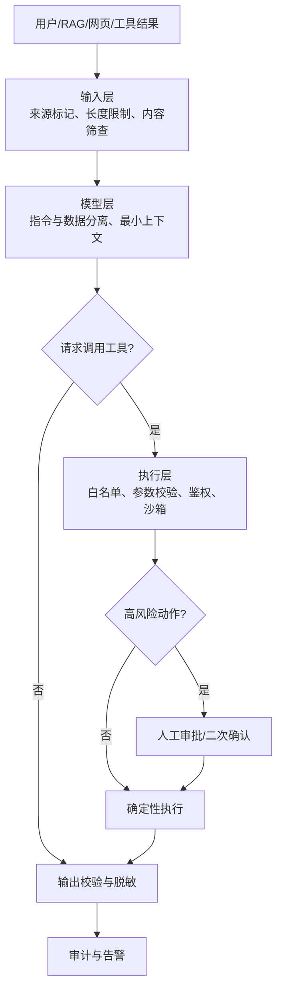
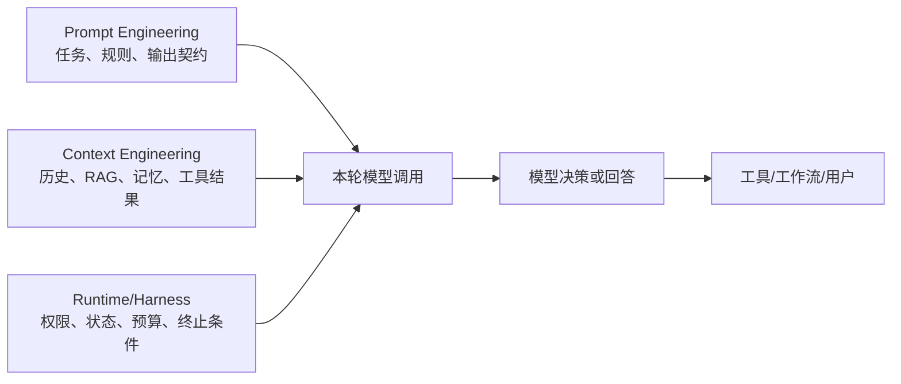

# 大模型提示词工程（Prompt Engineering）是什么？提示词技巧有哪些？

> Prompt Engineering 不是堆砌背景或寻找"神奇咒语"，而是把任务目标、输入边界、可用证据、输出契约和失败策略写成模型可以执行、系统可以评测的行为规格。

## 笔记概览

### 知识鸟瞰

1. **什么是 Prompt Engineering** — 问题定义与核心目标              [前提·定义]
   └─ 铺垫 → 核心主张：缩小任务的可接受解空间

2. **Prompt 的基本结构与六类技巧** — 从四要素到 Few-Shot            [核心·机制]
   ├─ 四要素框架（Role/Task/Context/Format）
   ├─ 推理引导（CoT → 可验证依据）
   ├─ Few-Shot / 任务分解 / 结构化输出 / 分隔符
   └─ 关系：四要素是骨架，六类技巧是血肉

3. **长文本、证据与幻觉控制** — 质量保障机制                       [实践·行动]
   └─ 先检索再分析 → 明确允许拒答 → 外部校验兜底

4. **Prompt 作为版本化资产** — 从字符串到业务配置                   [落地·行动]
   └─ 外置化 → 版本化 → 灰度发布 → 单点修改原则

5. **评测与回归体系** — 质量闭环                                    [落地·深化]
   └─ Golden Set 构建 → 指标分层 → 失败回填

6. **Prompt Injection 纵深防御** — 安全边界                         [落地·深化]
   ├─ 输入层 → 认知层 → 执行层 → 决策层
   └─ 三层模型无法互相替代

7. **Spring AI 工程示例** — 代码落地                               [实践·行动]

8. **Prompt Engineering × Context Engineering × Agent** — 生态定位  [延伸·对比]
   └─ 四个领域的分工与协作

9. **场景选型、常见误区、实践验收** — 速查与纠偏                    [延伸·纠正]

> **主线**：作者从"Prompt 是什么"出发，建立四要素 + 六类技巧的方法论骨架，然后逐层推进到工程化管理（版本/灰度）、质量闭环（评测/回归）和安全防御（三层纵深），最后用 Spring AI 代码示例和生态定位收束，形成从"写 Prompt"到"管 Prompt"再到"守 Prompt"的完整链路。

### 各节内容概要

| 章节 | 核心内容 | 关键要点 |
|------|---------|---------|
| 一、什么是 Prompt Engineering | 定义与目标：缩小任务的可接受解空间 | Prompt 是行为规格，不是聊天消息；评测驱动的迭代闭环 |
| 二、基本结构 | 四要素框架（Role/Task/Context/Format）、信息位置效应、四类内容的信任级别 | Role 非必需；关键信息放首尾；System/User/Tool/Memory 的信任边界不同 |
| 三、六类提示技巧 | 角色框定、推理引导、Few-Shot、任务分解、结构化输出、分隔符与预填充 | 每类技巧解决不同问题，不能无条件叠加；Reasoning model 优先 Zero-Shot |
| 四、幻觉控制 | 先检索再分析、明确允许拒答、多次采样的边界 | 为"不知道"设计合法状态，比反复强调"不要幻觉"更可操作 |
| 五、版本化资产 | 外置化存储、语义版本号、灰度变更流程 | Prompt、Schema、模型和知识库版本需关联；一次只改一个变量 |
| 六、评测与回归 | Golden Set 构建、指标分层、单点修改原则 | 从 10~30 条样本起步；LLM-as-a-Judge 需人工校准 |
| 七、纵深防御 | 直接/间接 Prompt Injection、Jailbreak、三层防御模型 | 标签只是语义分隔，不是权限边界；Agent 场景下风险更高 |
| 八、Spring AI 示例 | 模板与变量、BeanOutputConverter、Provider-Native Structured Output | 服务端校验和失败降级不能省略 |
| 九、生态定位 | Prompt Engineering vs Context Engineering vs Agent vs Harness | 四个领域分工协作，提示词路由实现差异化处理 |
| 十~十三、速查与验收 | 场景选型速查、常见误区、实践清单、复习问题 | 7 个常见误区和 13 个复习问题覆盖全文关键决策点 |


## Key Takeaways

1. Prompt 的质量取决于**信息密度和边界清晰度**，不是长度。Role、Task、Context、Format 是实用起点，Constraint 和 Example 按需补充。
2. 任务描述和验收标准通常比"你是一位专家"更重要；角色设定应服务于专业视角、语气或职责边界。
3. Few-Shot、任务分解、结构化输出、分隔符和预填充各解决不同问题，不能无条件叠加。
4. 生产系统不应索取或暴露完整内部思维链。更可控的做法是要求**关键依据、检查结果、引用证据和最终结论**。
5. Prompt 必须通过 Golden Set 回归评测，和模型、Schema、检索策略一起版本化。
6. Prompt Injection 无法只靠 Prompt 消除。权限、沙箱、工具白名单、审批和审计才是安全边界。
7. Prompt Engineering 设计"模型该如何完成本轮任务"；Context Engineering 决定"本轮究竟给模型哪些信息"。

---

## 一、Prompt Engineering 是什么

Prompt 是一次模型调用中提供给 LLM 的指令和上下文。LLM 根据当前上下文预测后续 Token；输入越模糊，模型需要自行补全的假设越多，输出越容易漂移。

Prompt Engineering 的目标不是让模型"变聪明"，而是**缩小任务的可接受解空间**：

- 明确模型要完成什么，而不只是讨论什么。
- 提供完成任务所需的最小充分上下文。
- 规定输出格式和验收条件。
- 明确证据不足、输入冲突或执行失败时怎么办。
- 用可重复的评测判断修改是否真的有效。



---

## 二、Prompt 的基本结构

### 2.1 四要素框架

| 要素 | 回答的问题 | 示例 | 是否必需 |
|------|-----------|------|---------|
| **Role** | 采用什么职责、视角和语气？ | Java 性能评审者 | 按需 |
| **Task** | 具体要完成什么动作？ | 找出性能瓶颈并给出修改建议 | 通常必需 |
| **Context** | 有哪些相关事实和约束？ | QPS 2000，P95 超过 500 ms | 复杂任务必需 |
| **Format** | 结果如何交付？ | 问题、证据、建议、优先级 | 程序消费时必需 |

还可以按需补两类信息：

- **Constraint**：不能做什么、信息不足如何处理、允许使用哪些来源。
- **Example**：用少量输入输出样例表达格式、粒度和边缘行为。

> [!note] Role 不是必填咒语
> 如果任务和验收标准已经足够明确，泛化角色如"你是一位世界级专家"通常信息增量很低。角色应提供具体职责或判断视角，而不是只增加气势。

### 2.2 从模糊请求到可执行规格

```text
❌ 模糊版本：
分析这段代码的性能问题，给出建议。

✅ 可执行版本：
角色：你负责 Java 服务端性能评审，重点关注数据库、缓存和并发访问。

任务：评审下面的订单查询代码，找出可能导致 P95 延迟升高的问题。

上下文：
- 线上 QPS：2000
- 当前 P95：520 ms
- 数据库连接池：50
- 只允许根据所给代码和指标判断；证据不足时标记"需补充数据"。

输出：
1. 按严重程度排序的问题清单；
2. 每项包含代码位置、证据、影响和建议；
3. 不要虚构压测结果；
4. 最后列出需要补充的监控指标。
```

后者减少了模型必须猜测的内容，也为评测提供了明确标准。

### 2.3 信息位置与长上下文

Liu 等人的 *Lost in the Middle* 研究发现，相关信息位于长上下文中部时，模型表现经常低于位于开头或结尾时。

工程上可以据此做以下安排：

- 把稳定的身份、任务目标和不可违反的约束放在高优先级指令区（开头）。
- 把当前问题和最终输出要求放在靠近生成位置的区域（结尾）。
- 长文档使用标题、编号和分隔符，先检索再注入，不要依赖简单堆叠。
- 关键任务必须用目标模型和真实长度做位置敏感性测试，不能把"开头和结尾更好"当成普适公式。

### 2.4 System、User、Tool 与外部内容

一次 Agent 调用中常见四类内容：

| 内容 | 作用 | 信任级别 | 典型风险 |
|------|------|---------|---------|
| System/Developer 指令 | 应用政策、角色和长期约束 | 高，但不能存放秘密 | 被后续冲突内容稀释 |
| User 输入 | 本轮需求 | 不可信 | 直接 Prompt Injection |
| Tool 结果 | 查询、网页、邮件、文件内容 | 不可信 | 间接 Prompt Injection、脏数据 |
| Memory/RAG 片段 | 历史事实和外部知识 | 有条件可信 | 过期、越权、来源污染 |

消息层级能帮助模型区分内容，但它**不是安全隔离机制**。权限和副作用必须由代码控制。

---

## 三、六类常用提示技巧

### 3.1 角色与职责框定

适用于需要特定专业视角、判断标准或语气的任务。有效角色包含三个要素：

- **职责**：负责什么结果。
- **关注点**：优先检查什么。
- **边界**：不负责什么、不允许假设什么。

```text
你负责 Java API 性能评审。
优先检查阻塞 I/O、N+1 查询、缓存穿透和事务边界。
不要虚构运行指标；证据不足时列出所需数据。
```

角色过宽、彼此冲突或与任务无关时，只会消耗 Token。

### 3.2 推理引导：从"完整思维链"转向可验证依据

CoT（Chain-of-Thought）适合数学、逻辑、多约束分析等任务，但不同模型的最佳提示方式不同。

| 场景 | 推荐输出 | 原因 |
|------|---------|------|
| 教学 | 可展示必要计算步骤 | 帮助学习者理解 |
| 调试 | 检查点、证据、失败原因 | 便于定位错误 |
| **生产** | 关键依据、引用、校验结果、结论 | 降低泄露和冗余 |
| Reasoning model | 简洁目标和成功标准 | 模型通常自行完成内部推理 |

不建议把 `<thinking>` 当作隐藏安全边界，也不应假设能取得模型完整、真实的内部推理。更稳妥的要求是：

```text
回答前检查：
1. 是否使用了所有必要变量；
2. 结论是否能由给定证据支持；
3. 是否存在反例或缺失信息。

只输出检查结果、引用证据和最终结论。
```

### 3.3 Few-Shot：用示例定义行为

当抽象规则难以准确描述格式、语气或边缘行为时，提供 1～3 个高质量示例通常有效。

```text
任务：从句子中提取姓名、年龄和职业，输出 JSON。

示例：
输入：张三今年 25 岁，是软件工程师。
输出：{"name":"张三","age":25,"occupation":"软件工程师"}

边缘示例：
输入：李老师是一名会计，年龄未提供。
输出：{"name":"李老师","age":null,"occupation":"会计"}

现在处理：
输入：王芳 28 岁，是数据分析师。
```

**选择原则**：

- 示例和真实任务同分布。
- 同时覆盖正常和关键边缘情况。
- 不让示例与文字规则冲突。
- 防止示例标签或答案泄漏到真实输出。
- Reasoning model 先尝试 Zero-Shot，复杂输出要求再增加 Few-Shot。

### 3.4 任务分解与 Prompt Chaining

复杂任务可以拆成多个可独立校验的阶段：

```text
文档审查：
1. 提取核心主张和对应证据；
2. 检查证据是否支持主张；
3. 标记冲突、缺失和不确定项；
4. 基于已验证结果生成摘要。
```

| 模式 | 流程 | 适用场景 | 主要风险 |
|------|------|---------|---------|
| 单 Prompt | 一次完成全部任务 | 简单、低风险任务 | 复杂时难定位错误 |
| Prompt Chaining | 固定步骤串联 | 合同审查、抽取后总结 | 上游错误传播 |
| Workflow/Graph | 显式节点和条件分支 | 可恢复、可审计流程 | 编排成本增加 |
| Agent 动态规划 | 模型决定下一步 | 探索性任务 | 循环、成本和误调用 |

每一步应只承担一个清晰职责，并为下一步提供受约束的结构化结果。**能用固定工作流解决时，不必升级为自治 Agent。**

### 3.5 结构化输出

如果结果要被程序消费，应优先使用供应商原生 Structured Outputs 或 Tool Calling，并在服务端再次校验。仅在不支持原生能力时，才主要依赖 Prompt 格式说明。

```json
{
  "type": "object",
  "properties": {
    "sentiment": {
      "type": "string",
      "enum": ["POSITIVE", "NEGATIVE", "NEUTRAL", "UNKNOWN"]
    },
    "evidence": {
      "type": "array",
      "items": {"type": "string"}
    }
  },
  "required": ["sentiment", "evidence"],
  "additionalProperties": false
}
```

> 详细的 Schema、重试、权限和工具执行设计见 [[../01-大模型基础/大模型结构化输出：从 JSON 契约到 Function Calling 落地]]。

### 3.6 分隔符、XML 标签与预填充

分隔符或 XML 标签用于标记文档、用户输入、示例和输出要求，让边界更容易识别：

```xml
<documents>
  <document id="1" source="annual-report.md">
    {{DOCUMENT_1}}
  </document>
  <document id="2" source="competitor-analysis.md">
    {{DOCUMENT_2}}
  </document>
</documents>

<task>
只根据 documents 中的内容比较两家公司的风险，并标注 document id。
</task>
```

注意：

- 标签命名应有语义且保持闭合、层级一致。
- 标签只能帮助模型理解边界，**不能阻止恶意内容越权**。
- 动态输入要转义或避免破坏外围结构，但转义同样不能替代安全控制。
- 预填充 `{`、`<response>` 等输出开头属于供应商相关技巧；使用原生结构化输出时通常没有必要。

---

## 四、长文本、证据与幻觉控制

### 4.1 先检索或引用，再分析

面对多文档任务，先提取与问题相关的证据，再生成结论：

```text
1. 提取与退款条件直接相关的原文，保留来源编号。
2. 判断每条证据是否适用于当前案例。
3. 仅根据有效证据给出结论。
4. 找不到证据时输出 INSUFFICIENT_EVIDENCE。
```

这种方式改善可审计性，但引用仍可能被模型误抄，服务端可按来源位置进行二次核对。

### 4.2 明确允许拒答

```text
只能依据提供的材料回答。
如果材料不足，请输出"信息不足"，并列出缺少的字段；不要使用常识补全业务事实。
```

> 为"不知道"设计合法状态，通常比反复强调"不要幻觉"更可操作。

### 4.3 多次采样与自检的边界

Best-of-N 或多次采样可以发现结论不一致，但会增加成本，多个答案一致也不代表事实正确。高风险任务仍需外部事实源、规则校验或人工复核。

---

## 五、Prompt 不是字符串，而是版本化资产

### 5.1 外置化与模板化

Prompt 不应散落在 Java 业务代码中。可放在资源文件、Prompt Registry 或配置中心，并保持：

- 模板主体和变量定义分离。
- 每个版本不可变，可快速回滚。
- 变量有类型、长度、来源和敏感级别。
- System 指令与用户输入使用不同消息角色。
- Prompt、Schema、模型和知识库版本可关联。

### 5.2 版本标识

```text
promptName=ticket_classifier
promptVersion=3.2.1
schemaVersion=ticket_v2
modelProvider=...
model=...
knowledgeBaseVersion=...
experimentId=...
```

语义版本约定：

| 变更级别 | 范围 | 示例 |
|---------|------|------|
| **Patch** | 措辞调整，不改变字段和决策逻辑 | 修正错别字、优化表达 |
| **Minor** | 新增兼容规则或示例 | 增加一个边缘情况的 Few-Shot |
| **Major** | 输出契约、分类口径或执行策略变化 | 新增必填字段、改变分类标准 |

### 5.3 变更流程

1. 从线上失败和业务需求提出变更假设。
2. 固定模型、参数、检索材料，**只修改一个变量**。
3. 运行 Golden Set 和攻击样本回归。
4. 小流量灰度，比较质量、延迟、Token 和失败率。
5. 达不到门槛立即回滚，并保留失败样本。

---

## 六、Prompt 评测与回归

### 6.1 最小评测集

可以从 10～30 条样本起步，随后扩展到覆盖真实分布的 Golden Set：

| 样本类型 | 目的 |
|---------|------|
| 正常样本 | 验证主流程质量 |
| 边缘样本 | 验证模糊、缺失、冲突输入 |
| 失败回放 | 防止历史缺陷复发 |
| 对抗样本 | 验证注入、越权和敏感信息处理 |
| 长上下文样本 | 验证位置、截断和噪声影响 |

### 6.2 指标分层

| 层次 | 指标示例 |
|------|---------|
| **格式** | JSON 合规率、字段缺失率、枚举越界率 |
| **任务** | 准确率、召回率、事实一致性、引用正确率 |
| **Agent** | 工具选择准确率、参数准确率、不必要调用率 |
| **安全** | 注入成功率、越权拦截率、敏感信息泄露率 |
| **体验** | 人工修改率、拒答率、用户完成率 |
| **工程** | TTFT、总延迟、输入/输出 Token、调用成本 |

LLM-as-a-Judge 可以辅助扩展评测，但需要用人工标注样本校准；关键业务不能只依赖另一个模型打分。

### 6.3 单点修改原则

一次同时更换 Prompt、模型、Temperature 和检索策略，会失去归因能力。应尽量保持其他变量不变，并记录每次实验的输入、输出、配置和评测结果。

---

## 七、企业级安全：Prompt Injection 纵深防御

### 7.1 Prompt Injection 与 Jailbreak

| 类型 | 入口 | 目标 |
|------|------|------|
| 直接 Prompt Injection | 用户直接输入 | 覆盖应用指令、泄露信息或诱导调用工具 |
| 间接 Prompt Injection | 网页、邮件、文件、RAG、工具结果 | 把外部数据伪装成指令 |
| Jailbreak | 对抗性用户指令 | 绕过模型或应用的内容安全策略 |

> [!warning] Agent 场景下风险更高
> 攻击可能从"错误回答"升级为发邮件、写数据库、执行代码或泄露其他租户数据。

### 7.2 三层防御



#### 输入与认知层

- 标记用户、文档、工具结果的来源和信任级别。
- 用消息角色、分隔符和标签减少指令与数据混淆。
- 过滤已知攻击模式只能作为辅助，不能假设覆盖未知攻击。
- System Prompt 不存放密钥、密码或不可泄露的安全逻辑。

#### 执行层

- 工具白名单、最小权限、租户隔离和参数校验。
- 代码执行使用容器、虚拟机或受限沙箱。
- 写操作具备幂等、超时、限流和审计。
- **模型提出动作不等于获得授权。**

#### 决策层

- 退款、转账、外发邮件、删除和批量修改需二次确认或审批。
- 审批界面展示真实参数和影响范围，不能只展示模型摘要。
- 低置信度或输入冲突时优先追问、拒绝或转人工。

---

## 八、Spring AI 工程示例

> [!warning] 版本边界
> 以下 API 按 2026-06-22 的 Spring AI 2.0.0 官方参考文档核验。Spring AI 迭代较快，接入前应按项目 BOM 对照当前文档和目标模型能力。

### 8.1 模板与变量

```java
String template = """
        <role>
        你负责将用户反馈分类为 PAYMENT、LOGISTICS、AFTER_SALE 或 UNKNOWN。
        </role>

        <task>
        只根据 user_input 判断分类；信息不足时选择 UNKNOWN。
        </task>

        <user_input>
        {userInput}
        </user_input>
        """;

PromptTemplate promptTemplate = new PromptTemplate(template);
Prompt prompt = promptTemplate.create(Map.of("userInput", userInput));
```

模板隔离有助于维护，但 `{userInput}` 仍是不可信数据。它不能获得工具权限，也不能绕过服务端鉴权。

### 8.2 `BeanOutputConverter`：Prompt 格式引导

```java
public record TicketResult(
        Category category,
        double confidence,
        List<String> evidence) {}

BeanOutputConverter<TicketResult> converter =
        new BeanOutputConverter<>(TicketResult.class);

String promptWithFormat = template + "\n\n" + converter.getFormat();
```

这种方式把格式说明追加到 Prompt，并在返回后反序列化。Spring AI 文档明确提醒：仅靠模型遵循格式说明不能保证结构始终正确，仍需处理解析失败。

### 8.3 Provider-Native Structured Output

```java
TicketResult result = ChatClient.create(chatModel)
        .prompt()
        .advisors(AdvisorParams.ENABLE_NATIVE_STRUCTURED_OUTPUT)
        .user("请分类：付款成功，但订单仍显示待支付。")
        .call()
        .entity(TicketResult.class);
```

原生结构化输出把生成的 JSON Schema 传给供应商 API，通常比 Prompt 格式说明可靠，但并非默认启用，支持范围随模型和供应商变化。**服务端校验和失败降级仍不能省略。**

---

## 九、Prompt Engineering、Context Engineering 与 Agent



| 领域 | 核心问题 | 典型产物 |
|------|---------|---------|
| **Prompt Engineering** | 模型应该如何完成任务？ | 指令模板、示例、输出契约 |
| **Context Engineering** | 本轮应该给模型哪些信息？ | 上下文组装、裁剪、检索和记忆策略 |
| **Agent/Workflow** | 任务如何分步执行和恢复？ | 节点、状态、工具循环、审批 |
| **Harness Engineering** | 如何限制和验证整个运行过程？ | 权限、预算、沙箱、观测、评测 |

### 提示词路由

不同任务应路由到不同 Prompt、工具集和评测标准：

- FAQ → 知识库检索 + 简短回答 Prompt
- 代码诊断 → 代码上下文 + 调试 Prompt
- 数据分析 → 查询工具 + 分析 Prompt
- 高风险操作 → 受控 Workflow + 审批，不直接进入自治 Agent

低置信度路由应追问或进入安全默认路径，不能强行猜测。

---

## 十、场景选型速查

| 问题 | 优先手段 | 不建议 |
|------|---------|--------|
| 任务含糊 | 明确 Task、Context 和验收标准 | 只增加华丽角色 |
| 格式不稳定 | 原生 Structured Outputs + 校验 | 只说"返回 JSON" |
| 边缘行为错误 | 增加少量针对性 Few-Shot | 堆大量重复示例 |
| 复杂任务难调试 | Prompt Chaining 或 Workflow | 一个超长 Prompt 全包 |
| 长文档答非所问 | 检索、引用后回答、来源标记 | 把全部文档直接塞入 |
| 幻觉 | 合法拒答状态、证据和外部校验 | 只写"不要幻觉" |
| 注入风险 | 最小权限、白名单、审批、沙箱 | 只靠分隔符和 System Prompt |

---

## 十一、常见误区

1. **Prompt 越长越专业**：长 Prompt 会增加噪声、成本、冲突和维护难度。
2. **角色越夸张效果越好**：角色只有提供具体职责和判断视角时才有价值。
3. **要求"逐步思考"适合所有模型**：reasoning model 往往更适合简洁、直接的目标，不应索取完整内部推理。
4. **XML 标签可以防注入**：标签只是语义分隔，不是权限边界。
5. **Few-Shot 越多越好**：示例过多会占窗口，也可能把偏差固化。
6. **自我反思能证明事实正确**：模型复核仍可能重复同一错误，需要外部证据。
7. **Prompt 调好一次即可长期使用**：模型、SDK、知识库和输入分布都会变化，必须持续回归。

---

## 十二、实践与验收

### Prompt 评测实验

- [ ] 选择 20 条真实输入，覆盖正常、缺信息、冲突、长文本和注入样本。
- [ ] 固定模型、参数和检索材料，记录当前 Prompt 基线。
- [ ] 每轮只改变一项：角色、示例、输出约束或文档位置。
- [ ] 比较任务准确率、格式合规率、人工修改率、Token 和延迟。
- [ ] 把每次线上失败回填到 Golden Set。

### 工程验收

- [ ] Prompt 已外置并包含版本号、负责人和回滚版本。
- [ ] 动态变量有来源、长度、类型和敏感等级。
- [ ] 程序消费结果使用 Schema 和服务端校验。
- [ ] 高风险工具由代码鉴权并经过审批。
- [ ] 日志关联 Prompt、模型、Schema、知识库和实验版本。
- [ ] 灰度指标异常时可以独立回滚 Prompt。

---

## 复习问题

1. Role、Task、Context、Format 各解决什么问题？Role 为什么不是必需项？
2. Few-Shot 什么时候比增加文字规则更有效？
3. 为什么生产系统更适合输出依据和检查点，而不是完整思维链？
4. Prompt Chaining、Workflow 和 Agent 动态规划如何选择？
5. 为什么分隔符不能防止 Prompt Injection？
6. Prompt 变更如何建立可归因的回归实验？
7. Prompt Engineering 与 Context Engineering 的边界是什么？

---

## 核心概念速查

| 概念 | 一句话 | 类比 | 为什么重要 |
|------|--------|------|-----------|
| **Prompt Injection 三层防御** | 输入层标记来源、执行层收权限、决策层让人拍板——三层各自独立，不能互相替代 | 银行防诈骗：系统限额 → 柜员识别指令 → 大额转账主管签字 | Prompt 一旦外置化并热更新，攻击面就不再只是"用户输入框"，三层缺一不可 |
| **Lost in the Middle** | 模型对长上下文中间位置的信息处理能力明显弱于开头和结尾 | 人读长文档时对中间段落的记忆也最模糊 | 关键指令和输出要求必须放在首尾，不能假设模型对全文同等关注 |
| **Golden Set 回归** | 一组覆盖正常/边缘/失败/对抗场景的标准评测集，每次改 Prompt 必跑 | 像后端 API 的集成测试套件，改代码就要跑 | 没有 Golden Set 的 Prompt 调优基本靠猜；失败样本不回填等于白测 |
| **单点修改原则** | 一次只改变 Prompt/模型/Temperature/检索策略中的一个变量 | 科学实验中的控制变量法 | 同时改多个变量会失去归因能力，无法判断哪个改动真正有效 |

---

## 核心要点

1. **Prompt 的质量取决于信息密度和边界清晰度，不是长度。** 四要素（Role/Task/Context/Format）是实用起点，任务描述和验收标准通常比"你是一位专家"更重要。`结论`

2. **Prompt Injection 无法只靠 Prompt 消除，权限、沙箱、工具白名单、审批和审计才是真正的安全边界。** XML 标签只是语义分隔，消息层级也不是安全隔离机制。Agent 场景下攻击可以从"错误回答"升级为"执行危险操作"。`条件`

3. **Prompt 应作为版本化资产管理，变更需经 Golden Set 回归 → 小流量灰度 → A/B 对比 → 全量发布。** Prompt、Schema、模型和知识库版本需关联；灰度指标异常时能独立回滚 Prompt 而不影响代码。`行动原则`

4. **一次只改变一个变量（Prompt/模型/Temperature/检索策略），否则失去归因能力。** 这是 Prompt 迭代中最容易被忽略的工程纪律。`限制`

5. **生产系统不应索取或暴露完整内部思维链，更可控的做法是要求关键依据、检查结果、引用证据和最终结论。** `<thinking>` 标签不是安全边界；reasoning model 更适合简洁目标而非索取内部推理。`行动原则`

---

## 关联

- [[../01-大模型基础/LLM 运行机制：Token、上下文窗口与采样参数]] — Token 预算与采样参数直接影响 Prompt 行为
- [[../01-大模型基础/大模型结构化输出：从 JSON 契约到 Function Calling 落地]] — Structured Outputs 的详细 Schema、重试与校验设计
- [[上下文工程]] — Context Engineering 决定了"本轮给模型哪些信息"
- [[../04-Agent/AI Agent 基础]] — Agent 场景下 Prompt 的角色从"指令"变为"行为约束"
- [[../04-Agent/Harness Engineering]] — 权限、预算、沙箱、观测——Prompt 安全的执行层保障
- [[../05-工程化/AI 应用评测体系]] — Golden Set 构建与评测指标体系的完整方案
- [[../05-工程化/AI 应用安全与合规]] — Prompt Injection 之外的内容安全、PII 脱敏与审计

---

## 参考来源

- [JavaGuide：大模型提示词工程实践指南](https://javaguide.cn/ai/agent/prompt-engineering.html)
- [Liu 等：Lost in the Middle](https://arxiv.org/abs/2307.03172)
- [Spring AI：Structured Output Converter](https://docs.spring.io/spring-ai/reference/api/structured-output-converter.html)
- [Spring AI：Chat Client](https://docs.spring.io/spring-ai/reference/api/chatclient.html)
- [OpenAI：Prompt Engineering](https://developers.openai.com/api/docs/guides/prompt-engineering)
- [OpenAI：Reasoning Best Practices](https://developers.openai.com/api/docs/guides/reasoning-best-practices)
- [Anthropic：Prompt Engineering Overview](https://platform.claude.com/docs/en/build-with-claude/prompt-engineering/overview)
- [OWASP：LLM01 Prompt Injection](https://genai.owasp.org/llmrisk/llm01-prompt-injection/)

---

## 待确认

- 目标 Java 项目确定 Spring AI 的实际 BOM 版本后，再补充可编译的 Prompt Registry、灰度和评测示例。
- 不同模型对预填充、消息角色和 reasoning summary 的支持会变化，使用前需按目标 API 复核。
