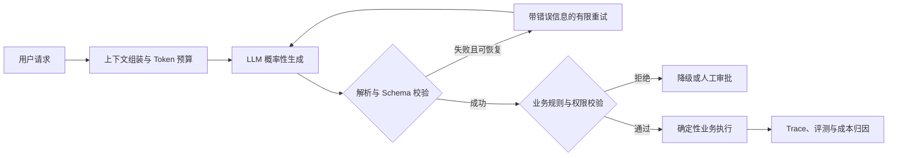
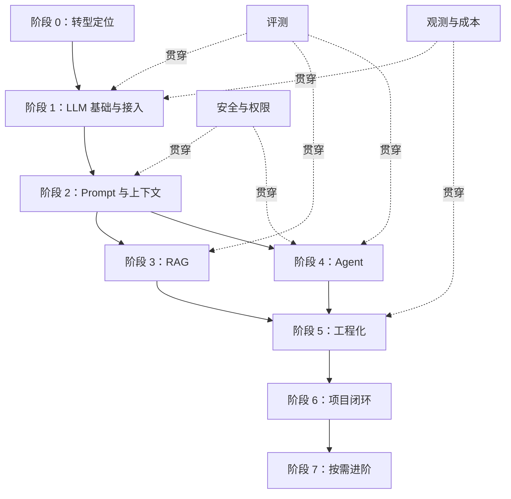

# Java 后端转 AI 应用开发学习路线

这条路线面向“把大模型接入业务系统”的 AI 应用工程，而非模型训练与算法研发。核心不是丢掉 Java 后端经验，而是把接口治理、异步、状态、权限、观测和成本控制迁移到一个更慢、更贵、更不稳定的概率性上游。


## 目录

- [Key Takeaways](#key-takeaways)
- [目标与边界](#目标与边界)
- [核心心智模型](#核心心智模型)
- [路线架构](#路线架构)
- [分阶段学习计划](#分阶段学习计划)
- [关键技术边界](#关键技术边界)
- [生产级工程约束](#生产级工程约束)
- [学习与验证方法](#学习与验证方法)
- [项目闭环](#项目闭环)
- [相关页面](#相关页面)
- [参考来源](#参考来源)

## Key Takeaways

- 转型目标是 AI 应用工程：模型训练只需理解边界，重点是模型接入、RAG、Agent 和生产治理。
- 学习顺序不能倒置：先理解 Token、上下文与结构化输出，再做 RAG 和 Agent。
- RAG 解决“模型不知道什么”，Agent 解决“模型如何行动”；两者应先拆开练，再通过 Agentic RAG 融合。
- Prompt 是行为规格的一部分，不是全部控制面；格式校验、权限、重试、审批和审计必须由代码强制执行。
- 评测是贯穿全程的反馈系统。没有 Golden Set、Trace 和版本绑定，Prompt、RAG、Agent 都只能靠感觉调优。
- 完成学习的标准不是读完文章，而是留下可运行代码、失败案例、指标和架构决策。

## 目标与边界

### 目标岗位画像

目标是能够独立设计和交付生产级 AI 功能的后端工程师，具备以下能力：

- 用 Java 接入多个 LLM，并处理流式输出、超时、重试和结构化结果。
- 构建有证据引用、权限过滤、可评测的 RAG 知识库。
- 构建带工具、记忆、状态恢复和人工审批的 Agent。
- 对调用成本、延迟、幻觉、安全与审计负责。

### 非目标

- 不按算法岗标准学习模型预训练、分布式训练和手推 Transformer。
- Python 以能读、能改、能调试主流 AI 项目为目标，不替代 Java 主工程栈。
- 微调只建立决策认知；仅当 Prompt + RAG 无法解决稳定行为或特定任务精度时再深入。

## 核心心智模型

### 从确定性接口到概率性上游

| 维度 | 传统后端系统 | LLM 应用系统 |
| --- | --- | --- |
| 核心机制 | 规则、状态机、确定性程序 | 自回归生成与概率采样 |
| 同输入结果 | 通常稳定 | 受采样、上下文和模型版本影响 |
| 主要故障 | 超时、异常、并发、一致性 | 额外增加幻觉、格式漂移、上下文污染和成本失控 |
| 契约控制 | 类型、接口、事务、测试 | Prompt + Schema + 校验 + 评测 + Guardrails |
| 可观测对象 | 请求、数据库、缓存、消息 | 额外记录 Token、Prompt/模型版本、检索证据和工具轨迹 |

工程目标不是消灭概率性，而是在模型外围建立确定性边界：



### 上下文是运行时依赖

一次模型调用的有效输入不只是 Prompt，而是：

```text
System Instructions + User Input + Conversation + RAG Evidence
+ Tool Schemas + Tool Results + Memory + Output Budget
```

因此上下文需要像内存和线程池一样被预算、排序和淘汰。窗口标称值不是可用业务容量，必须预留输出和安全边际。

## 路线架构



## 分阶段学习计划

| 阶段 | 核心问题 | 主要产出 | 完成标准 |
| --- | --- | --- | --- |
| 0 转型定位 | 学算法还是做应用？ | 能力差距与学习范围 | 能解释后端经验如何迁移到 AI 系统 |
| 1 LLM 接入 | 如何稳定调用模型？ | Java 调用层、SSE、结构化输出 | 能注入超时、截断和限流故障并正确降级 |
| 2 Prompt/Context | 如何控制输入和输出？ | Prompt 模板、版本、Token 预算 | 有回归样本、变量隔离和输出校验 |
| 3 RAG | 如何接入私有知识？ | 文档管道、混合检索、Rerank | 能分开评估召回与生成质量 |
| 4 Agent | 如何安全地调用工具？ | Tool Loop、Memory、状态持久化 | 至少 3 个工具，可恢复、可审批、可终止 |
| 5 工程化 | 如何上线并控制风险？ | 网关、观测、评测、安全 | 成本、TTFT、失败率和关键 Trace 可见 |
| 6 项目 | 如何形成端到端能力？ | 一个可演示、可评测项目 | 有 README、架构图、Golden Set 和复盘 |
| 7 进阶 | 当前项目缺什么？ | 多模态、多 Agent 或本地部署 | 按真实瓶颈学习，不做无目标堆栈 |

### 阶段 0～2：建立最小可靠调用层

按 [[01-大模型基础/LLM 运行机制：Token、上下文窗口与采样参数]] → [[01-大模型基础/大模型结构化输出：从 JSON 契约到 Function Calling 落地]] → [[01-大模型基础/LLM API 调用工程]] → [[02-Prompt 与上下文/大模型提示词工程（Prompt Engineering）是什么？提示词技巧有哪些？]] → [[02-Prompt 与上下文/上下文工程]] 的顺序推进。

重点不是记参数，而是回答：为什么结果会漂移、预算为何会爆、JSON 为什么会坏、失败后由谁修复。

### 阶段 3：RAG 主线

按“解析 → 切分 → 索引 → 召回 → 融合 → 重排 → 生成 → 评测”拆开观察。先做 [[03-RAG/RAG 基础]]，再逐步进入文档处理、索引、检索优化和知识更新；只有需要跨文档关系推理时再学 [[03-RAG/GraphRAG]]。

### 阶段 4：Agent 主线

从 [[04-Agent/AI Agent 基础]] 和 Tool Calling 开始，再补记忆、MCP、Skills、Graph 和 Harness。生产级 Agent 的核心是有界循环：最大步数、总超时、Token/成本预算、工具权限和人工审批缺一不可。

### 阶段 5～7：工程化、项目与按需进阶

阶段 5 把网关、异步、事务边界、评测、审计和安全放入统一架构。阶段 6 用项目把两条主线串起来。阶段 7 只处理项目暴露出的真实缺口。

## 关键技术边界

| 方案 | 解决的问题 | 不解决的问题 | 选择信号 |
| --- | --- | --- | --- |
| Prompt Engineering | 明确任务、约束、风格与输出 | 大规模私有知识、真实业务执行 | 无外部知识和行动需求的单轮任务 |
| Structured Output | 将生成结果收敛到数据契约 | 事实正确性和业务合法性 | 输出必须进入后端逻辑 |
| RAG | 补充私有、动态、可引用知识 | 多步骤行动和稳定业务流程 | 答案存在于可检索资料中 |
| Workflow | 固定、可预测的业务步骤 | 开放式动态决策 | 流程已知且要求可审计、可回放 |
| Agent | 动态选择工具与下一步行动 | 无边界的全自动可靠性 | 路径无法预先穷举且工具结果会改变决策 |
| Fine-tuning | 固化行为、风格或特定任务能力 | 高频变化的事实知识 | Prompt/RAG 已验证仍无法满足且有高质量数据 |

## 生产级工程约束

### 调用与并发

- 用户可见生成优先 SSE/WebFlux，关注 TTFT；内部分类和路由不必强行流式。
- 不在 `@Transactional` 内等待 LLM 或工具网络调用，先完成生成与校验，再进入短事务。
- 重试只覆盖可恢复故障，使用指数退避、总超时和重试上限；模型语义错误不能盲目重试。

### 输出与执行

- 优先使用供应商原生 Structured Outputs；无支持时退化到 Function Calling 或 JSON Schema。
- 固定处理链：生成 → 解析 → 可选修复 → Schema 校验 → 业务校验。
- Tool Calling 只表达调用意图；Java 执行层负责参数、鉴权、幂等、超时和审计。

### RAG 与记忆

- 检索前做租户和 ACL 过滤，避免 Top-K 之后再过滤导致召回不足和越权风险。
- Embedding 模型变更应版本化并重建索引，不能混用不同向量空间。
- 长期记忆只写入经过置信度和幂等校验的高价值事实，并支持更正和遗忘。

### 评测、观测与安全

- 将 Prompt、模型、Embedding、知识库和评测集版本绑定到 Trace。
- 同时评估结果和过程：答案正确不代表工具路径稳定或权限安全。
- Prompt 中的安全要求只是认知层约束；执行层必须收紧权限，高风险动作由人工审批。
- 日志和 Trace 做 PII 脱敏，并设置按租户和场景区分的数据留存周期。

## 学习与验证方法

每篇专题笔记至少保留四类内容：

1. **机制**：它为什么有效，边界在哪里。
2. **决策**：何时选、何时不选，与相邻方案如何区分。
3. **实验**：最小代码、配置、输入输出和指标。
4. **失败案例**：如何复现、定位、修复并防回归。

完成状态由证据决定：

```text
阅读完成 ≠ 学习完成
学习完成 = 能解释 + 能实现 + 能测量 + 能复盘
```

具体检查项见 [[学习进度与实践清单]]。

## 项目闭环

建议先做 [[06-项目实战/企业知识库问答项目]]，单独验证 RAG；再做 [[06-项目实战/多工具 Agent 项目]]，单独验证工具、记忆和状态；最后可用 [[06-项目实战/智能面试平台项目]] 完成综合集成。

项目至少交付：

- 架构图与关键 ADR。
- 可重复部署的代码和配置说明。
- 50～200 条起步 Golden Set 及评测报告。
- 一次故障注入、一次成本分析和一次安全复盘。
- 简历可用的量化结果，但只记录真实测量数据。

## 相关页面

- [[index|Java 转 AI 应用开发索引]]
- [[Tech/AI/AI 应用开发学习体系|AI 应用开发学习体系]]
- [[Tech/Agent/AI Agent 的 Harness Engineering|AI Agent 的 Harness Engineering]]
- [[.raw/articles/JavaGuide Java Go 开发者 AI 应用开发路线来源记录|来源记录]]
- [[../../../Inbox/Java-to-AI-roadMap - AI 应用开发与 Agent 学习路线|原始阅读笔记]]

## 参考来源

- Java/Go 开发者 AI 应用开发与 Agent 学习路线：<https://javaguide.cn/roadmap/java-to-ai-roadmap.html>
- JavaGuide AI 应用开发知识体系：<https://javaguide.cn/ai/>
- 后端开发者转型 AI Agent 学习建议：<https://javaguide.cn/roadmap/backend-to-ai-agent-roadmap.html>
- 本地网页剪藏：[[../../../Clippings/JavaGo 开发者 AI 应用开发与 Agent 学习路线（2026 最新版）]]
