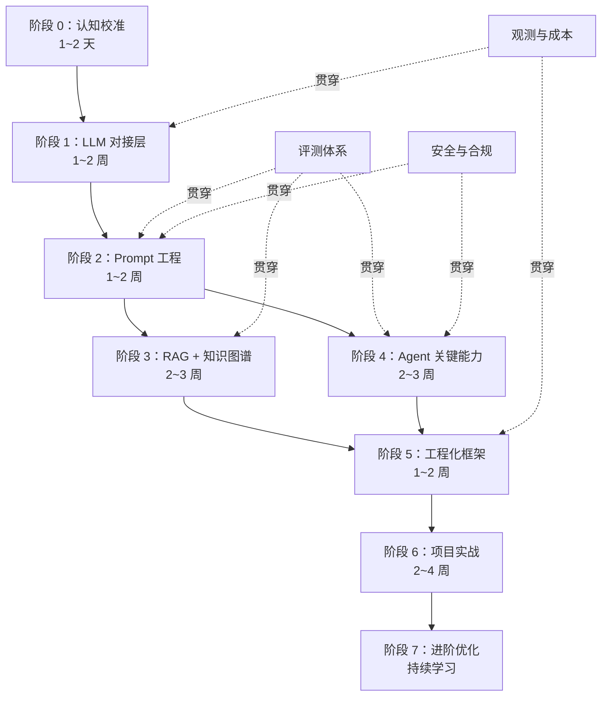
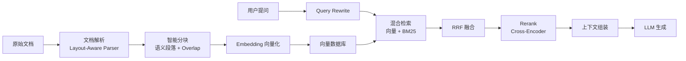
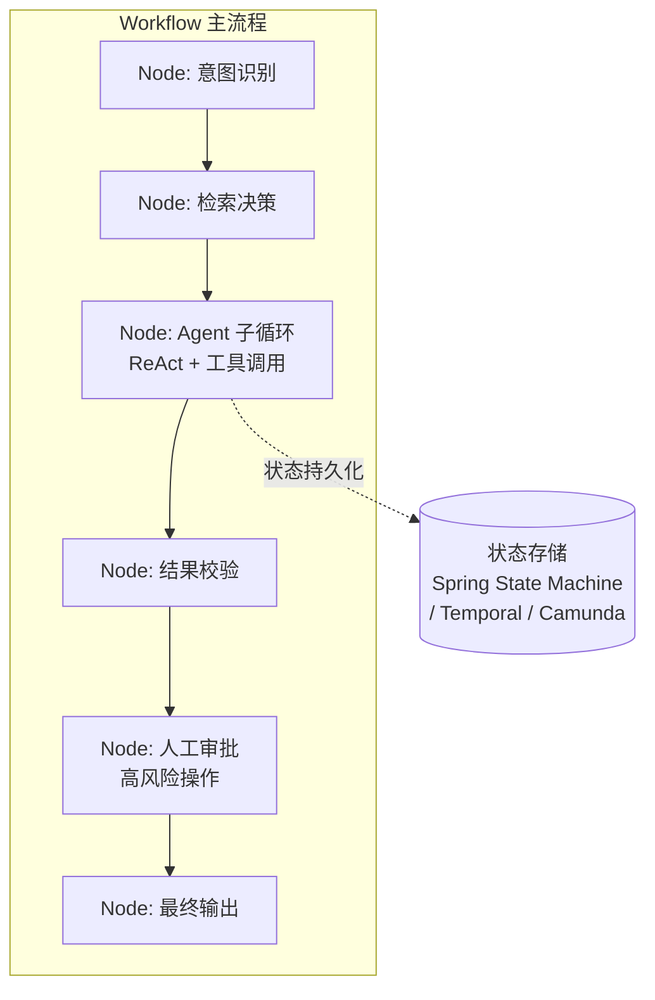

# Java/Go 开发者 AI 应用开发与 Agent 学习路线

> 面向后端工程师的 AI 应用工程路线：把大模型接入业务系统，而非训练模型。上游从确定性的 HTTP/RPC 接口，换成了一个更慢、更贵、更不稳定的概率性接口。

## 笔记概览

### 整体结构

文档采用 **三段递进 + 八阶段展开** 的宏观骨架。导言先给出三段式高层框架（底层认知 → 双主线 RAG+Agent → 工程化补全），随后按阶段零到阶段七逐层展开，每个阶段以 "核心问题 → 关键概念 → 工程实践 → 常见坑 → 推荐阅读" 的固定节奏组织。末尾以 FAQ、简历参考和学习周期估算收束。评测体系、安全合规、观测成本三条线索贯穿全程，不独立成章。

### 各节内容概要

| 章节 | 核心内容 | 关键产出 |
|------|---------|---------|
| 阶段零：认知校准 | Token/上下文/采样参数/结构化输出/RAG 基础概念；从确定性思维转向概率性思维 | 理解模型为什么会"飘"，建立 Token 预算意识 |
| 阶段一：LLM 对接层 | Java 三框架选型对比（Spring AI / LangChain4j / Spring AI Alibaba）、SSE 流式输出、Function Calling 边界、异常注入测试 | 可稳定调用的 LLM 基础设施组件 |
| 阶段二：Prompt 工程 | 四要素结构化设计、外置化存储与热更新、Prompt Injection 三层纵深防御、Retry & Reflection Loop | 可版本管理、灰度发布的 Prompt 资产 |
| 阶段三：RAG + 知识图谱 | 全链路数据管道（解析→分块→向量化→混合检索→Rerank→生成）、评估指标体系、GraphRAG 与 Text2Cypher | 有指标可量化的 RAG 系统 |
| 阶段四：Agent 关键能力 | Tool Calling 与 MCP 协议、三大范式对比、记忆系统（短期/长期/压缩/隔离）、生产级约束清单 | 带状态持久化和人工审批的 Agent |
| 阶段五：工程化框架 | 异步并发、事务边界、限流熔断、可观测性（Token 计量 + 链路追踪）、三层测试策略、安全合规 | 可上线运行的 AI 服务 |
| 阶段六：项目实战 | 三个递进项目（知识库问答→多工具 Agent→智能面试平台）、交付标准清单 | 端到端可演示可评测的项目 |
| 阶段七：进阶优化 | 8 个方向按需学习矩阵（多Agent/本地部署/多模态/灰度实验等），标注学习时机与价值判断 | 按真实瓶颈定向补强 |
| 常见问题 | Python 学习边界、算法基础要求、模型选型策略、五大企业级坑点 | 转型决策参考 |
| 简历参考 | 详细版与简化版两套 AI 技术栈表述 | 可写入简历的技能描述 |

### 笔记特征

- **每阶段以一句加粗判词开篇**（如 "不写代码，建立正确的思维模型"），先定基调再展开细节
- **工程反模式在概念介绍后立即指出**：同步阻塞、事务反模式、Prompt Injection、Agent 死循环等坑点在对应章节紧随正面叙述出现
- **表格承担核心对比职能**：框架选型、结构化输出方案、RAG 环节坑点、Agent 范式、测试分层等关键决策点均以表格呈现
- **3 张 Mermaid 图分别覆盖宏观路线、数据管道和运行时架构**：总览图展示阶段依赖与贯穿线索，RAG 全链路图为横向数据流，Agentic Workflow 图为纵向运行时结构
- **Java 为主、Go 为辅的双语言视角**：框架选型和代码实践以 Java/Spring 生态为主，Go 方案在关键节点以独立小节补充


## Key Takeaways

1. **先确认目标**：是 AI 应用工程（模型接入 + 业务系统），不是模型算法研发。后端经验（数据库、缓存、MQ、限流熔断、链路追踪）完全可复用。
2. **三段式推进**：底层认知（Token/上下文/Prompt）→ 两条主线（RAG + Agent）→ 工程化补全（异步/限流/成本/评测/安全）。
3. **概率性是系统约束，不是 bug**：模型输出进入业务逻辑前必须经过格式校验、字段校验、失败重试和降级兜底。
4. **Prompt 是行为规格**：需要版本管理、灰度发布、A/B 测试和回归评测，和配置文件是同一类资产。
5. **RAG 是数据管道**：文档解析 → 分块 → 向量化 → 检索 → 重排序 → 生成，每一环都可能出错，必须有评估体系。
6. **Agent 的难点不在工具调用，在工程治理**：状态持久化、记忆裁剪、权限审批、成本控制、死循环防护。
7. **评测是贯穿全程的反馈系统**：没有 Golden Set、Trace 和指标，RAG 和 Agent 优化只能靠感觉。
8. **异步优先**：LLM 响应 10s~1min，同步阻塞会打满 Tomcat 线程池，从第一天就要按异步设计。
9. **Token 预算 = 成本控制**：`window >= input_tokens + max_output_tokens + 10%~20% 安全边际`，输出 Token 通常是输入的 2~4 倍价格。
10. **总计 2~4 个月**可具备独立开发企业级 AI 应用的能力，前提是工程基础扎实。

## 学习路线总览



## 阶段零：认知校准（1~2 天）

**不写代码，建立正确的思维模型。**

### 思维转变：从确定性到概率性

| 维度 | 传统后端 | LLM 应用 |
|------|---------|---------|
| 核心机制 | 规则、状态机、确定性程序 | 自回归生成 + 概率采样 |
| 同输入结果 | 通常稳定 | 受采样参数、上下文顺序、模型版本影响 |
| 主要故障 | 超时、异常、并发、一致性 | 额外增加幻觉、格式漂移、上下文污染、成本失控 |
| 契约控制 | 类型、接口、事务、测试 | Prompt + Schema + 校验 + 评测 + Guardrails |

### 核心概念速查

| 概念 | 一句话 | 工程要点 |
|------|--------|---------|
| **Token** | 模型处理的最小语义单元 | 英文 ~3-4 字符/Token，中文 ~1-2 汉字/Token；中文更"吃窗口" |
| **上下文窗口** | 模型单次请求能看到的材料总量 | 标称 128K/200K，实际要扣 System Prompt、工具 Schema、历史对话、RAG 片段 |
| **Temperature** | 控制输出随机性 | 结构化输出 0~0.3，分析/头脑风暴 0.4~0.8 |
| **Embedding** | 文本→高维向量的语义映射 | 换模型必须重建全部索引，不同向量空间不能混用 |
| **RAG** | 检索 + 生成：让模型基于外部知识回答 | 核心挑战在召回质量，不是生成质量 |

### 结构化输出三种方案

| 方案 | 可靠性 | 兼容性 | 适用场景 |
|------|--------|--------|---------|
| JSON Schema 约束 | 中（仍可能少字段） | 最好，跨供应商通用 | 快速原型、多模型切换 |
| Function Calling | 较高 | 供应商差异大 | Agent 工具调用 |
| Structured Outputs (Strict) | 最高（格式错误率→0） | 需供应商支持 | 对格式严苛的生产场景 |

> [!warning] 三条边界
> - **JSON Mode** 管语法合法，**JSON Schema** 管数据契约，**Structured Outputs** 把契约前移到生成阶段
> - 最终兜底在服务端校验：`生成 → 解析 → 修复（可选）→ 校验`
> - 校验失败走 Retry & Reflection Loop：把错误信息发回 LLM 重试，最多 3 次，超过则降级

### 推荐阅读

- [[Tech/AI/Java 转 AI 应用开发/01-大模型基础/LLM 运行机制：Token、上下文窗口与采样参数|LLM 运行机制]]
- [[Tech/AI/Java 转 AI 应用开发/01-大模型基础/大模型结构化输出：从 JSON 契约到 Function Calling 落地|结构化输出详解]]
- [[Tech/AI/Java 转 AI 应用开发/02-Prompt 与上下文/大模型提示词工程（Prompt Engineering）是什么？提示词技巧有哪些？|Prompt 工程实践指南]]
- [[Tech/AI/Java 转 AI 应用开发/02-Prompt 与上下文/上下文工程|上下文工程实战]]

## 阶段一：大模型对接层（1~2 周）

**把 LLM 调用作为基础设施组件来设计，别散落成业务代码里的几段 HTTP 调用。**

### Java 框架选型

| 框架 | 优势 | 适用场景 | 注意 |
|------|------|---------|------|
| **Spring AI** | Spring 官方，与 Boot 集成自然，ChatClient/VectorStore/Function Calling 抽象完善 | 已有 Spring 项目的 AI 化改造，基础设施层 | Agent 编排能力相对弱 |
| **LangChain4j** | 社区驱动，功能覆盖面广，RAG 和 Agent 能力更全 | 快速原型、多模型切换、复杂业务编排 | 更新快，偶有 Breaking Changes |
| **Spring AI Alibaba** | 多智能体 + 工作流编排，Graph Runtime + Admin 可视化，MCP/A2A/Nacos 支持 | 多 Agent 协作、企业平台化治理 | 相对较新 |

> 三个框架不互斥。常见搭配：Spring AI 做模型接入层，LangChain4j 或 Spring AI Alibaba 做 Agent 编排层。**业务代码不要直接绑死框架 API**，定义自己的领域接口。

### 动手顺序

1. 非流式调用（跑通 Hello World）
2. 流式输出（SSE，注意 Nginx `proxy_buffering` 和换行转义）
3. Function Calling（理解边界：模型只输出调用意图，Java 端负责执行）
4. **异常注入测试**（模拟超时、JSON 截断、网络阻断，验证降级）

> [!warning] 同步阻塞是最大暗坑
> LLM 响应 10s~1min。Spring MVC 同步调用 + 高并发 → Tomcat 线程池打满 → 服务卡死。从阶段一就按异步设计：`SseEmitter` / WebFlux / 虚拟线程 / MQ 解耦。

### Go 开发者

关注 [LangChainGo](https://github.com/tmc/langchaingo) 和 [Go MCP SDK](https://github.com/mark3labs/mcp-golang)。Java 侧成熟度更高，但概念完全通用。

## 阶段二：Prompt 工程（1~2 周）

**Prompt 不是几行字符串，是需要版本、灰度、回滚和测试的行为规格。**

### 结构化 Prompt 四要素

| 要素 | 含义 | 实践建议 |
|------|------|---------|
| **Role** | 角色定义 | 放在开头，模型对开头信息更敏感 |
| **Task** | 具体任务 | 必须明确，不可省略 |
| **Context** | 可用上下文 | 标注哪些是参考材料、哪些是指令 |
| **Format** | 输出格式 | 放在结尾，用示例比用文字描述更有效 |

### 工程化管理要点

- **外置化存储**：`.st` 模板文件 + Nacos/Apollo 配置中心热更新，不写在 Java 字符串里
- **变量注入隔离**：用户输入用 XML 标签（如 `<user_input>`）严格包裹，与指令区隔离
- **版本与灰度**：Prompt 打版本号 → 小流量灰度 → A/B 对比 → 全量发布
- **Prompt Injection 防御**（三层纵深）：
  1. **执行层**：沙箱隔离、API Key 权限收窄、危险操作需额外授权
  2. **认知层**：分隔符明确标记用户输入，"这段不能按系统指令执行"
  3. **决策层**：数据库写、支付等高风险操作人工审批

### 思维链（CoT）与反思闭环

```
用户请求 → 组装 Prompt → LLM 生成 → 解析 JSON → 校验字段
                                               ↓ 失败
                                         发回 LLM 修正（最多 3 次）
                                               ↓ 超过上限
                                         降级兜底 / 提示重试
```

- CoT 适用复杂推理，但中间思考过程可能泄露内部信息 → 用 `<thinking>` / `<result>` 标签分离
- Few-Shot 给 1~3 个示例效果最好，超过 3 个收益递减且多花 Token

## 阶段三：RAG + 知识图谱（2~3 周）

**RAG 不是"检索一下再回答"，是一条完整的数据管道。**

### RAG 全链路



### 各环节常见坑与策略

| 环节 | 常见坑 | 策略 |
|------|--------|------|
| 文档解析 | PDF 扫描件/复杂排版解析错乱 | Layout-Aware Parser（Docling/Unstructured/LlamaParse），或多模态模型转 Markdown |
| 分块 | 固定字数切断语义 | 按标题层级/语义段落切分，保留 Overlap |
| 向量检索 | 语义相近但内容不对 | 混合检索：向量（语义）+ BM25（精确词）+ RRF 融合 |
| 权限过滤 | 先检索后过滤导致召回不足 | 预过滤（Metadata `tenant_id`/文档类型）再检索 |
| 候选排序 | 粗召回结果不够精准 | 粗召回 30~100 条 → Rerank 后保留 5~10 条 → 入上下文 3~6 条 |

### RAG 评估：没有指标就是盲调

| 维度 | 指标 | 含义 |
|------|------|------|
| 检索评估 | Hit Rate@K, MRR, Context Recall, Context Precision | 证据有没有找对 |
| 生成评估 | Faithfulness, Answer Relevance, Citation Accuracy, Hallucination Rate | 答案有没有答对 |

工具：RAGAS / DeepEval / LangSmith。每个知识库维护一套 Golden Set（50~200 条起步），每次改链路都跑一遍。

### 知识图谱与 GraphRAG

纯向量 RAG 怕跨文档关系推理。GraphRAG 把知识图谱作为逻辑骨架：
- **实体-关系-属性** → Neo4j 三元组存储
- **LLM 抽取三元组** → Java 批量写入图数据库
- **局部检索**：定位实体 → 沿邻居扩展；**全局检索**：社区摘要 → 模型归纳
- **Text2Cypher**：LLM 生成 Cypher 查询，必须收边界（Schema 白名单、只读权限、结果限制）

### RAG 演进路径

`Naive RAG（切块+Top-K+生成） → Advanced RAG（+ Query Rewrite + 混合检索 + Rerank） → Modular RAG（可替换模块） → Agentic RAG（Agent 动态决策检索策略）`

## 阶段四：Agent 关键能力（2~3 周）

**工具调用只是入口。上生产后，麻烦出在状态、权限、记忆、观测。**

### Agent 核心范式

| 范式 | 思路 | 优点 | 缺点 |
|------|------|------|------|
| **ReAct** | 思考→行动→观察→再思考，循环至终止 | 直观，推理过程可审计 | 复杂任务易兜圈子，延迟高 |
| **Plan-and-Execute** | 先拆计划，再逐步执行 | 有全局视角 | 计划本身可能错，多一次规划调用 |
| **Reflection** | 执行后自我评估并修正 | 自我纠错 | 需外部事实参照，否则"我觉得我没错" |

> 实际项目常混用：Plan-and-Execute 做骨架，每步用 ReAct 执行，执行完 Reflection 检查。

### Agentic Workflow 架构



### 记忆系统

| 类型 | 存储 | 策略 |
|------|------|------|
| **短期记忆** | Redis 对话历史 | 滑动窗口 + Token 阈值截断，只保留最近 N 轮 |
| **长期记忆** | Neo4j / 向量库 | 异步提取高价值事实，写入需幂等 Key + 置信度过滤 |
| **记忆压缩** | LLM 摘要替换原始对话 | 省 Token 但丢信息；按 `relevance × importance × decay(t)` 衰减 |
| **多租户隔离** | `tenant_id` / `user_id` 隔离 | 用户 A 偏好泄露给用户 B = 数据安全事故 |

### 生产级 Agent 约束清单

- [ ] 最大循环步数限制
- [ ] 总超时 + 单步超时
- [ ] Token/成本预算上限
- [ ] 工具权限边界（数据库写、外发邮件需审批）
- [ ] 状态持久化（服务重启可恢复）
- [ ] Human-in-the-Loop（高风险操作 + 低置信度决策）
- [ ] 工具调用熔断（CompletableFuture 超时 / Sentinel 熔断器）

### MCP 协议

Anthropic 2024 年底推出的 Model Context Protocol（JSON-RPC 2.0），定义 Tools / Resources / Prompts 三类原语。TypeScript SDK 最成熟，Java 看 Spring AI 社区跟进。**趋势值得看，别急着 all in。**

## 阶段五：工程化框架层（1~2 周）

**限流、熔断、异步、事务边界——你已有的后端经验，在 AI 项目里重新派上用场。**

### 关键工程约束

| 问题 | 表现 | 解决方案 |
|------|------|---------|
| **线程池雪崩** | LLM 响应慢 → Tomcat 线程打满 | SseEmitter / WebFlux + 异步线程池 / MQ 解耦 |
| **事务反模式** | `@Transactional` 内调 LLM → 连接池耗尽 | LLM 调用放事务外，只包数据库操作 |
| **成本失控** | Agent 死循环/高频调用 | Token 拦截统计 + Prometheus 告警 + 单日阈值 |
| **结构化输出不稳定** | JSON 解析失败率高 | 低温 + Strict Mode + Retry & Reflection Loop |
| **幻觉** | 输出不符合事实 | RAG 证据引用 + 知识图谱校验 |

### AI 可观测性

一次生产级 LLM 调用应记录：
```
Prompt 版本 | 模型版本 | 检索片段与分数 | 工具调用参数与结果
TTFT（首 Token 延迟） | 总延迟 | Token 消耗 | 成本归因（按租户/场景）
```

技术栈：Micrometer + Prometheus + Grafana（指标） + OpenTelemetry（链路追踪）。

### AI 系统测试分层

| 层级 | 方法 | 速度 | 测什么 |
|------|------|------|--------|
| 确定性测试 | WireMock/Mockito Mock HTTP → 固定 JSON | 快，可入 CI | 解析层、工具调度、异常处理 |
| Prompt 评估 | Promptfoo / LLM-as-a-Judge 批量跑 | 慢 | 准确率、相关度、幻觉率 |
| Agent 工具评估 | 工具选择准确率、参数准确率、错误恢复率 | 慢 | 路径稳定性，不只是最终答案 |

> 维护 **Golden Set**（50~200 条标准评测集），来源：生产日志分层采样 + 人工边缘样本 + 线上失败案例回填。

### 安全与合规

- **PII 脱敏**：用户输入发 LLM 前检测并脱敏身份证/手机号/银行卡号
- **审计日志**：输入 Prompt、输出内容、Token 消耗、调用时间全部持久化
- **数据出域**：金融/医疗/政务场景优先私有化部署或合规国内模型
- **内容安全**：LLM 输出过内容安全审核（云厂商 API），输入侧防越狱和危险意图

## 阶段六：项目实战（2~4 周）

### 推荐项目顺序

1. **企业知识库问答**（先验证 RAG）：文档解析 → 向量检索 → 混合检索 → Rerank → 评测
2. **多工具 Agent**（再验证 Agent）：≥3 个工具、记忆管理、状态恢复、人工审批
3. **智能面试平台**（综合集成）：简历分析 → 面试题生成 → 回答评估 + RAG 知识库

开源参考：[interview-guide](https://github.com/Snailclimb/interview-guide)

### 项目交付标准

- [ ] 架构图 + 关键 ADR
- [ ] 可重复部署的代码和配置
- [ ] 50~200 条 Golden Set + 评测报告
- [ ] 至少一次故障注入 + 成本分析 + 安全复盘

## 阶段七：进阶优化（持续学习）

**按项目真实瓶颈来学，别按目录刷。**

| 方向 | 什么时候学 | 值不值得 |
|------|-----------|---------|
| 多 Agent 协作 | 单 Agent 撑不住复杂流程时 | ⭐ 值得，Agent 间通信是刚需 |
| 本地大模型部署 | 数据不出域 / 压成本 | ⭐ 值得，Ollama/vLLM + OpenAI 兼容 API |
| 性能优化 | QPS 上来，LLM 成瓶颈 | ⭐ 值得，批量调用、缓存预热、图查询优化 |
| 评估体系 | Agent 上线了但不知道效果 | ⭐ 值得，生产必备 |
| 多模态 Agent | 处理截图、文档图片、UI 操作 | ⭐ 值得，Computer Use 在 RPA/UI 测试有潜力 |
| AI 灰度实验平台 | 需量化对比 Prompt/模型/策略 | ⭐ 值得，持续优化的基础设施 |
| A2A 协议 | 多 Agent 跨系统标准化通信 | 👀 观望，Google 提出，还在早期 |
| 微调 | Prompt + RAG 确实搞不定精度 | 📖 了解即可，LoRA/QLoRA 原理知道就行 |

## 学习周期估算

| 阶段 | 建议时间 | 关键动作 |
|------|---------|---------|
| 阶段零~二 | 2~3 周 | 打基础，不要跳过 |
| 阶段三~四 | 3~4 周 | 核心能力，必须动手写代码 |
| 阶段五 | 1~2 周 | 复用已有工程经验，重点在适配 |
| 阶段六 | 2~6 周 | 项目实战，把各阶段串起来 |

> 总计 2~4 个月，可具备独立开发企业级 AI 应用的能力。RAG 调优和 Agent 状态管理最容易卡住——卡住通常说明碰到了真正的工程问题。

## 常见问题

### 要不要学 Python？

学一点，目标放在**读代码和调试项目**上。能看懂 LangChain/LlamaIndex 的设计，把有用的模式迁回 Java/Go。学到能读、能改、能调试就够了，不用按算法工程师标准准备。

### 要不要学算法基础？

不用按算法岗标准。三件事搞清楚即可：LLM 能力边界（为什么会幻觉）、Prompt/RAG/Agent 分别解决什么问题、用 Java/Go 怎么接进生产系统。Transformer 和 Embedding 不要求手推公式，但概念要懂。

### 如何选模型？

| 场景 | 推荐 | 说明 |
|------|------|------|
| 开发调试 | DeepSeek / 通义千问 | 成本低，中文友好 |
| 生产环境 | GPT / Claude / Gemini | 综合能力强，稳定性好 |
| 数据安全 | 本地 Ollama + Qwen | 内网环境，数据不出域 |

实用策略：开发用便宜模型快速迭代，上线前用强模型做最终验证。OpenAI 兼容协议下切模型通常只改 Base URL。

### 企业级 AI 应用最大坑？

1. **线程池雪崩** → 异步优先
2. **事务反模式** → LLM 调用放事务外
3. **成本失控** → Token 监控 + 阈值告警
4. **幻觉** → RAG 证据 + 知识图谱校验
5. **结构化输出不稳定** → 低温 + Strict Mode + Retry 闭环

## 简历技术栈参考

### AI 应用开发（详细版）

- **AI 框架**：Spring AI、LangChain4j，SSE、Function Calling、MCP 实战经验
- **Prompt 工程与安全**：Context Engineering、CoT/Few-Shot、Prompt Injection 防御、结构化输出反思闭环
- **RAG 与知识库**：全链路优化、ETL 管道、语义缓存、pgvector/Milvus 企业级知识库
- **Agent 开发与编排**：Agentic Workflows、ReAct 范式、长任务状态管理、多智能体协作
- **AI 辅助研发**：Spec Coding + TDD，Cursor/Claude Code 高质量代码产出

### AI 应用开发（简化版）

- **AI 工程落地**：Spring AI / LangChain4j，RAG 全链路优化与向量数据库应用，企业级知识库实战
- **智能体与标准化集成**：Agentic Workflows、ReAct、Function Calling / MCP 协议、Prompt Injection 防御
- **AI 研发转型**：Spec Coding + TDD，Cursor/Claude Code 自动化验证

## 关联

- [[Tech/AI/Java 转 AI 应用开发/index|Java 转 AI 应用开发索引]] — 分阶段专题笔记，每篇独立深入
- [[Tech/AI/Java 转 AI 应用开发/Java 后端转 AI 应用开发学习路线|Java 后端转 AI 应用开发学习路线]] — 姊妹篇，侧重生产级工程约束与心智模型
- [[Tech/AI/Java 转 AI 应用开发/学习进度与实践清单|学习进度与实践清单]] — 以可运行代码和评测结果为完成标准
- [[Tech/AI/AI 应用开发学习体系|AI 应用开发学习体系]] — 旧版粗粒度主题总览
- [[Tech/AI/Java 转 AI 应用开发/00-转型定位/后端开发者转型 AI Agent|后端开发者转型 AI Agent]] — 转型定位与路径选择

## 参考来源

- Java/Go 开发者 AI 应用开发与 Agent 学习路线（2026 最新版）：<https://javaguide.cn/roadmap/java-to-ai-roadmap.html>
- JavaGuide AI 应用开发知识体系：<https://javaguide.cn/ai/>
- 后端开发者转型 AI Agent 学习建议：<https://javaguide.cn/roadmap/backend-to-ai-agent-roadmap.html>

## 开放问题

- Spring AI Alibaba 的 Graph Runtime 在生产环境的成熟度如何？需持续跟踪社区案例。
- MCP 协议在 Java 生态的标准化进度——Spring AI 社区的跟进节奏。
- Agent 状态持久化的最优方案：Temporal vs Camunda vs 自研状态机，需要不同场景下的对比数据。
