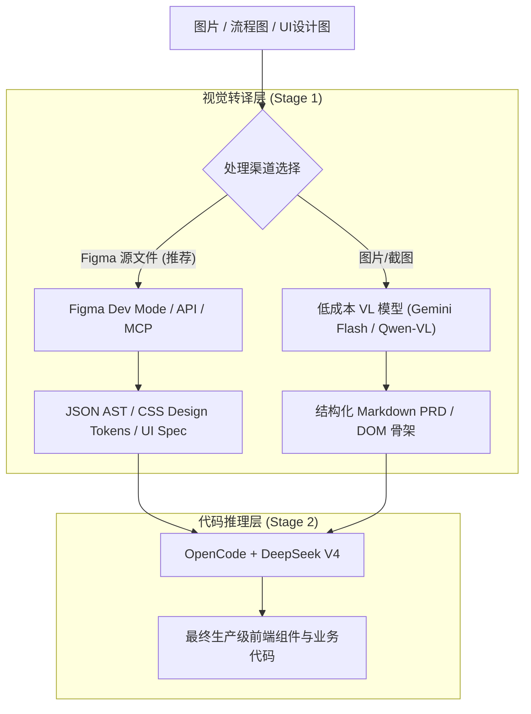

# OpenCode 与 DeepSeek 多模态代码开发最佳实践指南

## 一、 痛点与核心解法架构

### 1.1 痛点背景
在基于 **OpenCode + DeepSeek V4** 的辅助代码开发流程中，DeepSeek 具备顶级的逻辑推理与高性价比代码生成能力，但由于其为纯文本模型，**无法直接处理图片、UI设计图与流程图等多模态输入**。
全程切换为昂贵的多模态大模型（如 GPT-4o / Claude 3.5 Sonnet）会导致开发成本陡增。

### 1.2 核心解决原则：“视觉归视觉，代码归代码”
采用**混合模型架构 (Hybrid Workflow / Model Routing)**，构建**两阶段流水线 (Two-Stage Pipeline)**：
- **阶段 1（视觉转译层）**：利用低成本/免费的多模态模型（如 Gemini 1.5 Flash、Qwen2.5-VL）或设计工具 API（Figma AST），将图像转化为**结构化文本规格**（UI Spec / DOM Tree / JSON / Markdown PRD）。
- **阶段 2（代码生成层）**：将结构化文本输入给 **OpenCode + DeepSeek V4**，发挥其强大的逻辑推理与代码拼装能力完成最终研发。



---

## 二、 核心概念与结构化表达示例

在将“视觉图片”翻译为“代码可理解文本”时，常用的结构化表达方式包括 **DOM Tree**、**UI Spec**、**Design Tokens** 和 **PRD**：

### 2.1 DOM Tree（文档对象模型树）
* **定义**：网页 HTML 的树状层级嵌套结构。
* **作用**：帮助代码大模型理解界面的容器嵌套关系与父子组件结构。
* **JSON 结构示例**：
```json
{
  "tag": "div",
  "className": "login-card",
  "children": [
    { "tag": "h2", "text": "欢迎登录" },
    {
      "tag": "form",
      "children": [
        { "tag": "input", "type": "email", "placeholder": "请输入邮箱" },
        { "tag": "input", "type": "password", "placeholder": "请输入密码" },
        { "tag": "button", "type": "submit", "text": "登录" }
      ]
    }
  ]
}
```

### 2.2 UI Spec（界面规格说明）
* **定义**：对界面布局、尺寸、间距、字体颜色及元素位置进行精确的文本化描述。
* **文本示例**：
> **组件**：登录卡片 (LoginCard)  
> **布局**：垂直居中布局，宽度 400px，内边距 (Padding) 24px，背景纯白，阴影 `0 4px 12px rgba(0,0,0,0.1)`。  
> **元素清单**：  
> 1. **标题**：字号 24px，加粗，文字“欢迎登录”，下边距 16px。  
> 2. **输入框 1**：邮箱输入框，高度 40px，占满宽度，圆角 6px，占位符“请输入邮箱”。  
> 3. **主按钮**：主色调蓝色，高度 44px，占满宽度，文字“登录”，点击高亮。

### 2.3 Design Tokens（设计令牌）
* **定义**：将界面中重复使用的颜色、字号、圆角、间距抽离出来的统一变量描述。
* **JSON 示例**：
```json
{
  "color": {
    "primary": "#1677FF",      // 系统主色
    "text-main": "#1F2937",   // 主文本色
    "background": "#FFFFFF"   // 卡片背景
  },
  "spacing": {
    "sm": "8px",
    "md": "16px",
    "lg": "24px"
  },
  "border-radius": {
    "card": "8px",
    "button": "4px"
  }
}
```

### 2.4 PRD（产品需求文档）
* **本质澄清**：PRD **是一种文档规范/业务标准**（Product Requirement Document），而非某种特定软件的文件格式（如 `.docx` 或 `.pdf`）。在 AI 编程场景中，**Markdown 格式**是编写 PRD 的标准载体。
* **Markdown PRD 示例**：
```markdown
# 需求规格说明书：用户登录模块

## 1. 页面元素拆解 (UI Elements)
- **Logo 区域**：顶部居中展示品牌标志。
- **表单区域**：
  - 邮箱输入框：支持文本输入，包含清空按钮。
  - 密码输入框：支持掩码切换（显示/隐藏密码）。
- **操作区域**：
  - 登录按钮（主按钮）。
  - "忘记密码？"（文本链接）。

## 2. 交互与业务逻辑 (Interactive Rules)
- **校验逻辑**：
  - 点击“登录”时，若邮箱格式不合法，输入框下边框变为红色，并提示：“请输入有效的邮箱地址”。
  - 密码长度需在 8-20 位之间。
- **状态流转**：
  - 点击“登录”后，按钮展示 Loading 加载状态，且不可重复点击。
  - 登录成功：跳转至 `/dashboard` 首页。
  - 登录失败：弹出 Toast 错误提示：“账号或密码错误”。

## 3. 接口数据需求 (API Spec)
- **请求接口**：`POST /api/v1/auth/login`
- **请求参数**：`{ "email": "string", "password": "string" }`
```

---

## 三、 落地场景与最佳实践流程

### 3.1 场景 A：产品需求与流程图拆解
1. **输入**：原型图、架构图、业务流程图截图。
2. **转译 Prompt（前置多模态模型）**：
   > *"请分析这张产品原型图/流程图，提取所有功能点、交互逻辑、页面元素和业务规则，使用 Markdown 格式输出为一份结构化的需求说明书 (PRD)。"*
3. **推理执行（DeepSeek V4）**：
   将生成的 Markdown PRD 复制或注入到 OpenCode 环境中，指令：
   > *"基于以上 PRD 文档，进行 Task 代码任务拆解，并生成对应的数据库 Schema 与 Backend API 逻辑。"*

### 3.2 场景 B：前端 UI 转代码开发

#### 误区澄清
高质量前端开发中，**不宜直接让 AI 观察像素截图写代码**，因为截图会丢失内边距 (Padding/Margin)、真实 Color Code 及 Flex 弹性布局规则。

#### 最佳方案：Figma 源文件 + MCP/API 方案 (0 视觉模型成本)
* **Figma 简介**：Figma 是全球主流的云端矢量 UI/UX 设计与协作工具。其底层数据格式天然是结构化的 JSON / AST 树。
* **实操路径**：
  1. 使用 **Figma Dev Mode** 或插件（如 `Builder.io` / `Figma to Code`），导出选定节点的 DOM / CSS 描述或 JSON Data。
  2. 或在 OpenCode 中配置 **Figma MCP Server**，允许 DeepSeek 直接读取 Figma 节点的 CSS 属性。
  3. DeepSeek 直接读取精准的 CSS 与 DOM 节点，输出匹配 Tailwind / Shadcn UI / React / Vue 的前端代码。

#### 替代方案：截图双模型转译流水线 (无 Figma 源文件时)
1. **Step 1 (Vision AI)**：用 Gemini 1.5 Flash 提取截图骨架：
   > *"分析此截图，生成对应的 HTML 骨架和 Tailwind CSS 类名描述，标识出所有按钮、文本、输入框和布局关系。"*
2. **Step 2 (DeepSeek V4)**：把 Step 1 生成的骨架输入给 DeepSeek：
   > *"这是页面结构描述，请基于 React + TypeScript 编写带有状态管理和事件处理逻辑的组件代码。"*

---

## 四、 选型与成本决策指南

| 方案 | 适用场景 | 识别精度 | 成本 | 推荐指数 |
| :--- | :--- | :--- | :--- | :--- |
| **Figma API / MCP -> DeepSeek V4** | 标准前端 UI 开发 | 🌟🌟🌟🌟🌟 (极高) | **接近 0 元** | 强烈推荐 |
| **Qwen-VL / Gemini Flash -> Spec -> DeepSeek** | 需求图/流程图拆解 / 纯截图转代码 | 🌟🌟🌟🌟 (高) | 极低 ($0.0001/图) | 推荐 |
| **全程 GPT-4o / Claude 3.5 Sonnet** | 全图文混合交互 | 🌟🌟🌟🌟 (高) | 极高 ($0.05+/图) | 不推荐 (成本高) |
