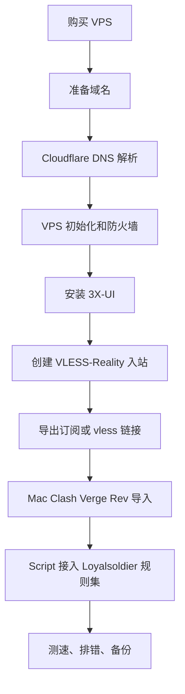

---
tags:
  - vps
  - vpn
  - xray
  - vless
  - clash
  - devops
---
# VPS 自建 VPN 与 Clash 配置指南

面向个人自用场景，记录从购买 VPS、配置 Cloudflare DNS、安装 3X-UI 面板、部署 VLESS-Reality 节点，到 Mac 上用 Clash Verge Rev 和 Loyalsoldier 规则集做白名单分流的完整流程。

截至 `2026-06-01` 核对，本文主要依据 3X-UI、XTLS/Xray、Clash Verge Rev、Loyalsoldier/clash-rules、Cloudflare DNS 文档整理。

> [!warning] 合规与敏感信息
> 仅用于个人合规网络访问、隐私保护和学习用途。不要把 3X-UI 面板用户名、密码、WebBasePath、API Token、Reality private key、客户端 UUID 明文写入笔记或截图中。本文中的所有凭据均使用占位符。

参考地址：

- 3X-UI：<https://github.com/MHSanaei/3x-ui>
- XTLS Reality 配置：<https://xtls.github.io/en/config/transports/reality.html>
- Clash Verge Rev Script：<https://getclashvergerev.org/guide/script.html>
- Loyalsoldier/clash-rules：<https://github.com/Loyalsoldier/clash-rules>
- Cloudflare Proxied DNS records：<https://developers.cloudflare.com/dns/manage-dns-records/reference/proxied-dns-records/>

## 目录

- [Key Takeaways](#key-takeaways)
- [整体路线](#整体路线)
- [路线与 VPS 选择](#路线与-vps-选择)
- [协议选择](#协议选择)
- [3X-UI 与 Marzban 对比](#3x-ui-与-marzban-对比)
- [Cloudflare 域名解析](#cloudflare-域名解析)
- [VPS 初始化](#vps-初始化)
- [安装 3X-UI 面板](#安装-3x-ui-面板)
- [配置面板安全](#配置面板安全)
- [配置 VLESS-Reality 入站](#配置-vless-reality-入站)
- [导出节点或订阅](#导出节点或订阅)
- [Mac Clash Verge Rev 配置](#mac-clash-verge-rev-配置)
- [白名单 Script 脚本](#白名单-script-脚本)
- [验证与排错](#验证与排错)
- [维护与备份](#维护与备份)
- [参考来源](#参考来源)

## Key Takeaways

- 推荐主线：购买低成本 VPS -> 自定义域名解析 -> 安装 3X-UI -> 配置 VLESS + XTLS Vision + Reality -> 导出节点或订阅 -> Mac Clash Verge Rev 白名单分流。
- Reality 节点域名通常必须在 Cloudflare 里设置为 `DNS only`。如果开启橙云代理，客户端会连到 Cloudflare 边缘节点，而不是你的 VPS，VLESS-Reality 通常会失败。
- 3X-UI 适合个人或少量节点快速搭建；Marzban 更偏多用户、多节点、订阅管理和运营式管理。
- VLESS-Reality 是默认首选，适合 TCP 443 和伪装 TLS 访问；Hysteria 2 基于 QUIC/UDP，更适合晚高峰丢包明显的普通线路，但依赖 UDP 连通性。
- 面板端口、SSH、API Token、Reality private key 是核心风险点。能不公网暴露就不公网暴露，至少要限制来源 IP、强密码、及时备份。

## 整体路线



核心目标是把服务端部署和本地分流分开：

- 服务端：只负责稳定、低特征地提供节点。
- 客户端：通过 Clash Verge Rev 做分流、测速、切换和规则更新。

## 路线与 VPS 选择

优先考虑的机房：

| 区域 | 常见城市 | 适合场景 | 注意点 |
| --- | --- | --- | --- |
| 美国西海岸 | 圣何塞、洛杉矶 | 综合性价比高，线路选择多 | 晚高峰质量差异大，优先看回国线路 |
| 日本 | 东京、大阪 | 延迟较低，适合日常浏览和流媒体 | 普通线路晚高峰可能抖动明显 |
| 中国香港 | 香港 | 延迟低，体感好 | 价格较高，IP 风控和滥用风险更常见 |
| 新加坡 | 新加坡 | 东南亚访问和多区域中转 | 回国链路不一定比日本或香港好 |

优质线路标识：

| 标识 | 含义 | 适用运营商 | 判断方式 |
| --- | --- | --- | --- |
| CN2 GIA | 中国电信精品回国线路，稳定性通常更好 | 电信 | 看商家说明、traceroute 是否经过 CN2 GIA 相关链路 |
| AS9929 / AS10099 | 联通精品网相关线路 | 联通 | 看去程和回程路由，晚高峰实测更重要 |
| CMI | 中国移动国际线路或移动优化线路 | 移动 | 移动宽带用户优先关注 |

选购前检查：

- 是否支持 Ubuntu 22.04/24.04 LTS。
- 是否有独立 IPv4，是否附带 IPv6。
- 是否允许自定义防火墙和开放 `443/tcp`。
- 是否支持重装系统、快照、VNC 或救援模式。
- 是否有退款窗口，方便晚高峰实测。
- 不要只看 `ping`，还要看晚高峰速度、丢包和网页打开体感。

## 协议选择

| 协议 | 优点 | 风险或限制 | 推荐场景 |
| --- | --- | --- | --- |
| VLESS + XTLS Vision + Reality | 不依赖真实 TLS 证书，外部表现接近访问正常 HTTPS 站点，适合 TCP 443 | 对配置字段敏感，SNI、public key、short ID 错一个就连不上 | 默认首选 |
| Hysteria 2 | 基于 QUIC/UDP，对丢包和弱线路更友好 | UDP 可能被运营商、机房或本地网络限制 | 普通日本、美西、晚高峰丢包明显时作为补充 |

Reality 的关键点：

- 服务端有 `privateKey`，客户端只拿 `publicKey`。
- `shortId` 是客户端和服务端共同使用的短标识。
- `serverName` / `sni` 要和伪装目标匹配，例如 `www.microsoft.com`。
- `target` 是 Reality 回落或伪装访问的真实目标，例如 `www.microsoft.com:443`。
- `fingerprint` 建议用常见浏览器指纹，例如 `chrome`。

## 3X-UI 与 Marzban 对比

| 维度 | 3X-UI | Marzban |
| --- | --- | --- |
| 定位 | 个人和小规模自建面板 | 多用户、多节点、订阅管理 |
| 上手 | 一键脚本简单，UI 直观 | 组件更多，部署和维护成本更高 |
| 协议支持 | 常见 Xray 协议支持较完整 | 更适合统一管理用户、节点和订阅 |
| 适合人群 | 个人 VPS、自用节点、快速验证 | 有多节点、多用户、配额和订阅需求 |

本笔记选择 3X-UI，因为目标是个人自建、低成本、快速落地。

## Cloudflare 域名解析

建议至少拆分两个子域名：

| 用途 | 示例 | Cloudflare 代理状态 | 说明 |
| --- | --- | --- | --- |
| 节点域名 | `node-us-west.example.com` | `DNS only` | VLESS-Reality 客户端要直连 VPS IP |
| 面板域名 | `panel.example.com` | 优先 `DNS only`，或另做 Zero Trust/反代 | 面板不建议直接暴露给公网 |

Reality 节点域名配置：

1. 进入 Cloudflare 对应域名的 DNS 页面。
2. 添加 `A` 记录：
   - `Name`: `node-us-west`
   - `IPv4 address`: `<VPS_IPV4>`
   - `Proxy status`: `DNS only`
   - `TTL`: `Auto`
3. 如果 VPS 有 IPv6，可以添加 `AAAA` 记录：
   - `Name`: `node-us-west`
   - `IPv6 address`: `<VPS_IPV6>`
   - `Proxy status`: `DNS only`

> [!warning] 不要给 Reality 节点开橙云
> Cloudflare 的橙云代理主要代理 HTTP/HTTPS Web 流量。VLESS-Reality 需要客户端直接连到你的 VPS，如果 DNS 返回 Cloudflare 边缘 IP，Reality 握手通常会失败。

解析检查：

```bash
dig +short node-us-west.example.com
```

期望返回 VPS 的真实公网 IP，而不是 Cloudflare 的边缘 IP。

## VPS 初始化

以下以 Ubuntu/Debian 系为例。

```bash
apt update && apt upgrade -y
apt install curl wget sudo -y
```

建议同时做基础安全配置：

```bash
# 创建普通用户，避免长期直接使用 root
adduser <USER>
usermod -aG sudo <USER>

# 开启基础防火墙
ufw allow OpenSSH
ufw allow 443/tcp

# 面板端口建议只允许自己的公网 IP
ufw allow from <YOUR_PUBLIC_IP> to any port 8443 proto tcp

ufw enable
ufw status verbose
```

如果当前本机公网 IP 经常变化，可以先用云厂商安全组限制端口，或后续改成 Tailscale、Cloudflare Tunnel、Zero Trust 等方式访问面板。

## 安装 3X-UI 面板

3X-UI 官方 README 的一键安装命令：

```bash
bash <(curl -Ls https://raw.githubusercontent.com/mhsanaei/3x-ui/master/install.sh)
```

完整初始化命令：

```bash
# 1. 更新系统软件包。如果弹出蓝色提示框，一般保持默认即可。
apt update && apt upgrade -y

# 2. 安装基础依赖组件
apt install curl wget sudo -y

# 3. 运行 3X-UI 一键安装脚本
bash <(curl -Ls https://raw.githubusercontent.com/mhsanaei/3x-ui/master/install.sh)
```

安装结束后会输出面板信息。不要原样写入笔记，只保留脱敏模板：

```text
Username:    <PANEL_USERNAME>
Password:    <PANEL_PASSWORD>
Port:        8443
WebBasePath: <PANEL_WEB_BASE_PATH>
Database:    SQLite (/etc/x-ui/x-ui.db)
Access URL:  https://<PANEL_DOMAIN>:8443/<PANEL_WEB_BASE_PATH>/
API Token:   <PANEL_API_TOKEN>
```

服务管理常用命令：

```bash
# 打开 3X-UI 管理菜单
x-ui

# 查看服务状态
systemctl status x-ui

# 重启面板
systemctl restart x-ui
```

## 配置面板安全

建议完成这些动作后再创建节点：

- 修改默认用户名和密码，使用密码管理器保存。
- 保留随机 `WebBasePath`，不要改成 `/admin`、`/panel` 这类路径。
- 面板端口不要和节点端口共用。
- 防火墙限制面板端口来源 IP。
- 开启面板 HTTPS 或通过安全隧道访问。
- 关闭不需要的 API；如果必须使用 API Token，按最小权限和定期轮换处理。
- 定期备份 `/etc/x-ui/x-ui.db`。

备份数据库：

```bash
mkdir -p /root/backup/3x-ui
cp /etc/x-ui/x-ui.db /root/backup/3x-ui/x-ui.db.$(date +%Y%m%d_%H%M%S)
```

## 配置 VLESS-Reality 入站

推荐参数：

| 字段 | 推荐值 | 说明 |
| --- | --- | --- |
| Protocol | `vless` | Xray VLESS |
| Port | `443` | 最常见的 HTTPS 端口 |
| Network | `tcp` | Reality 常用 TCP |
| Flow | `xtls-rprx-vision` | XTLS Vision |
| Security | `reality` | 使用 Reality |
| SNI / serverName | `www.microsoft.com` | 伪装目标域名 |
| Target | `www.microsoft.com:443` | Reality 目标站点 |
| Fingerprint | `chrome` | 客户端指纹 |
| Sniffing | 开启 | 建议启用 `http`、`tls`、`quic` |

在 3X-UI 中通常直接通过 UI 生成以下值：

- Client UUID
- Subscription ID
- Reality private key
- Reality public key
- Short ID

也可以在命令行生成部分值：

```bash
# 生成客户端 UUID
uuidgen

# 生成 8 字节 shortId，输出 16 位十六进制
openssl rand -hex 8

# 如果 xray 在 PATH 中，可生成 Reality X25519 密钥对
xray x25519
```

3X-UI 入站配置模板如下。此处仅作为字段对照，推荐在面板 UI 中创建，不要直接覆盖数据库。

```json
{
  "listen": "0.0.0.0",
  "port": 443,
  "protocol": "vless",
  "tag": "in-443-tcp-reality-la",
  "settings": {
    "clients": [
      {
        "id": "<REPLACE_WITH_NEW_UUID>",
        "email": "<CLIENT_EMAIL>",
        "flow": "xtls-rprx-vision",
        "limitIp": 3,
        "totalGB": 536870912000,
        "expiryTime": 0,
        "enable": true,
        "tgId": 0,
        "subId": "<REPLACE_WITH_NEW_SUB_ID>",
        "comment": "LA Reality Vision",
        "reset": 0
      }
    ],
    "decryption": "none",
    "encryption": "none"
  },
  "sniffing": {
    "enabled": true,
    "destOverride": [
      "http",
      "tls",
      "quic"
    ],
    "routeOnly": true
  },
  "streamSettings": {
    "network": "tcp",
    "tcpSettings": {
      "acceptProxyProtocol": false,
      "header": {
        "type": "none"
      }
    },
    "security": "reality",
    "realitySettings": {
      "show": false,
      "xver": 0,
      "target": "www.microsoft.com:443",
      "serverNames": [
        "www.microsoft.com"
      ],
      "privateKey": "<REPLACE_WITH_NEW_REALITY_PRIVATE_KEY>",
      "minClientVer": "",
      "maxClientVer": "",
      "maxTimeDiff": 120000,
      "shortIds": [
        "<REPLACE_WITH_NEW_SHORT_ID_16_HEX>"
      ],
      "mldsa65Seed": "",
      "settings": {
        "publicKey": "<REPLACE_WITH_NEW_REALITY_PUBLIC_KEY>",
        "fingerprint": "chrome",
        "serverName": "www.microsoft.com",
        "spiderX": "/en-us/",
        "mldsa65Verify": ""
      }
    }
  }
}
```

关键检查：

- `privateKey` 只留在服务端。
- `publicKey`、`shortId`、`serverName`、`fingerprint` 要和客户端完全一致。
- `serverNames` 与客户端 `sni/servername` 一致。
- `node-us-west.example.com` DNS 必须指向 VPS IP。
- VPS 安全组和系统防火墙都放行 `443/tcp`。

## 导出节点或订阅

3X-UI 中可以复制订阅链接或单个节点链接。单节点 VLESS 链接大致形态如下：

```text
vless://<UUID>@node-us-west.example.com:443?encryption=none&flow=xtls-rprx-vision&security=reality&sni=www.microsoft.com&fp=chrome&pbk=<REALITY_PUBLIC_KEY>&sid=<SHORT_ID>&type=tcp&headerType=none#LA-Reality-Vision
```

建议：

- 给每台设备单独创建客户端 UUID，便于吊销和限速。
- 节点名称带上地区和协议，例如 `US-LA-Reality`。
- 如果订阅链接包含 token，不要公开分享。
- 不要把 Reality private key 放进客户端配置。

## Mac Clash Verge Rev 配置

推荐方式：

1. Mac 安装 Clash Verge Rev。
2. 在 `Profiles` 中导入 3X-UI 的订阅链接，或手动写入 YAML。
3. 在 `Proxies` 中测速并选择节点。
4. 在 `Settings` 中开启系统代理。
5. 使用 `Script` 扩展配置规则，实现白名单模式。

手动 YAML 节点示例：

```yaml
proxies:
  - name: US-LA-Reality
    type: vless
    server: node-us-west.example.com
    port: 443
    uuid: <UUID>
    network: tcp
    tls: true
    udp: true
    flow: xtls-rprx-vision
    servername: www.microsoft.com
    client-fingerprint: chrome
    reality-opts:
      public-key: <REALITY_PUBLIC_KEY>
      short-id: <SHORT_ID>
```

基础代理组示例：

```yaml
proxy-groups:
  - name: PROXY
    type: select
    proxies:
      - US-LA-Reality
      - DIRECT

rules:
  - GEOIP,CN,DIRECT
  - MATCH,PROXY
```

## 白名单 Script 脚本

白名单模式的核心是：

- 国内、局域网、常见国内域名走 `DIRECT`。
- 广告和隐私追踪域名走 `REJECT`。
- 需要代理的域名走 `PROXY`。
- 没命中前面规则的剩余流量走 `PROXY`。

在 Clash Verge Rev 的 Script 配置中可以使用 `function main(config) { return config; }` 修改最终配置。下面脚本参考 Loyalsoldier/clash-rules 规则集，并保持规则组名称简单。

```javascript
function main(config) {
  const proxyGroupName = "PROXY";
  const proxyNames = (config.proxies || []).map((proxy) => proxy.name).filter(Boolean);

  config["proxy-groups"] = [
    {
      name: proxyGroupName,
      type: "select",
      proxies: [...proxyNames, "DIRECT"]
    }
  ];

  config["rule-providers"] = {
    reject: {
      type: "http",
      behavior: "domain",
      url: "https://fastly.jsdelivr.net/gh/Loyalsoldier/clash-rules@release/reject.txt",
      path: "./ruleset/loyalsoldier/reject.yaml",
      interval: 86400
    },
    icloud: {
      type: "http",
      behavior: "domain",
      url: "https://fastly.jsdelivr.net/gh/Loyalsoldier/clash-rules@release/icloud.txt",
      path: "./ruleset/loyalsoldier/icloud.yaml",
      interval: 86400
    },
    apple: {
      type: "http",
      behavior: "domain",
      url: "https://fastly.jsdelivr.net/gh/Loyalsoldier/clash-rules@release/apple.txt",
      path: "./ruleset/loyalsoldier/apple.yaml",
      interval: 86400
    },
    google: {
      type: "http",
      behavior: "domain",
      url: "https://fastly.jsdelivr.net/gh/Loyalsoldier/clash-rules@release/google.txt",
      path: "./ruleset/loyalsoldier/google.yaml",
      interval: 86400
    },
    proxy: {
      type: "http",
      behavior: "domain",
      url: "https://fastly.jsdelivr.net/gh/Loyalsoldier/clash-rules@release/proxy.txt",
      path: "./ruleset/loyalsoldier/proxy.yaml",
      interval: 86400
    },
    direct: {
      type: "http",
      behavior: "domain",
      url: "https://fastly.jsdelivr.net/gh/Loyalsoldier/clash-rules@release/direct.txt",
      path: "./ruleset/loyalsoldier/direct.yaml",
      interval: 86400
    },
    private: {
      type: "http",
      behavior: "domain",
      url: "https://fastly.jsdelivr.net/gh/Loyalsoldier/clash-rules@release/private.txt",
      path: "./ruleset/loyalsoldier/private.yaml",
      interval: 86400
    },
    gfw: {
      type: "http",
      behavior: "domain",
      url: "https://fastly.jsdelivr.net/gh/Loyalsoldier/clash-rules@release/gfw.txt",
      path: "./ruleset/loyalsoldier/gfw.yaml",
      interval: 86400
    },
    tldNotCn: {
      type: "http",
      behavior: "domain",
      url: "https://fastly.jsdelivr.net/gh/Loyalsoldier/clash-rules@release/tld-not-cn.txt",
      path: "./ruleset/loyalsoldier/tld-not-cn.yaml",
      interval: 86400
    },
    telegramcidr: {
      type: "http",
      behavior: "ipcidr",
      url: "https://fastly.jsdelivr.net/gh/Loyalsoldier/clash-rules@release/telegramcidr.txt",
      path: "./ruleset/loyalsoldier/telegramcidr.yaml",
      interval: 86400
    },
    cncidr: {
      type: "http",
      behavior: "ipcidr",
      url: "https://fastly.jsdelivr.net/gh/Loyalsoldier/clash-rules@release/cncidr.txt",
      path: "./ruleset/loyalsoldier/cncidr.yaml",
      interval: 86400
    },
    lancidr: {
      type: "http",
      behavior: "ipcidr",
      url: "https://fastly.jsdelivr.net/gh/Loyalsoldier/clash-rules@release/lancidr.txt",
      path: "./ruleset/loyalsoldier/lancidr.yaml",
      interval: 86400
    },
    applications: {
      type: "http",
      behavior: "classical",
      url: "https://fastly.jsdelivr.net/gh/Loyalsoldier/clash-rules@release/applications.txt",
      path: "./ruleset/loyalsoldier/applications.yaml",
      interval: 86400
    }
  };

  config.rules = [
    "RULE-SET,applications,DIRECT",
    "RULE-SET,private,DIRECT",
    "RULE-SET,reject,REJECT",
    "RULE-SET,icloud,DIRECT",
    "RULE-SET,apple,DIRECT",
    "RULE-SET,google,PROXY",
    "RULE-SET,proxy,PROXY",
    "RULE-SET,gfw,PROXY",
    "RULE-SET,tldNotCn,PROXY",
    "RULE-SET,direct,DIRECT",
    "RULE-SET,lancidr,DIRECT,no-resolve",
    "RULE-SET,cncidr,DIRECT,no-resolve",
    "RULE-SET,telegramcidr,PROXY,no-resolve",
    "GEOIP,CN,DIRECT,no-resolve",
    "MATCH,PROXY"
  ];

  return config;
}
```

使用建议：

- 如果订阅里已经有复杂的代理组，这个脚本会覆盖 `proxy-groups`，适合个人单组白名单模式。
- 如果有多个地区节点，可以把 `PROXY` 改成 `url-test` 或 `fallback`，并保留手动选择组。
- 第一次启用后检查 Clash Verge Rev 日志，确认规则集下载成功。
- 如果 `fastly.jsdelivr.net` 访问异常，可改成 Loyalsoldier README 中提供的其他镜像或 raw 地址。

## 验证与排错

服务端检查：

```bash
# 解析是否指向 VPS
dig +short node-us-west.example.com

# 服务是否运行
systemctl status x-ui

# 端口是否监听
ss -lntp | grep ':443'
ss -lntp | grep ':8443'

# 防火墙
ufw status verbose
```

客户端检查：

- Clash Verge Rev 节点能否测速。
- 日志里是否出现 Reality 握手、SNI、public key、short ID 相关错误。
- 浏览器访问 IP 查询网站，确认出口 IP 是 VPS。
- 国内网站是否直连，海外网站是否走代理。

常见问题：

| 现象 | 可能原因 | 处理 |
| --- | --- | --- |
| 节点完全连不上 | Cloudflare 开了橙云代理 | 节点域名改为 `DNS only` |
| Reality 握手失败 | `sni`、`public-key`、`short-id` 不一致 | 对照 3X-UI 入站重新复制客户端参数 |
| 443 端口不通 | 云厂商安全组或 VPS 防火墙未放行 | 同时检查安全组和 `ufw` |
| 面板打不开 | 面板端口被防火墙限制或 WebBasePath 错误 | 从允许的公网 IP 访问，核对完整 URL |
| 白名单规则不生效 | Script 没启用或规则集下载失败 | 查看 Clash Verge Rev 日志，检查规则集 URL |
| 晚高峰慢 | VPS 回国线路差或丢包高 | 换机房、换优质线路，或补充 Hysteria 2 |

## 维护与备份

定期动作：

- 每月更新系统和 3X-UI。
- 每次改配置前备份 `/etc/x-ui/x-ui.db`。
- 给不同设备分配不同客户端 UUID。
- 不再使用的设备及时删除客户端。
- 面板密码、API Token、订阅 Token 定期轮换。
- 晚高峰定期测速，避免只看白天速度。

更新系统：

```bash
apt update && apt upgrade -y
```

备份 3X-UI 数据库：

```bash
mkdir -p /root/backup/3x-ui
cp /etc/x-ui/x-ui.db /root/backup/3x-ui/x-ui.db.$(date +%Y%m%d_%H%M%S)
```

迁移到新 VPS 时的思路：

1. 新 VPS 安装同版本或兼容版本 3X-UI。
2. 停止旧服务和新服务。
3. 复制 `/etc/x-ui/x-ui.db`。
4. 检查新 VPS 防火墙和安全组。
5. 修改 Cloudflare DNS A/AAAA 记录到新 IP。
6. 启动服务并用 Clash Verge Rev 测试。

## 参考来源

- 3X-UI GitHub：<https://github.com/MHSanaei/3x-ui>
- XTLS Reality 配置文档：<https://xtls.github.io/en/config/transports/reality.html>
- Clash Verge Rev Script 文档：<https://getclashvergerev.org/guide/script.html>
- Loyalsoldier/clash-rules：<https://github.com/Loyalsoldier/clash-rules>
- Cloudflare Proxied DNS records：<https://developers.cloudflare.com/dns/manage-dns-records/reference/proxied-dns-records/>
