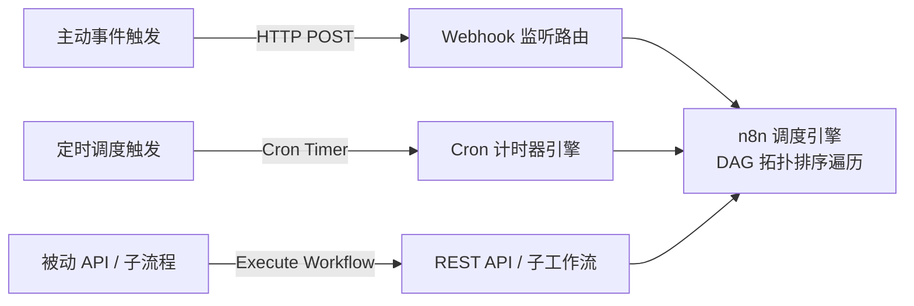

# n8n 核心架构：声明式存储与事件驱动引擎解析

## 笔记概览

### 知识鸟瞰

1. 工程价值与选型对比                  [前提·对比]
   └─ 纯代码痛点 ↔ n8n 可视化/凭据/重试优势

2. 声明式存储模型 (Declarative JSON)   [核心·结构]
   ├─ Node / Connection 拓扑解构
   └─ SQLite / PostgreSQL 持久化表
   └─ 关系：定义描述 ➔ 运行时 DAG 序列化

3. 运行引擎与驱动机制                  [核心·机制]
   ├─ 触发源分类（Webhook / Cron / API）
   └─ 调度算法：DAG 拓扑排序遍历

4. 部署与扩展架构                      [落地·扩展]
   └─ 单进程 Main 模式 ↔ Redis + BullMQ 分布式 Worker

主线：n8n 采用声明式 JSON 定义工作流拓扑，在 Node.js 事件驱动引擎下将 JSON 解析为 DAG 有向无环图，结合凭据加密与 Worker 队列，实现了远超传统纯脚本的工程化自动化能力。

### 各节内容概要

| 章节/部分 | 核心内容 | 关键要点 |
| :--- | :--- | :--- |
| **1. 选型对比** | 分析纯代码脚本在异常调试、凭据托管等方面的痛点与 n8n 的优势 | 强调“可视化调试”与“凭据管理”的工程价值 |
| **2. 存储格式** | 详细解构 n8n Workflow JSON 核心字段（`nodes`, `connections` 等） | 说明声明式图结构的序列化机制 |
| **3. 驱动机制** | 剖析 Webhook、Cron 与 API 三种触发源及 DAG 遍历流程 | 解释 Node.js 异步事件循环的驱动原理 |
| **4. 部署架构** | 对比单进程 Main 模式与基于 Redis BullMQ 的 Worker 集群模式 | 提供生产环境横向扩展拓扑图 |
| **5. 核心概念** | 整理 DAG、Declarative JSON、Execution State 等核心术语 | 建立架构概念快速回忆索引 |
| **6. 核心要点** | 总结 n8n 架构落地的工程设计原则 | 明确单机与集群模式的适用边界 |

---

## 为什么选择 n8n：对比纯脚本/代码编排

在自动化集成场景中，开发者常面临“写 Python/Node.js 脚本”还是“使用 n8n 这类工作流引擎”的选择。下表总结了两者在工程层面的对比：

| 评估维度 | 纯代码/脚本 (Python/Node.js/Shell) | n8n 工作流编排平台 |
| :--- | :--- | :--- |
| **状态追溯与调试** | 依赖文本 Log，单步排错需加 `print`/重新运行 | **全局输入输出可视化**，保留每一步中间 JSON，支持单节点重试 |
| **凭据与鉴权管理** | 需硬编码/环境变量配置，手写 OAuth2 Refresh Token | **加密凭据库**，自动托管 OAuth2/API Key/签名及刷新 |
| **流程控制与重试** | 需手写重试逻辑、指数退避、并发锁与错误捕获 | 原生支持 If/Switch 分支、Loop 循环、Error Trigger 自动重试 |
| **自定义逻辑扩展** | 原生支持任意复杂代码 | **内置 `Code` 节点**，支持在节点内直接编写 JS/Python 逻辑 |
| **版本控制与迁移** | 依赖 `.py`/`.js` 文件 Git 管理 | 导出为标准 JSON，既支持 Git 管理，也支持可视化推拉 |

---

## n8n 声明式存储格式与数据结构解析

n8n 的 Workflow 在底层采用 **声明式（Declarative）JSON 格式** 描述。

### 1. Workflow JSON 结构解构

一个标准的 Workflow JSON 核心结构如下：

```json
{
  "name": "GitHub Issues to Feishu Notification",
  "nodes": [
    {
      "id": "node_webhook_01",
      "name": "Github Webhook",
      "type": "n8n-nodes-base.githubTrigger",
      "typeVersion": 1,
      "position": [250, 300],
      "parameters": {
        "owner": "my-org",
        "repository": "my-repo",
        "events": ["issues"]
      }
    },
    {
      "id": "node_code_02",
      "name": "Format Payload",
      "type": "n8n-nodes-base.code",
      "typeVersion": 2,
      "parameters": {
        "jsCode": "return [{ json: { title: $input.first().json.issue.title } }];"
      }
    }
  ],
  "connections": {
    "Github Webhook": {
      "main": [
        [
          {
            "node": "Format Payload",
            "type": "main",
            "index": 0
          }
        ]
      ]
    }
  },
  "settings": {
    "executionOrder": "v1"
  }
}
```

* **`nodes`（节点数组）**：记录节点的类型 (`type`)、参数配置 (`parameters`)、版本 (`typeVersion`) 以及在画布上的像素坐标 (`position`)。
* **`connections`（连接关系图）**：采用邻接表的形式记录数据流向。例如 `Github Webhook` 的 `main` 输出端连接到了 `Format Payload` 的 `main` 输入端 0 号索引。
* **`pinData`（Mock 固化数据）**：调试时保存的临时节点数据，方便脱机测试。

### 2. 数据库持久化结构

在 n8n 运行时，存储层（SQLite 或 PostgreSQL）将 JSON 序列化并存入核心表：
* **`workflow_entity`**：存储 Workflow ID、名称、激活状态 (`active`)、完整 JSON 定义及归属用户。
* **`credentials_entity`**：存储加密后的 API Key、OAuth Token（使用 `N8N_ENCRYPTION_KEY` 进行 AES-256 加密）。
* **`execution_entity`**：存储每次执行的历史状态、耗时、输入输出 Data 及错误堆栈。

---

## n8n 的运行与驱动机制

n8n 基于 **Node.js 异步事件循环（Event Loop）**，在逻辑上将 Workflow 解析为 **DAG（有向无环图）** 进行逐节点调度。

### 1. 触发源分类（Trigger System）



1. **Webhook 驱动**：n8n 启动时在 Express/Fastify 路由中注册 Endpoint。收到外部请求后，推送该事件上下文进入 Task Queue。
2. **Cron 定时驱动**：通过内置计时器循环轮询，定时拉取任务或启动流程。
3. **API / 子流程驱动**：由外部系统调用 `/api/v1/executions` 接口或主流程的 `Execute Workflow` 节点触发。

### 2. 运行时架构部署模式

根据并发量的不同，n8n 支持两种运行架构：

```mermaid
flowchart TD
    subgraph 单进程主模式 (Main Process Mode)
        HTTP1[HTTP / Webhook] --> MainProc[n8n Main 进程\n(包含 Webserver + DAG 引擎 + 执行逻辑)]
        MainProc --> DB1[(SQLite / Postgres)]
    end

    subgraph 高并发分布式队列模式 (Queue / Worker Mode)
        HTTP2[HTTP / Webhook] --> MainServer[n8n Main 进程\n(仅负责接收请求与路由)]
        MainServer -- "推送执行任务" --> Redis[(Redis Queue / BullMQ)]
        Redis -- "抢占任务" --> Worker1[n8n Worker 1]
        Redis -- "抢占任务" --> Worker2[n8n Worker 2]
        Worker1 --> MainDB[(PostgreSQL)]
        Worker2 --> MainDB
    end
```

* **单进程主模式 (Main Process Mode)**：
  * **场景**：适合个人部署或低并发场景。
  * **机制**：单个 Node.js 进程同时承担 UI 托管、Webhook 接收、DAG 解析与节点执行。
* **分布式队列模式 (Queue / Worker Mode)**：
  * **场景**：高并发生产环境。
  * **机制**：Main 进程只做 Webhook 接收与事件分发，将任务推入 **Redis (BullMQ)** 队列，由多个独立的 **n8n Worker 进程** 消费并执行节点，保证系统的高吞吐与高可用。

---

## 核心概念速查

| 概念 | 一句话 | 类比 | 为什么重要 |
| :--- | :--- | :--- | :--- |
| **DAG (有向无环图)** | n8n 用于表示节点拓扑依赖的数学结构 | 带有单向箭头且绝不循环的流程图 | 保证节点执行按依赖关系严格展开，防止无限死循环 |
| **Declarative JSON** | 用数据（JSON）描述流程而不是用代码描述流程 | 建筑的“施工蓝图”而非“施工过程” | 使得工作流易于序列化、导入导出以及被 AI 直接阅读与生成 |
| **BullMQ Worker** | 生产模式下负责异步消费并执行节点的后台进程 | 生产线上的“流水线工人” | 实现了 n8n 架构的横向扩展能力，避免主进程因计算阻塞 |

---

## 核心要点

- **[结论]** n8n 的核心是“声明式 JSON 描述”与“Node.js 事件驱动 DAG 引擎”的结合，兼具了代码的灵活性与可视化的工程可维护性。
- **[机制]** 在节点执行时，n8n 将上一节点的输出以 `[$input.all()]` 的统一 JSON 数组形式传递给下一节点，实现了统一的数据流管理。
- **[条件]** 运行高性能高并发场景时，必须部署为 Redis + BullMQ 的 Queue/Worker 模式，并使用 PostgreSQL 代替 SQLite。
- **[限制]** 虽然 JSON 声明式极易被 AI 解析与生成，但在超长流程中 JSON 体积变大可能增加传输开销，建议将大流程拆分为子工作流 (Sub-workflow)。
- **[行动原则]** 业务逻辑优先使用可视化节点与少量 Code 节点混合编写，凭据务必使用 n8n 统一凭据库管理，切勿硬编码在 Node 参数中。

---

## 参考来源

- [n8n Architecture & Scaling Documentation](https://docs.n8n.io/hosting/scaling/queue-mode/)
- [n8n Workflow Data Structure Specification](https://docs.n8n.io/integrations/creating-nodes/build/declarative-style-node/)
