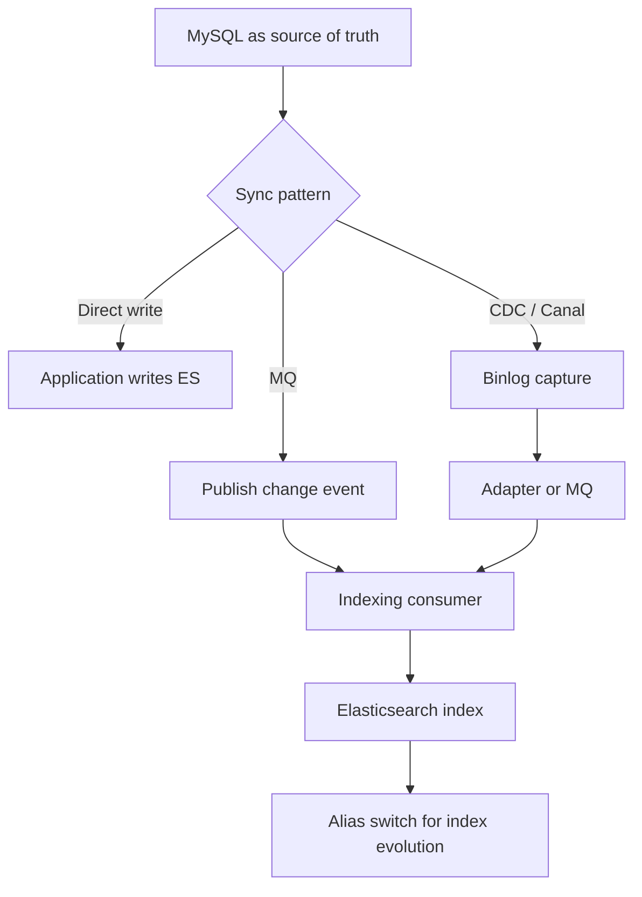

# Elasticsearch 数据同步、别名与重建索引

这篇笔记整理 Elasticsearch 在工程演进阶段最容易出问题的三类事情：索引怎么平滑升级、数据怎么从关系库同步过来、以及 alias / reindex / CDC 在其中各自扮演什么角色。

官方/来源：

- Reindex：<https://www.elastic.co/guide/en/elasticsearch/reference/current/docs-reindex.html>
- Aliases：<https://www.elastic.co/guide/en/elasticsearch/reference/current/aliases.html>
- raw source：[[.raw/articles/Elasticsearch Notion 导出来源记录]]

[TOC]

## 目录

- [Key Takeaways](#key-takeaways)
- [为什么索引演进是核心问题](#为什么索引演进是核心问题)
- [Alias 的作用](#alias-的作用)
- [Reindex 的使用方式](#reindex-的使用方式)
- [MySQL 到 Elasticsearch 的同步方案](#mysql-到-elasticsearch-的同步方案)
- [Canal 架构的价值与边界](#canal-架构的价值与边界)
- [最佳实践](#最佳实践)
- [Architecture or Flow](#architecture-or-flow)
- [Related Pages](#related-pages)
- [参考来源](#参考来源)

## Key Takeaways

- Elasticsearch 的索引演进，本质上是“新索引上线 + 数据迁移 + 路由切换”问题。
- Mapping 大改通常不应在线原地修，而要通过 `new index + reindex + alias switch` 完成。
- 数据同步不要只盯“怎么写进 ES”，还要同时考虑一致性、延迟、重试、幂等与回补。
- 原始来源里用 Canal 讲 MySQL binlog 同步，这是典型的 CDC 思路；它是成熟方案，但不是零成本方案。

## 为什么索引演进是核心问题

ES 的很多变更不能像关系库那样“直接改表结构后继续跑”：

- 字段类型改错
- analyzer 要变
- `text` 想改成 `keyword`
- nested 结构要重建

这些事情通常都意味着：

1. 新建索引
2. 迁移数据
3. 切换流量

## Alias 的作用

alias 是索引的逻辑入口层，用来解耦：

- 应用程序使用的名字
- 物理索引真正的名字

### alias 的典型用途

- 零停机索引切换
- 重建索引后的平滑迁移
- 读写分离约定
- 带过滤条件的逻辑视图

### 一个典型流程

1. 旧索引 `orders_v1`
2. 新索引 `orders_v2`
3. 应用始终访问 alias `orders_current`
4. 数据迁移完成后，把 alias 从 `v1` 切到 `v2`

## Reindex 的使用方式

`_reindex` 的本质是：

- 从源索引读
- 写入目标索引

它常用于：

- Mapping 升级
- analyzer 调整
- 索引拆分 / 合并
- 历史数据搬迁

### 同步与异步

- 小任务可以同步执行
- 大任务更适合 `wait_for_completion=false`
- 异步后要结合任务 API 观察进度、失败数与吞吐

### reindex 不解决什么

- 不会自动帮你切换业务读写路由
- 不会自动解决双写窗口
- 不会自动处理外部系统幂等

所以它只是迁移动作，不是完整迁移方案。

## MySQL 到 Elasticsearch 的同步方案

### 1. 应用层同步调用

流程：

- 业务写 MySQL
- 同步调用搜索写入

优点：

- 实现简单

缺点：

- 耦合高
- 对主链路延迟不友好
- 失败补偿复杂

### 2. MQ 异步通知

流程：

- 业务写 MySQL
- 发消息
- 下游搜索索引服务消费并写 ES

优点：

- 解耦
- 缓冲削峰

缺点：

- 需要治理消息可靠性、幂等与补偿

### 3. CDC / Binlog 订阅

原始来源重点讲了 Canal，这是一类典型 CDC 方案：

- 监听 MySQL binlog
- 解析增量变化
- 投递到适配器或消息系统
- 写入 Elasticsearch

优点：

- 对业务服务侵入低
- 更适合数据库已是事实源的系统

缺点：

- 基础设施更复杂
- 运维与观测要求更高

## Canal 架构的价值与边界

原始来源记录了 `canal-server + canal-adapter + canal-admin` 的配置思路，这对理解架构非常有帮助。

它的核心价值在于：

- 把“增量变化”从业务代码里抽出来
- 通过 binlog 订阅实现近实时索引同步
- 让 ES 成为面向查询的派生读模型

但要注意：

- binlog 开启本身有成本
- 字段转换逻辑需要可测试
- 全量回灌与增量追平需要清晰策略
- 同步链路不能替代业务主事实源

## 最佳实践

- 面向未来的索引，一开始就用 alias 承接业务入口。
- Mapping 升级优先走“新索引 + reindex + alias switch”。
- 同步链路必须明确重试、幂等、死信与补偿策略。
- 关系库到 ES 的同步，优先把 ES 视为派生读模型，而不是主事实源。
- 大规模同步要准备全量回补、增量追平、校验对账三件套。

## Architecture or Flow

## Related Pages

- [[Elasticsearch 阅读指南]]
- [[Elasticsearch 知识索引]]
- [[Elasticsearch 索引设计、文档与查询 DSL]]
- [[Elasticsearch 集群与分布式架构]]
- [[.raw/articles/Elasticsearch Notion 导出来源记录]]

## 参考来源

- Reindex：<https://www.elastic.co/guide/en/elasticsearch/reference/current/docs-reindex.html>
- Aliases：<https://www.elastic.co/guide/en/elasticsearch/reference/current/aliases.html>
- raw source：[[.raw/articles/Elasticsearch Notion 导出来源记录]]
