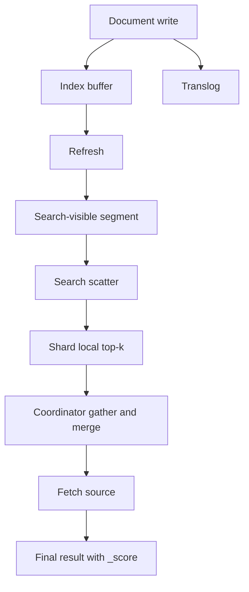

# Elasticsearch 检索原理、NRT 与相关性评分

这篇笔记整理 Elasticsearch 的底层工作方式：为什么它能快、为什么它是近实时、一次写入如何变成可搜索数据、默认排序为什么是这样，以及如何在工程中控制相关性。

官方/来源：

- Near real-time search：<https://www.elastic.co/guide/en/elasticsearch/reference/current/near-real-time.html>
- raw source：[[.raw/articles/Elasticsearch Notion 导出来源记录]]

## 目录

- [Key Takeaways](#key-takeaways)
- [倒排索引与检索基础](#倒排索引与检索基础)
- [写入链路与 NRT](#写入链路与-nrt)
- [搜索链路](#搜索链路)
- [相关性评分与 BM25](#相关性评分与-bm25)
- [评分控制](#评分控制)
- [查询分析与调优](#查询分析与调优)
- [最佳实践](#最佳实践)
- [Architecture or Flow](#architecture-or-flow)
- [Related Pages](#related-pages)
- [参考来源](#参考来源)

## Key Takeaways

- Elasticsearch 的速度来自倒排索引，而不是“数据库本身更快”。
- 它是 `Near Real-Time`，不是“写完立刻全局可见”。
- 写入后的可见性依赖 `refresh`，持久性依赖 `translog + flush`。
- 默认排序 `_score` 背后是 Lucene 相似度算法，当前主流理解应以 BM25 为基准。

## 倒排索引与检索基础

全文检索的核心不是扫描文档，而是先把文档拆成 token，再建立 token 到文档列表的映射。

倒排索引通常承载的信息包括：

- token 本身
- 包含该 token 的文档列表
- 词频
- 位置
- 可能的偏移量

这使得搜索从“遍历所有文档”变成“查 token 对应 posting list，再做交集、并集、排序和回查”。

## 写入链路与 NRT

从工程视角，可以把一次写入理解成三层传播：

1. 进入内存缓冲区
2. 记录到 translog
3. refresh 后对搜索可见
4. flush 后更稳定地落盘

### 为什么是 Near Real-Time

Elasticsearch 的“近实时”意味着：

- 文档写入成功
- 不代表立刻就能被搜索到
- 一般要等 refresh 周期后才变得可见

这解释了很多“写完立刻查不到”的问题。

### refresh、flush、translog 的职责

| 机制 | 解决的问题 | 典型含义 |
| --- | --- | --- |
| `refresh` | 搜索可见性 | 让新 segment 对搜索可见 |
| `translog` | 崩溃恢复 | 在 flush 前兜住最近操作 |
| `flush` | 更稳妥持久化 | 把状态推进到更稳定的磁盘阶段 |

### 更新与删除为什么不是真删

在 Lucene 语义里：

- 删除通常是逻辑删除标记
- 更新通常等价于“旧文档标删 + 新文档写入”

这也是 segment merge 很重要的原因。

### segment merge

segment 是不可变的，长期运行后会不断变多。merge 的职责是：

- 合并小 segment
- 清理已删除文档
- 改善查询性能与磁盘利用率

代价是：

- 后台 I/O 与 CPU 成本
- 写入高峰期要关注 merge 压力

## 搜索链路

一个跨分片搜索，通常经历三个逻辑阶段：

1. `scatter`：把请求分发到相关分片
2. `gather`：收集各分片 top-k 结果
3. `fetch`：按最终候选文档回查完整 `_source`

这也解释了为什么：

- 排序越复杂，跨分片归并越重
- 深分页越深，协调节点越难受

## 相关性评分与 BM25

默认 `_score` 的直觉可以记成：

- 词出现得越相关
- 词越稀有
- 命中越集中
- 文档就越可能排前

### BM25 的工程理解

BM25 可以粗略理解为三个因素的组合：

- `TF`：词在文档字段里出现的频率
- `IDF`：词在全库中的稀有程度
- `FieldNorm`：字段长度归一化

因此：

- 稀有词更值钱
- 标题命中往往比正文命中更重要
- 刷词有收益，但边际递减

### Mapping 对评分的影响边界

原始来源里有一个很重要的纠偏：权重控制不在 Mapping 里完成。

Mapping 主要决定：

- 字段类型
- 是否索引
- 用什么 analyzer
- 是否保留 norms

它能间接影响评分，但不能直接承担“业务排序规则”的职责。

## 评分控制

### 1. boost

最直接的加权方式，适合：

- 标题比分正文更重要
- 某些字段命中要显著加权

### 2. bool should

适合把“更好但不是必须”的条件作为加分项，例如：

- 热门标识
- 标签命中
- 标题额外命中

### 3. function_score

这是把文本相关性和业务数值结合起来的主力方案，例如：

- 点击量
- 热度
- 发布时间
- 评分

典型组合：

- `BM25`
- `field boost`
- `function_score`

### 4. script_score / script sort

能力最强，但要慎用：

- 可完全自定义
- 但成本高、缓存差、吞吐差

适合：

- 小流量、高精度、规则很强的场景

不适合：

- 高频大流量搜索主链路

## 查询分析与调优

复杂 query 不要拍脑袋优化，应优先看 `profile`：

- 哪个子句最慢
- 哪一步 collector 成本高
- 是 query 本身慢，还是排序 / 高亮 / 回查慢

再结合：

- shard 数
- 排序方式
- filter 命中率
- segment / merge 状态

做有证据的优化。

## 最佳实践

- 把 `refresh` 和“事务提交成功”严格区分。
- 大量写入时，不要滥用手动 refresh。
- 评分体系先保证可解释，再追求复杂。
- 默认排序问题先用 `boost + function_score` 解决，`script_score` 作为后手。
- 高亮、脚本、复杂排序都要算在搜索成本里，而不是只看 query 子句。

## Architecture or Flow

## Related Pages

- [[Elasticsearch 阅读指南]]
- [[Elasticsearch 知识索引]]
- [[Elasticsearch 基础与核心概念]]
- [[Elasticsearch 深分页与结果遍历]]
- [[.raw/articles/Elasticsearch Notion 导出来源记录]]

## 参考来源

- Near real-time search：<https://www.elastic.co/guide/en/elasticsearch/reference/current/near-real-time.html>
- raw source：[[.raw/articles/Elasticsearch Notion 导出来源记录]]
