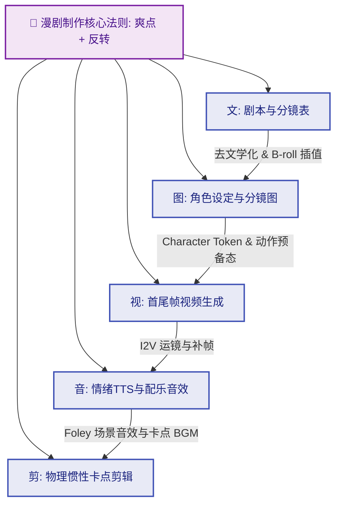

# AI短视频与漫剧制作全流程指南：从剧本到剪辑的标准化 Prompt 工作流

> **Key Takeaways (核心要点概览)**
> 1. **漫剧核心法则**：爆款短视频/漫剧的核心在于 **爽点 (情绪高频刺激) + 反转 (戏剧性冲突)**。
> 2. **五要素标准化闭环**：**文 (剧本分镜)** $\rightarrow$ **图 (角色三视图与分镜图)** $\rightarrow$ **视 (单/双图视频生成)** $\rightarrow$ **音 (情绪TTS与 Foley 音效)** $\rightarrow$ **剪 (物理惯性卡点剪辑)**。
> 3. **去文学化与 B-roll 插值**：剔除所有心理活动等不可视词汇；针对长台词强行插入 20% 情绪空镜 (B-roll)，彻底解决 AI 视频人设单调与口型崩坏痛点。
> 4. **角色一致性闭环**：通过 `Character Token` 硬编码外貌与 A-pose 三视图立绘，确保全剧镜头角色不“换脸”。

---

## 🛠️ 全流程 AI 工具生态矩阵 (Tools & Links)

| 环节 | 阶段分类 | 推荐 AI 工具 / 平台 | 官方/常用链接 (Links) | 核心用途与选型建议 |
| :--- | :--- | :--- | :--- | :--- |
| **文** | **剧本&分镜** | **ChatGPT** / **Claude** | [chatgpt.com](https://chatgpt.com) / [claude.ai](https://claude.ai) | 剧本梗概、爽点爆点设计、长文本拆分分镜 |
| | | **DeepSeek** / **Kimi** | [deepseek.com](https://deepseek.com) / [kimi.moonshot.cn](https://kimi.moonshot.cn) | 高性价比长文本推理、剧本去文学化转化 |
| **图** | **角色&分镜生图** | **Midjourney** | [midjourney.com](https://www.midjourney.com) | 高质量角色立绘、风格迁移、画面质感之王 |
| | | **即梦 AI (Dreamina)** | [jimeng.jianying.com](https://jimeng.jianying.com) | 字节旗下，对中文 Prompt 理解极佳，适合国漫/3D风 |
| | | **海螺 AI (MiniMax)** | [hailuoai.com](https://hailuoai.com) | 图像生成细节拟真，色彩控制稳定 |
| | | **ComfyUI / SD** | [ComfyUI GitHub](https://github.com/comfyanonymous/ComfyUI) | 本地部署，结合 ControlNet / IP-Adapter 深度控制角色姿态与一致性 |
| | | **FLUX.1** | [blackforestlabs.ai](https://blackforestlabs.ai) | 现阶段文本理解与细节极高、质感逼真的开源生图大模型 |
| **视** | **图生视频 (I2V)** | **可灵 AI (Kling AI)** | [klingai.kuaishou.com](https://klingai.kuaishou.com) | 快手旗下，动作幅度大、运动物理规律自然、首尾帧控制强 |
| | | **海螺 AI Video** | [hailuoai.com](https://hailuoai.com) | 人物动态顺滑、光影变化丰富、生成速度快 |
| | | **Runway Gen-3** | [runwayml.com](https://runwayml.com) | 电影级镜头运动控制 (Camera Control) |
| | | **Luma Dream Machine** | [lumalabs.ai](https://lumalabs.ai/dream-machine) | 适合大场面运镜与镜头视角拉远/推进 |
| | | **Vidu AI** | [vidu.studio](https://www.vidu.studio) | 适合动漫风格二次元动态生成 |
| **音** | **配音&配乐** | **ElevenLabs** | [elevenlabs.io](https://elevenlabs.io) | 全球顶尖 AI TTS，支持语气与强烈情感起伏 |
| | | **魔音工坊 / 剪映TTS** | [moyin.com](https://www.moyin.com) | 国产旁白、漫剧多角色对话配音首选 |
| | | **Suno** / **Udio** | [suno.com](https://suno.com) / [udio.com](https://www.udio.com) | AI 自动生成剧情卡点背景音乐 (BGM) |
| **剪** | **剪辑&画质提升** | **剪映 Desktop / CapCut** | [capcut.cn](https://www.capcut.cn) / [capcut.com](https://www.capcut.com) | 自动字幕花字、音画卡点、智能扣像与音效库 |
| | | **Topaz Video AI** | [topazlabs.com](https://www.topazlabs.com/topaz-video-ai) | 视频画质修复、HD/4K 超分提升与高帧率补帧 |

---

## 📌 总述：AI 短视频/漫剧制作 5 大核心要素

全流程围绕以下**5大核心要素**开展：



1. **文（剧本/分镜）**：灵感提取 $\rightarrow$ 爽点反转架构 $\rightarrow$ 严格去文学化 $\rightarrow$ 高强视觉分镜表。
2. **图（分镜图/定妆照）**：角色 Token 化 $\rightarrow$ 三视图设定图 $\rightarrow$ 动作预备态分镜图（MJ/即梦/海螺）。
3. **视（动态视频）**：单图生成 (首帧微动作) / 双图生成 (首尾帧大动势) $\rightarrow$ 摄像机运镜控制。
4. **音（配音/音效）**：情绪拆分配音 $\rightarrow$ 场景 Foley 音效 $\rightarrow$ Suno 情绪 BGM。
5. **剪（剪辑与包装）**：同机位 30 度去重 $\rightarrow$ 动势物理惯性剪辑 $\rightarrow$ Topaz 4K 画质提升。

---

## 📝 01 剧本与分镜表生成工作流

### 1.1 剧本创作核心：爽点 + 反转
* **前 3 秒留存黄金法则**：第 1 镜必须呈现视觉冲击或核心矛盾冲突（如“冰冷的雨夜，一把匕首掉落在地”）。
* **节奏要求**：短视频剧本每 15-20 秒必须出现一次剧烈情绪起伏或剧情反转。

### 1.2 优化后的【商业漫剧视觉总导演分镜表提示词】 (Prompt)

> **优化升级说明**：合并了“去文学化强约束”、“B-roll 情绪空镜插值”、“视觉张力评级 (1-5★)”与“同机位去重/30度原则”。

```markdown
# Role: 商业漫剧视觉总导演 (Visual Storytelling Director)

# Objective:
将输入的【小说/剧本片段】深度转化为可以直接用于 AI 图像与视频生成的【标准化高张力分镜表】。

# Transformation Protocols (转化协议):

1. **去文学化 (De-literatization):**
   - 彻底剔除“心里想”、“极其悲痛”、“愤怒无比”等心理或抽象感官词汇。
   - **强制物理映射规则：** 
     - 愤怒 -> 眉头紧锁 / 手背青筋暴起 / 手中的玻璃杯碎裂
     - 悲伤 -> 垂下的眼角 / 雨中被沾湿的袖口 / 滴在地板上的水珠
   - 所有画面描述必须用具体物理画面来表达情感。

2. **对白碎片化与空镜插值 (B-roll Insertion):**
   - 严禁长对白“一镜到底”。当台词超过两句时，必须拆分镜头。
   - 强制插入 20% 的 **情绪空镜 (B-roll)**（如：紧握的手指、窗外飞过的鸦群、燃尽的烟头）。
   - *目的：规避 AI 视频角色口型渲染崩坏，大幅提升画面意境与张力。*

3. **视觉张力评级 (Tension Grading):**
   - 每一镜都必须评估视觉冲击力 (1-5★)。高潮段落强制要求采用两极镜头（极特写 $\leftrightarrow$ 鸟瞰全景）切换。

4. **物理动势与同机位去重:**
   - 动势衔接：前一镜人物向左奔跑，后一镜背景或主体必须保持向左的惯性动势。
   - 同机位去重：连续展示同一角色时，必须变更景别或视角（遵循 30 度原则），否则视为无效镜头。

5. **AI 友好结构:**
   - 画面视觉指令严格采用 `[主体] + [动作/姿态] + [环境/场景] + [光影/氛围]` 的语法。

# Output Format (Markdown Table):
请严格按照以下格式生成表格：

| 镜号 | 景别 (Shot Size) | 运镜 (Camera Move) | 画面视觉指令 (Visual Prompt) | 声音/台词 (Audio) | 时长 | 视觉张力 | B-roll/修改说明 |
| :--- | :--- | :--- | :--- | :--- | :--- | :--- | :--- |
| 1 | 极特写 | 固定/微推 | **主体：**一只紧握的双眼，瞳孔放大，额头汗滴划过<br>**环境：**昏暗漆黑的房间<br>**氛围：**冷蓝调高对比度侧光 | (呼吸急促声) | 2s | ★★★★☆ | 高张力开场 |
| 2 | 中景 | 摇镜头 | **主体：**手背青筋暴起，猛地敲击木桌<br>**环境：**散落的文件纸张<br>**氛围：**顶光阴影 | “你到底瞒了我多久？！” | 3s | ★★★☆☆ | B-roll 细节插值 |

# Input Script:
[在此处粘贴你的剧本片段]
```

---

## 🎨 02 角色设定与分镜图 Prompt 工作流

### 2.1 角色一致性构建：Character Tokens & 角色三视图

为了确保在不同镜头下角色不“换脸”，必须在生图前为核心角色创建固定描述 Token 并绘制**标准设定三视图**。

#### 1) 角色定妆照 & 三视图 Prompt 模板 (Prompt)
```markdown
# Role: 动画制作组-角色主美 (Lead Character Designer)

# Task:
根据角色设定，撰写用于生成【标准角色设定图与三视图 (Character Sheet)】的 AI 绘画提示词。

# Style & Tech Specs:
- 核心风格: 高质量中国风 2D 动漫 / 赛璐璐上色电影风格 (High-quality 2D animated film style, cell shading, clean lines)。
- 构图要求: 标准全身立绘 (Full body shot, A-pose)，无透视变形，看清所有细节。
- 背景约束: 纯净白色背景 (Pure white background), 无杂物。
- 画质词: Masterpiece, best quality, ultra-detailed, character sheet.

# Output Format:
提供【中文提示词】与【英文 Prompt】。

---
### 示例 Prompt:
**中文 Prompt：**
一个 25 岁的年轻男刺客全身人物立绘与三视图（包含正面、侧面、背面及头部细节特写）。黑色短发，眼神冷峻，左眼下方有一道浅色疤痕。身穿墨黑色修身刺客猎装，带银色暗纹护臂，腰挂软剑。直立 A-pose 站姿，纯白背景，干净的线条，中国风 2D 动漫风格，赛璐璐上色，8K 分辨率，高质量。

**英文 Prompt:**
A character sheet and turn-around view of a 25-year-old male assassin, full body shot including front view, side view, back view, and facial close-up detail. Short black hair, sharp cold eyes, a faint scar below left eye. Wearing a fitted ink-black assassin outfit with silver-patterned arm guards, soft sword at waist. Standing in A-pose, pure white background, no background elements, clean linework, Chinese 2D anime style, cell-shaded, masterpiece, best quality, 8k resolution, --ar 16:9
```

---

### 2.2 分镜图 Prompt 构建四法则

基于【最终版分镜表】为每个 Shot 构建独立的 text-to-image 提示词：

1. **独立实例原则 (Stateless Generation)**：AI 无记忆，**严禁使用代词**（“他”、“那个房间”），每一个 Prompt 必须是封闭完整的信息闭环。
2. **角色特征硬编码 (Character Hard-coding)**：禁止直接使用名字（如“小明”），必须用 `Character Token`（如“黑色短发、左眼下有疤痕、身穿黑衣的25岁男性”）完全替换。
3. **动作预备态 (Pre-motion Logic)**：为图生视频准备，Prompt 应描述**“动作发生前的静态起始帧”**而非中途爆炸/剧烈模糊态。
4. **统一通用语法格式**（海螺/MJ/即梦通用）：
   $$\text{[场景环境]} + \text{[主体与姿态描述]} + \text{[光影与色彩氛围]} + \text{[视角景别参数]} + \text{[风格与画质加权]}$$

#### 分镜生图示例 (海螺/即梦/MJ 格式)：
> **海螺生图示例**：
> (场景) 现代写字楼的光洁瓷砖地面，(主体) 几片粉色的樱花瓣正在飘落接触地面，(光影/氛围) 极度明亮柔光，新海诚式滤镜，梦幻光斑，高饱和度，(技术) 2D中国风动漫风格，高质量，特写镜头。

### 2.3 常用高频镜头与光影词库 (Visual Cheat Sheet)

| 维度 | 提示词类别 | 推荐关键词 (Prompt Tokens) | 适用漫剧场景 |
| :--- | :--- | :--- | :--- |
| **镜头视角** | **低机位仰拍** | `Low angle shot, worm-eye view` | 突出反派气场、主角强力爆发、高楼巨兽 |
| | **荷兰角斜拍** | `Dutch angle, tilted frame` | 表现角色内心不安、紧张追逐、疯狂状态 |
| | **越肩镜头** | `Over-the-shoulder shot, OTS` | 对话冲突、对峙场面、增加空间深度 |
| | **极特写** | `Extreme close-up, ECU, pupil focus` | 眼神转变、眼神杀、手部微动作 |
| **光影氛围** | **伦勃朗光** | `Rembrandt lighting, strong side shadow` | 沉重戏剧感、角色内心挣扎 |
| | **体积光/丁达尔**| `Volumetric lighting, Tyndall effect, light rays` | 神秘古迹、晨光穿透森林、神圣降临 |
| | **赛博朋克双色**| `Cinematic teal and orange lighting, neon reflections` | 现代都市夜景、雨夜追逐、高科技感 |

---

## 🎬 03 AI 视频生成工作流 (Image to Video)

### 3.1 两种核心生成模式对比

```
【单图生成 (首帧)】  ──>  适合：微表情、呼吸感、推拉镜头、水流/烟雾背景
【双图生成 (首尾帧)】  ──>  适合：大跨度动作、开门/转身、镜头视角转换、因果推演
```

* **单图生成 (首帧驱动)**：
  - 输入：第 01 帧高精分镜图。
  - Prompt 关注：控制摄像机运镜指令（如 `Pan left slowly, camera zoom in`）以及主体微小物理变化（如 `Hair blowing gently in the wind`）。
  - 工具选择：海螺 AI Video（运动自然）、Runway Gen-3（运镜精细）。

* **双图生成 (首尾帧驱动)**：
  - 输入：第 A 帧（动作起始态分镜图） + 第 B 帧（动作完成态分镜图）。
  - Prompt 关注：描述动作变化过程（如 `The character turns around from facing away to facing the camera`）。
  - 工具选择：可灵 AI (Kling AI)（首尾帧变形插值能力最强）。

### 3.2 AI 视频生成常见 Bad Cases & 避坑调优指南

| 常见 Bad Case (崩溃现象) | Root Cause (根因分析) | 避坑调优策略 (Fix Strategy) |
| :--- | :--- | :--- |
| **肢体融化 / 多手多脚** | 输入原图包含模糊重影或动态动作，AI 视频引擎试图补帧导致畸变 | 生图时严格遵循 **“动作预备态”**；将视频运动幅度 (Motion Value) 从默认 5 降至 2-3。 |
| **五官走样 / 人物面瘫** | 镜头推拉幅度过大，AI 无法维持高分辨率面部特征 | 避免长镜头推拉；优先在生图阶段生成特写图，生视频时仅保留 `Subtle breath, blinking` 呼吸词。 |
| **画面剧烈抖动/背景塌陷** | Prompt 包含了冲突的运镜指令（如既写了 Pan left 又写了 Zoom out） | 提示词保持极简，运镜命令只保留 **一个方向主轴**（如仅控制 `Slow zoom in`）。 |

---

## 🔊 & ✂️ 04 & 05 配音、音效与剪辑后期

### 4.1 配音与 Sound Design
1. **情绪配音拆分**：利用 ElevenLabs 或 魔音工坊，根据分镜表中的情绪说明，标注语气词（如 `[sigh]`, `[gasp]`），按镜头单独导出音频文件。
2. **Foley 场景音效补全**：在 B-roll 空镜处叠加物理音效（如脚步声、雨滴击打声、抽刀声），增强剧情代入感。
3. **AI BGM 情感曲线**：在 Suno 或 Udio 中输入情绪关键词（如 `Cinematic tension, dark orchestral, fast rhythm, climax reversal`）生成适配剪辑卡点的背景音乐。

### 4.2 动势剪辑与包装
1. **物理惯性剪辑**：
   - 上一镜头主体向右移动，下一镜头接续画面必须维持向右动势，避免视觉断层。
2. **30 度去重原则**：
   - 剪辑时若连续使用同一角色的镜头，两镜头视角必须相差 30 度以上或切换景别（如：中景 $\rightarrow$ 特写）。
3. **J-Cut 与 L-Cut 音画错位剪辑技巧**：
   - **J-Cut (音先入)**：下一镜头的台词/音效提前 0.2-0.5 秒在当前画面中响起，极大地缓解 AI 漫剧镜头硬切的机械感。
   - **L-Cut (画先切)**：上一镜头的台词声音延续到下一镜头的 B-roll 空镜中，打造电影级意境感。
4. **画质修复与超分提升**：
   - 使用 **Topaz Video AI** 导入生成的视频片段，应用 `Proteus` 或 `Iris` 模型进行 4K 超分提升与 60fps 补帧，彻底消除 AI 生成视频的模糊感与噪点。

---

## 🔗 关联资源与索引
- [[2. 实用工具/AI工具手册/AI短视频与漫剧制作自动化 Workflow 与 HitL 落地指南.md|AI短视频与漫剧制作自动化 Workflow 与 HitL 落地指南]]
- [[2. 实用工具/AI工具手册/Skills/Agent Skills 概述与索引.md|Agent Skills 概述与索引]]
- [[1. 技术研发/AI应用开发/OpenCode与DeepSeek多模态代码开发最佳实践.md|OpenCode与DeepSeek多模态代码开发最佳实践]]
