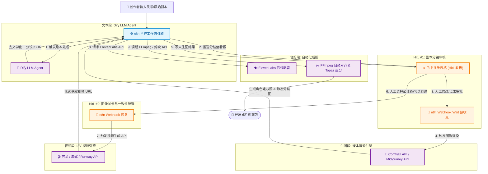

# AI短视频与漫剧制作自动化 Workflow 与 HitL 落地指南

> **Key Takeaways (核心要点概览)**
> 1. **主流落地架构**：当前工业级漫剧/AI短视频团队主流的技术栈组合为：`n8n (主控编排引擎) + Dify (LLM Agent 剧本/ Prompt 链) + ComfyUI/云端 API (媒体生成) + 飞书多维表格 / Notion (HitL 人工审核看板)`。
> 2. **n8n vs Dify 核心分工**：
>    - **n8n**：擅长 **多系统 API 编排、媒体文件下载传输、异步 API 轮询、高可用重试以及 Wait-for-Webhook (Human-in-the-Loop 人工挂起审批)**。
>    - **Dify**：擅长 **剧本去文学化、分镜表格提取、角色 Character Token 提取与结构化输出 (JSON/Structured Output)**。
> 3. **HitL 低代码挂起机制**：通过 n8n 的 `Wait` 节点或飞书多维表格的 `Webhook 触发器`，实现“AI 生成后挂起工作流 $\rightarrow$ 推送卡片至飞书/微信 $\rightarrow$ 创作者审核通过/修改输入 $\rightarrow$ 自动恢复后续生成”。

---

## 🏗️ 一、 主流 AI 自动化工具栈深度对比与选型

在 AI 短视频与漫剧全自动化/半自动化落地中，单独靠某一个工具无法完成全流程，主流技术栈选型如下：

| 工具 / 平台 | 核心定位与优势 | 在短视频/漫剧工作流中的职责 | 是否推荐作为主控？ |
| :--- | :--- | :--- | :--- |
| **n8n** *(首选主控)* | 强开源节点自动化引擎，支持复杂的 HTTP Request、文件流传输、循环控制、Wait 挂起节点。 | **工作流总指挥 (Pipeline Orchestrator)**：调度 Dify API、轮询可灵/海螺 API、处理二进制图像/视频文件流、处理 HitL 回调。 | **⭐ 强烈推荐 (主控骨架)** |
| **Dify** *(NLP核心)* | 顶尖开源 LLM Agent 编排框架，支持提示词编排、知识库 RAG、结构化输出。 | **文本处理大脑**：负责“剧本提取爽点 $\rightarrow$ 去文学化转化 $\rightarrow$ 分镜表 JSON 化 $\rightarrow$ 角色 Token 拼接”。 | **⭐ 推荐 (作为 n8n 的子节点)** |
| **ComfyUI (API)** | 基于节点图的本地/云端生图渲染引擎，支持 SD/FLUX/ControlNet/IP-Adapter。 | **高精画面渲染**：保障角色绝对一致性、立绘三视图绘制、局部重绘 (Inpainting)。 | **⭐ 推荐 (作为图像渲染微服务)** |
| **飞书多维表格 / Notion** | 交互式云端数据库，支持按钮触发 Webhook、状态变更通知、Rich-Text 渲染。 | **Human-in-the-Loop 审核看板**：人工在表格中审图、审剧本、选卡、一键点击“审批通过”触发下一阶段。 | **⭐ 推荐 (作为 HitL UI 看板)** |
| **Coze (扣子)** | 字节旗下 Agent 平台，集成了很多字节系的图像/视频能力。 | 适合轻量快速验证，但长流程异步轮询、文件本地处理、复杂的 HitL 挂起受限。 | 适合轻量验证，不适合复杂工业流 |

---

## 🛠️ 二、 工业级自动化落地架构图 (Architecture)



---

## 🔄 三、 关键节点技术实现与 Human-in-the-Loop (HitL) 落地

实现整套 Workflow 的核心在于**如何处理 AI 的异步等待与人工挂起 (Wait & Resume)**：

### 3.1 人工挂起 (HitL) 两种最优雅的实现方案

#### 方案 A：n8n 内部 `Wait` 节点 + 飞书/钉钉卡片审批 (最推荐)
1. **运行机制**：
   - 当 AI 生成完一批分镜图后，n8n 执行 `Wait` 节点，模式设置为 `On Webhook Call`。
   - n8n 自动生成一个独特的 Resume URL（如 `https://n8n.yourdomain.com/webhook/resume-task-123`）。
   - n8n 调用飞书机器人 API 发送富文本卡片至创作者微信/飞书，包含预览图和“同意/拒绝/重抽”三个交互按钮，按钮绑定的回调地址即为该 Resume URL。
   - 工作流进入**挂起状态**（不占用 CPU，等待回调）。
2. **恢复机制**：
   - 创作者在手机飞书上点击“同意”，Webhook 触发，n8n 收到数据，带着用户批准的节点数据**继续向下执行**。

#### 方案 B：飞书多维表格 (Bitable) + n8n 自动轮询/触发器
1. **运行机制**：
   - n8n 将分镜数据写入飞书多维表格的记录中，状态字段设为 `待审核`。
   - 创作者在飞书表格中查看生成图，手动将状态下拉框改为 `已通过`，或在“修改意见”列填入修改文字。
   - 飞书多维表格的自动化条件触发 Webhook 通知 n8n，恢复工作流。

---

### 3.2 5 大阶段的具体落地 API 与代码/节点逻辑

#### 1) 文（剧本分镜）落地：Dify API 交互
* **n8n HTTP 节点调用 Dify API**：
  * API 路径：`POST https://api.dify.ai/v1/workflows/run`
  * 参数 Payload：
    ```json
    {
      "inputs": {
        "raw_script": "冰冷的雨夜，刺客拿起了手中的剑..."
      },
      "response_mode": "blocking",
      "user": "n8n_automation"
    }
    ```
  * **返回数据处理**：Dify 返回去文学化后的结构化 JSON 格式分镜数组。

#### 2) 图（生图渲染）落地：ComfyUI / 云端 API 异步轮询
* 由于生成图片需要 5-30 秒，不能使用同步等待。
* **ComfyUI API 特殊 Payload 映射**：
  ComfyUI API 传输的是导出的 `API Format JSON`（带有节点 ID 的字典关系），如：
  ```json
  {
    "prompt": {
      "3": {
        "class_type": "KSampler",
        "inputs": { "seed": 42, "steps": 25, "model": ["4", 0] }
      },
      "6": {
        "class_type": "CLIPTextEncode",
        "inputs": { "text": "{{ $json.visual_prompt }}" }
      }
    }
  }
  ```
* **n8n 实现逻辑**：
  1. `HTTP Node`：发送数据到 ComfyUI API (`/prompt`)，获取 `prompt_id`。
  2. `Wait Node`：等待 5 秒。
  3. `HTTP Node`：轮询检查 `/history/{prompt_id}`。
  4. `If Node`：如果已完成，提取图片 Base64/URL；若未完成，循环回 `Wait Node`。

#### 3) 视（视频生成）落地：可灵/海螺 API 封装
* 视频生成耗时较长（2-5 分钟），必须依赖 n8n 的长轮询 (Polling) 机制。
* 保存任务 ID (`task_id`)，轮询等待 `status == "SUCCESS"`，下载 `.mp4` 文件存入本地缓存/S3。

#### 4) 音（配音与 BGM）落地：ElevenLabs + Suno
* 使用 n8n 遍历分镜数组，调用 ElevenLabs API 批量生成音轨，存入本地文件系统。
* 音频文件名格式：`shot_{shot_id}_audio.mp3`。

#### 5) 剪（自动化剪辑）落地：FFmpeg / MoviePy 微服务
* **自动化剪辑实现**：
  - 用 Python 写一个轻量 Web 服务（基于 `MoviePy` 或 `FFmpeg`）。
  - n8n 将视频文件路径数组与音频文件路径数组传给该 Python 微服务。
  - Python 微服务按分镜时长强行对齐音视频、合成字幕文件 (.srt)，输出初步合成的 `.mp4` 文件供 HitL #5 终剪审核。

---

## 🚀 四、 创作者实操搭建步骤路线图

对于个人或小团队，按以下步骤搭建自用 AI 短视频流水线：

```
Step 1: 部署主控引擎  ──>  Step 2: 搭建文本大脑  ──>  Step 3: 连通生图/生视 API  ──>  Step 4: 绑定飞书 HitL 表格
(Docker 一键部署 n8n)      (配置 Dify 分镜 Prompt)    (接入 ComfyUI/可灵 API)       (实现手机端一键审批)
```

1. **第一步（环境部署）**：使用 Docker 部署 `n8n` 与 `Dify`（推荐部署在同一台云服务器或本地 Mac/PC）。
2. **第二步（提示词灌入）**：在 Dify 中创建 Workflow，粘贴本指南前文提供的【商业漫剧视觉总导演提示词】。
3. **第三步（HitL 绑定）**：在飞书多维表格中建好 [镜号 | 景别 | 视觉 Prompt | 生成图片 | 人工状态] 列，与 n8n 的 `Lark/Feishu Node` 连通。
4. **第四步（逐步串联）**：先调通“文本 $\rightarrow$ 表格”，再调通“表格审批 $\rightarrow$ 生图”，最后调通“生图审批 $\rightarrow$ 视频与音频”。

---

## 🧹 五、 服务器磁盘与临时存储清理策略 (Storage & Cleanup)

在自动化批量生成图片与视频时，临时媒体文件会迅速占用数十 GB 的云服务器磁盘空间，必须配合自动化清理机制：

1. **n8n 定时清理节点 (Cron Schedule)**：
   - 设定每日凌晨 3:00 自动触发 `Execute Command` 节点，清除超过 48 小时的临时图频缓存：
     ```bash
     find /tmp/n8n_media_cache -type f -mtime +2 -delete
     ```
2. **对象存储 (AWS S3 / 阿里云 OSS) 生命周期法则**：
   - 将生成的中间分镜图与视频统一上传至 S3/OSS 存储桶。
   - 配置存储桶 Lifecycle 规则：设置中间渲染结果 `3 天后自动转换为低频访问/彻底删除`，仅保留最终成片。

---

## 🔗 关联资源与索引
- [[2. 实用工具/AI工具手册/AI短视频与漫剧制作全流程指南.md|AI短视频与漫剧制作全流程指南]]
- [[2. 实用工具/AI工具手册/OpenCode 安装配置命令与最佳实践.md|OpenCode 安装配置命令与最佳实践]]
