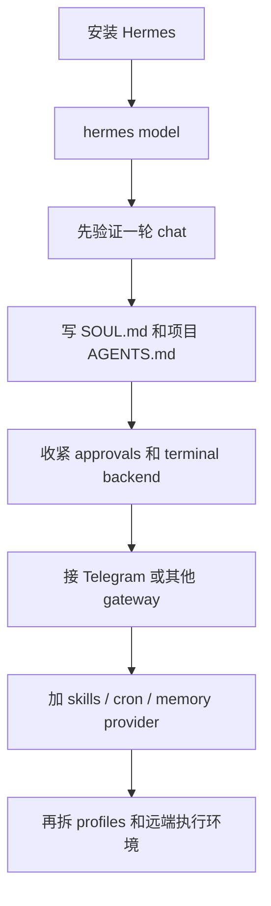

---
tags:
  - hermes-agent
  - nous-research
  - ai-agent
  - ollama
  - local-llm
  - developer-tools
---
# Hermes Agent 安装、配置、命令与最佳实践

面向终端 AI agent、长期运行的个人助手、工程自动化和多渠道消息机器人场景，整理 Hermes Agent 的安装方式、配置体系、CLI / slash commands、profiles、gateway、自定义模型 API、本地 Ollama，以及从 0 到 1 的可落地工程实践。

截至 `2026-04-26` 核对，本文主要依据 Hermes Agent 官方文档、官方 GitHub README 和相关官方集成文档整理。

说明：

- 本文优先依据 Hermes Agent 官方文档和官方 GitHub。
- 关于“最佳实践”的部分，凡是官方明确给出约束或建议的，优先按官方整理；凡是工程方法论部分，则是在官方能力边界内做的实践型建议。
- Hermes Agent 更新较快，尤其是 providers、gateway 平台和 slash commands 细节，实操时建议同时用 `hermes doctor`、`hermes config check`、`hermes config migrate` 做一次本机核对。

官方地址：

- Docs 首页：<https://hermes-agent.nousresearch.com/docs/>
- GitHub：<https://github.com/NousResearch/hermes-agent>
- 安装：<https://hermes-agent.nousresearch.com/docs/getting-started/installation/>
- Quickstart：<https://hermes-agent.nousresearch.com/docs/getting-started/quickstart/>
- 配置：<https://hermes-agent.nousresearch.com/docs/user-guide/configuration/>
- CLI Commands：<https://hermes-agent.nousresearch.com/docs/reference/cli-commands/>
- Slash Commands：<https://hermes-agent.nousresearch.com/docs/reference/slash-commands>
- Providers：<https://hermes-agent.nousresearch.com/docs/integrations/providers>
- Security：<https://hermes-agent.nousresearch.com/docs/user-guide/security/>
- Messaging Gateway：<https://hermes-agent.nousresearch.com/docs/user-guide/messaging>
- Telegram：<https://hermes-agent.nousresearch.com/docs/user-guide/messaging/telegram/>
- Tools & Toolsets：<https://hermes-agent.nousresearch.com/docs/user-guide/features/tools/>
- Toolsets Reference：<https://hermes-agent.nousresearch.com/docs/reference/toolsets-reference>
- Built-in Tools：<https://hermes-agent.nousresearch.com/docs/reference/tools-reference/>
- Skills：<https://hermes-agent.nousresearch.com/docs/user-guide/features/skills/>
- Work with Skills：<https://hermes-agent.nousresearch.com/docs/guides/work-with-skills>
- Context Files：<https://hermes-agent.nousresearch.com/docs/user-guide/features/context-files/>
- Memory：<https://hermes-agent.nousresearch.com/docs/user-guide/features/memory/>
- Memory Providers：<https://hermes-agent.nousresearch.com/docs/user-guide/features/memory-providers/>
- Honcho：<https://hermes-agent.nousresearch.com/docs/user-guide/features/honcho/>
- Profiles：<https://hermes-agent.nousresearch.com/docs/user-guide/profiles/>

## 目录

- [Key Takeaways](#key-takeaways)
- [Hermes Agent 是什么](#hermes-agent-是什么)
- [Hermes Agent 和前两类工具的定位差异](#hermes-agent-和前两类工具的定位差异)
- [从 0 到 1 的推荐路径](#从-0-到-1-的推荐路径)
- [安装前准备](#安装前准备)
- [安装与升级](#安装与升级)
- [首次启动与基础使用](#首次启动与基础使用)
- [配置体系总览](#配置体系总览)
- [模型与 Provider 配置](#模型与-provider-配置)
- [自定义模型 API 与本地 Ollama](#自定义模型-api-与本地-ollama)
- [推荐基础配置](#推荐基础配置)
- [SOUL.md、AGENTS.md、Memory 与 Honcho](#soulmdagentsmdmemory-与-honcho)
- [Gateway 与 Telegram 最佳实践](#gateway-与-telegram-最佳实践)
- [Profiles、Toolsets、Terminal Backends](#profilestoolsetsterminal-backends)
- [Skills、Plugins、MCP 与自动化](#skillspluginsmcp-与自动化)
- [命令速查表](#命令速查表)
- [工程实践最佳实践](#工程实践最佳实践)
- [如何最大程度发挥 Hermes Agent 的作用](#如何最大程度发挥-hermes-agent-的作用)
- [常见坑](#常见坑)
- [参考来源](#参考来源)

## Key Takeaways

- Hermes Agent 当前官方定位不是“单纯 coding copilot”，而是 Nous Research 做的一个长期运行、自我学习、跨会话记忆、多渠道可达的 agent 系统。
- 它最独特的三个点是：`SOUL.md`、内建记忆闭环、以及 `Honcho` 这种更深层的用户建模能力。
- 自定义模型 API 是官方支持项；Hermes 明确支持任意 `OpenAI-compatible` endpoint。
- 本地 Ollama 也是官方支持项，但官方当前给出的最低建议比一般工具更严格：多步工具调用场景下，目标上下文最好按 `64K` 级别去配。
- Hermes 真正强的不是“在本机终端里聊天”，而是 `CLI + gateway + profiles + skills + cron + memory + terminal backends` 组合起来后的长期系统能力。
- 默认安全性不算差，但仍不应该裸奔。实际部署里至少要收紧 `approvals`、明确 allowlist、优先容器 backend、给 gateway 设置固定工作目录和非 root 运行环境。

## Hermes Agent 是什么

一句话理解：

- `Hermes Agent = 可长期运行、可自我积累、可多平台接入、可切换本地/云模型/远程执行环境的通用 AI agent`

它不是只会回答问题的聊天壳，而是能同时承担：

- 代码与文件操作
- 终端执行
- 浏览器自动化
- Web 检索与抽取
- 技能加载与自我改进
- 跨会话记忆
- 多平台消息机器人
- 定时任务和主动投递

## Hermes Agent 和前两类工具的定位差异

如果你把三者放在一起看，可以这样理解：

| 工具 | 核心定位 | 更擅长什么 |
| --- | --- | --- |
| Claude Code / OpenCode | 偏 coding agent / 终端开发工作台 | 单项目高频开发 |
| OpenClaw | 偏个人自动化平台 / 多渠道控制面 | Bot、tools、channels、skills |
| Hermes Agent | 偏“可长期成长的 agent 操作系统” | 记忆、人格、跨会话、多 profile、多 terminal backend、长期运行 |

Hermes 的独特重心在于：

- `SOUL.md` 作为实例级人格
- `MEMORY.md + USER.md` 作为本地持久记忆
- `Honcho` 作为外部深层用户建模
- `profile` 作为多实例运行方式
- `terminal backend` 作为本地、容器、远端、serverless 执行抽象

## 从 0 到 1 的推荐路径



推荐顺序：

1. 先安装并打通一个 provider。
2. 先验证基础 chat，再碰 gateway。
3. 先写 `SOUL.md` 和项目 `AGENTS.md`，再追求 fancy 自动化。
4. 先收紧安全边界，再开长期服务。
5. 先用单 profile 跑顺，再拆 `work`、`personal`、`research`。

## 安装前准备

### 平台要求

| 项目 | 当前建议 |
| --- | --- |
| 系统 | `Linux`、`macOS`、`WSL2` |
| Windows | 官方当前不支持原生 Windows，推荐 `WSL2` |
| 终端 | `zsh`、`bash` 等现代 shell |
| Git | 强烈建议项目本身是 Git 仓库 |
| 模型 | 至少一个已配置 provider，或本地 OpenAI-compatible endpoint |

### 为什么 Git 很重要

Hermes 不只是聊天，它会：

- 修改文件
- 维护 session
- 做 checkpoint / rollback / worktree

这意味着：

- 非 Git 目录也能用
- 但可回滚、可对比、可并行 worktree 的收益会明显下降

### 官方当前强调的模型门槛

Quickstart 当前明确写了：

- Hermes 需要至少 `64K` context 的模型

原因是：

- 它面向的是多步工具调用、长上下文、跨文件、带记忆的 agent 流程

如果你跑本地模型，务必把“真实可用上下文长度”当成第一优先级，而不是只看模型名。

## 安装与升级

### 安装方式选择建议

| 方式 | 推荐度 | 典型命令 | 适用场景 |
| --- | --- | --- | --- |
| 官方安装脚本 | 最高 | `curl -fsSL https://raw.githubusercontent.com/NousResearch/hermes-agent/main/scripts/install.sh \| bash` | 大多数用户 |
| `pipx` / `uv` 生态 | 中 | 文档未作为首推入口 | Python 工具链强约束场景 |
| Docker | 中 | 容器化体验或隔离试用 | 临时体验、受控环境 |
| Android Termux | 有专门路径 | 同一个 install 脚本 | 移动端实验 |

### 1. 官方推荐安装

Linux / macOS / WSL2 / Android Termux：

```bash
curl -fsSL https://raw.githubusercontent.com/NousResearch/hermes-agent/main/scripts/install.sh | bash
```

安装后重载 shell：

```bash
source ~/.bashrc
# 或
source ~/.zshrc
```

### 2. Windows 说明

当前官方文档明确说明：

- 原生 Windows 不支持
- 推荐先装 `WSL2`，再在 WSL2 里安装 Hermes

### 3. 更新

```bash
hermes update
```

### 4. 卸载

```bash
hermes uninstall
```

彻底删除：

```bash
hermes uninstall --full --yes
```

## 首次启动与基础使用

### 最短可用路径

```bash
hermes setup
```

或者更明确地分两步：

```bash
hermes model
hermes chat
```

官方 Quickstart 当前建议的最稳路径是：

1. `hermes model`
2. 做一轮真实聊天验证
3. 确认 `hermes --continue` 能恢复
4. 再往上加 gateway / voice / cron / skills

### 基础验收命令

| 检查项 | 命令 | 期望结果 |
| --- | --- | --- |
| 版本与安装 | `hermes version` | 正常输出版本 |
| 配置完整性 | `hermes doctor` | 无关键错误 |
| provider 配置 | `hermes model` | 能选到目标 provider / model |
| 会话恢复 | `hermes --continue` | 能回到最近 session |
| gateway 状态 | `hermes gateway status` | 已配置后可正常检查 |

### 最常见的三种使用方式

| 方式 | 入口 | 适合什么 |
| --- | --- | --- |
| 经典 CLI | `hermes chat` 或直接 `hermes` | 日常对话式 agent 工作 |
| TUI | `hermes --tui` | 更接近现代终端 UI 交互 |
| Gateway | `hermes gateway` | 从 Telegram / Discord / Slack 等进入 |
| Dashboard | `hermes dashboard` | 浏览器里查看配置、sessions、状态 |

说明：

- `hermes dashboard` 当前需要额外安装 web 依赖，官方写法是：

```bash
pip install 'hermes-agent[web]'
```

### 进阶交互

Hermes 当前支持非常高价值的上下文引用：

| 写法 | 作用 |
| --- | --- |
| `@file:path/to/file.py` | 注入文件内容 |
| `@file:path.py:10-25` | 注入指定行范围 |
| `@folder:path/to/dir` | 注入目录树 |
| `@diff` | 注入当前未暂存 diff |
| `@staged` | 注入 staged diff |
| `@git:5` | 注入最近 N 个 commits |
| `@url:https://...` | 注入网页内容 |

这是 Hermes 在工程场景里特别值得常用的能力。

## 配置体系总览

### 主目录结构

官方当前文档给出的 Hermes Home 核心结构如下：

```text
~/.hermes/
├── config.yaml
├── gateway.json
├── .env
├── auth.json
├── SOUL.md
├── memories/
├── skills/
├── cron/
├── sessions/
└── logs/
```

### 各路径职责

| 路径 | 作用 |
| --- | --- |
| `~/.hermes/config.yaml` | 非 secret 主配置 |
| `~/.hermes/gateway.json` | gateway 专用配置，例如平台级 reset policy |
| `~/.hermes/.env` | API keys、tokens、passwords |
| `~/.hermes/auth.json` | OAuth provider credentials |
| `~/.hermes/SOUL.md` | 实例级人格文件 |
| `~/.hermes/memories/MEMORY.md` | Agent 自己的长期笔记 |
| `~/.hermes/memories/USER.md` | 用户画像与偏好 |
| `~/.hermes/skills/` | Skills 主目录 |
| `~/.hermes/cron/` | 定时任务 |
| `~/.hermes/sessions/` | Sessions |
| `~/.hermes/logs/` | 日志 |

### 配置优先级

官方当前给出的顺序是：

1. CLI arguments
2. `~/.hermes/config.yaml`
3. `~/.hermes/.env`
4. Built-in defaults

### 一个很重要的规则

官方当前明确建议：

- secrets 放 `.env`
- 其他都放 `config.yaml`

而且：

- `hermes config set` 会自动把值路由到正确文件

例如：

```bash
hermes config set model anthropic/claude-opus-4
hermes config set terminal.backend docker
hermes config set OPENROUTER_API_KEY sk-or-...
```

其中 API key 会自动写进 `.env`。

### 常用配置管理命令

```bash
hermes config
hermes config edit
hermes config set KEY VAL
hermes config check
hermes config migrate
```

### Worktree 支持

配置里可以开启：

```yaml
worktree: true
```

作用：

- 每个 CLI session 创建独立 git worktree
- 多 agent 并行改同一 repo 时更稳

如果你的仓库有需要一起复制的 gitignored 文件，可在 repo 根放 `.worktreeinclude`。

## 模型与 Provider 配置

### 入口命令

最核心的是：

```bash
hermes model
```

它当前负责：

- 选择 provider
- 选择 model
- 跑 OAuth
- 录入 API key
- 配置 custom endpoint

### 官方当前支持的 provider 面

当前文档明确列出的 provider 很多，常见的包括：

- Nous Portal
- OpenAI Codex
- Anthropic
- OpenRouter
- GitHub Copilot / Copilot ACP
- Gemini / Google Gemini OAuth
- DeepSeek
- MiniMax
- Alibaba
- Hugging Face
- xAI / Grok
- 自定义 OpenAI-compatible endpoint
- Ollama Cloud

### 推荐模型策略

| 场景 | 建议 |
| --- | --- |
| 最省心 | `Nous Portal` 或 `OpenRouter` |
| 已有 ChatGPT / Codex 订阅 | `OpenAI Codex` |
| 已有 Claude 生态 | `Anthropic` |
| 本地 / 隐私优先 | 自定义 endpoint / Ollama |
| 多模型路由 | `OpenRouter` 或自建路由层 |

### 为什么 provider 先于一切

Hermes Quickstart 当前明确给了一个很现实的建议：

- 如果 Hermes 连正常 chat 都跑不顺，就不要先叠 gateway、cron、skills、voice

这点非常对。最小可行路径永远是：

1. 一个能稳定响应的 provider
2. 一轮能正常完成的会话
3. 再叠其他层

## 自定义模型 API 与本地 Ollama

### 1. 自定义 OpenAI-compatible endpoint

Hermes 官方当前明确支持任意 `OpenAI-compatible` endpoint。

最推荐的入口：

```bash
hermes model
```

在向导里选择：

- `Custom endpoint (self-hosted / VLLM / etc.)`

再填：

- API base URL
- API key
- Model name

### 2. 直接写 `config.yaml`

官方当前给的最小示例是：

```yaml
model:
  default: your-model-name
  provider: custom
  base_url: http://localhost:8000/v1
  api_key: your-key-or-leave-empty-for-local
```

### 3. 一个更实用的自定义 endpoint 配置

```yaml
model:
  default: qwen2.5-coder:32b
  provider: custom
  base_url: http://localhost:8000/v1
  api_key: ""
  context_length: 65536
```

建议：

- URL 一定写到 `/v1`
- model name 要和服务端真实暴露的一致
- 本地 endpoint 没 key 时可以留空
- `context_length` 不要乱填，尽量和服务端真实上限一致

### 4. 官方明确说明已废弃的老变量

Providers 文档当前明确说明：

- `OPENAI_BASE_URL`
- `LLM_MODEL`

这类旧环境变量已经移除，不再作为 Hermes 的模型配置主入口。

应该以：

- `config.yaml`

为单一事实来源。

### 5. 本地 Ollama

Hermes 官方当前明确支持 Ollama。

#### 先启动模型

```bash
ollama pull qwen2.5-coder:32b
ollama serve
```

#### 再在 Hermes 里配置

推荐用向导：

```bash
hermes model
```

在向导里填：

- URL: `http://localhost:11434/v1`
- API key: 留空
- model name: 例如 `qwen2.5-coder:32b`

#### 手工 `config.yaml`

```yaml
model:
  default: qwen2.5-coder:32b
  provider: custom
  base_url: http://localhost:11434/v1
  context_length: 65536
```

### 6. 为什么 Hermes 对本地模型更“苛刻”

官方当前给了两条很关键的信号：

| 来源 | 当前建议 |
| --- | --- |
| Quickstart | 至少 `64K` 上下文 |
| Providers 页 | 如果工具调用异常，至少先把上下文抬到 `16K-32K` 以上 |

工程上应该这样理解：

- `16K-32K` 是最低排障区间
- `64K` 更接近 Hermes 真正长期可用的本地 agent 起步线

### 7. Ollama 的现实坑

官方当前明确提醒：

- Ollama 默认上下文可能非常低

当前文档给出的默认值示意是：

| 可用显存 | 默认上下文 |
| --- | --- |
| `<24GB` | `4096` |
| `24-48GB` | `32768` |
| `48GB+` | `256000` |

所以最佳实践是：

- 不要以为模型本身标称 128K，Hermes 就自动拿到了 128K
- 实际运行前要显式把上下文调到目标值

### 8. 其他本地后端

Hermes 官方当前也明确支持：

- `vLLM`
- `SGLang`
- `llama.cpp / llama-server`
- `LM Studio`

它们的接法本质一样：

- 只要提供 OpenAI-compatible endpoint
- Hermes 就可以接

## 推荐基础配置

下面这份更适合作为“先跑顺，再逐步增强”的基线。

```yaml
# ~/.hermes/config.yaml

model:
  default: qwen2.5-coder:32b
  provider: custom
  base_url: http://localhost:11434/v1
  api_key: ""
  context_length: 65536

terminal:
  backend: docker
  cwd: /absolute/path/to/project
  timeout: 180
  container_cpu: 1
  container_memory: 5120
  container_disk: 51200
  container_persistent: true

approvals:
  mode: manual
  timeout: 60

worktree: true

toolsets:
  - hermes-cli

group_sessions_per_user: true

streaming:
  enabled: true
  transport: edit
  edit_interval: 0.3
  buffer_threshold: 40
  cursor: " ▉"

telegram:
  require_mention: true

security:
  redact_secrets: true

timezone: "Asia/Shanghai"
```

配套 `.env`：

```bash
# ~/.hermes/.env
TELEGRAM_BOT_TOKEN=123456789:replace-me
TELEGRAM_ALLOWED_USERS=123456789
OPENROUTER_API_KEY=sk-or-...
HONCHO_API_KEY=replace-me
```

说明：

- 如果你现在完全用本地 Ollama，就可以先不放云端 key
- `terminal.cwd` 最好写绝对路径，不要依赖启动目录
- `docker` backend 对长期 gateway 更稳

## SOUL.md、AGENTS.md、Memory 与 Honcho

这是 Hermes 和很多终端 agent 最大的区别之一。

### 1. Context Files 优先级

官方当前支持这些上下文文件：

| 文件 | 作用 | 发现方式 |
| --- | --- | --- |
| `.hermes.md` / `HERMES.md` | 项目指令，最高优先级 | 向 git root 方向查找 |
| `AGENTS.md` | 项目约束、架构、命令、规范 | 启动时 + 子目录渐进发现 |
| `CLAUDE.md` | Claude Code 兼容规则 | 支持发现 |
| `SOUL.md` | 实例级人格 | 只从 `HERMES_HOME` 加载 |
| `.cursorrules` / `.cursor/rules/*.mdc` | Cursor 规则兼容 | 支持发现 |

优先级：

- 项目上下文只会加载一种主类型：
  `.hermes.md` → `AGENTS.md` → `CLAUDE.md` → `.cursorrules`
- `SOUL.md` 总是独立加载

### 2. `SOUL.md` 和 `AGENTS.md` 的分工

官方当前给出的原则很清楚：

| 文件 | 应该放什么 | 不应该放什么 |
| --- | --- | --- |
| `SOUL.md` | 语气、人格、沟通风格、边界 | repo 结构、端口、命令、路径 |
| `AGENTS.md` | 架构、命令、规范、约束、坑点 | 大段人格化文案 |

### 3. `SOUL.md` 的一个够用模板

```md
# Soul

你是一个长期运行的工程代理，偏务实、偏验证、少空话。

## Tone

- 默认使用简洁中文
- 代码、路径、命令保留英文
- 先给结论，再给操作

## Working Style

- 在执行前先确认上下文事实
- 遇到多步问题先做结构化分析
- 优先给最小可行解，再给扩展方案

## Boundaries

- 不回显 secrets
- 破坏性操作必须明确提示风险
- 不为了“显得聪明”而虚构事实
```

### 4. `AGENTS.md` 的一个够用模板

```md
# Project Context

## Build and Test

- Install dependencies with `pnpm install`
- Run lint with `pnpm lint`
- Run tests with `pnpm test`

## Architecture

- `apps/web` contains the frontend
- `packages/api` contains backend handlers
- `packages/core` contains shared domain logic

## Conventions

- Use existing abstractions before adding new ones
- Keep API responses backward compatible unless changing the contract explicitly
- Never edit migration files directly

## Important Notes

- `.env.local` contains real keys and must not be committed
- Frontend runs on 3000, backend on 8000
```

### 5. Hermes 内建记忆

Hermes 当前内建两份核心记忆文件：

| 文件 | 用途 | 字符上限 |
| --- | --- | --- |
| `MEMORY.md` | agent 自己的环境事实、项目经验、长期笔记 | `2200` chars 左右 |
| `USER.md` | 用户偏好、沟通方式、预期 | `1375` chars 左右 |

它们位于：

```text
~/.hermes/memories/
```

### 6. Honcho 是什么

Honcho 是 Hermes 官方支持的外部 memory provider 之一，主打：

- 更深的跨会话用户建模
- session summary
- dialectic reasoning
- 多 agent / 多 profile 下更清晰的 peer 分离

### 7. 内建记忆 vs Honcho

| 维度 | Built-in Memory | Honcho |
| --- | --- | --- |
| 存储 | 本地文件 | 外部服务 / 自托管 Honcho |
| 范围 | 当前 Hermes 实例级 | 更强的跨会话 / 跨平台建模 |
| 维护方式 | `memory` 工具写入 | `honcho_*` 工具和 provider 机制 |
| 适合谁 | 个人单机和轻量长期使用 | 多平台、多 agent、长期人格化使用 |

### 8. Honcho 的建议

| 场景 | 建议 |
| --- | --- |
| 单机个人 coding agent | 先只用内建 memory |
| 你想让 Hermes 真正记住你 | 再启 Honcho |
| 多 bot / 多 profile / 多平台共用一套用户理解 | 很适合 Honcho |

启用入口：

```bash
hermes memory setup
```

或：

```yaml
memory:
  provider: honcho
```

## Gateway 与 Telegram 最佳实践

### 1. Gateway 是什么

Hermes gateway 是单一后台进程，可同时接多个平台：

- Telegram
- Discord
- Slack
- WhatsApp
- Signal
- Matrix
- Mattermost
- Email
- SMS
- Home Assistant
- 以及更多企业 IM

### 2. 最推荐的起步方式

```bash
hermes gateway setup
```

这比手搓 `.env` 稳得多，尤其是你第一次接平台时。

### 3. Telegram 最小配置

手工方式：

```bash
# ~/.hermes/.env
TELEGRAM_BOT_TOKEN=123456789:ABC...
TELEGRAM_ALLOWED_USERS=123456789
```

启动：

```bash
hermes gateway
```

### 4. Telegram 群聊建议

官方 Telegram 文档当前支持：

```yaml
telegram:
  require_mention: true
```

含义：

- 群里必须 `@mention`
- 或回复 bot
- 或 slash command
- 或命中你配置的 `mention_patterns`

这是默认更安全也更安静的设置。

### 5. Gateway 层值得关注的配置

| 配置 | 推荐值 | 原因 |
| --- | --- | --- |
| `group_sessions_per_user` | `true` | 群里按用户隔离会话，官方也推荐 |
| `streaming.enabled` | `true` | 更好的实时反馈 |
| `streaming.transport` | `edit` | 单消息渐进编辑更自然 |
| `telegram.require_mention` | `true` | 降低群噪音 |
| `security.redact_secrets` | `true` | 日志与输出更安全 |

### 6. 长期运行建议

不要只用前台跑：

```bash
hermes gateway
```

稳定使用更建议：

```bash
hermes gateway install
```

如果是 Linux 开机自启类场景，文档当前也支持更系统化的服务化安装方式。

### 7. Gateway 生产安全检查表

官方 Security 当前给出的建议里，最值得直接照做的是：

1. 显式 allowlist，不要生产里开全量放行
2. `terminal.backend` 优先 `docker`
3. 设定 `MESSAGING_CWD` 或等价的明确工作目录思想，不要让 agent 在敏感目录乱跑
4. 不要用 root 运行 gateway
5. 定期审计 `command_allowlist`
6. 定期看 `~/.hermes/logs/`
7. 定期 `hermes update`

## Profiles、Toolsets、Terminal Backends

### 1. Profiles 是 Hermes 的高价值能力

profile 可以理解成：

- 多个互相独立的 Hermes 实例

每个 profile 都有自己的：

- `config.yaml`
- `.env`
- `SOUL.md`
- memories
- sessions
- skills
- cron
- gateway state

### 2. 最基础的 profile 用法

```bash
hermes profile create coder
coder setup
coder chat
```

这会自动生成一个命令别名，例如：

- `coder chat`
- `coder gateway start`
- `coder doctor`

### 3. 推荐 profile 分层

| Profile | 建议用途 |
| --- | --- |
| `default` | 个人主助手 |
| `coder` | 工程开发 |
| `research` | Web / 文献 / 信息采集 |
| `assistant` | 消息网关和日常事务 |

### 4. Toolsets

Hermes 当前用 `toolsets` 控制工具集合，这是比单独开关工具更高层的抽象。

官方当前的核心 toolsets 包括：

- `file`
- `terminal`
- `web`
- `browser`
- `skills`
- `memory`
- `cronjob`
- `delegation`
- `code_execution`
- `todo`
- `vision`
- `image_gen`
- `homeassistant`

还有组合型：

- `debugging`
- `safe`

### 5. 推荐 toolset 策略

| 场景 | 推荐 |
| --- | --- |
| 日常 coding | `hermes-cli` 默认集 |
| 只读研究 | `safe` |
| 调试会话 | `debugging` |
| 高风险环境 | 先少开 toolsets，再逐步放开 |

### 6. Terminal Backends

Hermes 当前官方支持 6 类 backend：

| Backend | 作用 | 适合什么 |
| --- | --- | --- |
| `local` | 本机执行 | 最方便，最不隔离 |
| `docker` | 容器执行 | 安全、可重现，强烈推荐 |
| `ssh` | 远端机器 | 和宿主机隔离，长期运行很稳 |
| `singularity` | HPC 容器 | 集群场景 |
| `modal` | serverless 云执行 | 弹性与隔离 |
| `daytona` | 持久远程工作区 | 长期远程 agent 工作区 |

### 7. 我推荐的 backend 顺序

| 场景 | 推荐 backend |
| --- | --- |
| 单机试用 | `local` |
| 长期 bot / gateway | `docker` |
| 想把执行层和消息层分离 | `ssh` |
| 需要低 idle 成本远程环境 | `modal` / `daytona` |

## Skills、Plugins、MCP 与自动化

### 1. Skills

Hermes 的 skills 是按需加载的知识文档，走 progressive disclosure：

1. session 启动时只加载 skills 索引
2. 真正需要某个 skill 时才加载 `SKILL.md`
3. 需要时再加载 skill 内部引用文件

这比一口气把所有东西塞进系统提示词要健康得多。

### 2. Skills 的几个高价值特点

| 能力 | 意义 |
| --- | --- |
| 每个已安装 skill 自动成为 slash command | 调用成本低 |
| agent 可通过 `skill_view` 动态读取 | 不必手动触发也能用 |
| 兼容 agentskills.io | 可迁移性强 |
| agent 可管理自己的 skills | 真正有学习闭环味道 |

### 3. Skills 常用命令

```bash
hermes skills
/skills browse
/skills search github
```

### 4. MCP

Hermes 当前支持 MCP server，并且会为每个 MCP server 动态生成：

- `mcp-<server>` toolset

这意味着：

- 你接一个 GitHub MCP server，就能在 toolset 层按需启用它，而不是硬编码到主 agent 里

### 5. Plugins

Hermes 支持三类插件面：

- general plugins
- memory providers
- context engines

而且有 bundled plugins、user plugins、project plugins 等多层发现机制。

### 6. Automation

Hermes 的自动化能力主要来自：

- `cron`
- `send_message`
- `gateway`
- `memory`
- `skills`

一个典型闭环可以是：

1. cron 定时触发
2. Hermes 做 web search / file / terminal 工作
3. 结果沉淀 memory
4. 再主动投递到 Telegram / Slack

## 命令速查表

### 全局参数

| 参数 | 作用 |
| --- | --- |
| `--profile`, `-p` | 指定 profile |
| `--resume`, `-r` | 恢复指定 session |
| `--continue`, `-c` | 恢复最近 session |
| `--worktree`, `-w` | 用隔离 git worktree 启动 |
| `--yolo` | 跳过危险命令审批 |
| `--pass-session-id` | 把 session id 放进 system prompt |
| `--tui` | 启动 TUI |

### CLI 核心命令

| 命令 | 用途 | 典型场景 |
| --- | --- | --- |
| `hermes chat` | 交互式或单次 chat | 日常主入口 |
| `hermes model` | provider + model 配置 | 首次配置、切模型 |
| `hermes setup` | 全量交互式 setup | 新手和重配 |
| `hermes gateway` | 启动或管理 gateway | Telegram / Discord / Slack |
| `hermes auth` | 管理凭证池与 OAuth | 多 key / 多 provider |
| `hermes tools` | 配 toolsets / tools | 工具治理 |
| `hermes skills` | 搜索、安装、审计 skills | 扩展能力 |
| `hermes doctor` | 排障 | 配置/依赖问题 |
| `hermes status` | 查看状态 | 巡检 |
| `hermes dashboard` | 打开 web dashboard | 配置和观测 |
| `hermes sessions` | 管理 sessions | 恢复、导出、清理 |
| `hermes insights` | 查看 token / cost / activity | 成本治理 |
| `hermes profile` | 管理 profiles | 多实例运行 |
| `hermes honcho` | 管理 Honcho | 深层记忆 |
| `hermes memory` | 配外部 memory provider | Honcho / Mem0 等 |
| `hermes mcp` | 管理 MCP | 扩展工具面 |
| `hermes plugins` | 管理插件 | 高阶扩展 |
| `hermes cron` | 管理计划任务 | 自动化 |
| `hermes webhook` | 管理动态 webhook 订阅 | 事件驱动激活 |
| `hermes logs` | 看日志 | 排障 |
| `hermes dump` | 生成可脱敏环境摘要 | 远程协助 / 提问 |
| `hermes debug` | 上传 logs 和系统信息 | 深度排障 |
| `hermes backup` | 备份 | 升级前、迁移前 |
| `hermes import` | 导入备份 | 恢复 |
| `hermes whatsapp` | 配 WhatsApp bridge | WhatsApp 接入 |
| `hermes update` | 更新 | 日常维护 |
| `hermes uninstall` | 卸载 | 清理 |
| `hermes completion` | 输出 shell completion | bash / zsh 体验优化 |

### 常用 CLI 子命令 / 示例

| 命令 | 作用 | 备注 |
| --- | --- | --- |
| `hermes chat -q "..."` | 单次 query | 脚本和快问快答 |
| `hermes chat --toolsets web,file,terminal` | 临时指定 toolsets | 会话级覆写 |
| `hermes chat --skills plan` | 预加载 skills |  |
| `hermes auth list` | 列 credential pools |  |
| `hermes auth add openrouter --api-key ...` | 新增 API key |  |
| `hermes config edit` | 编辑主配置 |  |
| `hermes config check` | 检查缺失项 | 升级后很有用 |
| `hermes config migrate` | 迁移 / 补齐配置 | 升级后常用 |
| `hermes gateway setup` | 配 messaging 平台 | 推荐入口 |
| `hermes gateway install` | 安装为服务 | 长期运行 |
| `hermes pairing approve telegram CODE` | 批准配对 | 动态授权 |
| `hermes profile create coder --clone` | 复制配置建 profile | 多实例 |
| `hermes profile use coder` | 设默认 profile |  |
| `hermes backup --quick --label "pre-upgrade"` | 快照备份 | 升级前推荐 |
| `hermes memory setup` | 配 external memory | Honcho 等 |
| `hermes honcho identity ~/.hermes/SOUL.md` | 给 Honcho 种 AI identity | 高级玩法 |
| `hermes dashboard --port 8080 --no-open` | 启动 dashboard 但不自动打开浏览器 | headless 或远端场景 |

### Profile 相关命令

| 命令 | 用途 |
| --- | --- |
| `hermes profile list` | 列出所有 profiles |
| `hermes profile use <name>` | 切换默认 profile |
| `hermes profile create <name>` | 创建 profile |
| `hermes profile delete <name>` | 删除 profile |
| `hermes profile show <name>` | 查看 profile 详情 |
| `hermes profile alias <name>` | 管理 profile 命令别名 |
| `hermes profile rename <old> <new>` | 重命名 |
| `hermes profile export <name>` | 导出 tar.gz |
| `hermes profile import <archive>` | 导入 tar.gz |

### 常用 Slash Commands

| 命令 | 用途 | 备注 |
| --- | --- | --- |
| `/new` | 新会话 | alias `/reset` |
| `/clear` | 清屏并开新会话 |  |
| `/history` | 查看历史 |  |
| `/save` | 保存当前会话 |  |
| `/retry` | 重试上一条 |  |
| `/undo` | 删除上一轮 exchange |  |
| `/compress` | 手工压缩上下文 | 长会话高频 |
| `/rollback` | 文件 checkpoint 回滚 |  |
| `/snapshot` | 状态快照 create/restore/prune |  |
| `/status` | 查看当前会话状态 |  |
| `/agents` | 看当前活跃 agents / tasks |  |
| `/background` | 后台跑子任务 |  |
| `/btw` | 不落盘的侧问 |  |
| `/plan` | 加载 plan skill，输出计划 | 很有用 |
| `/branch` | 分叉当前会话 | alias `/fork` |
| `/config` | 查看配置 | CLI-only |
| `/model` | 切会话模型 | 只能切已配置 provider |
| `/provider` | 看 provider 状态 |  |
| `/personality` | 叠加人格 preset | session 级 |
| `/verbose` | 调整工具进度显示 |  |
| `/fast` | 切快模式 |  |
| `/reasoning` | 管 reasoning effort/display |  |
| `/yolo` | 切 YOLO 模式 | 高风险 |
| `/tools` | 管理 tools | CLI-only |
| `/toolsets` | 查看 toolsets | CLI-only |
| `/browser` | 管本地 Chrome CDP | CLI-only |
| `/skills` | 搜索/安装/查看 skills | 高价值 |
| `/cron` | 管理计划任务 | CLI-only |
| `/reload-mcp` | 重载 MCP servers |  |
| `/reload` | 重新加载 `.env` | 改 key 后很好用 |
| `/plugins` | 查看插件 | CLI-only |
| `/usage` | 查看 token / cost |  |
| `/insights` | 查看 usage analytics |  |
| `/profile` | 看当前 profile |  |
| `/help` | 帮助 |  |
| `/quit` | 退出 | alias `/exit` |

### Messaging 常用 Slash Commands

| 命令 | 用途 |
| --- | --- |
| `/status` | 查看会话状态 |
| `/model` | 切已配置模型 |
| `/provider` | 查看 provider 状态 |
| `/fast` | 切快模式 |
| `/reasoning` | 管 reasoning |
| `/retry` | 重试上一条 |
| `/undo` | 撤掉上一轮 exchange |
| `/compress` | 手工压缩上下文 |
| `/background` | 后台跑子任务 |
| `/plan` | 计划模式 |
| `/approve [session|always]` | 批准危险命令 |
| `/deny` | 拒绝危险命令 |
| `/update` | 更新 Hermes |
| `/restart` | 重启 gateway |
| `/help` | 帮助 |

## 工程实践最佳实践

### 1. 先把 provider 跑顺，再碰其他功能

这是官方 Quickstart 的核心思想，也最符合实际。

顺序：

1. `hermes model`
2. 成功完成一轮 chat
3. `hermes --continue`
4. 再加 gateway / skills / cron / Honcho

### 2. `SOUL.md` 与 `AGENTS.md` 必须分层

最常见的低效写法是：

- 把人格、项目架构、命令、路径全塞进同一个文件

正确做法：

- `SOUL.md` 写“它是谁”
- `AGENTS.md` 写“这个项目怎么做”

### 3. 生产 gateway 优先 `docker` backend

官方 Security 当前很明确：

- 容器本身就是更可靠的安全边界

我建议：

- CLI 试用时 `local`
- 真正长期跑消息机器人时 `docker`

### 4. `approvals.mode` 保持 `manual` 或 `smart`

不要一开始就：

```yaml
approvals:
  mode: off
```

除非你非常确定：

- 环境可信
- 执行面已完全隔离
- 任务本身就是自动化流水线

### 5. Profiles 先按职责拆，不要按情绪拆

推荐：

- `coder`
- `assistant`
- `research`
- `personal`

不推荐：

- 随便起一堆语义不稳定的 profile 名，最后没人记得哪个干什么

### 6. 本地模型先验收“工具调用”，不要只验收聊天

至少跑这几类：

1. 读文件
2. 改文件
3. 跑终端命令
4. 长上下文多轮会话
5. `/compress` 后继续工作

### 7. 记忆系统要克制

Hermes 的 memory / Honcho 很强，但不是越多越好。

建议：

- `MEMORY.md` 只记长期稳定事实
- `USER.md` 只记对交互真正有影响的偏好
- Honcho 只在你明确需要长期人格化和跨平台一致性时开启

### 8. Tools 优先按 toolset 管，不要上来手工调一堆单工具

因为：

- toolset 更符合使用场景
- 更容易维护
- 更容易审计

### 9. 把高频流程变成 slash command + skill

最值得固化的通常是：

- `/plan`
- `/review`
- `/release`
- `/triage`
- `/daily`

### 10. 定期备份

至少在这些时点做：

- 升级前
- 大改 `config.yaml` 前
- 重构 skills / profiles 前

例如：

```bash
hermes backup --quick --label "pre-upgrade"
```

## 如何最大程度发挥 Hermes Agent 的作用

### 1. 把它当长期运行的“代理实例”，不是一次性工具

正确心智模型：

- `provider` 是大脑
- `SOUL.md` 是人格层
- `AGENTS.md` 是项目执行规则
- `memory` / `Honcho` 是长期认知
- `gateway` 是输入输出入口
- `terminal backend` 是执行面
- `skills` / `plugins` / `MCP` 是扩展能力

### 2. 用 profile 做“多人格、多职责、多环境”

比如：

| Profile | 模型 | backend | 入口 |
| --- | --- | --- | --- |
| `coder` | 强代码模型 | `docker` / `ssh` | CLI |
| `assistant` | 通用模型 | `docker` | Telegram / Slack |
| `research` | 检索导向模型 | `local` / `docker` | CLI + gateway |

### 3. 把 gateway 当你的“远程控制层”

高价值形态：

- 在手机上通过 Telegram 触发
- Hermes 在 VPS / Docker / 远端工作机上执行
- 再把结果主动回传

这正是 Hermes 文档首页一直强调的“不是只活在你 laptop 上”的价值。

### 4. 用 Honcho 把它从“会话工具”升级成“认识你的人”

如果你真的追求长期一致的协作体验，Honcho 是 Hermes 独特价值里很重要的一块。

适合：

- 长期协作
- 多平台共用一个助理
- 多 profile 共享对同一用户的理解，但又保留 peer 分离

### 5. 用 terminal backend 做真正的隔离式执行

最佳实践通常是：

- 人在本机发命令
- agent 在容器或远端执行

这会同时提升：

- 安全性
- 稳定性
- 长期运行能力

### 6. 用 cron 和 send_message 做“主动型 agent”

一旦 Hermes 能：

- 自己跑定时任务
- 自己查资料 / 执行命令
- 自己把结果投递到 Telegram / Slack

它就不再只是一个问答工具，而是一个会自己工作的系统。

### 7. 一个我最推荐的组合

1. `coder` profile：本地或远端 docker backend，负责工程任务
2. `assistant` profile：专门跑 gateway，接 Telegram
3. `SOUL.md` 定一个稳定人格
4. 每个重要 repo 放 `AGENTS.md`
5. 后面再补 `Honcho + cron + skills`

## 常见坑

### 1. 一上来就开太多功能

典型失败顺序：

- provider 还没跑稳
- 就去配 Telegram、Honcho、voice、MCP、WhatsApp

正确顺序：

- 先一轮干净的 chat 成功

### 2. 把 `SOUL.md` 写成项目规则文件

这会让人格层和项目层混乱，长期非常难维护。

### 3. 本地 Ollama 只配了 4K / 8K 上下文

后果通常是：

- 工具调用不稳定
- 长任务明显失真
- session 一压缩就崩

### 4. 直接在生产里开 `approvals.mode: off`

如果还同时跑 `local` backend，这几乎就是把所有护栏全拆了。

### 5. 把 gateway 跑在 root 环境

官方 Security 已明确不建议这么做。

### 6. 把 secrets 和非 secrets 混着管理

正确做法：

- `.env` 放 secrets
- `config.yaml` 放其他配置

### 7. 误以为 profile 是 sandbox

不是。

官方 Profiles 文档当前明确说明：

- profile 隔离的是 Hermes state
- 不是文件系统权限边界

真正的执行隔离还是要靠：

- `docker`
- `ssh`
- `modal`
- `daytona`

### 8. 不定期清理 allowlist

消息审批里如果你选了“always”，Hermes 会把模式写进 `config.yaml` 的：

- `command_allowlist`

这东西要定期审计。

### 9. 误以为所有 context files 会一起无脑加载

不是。

项目上下文有优先级，而且 `SOUL.md` 是独立加载的。

### 10. 把 memory / Honcho 当成万能真相库

它们更像：

- 有限、聚焦、长期有效的偏好和事实层

不是：

- 用来堆所有聊天流水和所有临时上下文

## 参考来源

### 官方文档

- Docs 首页：<https://hermes-agent.nousresearch.com/docs/>
- Installation：<https://hermes-agent.nousresearch.com/docs/getting-started/installation/>
- Quickstart：<https://hermes-agent.nousresearch.com/docs/getting-started/quickstart/>
- Configuration：<https://hermes-agent.nousresearch.com/docs/user-guide/configuration/>
- CLI Commands：<https://hermes-agent.nousresearch.com/docs/reference/cli-commands/>
- Slash Commands：<https://hermes-agent.nousresearch.com/docs/reference/slash-commands>
- Providers：<https://hermes-agent.nousresearch.com/docs/integrations/providers>
- Security：<https://hermes-agent.nousresearch.com/docs/user-guide/security/>
- Messaging Gateway：<https://hermes-agent.nousresearch.com/docs/user-guide/messaging>
- Telegram：<https://hermes-agent.nousresearch.com/docs/user-guide/messaging/telegram/>
- Tools：<https://hermes-agent.nousresearch.com/docs/user-guide/features/tools/>
- Toolsets Reference：<https://hermes-agent.nousresearch.com/docs/reference/toolsets-reference>
- Tools Reference：<https://hermes-agent.nousresearch.com/docs/reference/tools-reference/>
- Context Files：<https://hermes-agent.nousresearch.com/docs/user-guide/features/context-files/>
- Memory：<https://hermes-agent.nousresearch.com/docs/user-guide/features/memory/>
- Memory Providers：<https://hermes-agent.nousresearch.com/docs/user-guide/features/memory-providers/>
- Honcho：<https://hermes-agent.nousresearch.com/docs/user-guide/features/honcho/>
- Profiles：<https://hermes-agent.nousresearch.com/docs/user-guide/profiles/>
- Skills：<https://hermes-agent.nousresearch.com/docs/user-guide/features/skills/>
- Work with Skills：<https://hermes-agent.nousresearch.com/docs/guides/work-with-skills>

### GitHub

- README：<https://github.com/NousResearch/hermes-agent>
