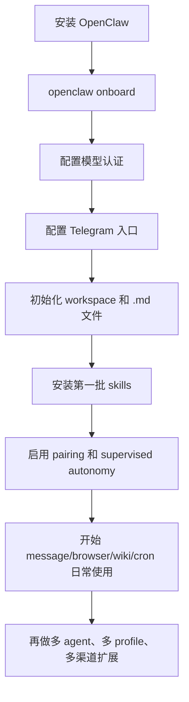

---
tags:
  - openclaw
  - ai-agent
  - telegram
  - skills
  - automation
  - developer-tools
---
# OpenClaw 安装、配置、命令与最佳实践

面向自托管 AI agent / personal assistant / 工程自动化场景，整理 OpenClaw 的安装方式、首次上线、模型认证、Telegram Bot、工作区 Markdown、自定义 skills、命令体系与安全实践。

截至 `2026-04-26` 核对，本文主要依据 OpenClaw 官方文档、官方 GitHub README 和 ClawHub 当前页面整理。

说明：

- 本文中的安装、配置路径、CLI、Telegram、workspace、pairing、安全项，优先依据官方文档。
- 本文中的“必装 skills”不是 OpenClaw 官方唯一标准答案，而是我基于官方 docs 提到的核心技能、ClawHub 当前安装量、作者、扫描结果、适用场景做的实践型推荐。
- 关于 `markdown.tables` 的 JSON5 示例，官方文档给的是通用 channel 配置示例，本文按 OpenClaw 全局 `openclaw.json` 的写法做了等价改写。

官方地址：

- GitHub：<https://github.com/openclaw/openclaw>
- Docs 首页：<https://open-claw.bot/docs/>
- 安装：<https://open-claw.bot/docs/install/>
- CLI：<https://open-claw.bot/docs/cli/>
- 配置：<https://open-claw.bot/docs/gateway/configuration/>
- 安全：<https://open-claw.bot/docs/gateway/security/>
- Telegram：<https://open-claw.bot/docs/channels/telegram/>
- Pairing：<https://open-claw.bot/docs/start/pairing/>
- Workspace / Personal Assistant：<https://open-claw.bot/docs/agents-md>
- Skills 配置：<https://open-claw.bot/docs/tools/skills-config/>
- 自定义 Skills：<https://open-claw.bot/docs/tools/creating-skills/>
- OpenAI / Codex Provider：<https://open-claw.bot/docs/providers/openai/>
- ClawHub：<https://open-claw.bot/docs/tools/clawhub/>

## 目录

- [Key Takeaways](#key-takeaways)
- [OpenClaw 是什么](#openclaw-是什么)
- [从 0 到 1 的推荐路径](#从-0-到-1-的推荐路径)
- [安装前准备](#安装前准备)
- [安装与升级](#安装与升级)
- [完全卸载与重装前清理](#完全卸载与重装前清理)
- [首次启动与健康检查](#首次启动与健康检查)
- [配置体系总览](#配置体系总览)
- [模型与认证推荐](#模型与认证推荐)
- [推荐基础配置](#推荐基础配置)
- [Telegram Bot 完整配置](#telegram-bot-完整配置)
- [工作区与自定义 Markdown 配置](#工作区与自定义-markdown-配置)
- [Skills 体系与必装清单](#skills-体系与必装清单)
- [命令速查表](#命令速查表)
- [安全最佳实践](#安全最佳实践)
- [如何最大程度发挥 OpenClaw 的作用](#如何最大程度发挥-openclaw-的作用)
- [常见坑](#常见坑)
- [参考来源](#参考来源)

## Key Takeaways

- 真正推荐的新手入口不是手搓配置，而是先跑 `openclaw onboard`，再回头收敛 `openclaw.json`。
- OpenClaw 的核心不是“聊天”，而是 `channel + workspace + skills + automation + browser/nodes` 这一整套可执行代理系统。
- 配置主入口是 `~/.openclaw/openclaw.json`，它支持热更新；环境变量优先级是：当前进程 > 当前目录 `.env` > `~/.openclaw/.env`。
- Telegram 最佳默认值不是“开放”，而是 `dmPolicy: "pairing"`，群里再加 `requireMention: true`。
- 最能拉开差距的不是安装多少 skills，而是把 `AGENTS.md`、`SOUL.md`、`TOOLS.md`、`memory/`、`cron`、`wiki` 用成你的个人操作系统。
- 安全上最重要的三件事是：限制入站访问、限制自动执行权限、定期跑 `openclaw security audit --deep`。

## OpenClaw 是什么

一句话理解：

- `OpenClaw = 你自己托管的 AI 代理控制平面 + 多渠道入口 + 本地/远程工具执行层 + 可持续记忆工作区`

它和普通聊天机器人最大的区别在于，它不仅能“回答”，还能：

- 挂到 Telegram、Slack、Discord、WhatsApp 等聊天入口
- 调用模型、工具、浏览器、设备节点、定时任务
- 读写本地工作区文件和长期记忆
- 跑 skills / plugins
- 把聊天、自动化、知识库和执行动作串起来

## 从 0 到 1 的推荐路径



推荐顺序：

1. 先装 CLI 并完成 `onboard`。
2. 先只接一个模型和一个渠道，优先 `OpenAI/Codex + Telegram`。
3. 先把 `workspace` 打磨好，再追求 fancy skills。
4. 先装 5 到 8 个高价值 skills，不要一口气装几十个。
5. 先把安全默认值设对，再考虑开放群、开放自动执行、开放更多节点。

## 安装前准备

### 系统要求

| 项目 | 当前建议 |
| --- | --- |
| Node | `22+` |
| 系统 | `macOS`、`Linux`、`Windows` |
| Windows | 更推荐 `WSL2` |
| pnpm | 仅源码构建时必需 |

补充建议：

- 如果你想把 OpenClaw 用到最狠，`macOS` 的杠杆最大，因为 `Peekaboo`、`imsg`、桌面自动化、语音、消息体系都更完整。
- 如果你主要跑服务、网关和自动化，`Linux` 很适合作为长期常驻环境。
- 如果你主要是工程开发，不建议在 Windows 原生命令环境里折腾复杂链路，优先 `WSL2`。

### 目录与状态文件

| 路径                          | 作用                      |
| --------------------------- | ----------------------- |
| `~/.openclaw/openclaw.json` | 主配置文件                   |
| `~/.openclaw/.env`          | 全局环境变量                  |
| `~/.openclaw/workspace`     | agent 工作区               |
| `~/.openclaw/credentials/`  | pairing / allowlist 等状态 |
| `<workspace>/skills`        | 当前工作区 skills            |

## 安装与升级

### 安装方式选择建议

| 方式                 | 推荐度 | 典型命令                                                | 适用场景            |
| ------------------ | --- | --------------------------------------------------- | --------------- |
| 官方安装脚本             | 最高  | `curl -fsSL https://openclaw.ai/install.sh \| bash` | 最省心，推荐大多数人      |
| npm 全局安装           | 高   | `npm install -g openclaw@latest`                    | 已有 Node 环境，想直接装 |
| pnpm 全局安装          | 高   | `pnpm add -g openclaw@latest`                       | 你本来就统一用 pnpm    |
| 源码构建               | 中   | `git clone ... && pnpm build`                       | 二开、调试、贡献源码      |
| Windows PowerShell | 高   | `iwr -useb https://openclaw.ai/install.ps1 \| iex`  | Windows 用户      |

### 1. 官方推荐安装

macOS / Linux / WSL2：

```bash
curl -fsSL https://openclaw.ai/install.sh | bash
```

Windows PowerShell：

```powershell
iwr -useb https://openclaw.ai/install.ps1 | iex
```

如果你只想装二进制，不立刻跑 onboarding：

```bash
curl -fsSL https://openclaw.ai/install.sh | bash -s -- --no-onboard
```

### 2. npm / pnpm 安装

```bash
npm install -g openclaw@latest
openclaw onboard --install-daemon
```

```bash
pnpm add -g openclaw@latest
pnpm approve-builds -g
openclaw onboard --install-daemon
```

### 3. 从源码安装

```bash
git clone https://github.com/openclaw/openclaw.git
cd openclaw
pnpm install
pnpm ui:build
pnpm build
pnpm link --global
openclaw onboard --install-daemon
```

### 4. 升级建议

如果你用 npm/pnpm 路线：

```bash
npm install -g openclaw@latest
```

或者：

```bash
pnpm add -g openclaw@latest
```

切换开发通道：

```bash
openclaw update --channel stable
openclaw update --channel beta
openclaw update --channel dev
```

## 完全卸载与重装前清理

### 1. 官方卸载命令

如果你想删除 service、状态目录、workspace 和 app，优先用官方命令：

```bash
openclaw uninstall --all --yes --non-interactive
```

如果你只想局部删除，也可以按范围拆开：

```bash
openclaw uninstall --service --yes --non-interactive
openclaw uninstall --state --yes --non-interactive
openclaw uninstall --workspace --yes --non-interactive
```

说明：

- `openclaw uninstall` 默认删除的是本地 service / state / workspace / app，不一定会删除你通过 `npm` 或 `pnpm` 装进去的 CLI 本体。
- 所以“完全卸载”通常要分成两步：先跑官方卸载，再删掉 CLI 安装来源。

### 2. 按安装方式补充清理 CLI

如果你是 `npm` 全局安装：

```bash
npm rm -g openclaw
```

如果你是 `pnpm` 全局安装：

```bash
pnpm remove -g openclaw
```

如果你是官方本地前缀安装器安装的：

```bash
pkill -f openclaw || true
launchctl bootout gui/$(id -u)/ai.openclaw.gateway 2>/dev/null || true
rm -rf ~/.openclaw
rm -f ~/Library/LaunchAgents/ai.openclaw.gateway.plist
rm -rf /Applications/OpenClaw.app
hash -r
```

说明：

- 官方本地前缀安装器通常把 CLI、Node 运行时、配置和工作区都放进 `~/.openclaw/`。
- `hash -r` 的作用是刷新当前 shell 的命令缓存，避免你刚删完仍然敲得出旧命令。
- `launchctl bootout ...` 用来把 macOS 上的 `LaunchAgent` 从 `launchd` 里卸下来，防止后台残留。

### 3. 建议的“彻底卸载”顺序

我在 macOS 上更推荐按下面顺序做：

```bash
openclaw uninstall --all --yes --non-interactive || true
npm rm -g openclaw || true
pnpm remove -g openclaw || true
pkill -f openclaw || true
launchctl bootout gui/$(id -u)/ai.openclaw.gateway 2>/dev/null || true
rm -rf ~/.openclaw
rm -f ~/Library/LaunchAgents/ai.openclaw.gateway.plist
rm -rf /Applications/OpenClaw.app
hash -r
```

这套命令的目标不是“优雅”，而是尽量覆盖下面几类残留：

- CLI 二进制 / 全局包残留
- `~/.openclaw` 状态目录残留
- `launchd` 后台服务残留
- app 包残留
- 当前 shell 的命令缓存残留

### 4. 卸载后如何确认已经干净

建议跑下面几条确认命令：

```bash
which openclaw
test -d ~/.openclaw && echo exists || echo missing
test -f ~/Library/LaunchAgents/ai.openclaw.gateway.plist && echo exists || echo missing
npm list -g --depth=0 openclaw
pnpm list -g openclaw
ps aux | rg 'openclaw|ai\.openclaw'
```

期望结果：

- `which openclaw` 返回 `not found`
- `~/.openclaw` 显示 `missing`
- `ai.openclaw.gateway.plist` 显示 `missing`
- `npm/pnpm list -g` 里没有 `openclaw`
- 进程列表里没有 `openclaw` / `openclaw-gateway`

### 5. 什么时候应该直接卸载重装

下面这些场景，直接卸载重装通常比继续修配置更省时间：

- `openclaw doctor --fix` 反复卡死
- `~/.openclaw` 权限、锁文件或运行时依赖目录已经混乱
- 你在 `npm 全局安装` 和 `官方本地前缀安装` 之间来回切过多次
- `LaunchAgent` 状态和本地配置状态长期不一致

实践建议：

- 如果你只是模型 key 配错、gateway bind 配错、Telegram bot 配错，优先修配置，不要先删。
- 如果你已经遇到“命令在、服务在、配置在，但状态互相打架”的局面，通常直接清空重来更快。

## 首次启动与健康检查

最推荐的首次启动路径：

```bash
openclaw onboard
```

安装完成后的最小验收：

```bash
openclaw doctor
openclaw status
openclaw dashboard
```

如果你不是用 daemon 常驻，而是手工跑网关：

```bash
openclaw gateway
```

### 首次启动验收表

| 检查项 | 命令 | 期望结果 |
| --- | --- | --- |
| 安装健康度 | `openclaw doctor` | 无致命错误 |
| 网关状态 | `openclaw status` | Gateway 可达 |
| 控制台 UI | `openclaw dashboard` | 能打开本地管理 UI |
| 配置生效 | `openclaw config get agents.defaults.workspace` | 返回你的 workspace |
| 安全初审 | `openclaw security audit` | 没有明显高危项 |

## 配置体系总览

### 配置入口

官方当前给出四种管理配置的方式：

1. CLI：`openclaw config set ...` / `openclaw config get ...`
2. Control UI：本地管理界面
3. 直接编辑 `~/.openclaw/openclaw.json`
4. `openclaw configure` 向导

### 配置文件位置

默认主配置：

```text
~/.openclaw/openclaw.json
```

工作区默认位置：

```text
~/.openclaw/workspace
```

### 环境变量优先级

官方当前文档给出的顺序是：

1. 当前终端进程里已经存在的环境变量
2. 当前工作目录的 `.env`
3. `~/.openclaw/.env`
4. 文件不会覆盖当前进程里已经存在的变量

这意味着最佳实践是：

- 生产或长期常驻环境，把稳定 secrets 放到 `~/.openclaw/.env`
- 某个项目想临时覆盖模型 key / profile，就在项目目录单独放 `.env`
- CI / systemd / launchd 里，直接用进程级环境变量，优先级最高

### 配置热更新

OpenClaw 当前会监听 `~/.openclaw/openclaw.json` 并自动应用大多数配置变更，所以很多修改不需要手工重启。

### 全局隔离参数

| Flag | 作用 | 适用场景 |
| --- | --- | --- |
| `--dev` | 使用 `~/.openclaw-dev` 隔离状态和端口 | 做实验，不污染主环境 |
| `--profile <name>` | 使用 `~/.openclaw-<name>` 隔离状态 | 把 `personal/work/lab` 分开 |
| `--container <name>` | 指定容器目标 | 容器化环境 |

## 模型与认证推荐

### 如果你打算用 OpenAI / Codex

官方当前给了两条主线：

| 路线 | 典型命令 | 典型模型 | 适合谁 |
| --- | --- | --- | --- |
| OpenAI API Key | `openclaw onboard --auth-choice openai-api-key` | `openai/gpt-5.4` | 你习惯 API key 计费 |
| Codex OAuth | `openclaw onboard --auth-choice openai-codex` 或 `openclaw models auth login --provider openai-codex` | `openai-codex/gpt-5.4` | 你主要拿它做工程任务 |

### 我推荐的模型策略

工程实践里，当前更稳的组合是：

- `primary`: `openai-codex/gpt-5.4`
- `fallback`: `openai/gpt-5.4`

原因：

- `Codex` 更适合工程代理式工作流
- 直接 `OpenAI API` 做 fallback，可以降低单一路径失败时的中断概率
- OpenClaw 官方配置示例本来也建议设置 `primary + fallback`

### 推荐模型配置

```json5
{
  env: {
    OPENAI_API_KEY: "sk-...",
  },

  agents: {
    defaults: {
      model: {
        primary: "openai-codex/gpt-5.4",
        fallbacks: ["openai/gpt-5.4"],
      },

      models: {
        "openai-codex/gpt-5.4": {
          alias: "Codex",
          params: {
            transport: "auto",
          },
        },

        "openai/gpt-5.4": {
          alias: "GPT",
          params: {
            transport: "auto",
            openaiWsWarmup: true,
            responsesServerCompaction: true,
          },
        },
      },
    },
  },
}
```

### 模型参数最佳实践

| 参数 | 建议值 | 作用 |
| --- | --- | --- |
| `transport` | `"auto"` | WebSocket 优先，失败再回退 SSE |
| `openaiWsWarmup` | `true` | 降低首轮 WebSocket 延迟 |
| `responsesServerCompaction` | `true` | 长会话更稳，减轻上下文膨胀 |
| `fastMode` | 平时 `false`，赶时间时打开 | 低延迟，通常意味着更贵 |

## 推荐基础配置

下面这份更适合作为“从 0 到 1 后马上可用”的基线配置。

说明：

- secrets 最好放环境变量，不要硬编码进文件
- `agents.defaults.skills` 我先不建议加，等你明确第一批 skills 后再做 allowlist
- 这是一份实践建议，不是 OpenClaw 官方唯一模板

```json5
{
  agents: {
    defaults: {
      workspace: "~/.openclaw/workspace",

      model: {
        primary: "openai-codex/gpt-5.4",
        fallbacks: ["openai/gpt-5.4"],
      },

      models: {
        "openai-codex/gpt-5.4": {
          alias: "Codex",
          params: {
            transport: "auto",
          },
        },
        "openai/gpt-5.4": {
          alias: "GPT",
          params: {
            transport: "auto",
            openaiWsWarmup: true,
            responsesServerCompaction: true,
          },
        },
      },

      autonomy: {
        mode: "supervised",
        autoApprove: ["read"],
        requireApproval: ["write", "execute", "network"],
      },
    },
  },

  channels: {
    telegram: {
      enabled: true,
      // botToken: 从 TELEGRAM_BOT_TOKEN 或 secrets 注入更合适
      dmPolicy: "pairing",
      groups: {
        "*": {
          requireMention: true,
        },
      },
      commands: {
        native: "auto",
      },
      customCommands: [
        { command: "daily", description: "Daily summary" },
        { command: "triage", description: "Inbox triage" },
      ],
      replyToMode: "first",
      blockStreaming: true,
      textChunkLimit: 4000,
      chunkMode: "newline",
      linkPreview: false,
    },
  },

  skills: {
    allowBundled: ["gemini", "peekaboo"],
    load: {
      extraDirs: ["~/Projects/openclaw-skills"],
      watch: true,
      watchDebounceMs: 250,
    },
  },
}
```

建议同时放一个全局 `.env`：

```bash
# ~/.openclaw/.env
OPENAI_API_KEY=sk-...
TELEGRAM_BOT_TOKEN=123456:replace-me
```

## Telegram Bot 完整配置

### 1. 在 BotFather 创建机器人

官方流程很直接：

1. 打开 Telegram，联系 `@BotFather`
2. 运行 `/newbot`
3. 按提示设置 bot name 和 username
4. 保存生成的 token

### 2. 把 token 配进 OpenClaw

最小配置：

```json5
{
  channels: {
    telegram: {
      enabled: true,
      botToken: "123:abc",
      dmPolicy: "pairing",
      groups: { "*": { requireMention: true } },
    },
  },
}
```

也可以用环境变量：

```bash
TELEGRAM_BOT_TOKEN=...
```

### 3. 启动 gateway 并批准第一个 DM

```bash
openclaw gateway
openclaw pairing list telegram
openclaw pairing approve telegram <CODE>
```

pairing 行为要点：

- 新联系人会收到 `8` 位大写 pairing code
- code `1` 小时过期
- pairing 数据存放在 `~/.openclaw/credentials/`
- `telegram-pairing.json` 记录待批准请求
- `telegram-allowFrom.json` 记录已批准 allowlist

### 4. 加到群里时的建议

推荐第一阶段只做这两件事：

- 群必须 `@mention` 才响应
- 不开放 group policy 到全群

实战上你至少要保留：

```json5
groups: {
  "*": {
    requireMention: true,
  },
}
```

### 5. Telegram 关键字段说明

| 字段 | 推荐值 | 作用 |
| --- | --- | --- |
| `enabled` | `true` | 启用 Telegram 渠道 |
| `dmPolicy` | `"pairing"` | 未授权 DM 先走配对 |
| `groups.*.requireMention` | `true` | 群里必须提及 bot |
| `commands.native` | `"auto"` | 自动注册原生命令菜单 |
| `customCommands` | 适量添加 | 只注册菜单，不自动实现逻辑 |
| `replyToMode` | `"first"` | 回复链更稳定 |
| `blockStreaming` | `true` | 更早给出可见消息块 |
| `textChunkLimit` | `4000` | Telegram 文本分块阈值 |
| `chunkMode` | `"newline"` | 优先按段落切分 |
| `linkPreview` | `false` 或按需 | 减少消息噪音 |

### 6. 自定义 Telegram 命令菜单

```json5
{
  channels: {
    telegram: {
      commands: {
        native: "auto",
      },
      customCommands: [
        { command: "backup", description: "Git backup" },
        { command: "generate", description: "Create an image" },
      ],
    },
  },
}
```

注意：

- `customCommands` 只是菜单项，不会自动实现业务逻辑
- 名称会被规范化，要求 `a-z`、`0-9`、`_`，长度 `1..32`
- 自定义命令不能覆盖 native commands
- 如果 `setMyCommands failed`，通常是你机器到 `api.telegram.org` 的 DNS / HTTPS 出站有问题

### 7. Telegram 最佳实践

| 场景 | 建议 |
| --- | --- |
| 个人机器人 | 保持 `dmPolicy: "pairing"` |
| 家庭/小团队共享 | 只 allowlist 明确用户，不要直接 `open` |
| 群聊 | 一定开启 `requireMention` |
| 长回答 | 保持 `chunkMode: "newline"` |
| 输出可读性 | `linkPreview: false` 通常更干净 |
| 菜单 | native 命令少量保留，自定义命令控制在 3 到 6 个 |

### 8. 关于 `allowFrom` 的一个现实提醒

官方文档目前能看到多种示例形式，例如：

- `allowFrom: ["tg:123"]`
- `allowFrom: ["123456789", "@username"]`

这意味着你在不同版本/文档页看到的样式可能不完全一致。实操时建议：

```bash
openclaw config schema
openclaw config validate
```

以你当前安装版本的 schema 为准。

## 工作区与自定义 Markdown 配置

这一块是 OpenClaw 真正长期好用的关键。

### 1. 初始化 workspace

```bash
mkdir -p ~/.openclaw/workspace
```

官方当前文档给出的模板初始化方式是：

```bash
cp docs/reference/templates/AGENTS.md ~/.openclaw/workspace/AGENTS.md
cp docs/reference/templates/SOUL.md ~/.openclaw/workspace/SOUL.md
cp docs/reference/templates/TOOLS.md ~/.openclaw/workspace/TOOLS.md
```

如果你想走 personal assistant roster：

```bash
cp docs/reference/AGENTS.default.md ~/.openclaw/workspace/AGENTS.md
```

同时建议立刻把 workspace 做成 git 仓库：

```bash
cd ~/.openclaw/workspace
git init
git add AGENTS.md
git commit -m "Initialize OpenClaw workspace"
```

### 2. 我建议的 workspace 目录结构

```text
~/.openclaw/workspace/
├── AGENTS.md
├── SOUL.md
├── TOOLS.md
├── USER.md
├── IDENTITY.md
├── memory.md
├── memory/
│   ├── 2026-04-26.md
│   └── topics/
└── skills/
```

### 3. 这些 Markdown 文件分别做什么

| 文件 | 角色 | 最适合放什么 |
| --- | --- | --- |
| `AGENTS.md` | 运行规则 | 长期工作流、输出规范、项目约束 |
| `SOUL.md` | 人格与边界 | 语气、风格、价值取向、红线 |
| `TOOLS.md` | 工具说明书 | 哪些工具可用、如何优先选用、哪些动作必须确认 |
| `USER.md` | 用户画像 | 你的偏好、常用语言、节奏、工作习惯 |
| `IDENTITY.md` | 助手身份 | 名字、定位、服务边界 |
| `memory.md` | 长期摘要记忆 | 稳定事实、偏好、长期项目 |
| `memory/` | 日志与主题记忆 | 每日记录、项目记录、经验沉淀 |

### 4. 我的分工建议

- `SOUL.md` 只写“它是谁”，不要写复杂工程细则。
- `AGENTS.md` 只写“它如何工作”，不要写太多人格化文本。
- `TOOLS.md` 写工具路由规则，比如“涉及 GitHub 优先用 `gh`，涉及 Google Workspace 优先用 `gog`”。
- `USER.md` 写你自己的偏好，比如语言、回复长度、命名风格、是否允许自动执行。
- `memory.md` 只保留长期稳定事实，不要把每天聊天流水都塞进去。

### 5. 一套够用的 Markdown 模板

#### `SOUL.md`

```md
# Soul

你是一个偏工程化、重验证、少废话的个人助手。

## Tone

- 默认使用简洁中文
- 代码、命令、路径保留英文
- 先给结论，再给操作

## Boundaries

- 涉及写文件、执行命令、联网调用时，要先明确动作目标
- 不把 secrets 回显到聊天
- 不在用户未确认的情况下做破坏性操作
```

#### `AGENTS.md`

```md
# Operating Rules

## General

- 先读取本地事实，再做判断
- 先给最小可行解，再考虑花哨方案
- 能用表格表达的清单尽量表格化

## Engineering

- Git 操作先看 status
- Review 先列 findings，再给总结
- 涉及多步骤任务时，先给计划，再执行

## Output

- 面向执行
- 避免空泛建议
- 需要时给可直接运行的命令
```

#### `TOOLS.md`

```md
# Tool Routing

- GitHub: 优先使用 gh CLI
- Google Workspace: 优先使用 gog
- Notion: 优先使用 notion skill / notion-cli
- GUI 自动化: 优先 Peekaboo
- 本地搜索和知识检索: 优先 qmd / wiki / memory

## Safety

- shell / browser / GUI 自动化先解释目标
- 写操作默认二次确认
- 大批量外发消息必须明确目标范围
```

#### `USER.md`

```md
# User Profile

- 默认语言：中文
- 偏好输出：结论先行，步骤清晰，少空话
- 常用场景：工程开发、自动化、知识管理、日常助手
- 常用平台：Telegram、GitHub、Notion、Google Workspace
```

#### `IDENTITY.md`

```md
# Identity

Name: ClawOps
Role: 我的工程与自动化助手

Mission:
- 帮我把消息、任务、知识和执行动作串成闭环
```

### 6. 自定义消息 Markdown 渲染

OpenClaw 的 Markdown 不是简单“原样发出去”，而是先转 IR，再按 Telegram / Slack / Signal 等各自 renderer 输出，所以跨渠道格式一致性比很多 bot 框架更好。

官方文档里明确提到与 Markdown 相关的两类配置：

1. 跨渠道格式渲染，例如 `markdown.tables`
2. Telegram 侧分块/HTML fallback，例如 `textChunkLimit`、`chunkMode`、`linkPreview`

#### 表格渲染策略

官方给出的 `markdown.tables` 选项有三种：

| 值 | 作用 | 适用场景 |
| --- | --- | --- |
| `code` | 把表格转成代码块 | 大多数桌面端、保真优先 |
| `bullets` | 把每一行转成项目符号 | 手机端、Signal / WhatsApp 一类更友好 |
| `off` | 不处理，原样文本输出 | 你想自己控制格式 |

#### 等价 JSON5 写法示例

下面这段是根据官方通用 Markdown 配置示例，按 `openclaw.json` 写法做的等价改写：

```json5
{
  channels: {
    discord: {
      markdown: {
        tables: "code",
      },
      accounts: {
        work: {
          markdown: {
            tables: "off",
          },
        },
      },
    },
  },
}
```

#### 对 Telegram 更实用的 Markdown 相关项

```json5
{
  channels: {
    telegram: {
      textChunkLimit: 4000,
      chunkMode: "newline",
      linkPreview: false,
      blockStreaming: true,
      replyToMode: "first",
    },
  },
}
```

含义：

- `textChunkLimit: 4000` 是 Telegram 默认文本分块上限
- `chunkMode: "newline"` 优先按段落切
- `linkPreview: false` 减少噪音
- `blockStreaming: true` 更早发送真实消息块
- `replyToMode: "first"` 让回复链路更稳定

## Skills 体系与必装清单

### 1. Skills 的加载与优先级

官方当前文档给出的 skill roots / precedence：

| 顺序 | 路径 |
| --- | --- |
| 1 | `<workspace>/skills` |
| 2 | `<workspace>/.agents/skills` |
| 3 | `~/.agents/skills` |
| 4 | `~/.openclaw/skills` |
| 5 | bundled skills |
| 6 | `skills.load.extraDirs` |

相关配置：

```json5
{
  skills: {
    allowBundled: ["gemini", "peekaboo"],
    load: {
      extraDirs: ["~/Projects/agent-scripts/skills"],
      watch: true,
      watchDebounceMs: 250,
    },
  },
}
```

### 2. Agent 级技能 allowlist

如果你想按 agent 隔离技能面：

```json5
{
  agents: {
    defaults: {
      skills: ["github", "weather"],
    },
    list: [
      { id: "writer" },
      { id: "docs", skills: ["docs-search"] },
      { id: "locked-down", skills: [] },
    ],
  },
}
```

注意：

- `agents.defaults.skills` 是默认 allowlist
- `agents.list[].skills` 会直接替换，不会和 defaults merge
- 新手前期不建议太早收紧，否则你会误以为 skill 没装好

### 3. 自定义 skill 的最低结构

```text
my-skill/
└── SKILL.md
```

最小 `SKILL.md`：

```md
---
name: hello_world
description: A simple skill that says hello.
---

# Hello World Skill

When the user asks for a greeting, use the echo tool to say "Hello from your custom skill!".
```

新加 skill 后，官方建议：

- 让 agent 执行“refresh skills”
- 或者重启 gateway

### 4. 官方 docs 明确提到的核心 skills

在 personal assistant / workspace 文档里，官方当前明确提到了两组高价值 skills：

| 类型 | skills |
| --- | --- |
| Core skills | `mcporter`、`Peekaboo`、`imsg`、`gog` |
| Explore next | `wacli`、`spotify-player`、`OpenHue CLI`、`Gemini CLI` |

这组清单本身就很能说明 OpenClaw 的用法方向：

- `mcporter`：接 MCP
- `Peekaboo`：接桌面 GUI
- `imsg`：接 iMessage / SMS
- `gog`：接 Google Workspace
- `wacli`：接 WhatsApp 生态
- `spotify-player` / `OpenHue CLI`：接生活流工具
- `Gemini CLI`：接第二模型或副模型路径

### 5. 我建议的工程实践必装包

下面这张表是我按当前 ClawHub 信号筛过的一套工程 starter pack。

| Skill | 推荐级别 | 为什么值得装 | 当前信号 |
| --- | --- | --- | --- |
| `steipete/github` | 必装 | GitHub issue / PR / CI / release 闭环 | 官方作者，`513` stars，约 `4k` current installs，`Benign/high confidence` |
| `steipete/mcporter` | 必装 | MCP server 接入总开关，后续扩展性最高 | 官方作者，`172` stars，约 `1.8k` current installs，需人工审查 CLI/stdio 风险 |
| `steipete/qmd` | 强烈推荐 | 本地知识索引、BM25 + vectors，本地知识库很关键 | 官方作者，`97` stars，约 `359` current installs，适合知识检索 |
| `steipete/oracle` | 强烈推荐 | 给复杂问题找第二模型复核，特别适合 review / 架构 / debug | 官方作者，约 `1.1k` current installs |
| `steipete/gemini` | 推荐 | 给 OpenClaw 增加第二模型执行路径，便于成本/速度切换 | 官方作者，`48` stars，约 `1.3k` current installs |
| `dimagious/notion-skill` | 推荐 | Notion 文档、数据库、知识流非常适合和 agent 联动 | `Benign/high confidence`，约 `80` current installs |
| `openclaw-linear` 或其他高质量 Linear skill | 按需 | 工程任务流如果在 Linear，价值很高 | 当前生态分散，安装前先看维护者和 scanner 结果 |

安装建议：

```bash
openclaw skills search "github"
openclaw skills search "mcporter"
openclaw skills search "qmd"
openclaw skills install steipete/github
openclaw skills install steipete/mcporter
openclaw skills install steipete/qmd
openclaw skills list --verbose
openclaw skills check
```

### 6. 我建议的日常工具必装包

| Skill | 推荐级别 | 适合什么场景 | 当前信号 |
| --- | --- | --- | --- |
| `steipete/gog` | 必装 | Gmail、Calendar、Drive、Docs、Sheets 一条龙 | 官方作者，`838` stars，约 `3.3k` current installs |
| `dimagious/notion-skill` | 必装 | 知识管理、项目文档、日报周报沉淀 | `Benign/high confidence` |
| `steipete/peekaboo` | macOS 必装 | 当没有 API 时做 GUI 自动化 | 官方作者，`71` stars，约 `1.2k` current installs，`Benign/high confidence` |
| `openclaw/imsg` | macOS 条件必装 | iMessage / SMS 工作流 | 官方作者，约 `1.1k` current installs，需关注 macOS 权限 |
| `steipete/spotify-player` | 可选高频 | 音乐播放、设备切换 | 官方作者，约 `903` current installs |
| `steipete/openhue` | 智能家居可选 | Hue 灯光、场景控制 | 官方作者，约 `1k` current installs |
| `camopel/ddgs-search` | 可选 | 免费 web search / arXiv 搜索 | `Benign/high confidence`，适合外部研究 |

### 7. 安装 skills 的最佳实践

| 原则 | 为什么 |
| --- | --- |
| 先装 5 到 8 个 | 装太多会抬高上下文成本，反而影响路由质量 |
| 优先官方或高置信度 | 降低 supply chain 风险 |
| 优先安装真正每周会用到的 | 不要为了“全”而装 |
| 先 `skills list --verbose` / `skills check` | 提前看到缺失依赖 |
| 对有 `Suspicious/medium confidence` 的 skill 做人工审查 | 很多不一定恶意，但常有 metadata / install mismatch |

## 命令速查表

### 安装与初始化

| 命令 | 用途 | 什么时候用 | 备注 |
| --- | --- | --- | --- |
| `openclaw onboard` | 首次安装向导 | 新装后第一件事 | 最推荐入口 |
| `openclaw onboard --install-daemon` | 安装并常驻 daemon | npm/pnpm 安装后 | 更适合长期运行 |
| `openclaw configure` | 交互式配置 | 想补配某一块 | 适合新手 |
| `openclaw config get <path>` | 读配置 | 排查生效值 | 很常用 |
| `openclaw config set <path> <value>` | 写配置 | 需要一条命令修改 | 支持 batch |
| `openclaw config validate` | 校验配置 | 改完文件后 | 建议常用 |
| `openclaw config schema` | 看 schema | 不确定字段写法 | 配合 `allowFrom` 等很有用 |
| `openclaw doctor` | 健康检查 | 安装后、升级后、出问题时 | 高价值 |
| `openclaw status` | 查看整体状态 | 日常巡检 | 快速总览 |
| `openclaw dashboard` | 打开本地 UI | 配置和观察状态 | 适合可视化检查 |

### Gateway / Runtime / Logs

| 命令                         | 用途           | 什么时候用               | 备注        |
| -------------------------- | ------------ | ------------------- | --------- |
| `openclaw gateway`         | 前台启动 gateway | 调试期                 | 最直接       |
| `openclaw gateway start`   | 后台启动         | 常驻服务                | 配合 daemon |
| `openclaw gateway stop`    | 停止 gateway   | 运维动作                |           |
| `openclaw gateway restart` | 重启 gateway   | 插件、配置、依赖调整后         |           |
| `openclaw gateway status`  | 看 gateway 状态 | 排障                  |           |
| `openclaw gateway health`  | 健康探测         | 自动化巡检               |           |
| `openclaw gateway probe`   | 深度探测         | 连通性问题               |           |
| `openclaw logs`            | 查日志          | 任何疑难杂症              |           |
| `openclaw channels logs`   | 渠道日志         | Telegram / Slack 问题 |           |
| `openclaw daemon status`   | 旧别名状态查询      | 兼容旧文档               | legacy    |

### 模型与认证

| 命令 | 用途 | 什么时候用 | 备注 |
| --- | --- | --- | --- |
| `openclaw models list` | 列出模型 | 首次选模型 |  |
| `openclaw models status` | 查看当前模型状态 | 切模后确认 |  |
| `openclaw models set <provider/model>` | 切主模型 | 日常切换 |  |
| `openclaw models auth login --provider openai-codex` | Codex OAuth 登录 | 用订阅路线时 | 推荐工程用 |
| `openclaw infer model list` | 查看推理能力模型 | 需要更底层能力时 |  |
| `openclaw infer web search` | 用 provider web search | 研究任务 |  |
| `openclaw infer web fetch` | 抓取网页 | 研究任务 |  |
| `openclaw infer image generate` | 生图 | 多模态任务 |  |

### Channels / Messaging / Pairing

| 命令 | 用途 | 什么时候用 | 备注 |
| --- | --- | --- | --- |
| `openclaw channels list` | 列出已配置渠道 | 渠道总览 |  |
| `openclaw channels status` | 查看渠道状态 | 渠道排障 |  |
| `openclaw channels capabilities` | 看渠道能力 | 决定是否支持 reaction/thread 等 |  |
| `openclaw pairing list telegram` | 查看 Telegram 待配对请求 | 新联系人发消息后 | 很常用 |
| `openclaw pairing approve telegram <CODE>` | 批准 Telegram 联系人 | 完成首次授权 | code 1h 过期 |
| `openclaw pairing list nodes` | 查看设备节点待配对 | 接 iOS / Android / macOS node |  |
| `openclaw pairing approve nodes <CODE>` | 批准设备节点 | 首次节点接入 |  |
| `openclaw message send --channel telegram --target <id> --message "..."` | 主动发消息 | bot 主动通知 | target 可是 chat id / username |
| `openclaw message read` | 读消息 | 自动化 / 排查 |  |
| `openclaw message thread reply` | 线程回复 | thread-heavy 渠道 |  |
| `openclaw directory self` | 看自身目录/身份 | 多渠道身份调试 |  |

### Skills / Plugins / Workspace

| 命令 | 用途 | 什么时候用 | 备注 |
| --- | --- | --- | --- |
| `openclaw skills search "<query>"` | 搜索 skill | 找能力时 | ClawHub 原生流 |
| `openclaw skills install <slug>` | 安装 skill | 初装能力 | 装到 active workspace |
| `openclaw skills update --all` | 升级所有 skills | 定期维护 | 建议定期做 |
| `openclaw skills list` | 列出 skills | 看有哪些可用 |  |
| `openclaw skills list --verbose` | 查看缺失依赖 | 装完后排查 | 很有用 |
| `openclaw skills info <name>` | 查看某个 skill | 审查前 |  |
| `openclaw skills check` | 检查 readiness | 排障 |  |
| `openclaw plugins list` | 查看 plugins | 插件总览 |  |
| `openclaw plugins install clawhub:<package>` | 安装插件 | 需要 plugin 时 |  |
| `openclaw plugins update --all` | 升级插件 | 日常维护 |  |

### Automation / Browser / Memory / Wiki / Nodes

| 命令 | 用途 | 什么时候用 | 备注 |
| --- | --- | --- | --- |
| `openclaw cron list` | 查看定时任务 | 日常自动化 |  |
| `openclaw cron add` | 新增 cron | 周报、日报、提醒 |  |
| `openclaw cron run` | 手工触发 cron | 调试任务 |  |
| `openclaw tasks list` | 查看任务队列 | 自动化治理 |  |
| `openclaw tasks show <id>` | 查看任务细节 | 任务失败排查 |  |
| `openclaw browser status` | 查看托管浏览器状态 | browser automation |  |
| `openclaw browser open <url>` | 打开页面 | 浏览器自动化起点 |  |
| `openclaw browser snapshot` | 抓 DOM / 视图快照 | UI 自动化调试 |  |
| `openclaw browser click` | 点击页面 | 无 API 流程 |  |
| `openclaw browser type` | 输入文本 | 表单自动化 |  |
| `openclaw browser evaluate` | 执行 JS | 高级浏览器自动化 |  |
| `openclaw memory status` | 看记忆状态 | 记忆系统巡检 |  |
| `openclaw memory index` | 重新索引记忆 | 记忆更新后 |  |
| `openclaw memory search "<query>"` | 搜索记忆 | 长期事实召回 |  |
| `openclaw wiki init` | 初始化 wiki | 知识库场景 |  |
| `openclaw wiki ingest` | 导入知识 | 私有知识库构建 |  |
| `openclaw wiki search "<query>"` | 搜索 wiki | 私域知识检索 |  |
| `openclaw nodes list` | 列设备节点 | 多设备自动化 |  |
| `openclaw nodes approve <requestId>` | 批准节点 | 首次接入设备 |  |
| `openclaw nodes invoke` | 调节点动作 | 高级多设备控制 |  |

## 安全最佳实践

OpenClaw 是强能力系统，不是“默认安全”的玩具。最佳实践是从最小权限起步。

### 1. 渠道访问默认收紧

| 项目 | 推荐值 |
| --- | --- |
| DM | `dmPolicy: "pairing"` |
| 群聊 | `requireMention: true` |
| allowlist | 明确写用户，不要一开始就 `"*"` |

### 2. 自动执行默认 supervised

```json5
{
  agents: {
    defaults: {
      autonomy: {
        mode: "supervised",
        autoApprove: ["read"],
        requireApproval: ["write", "execute", "network"],
      },
    },
  },
}
```

### 3. 定期跑安全审计

```bash
openclaw security audit
openclaw security audit --deep
openclaw security audit --fix
```

`--fix` 当前会帮你做的事情包括：

- 把危险的开放策略收紧
- 把日志敏感信息保护恢复到较安全设置
- 把 `~/.openclaw` 权限收紧到推荐值

### 4. 出问题先跑 doctor

```bash
openclaw doctor
```

适合排查：

- 权限过宽
- gateway auth 配置不对
- 安装不完整
- binary / path 问题

### 5. 账号与权限隔离

| 场景 | 建议 |
| --- | --- |
| Google Workspace | 尽量用最小权限 OAuth |
| GitHub | 最好单独 token，按 repo / scope 控制 |
| Telegram | bot 本身就天然隔离 |
| WhatsApp / iMessage | 尽量单独环境，避免把私人主号直接暴露给自动化 |
| 桌面自动化 | 只在可信主机上开 |

### 6. Skills 的安全判断准则

装 skill 前至少看这 5 件事：

1. 作者是不是官方或可信维护者
2. scanner 是 `Benign` 还是 `Suspicious`
3. 需要的 binary / env / 权限是否合理
4. 它是不是要求外部安装脚本、第三方 tap、curl | bash
5. 它是不是把 secrets 写进本地明文配置

## 如何最大程度发挥 OpenClaw 的作用

很多人把 OpenClaw 只当“聊天入口”，这通常只发挥了它 20% 的价值。

### 1. 把它当你的多入口操作系统

建议你按这个模型理解：

- `Telegram`：输入和通知中心
- `workspace/*.md + memory/`：大脑
- `skills`：专业能力插件
- `browser / Peekaboo / nodes`：执行器
- `cron / tasks / wiki / qmd`：长期自动化和知识层

### 2. 按领域拆 profile 和 agent

推荐至少拆成：

| 维度 | 建议 |
| --- | --- |
| Profile | `personal`、`work`、`lab` |
| Agent | `main`、`dev`、`ops`、`assistant` |
| Channel | `telegram-personal`、`telegram-work`、`slack-work` |

你真正的长期收益，不是“一个万能 bot”，而是“多个受控、隔离、职责清晰的 bot”。

### 3. 做工程闭环

最强的一类用法是：

1. Telegram / Slack 收到需求
2. GitHub / Linear / Notion 拉上下文
3. OpenClaw 组织方案
4. browser / CLI / scripts 执行动作
5. 结果再同步回 Telegram / Notion / GitHub

一个典型闭环：

- GitHub issue 进来
- OpenClaw 抓 PR、CI、代码上下文
- 生成执行建议
- 写回 issue / Notion
- cron 在每天固定时间发进展摘要到 Telegram

### 4. 把它做成知识中枢

推荐组合：

- `workspace/memory/` 做长期行为和偏好沉淀
- `wiki` 做结构化知识库
- `qmd` 做本地索引检索
- `Notion` / `Obsidian` 做外部知识归档

这会让它从“会聊天的 bot”变成“会持续学习你的工作方式的系统”。

### 5. 让没有 API 的工具也进入自动化

如果你只盯着 API，会浪费 OpenClaw 很多能力。

高杠杆组合：

- `Peekaboo`：桌面 GUI 自动化
- `openclaw browser ...`：浏览器自动化
- `imsg`：macOS 消息流
- `gog`：Google Workspace

这意味着：

- 没 API 的网页，也能自动点
- 没 SDK 的桌面应用，也能自动操作
- 没 webhook 的个人工具，也能进入执行链

### 6. 真正常驻的自动化场景

最值得做成常驻任务的几类：

| 场景 | 组合能力 |
| --- | --- |
| 每日摘要 | `gog + github + notion + telegram + cron` |
| Inbox triage | `gmail / gog + telegram + tasks` |
| 研发巡检 | `github + cron + status + security audit` |
| 知识沉淀 | `telegram + wiki + qmd + notion` |
| 无 API 后台操作 | `browser + peekaboo + telegram` |
| 家庭自动化 | `openhue + telegram + cron` |

### 7. 一个我最推荐的成长顺序

1. 先把 `Telegram + Codex/OpenAI + workspace` 跑顺
2. 再装 `github + gog + notion + qmd`
3. 再加 `Peekaboo / browser / cron`
4. 最后才扩到更多渠道、更多 agents、更多 nodes

## 常见坑

### 1. 一上来装太多 skills

后果：

- 上下文变重
- 选择工具更混乱
- 成本更高
- 排障更难

正确做法：

- 先装 5 到 8 个
- 一周后清理掉不用的

### 2. 把 secrets 写进 `openclaw.json`、`SKILL.md`、workspace 仓库

正确做法：

- 优先放环境变量
- 把 `workspace/` 做 git，但不要把 secrets 也一起纳管

### 3. 过早开放 `dmPolicy: "open"` 或群开放

正确做法：

- 先 pairing
- 再 allowlist
- 最后才考虑开放

### 4. 误以为 Telegram `customCommands` 会自动实现逻辑

不会。

它只是菜单入口；真正行为还是靠 skill、agent 规则、plugins、自动化链来实现。

### 5. 不区分三类 Markdown

这三件事不要混：

- `workspace/*.md`，这是 agent 的人格与工作规则
- `SKILL.md`，这是技能说明书
- 消息 Markdown 渲染配置，例如 `markdown.tables`、`textChunkLimit`

### 6. 不做 `skills check` / `config validate`

很多“它怎么不工作”本质上只是：

- 缺 binary
- 缺 env var
- 配置字段写错
- 当前 profile 不是你以为的那个

推荐把这四条养成习惯：

```bash
openclaw config validate
openclaw skills list --verbose
openclaw skills check
openclaw doctor
```

## 参考来源

### 官方文档

- 安装：<https://open-claw.bot/docs/install/>
- CLI：<https://open-claw.bot/docs/cli/>
- 配置：<https://open-claw.bot/docs/gateway/configuration/>
- Telegram：<https://open-claw.bot/docs/channels/telegram/>
- Pairing：<https://open-claw.bot/docs/start/pairing/>
- 安全：<https://open-claw.bot/docs/gateway/security/>
- 安全 FAQ：<https://open-claw.bot/docs/help/faq/security/>
- Workspace / Personal Assistant：<https://open-claw.bot/docs/agents-md>
- Markdown Formatting：<https://open-claw.bot/docs/concepts/markdown-formatting/>
- Skills 配置：<https://open-claw.bot/docs/tools/skills-config/>
- 自定义 Skills：<https://open-claw.bot/docs/tools/creating-skills/>
- OpenAI / Codex Provider：<https://open-claw.bot/docs/providers/openai/>
- ClawHub：<https://open-claw.bot/docs/tools/clawhub/>

### 官方 GitHub

- README：<https://github.com/openclaw/openclaw>

### ClawHub 当前技能页

- GitHub：<https://clawhub.ai/steipete/github>
- mcporter：<https://clawhub.ai/skills/mcporter>
- qmd：<https://clawhub.ai/steipete/qmd>
- Oracle：<https://clawhub.ai/steipete/oracle>
- Gemini：<https://clawhub.ai/steipete/gemini>
- Gog：<https://clawhub.ai/steipete/gog>
- Peekaboo：<https://clawhub.ai/steipete/peekaboo>
- iMsg：<https://clawhub.ai/openclaw/imsg>
- Spotify Player：<https://clawhub.ai/skills/spotify-player>
- OpenHue：<https://clawhub.ai/steipete/openhue>
- Notion：<https://clawhub.ai/dimagious/notion-skill>
- ddgs-search：<https://clawhub.ai/skills/ddgs-search>
