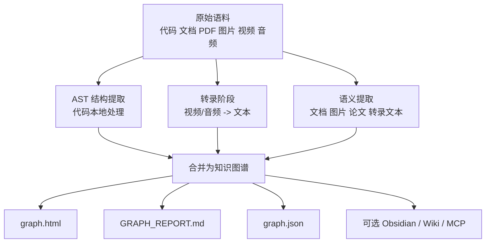

---
tags:
  - graphify
  - ai-skills
  - claude-code
  - codex
  - opencode
  - knowledge-graph
  - multimodal
  - developer-tools
---
# graphify 安装、作用、使用与跨 Agent 集成（macOS）

下文整理 `safishamsi/graphify` 的定位、能力、安装方式、使用方法，以及在 `Claude Code`、`Codex`、`OpenCode` 三类 agent 里的差异与实践建议。

截至 `2026-05-03` 核对，本文同时参考了你给的 `v6` 中文说明页和当前仓库主页 README。两者已经存在一些差异，文中会单独标出，避免后续按旧文档操作。

官方地址：

- 你给的 `v6` 中文页：<https://github.com/safishamsi/graphify/blob/v6/docs/translations/README.zh-CN.md>
- 当前仓库：<https://github.com/safishamsi/graphify>
- 当前 README：<https://github.com/safishamsi/graphify/blob/main/README.md>

## 目录

- [Key Takeaways](#key-takeaways)
- [graphify 是什么](#graphify-是什么)
- [它解决什么问题](#它解决什么问题)
- [工作机制](#工作机制)
- [macOS 安装前准备](#macos-安装前准备)
- [安装方式总览](#安装方式总览)
- [Claude Code：安装与使用](#claude-code安装与使用)
- [Codex：安装与使用](#codex安装与使用)
- [OpenCode：安装与使用](#opencode安装与使用)
- [三类 Agent 差异总表](#三类-agent-差异总表)
- [常用命令速查](#常用命令速查)
- [graphify 产物与目录说明](#graphify-产物与目录说明)
- [推荐工作流](#推荐工作流)
- [`v6` 中文页与当前 README 差异](#v6-中文页与当前-readme-差异)
- [注意点与边界](#注意点与边界)
- [参考来源](#参考来源)

## Key Takeaways

- `graphify` 不是普通“压缩输出”类 skill，而是把代码、文档、论文、截图、图片、视频和音频整理成可查询知识图谱的 agent skill。
- 它的核心价值不是第一次运行时省 token，而是把首次提取结果沉淀成 `graphify-out/graph.json` 和 `GRAPH_REPORT.md`，让后续问题不必反复读原始文件。
- 官方 PyPI 包名当前是 `graphifyy`，但安装后命令名仍然是 `graphify`。
- `Claude Code`、`Codex`、`OpenCode` 都支持，但触发方式和 always-on 机制不同：`Claude Code` 走 `CLAUDE.md + PreToolUse hook`，`Codex` 现在是 `AGENTS.md + .codex/hooks.json`，`OpenCode` 现在是 `AGENTS.md + .opencode/plugins/graphify.js`。
- 你给的 `v6` 中文页已经不是最新状态。最明显的变化是：当前 README 增加了更多平台、更多命令参数，并补充了 `Codex` 和 `OpenCode` 的 hook / plugin 细节。

## graphify 是什么

| 维度 | 说明 |
| --- | --- |
| 项目 | `safishamsi/graphify` |
| 定位 | 面向 AI Coding Agent 的知识图谱构建 skill |
| 输入 | 代码、文档、PDF、截图、流程图、白板照片、图片、视频、音频 |
| 输出 | `graph.html`、`GRAPH_REPORT.md`、`graph.json`、可选 `obsidian/`、可选 `wiki/` |
| 核心目标 | 帮助 agent 和人更快理解“系统结构、概念关系、设计动机、为什么这么设计” |
| 主要收益 | 大语料下减少后续查询 token、提升代码库理解速度、增强架构问答质量 |
| 不做什么 | 不代替源码阅读；第一次建图仍然要花时间和 token；小仓库压缩收益有限 |

## 它解决什么问题

| 痛点 | graphify 的处理方式 |
| --- | --- |
| 代码库太大，grep 很散 | 先构图，再按 community / god node 导航 |
| 文档、代码、论文、图散在不同位置 | 统一抽取概念与关系，合并到一个图里 |
| 只能知道“做了什么”，不知道“为什么这样做” | 抽取 docstring、解释性注释和文档中的设计动机 |
| 每次开新会话都要重新读上下文 | 把图谱和报告持久化在 `graphify-out/` |
| 团队成员理解项目速度慢 | 可以把 `graphify-out/` 提交到 git，让队友直接读取总结结果 |
| 语料包含图片 / 视频 / 音频 | 多模态提取后接入同一图谱 |

## 工作机制

当前 README 描述的是三段式流程；你给的 `v6` 中文页写的是“两轮”，主要是因为后来的版本把视频/音频转录单独拆成了一个阶段。



### 核心原理

| 阶段 | 做什么 | 是否依赖模型 |
| --- | --- | --- |
| AST 提取 | 从代码文件抽类、函数、导入、调用图、docstring、rationale 注释 | 否 |
| 转录 | 对视频 / 音频做本地 Whisper 转录，并缓存结果 | 否，转录本地 |
| 语义提取 | 从文档、论文、图片、转录文本中提取概念、关系和设计动机 | 是 |
| 聚类与导出 | 合并为 `NetworkX` 图并做 Leiden 社区发现，导出 HTML / JSON / 报告 | 否 |

### 图中关系标签

| 标签 | 含义 |
| --- | --- |
| `EXTRACTED` | 直接从源材料里发现 |
| `INFERRED` | 合理推断，并附带置信度 |
| `AMBIGUOUS` | 有歧义，需要复核 |

## macOS 安装前准备

| 项目 | 建议 | 说明 |
| --- | --- | --- |
| 系统 | `macOS` 开发机 | 本文默认 macOS |
| Python | `3.10+` | graphify 明确要求 |
| `pip` | 已安装 | 官方安装命令基于 `pip install` |
| AI Agent | 已可正常运行 | 先确认 `Claude Code` / `Codex` / `OpenCode` 已装好 |
| `git` | 建议安装 | 团队共享 `graphify-out/` 和 hook 更方便 |
| `pipx` | 可选 | 如果你用 `pipx` 安装过命令但 `graphify` 找不到，官方建议运行 `pipx ensurepath` 后重开终端 |

## 安装方式总览

### 1. 官方推荐安装

```bash
pip install graphifyy && graphify install
```

| 项目 | 说明 |
| --- | --- |
| 官方包名 | `graphifyy` |
| 安装后命令 | `graphify` |
| PyPI 注意 | 官方 README 明确说明只认 `graphifyy`；其他名字近似的 `graphify*` 包不属于这个项目 |
| 推荐原因 | 自动按平台装对应 skill / 配置，避免手动复制旧路径 |
| 最适合谁 | 想尽快装好、而且可能会跨多个 agent 使用的人 |

### 2. 平台级安装命令

| Agent | 安装命令 | 备注 |
| --- | --- | --- |
| `Claude Code` | `graphify install` | macOS / Linux 默认就是这一条 |
| `Codex` | `graphify install --platform codex` | 另需开 `multi_agent = true` |
| `OpenCode` | `graphify install --platform opencode` | 安装后再做 always-on 更完整 |

### 3. 如果命令找不到

| 场景 | 处理方式 |
| --- | --- |
| `graphify: command not found` | 先检查 Python 安装位置和 PATH |
| 用 `pipx` 安装过但命令没进 PATH | 运行 `pipx ensurepath` 后重开终端 |
| 不确定是否装成功 | 运行 `graphify --help` 或 `python -m graphify --help` 验证 |

## Claude Code：安装与使用

### 安装

```bash
pip install graphifyy && graphify install
```

### 基础使用

| 操作 | 命令 |
| --- | --- |
| 对当前目录建图 | `/graphify` 或 `/graphify .` |
| 对指定目录建图 | `/graphify ./raw` |
| 仅增量更新 | `/graphify ./raw --update` |
| 构建更激进的推断边 | `/graphify ./raw --mode deep` |

### always-on 配置

```bash
graphify claude install
```

| 动作 | Claude Code 下会发生什么 |
| --- | --- |
| 写规则 | 往 `CLAUDE.md` 写规则，提示先读 `graphify-out/GRAPH_REPORT.md` |
| 装 hook | 安装 `PreToolUse` hook，在 `Glob` / `Grep` 前提醒先利用图谱 |
| 目标 | 让 Claude 先按知识图谱导航，而不是直接全仓库搜索 |

### 卸载

```bash
graphify claude uninstall
```

## Codex：安装与使用

### 安装

```bash
pip install graphifyy && graphify install --platform codex
```

### 额外前置条件

Codex 官方差异里最重要的一条是并行子代理开关：

| 项目 | 要求 |
| --- | --- |
| 配置文件 | `~/.codex/config.toml` |
| 配置项 | 在 `[features]` 下设置 `multi_agent = true` |
| 作用 | 允许 graphify 做并行提取 |

### 基础使用

| 操作 | 命令 | 说明 |
| --- | --- | --- |
| 对当前目录建图 | `$graphify .` | `Codex` 用 `$`，不是 `/` |
| 对指定目录建图 | `$graphify ./raw` | 同上 |
| 增量更新 | `$graphify ./raw --update` | 图谱已存在时常用 |
| 问图谱里的关系 | `$graphify query "what connects attention to the optimizer?"` | 查询型用法 |

### always-on 配置

```bash
graphify codex install
```

| 动作 | Codex 下会发生什么 |
| --- | --- |
| 写规则 | 把图谱优先使用规则写入项目级 `AGENTS.md` |
| 装 hook | 当前 README 说明还会写 `.codex/hooks.json`，在 Bash 工具调用前注入图谱提醒 |
| 目标 | 让 Codex 在跑 bash / 搜索前先意识到 `graphify-out/GRAPH_REPORT.md` 已可用 |

### 卸载

```bash
graphify codex uninstall
```

## OpenCode：安装与使用

### 安装

```bash
pip install graphifyy && graphify install --platform opencode
```

### 基础使用

| 操作 | 命令 |
| --- | --- |
| 对当前目录建图 | `/graphify .` |
| 对指定目录建图 | `/graphify ./raw` |
| 只重跑聚类 | `/graphify ./raw --cluster-only` |
| 跳过 HTML 可视化 | `/graphify ./raw --no-viz` |

### always-on 配置

```bash
graphify opencode install
```

| 动作 | OpenCode 下会发生什么 |
| --- | --- |
| 写规则 | 把图谱优先使用规则写入项目级 `AGENTS.md` |
| 装 plugin | 当前 README 说明会安装 `.opencode/plugins/graphify.js`，并在 `opencode.json` 注册 |
| 触发时机 | 在 bash 工具前注入图谱提醒 |
| 目标 | 让 OpenCode 先读图谱摘要，再决定是否搜索原始文件 |

### 卸载

```bash
graphify opencode uninstall
```

## 三类 Agent 差异总表

| 维度 | `Claude Code` | `Codex` | `OpenCode` |
| --- | --- | --- | --- |
| 基础安装 | `graphify install` | `graphify install --platform codex` | `graphify install --platform opencode` |
| 触发前缀 | `/graphify` | `$graphify` | `/graphify` |
| 并行提取 | 支持 | 支持，但要开 `multi_agent = true` | 支持 |
| always-on 命令 | `graphify claude install` | `graphify codex install` | `graphify opencode install` |
| 常驻规则文件 | `CLAUDE.md` | `AGENTS.md` | `AGENTS.md` |
| 工具前 hook / plugin | `PreToolUse` hook | `.codex/hooks.json` | `.opencode/plugins/graphify.js` |
| 适合谁 | Claude Code 重度用户 | 希望 Codex 长期按图谱工作的人 | OpenCode 项目级知识导航用户 |

## 常用命令速查

说明：

- 下表默认按 `Claude Code / OpenCode` 写成 `/graphify ...`。
- 如果你在 `Codex` 里用，同一条命令把前缀改成 `$graphify ...` 即可。

### 建图与更新

| 命令 | 作用 |
| --- | --- |
| `/graphify .` | 对当前目录建图 |
| `/graphify ./raw` | 对指定目录建图 |
| `/graphify ./raw --update` | 只重提取变更文件并合并进已有图谱 |
| `/graphify ./raw --mode deep` | 更激进地抽取 `INFERRED` 边 |
| `/graphify ./raw --directed` | 构建有向图 |
| `/graphify ./raw --cluster-only` | 只重跑聚类，不重做提取 |
| `/graphify ./raw --no-viz` | 跳过 HTML，可只保留报告和 JSON |

### 查询与解释

| 命令 | 作用 |
| --- | --- |
| `/graphify query "..."` | 直接向图谱提问 |
| `/graphify query "..." --dfs` | 追踪一条更具体的路径 |
| `/graphify query "..." --budget 1500` | 限制查询预算 |
| `/graphify path "A" "B"` | 查看两个节点之间的路径 |
| `/graphify explain "NodeName"` | 解释某个节点或概念 |

### 扩展能力

| 命令 | 作用 |
| --- | --- |
| `/graphify add https://arxiv.org/abs/...` | 拉取论文并接入图谱 |
| `/graphify add https://x.com/...` | 拉取推文并接入图谱 |
| `/graphify add <video-url>` | 下载音频、转录并接入图谱 |
| `/graphify ./raw --watch` | 监听变更并自动同步 |
| `/graphify ./raw --wiki` | 生成 agent 更容易读取的 wiki |
| `/graphify ./raw --obsidian` | 生成 Obsidian vault |
| `/graphify ./raw --obsidian --obsidian-dir ~/vaults/myproject` | 输出到指定 Obsidian 目录 |
| `/graphify ./raw --svg` | 导出 `graph.svg` |
| `/graphify ./raw --graphml` | 导出 `graph.graphml` |
| `/graphify ./raw --neo4j` | 生成 Neo4j 的 `cypher.txt` |
| `/graphify ./raw --neo4j-push bolt://localhost:7687` | 直接推送到运行中的 Neo4j |
| `/graphify ./raw --mcp` | 启动 MCP stdio server |

### 直接在终端查询图谱

| 命令 | 作用 |
| --- | --- |
| `graphify query "..."` | 不通过 agent，直接从终端查询图谱 |
| `graphify path "A" "B"` | 直接查看最短路径 |
| `graphify explain "NodeName"` | 直接解释某个节点 |

### Git hooks

| 命令 | 作用 |
| --- | --- |
| `graphify hook install` | 安装 `post-commit` 和 `post-checkout` hook |
| `graphify hook uninstall` | 卸载 hook |
| `graphify hook status` | 查看 hook 状态 |

## graphify 产物与目录说明

### 默认输出目录

| 路径 | 作用 |
| --- | --- |
| `graphify-out/graph.html` | 可交互图谱，可搜索、点击、按 community 过滤 |
| `graphify-out/GRAPH_REPORT.md` | 一页式摘要，包含 god nodes、社区结构、意外连接、建议问题 |
| `graphify-out/graph.json` | 持久化图谱，供后续查询、MCP、自动化读取 |
| `graphify-out/cache/` | SHA256 缓存，只重处理变更文件 |
| `graphify-out/transcripts/` | 视频 / 音频转录缓存 |

### 可选输出

| 路径 / 产物 | 如何得到 | 作用 |
| --- | --- | --- |
| `graphify-out/obsidian/` 或自定义 vault | `--obsidian` | 生成适合 Obsidian 的知识库视图 |
| `graphify-out/wiki/` | `--wiki` | 让 agent 通过普通 Markdown 文件导航知识库 |
| `graph.svg` | `--svg` | 静态图谱导出 |
| `graph.graphml` | `--graphml` | 给 Gephi / yEd 等图工具用 |
| `cypher.txt` | `--neo4j` | 给 Neo4j 使用 |

### `.graphifyignore`

| 作用 | 写法 |
| --- | --- |
| 排除不希望进图谱的目录和文件 | 语法与 `.gitignore` 相同 |
| 常见排除项 | `vendor/`、`node_modules/`、`dist/`、`*.generated.py` |

## 推荐工作流

### 个人使用

| 步骤 | 推荐动作 |
| --- | --- |
| 1 | `pip install graphifyy && graphify install` |
| 2 | 在目标项目跑一次 `/graphify .` 或 `$graphify .` |
| 3 | 再运行对应平台的 always-on 安装命令 |
| 4 | 后续优先让 agent 读 `GRAPH_REPORT.md`，需要深挖时再用 `query / path / explain` |

### 团队使用

| 步骤 | 推荐动作 |
| --- | --- |
| 1 | 一个人先生成 `graphify-out/` 并提交到 git |
| 2 | `.gitignore` 里忽略 `graphify-out/cache/` |
| 3 | 所有人 pull 后直接受益于 `GRAPH_REPORT.md` |
| 4 | 装 `graphify hook install`，让 commit 后和切分支后自动刷新图谱 |
| 5 | 文档 / 论文变更后，显式跑一次 `--update` |

## `v6` 中文页与当前 README 差异

这是这篇笔记里最值得单独记住的部分。

| 主题 | 你给的 `v6` 中文页 | 当前 README / 当前仓库主页 | 结论 |
| --- | --- | --- | --- |
| 支持平台 | 主要列 `Claude Code`、`Codex`、`OpenCode`、`OpenClaw`、`Factory Droid`、`Trae` | 已扩展到 `Cursor`、`Gemini CLI`、`GitHub Copilot CLI`、`VS Code Copilot Chat`、`Aider`、`Hermes`、`Kiro`、`Google Antigravity` 等 | 你这篇先聚焦三大 agent，但要知道项目已经更泛化 |
| 工作阶段 | 写成“两轮” | 当前 README 写成“三段式”，增加视频 / 音频转录阶段 | 现在应按“三段式”理解 |
| Codex always-on | 写成 `AGENTS.md` | 当前 README 说明还会写 `.codex/hooks.json` | 旧文档少写了一层 |
| OpenCode always-on | 写成 `AGENTS.md` | 当前 README 说明还会装 `.opencode/plugins/graphify.js` 并注册到 `opencode.json` | 旧文档少写了一层 |
| Codex 触发方式 | `v6` 页里大多沿用 `/graphify` 表述 | 当前 README 明确说 Codex 要用 `$graphify` | 以当前 README 为准 |
| 手动 `curl` 安装 | `v6` 页示例是 `v3/.../skill.md` | 当前 README 示例是 `v4/.../skill.md` | 手工复制路径容易过时，优先自动安装 |
| 命令集 | 已有 `query / path / explain / watch / wiki / mcp / neo4j` | 当前 README 还补充了 `--directed`、`--cluster-only`、`--no-viz`、更完整的 `--obsidian-dir` 等 | 当前能力更完整 |

## 注意点与边界

| 事项 | 说明 |
| --- | --- |
| 第一次运行不省 token | 首次要做提取和建图，收益主要体现在后续查询 |
| 小仓库压缩收益有限 | 官方 worked example 里 6 个文件只有约 `~1x`，更大的价值是结构清晰 |
| 代码与文档的隐私边界不同 | 代码 AST 本地处理；文档、论文、图片的语义提取会调用你所在平台背后的模型 API |
| 视频 / 音频是本地转录 | 当前 README 说明通过 `faster-whisper` 本地转录，音频不离开机器 |
| 团队协作时别提交缓存 | 推荐只提交 `graphify-out/` 结果，不提交 `graphify-out/cache/` |
| 不建议优先手动 `curl` | 因为不同版本的 skill 文件路径已经变过，自动安装更稳 |

## 参考来源

- `v6` 中文说明页：<https://github.com/safishamsi/graphify/blob/v6/docs/translations/README.zh-CN.md>
- 当前仓库主页与 README：<https://github.com/safishamsi/graphify>
- 当前 README：<https://github.com/safishamsi/graphify/blob/main/README.md>
