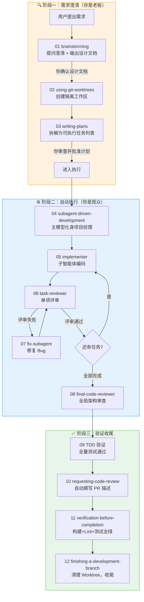
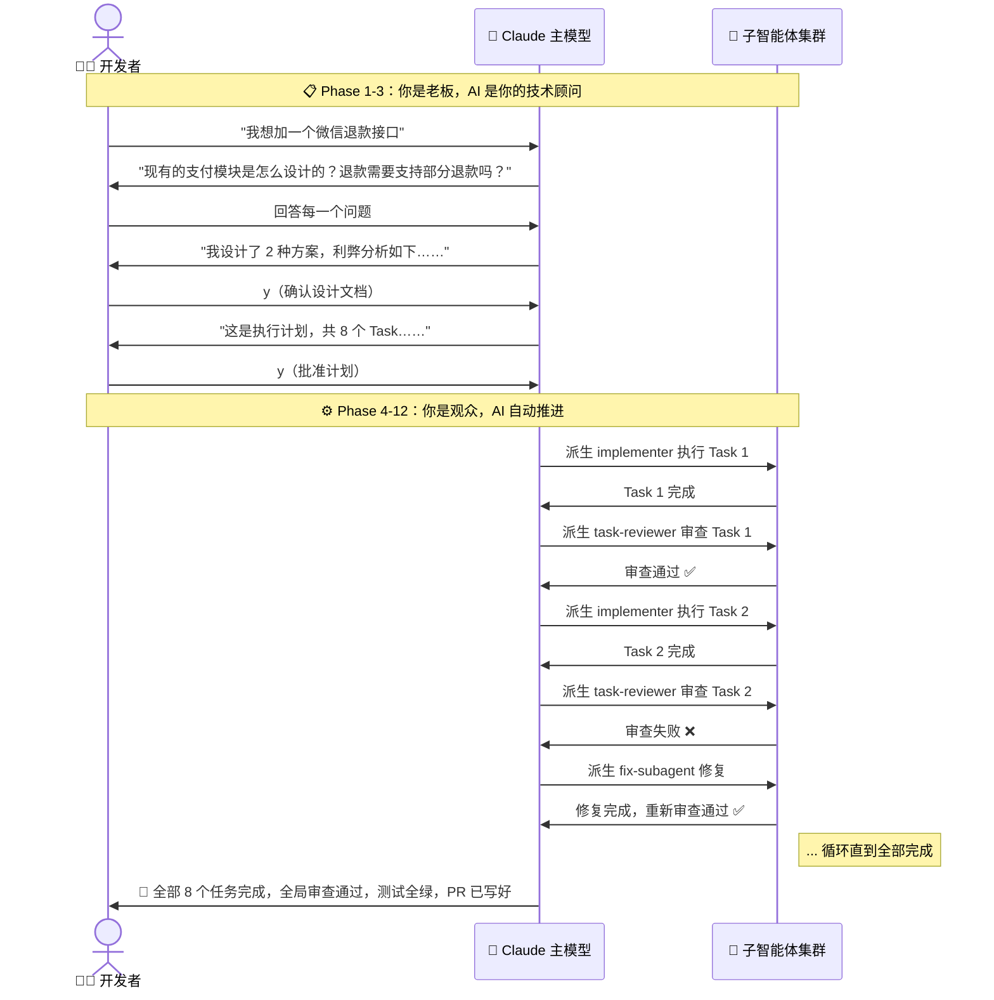

# Superpowers 安装使用与 AI 编程工作流实践指南

> Superpowers 不是"多装几个提示词"——它是把 Claude 从一个"你说一句它写一堆 Bug"的实习生，规训为一支遵循严密工业级标准的高级工程师团队。

Superpowers 是 `obra/superpowers` 仓库提供的一套 agentic skills framework 和软件开发方法论。它的核心价值在于**流程强制**：需求澄清 → 设计评审 → 任务拆分 → TDD → 子代理执行 → 代码审查 → 收尾合并，这些工程动作不再是"建议"，而是 Agent **会主动调用的 skills**。

官方地址：

- GitHub：<https://github.com/obra/superpowers>
- OpenCode 文档：<https://github.com/obra/superpowers/blob/main/docs/README.opencode.md>
- 原始发布介绍：<https://blog.fsck.com/2025/10/09/superpowers/>

## 目录

- [Key Takeaways](#key-takeaways)
- [核心理念：从"实习生"到"高级工程师团队"](#核心理念从实习生到高级工程师团队)
- [Superpowers 是什么](#superpowers-是什么)
- [它解决什么问题](#它解决什么问题)
- [🛠️ 12 步核心工作流全景表](#️-12-步核心工作流全景表)
- [开发者角色转换：前半程老板，后半程观众](#开发者角色转换前半程老板后半程观众)
- [内置 skills 分类](#内置-skills-分类)
- [macOS 全局安装建议](#macos-全局安装建议)
- [Claude Code 安装](#claude-code-安装)
- [Codex 安装](#codex-安装)
- [OpenCode 安装](#opencode-安装)
- [Hermes Agent 适配状态](#hermes-agent-适配状态)
- [如何使用](#如何使用)
- [真实工程实践命令实例](#真实工程实践命令实例)
- [更新、排障与安全](#更新排障与安全)
- [与本库相关笔记](#与本库相关笔记)
- [参考来源](#参考来源)

## Key Takeaways

1. **Superpowers 的本质是"流程强制"**：它不是给你更多 Prompt，而是用 skills 把工程纪律固化为 Agent 无法跳过的步骤。
2. **12 步流水线分工明确**：前半程（brainstorming → writing-plans）你是老板，必须严厉把关；后半程（implementer → finishing）你是观众，看子智能体集群自动推进。
3. **子代理驱动开发是核心转折点**：主模型化身为"项目经理 (Controller)"，不再亲自写代码，而是调度纯净上下文的子智能体去执行单个任务——这解决了长对话导致的上下文污染和模型变笨问题。
4. **TDD 是硬性红线**：没写出失败的测试用例之前，绝对不准动业务代码。这不是建议，是规则。
5. **两步评审确保质量**：task-reviewer（单项评审）+ final-code-reviewer（全局架构评审），防止子智能体"各扫门前雪"产生跨模块隐性冲突。
6. **Git Worktree 彻底隔离**：每个功能在独立工作区开发，绝不污染主工作区的未提交代码。
7. **Claude Code、Codex、OpenCode 都有官方安装路径，但需分别安装**；一个工具装好不等于其他工具可用。
8. **Hermes Agent 未出现在官方支持列表**，标记为 `需确认`，不可直接套用其他工具的配置。

## 核心理念：从"实习生"到"高级工程师团队"

### 问题：为什么直接让 AI 写代码会翻车？

很多开发者的使用方式是：

```text
"帮我给支付模块加一个微信退款接口"
```

然后 Claude 直接开始改代码——这很容易导致：

- **长篇大论的 Bug**：模型在缺乏完整上下文时倾向于"脑补"，改出看似合理但实际有问题的代码
- **Token 内存污染**：长对话中模型逐渐"忘记"早期的约束条件，后面的代码与前面自相矛盾
- **没有测试**：代码写完了，但没有验证它是否正确
- **无法审查**：改动太大、太散，人类根本看不过来

### Superpowers 的解法：12 步工业级流水线

Superpowers 的核心理念是把一次"AI 辅助开发"变成一条**不可跳过的 12 步自动化流水线**：



这条流水线的设计哲学——对比传统 AI 编码方式：

| 维度 | 传统 AI 编码 | Superpowers 流水线 |
|------|-------------|-------------------|
| 需求理解 | 一句话带过，直接动手 | 单步追问，直到设计文档确认 |
| 代码隔离 | 污染主工作区 | Git Worktree 物理隔离 |
| 任务粒度 | 一个 Prompt 全搞定 | 拆成有文件路径和验收标准的小任务 |
| 测试 | 事后补甚至不补 | TDD 硬性红线，先写失败测试 |
| 代码审查 | 无或敷衍 | 单项评审 + 全局架构评审双重把关 |
| 上下文管理 | 越长越笨 | 子智能体纯净上下文，主模型只做调度 |
| 收尾验证 | "看起来好了" | 全量构建+Lint+测试，SUCCESS 才算完 |

## Superpowers 是什么

一句话理解：

> `Superpowers = skills 化的软件开发流程框架 + 多编码 Agent 插件适配`

它把一套完整的开发方法论拆成多个可自动触发的 skills。每个 skill 对应流水线上的一个节点，Agent 在合适的场景会自动判断并调用。

核心特征：

- **不是 CLI 工具**：它不替代 Claude Code / Codex / OpenCode，而是作为插件增强它们
- **跨平台适配**：同一套 skills 逻辑，针对不同编码 Agent 做工具映射适配
- **流程优先于代码**：在写下第一行代码之前，必须先通过 brainstorming 和 writing-plans
- **强制质量门禁**：TDD、代码审查、全量验证是不可跳过的步骤

## 它解决什么问题

很多编码 Agent 的失败不是模型不会写代码，而是**流程不稳定**。Superpowers 把常见的失败模式一一对应到约束机制：

| 常见失败模式 | 根因 | Superpowers 的约束 |
|-------------|------|-------------------|
| 一上来就改代码 | 没有需求澄清环节 | `brainstorming` 强制先提问、再设计、最后确认 |
| 需求口头化、不可验证 | 没有书面设计文档 | 输出正式的 Design Doc，你确认后才进入下一步 |
| 改动太大难审查 | 没有任务拆分 | `writing-plans` 拆成带文件路径和验收标准的小任务 |
| 测试后补或不补 | 没有强制测试纪律 | TDD 硬性红线：先写失败测试，再写代码 |
| Agent 自称完成但没验证 | 没有证据收尾 | `verification-before-completion` 要求全量构建+测试 SUCCESS |
| 多任务互相污染 | 在同一工作区操作 | `using-git-worktrees` 物理隔离每个功能分支 |
| 长对话上下文漂移 | 上下文越来越长，模型"变笨" | `subagent-driven-development` 子智能体纯净上下文 |
| 子任务之间隐性冲突 | 各扫门前雪，没有全局视角 | `final-code-reviewer` 站在整条功能分支的宏观视角审查 |

## 🛠️ 12 步核心工作流全景表

> 这是 Superpowers 最核心的价值——一条严密的 12 步自动化流水线。每一步都有明确的 AI 行为、开发者交互和核心价值。

| 步骤 | 节点名称 (Skill) | 🤖 Claude 在干嘛 (AI 行为) | 🧑‍💻 你需要做什么 (开发者交互) | 💡 核心价值 / 避坑点 |
|:---:|------|------|------|------|
| **01** | `brainstorming` | 读取项目文件与架构，**单步追问你**以澄清需求。提出 2-3 种实现方案并分析利弊，最后输出一份正式的**设计文档 (Design Doc)**。 | 千万不要一句话带过！Claude 会一次只抛出一个问题，你要**认真回答每一个问题**，直到最后对设计文档输入 `y` 确认。 | 绝不在需求模糊时动手。这一步能帮你省去后续 **80% 的无效重构**。如果这一步敷衍了，后面的 11 步都是白费。 |
| **02** | `using-git-worktrees` | 自动在本地创建一个**独立的 Git Worktree** 并切到新分支。在隔离区自动跑环境初始化（如 `npm install` 等）。 | 保持终端有 Git 权限，允许它创建工作区即可。 | **彻底隔离主工作区**，绝不污染你当前正在写的其他未提交代码。即使这个功能写到一半放弃，主工作区毫发无伤。 |
| **03** | `writing-plans` | 基于前两步的设计文档，将其拆解成包含**具体文件路径、依赖关系和验收标准**的 Task 列表。拒绝任何 TODO、TBD 占位符。 | **严格审查这份执行计划**，看看有没有遗漏的边界条件、有没有模糊的验收标准，确认无误后输入 `y` 批准。 | 这份计划就是接下来所有子智能体的"**圣经**"，不容有失。模糊的计划 = 执行阶段的灾难。 |
| **04** | `subagent-driven-development` | 🔑 **核心转折点**。Claude 主模型瞬间化身为"**项目经理 (Controller)**"，它自己不再亲自写代码，而是转为调度中心。进入自动驾驶模式。 | 这时候你只需要**静静看着终端疯狂输出**。不要中途打断，不要手动去改代码。 | 保持主控模型的**上下文纯净**，防止长对话导致模型变笨。这是 Superpowers 最重要的架构决策之一。 |
| **05** | `implementer` | 主控模型针对计划中的**单个 Task**，派生出一个**纯净上下文的编码子智能体**，只喂给它该任务的代码片段，命它去攻坚。 | 无需介入。如果子智能体报错，主控会自动处理。 | 避免由于上下文历史太长导致的 **Token 浪费与代码胡言乱语**。每个子智能体只看到它需要看到的代码。 |
| **06** | `task-reviewer` | 编码子智能体写完后，主控**立即派生一个单项评审子智能体**，从"功能对齐"和"代码质量"两个维度肉眼审查改动。 | 无需介入，在终端看它的评审报告即可。如果通过，自动进入下一个任务。 | 属于**第一道质量关卡**，阻止垃圾代码进入主分支。在子智能体层面就把问题消灭。 |
| **07** | `fix-subagent` | 如果上述评审失败（测试没过或代码太烂），主控会派生一个**修复子智能体**去改 Bug，改完重新走单项评审（步骤 06），直到通过。 | 无需介入。你不用手动去帮它改 Bug。 | **循环迭代**，确保每一个细分任务交付时都是 100% 完好的。零缺陷流转到下一步。 |
| **08** | `final-code-reviewer` | 当**所有子任务全部搞定并局部合并后**，主控派生一个**全局代码评审员**，站在整条功能分支的宏观视角，做最终的架构审查。 | 查看全局评审总结，关注跨模块的潜在问题。 | **查缺补漏**，防止子智能体在"各扫门前雪"时产生了跨模块的隐性冲突。这是子智能体模式最容易忽略的问题。 |
| **09** | `test-driven-development` | 贯穿在步骤 05~07 中。Superpowers 的**硬性红线**：没写出失败的测试用例之前，绝对不准动业务代码 (TDD)。Red → Green → Refactor。 | 确保你项目本地的测试命令（如 `vitest`, `jest`, `pytest`）是能正常运行的。 | 逼迫 AI 先写测试，用测试来卡死代码的准确性。**没有测试的代码 = 没有证据的承诺**。 |
| **10** | `requesting-code-review` | 将所有通过验证的代码进行打包，**自动撰写规范、详实的 Pull Request 说明**。 | 将它为你写好的超赞 PR 描述**一键发布**到 GitHub / GitLab 上。 | 让你们团队的**真人同事看 PR 时一目了然**。AI 写的 PR 描述通常比人写的更规范。 |
| **11** | `verification-before-completion` | 🎯 **完工前的终极大考**。主控在合并前**全量跑一遍**项目的构建、Lint 和全部单元测试。 | 等待终端亮起代表**全绿通过的 SUCCESS** 标志。有任何红色就说明还有问题。 | 确保新功能上线的**最后一公里万无一失**。不接受"看起来好了"，只接受"全部测试通过"。 |
| **12** | `finishing-a-development-branch` | 自动做最后的**现场清理**。解绑并删除之前临时创建的 Git Worktree 目录，保持你的本地干净整洁。 | 享受最终成果，切回你的主分支 `git switch main`。 | **完美的自动化收尾**，不留任何工程垃圾。你的 `git worktree list` 永远保持干净。 |

### 流水线中的关键铁律

> [!tip] 铁律一：Phase 1-3 你是老板，Phase 4-12 你是观众
> 在 brainstorming（步骤 01）和 writing-plans（步骤 03），你必须严厉把关、详细回答 AI 的单步追问。一旦进入 subagent-driven-development（步骤 04），你的角色转变为**观察者**——让子智能体集群在后台疯狂输出，不要中途手动干预。

> [!warning] 铁律二：绝不跳过步骤
> 即使你觉得需求很简单，也至少要走 brainstorming → writing-plans → implementer → task-reviewer → verification。跳过任何一个质量门禁，都会让流水线的保障失效。

> [!tip] 铁律三：TDD 是不可协商的
> 如果代码在失败的测试被观察到之前就写出来了，**丢弃那段代码，重新开始该任务**。这不是建议，是 Superpowers 的硬性红线。

## 开发者角色转换：前半程老板，后半程观众

Superpowers 流水线最精妙的设计之一，是它重新定义了**开发者与 AI 的协作关系**：



### 为什么这个角色转换很重要？

| 如果开发者全程都在干预 | 如果开发者完全不把关前半程 |
|---------------------|----------------------|
| 子智能体的上下文隔离被打破 | 模糊的需求导致后面 80% 的返工 |
| 主模型的调度逻辑被打乱 | 执行计划充满 TODO 和 TBD |
| 手动改代码导致与子智能体冲突 | 子智能体在错误的方向上狂奔 |

**正确的姿势**：前半程花 80% 的精力把关需求和计划，后半程用 20% 的精力看终端输出和最终结果。

## 内置 skills 分类

Superpowers 的 skills 按职责分为五大类：

| 类别 | Skills | 在流水线中的角色 |
|------|--------|-----------------|
| **需求与设计** | `brainstorming`, `writing-plans` | 步骤 01、03：确保在动手前把目标、方案、计划全部理清 |
| **执行与调度** | `executing-plans`, `subagent-driven-development`, `dispatching-parallel-agents` | 步骤 04：计划转执行，子智能体调度 |
| **测试与调试** | `test-driven-development`, `systematic-debugging`, `verification-before-completion` | 步骤 09、11：质量门禁，红绿重构，终极大考 |
| **代码审查** | `requesting-code-review`, `receiving-code-review` | 步骤 06、08、10：单项评审 + 全局评审 + PR 撰写 |
| **分支与收尾** | `using-git-worktrees`, `finishing-a-development-branch` | 步骤 02、12：工作区隔离与清理 |
| **元技能** | `using-superpowers`, `writing-skills` | 引导 Agent 使用 skills 体系、创建新 skills |

## macOS 全局安装建议

> [!tip] 关键原则
> - 每个 harness 都要**单独安装**，一个工具装好不等于其他工具可用
> - 全局安装优先放**用户级配置目录**，不要复制到项目仓库
> - 项目级特殊规则放在项目的 `AGENTS.md` 或对应工具的**项目配置**中

| 工具 | 官方适配状态 | macOS 全局安装建议 |
|------|------------|-------------------|
| **Claude Code** | ✅ 官方 README 明确支持 | 在 Claude Code 内通过官方 plugin marketplace 安装 |
| **Codex App / CLI** | ✅ 官方 README 明确支持 | 在 Codex App 插件页或 Codex CLI `/plugins` 中安装 |
| **OpenCode** | ✅ 官方 README 和专门文档明确支持 | 写入 `~/.config/opencode/opencode.json` 的 `plugin` 数组 |
| **Hermes Agent** | ❌ README 未列出 | `需确认`，不建议直接声明为官方支持；需单独验证 |

---

## Claude Code 安装

Claude Code 有两条官方 README 提到的路径。

### 方式一：官方 marketplace（推荐）

在 Claude Code 会话中执行：

```text
/plugin install superpowers@claude-plugins-official
```

### 方式二：Superpowers marketplace

如果使用 Superpowers marketplace：

```text
/plugin marketplace add obra/superpowers-marketplace
/plugin install superpowers@superpowers-marketplace
```

### 验证安装

```text
Tell me about your superpowers
```

期望结果：
- Agent 能说明已加载 Superpowers
- 在开发类任务前会主动提到适用 skill，例如 `brainstorming`、`writing-plans`、`test-driven-development`

---

## Codex 安装

官方 README 将 Codex App 和 Codex CLI 分开说明。

### Codex App

1. 打开侧边栏 `Plugins`
2. 在 Coding 分类中找到 `Superpowers`
3. 点击 `+` 并按提示安装

### Codex CLI

在 Codex CLI 会话中：

```text
/plugins
```

搜索 `superpowers`，选择 `Install Plugin`。

验证方式同上：

```text
Tell me about your superpowers
```

---

## OpenCode 安装

OpenCode 使用自己的 plugin 安装机制。官方文档强调：**即使 Claude Code 或 Codex 已经安装过，OpenCode 仍然要单独安装**。

全局配置路径：

```bash
mkdir -p ~/.config/opencode
$EDITOR ~/.config/opencode/opencode.json
```

加入或合并以下配置：

```json
{
  "plugin": ["superpowers@git+https://github.com/obra/superpowers.git"]
}
```

> [!warning] 如果已经有其他插件，不要覆盖，合并到同一个数组

```json
{
  "plugin": [
    "existing-plugin",
    "superpowers@git+https://github.com/obra/superpowers.git"
  ]
}
```

固定版本示例：

```json
{
  "plugin": ["superpowers@git+https://github.com/obra/superpowers.git#v5.0.3"]
}
```

重启 OpenCode 后验证：

```text
Tell me about your superpowers
```

也可以让 OpenCode 使用原生 `skill` tool：

```text
use skill tool to list skills
use skill tool to load brainstorming
```

---

## Hermes Agent 适配状态

截至本次整理，Superpowers 官方 README 的**支持列表没有列出 Hermes Agent**。

结论：
- `需确认`：Superpowers 是否已有 Hermes 官方 plugin / package
- 不建议直接把 OpenCode 的 `plugin` 配置复制给 Hermes
- 不建议把 Claude / Codex 的 slash command 当成 Hermes 命令

如果后续要做 Hermes 适配，建议单独走验证流程：

```bash
hermes --version
hermes config check
```

然后核对 Hermes 的 skills / plugin 文档，确认它是否能读取 Superpowers 的 `SKILL.md` 结构、是否支持会话启动注入、是否支持工具映射。没有验证前，只能把它当作待适配项。

---

## 如何使用

安装完成后，日常使用不是"记住每个 skill 名称"，而是让 Agent 在合适场景自动触发。

### 🚀 快速启动：一行命令触发完整流水线

在配置好 Superpowers 的 Claude Code 终端中，直接输入你的开发意图：

```text
/superpowers:brainstorming "我想为我们的系统添加一个微信支付的退款接口"
```

或者更通用的方式：

```text
Use Superpowers. Before editing code, identify the relevant skills, then follow the workflow.
```

中文也可以：

```text
使用 Superpowers。先判断应该加载哪些 skills，不要直接改代码；先澄清需求、写计划，再执行。
```

### 按阶段手动触发

如果你希望更精细地控制每个阶段：

**需求澄清：**
```text
Use brainstorming to clarify this feature before implementation:
我要给现有项目增加 GitHub OAuth 登录。
```

**写执行计划：**
```text
Use writing-plans to turn the approved design into an implementation plan.
Plan must include exact files, tests, and verification commands.
```

**TDD 实现：**
```text
Use test-driven-development.
First write the failing test, run it and show the failure,
then implement the minimum code, then rerun tests.
```

**收尾验证：**
```text
Use verification-before-completion and finishing-a-development-branch.
Run the relevant tests, summarize changed files,
and tell me whether this should be merged, PR'd, or kept as a worktree.
```

---

## 真实工程实践命令实例

下面的"命令"分两类：
- **shell 命令**：在 macOS 终端执行
- **agent 指令**：在 Claude Code / Codex / OpenCode 等会话里发送

> Hermes 相关示例只写通用 agent 指令，不假设 Hermes 已官方安装 Superpowers。

### 场景一：简单需求（Bug 修复 / 小组件 / 小脚本）

#### 示例：修一个后端接口 Bug

进入项目：
```bash
cd ~/work/my-api
git status --short
```

在 Agent 里发送：
```text
Use Superpowers and systematic-debugging.
Bug: POST /api/orders occasionally returns 500 when discount_code is empty.
First reproduce or locate the failing path.
Do not patch until you identify the root cause.
```

确认根因后继续：
```text
Use test-driven-development.
Add a regression test for empty discount_code, run it and show the failure,
then implement the minimal fix.
Verification command should be: npm test -- orders
```

本地验证：
```bash
npm test -- orders
git diff --stat
git diff
```

收尾指令：
```text
Use verification-before-completion.
Confirm the regression test passes, summarize the changed files,
and list any remaining risk.
```

---

### 场景二：复杂工程（跨模块改造 / 迁移 / 认证 / 计费）

#### 示例 1：新增 GitHub OAuth 登录

先建隔离分支：
```bash
cd ~/work/my-webapp
git status --short
git switch -c feat/github-oauth
```

让 Agent 先澄清，而不是直接实现：
```text
Use Superpowers brainstorming.
Goal: add GitHub OAuth login to the existing web app.
Constraints:
- Do not break existing email/password login.
- Use the existing session system.
- Add tests.
- Provide migration notes if database schema changes.
Ask clarifying questions first, then propose the design in small sections for approval.
```

设计批准后：
```text
Use writing-plans.
Create an implementation plan with small tasks.
Each task must include:
- exact files to change
- tests to write first
- verification command
- rollback risk
Do not implement yet.
```

进入执行：
```text
Use subagent-driven-development if available; otherwise use executing-plans.
Execute the approved plan one task at a time.
After each task, run its verification command and request code review before continuing.
```

期间强制 TDD：
```text
For each implementation task, use test-driven-development.
If code is written before the failing test is observed,
discard that code and restart the task.
```

本地验证：
```bash
npm test
npm run lint
npm run typecheck
git diff --stat
```

收尾：
```text
Use finishing-a-development-branch.
Verify the full test suite, summarize behavior changes,
list migration steps, and recommend whether to merge or open a PR.
```

#### 示例 2：把旧支付模块迁移到新 Provider

准备工作区：
```bash
cd ~/work/billing-service
git status --short
git switch -c migration/payment-provider-v2
```

复杂任务提示：
```text
Use Superpowers.
This is a complex migration: move payment processing from ProviderV1 to ProviderV2.
Use brainstorming first.
Important constraints:
- Existing subscriptions must continue working.
- Webhook idempotency must be preserved.
- Add contract tests around provider adapter behavior.
- No database destructive migration without explicit approval.
```

计划阶段（分阶段迁移）：
```text
Use writing-plans.
Split the migration into phases:
1. characterize current behavior with tests
2. introduce ProviderV2 adapter behind a feature flag
3. dual-run non-mutating validation
4. switch traffic
5. remove old path after verification
Each phase needs verification commands and rollback steps.
```

执行阶段：
```text
Use executing-plans with human checkpoints after each phase.
Use requesting-code-review before moving from one phase to the next.
```

验证命令示例：
```bash
npm run test:unit -- billing
npm run test:integration -- webhooks
npm run lint
npm run typecheck
```

上线前收尾：
```text
Use verification-before-completion.
Produce a release checklist:
- tests run
- feature flag state
- rollback command
- metrics to watch
- manual smoke test steps
```

---

## 更新、排障与安全

### 更新

不同 harness 更新机制不同。README 说明 Superpowers 的更新依赖具体编码 Agent，很多情况下由插件机制自动处理。

OpenCode 如果没有拉到最新 git-backed plugin：
```bash
opencode run --print-logs "hello" 2>&1 | grep -i superpowers
```
然后重启 OpenCode，必要时清理 OpenCode 的包缓存或重新安装 plugin。

### 遥测

官方 README 说明，brainstorming 的可选 visual companion 会默认从 Prime Radiant 网站加载 logo，并带版本信息；不包含项目、prompt 或 Agent 细节。若要关闭：

```bash
export SUPERPOWERS_DISABLE_TELEMETRY=true
```

Claude Code 相关的关闭项也会被尊重：
```bash
export DISABLE_TELEMETRY=true
export CLAUDE_CODE_DISABLE_NONESSENTIAL_TRAFFIC=true
```

### 工程安全建议

- 大改动前先建 Git 分支或 worktree
- 让 Agent 写清楚验证命令，不接受"看起来好了"
- 高风险迁移必须要求 rollback plan
- 不要把 `rm -rf`、数据库迁移、生产部署交给 Agent 自动执行，除非有明确审批边界
- 对 OpenCode 这类全局插件配置，先保留已有 `plugin` 数组，不要覆盖

---

## 与本库相关笔记

- [[Claude Code CLI 安装配置命令与最佳实践]]
- [[OpenCode 安装配置命令与最佳实践]]
- [[Hermes Agent 安装配置命令与最佳实践]]
- [[Spec Kit 与 SDD 规范驱动开发实践指南]]
- [[Skills/README]]

---

## 参考来源

- `obra/superpowers` GitHub README：<https://github.com/obra/superpowers>
- Superpowers for OpenCode：<https://github.com/obra/superpowers/blob/main/docs/README.opencode.md>
- OpenCode INSTALL：<https://raw.githubusercontent.com/obra/superpowers/refs/heads/main/.opencode/INSTALL.md>
- Superpowers release announcement：<https://blog.fsck.com/2025/10/09/superpowers/>
- 本地来源记录：[[.raw/articles/Superpowers GitHub 来源记录]]
