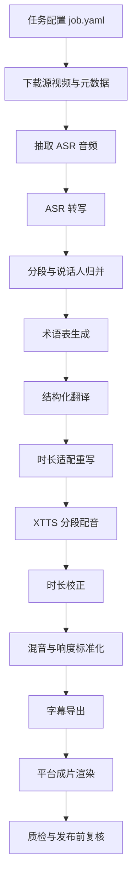

---
tags:
  - youtube
  - bilibili
  - douyin
  - whisper
  - faster-whisper
  - whisperx
  - xtts
  - dubbing
  - mac
  - workflow
  - video-localization
---
# YouTube 科技视频中文配音工作流：mac 落地方案与最佳实践

面向“将已授权的 YouTube 科技视频做中文配音，再分发到 B 站 / 抖音”的场景，整理一套能真正落地的工作流。核心目标不是“跑通几个脚本”，而是把下载、ASR、翻译、配音、时长对齐、混音、渲染、质检、缓存、失败恢复和后续一键化编排都提前设计好。

截至 `2026-04-30` 核对，本文主要依据 `yt-dlp`、`Whisper`、`faster-whisper`、`WhisperX`、`Coqui TTS / XTTS`、`FFmpeg`、`Apple PyTorch MPS` 官方文档整理，并结合适合 `macOS` 的工程实践做了取舍。

说明：

- 本文默认前提是：你对源视频拥有转载、翻译、配音、再分发的合法授权。
- 如果没有源说话人对“声音克隆”的明确许可，最佳实践不是克隆原声，而是改成你自己的固定中文解说声线。
- 本文重点是“工程化流程”，不是单点模型测评，也不是法律意见。

官方地址：

- `yt-dlp`：<https://github.com/yt-dlp/yt-dlp>
- `OpenAI Whisper`：<https://github.com/openai/whisper>
- `faster-whisper`：<https://github.com/SYSTRAN/faster-whisper>
- `WhisperX`：<https://github.com/m-bain/whisperX>
- `Coqui TTS`：<https://docs.coqui.ai/en/latest/installation.html>
- `XTTS`：<https://docs.coqui.ai/en/latest/models/xtts.html>
- `FFmpeg Filters`：<https://ffmpeg.org/ffmpeg-filters.html>
- `Apple PyTorch MPS`：<https://developer.apple.com/metal/pytorch/>
- `CTranslate2 Hardware Support`：<https://opennmt.net/CTranslate2/hardware_support.html>

## 目录

- [Key Takeaways](#key-takeaways)
- [先说红线与边界](#先说红线与边界)
- [目标成品定义](#目标成品定义)
- [推荐总体架构](#推荐总体架构)
- [为什么不是单环境单脚本](#为什么不是单环境单脚本)
- [mac 环境与依赖策略](#mac-环境与依赖策略)
- [工程目录建议](#工程目录建议)
- [完整工作流](#完整工作流)
- [翻译层设计细节](#翻译层设计细节)
- [XTTS 配音层设计细节](#xtts-配音层设计细节)
- [时长对齐与混音策略](#时长对齐与混音策略)
- [B 站与抖音的交付差异](#b-站与抖音的交付差异)
- [一键化 workflow 的推荐设计](#一键化-workflow-的推荐设计)
- [建议的实现顺序](#建议的实现顺序)
- [常见坑](#常见坑)
- [参考来源](#参考来源)

## Key Takeaways

- 在 `mac` 上，最稳的方案不是把所有依赖塞进一个 Python 环境，而是拆成 `controller + ASR + TTS` 三层。
- 你真正要做的是“中文配音生产线”，不是“Whisper + 翻译 + XTTS 三连”。核心难点在于分段、术语一致性、时长约束、缓存和混音。
- `faster-whisper` 适合作为 `mac` 本地默认 ASR；`WhisperX` 适合在你确实需要更准的逐词对齐或多人说话标注时再引入。
- 翻译层不要直接把整段 transcript 扔给大模型，必须做成“带稳定 segment_id 的结构化翻译”。
- XTTS 最佳实践不是整篇一次生成，而是“按 segment 生成 + 缓存 speaker latent + 单段重试”。
- 成片质量的分水岭，不在模型名字，而在这四件事：`术语表`、`时长适配`、`ducking 混音`、`质检闸口`。
- 后续要做一键工作流时，优先做 `可恢复、可跳步、可缓存、可人工复核`，而不是先做 UI。

## 先说红线与边界

### 1. 版权与转载

如果源视频没有授权，技术上即使能做，工程上也不建议自动化放量。你后面一旦做成一键流程，真正扩大的是风险敞口。

最低风险做法：

- 只处理你自己的内容或明确授权内容。
- 保留原视频来源、原作者、授权记录、原始链接和抓取时间。
- 每个任务生成 `license_note.md` 或 `compliance.json`，不要靠脑子记。

### 2. 声音克隆

风险从低到高大致是：

| 方案 | 风险 | 推荐度 |
| --- | --- | --- |
| 使用你自己的中文旁白声线 | 最低 | 最高 |
| 使用授权配音演员声线 | 低 | 高 |
| 克隆原视频说话人的声音且已获许可 | 中 | 视场景 |
| 未经许可克隆原视频说话人的声音 | 高 | 不建议 |

### 3. 平台适配

本文只给工程流程，不展开实时变化的平台具体审核细则。你在真正发布前，仍需要按发布当日的平台规范做最终自查。

## 目标成品定义

你先把“什么叫完成”定义清楚，否则 workflow 会一路返工。

推荐把一个任务的最终产出定义为：

- `中文配音视频`：适配 B 站或抖音的最终 MP4。
- `中文字幕`：`zh.srt` 或 `zh.ass`。
- `项目元数据`：来源链接、原视频信息、任务配置、术语表、模型版本、运行日志。
- `可复用中间产物`：ASR JSON、翻译 JSON、每段 TTS WAV、混音前 WAV。

针对平台的默认成品定义：

| 平台 | 默认画幅 | 典型内容形态 | 交付建议 |
| --- | --- | --- | --- |
| B 站 | `16:9` | 长视频、完整讲解 | 保留完整结构，输出完整中配和字幕 |
| 抖音 | `9:16` 或裁切版 `16:9` | 高密度短切片 | 先做“片段级 workflow”，不要直接全片硬搬 |

## 推荐总体架构



核心原则：

1. 每一步必须有明确输入和输出文件。
2. 每一步都要支持单独重跑。
3. 每一步都要能判断“是否命中缓存”。
4. 人工复核应该插在翻译后、成片前，而不是等发布后。

## 为什么不是单环境单脚本

这是 `mac` 落地时最容易踩的坑。

原因有三个：

1. `Coqui TTS` 官方安装文档当前仍写着 `Python >=3.7 <3.11.0`，而且官方测试环境偏 `Ubuntu`。
2. Apple 官方当前的 `PyTorch MPS` 建议环境是 `Apple Silicon + macOS 14+ + Python 3.10+`。
3. ASR、对齐、说话人分离、TTS 这几类包的依赖树差异很大，硬塞一个环境，后续升级和锁版本会很痛苦。

所以推荐架构是：

| 层 | 作用 | 推荐 Python |
| --- | --- | --- |
| `controller` | 编排、状态、缓存、调用各步骤 | `3.11` |
| `asr` | `faster-whisper` / `WhisperX` / 对齐 / diarization | `3.11` 或 `3.10` |
| `tts` | `XTTS` 推理 | `3.10` |

控制器不直接 import 大模型栈，而是通过子进程调用对应环境里的 CLI 或 worker 脚本。

好处：

- 版本冲突隔离。
- 出问题时容易定位是 `ASR` 还是 `TTS`。
- 未来迁移到远端 GPU 服务器时，控制器层几乎不用大改。

## mac 环境与依赖策略

### 1. 硬件建议

优先级：

- `Apple Silicon Mac`：推荐。
- `Intel Mac`：只建议做原型验证，不建议作为长期批处理机。

实践上建议：

- `16GB RAM`：能做 PoC，但长视频和多任务并发会吃紧。
- `32GB+ RAM`：更适合作为日常开发机。

### 2. 为什么 ASR 默认走 `faster-whisper`

基于官方资料，`faster-whisper` 的核心推理引擎是 `CTranslate2`。`CTranslate2` 官方硬件支持页对预编译二进制明确列出：

- CPU：支持 `x86-64` 和 `AArch64/ARM64`
- GPU：列的是 `NVIDIA GPU`

这意味着在 `mac` 本地，你应该把 `faster-whisper` 规划成“高效 CPU 路径”，不要把它当成 `MPS` GPU 工具来设计。

它仍然适合作为默认选择，因为它相对 `openai/whisper`：

- 更快
- 更省内存
- 支持 `word_timestamps`
- 支持 `vad_filter`

### 3. 为什么 TTS 单独走 `Python 3.10`

这是 `mac` 上最稳的交集：

- `XTTS / Coqui TTS` 文档：`Python >=3.7 <3.11.0`
- Apple `PyTorch MPS` 文档：`Python 3.10 or later`

因此，如果你是 `Apple Silicon`，`TTS` 环境优先用 `Python 3.10`。

### 4. 基础安装

先准备系统依赖：

```bash
xcode-select --install
brew install ffmpeg yt-dlp jq uv
```

说明：

- `yt-dlp` 官方 README 把 `ffmpeg`、`ffprobe`、`yt-dlp-ejs` 和可用的 JavaScript runtime 列为强烈建议依赖。
- 如果遇到 YouTube 抓取兼容问题，优先更新 `yt-dlp`，必要时启用它推荐的 `curl-cffi` 路线或夜版，而不是第一时间怀疑你自己的脚本。

### 5. 推荐环境布局

```bash
mkdir -p ~/workspaces/video-dub-workflow
cd ~/workspaces/video-dub-workflow

uv python install 3.10 3.11

uv venv .venv-controller --python 3.11
uv venv .venv-asr --python 3.11
uv venv .venv-tts --python 3.10
```

建议依赖思路：

- `controller`：`typer`、`rich`、`pydantic`、`orjson`、`pyyaml`
- `asr`：`faster-whisper`、`whisperx`、`ffmpeg-python`、`soundfile`、`librosa`
- `tts`：`TTS==0.22.0`、`torch`、`torchaudio`

实践建议：

- `asr` 环境先只装 `faster-whisper` 跑通，再引入 `whisperx`。
- `tts` 环境先验证单句 `zh-cn` 推理成功，再接入整条流水线。

## 工程目录建议

建议从第一天就按可恢复的工程目录来组织：

```text
video-dub-workflow/
├── config/
│   ├── profiles/
│   │   ├── bilibili.yaml
│   │   └── douyin.yaml
│   └── prompts/
│       ├── glossary.md
│       ├── translate.md
│       └── adapt.md
├── jobs/
│   └── 2026-04-30-demo.yaml
├── refs/
│   ├── narrator_zh/
│   └── speakers/
├── scripts/
│   ├── run_fetch.py
│   ├── run_asr.py
│   ├── run_translate.py
│   ├── run_tts.py
│   ├── run_mix.py
│   └── run_render.py
├── workspace/
│   └── job_20260430_xxx/
│       ├── raw/
│       ├── audio/
│       ├── asr/
│       ├── glossary/
│       ├── translation/
│       ├── tts/
│       ├── mix/
│       ├── subtitles/
│       ├── final/
│       └── logs/
└── manifests/
    └── job_20260430_xxx.json
```

关键原则：

- `workspace/job_xxx/` 下所有产物都与单次任务绑定。
- `refs/` 放长期复用的声音参考。
- `config/profiles/` 放平台和质量预设。
- `manifests/` 存最终可追溯摘要，不要把状态散落在日志里。

## 完整工作流

### 1. 创建任务配置

每次处理一个视频，都先写 `job.yaml`，不要直接命令行裸跑。

推荐字段：

```yaml
job_id: job_20260430_demo
source:
  url: https://www.youtube.com/watch?v=xxxxxxxxxxx
  lang: en
  license_note: 已授权，允许翻译与二次分发
target:
  language: zh-cn
  platforms: [bilibili, douyin]
voice:
  mode: narrator
  reference_wavs:
    - refs/narrator_zh/ref_01.wav
  clone_original_voice: false
asr:
  engine: faster-whisper
  model: turbo
  word_timestamps: true
  vad_filter: true
  diarization: false
translate:
  provider: openai-compatible
  model: configurable
  target_cps_min: 3.5
  target_cps_max: 4.8
tts:
  engine: xtts_v2
  language: zh-cn
  split_sentences: false
mix:
  ducking: true
  target_lufs: -16
render:
  bilibili:
    aspect: 16:9
    resolution: 1920x1080
  douyin:
    aspect: 9:16
    resolution: 1080x1920
```

说明：

- `source.lang` 不要省，已知源语言就显式写出来。
- `clone_original_voice` 单独设标志位，方便把伦理/授权逻辑前置。
- `target_cps_*` 放在翻译配置里，而不是 TTS 层。

### 2. 下载源视频与元数据

推荐目标不是只下载 `mp4`，而是同时归档元数据。

推荐命令：

```bash
yt-dlp \
  --write-info-json \
  --write-description \
  --write-thumbnail \
  -f "bv*+ba/b" \
  --merge-output-format mp4 \
  -o "workspace/job_20260430_demo/raw/%(id)s/%(title).200B.%(ext)s" \
  "https://www.youtube.com/watch?v=xxxxxxxxxxx"
```

最佳实践：

- 同步保存 `info.json`，后面做标题、简介、术语提取会用到。
- 原始下载文件不要覆盖，后续所有转码都另存。
- 抓取失败先做三件事：更新 `yt-dlp`、检查 cookies、检查网络兼容。

如果必须使用浏览器登录态，`yt-dlp` 支持：

```bash
yt-dlp --cookies-from-browser safari "URL"
```

但注意：

- 绝不要把 cookies 导出文件提交到 Git。
- 只在本地临时使用。
- workflow 中把这类凭证路径做成环境变量。

### 3. 抽取两份音频

不要只抽一份音频。推荐至少两份：

1. `ASR` 用：`16k mono wav`
2. `混音` 用：`48k stereo wav`

命令示例：

```bash
ffmpeg -y -i source.mp4 -vn -ac 1 -ar 16000 audio/asr_input.wav
ffmpeg -y -i source.mp4 -vn -ac 2 -ar 48000 audio/mix_input.wav
```

原因：

- `ASR` 更关心识别稳定性和速度。
- 混音更关心保真，不应该直接复用低采样率单声道文件。

### 4. ASR：默认用 `faster-whisper`

#### 推荐策略

| 场景 | 推荐 |
| --- | --- |
| 单人讲解、音质不错、先求稳定跑通 | `faster-whisper` |
| 需要更准的逐词时间对齐 | `WhisperX` |
| 访谈 / 播客 / 多说话人 | `WhisperX + diarization` |

#### 为什么不是直接用原版 Whisper 作为生产默认值

`OpenAI Whisper` 当然能用，但在生产流程里它更像基线：

- 原版 README 说明它的 `transcribe()` 是按滑动 `30s` 窗口跑。
- `WhisperX` README 明确指出原版 Whisper 的时间戳是 utterance 级，可能偏移数秒，而且不原生支持 batching。

所以在工程上更推荐：

- 本地默认：`faster-whisper`
- 需要更准对齐时：`WhisperX`

#### `faster-whisper` 默认建议

- `model=turbo`：英语科技视频的本地默认值，先追求速度。
- `model=large-v3`：口音重、背景复杂、专有名词多时再上。
- `word_timestamps=true`
- `vad_filter=true`
- `beam_size=5`

输出产物建议：

- `asr_segments.raw.json`
- `asr_words.raw.json`
- `language.json`

最小输出结构建议：

```json
{
  "segment_id": "s_000123",
  "speaker": "spk_00",
  "start": 123.45,
  "end": 126.20,
  "text": "So today we are going to benchmark this new GPU.",
  "words": [
    {"word": "So", "start": 123.45, "end": 123.60},
    {"word": "today", "start": 123.60, "end": 123.92}
  ]
}
```

### 5. 需要更精准时再接 `WhisperX`

`WhisperX` 适合做这些事：

- 更准确的逐词对齐
- 多说话人分段
- 用 `pyannote` 做 speaker diarization

但在 `mac` 上不要一上来就把它当默认依赖，因为：

- 依赖更多
- 配置更复杂
- 只有在多人说话、字幕对齐要求更高时收益明显

建议工作流是：

1. 先用 `faster-whisper` 得到稳定 transcript。
2. 如果任务标签为 `multi_speaker=true` 或 `tight_timing=true`，再跑 `WhisperX` 补齐对齐与 speaker label。

补充：

- `WhisperX` 官方说明里，启用 speaker diarization 需要 `Hugging Face` 的 `read token`，并接受对应 diarization 模型的使用协议。
- 所以 diarization 不要做成默认强依赖，而要做成按任务开启的增强步骤。

### 6. ASR 后不要直接翻译，先做“配音分段”

这是很多方案最容易省略、但最关键的一步。

ASR 分段不等于 TTS 分段，也不等于字幕分段。

推荐在翻译前做一次中间归并：

- 按标点切分
- 按停顿切分
- 按说话人切分
- 按目标时长切分

推荐起始阈值：

| 规则 | 建议 |
| --- | --- |
| 最短片段 | `0.8s` |
| 目标片段长度 | `2.0s ~ 4.5s` |
| 软上限 | `6.0s` |
| 说话人变更 | 强制切段 |
| 长停顿 | `> 350ms` 优先切段 |

额外建议：

- `uh`、`you know`、`kind of` 这类口头填充词，可在“中配脚本”中适度压缩。
- 命令、包名、产品名、公司名不要在这一步动。

## 翻译层设计细节

### 1. 翻译层的核心目标

不是“翻得通顺”，而是同时满足：

- 术语正确
- 段落映射稳定
- 适合中文口播
- 时长能卡进原时间窗

### 2. 推荐两段式翻译

#### 第一段：术语表提取

输入：

- 视频标题
- 视频简介
- transcript 前 `10%`
- 你手工补的关键术语

输出：

- `glossary.manual.json`
- `glossary.auto.json`
- `glossary.final.json`

推荐术语表字段：

```json
{
  "term": "GPU",
  "translation": "GPU",
  "reading": "吉皮优",
  "policy": "keep_en",
  "note": "保留英文，不翻成图形处理器"
}
```

#### 第二段：结构化翻译

不要让大模型返回一整段文本，必须强制结构化。

输入单位是“已分好的 segment 列表”，输出也必须是“同样的 segment 列表”。

推荐输出字段：

```json
{
  "segment_id": "s_000123",
  "source": "So today we are going to benchmark this new GPU.",
  "zh_literal": "所以今天我们要测试这块新的 GPU。",
  "zh_dub": "今天我们来测一测这块新的 GPU。",
  "speaker": "spk_00",
  "duration_sec": 2.75,
  "estimated_cps": 4.36,
  "review_flag": false,
  "review_note": ""
}
```

这里至少保留两版：

- `zh_literal`：偏忠实
- `zh_dub`：偏中文口播

后续 TTS 只读 `zh_dub`。

### 3. 翻译 prompt 的约束原则

必须显式写进系统提示词：

- 不改变 `segment_id`
- 不合并 segment
- 不拆分 segment
- 产品名、库名、API、命令行、路径、URL 优先保留英文
- 数字、单位、年份要按中文口播习惯做归一化
- 中文文风偏科技视频讲解，不要生硬书面腔
- 如果超出时长预算，优先压缩措辞，而不是丢信息点

### 4. 用“字符速度”而不是“字符总数”约束时长

给大模型一个可计算目标，比只说“别太长”有效得多。

建议起始值：

- 目标中文语速：`3.5 ~ 4.8` 汉字/秒
- `> 5.2`：标记为高风险
- `> 5.5`：强制人工复核

举例：

- 片段时长 `2.5s`
- 目标上限 `4.8 cps`
- 则建议中文正文控制在 `12` 字左右，最多不要显著超过

### 5. 翻译后自动 QA

在进入 TTS 前，至少跑这几个检查：

- 是否存在 `segment_id` 丢失或顺序错乱
- 是否有空翻译
- 是否有括号、引号未闭合
- 是否有术语表违例
- 是否有 `estimated_cps` 超阈值
- 是否有明显过长英文 token 未处理

这个 QA 结果建议输出为：

- `translation/qa_report.json`
- `translation/review_queue.csv`

## XTTS 配音层设计细节

### 1. XTTS 在这套方案里的定位

XTTS 适合做：

- 多语言中文语音生成
- 跨语言声音克隆
- 用单条或多条参考音频克隆说话风格

官方 XTTS 文档中对 `zh-cn` 有明确支持；同时说明：

- 可用单条参考音频克隆
- 也可用多条参考音频克隆
- `speed` 参数偏离 `1.0` 太远时可能出 artifact
- 同一说话人的 `gpt_cond_latent` 与 `speaker_embedding` 可以缓存复用

这几点对 workflow 很重要。

### 2. 声音策略推荐

优先级建议：

1. `narrator`：固定中文旁白，最稳。
2. `clone_per_video`：每个视频一个声线，适合单人讲解。
3. `clone_per_speaker`：按说话人分别配音，适合访谈/播客，但工程复杂度大幅增加。

如果你第一版就要做批处理，建议先上：

- 单人英语科技视频
- 固定中文旁白
- 不做原声克隆

这样最快得到稳定产出。

### 3. 参考音频收集规范

单个声线建议准备 `10s ~ 30s` 的干净参考音频，要求：

- 只有一个人说话
- 无背景音乐
- 无混响、无键盘噪音、无切口
- 同一套麦克风和环境

如果使用多条参考：

- 尽量保持同一人、同一声线状态
- 不要混不同麦克风质感

### 4. 文本归一化不要省

在送 XTTS 之前，建议专门做一层 `text_normalizer`：

- `2026` -> `二零二六` 或 `2026 年`
- `GPU` / `CPU` / `API` / `CLI` -> 根据术语策略保留英文或转口播读法
- `v2.1.0` -> `v two point one point zero` 还是 “二点一零”，要统一
- `/usr/local/bin` 这类路径不要直接让配音念出来，必要时改写
- URL、邮箱、代码块一般不要做全量口播

建议把规则分三层：

1. 全局规则
2. 术语表规则
3. 视频级手工覆写

### 5. XTTS 执行方式

最佳实践是“按 segment 合成”，不是整篇一次性合成。

原因：

- 单段失败可重试
- 时长超限只重做单段
- 同一句变更不影响全片
- 更容易缓存

建议缓存 key：

`hash(speaker_id + text + reference_hash + model_name + model_version + params)`

这样同一句和同一声线不会重复合成。

### 6. XTTS 的推荐调用方式

如果只是做工程集成，优先用高层 API 或 CLI，而不是一开始就深入 model API。

更稳的做法是直接按官方 `tts_to_file` 风格封装成 worker：

```python
from TTS.api import TTS

tts = TTS("tts_models/multilingual/multi-dataset/xtts_v2", gpu=True)
tts.tts_to_file(
    text="今天我们来测一测这块新的 GPU。",
    speaker_wav=["refs/narrator_zh/ref_01.wav"],
    language="zh-cn",
    file_path="workspace/job_20260430_demo/tts/s_000123.wav",
    split_sentences=False,
)
```

说明：

- 这里的 `gpu=True` 只是接口形态示意，具体在 `mac` 上走 `MPS` 还是回落 CPU，取决于你实际封装时的设备检测策略。
- 如果只是做首版 MVP，先让它稳定跑在单机可接受速度上，比一开始纠结极限性能更重要。

如果你后面要做提速，才值得进一步下沉到 model API，把：

- `gpt_cond_latent`
- `speaker_embedding`

缓存起来，避免每个 segment 都重新算参考音频条件向量。

## 时长对齐与混音策略

### 1. 先做文本适配，再做音频微调

推荐顺序：

1. 先让翻译文本尽量贴近时长窗口
2. 再生成 TTS
3. 最后只做小幅时间拉伸

不要反过来靠大幅拉伸去救文本，因为自然度会明显下降。

### 2. 推荐的时长误差处理规则

定义：

- `slot_duration = 原片段时长`
- `tts_duration = 合成语音时长`
- `ratio = tts_duration / slot_duration`

建议处理逻辑：

| 偏差 | 处理 |
| --- | --- |
| `0.92 ~ 1.08` | 直接使用 |
| `1.08 ~ 1.20` | 先让 LLM 压缩句子，再重合成 |
| `0.80 ~ 0.92` | 适度补停顿或轻微放慢 |
| `> 1.20` 或 `< 0.80` | 强制人工复核 |

### 3. 音频时间拉伸

`FFmpeg` 里有两条常用路径：

- `atempo`
- `rubberband`

适用建议：

- 小幅调整：`atempo`
- 更在意自然度：优先 `rubberband`

`FFmpeg` 文档里：

- `atempo` 支持 `0.5 ~ 100.0`
- 当 `tempo > 2` 时会跳样，必要时要链式调用
- `rubberband` 用于 time-stretching / pitch-shifting，但依赖你的 FFmpeg build 启用 `librubberband`

所以最佳实践是：

- 默认把单段修正控制在 `±8%` 内
- `rubberband` 可用时优先它
- `XTTS speed` 参数不要大幅偏离 `1.0`
- 本机先执行 `ffmpeg -filters | rg rubberband`，确认你的 FFmpeg build 是否带该滤镜

### 4. 混音建议：不要暴力静音原音轨

如果没有分离好的无对白底噪轨，直接把原音轨整段静音，成片会很假。

更稳的做法是：

1. 保留原视频环境声 / 轻音乐底
2. 在中文配音出现时压低原始音轨
3. 在无说话间隙恢复一点原音氛围

`FFmpeg` 的 `sidechaincompress` 非常适合做 ducking：

- 主轨：原始背景音轨
- sidechain：中文配音轨

思路是“中文配音一响，背景音自动被压低”。

### 5. 最终响度标准化

最终成片不要靠耳朵猜音量，至少做一次响度标准化。

`FFmpeg` 的 `loudnorm` 支持：

- `EBU R128`
- 单通道或双通道流程
- 单 pass / 双 pass

官方 `ebur128` 说明里也提到：在线发布内容通常会偏好 `-16 LUFS`。

因此可以把最终成片的默认目标设成：

- `I=-16`

其余参数可按你后续测试再细调。

## B 站与抖音的交付差异

### B 站

优先保留：

- 原视频结构
- 完整论述逻辑
- 中文字幕
- 全流程中配

推荐成品：

- `1920x1080`
- `16:9`
- 完整 `zh.srt`

### 抖音

更适合先做“片段工作流”：

- 从完整 transcript 中切主题高峰片段
- 重写为更短、更直接、更快的信息密度
- 单独做 `9:16` 版本

也就是说：

- B 站适合“整片中配”
- 抖音更适合“切片中配”

如果你后续真要做批量发布，建议把抖音视为另一条 render profile，而不是 B 站导出时顺手多存一个格式。

## 一键化 workflow 的推荐设计

### 1. 命令设计

推荐用“可跳步 CLI”，不要只做一个大而全的 `main.py`。

例如：

```bash
dubflow fetch jobs/demo.yaml
dubflow asr jobs/demo.yaml
dubflow translate jobs/demo.yaml
dubflow tts jobs/demo.yaml
dubflow mix jobs/demo.yaml
dubflow render jobs/demo.yaml --profile bilibili
dubflow run jobs/demo.yaml --resume
```

### 2. 每一步的统一契约

每一步都统一返回：

- `status`
- `inputs`
- `outputs`
- `duration`
- `cache_hit`
- `error_message`

并写入 `manifest.json`。

### 3. 失败恢复

强烈建议每个 stage 都支持：

- `--resume`
- `--force`
- `--from-stage`
- `--to-stage`

这比先做 Web UI 有价值得多。

### 4. 人工复核点

推荐至少两个闸口：

1. 翻译完成后
2. 成片渲染后

第一闸口看：

- 术语
- 口语化程度
- 时长风险

第二闸口看：

- 音画同步
- 发音问题
- 背景音压制是否自然

### 5. 缓存策略

缓存应该按阶段分层：

| 阶段 | 缓存 key |
| --- | --- |
| 下载 | `source_url + yt_dlp_version` |
| ASR | `audio_hash + asr_engine + model + params` |
| 翻译 | `segments_hash + glossary_hash + prompt_hash + model` |
| TTS | `text_hash + speaker_hash + tts_model + params` |
| 混音 | `tts_hash + bgm_hash + mix_profile` |

### 6. 后续可扩展的能力

把这几个点提前预留出来，后面就不需要大改：

- 远端 GPU worker
- 多任务队列
- 人工审核面板
- 术语库长期记忆
- 多平台 render profile
- 多声线模板

## 建议的实现顺序

### Phase 1：先做最小闭环

范围：

- 单人英语科技视频
- 固定中文旁白
- `faster-whisper`
- 结构化翻译
- `XTTS`
- `B 站 16:9`

先不做：

- 多人说话
- 原声克隆
- 抖音 `9:16`
- 复杂人声分离

### Phase 2：增强质量

加入：

- `WhisperX` 对齐
- 术语表 QA
- 每段时长风险重写
- ducking 混音
- `loudnorm`

### Phase 3：增强生产性

加入：

- 批量任务队列
- 缓存与恢复
- review queue
- 抖音切片 render profile

## 常见坑

- 直接把整段 transcript 送翻译，结果 segment 映射全乱。
- 只保留 SRT，不保留词级时间戳，后面根本做不好时长控制。
- 让 XTTS 一次生成整篇，任何一句变动都得全片重做。
- 没有术语表，`API`、`agent`、`inference`、`benchmark` 前后翻译不一致。
- 过度依赖 XTTS 自身速度参数去救超时长文本，最后自然度崩掉。
- 只生成 `16k mono` 音频，最后混音发虚。
- 没有缓存和 `--resume`，一个阶段失败就从头跑。
- 在 `mac` 上强行一个环境装完所有包，最后版本锁不住。
- 未经许可直接克隆原说话人声音，把技术问题做成合规问题。

## 参考来源

- `yt-dlp` 官方 README 提到：`ffmpeg` / `ffprobe` 是合并音视频与后处理所需的重要依赖，`yt-dlp-ejs` 和 JavaScript runtime 对完整 YouTube 支持也很重要：<https://github.com/yt-dlp/yt-dlp>
- `yt-dlp` 官方 README 还记录了 `--cookies-from-browser` 能读取包括 `safari` 在内的浏览器 cookies：<https://github.com/yt-dlp/yt-dlp>
- `OpenAI Whisper` 官方 README 说明了安装依赖、`ffmpeg` 要求、模型规格，以及默认 `transcribe()` 的工作方式：<https://github.com/openai/whisper/blob/main/README.md>
- `faster-whisper` 官方 README 说明其基于 `CTranslate2`，相较原版 Whisper 更快、更省内存，并支持 `word_timestamps` 与 `vad_filter`：<https://github.com/SYSTRAN/faster-whisper>
- `WhisperX` 官方 README 说明其提供更精确的词级时间戳、VAD 预处理与说话人分离：<https://github.com/m-bain/whisperX>
- `CTranslate2` 官方硬件支持页表明预编译二进制 CPU 支持 `AArch64/ARM64`，GPU 支持明确列的是 `NVIDIA GPU`：<https://opennmt.net/CTranslate2/hardware_support.html>
- `Coqui TTS` 官方安装页当前写明 `Python >=3.7 <3.11.0`，且测试环境偏 Ubuntu：<https://docs.coqui.ai/en/latest/installation.html>
- `XTTS` 官方文档说明了 `zh-cn` 支持、单条/多条参考音频克隆、`speed` 参数、以及可缓存说话人条件向量：<https://docs.coqui.ai/en/latest/models/xtts.html>
- `Apple PyTorch MPS` 官方文档当前要求 `Apple silicon + macOS 14.0+ + Python 3.10+`：<https://developer.apple.com/metal/pytorch/>
- `FFmpeg` 官方 filters 文档记录了 `atempo`、`rubberband`、`sidechaincompress`、`loudnorm`、`speechnorm` 等关键音频处理能力：<https://ffmpeg.org/ffmpeg-filters.html>
