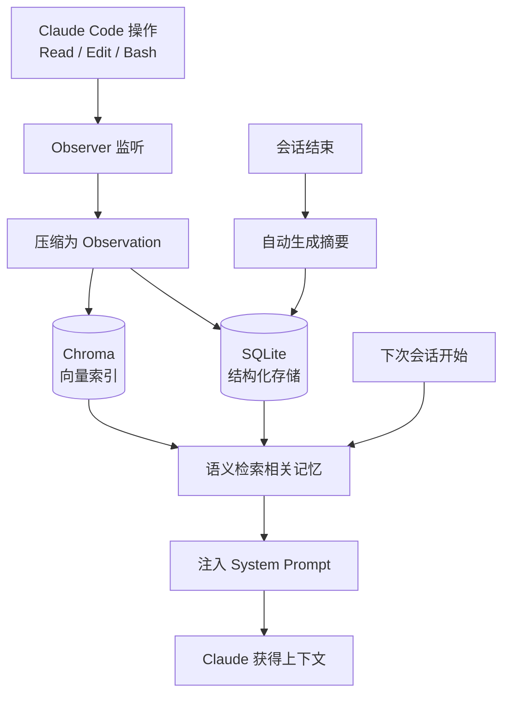

# claude-mem 自动记忆系统

> 一个为 Claude Code 提供跨会话记忆能力的后台插件——自动观察你的操作，压缩为结构化记忆，在下次会话时注入相关上下文，让你不再需要重复解释代码库。

## 目录

- [核心要点](#核心要点)
- [是什么](#是什么)
- [核心机制](#核心机制)
- [数据存储](#数据存储)
- [可用命令](#可用命令)
- [生效时机](#生效时机)
- [安装](#安装)
- [最佳实践](#最佳实践)
- [关联](#关联)
- [参考来源](#参考来源)

## 核心要点

1. **后台全自动**：无需手动操作，worker 守护进程持续运行
2. **操作即记忆**：每次 Read / Edit / Bash 被压缩为 observation，存入 SQLite + Chroma 向量索引
3. **跨会话注入**：第二次及以后打开项目时，相关记忆自动注入 system prompt
4. **语义检索**：基于 Chroma 向量索引，检索与当前上下文语义相关的历史记忆
5. **会话级总结**：每次会话结束时自动生成摘要
6. **首次不注入**：第一次在项目中使用只播种记忆，不注入——第二次才开始生效
7. **可选全量扫描**：`/learn-codebase` 可一次性将整个代码库写入记忆（约 5 分钟）

## 是什么

claude-mem 是一个 **Claude Code 插件形式的自动记忆系统**。它监听 Claude Code 的每一次工具调用（Read、Edit、Bash），将这些操作压缩为"观察记录"（observation），在会话结束时自动总结。下次你在同一个项目中打开会话时，相关的历史记忆会被自动检索并注入到 system prompt 中。

**解决的问题**：
- 每次新会话都要重新解释项目结构和历史决策
- 跨会话的上下文丢失
- 团队协作时知识无法沉淀

**GitHub**：[thedotmack/claude-mem](https://github.com/thedotmack/claude-mem)

## 核心机制



**流程说明**：

1. **采集阶段**：Observer 监听每一次工具调用，将操作内容压缩为结构化 observation
2. **存储阶段**：observation 同时写入 SQLite（精确查询）和 Chroma（语义检索）
3. **总结阶段**：会话结束时自动生成摘要，归档关键决策和发现
4. **注入阶段**：新会话开始时，基于项目上下文进行语义检索，将相关记忆注入 prompt

## 数据存储

所有数据存储在 `~/.claude-mem/` 目录下：

```
~/.claude-mem/
├── claude-mem.db          # SQLite 主数据库
├── chroma/                # Chroma 向量索引（语义检索）
│   └── chroma.sqlite3     # 向量存储
├── logs/                  # 运行日志（按日滚动）
├── observer-sessions/     # 会话观察记录
├── backups/               # 升级前自动备份
├── settings.json          # 插件配置文件
├── supervisor.json        # 守护进程状态
└── worker.pid             # 后台 worker 进程 PID
```

| 组件 | 用途 | 技术 |
|------|------|------|
| `claude-mem.db` | 结构化存储 observations、会话、摘要 | SQLite |
| `chroma/` | 语义向量索引，支持相似度检索 | Chroma（向量数据库） |
| `observer-sessions/` | 原始会话观察记录 | JSON/文件 |
| `supervisor.json` + `worker.pid` | 后台守护进程管理 | 进程管理 |

## 可用命令

| 命令 | 用途 | 说明 |
|------|------|------|
| `/learn-codebase` | 全量扫描代码库 | 一次性将整个仓库写入记忆，约 5 分钟，可选 |
| `/mem-search` | 搜索已有记忆 | 按关键词或语义检索历史 observations |
| `/standup` | 站会报告 | 基于近期工作自动生成每日站会报告 |
| `/weekly-digests` | 周报生成 | 汇总一周工作内容 |
| `/timeline-report` | 时间线报告 | 按时间线梳理工作进展 |
| `/do` | 任务跟踪 | 追踪和管理开发任务 |
| `/smart-explore` | 智能代码探索 | 结合记忆进行代码库探索 |
| `/pathfinder` | 代码路径追踪 | 追踪代码执行路径和依赖关系 |
| `/design-is` | 设计文档辅助 | 辅助编写和整理设计文档 |
| `/make-plan` | 制定计划 | 基于历史记忆辅助制定开发计划 |

> 除 `/learn-codebase` 外，其余命令均依赖已积累的记忆数据，在首次使用项目中效果有限。

## 生效时机

| 使用次数 | 行为 |
|----------|------|
| **第 1 次** | 仅播种记忆（seed），不注入上下文 |
| **第 2 次及以后** | 自动检索并注入前次会话的相关记忆到 system prompt |

**特点**：
- 全程后台运行，无需手动触发
- worker 守护进程持续监控，会话结束后自动总结
- 可通过 `http://localhost:37701` 查看实时活动状态

## 安装

```bash
# 在 Claude Code 中添加插件
claude plugins add thedotmack/claude-mem
```

安装后自动启动 worker 守护进程，无需额外配置即可使用。

## 最佳实践

> [!tip] 让记忆更有效

1. **第一次使用建议运行 `/learn-codebase`**：虽然可选，但提前播种整个代码库能让后续检索更准确
2. **保持有意义的提交信息**：claude-mem 会关联 git 上下文，清晰的提交信息有助于记忆组织
3. **定期查阅记忆**：偶尔用 `/mem-search` 回顾，确认记忆质量
4. **会话结束时让 Claude 自然结束**：不要强制中断，确保总结阶段正常执行

> [!warning] 注意事项

- 记忆数据存储在本地（`~/.claude-mem/`），不会上传到云端
- 首次会话不会注入记忆，这是设计如此——需要至少一个会话的积累
- Chroma 向量索引会随记忆增长而增大，定期关注磁盘占用

## 关联

- [[Claude Code CLI 安装配置命令与最佳实践]] — Claude Code 主工具指南
- [[Superpowers 安装使用与 AI 编程工作流实践指南]] — Superpowers 插件系统（claude-mem 是其生态的一部分）
- [[gstack 概述与使用指南]] — gstack 开发工作流技能套件

## 参考来源

- GitHub: [thedotmack/claude-mem](https://github.com/thedotmack/claude-mem)
- claude-mem 内置文档：`/how-it-works`
