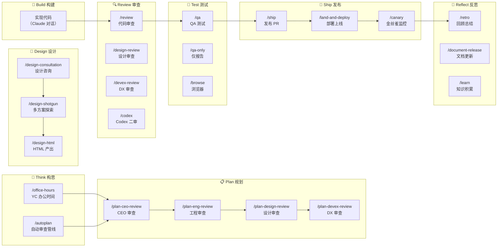
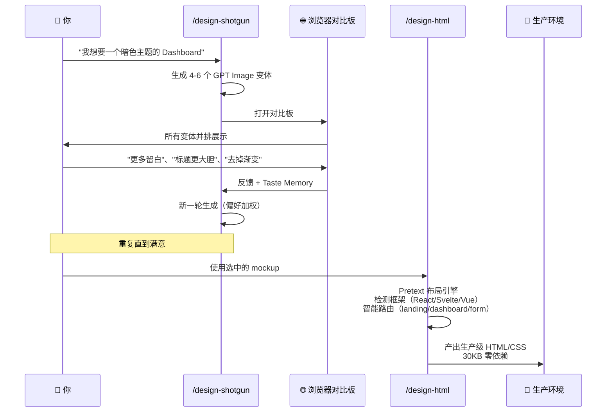

# gstack — AI 编程的虚拟工程团队

## Key Takeaways

- **gstack 不是工具集，是流程**：它把 Claude Code 从一个"写代码的实习生"规训为一个有着严密工业级标准的虚拟工程团队（CEO、Eng Manager、Designer、QA、CSO、Release Engineer...）
- **Think → Plan → Build → Review → Test → Ship → Reflect**：完整的 Sprint 工作流，每个环节的输出自动成为下一环节的输入，不遗漏任何步骤
- **Garry Tan 的真实提效数据**：2026 年逻辑代码变更率是 2013 年的 **~810×**，YTD 产出已达 2013 全年的 **240×**（排除一个 demo 仓库后，覆盖 40 个 public+private 仓库）
- **23+ 专家角色 + 8+ 强力工具**：全部通过 `/slash-command` 调用，纯 Markdown 编写，MIT 开源
- **支持 10 种 AI 编程 Agent**：Claude Code、OpenAI Codex CLI、OpenCode、Cursor、Factory Droid、Slate、Kiro、Hermes、GBrain、OpenClaw
- **并行 Sprint 能力**：配合 Conductor 可同时运行 10-15 个并行 Sprint，每个在独立隔离的工作空间中
- **真正的浏览器交互**：内置 GStack Browser（Chromium），反机器人检测，侧边栏 AI 助手，防 prompt injection 多层防御
- **设计管线是核心差异**：`/design-shotgun` 生成多方案对比板 → `/design-html` 产出生产级 HTML（Pretext 计算布局，30KB 零依赖）

---

## 目录

1. [概述：gstack 是什么](#概述gstack-是什么)
2. [核心理念：不只是工具，是工程团队](#核心理念不只是工具是工程团队)
3. [Sprint 工作流](#sprint-工作流)
4. [23 位专家角色详解](#23-位专家角色详解)
5. [8 大强力工具](#8-大强力工具)
6. [安装与配置](#安装与配置)
7. [使用示例：从想法到 PR](#使用示例从想法到-pr)
8. [并行 Sprint 与 Conductor](#并行-sprint-与-conductor)
9. [GBrain：持久化知识库](#gbrain持久化知识库)
10. [设计管线：Shotgun → HTML](#设计管线shotgun--html)
11. [安全机制](#安全机制)
12. [多平台支持](#多平台支持)
13. [与 Superpowers 的对比](#与-superpowers-的对比)
14. [常见问题排查](#常见问题排查)
15. [参考来源](#参考来源)

---

## 概述：gstack 是什么

**gstack** 是 [Garry Tan](https://x.com/garrytan)（Y Combinator 总裁兼 CEO）开源的一套 **AI 编程 Agent 技能框架**。它的核心定位是：

> 将 Claude Code 从单一 AI 编程助手，转化为一支由 23+ 专家角色组成的虚拟工程团队。

gstack 覆盖软件开发的完整生命周期——从产品构思（`/office-hours`）、架构设计（`/plan-eng-review`）、UI 设计（`/design-shotgun`）、编码实现、代码审查（`/review`）、QA 测试（`/qa`）、安全审计（`/cso`）、到发布上线（`/ship`、`/land-and-deploy`）——全部通过 `/slash-command` 在对话中触发。

```mermaid
flowchart TD
    subgraph 传统模式
        A1[写 Prompt] --> A2[Claude 直接改代码] --> A3[手动检查] --> A4[❓ 有没有遗漏？]
    end

    subgraph gstack 模式
        B1["/office-hours<br/>产品构思"] --> B2["/plan-ceo-review<br/>CEO 审查"]
        B2 --> B3["/plan-eng-review<br/>架构设计"]
        B3 --> B4["实现代码"]
        B4 --> B5["/review<br/>代码审查"]
        B5 --> B6["/qa<br/>浏览器测试"]
        B6 --> B7["/cso<br/>安全审计"]
        B7 --> B8["/ship<br/>发布 PR"]
        B8 --> B9["/land-and-deploy<br/>部署上线"]
        B9 --> B10["/canary<br/>生产监控"]
        B10 --> B11["/retro<br/>回顾总结"]
    end

    style B1 fill:#4CAF50,color:#fff
    style B2 fill:#2196F3,color:#fff
    style B3 fill:#FF9800,color:#fff
    style B5 fill:#9C27B0,color:#fff
    style B8 fill:#E91E63,color:#fff
```



### 关键数字

| 指标 | 数据 |
|------|------|
| 作者 | Garry Tan（YC President & CEO） |
| 开源协议 | MIT |
| 技能数量 | 23+ 专家角色 + 8+ 强力工具 |
| 支持 Agent 平台 | 10 种（Claude Code, Codex CLI, OpenCode, Cursor, Factory, Slate, Kiro, Hermes, GBrain, OpenClaw） |
| 安装时间 | ~30 秒 |
| 并行 Sprint 能力 | 10-15 个（配合 Conductor） |
| 2026 产出对比 2013 | ~810× 逻辑代码变更率，240× 全年产出（YTD） |

---

## 核心理念：不只是工具，是工程团队

### gstack 的本质：流程 > 工具

gstack 的设计哲学是 **"process over tools"**——它不是随意堆砌的技能集合，而是一条精心设计的软件工程流水线：

1. **每个技能的输出是下一个技能的输入**——`/office-hours` 产出的设计文档 → `/plan-ceo-review` 读取 → `/plan-eng-review` 生成测试计划 → `/qa` 自动拾取
2. **不遗漏任何步骤**——每个环节都知道前面发生了什么
3. **标准化专家角色**——不是让 AI "试着做好"，而是让 AI 以特定专家视角审视代码

### 目标用户

| 用户画像 | 为什么适合 |
|----------|-----------|
| **技术创始人/CEO** | 想保持 coding 能力但时间有限，需要杠杆效应 |
| **初次使用 Claude Code 的开发者** | 结构化角色比空白 prompt 更易上手 |
| **Tech Lead / Staff Engineer** | 每个 PR 都有严格的 review、QA、发布自动化 |
| **独立开发者/Solo Founder** | 一个人具备整个团队的能力 |

### Andrej Karpathy 的四个失败模式？已在框架中解决

gstack 的设计直接回应了 Karpathy 总结的 AI 编程四大失败模式：

| Karpathy 失败模式 | gstack 如何解决 |
|-------------------|-----------------|
| **错误假设**（Wrong assumptions） | `/office-hours` 在写代码前强制把假设摊开 |
| **过度复杂**（Overcomplexity） | `/review` 捕捉不必要的复杂性和过度设计 |
| **正交编辑**（Orthogonal edits） | `/freeze` 锁定编辑范围，防止"顺手改"无关代码 |
| **命令式而非声明式**（Imperative over declarative） | `/ship` 将任务转化为可验证的目标，测试先行 |

---

## Sprint 工作流

gstack 的核心结构就是一个完整的 Sprint 流程：

```
Think → Plan → Build → Review → Test → Ship → Reflect
```

### 完整技能地图



---

## 23 位专家角色详解

### Think 层——构思与规划

| 技能 | 角色 | 核心能力 |
|------|------|---------|
| `/office-hours` | **YC 办公时间** | 6 个强制性问题重构你的产品思路。挑战你的 framing、推翻错误前提、生成多种实现方案。产出设计文档输入后续所有环节。 |
| `/autoplan` | **自动审查管线** | 一键运行 CEO → Design → Eng → DX 全流程审查。自动决策（6 个决策原则），仅将审美/品味决策留给用户批准。 |
| `/spec` | **Spec 作者** | 5 阶段将模糊意图转为精确可执行 spec（why → scope → technical → draft → file）。Codex 质量门禁（<7/10 阻止落盘），密钥自动脱敏，与已有 issue 去重。 |

### Plan 层——四种审查视角

| 技能 | 角色 | 审查维度 |
|------|------|---------|
| `/plan-ceo-review` | **CEO / Founder** | 重新思考问题。四种模式：Expansion（扩展）、Selective Expansion（选择性扩展）、Hold Scope（保持范围）、Reduction（缩减）。找出隐藏在需求背后的 10 星产品。 |
| `/plan-eng-review` | **Eng Manager** | 锁定架构、数据流、状态机、边缘案例和测试矩阵。用 ASCII 图将隐藏假设摊开。 |
| `/plan-design-review` | **Senior Designer** | 每个设计维度 0-10 评分，解释什么是 10 分。AI Slop 检测。交互式——每个设计选择一个 AskUserQuestion。 |
| `/plan-devex-review` | **DX Lead** | 探索开发者画像，对标竞品 TTHW（Time to Hello World），设计魔法时刻，逐步骤追踪摩擦点。三种模式：DX EXPANSION / DX POLISH / DX TRIAGE。20-45 个强制性问题。 |

### Design 层——设计管线

| 技能 | 角色 | 核心能力 |
|------|------|---------|
| `/design-consultation` | **Design Partner** | 从零构建设计系统。研究领域现状、提出创意风险、生成逼真产品 mockup。输出 `DESIGN.md`。 |
| `/design-shotgun` | **Design Explorer** | 一次生成 4-6 个 AI mockup 变体，在浏览器中打开对比板，收集反馈后迭代。Taste Memory 学习你的偏好。可多轮迭代直到满意。 |
| `/design-html` | **Design Engineer** | 将 mockup 转为生产级 HTML/CSS。Pretext 计算布局——文本真正 reflow，高度自适应。30KB 零依赖。自动检测 React/Svelte/Vue 框架。智能 API 路由区分 landing page / dashboard / form。输出是可发布的，不是 demo。 |
| `/design-review` | **Designer Who Codes** | 与 `/plan-design-review` 相同的审计，但然后修复发现的问题。Atomic commits，before/after 截图。 |

### Review 层——质量把关

| 技能 | 角色 | 核心能力 |
|------|------|---------|
| `/review` | **Staff Engineer** | 找到通过 CI 但在生产环境爆炸的 bug。自动修复明显的。标记完整性缺口。 |
| `/devex-review` | **DX Tester** | 实时 DX 审计——实际测试你的 onboarding 流程、计时 TTHW、截图错误。与 `/plan-devex-review` 对照——验证计划是否匹配现实。 |

### Test 层——测试验证

| 技能 | 角色 | 核心能力 |
|------|------|---------|
| `/qa` | **QA Lead** | 在真实浏览器中测试应用、发现 bug、atomic commit 修复、重新验证。为每个修复自动生成回归测试。 |
| `/qa-only` | **QA Reporter** | 与 `/qa` 相同的方法论，但仅报告不修改代码。 |
| `/investigate` | **Debugger** | 系统化根因调试。铁律：不调查完不修。追踪数据流、测试假设、3 次失败修复后停止。自动 freeze 调查模块。 |

### Ship 层——发布部署

| 技能 | 角色 | 核心能力 |
|------|------|---------|
| `/ship` | **Release Engineer** | 同步 main、运行测试、审计覆盖率、推送、打开 PR。如果没有测试框架会从零搭建。每次运行产生覆盖率审计。 |
| `/land-and-deploy` | **Release Engineer** | 合并 PR、等待 CI 和部署、验证生产健康。从 "approved" 到 "verified in production" 一条命令。 |
| `/canary` | **SRE** | 发布后监控循环。观察 console 错误、性能回归、页面失败。 |

### Reflect 层——回顾沉淀

| 技能 | 角色 | 核心能力 |
|------|------|---------|
| `/retro` | **Eng Manager** | 团队感知的周回顾。每人分解、发布连续性、测试健康趋势、成长机会。`/retro global` 跨所有项目和 AI 工具。 |
| `/document-release` | **Technical Writer** | 更新所有项目文档匹配最新变更。自动捕获过时的 README。构建 Diataxis 覆盖地图（reference / how-to / tutorial / explanation）。`/ship` 自动调用。 |
| `/document-generate` | **Documentation Author** | 从零生成缺失文档（Diataxis 框架）。先研究代码库，然后写真正匹配代码的文档。 |
| `/learn` | **Memory** | 跨 Session 管理 gstack 学到的知识。审查、搜索、剪枝、导出项目特定的模式、陷阱和偏好。知识跨会话复利增长。 |

### 安全层

| 技能 | 角色 | 核心能力 |
|------|------|---------|
| `/cso` | **Chief Security Officer** | OWASP Top 10 + STRIDE 威胁模型。零噪音：17 个误报排除规则、8/10+ 置信度门槛、独立验证 Each finding。每个发现附带具体的利用场景。 |

---

## 8 大强力工具

| 工具 | 功能 |
|------|------|
| `/codex` | **第二意见**——OpenAI Codex CLI 独立审查。三种模式：review（通过/失败门禁）、adversarial challenge（对抗挑战）、open consultation（开放咨询）。两者都运行后产出跨模型对比分析。 |
| `/browse` | **真实浏览器**——Chromium 浏览器，真实点击，真实截图。~100ms/命令。反机器人 stealth，自动模型路由。 |
| `/pair-agent` | **跨 Agent 协作**——与 OpenClaw、Hermes、Codex 等共享浏览器。Scoped tokens、Tab 隔离、速率限制、域名限制、活动归属。ngrok 自动隧道支持远程 Agent。 |
| `/careful` | **安全护栏**——对破坏性命令发出警告（rm -rf、DROP TABLE、force-push、git reset --hard）。 |
| `/freeze` | **编辑锁定**——限制文件编辑到一个目录，防止调试时意外修改无关代码。 |
| `/guard` | **完全安全**——`/careful` + `/freeze` 组合。生产环境工作的最高安全级别。 |
| `/diagram` | **图表生成**——英文描述 → mermaid 源码 + `.excalidraw` + SVG/PNG。零网络。 |
| `/make-pdf` | **文档发布**——Markdown → 出版级 PDF。Mermaid/excalidraw 渲染为矢量图，完全离线。`--to html` 产出单文件，`--to docx` 产出 Word。 |

### 安全工具详解

| 机制 | 层级 | 说明 |
|------|------|------|
| ML 分类器 | 浏览器内置 | 22MB 模型本地扫描每个页面和工具输出 |
| Claude Haiku 检查 | 会话级 | 对整个对话投票检测异常 |
| Canary Token | 系统提示 | 随机 token 捕捉跨文本/工具参数/URL/文件写入的注入尝试 |
| Verdict Combiner | 判决层 | 至少 2 个分类器同意才阻止（避免 Stack Overflow 式教学页面的误报） |
| DeBERTa-v3 | 可选加强 | 721MB 集成模型，2-of-3 一致判决 |
| 紧急开关 | 逃生舱 | `GSTACK_SECURITY_OFF=1` 关闭所有安全机制 |

---

## 安装与配置

### 前置要求

- [Claude Code](https://docs.anthropic.com/en/docs/claude-code)
- [Git](https://git-scm.com/)
- [Bun](https://bun.sh/) v1.0+
- [Node.js](https://nodejs.org/)（仅 Windows 需要）

### 方式一：个人安装（30 秒）

在 Claude Code 中粘贴以下指令：

```bash
git clone --single-branch --depth 1 https://github.com/garrytan/gstack.git \
  ~/.claude/skills/gstack && cd ~/.claude/skills/gstack && ./setup
```

然后在 `CLAUDE.md` 中添加 gstack 段落，列出可用技能。

### 方式二：团队模式（推荐）

在项目仓库中执行，自动设置团队共享并提交：

```bash
(cd ~/.claude/skills/gstack && ./setup --team) && \
  ~/.claude/skills/gstack/bin/gstack-team-init required && \
  git add .claude/ CLAUDE.md && \
  git commit -m "require gstack for AI-assisted work"
```

- `required`：强制团队成员使用（阻塞式）
- `optional`：建议但不强制

> 无需在仓库中 vendoring 文件，无版本漂移，无需手动升级。每个 Claude Code 会话启动时自动检查更新（限流 1 次/小时，网络故障安全，完全静默）。

### 方式三：OpenClaw 集成

向 OpenClaw agent 粘贴安装指令后，自然语言即可触发 gstack 技能：

| 你说 | 发生什么 |
|------|---------|
| "Fix the typo in README" | 简单的 Claude Code 会话，不需要 gstack |
| "Run a security audit on this repo" | 启动 Claude Code 运行 `/cso` |
| "Build me a notifications feature" | 启动 Claude Code → `/autoplan` → 实现 → `/ship` |
| "Help me plan the v2 API redesign" | 启动 Claude Code → `/office-hours` → `/autoplan`，保存计划 |

### 方式四：其他 AI Agent

gstack 支持 10 种 AI 编程 Agent，通过 `--host` 参数指定：

```
./setup --host codex     # OpenAI Codex CLI
./setup --host opencode  # OpenCode
./setup --host cursor    # Cursor
./setup --host factory   # Factory Droid
./setup --host slate     # Slate
./setup --host kiro      # Kiro
./setup --host hermes    # Hermes
./setup --host gbrain    # GBrain
```

### 配置选项

| 命令 | 作用 |
|------|------|
| `./setup --no-prefix` | 技能名不带 gstack 前缀（如 `/qa` 而非 `/gstack-qa`） |
| `./setup --prefix` | 恢复命名空间前缀 |
| `/gstack-upgrade` | 升级到最新版本 |
| `gstack-config set checkpoint_mode continuous` | 持续 checkpoint 模式 |
| `gstack-config set telemetry off` | 关闭遥测 |

---

## 使用示例：从想法到 PR

以下是一次完整的 gstack Sprint 演示：

```
👤 You:    我想为我的日历做一个每日简报应用。
👤 You:    /office-hours

🤖 Claude: 让我先理解痛点——具体例子，不是假设...
           [连续追问 6 个强制性问题]

👤 You:    多个 Google 日历，事件信息过时，地点错误。
           准备时间太长，结果不够好...

🤖 Claude: 我要挑战你的 framing。你说的是"每日简报应用"，
           但你实际描述的是一个个人参谋长 AI。
           [提取出 5 个你没意识到在描述的能力]
           [挑战 4 个前提——你同意/不同意/调整]
           [生成 3 种实现方案及工作量估算]

🔴 建议: 明天就发布最窄的楔子，从真实使用中学习。
         完整的愿景是 3 个月的项目——从真正有效的每日简报开始。
         [写下设计文档 → 自动输入下游技能]

👤 You:    /plan-ceo-review
🤖 Claude: [读取设计文档，挑战范围，运行 10 节审查]

👤 You:    /plan-eng-review
🤖 Claude: [数据流 ASCII 图、状态机、错误路径]
           [测试矩阵、失败模式、安全问题]

👤 You:    批准计划。退出 Plan Mode。
🤖 Claude: [写入 2,400 行代码，横跨 11 个文件。~8 分钟]

👤 You:    /review
🤖 Claude: [AUTO-FIXED] 2 个问题。[ASK] 竞态条件 → 你批准修复

👤 You:    /qa https://staging.myapp.com
🤖 Claude: [打开真实浏览器，点击各流程，发现并修复 1 个 bug]

👤 You:    /ship
🤖 Claude: 测试: 42 → 51 (+9 新增)。PR: github.com/you/app/pull/42
```

> 你说的是"每日简报应用"，Agent 说"你是在构建一个参谋长 AI"——因为它听的是你的痛点，不是你的功能需求。**8 条命令，端到端。这不是副驾驶，这是一个团队。**

---

## 并行 Sprint 与 Conductor

### Conductor 是什么

[Conductor](https://conductor.build) 是 gstack 的并行执行环境——同时运行多个 Claude Code 会话，每个在独立隔离的工作空间中：

```
┌─────────────────────────────────────────────────┐
│                 Conductor                        │
│                                                  │
│  ┌──────────┐ ┌──────────┐ ┌──────────┐        │
│  │ Sprint 1 │ │ Sprint 2 │ │ Sprint 3 │  ...   │
│  │/office-  │ │/review   │ │/qa       │        │
│  │ hours    │ │ PR #42   │ │ staging  │        │
│  └──────────┘ └──────────┘ └──────────┘        │
│                                                  │
│  ┌──────────┐ ┌──────────┐ ┌──────────┐        │
│  │ Sprint 4 │ │ Sprint 5 │ │ Sprint 6 │  ...   │
│  │实现功能  │ │/cso      │ │/design-  │        │
│  │          │ │安全审计  │ │shotgun   │        │
│  └──────────┘ └──────────┘ └──────────┘        │
└─────────────────────────────────────────────────┘
```

Garry Tan 的实际数据：**日常运行 10-15 个并行 Sprint**（这是当前实际最大值）。

> 没有流程，10 个 Agent 就是 10 个混乱源。有了流程——think, plan, build, review, test, ship——每个 Agent 知道做什么、何时停止。管理方式就像一个 CEO 管理团队：只检查重要的决策，其余的让它跑。

---

## GBrain：持久化知识库

[GBrain](https://github.com/garrytan/gbrain) 是 AI Agent 的持久化知识库——让 Agent 在会话之间记住你的代码库。

### 四种部署路径

| 路径 | 说明 | 耗时 |
|------|------|------|
| **PGLite 本地** | 零账户、零网络，仅本机。适合试用 | ~30 秒 |
| **Supabase 已有 URL** | 连接已有 brain，多机共享 | ~10 秒 |
| **Supabase 自动创建** | 粘贴 PAT，自动创建项目和数据库 | ~90 秒 |
| **远程 gbrain MCP** | 连接远程机器上的 brain（Tailscale/ngrok/LAN） | ~15 秒 |

### 仓库信任策略

每个仓库设置三种信任级别之一：

| 级别 | 能力 |
|------|------|
| `read-write` | 搜索 + 写入（默认推荐） |
| `read-only` | 仅搜索，不写入（适合多客户顾问场景） |
| `deny` | 完全禁止 gbrain 交互 |

### 保持同步

```bash
/sync-gbrain           # 增量同步当前仓库代码
/sync-gbrain --full    # 完整重建索引
/sync-gbrain --dry-run # 预览变更
```

---

## 设计管线：Shotgun → HTML

gstack 的设计管线是其区别于其他 AI 工具最显著的特征：



### 核心特性

- **Taste Memory**：学习你的审美偏好。每次迭代逐渐偏差向你喜欢的方向。衰减率 5%/周
- **Pretext 计算布局**：文本真正 reflow、高度自适应、布局动态。不是那种一个视口宽度看起来还行、其他全崩的 AI HTML
- **框架感知**：检测 React/Svelte/Vue，输出正确格式
- **智能路由**：根据设计类型（landing page / dashboard / form / card）使用不同 Pretext 模式

---

## 安全机制

### Prompt Injection 多层防御

gstack 的侧边栏浏览器 Agent 面临恶意网页 prompt injection 攻击，采取多层防御：

```
Layer 1: ML 分类器（22MB 本地）
   ↓
Layer 2: Claude Haiku 会话审查
   ↓
Layer 3: Canary Token 注入检测
   ↓
Layer 4: Verdict Combiner（至少 2/3 同意才阻止）
   ↓ 【可选】
Layer 5: DeBERTa-v3 集成（721MB，2-of-3 判决）
```

### 浏览器安全

- **Tab 隔离**：不同 Agent 在不同 Tab，互不干扰
- **Scoped Tokens**：会话级令牌，限制作用域
- **速率限制**：防止滥用
- **域名限制**：控制可访问范围
- **活动归属**：所有操作可追溯
- **Handoff 机制**：遇到 CAPTCHA/MFA/认证墙时，`$B handoff` 打开可见浏览器让用户手动解决，然后 `$B resume` 继续

### 遥测隐私

| 项目 | 说明 |
|------|------|
| 默认状态 | **关闭**——什么都不发送，除非你明确同意 |
| 收集内容（如果开启） | 技能名称、耗时、成功/失败、gstack 版本、操作系统 |
| 不收集的内容 | 代码、文件路径、仓库名、分支名、prompt、任何用户生成内容 |
| 随时关闭 | `gstack-config set telemetry off` |
| 本地分析 | `gstack-analytics` 查看本地使用仪表盘（不需要远程数据） |

---

## 多平台支持

gstack 的设计目标之一是跨 AI Agent 平台兼容：

| Agent | 安装方式 | 技能目录 |
|-------|---------|---------|
| **Claude Code** | `./setup` | `~/.claude/skills/gstack-*/` |
| **OpenAI Codex CLI** | `./setup --host codex` | `~/.codex/skills/gstack-*/` |
| **OpenCode** | `./setup --host opencode` | `~/.config/opencode/skills/gstack-*/` |
| **Cursor** | `./setup --host cursor` | `~/.cursor/skills/gstack-*/` |
| **Factory Droid** | `./setup --host factory` | `~/.factory/skills/gstack-*/` |
| **Slate** | `./setup --host slate` | `~/.slate/skills/gstack-*/` |
| **Kiro** | `./setup --host kiro` | `~/.kiro/skills/gstack-*/` |
| **Hermes** | `./setup --host hermes` | `~/.hermes/skills/gstack-*/` |
| **GBrain** | `./setup --host gbrain` | `~/.gbrain/skills/gstack-*/` |
| **OpenClaw** | 原生技能 + ACP | `clawhub install gstack-openclaw-*` |

---

## 与 Superpowers 的对比

gstack 和 [[Superpowers 安装使用与 AI 编程工作流实践指南|Superpowers]] 是当前 Claude Code 生态中两个最具代表性的技能框架，但定位不同：

| 维度 | gstack | Superpowers |
|------|--------|-------------|
| **作者** | Garry Tan（YC CEO） | 社区驱动（开源） |
| **定位** | **虚拟工程团队**——完整 Sprint 流程 | **开发方法论**——TDD、调试、规划等核心实践 |
| **技能数量** | 31+（23 专家 + 8 工具） | ~12（brainstorming, TDD, debugging, planning 等） |
| **覆盖阶段** | 全生命周期（构思 → 部署 → 回顾） | 开发阶段为主（规划 → 编码 → 测试） |
| **设计支持** | ✅ 完整设计管线（consultation → shotgun → HTML） | ❌ 无设计相关技能 |
| **浏览器** | ✅ GStack Browser + 侧边栏 Agent | ❌ 无内置浏览器 |
| **安全审计** | ✅ CSO（OWASP + STRIDE） | ❌ 无专项安全技能 |
| **QA 测试** | ✅ 真实浏览器 QA + 自动修复 + 回归测试 | ❌ 无专项 QA |
| **跨模型审查** | ✅ `/codex` 调用 OpenAI Codex 独立审查 | ❌ 无 |
| **多 Agent 平台** | 10 种 | Claude Code 为主 |
| **并行 Sprint** | ✅ Conductor 支持 10-15 并行 | ❌ 无原生并行支持 |
| **持久化知识** | ✅ GBrain 集成 | ❌ 无 |
| **设计哲学** | Process over tools（流程驱动） | Best practices over ad-hoc（方法论驱动） |
| **适合人群** | 全栈独立开发者、技术创始人 | 注重工程实践的开发者 |

> **两者互补而非互斥**：Superpowers 提供扎实的开发方法论（TDD、系统化调试、规划），gstack 提供完整的团队角色模拟和流程编排。在 Claude Code 中两者可以共存。

---

## 常见问题排查

| 问题 | 解决方案 |
|------|---------|
| 技能不显示 | `cd ~/.claude/skills/gstack && ./setup` |
| `/browse` 失败 | `cd ~/.claude/skills/gstack && bun install && bun run build` |
| 版本过旧 | `/gstack-upgrade` 或设置 `auto_upgrade: true` |
| 想要短命令名 | `./setup --no-prefix`（`/qa` 代替 `/gstack-qa`） |
| 想要命名空间前缀 | `./setup --prefix` |
| CLAUDE.md 缺少 gstack 段 | 手动添加 gstack 段落到 CLAUDE.md |
| Windows Git Bash | 需要 Node.js + Bun；`setup` 使用文件复制而非 symlink |
| Conductor 中 API key 无效 | 设置 `GSTACK_ANTHROPIC_API_KEY` / `GSTACK_OPENAI_API_KEY` |

### 卸载

```bash
# 方式一：自动卸载脚本
~/.claude/skills/gstack/bin/gstack-uninstall

# 方式二：手动清理（6 步）——见 README Uninstall 章节
# 注意：CLAUDE.md 中的 gstack 段落需要手动删除
```

---

## 参考来源

- [gstack GitHub Repository](https://github.com/garrytan/gstack)
- [gstack README](https://github.com/garrytan/gstack/blob/main/README.md)
- [Garry Tan on X](https://x.com/garrytan)
- [Y Combinator](https://www.ycombinator.com/)
- [Conductor](https://conductor.build)
- [GBrain](https://github.com/garrytan/gbrain)
- [Andrej Karpathy AI Coding Rules](https://github.com/forrestchang/andrej-karpathy-skills)
- [[Superpowers 安装使用与 AI 编程工作流实践指南]]
- [[claude-code-best-practice]]
