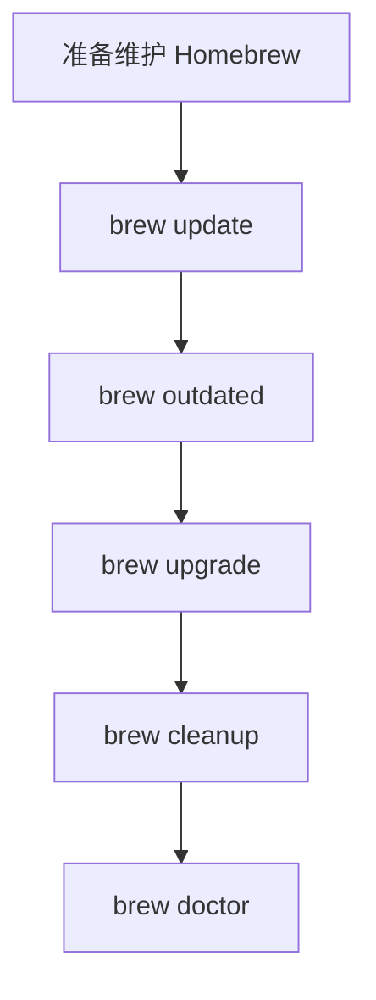

---
tags:
  - brew
  - homebrew
  - mac
---
# Homebrew 安装、配置、使用、更新与最佳实践

面向 macOS 用户，整理 Homebrew 的安装、基础配置、常用命令、升级维护、问题排查与实战建议。

截至 `2026-04-23` 核对，本文主要依据 Homebrew 官方站点与官方文档整理。

官方地址：

- 官网：<https://brew.sh/>
- 文档：<https://docs.brew.sh/>
- 安装文档：<https://docs.brew.sh/Installation.html>
- FAQ：<https://docs.brew.sh/FAQ>
- Troubleshooting：<https://docs.brew.sh/Troubleshooting>
- Shell Completion：<https://docs.brew.sh/Shell-Completion>
- Brew Bundle：<https://docs.brew.sh/Brew-Bundle-and-Brewfile>

## 目录

- [Key Takeaways](#key-takeaways)
- [Homebrew 是什么](#homebrew-是什么)
- [安装前需要知道的事](#安装前需要知道的事)
- [mac 安装 Homebrew](#mac-安装-homebrew)
- [安装后的基础配置](#安装后的基础配置)
- [核心概念](#核心概念)
- [常见命令速查](#常见命令速查)
- [日常使用场景](#日常使用场景)
- [更新与维护](#更新与维护)
- [问题排查](#问题排查)
- [最佳实践](#最佳实践)
- [参考来源](#参考来源)

## Key Takeaways

- Homebrew 是 macOS 上最主流的包管理器之一，用来安装命令行工具、GUI 应用、服务和开发依赖。
- 在 mac 上，官方推荐安装到默认前缀：Apple Silicon 为 `/opt/homebrew`，Intel 为 `/usr/local`。偏离默认前缀会导致大量包无法直接使用 bottle，进而退化为源码编译。
- 安装完成后，最重要的一步不是“马上装软件”，而是把 `brew shellenv` 写进 shell 启动文件，否则新终端里可能找不到 `brew`。
- 日常维护最常用的不是单独一个命令，而是一组习惯：`brew update`、`brew upgrade`、`brew cleanup`、`brew doctor`。
- 团队或新机器初始化时，优先考虑 `brew bundle` 和 `Brewfile`，而不是手写一长串安装命令。

## Homebrew 是什么

Homebrew 可以理解为 mac 上的包管理器，主要负责：

- 安装命令行工具，例如 `git`、`wget`、`ffmpeg`、`ripgrep`
- 安装 GUI 应用，例如 `google-chrome`、`visual-studio-code`、`wechat`
- 管理依赖、版本、软链接和安装路径
- 管理本地服务，例如 `mysql`、`postgresql`、`redis`
- 通过 `Brewfile` 管理一整套开发环境

一句话理解：

- `brew install xxx` 解决“去哪里下载、如何安装、怎么升级”的问题。

## 安装前需要知道的事

### 1. 官方支持的默认安装前缀

根据官方安装文档和 FAQ，macOS 默认前缀是：

| 机器架构 | 默认前缀 |
| --- | --- |
| Apple Silicon | `/opt/homebrew` |
| Intel Mac | `/usr/local` |

官方明确建议使用默认前缀，因为很多 bottle 依赖这个前缀。如果你装到别的位置，很多包会被迫源码编译，速度更慢、失败率更高，也不属于官方支持配置。

### 2. macOS 基本要求

官方安装文档目前写明的 macOS 支持要求包括：

- Apple Silicon 或 64 位 Intel CPU
- macOS `14 Sonoma` 或更高为支持配置
- 已安装 Xcode Command Line Tools 或 Xcode

### 3. 先准备 Xcode Command Line Tools

如果你的机器还没装命令行开发工具，先执行：

```bash
xcode-select --install
```

这一步通常是 Homebrew 安装的前置条件。

## mac 安装 Homebrew

### 1. 推荐安装方式

官方首页给出的安装命令是：

```bash
/bin/bash -c "$(curl -fsSL https://raw.githubusercontent.com/Homebrew/install/HEAD/install.sh)"
```

特点：

- 官方推荐
- 会明确展示将要执行的步骤
- 安装到默认前缀
- 初次安装时可能需要输入管理员密码

### 2. macOS `.pkg` 安装器

官方安装文档也提到 macOS 可使用 `.pkg` 安装器，它同样会安装到默认前缀。这个方式更适合：

- 图形化安装偏好者
- 批量装机
- 某些终端环境受限的情况

### 3. 安装完成后先验证

```bash
brew --version
brew --prefix
brew config
```

推荐重点检查：

- `brew --version` 是否正常输出版本
- `brew --prefix` 是否是你的预期前缀
- `brew config` 是否能正常输出系统环境信息

## 安装后的基础配置

### 1. 配置 `shellenv`

官方安装文档强调：安装完成后必须把 `brew shellenv` 写入 shell 启动文件，否则 Homebrew 在新开终端中可能不可用。

在 macOS 的 `zsh` 中，常见做法是把下面这行放进 `~/.zprofile`：

```bash
eval "$(/opt/homebrew/bin/brew shellenv)"
```

如果你是 Intel Mac，则通常是：

```bash
eval "$(/usr/local/bin/brew shellenv)"
```

说明：

- Apple Silicon 默认放 `~/.zprofile`
- 新终端登录时会自动加载
- 如果你已经按安装器提示配置过，就不要重复写多份

### 2. 确认 PATH 生效

写入 shell 配置后执行：

```bash
source ~/.zprofile
which brew
brew --prefix
```

你应当看到：

- Apple Silicon 通常是 `/opt/homebrew/bin/brew`
- Intel 通常是 `/usr/local/bin/brew`

### 3. 配置 Shell 自动补全

Homebrew 官方提供 `brew` 的 completion，但不会自动帮你完成所有 shell 配置。

对于 `zsh`，文档的核心要求是：

- 先让 `brew shellenv` 生效
- 再初始化 `compinit`

常见配置如下：

```bash
autoload -Uz compinit
compinit
```

如果你使用 Oh My Zsh，通常它会帮你调用 `compinit`。关键点是保证 `eval "$(brew shellenv)"` 在合适位置生效。

如果遇到 `zsh compinit: insecure directories`，官方文档给出的处理方式是：

```bash
chmod -R go-w "$(brew --prefix)/share"
```

### 4. 查看 Homebrew 环境

```bash
brew config
brew doctor
```

用途：

- `brew config`：查看 Homebrew、系统、Xcode、CLT、CPU 架构等信息
- `brew doctor`：诊断环境问题和不规范配置

## 核心概念

在真正使用之前，先把几个词分清。

| 概念 | 含义 | 常见命令 |
| --- | --- | --- |
| Formula | 命令行软件或库的安装定义 | `brew install wget` |
| Cask | GUI 应用或大体量二进制发行包 | `brew install --cask google-chrome` |
| Tap | 第三方仓库或额外软件源 | `brew tap homebrew/cask-fonts` |
| Bottle | 预编译二进制包 | 由 Homebrew 自动使用 |
| Cellar | 实际安装文件所在目录 | `brew --cellar` |
| Prefix | Homebrew 的安装前缀 | `brew --prefix` |
| Service | 由 Homebrew 管理的后台服务 | `brew services start redis` |
| Brewfile | 用于声明整套环境的软件清单 | `brew bundle` |

### Formula 和 Cask 的区别

| 对比项 | Formula | Cask |
| --- | --- | --- |
| 主要对象 | CLI 工具、库 | GUI 应用、安装包类软件 |
| 常见示例 | `git`、`node`、`jq` | `iterm2`、`visual-studio-code` |
| 安装命令 | `brew install xxx` | `brew install --cask xxx` |

## 常见命令速查

### 1. 基础信息与查询

| 命令 | 含义 | 用途 |
| --- | --- | --- |
| `brew --version` | 查看版本 | 验证安装 |
| `brew --prefix` | 查看安装前缀 | 确认路径 |
| `brew config` | 查看环境信息 | 排查环境问题 |
| `brew doctor` | 检查环境健康度 | 排查警告 |
| `brew help` | 查看帮助 | 查命令 |
| `man brew` | 查看完整手册 | 查详细参数 |
| `brew search <name>` | 搜索软件 | 找 formula/cask |
| `brew info <name>` | 查看软件详情 | 看版本、依赖、路径 |
| `brew list` | 查看已安装包 | 看本机现状 |

### 2. 安装与卸载

| 命令 | 含义 | 示例 |
| --- | --- | --- |
| `brew install <formula>` | 安装命令行工具 | `brew install wget` |
| `brew install --cask <cask>` | 安装 GUI 应用 | `brew install --cask visual-studio-code` |
| `brew uninstall <name>` | 卸载 formula | `brew uninstall wget` |
| `brew uninstall --cask <name>` | 卸载 cask | `brew uninstall --cask google-chrome` |
| `brew reinstall <name>` | 重新安装 | `brew reinstall python` |

### 3. 更新与清理

| 命令 | 含义 | 说明 |
| --- | --- | --- |
| `brew update` | 更新 Homebrew 元数据和仓库信息 | 通常先执行 |
| `brew upgrade` | 升级所有已安装包 | 日常维护核心命令 |
| `brew upgrade <name>` | 升级指定软件 | 控制影响范围 |
| `brew outdated` | 查看可升级软件 | 先看再升 |
| `brew cleanup` | 清理旧版本和缓存 | 释放磁盘空间 |
| `brew autoremove` | 移除不再需要的依赖 | 避免依赖残留 |

### 4. 链接与版本切换

| 命令 | 含义 | 典型用途 |
| --- | --- | --- |
| `brew link <name>` | 建立软链接到前缀 | 手动启用某版本 |
| `brew unlink <name>` | 取消链接 | 临时避开冲突 |
| `brew pin <name>` | 锁定版本，不参与升级 | 避免核心工具被自动升版 |
| `brew unpin <name>` | 取消锁定 | 恢复正常升级 |

### 5. 服务管理

| 命令 | 含义 | 示例 |
| --- | --- | --- |
| `brew services list` | 查看服务状态 | 看哪些服务在运行 |
| `brew services start <name>` | 启动服务 | `brew services start redis` |
| `brew services stop <name>` | 停止服务 | `brew services stop mysql` |
| `brew services restart <name>` | 重启服务 | `brew services restart postgresql@16` |

### 6. Bundle 与环境同步

| 命令 | 含义 | 示例 |
| --- | --- | --- |
| `brew bundle` | 根据 `Brewfile` 安装/升级依赖 | 项目初始化 |
| `brew bundle check` | 检查依赖是否满足 | CI 或脚本 |
| `brew bundle dump --global --force` | 导出当前环境到全局 `Brewfile` | 新机器迁移 |
| `brew bundle --global` | 按全局 `Brewfile` 同步环境 | 快速重建环境 |

## 日常使用场景

### 1. 安装命令行工具

```bash
brew search ripgrep
brew install ripgrep
brew info ripgrep
```

适合：

- 开发工具
- 排障工具
- 文本处理工具
- 数据库客户端

### 2. 安装 GUI 软件

```bash
brew search visual-studio-code
brew install --cask visual-studio-code
```

适合：

- 浏览器
- 编辑器
- 聊天工具
- 设计工具

### 3. 管理后台服务

```bash
brew install redis
brew services start redis
brew services list
```

适合：

- 本地数据库
- 本地缓存
- 开发依赖服务

### 4. 查询安装路径和依赖

```bash
brew info node
brew list node
brew --prefix node
```

适合：

- 定位安装目录
- 查依赖关系
- 给其他工具传路径

### 5. 新机器快速恢复环境

先导出：

```bash
brew bundle dump --global --force
```

再在新机器恢复：

```bash
brew bundle --global
```

这比手动回忆几十个安装命令更稳。

## 更新与维护

### 1. 推荐的日常维护顺序



这个顺序的好处是：

- 先更新索引
- 再看哪些包要升级
- 升级后清理旧版本
- 最后检查环境是否健康

### 2. 最常见的一组维护命令

```bash
brew update
brew outdated
brew upgrade
brew cleanup
brew doctor
```

### 3. 什么时候只升级单个软件

当你不想让全局环境一起变化时，优先用：

```bash
brew upgrade <name>
```

适合：

- 正在做兼容性验证
- 某个版本变更风险较高
- 线上问题复现需要固定本地版本

### 4. 什么时候使用 `pin`

例如你暂时不希望某些核心工具被自动升级：

```bash
brew pin node
brew pin postgresql@16
```

查看需要升级的包时，被 pin 的包不会参与正常升级流程。

## 问题排查

### 1. 官方建议的排查起手式

Homebrew 官方 Troubleshooting 文档明确建议：在提 issue 前，先执行两次 `brew update`，再执行 `brew doctor`。

```bash
brew update
brew update
brew doctor
```

### 2. 常见问题与处理思路

| 问题 | 常见原因 | 建议处理 |
| --- | --- | --- |
| `brew` 找不到 | `shellenv` 没写进 shell 配置 | 检查 `~/.zprofile` 和 PATH |
| 安装很慢或频繁源码编译 | 没用默认前缀、环境异常、瓶子不可用 | 检查 `brew --prefix`、`brew config` |
| `doctor` 有大量 warning | 系统里有冲突路径、权限或旧依赖 | 逐条处理，不要直接忽略 |
| zsh 补全异常 | `compinit` 顺序不对、目录权限问题 | 检查 `compinit` 配置，必要时修复 `share` 权限 |
| 软件冲突 | 同名命令已被别处安装 | 用 `which`、`brew unlink`、PATH 排查 |

### 3. 排查时最有用的命令

```bash
brew config
brew doctor
brew info <name>
which <command>
echo $PATH
```

## 最佳实践

### 1. 坚持使用默认前缀

这是 Homebrew 官方反复强调的重点。默认前缀可以最大化 bottle 命中率，减少源码编译和奇怪问题。

### 2. 不要把 Homebrew 当成系统包目录手工乱改

不要随意手改：

- `Cellar`
- `opt`
- `bin`
- `share`

Homebrew 自己维护这些链接和结构，手动修改容易把环境搞脏。

### 3. 安装前先 `search`，安装后看 `info`

推荐习惯：

```bash
brew search <keyword>
brew info <name>
brew install <name>
```

这样能减少装错包、装错 tap、装错版本的概率。

### 4. 定期维护，但不要无脑全量升级

建议：

- 日常开发机定期升级
- 关键依赖先看 `brew outdated`
- 对数据库、语言运行时等关键工具优先按需升级

### 5. 团队环境用 `Brewfile`

如果一个项目要求统一依赖，不要只写在 README 里，直接落成 `Brewfile` 更可靠。

示例：

```ruby
brew "git"
brew "node"
brew "pnpm"
brew "postgresql@16"
cask "visual-studio-code"
```

安装：

```bash
brew bundle
```

### 6. 服务尽量交给 `brew services`

如果你已经通过 Homebrew 安装数据库或缓存服务，优先用 `brew services` 管理，而不是自己拼一堆后台启动命令。

### 7. 清理动作要纳入日常

很多人只会安装，不会清理。时间久了会留下：

- 旧版本
- 无用依赖
- 下载缓存

建议定期执行：

```bash
brew cleanup
brew autoremove
```

## 参考来源

- <https://brew.sh/>
- <https://docs.brew.sh/>
- <https://docs.brew.sh/Installation.html>
- <https://docs.brew.sh/FAQ>
- <https://docs.brew.sh/Troubleshooting>
- <https://docs.brew.sh/Shell-Completion>
- <https://docs.brew.sh/Brew-Bundle-and-Brewfile>
- <https://docs.brew.sh/Tips-and-Tricks>
