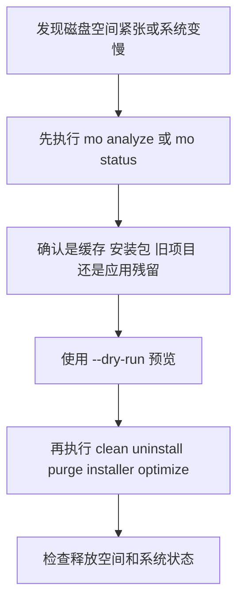

---
tags:
  - mole
  - disk
  - mac
---
# Mole 安装、使用与最佳实践

面向 macOS 用户，整理 Mole 的安装方式、核心能力、常见命令、Raycast 集成与安全使用建议。

截至 `2026-04-23` 核对，官方仓库显示最新 release 为 `V1.34.0`，发布时间为 `2026-04-12`。

官方地址：

- GitHub：<https://github.com/tw93/Mole>
- Releases：<https://github.com/tw93/Mole/releases>

## 目录

- [Key Takeaways](#key-takeaways)
- [Mole 是什么](#mole-是什么)
- [mac 安装方式](#mac-安装方式)
- [安装后建议先做的事](#安装后建议先做的事)
- [常见命令速查](#常见命令速查)
- [核心使用场景](#核心使用场景)
- [Raycast 集成](#raycast-集成)
- [最佳实践](#最佳实践)
- [常见问题与注意事项](#常见问题与注意事项)
- [参考来源](#参考来源)

## Key Takeaways

- Mole 是一个面向 macOS 的本地系统清理与优化工具，覆盖清理、卸载、磁盘分析、系统状态监控、构建产物清理等场景。
- 对日常用户来说，最重要的原则是：先 `--dry-run` 预览，再执行真正清理。
- `mo clean` 适合“软件已经卸载，只想清残留”的场景；`mo uninstall` 适合“软件还装着，要连本体一起卸载”的场景。
- `mo analyze` 相对更安全，官方说明它通过 Finder 将文件移动到废纸篓，而不是直接删除。
- 如果希望从 Raycast 快速触发清理和状态查看，可以使用官方脚本生成 Script Commands，再在 Raycast 中手动添加脚本目录。

## Mole 是什么

Mole 的定位可以理解为把以下几类能力合并到一个 CLI 工具里：

- 类似 CleanMyMac 的系统清理
- 类似 AppCleaner 的应用卸载残留清理
- 类似 DaisyDisk 的磁盘占用分析
- 类似 iStat Menus 的实时状态监控

它的核心能力包括：

- 深度清理缓存、日志、浏览器残留、孤儿数据
- 卸载应用并清理偏好设置、缓存、Launch Agents 等残留
- 分析磁盘占用，定位大文件和高占用目录
- 刷新缓存与系统服务，做轻量系统优化
- 实时查看 CPU、内存、磁盘、网络、电源等状态

## mac 安装方式

### 1. 推荐方式：Homebrew 安装

```bash
brew install mole
```

适合场景：

- 已经使用 Homebrew 管理命令行工具
- 希望后续升级、卸载都更标准化

安装完成后验证：

```bash
mo --version
mo --help
```

### 2. 官方脚本安装

```bash
curl -fsSL https://raw.githubusercontent.com/tw93/Mole/main/install.sh | bash
```

可选参数示例：

```bash
# 安装 main 分支最新代码
curl -fsSL https://raw.githubusercontent.com/tw93/Mole/main/install.sh | bash -s latest

# 安装指定版本
curl -fsSL https://raw.githubusercontent.com/tw93/Mole/main/install.sh | bash -s 1.17.0
```

适合场景：

- 不想依赖 Homebrew
- 想安装指定版本
- 想使用 `mo update --nightly` 这类脚本安装路径支持的能力

### 3. 两种安装方式对比

| 安装方式 | 命令 | 优点 | 适合人群 |
| --- | --- | --- | --- |
| Homebrew | `brew install mole` | 简单、标准、便于管理 | 大多数 mac 开发者 |
| 官方脚本 | `curl -fsSL ... | bash` | 支持指定版本，更新路径更灵活 | 想精细控制版本的人 |

## 安装后建议先做的事

### 1. 确认命令可用

```bash
mo --version
mo --help
```

### 2. 先从交互菜单熟悉能力

```bash
mo
```

这会打开交互式菜单，适合第一次使用时浏览各项能力。

### 3. 配置 Shell 自动补全

```bash
mo completion
```

官方说明支持 `bash`、`zsh`、`fish`。

### 4. 配置 sudo 的 Touch ID

```bash
mo touchid
```

如果你的 mac 支持 Touch ID，这会让部分需要 sudo 的操作更顺手。

### 5. 第一次真正清理前先做预览

```bash
mo clean --dry-run
mo uninstall --dry-run
mo purge --dry-run
```

如果需要更详细日志：

```bash
mo clean --dry-run --debug
```

## 常见命令速查

| 命令 | 含义 | 典型用途 | 风险级别 |
| --- | --- | --- | --- |
| `mo` | 打开交互式菜单 | 首次体验、手动选择功能 | 低 |
| `mo clean` | 深度清理缓存和已卸载应用残留 | 释放磁盘空间 | 中 |
| `mo uninstall` | 卸载应用并清理相关残留 | 删除不再使用的软件 | 高 |
| `mo optimize` | 刷新缓存和系统服务 | 做轻量系统整理与优化 | 中 |
| `mo analyze` | 图形化分析磁盘占用 | 找大文件、大目录 | 低到中 |
| `mo analyse` | `analyze` 的别名 | 同上 | 低到中 |
| `mo status` | 查看实时系统状态面板 | 排查性能问题 | 低 |
| `mo purge` | 清理项目构建产物 | 删除 `node_modules`、`target`、`dist` 等 | 高 |
| `mo installer` | 查找并清理安装包文件 | 删除 `.dmg`、`.pkg`、`.zip` 等安装文件 | 中 |
| `mo touchid` | 配置 sudo 的 Touch ID | 提升终端操作体验 | 低 |
| `mo completion` | 配置 Shell 自动补全 | 提升命令行效率 | 低 |
| `mo update` | 更新 Mole | 升级稳定版本 | 低 |
| `mo update --nightly` | 更新到未正式发布的 main 构建 | 尝鲜 | 中 |
| `mo remove` | 从系统移除 Mole | 卸载工具本身 | 中 |
| `mo --help` | 查看帮助 | 查参数、查用法 | 低 |
| `mo --version` | 查看版本 | 验证安装结果 | 低 |

### 常见参数速查

| 参数 | 含义 | 常用搭配 |
| --- | --- | --- |
| `--dry-run` | 只预览，不实际执行删除/修改 | `clean`、`uninstall`、`purge`、`optimize`、`installer` |
| `--debug` | 输出更详细日志 | `mo clean --dry-run --debug` |
| `--whitelist` | 管理保护规则/白名单 | `mo clean --whitelist`、`mo optimize --whitelist` |
| `--paths` | 配置项目扫描目录 | `mo purge --paths` |
| `--json` | 输出 JSON，便于脚本处理 | `mo analyze --json`、`mo status --json` |

## 核心使用场景

### 1. 清理系统缓存和残留

```bash
mo clean
```

适合：

- 磁盘空间不足
- 浏览器、开发工具、应用缓存过多
- 某些软件早已手动删除，但残留文件还在

建议：

- 先执行 `mo clean --dry-run`
- 对重要机器先观察清理列表，再决定是否执行

### 2. 卸载应用并带走残留

```bash
mo uninstall
```

适合：

- 想完整卸载某个已安装应用
- 不希望只删 `.app` 后留下配置和缓存垃圾

区分方式：

| 场景 | 推荐命令 |
| --- | --- |
| App 还安装着，准备完整移除 | `mo uninstall` |
| App 已经删了，只剩残留文件 | `mo clean` |

### 3. 系统优化

```bash
mo optimize
```

适合：

- 清理系统级缓存
- 刷新 Finder、Dock、网络服务、部分数据库索引

建议先执行：

```bash
mo optimize --dry-run
```

如果有你不想碰的优化项，可以用：

```bash
mo optimize --whitelist
```

### 4. 分析磁盘占用

```bash
mo analyze
```

适合：

- 不确定空间到底被谁占了
- 想先查清楚再删除

查看外部磁盘或指定路径：

```bash
mo analyze /Volumes
mo analyze ~/Documents
```

这一类操作通常比直接清理更适合作为第一步，因为它更偏“观察”和“确认”。

### 5. 查看实时系统状态

```bash
mo status
```

适合：

- 电脑发热、卡顿、风扇异常
- 想快速看 CPU、内存、磁盘 IO、网络、代理、电池等状态

补充：

- 在 `mo status` 中按 `k` 可以切换小猫动画
- 按 `q` 退出
- 支持 `--json` 便于自动化采集

### 6. 清理开发项目构建产物

```bash
mo purge
```

典型可清理对象包括：

- `node_modules`
- `target`
- `build`
- `dist`
- `.build`
- `venv`

如果经常维护多个老项目，这个命令通常很实用；但它也属于高风险命令，务必先 `--dry-run`。

### 7. 清理安装包

```bash
mo installer
```

适合：

- `Downloads` 里堆了很多 `.dmg`、`.pkg`、`.zip`
- Homebrew 缓存里有大量旧安装包

## Raycast 集成

Mole 官方提供了 Quick Launchers 脚本，可以为 Raycast 或 Alfred 生成快捷命令。

### 1. 执行官方脚本

```bash
curl -fsSL https://raw.githubusercontent.com/tw93/Mole/main/scripts/setup-quick-launchers.sh | bash
```

脚本会创建 5 个命令：

- `Mole Clean`
- `Mole Uninstall`
- `Mole Optimize`
- `Mole Analyze`
- `Mole Status`

### 2. 在 Raycast 中完成一次性配置

1. 打开 Raycast Settings，快捷键 `⌘ + ,`
2. 进入 `Extensions -> Script Commands`
3. 点击 `Add Script Directory` 或 `+`
4. 添加目录：`~/Library/Application Support/Raycast/script-commands`
5. 在 Raycast 中搜索并执行 `Reload Script Directories`
6. 搜索 `Mole Clean`、`Mole Optimize`、`Mole Status` 等命令进行使用

### 3. 集成后的实际价值

- 不用每次打开终端输入命令
- 适合把 `status` 作为日常巡检入口
- 适合把 `analyze` 作为空间排查入口
- 对 `clean`、`uninstall`、`purge` 这类高风险命令，依然建议先在终端里手动加 `--dry-run` 验证

### 4. 终端兼容说明

官方说明 Mole 会自动检测终端应用；如果需要手动指定，可以设置：

```bash
export MO_LAUNCHER_APP=<name>
```

官方 README 中提到 `iTerm2` 存在已知兼容性问题，并推荐 `Kaku`；同时也提到了 `Alacritty`、`kitty`、`WezTerm`、`Ghostty`、`Warp` 等选项。

## 最佳实践

### 1. 先分析，再清理

推荐顺序：



这个顺序比“上来就清理”更稳。

### 2. 高风险命令默认先加 `--dry-run`

尤其是下面几类：

- `mo clean`
- `mo uninstall`
- `mo purge`
- `mo installer`
- `mo remove`
- `mo optimize`

### 3. 重要机器上先看日志

官方说明文件操作日志默认会记录到：

```bash
~/Library/Logs/mole/operations.log
```

如果你在排查异常删除、误清理、执行路径，可以先看这里。

如需关闭该日志：

```bash
export MO_NO_OPLOG=1
```

### 4. 对开发机重点关注 `purge`

开发机最容易占空间的通常不是系统本身，而是构建产物和依赖缓存。实践上建议：

- 定期清理长期不维护项目的 `node_modules`、`target`、`dist`
- 对最近 7 天还在开发的项目，先确认再删
- 把 `mo purge --paths` 配到你常用工作目录

### 5. 对普通办公机重点关注 `clean` 和 `installer`

这两类机器最常见的空间浪费通常来自：

- 浏览器缓存
- 聊天软件缓存
- 历史安装包
- 已删除应用的残留目录

### 6. 将 Raycast 作为入口，而不是风险屏蔽层

Raycast 只是触发命令更快，不代表风险变低。对于删除类动作，依然应该保持“先预览、再执行”的习惯。

## 常见问题与注意事项

### 1. Mole 适合哪些人

- 想用 CLI 管理和清理 mac 的开发者
- 不想分别安装多个 GUI 清理工具的人
- 希望结合 Raycast 做快速入口的人

### 2. 哪些命令最值得先学

如果你只先学 4 个，建议是：

1. `mo analyze`
2. `mo status`
3. `mo clean --dry-run`
4. `mo purge --dry-run`

### 3. 为什么官方反复强调安全

因为 Mole 是本地系统维护工具，部分命令会执行实际删除操作。官方 README 明确把 `clean`、`uninstall`、`purge`、`installer`、`remove` 归类为 destructive operations。

### 4. 自动化场景怎么用

Mole 的 `analyze` 和 `status` 支持 `--json`，适合：

- shell 脚本
- 定时任务
- 与 `jq` 联用
- 自定义巡检脚本

示例：

```bash
mo status --json
mo analyze --json ~/Documents
mo status | jq '.health_score'
```

## 参考来源

- <https://github.com/tw93/Mole>
- <https://github.com/tw93/Mole/releases>
- <https://raw.githubusercontent.com/tw93/Mole/main/install.sh>
- <https://raw.githubusercontent.com/tw93/Mole/main/scripts/setup-quick-launchers.sh>
