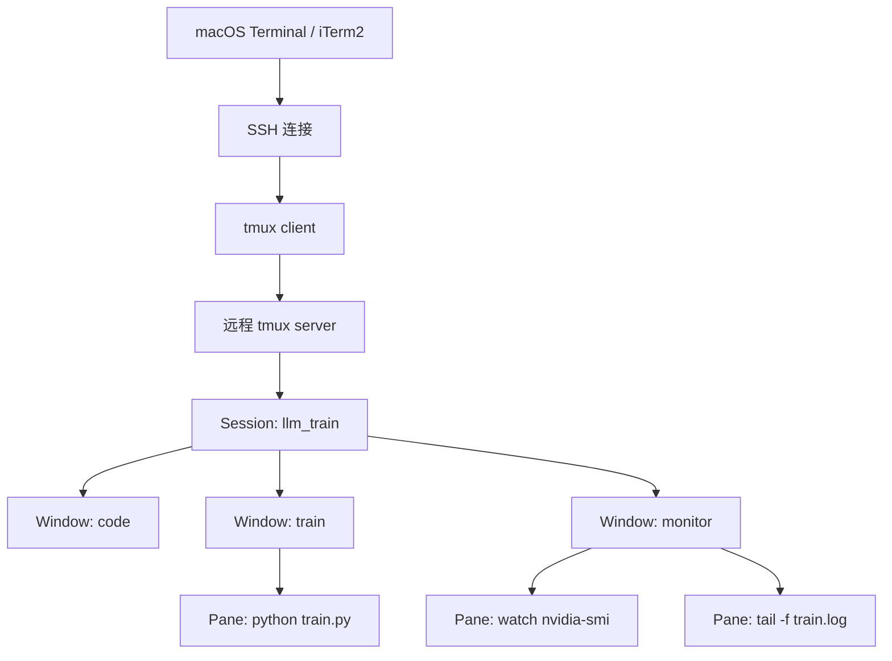

# macOS tmux 安装使用与 AI 研发工作流最佳实践

`tmux` 是 Terminal Multiplexer（终端复用器），最适合解决远程 SSH、长时间训练、日志监控和多任务终端工作流中的“断线即崩”问题。对于 AI 研发和深度学习训练，它的核心价值不是“分屏好看”，而是把训练进程放进远程服务器上的长期会话里，让 macOS 终端只承担连接和显示职责。

## 目录

- [Key Takeaways](#key-takeaways)
- [tmux 解决什么问题](#tmux-解决什么问题)
- [核心架构](#核心架构)
- [macOS 安装方式](#macos-安装方式)
- [远程服务器安装方式](#远程服务器安装方式)
- [最小可用工作流](#最小可用工作流)
- [命令与快捷键速查](#命令与快捷键速查)
- [AI 研发常用布局](#ai-研发常用布局)
- [高级用法](#高级用法)
- [推荐配置](#推荐配置)
- [自动化脚本](#自动化脚本)
- [Hooks 钩子](#hooks-钩子)
- [插件生态](#插件生态)
- [常见问题与排障](#常见问题与排障)
- [最佳实践清单](#最佳实践清单)
- [参考来源](#参考来源)

## Key Takeaways

- SSH 到远程 GPU 服务器训练模型时，`python train.py` 应该运行在远程服务器的 `tmux` 会话里，而不是裸跑在 SSH 前台。
- macOS 本地安装 tmux 主要用于本机终端复用；远程训练保活的关键是远程服务器也要安装并运行 tmux。
- `Session -> Window -> Pane` 是 tmux 的三层结构：会话保活，窗口组织任务，面板实现分屏。
- 默认前缀键是 `C-b`，即先按 `Ctrl + b`，松开后再按目标键。
- AI 研发推荐至少准备三个窗口：`code`、`train`、`monitor`，分别用于编辑、训练和监控。
- 长日志场景建议打开鼠标、提高 `history-limit`、熟悉 copy-mode，并用 `capture-pane` 保存关键输出。

## tmux 解决什么问题

### 常见痛点

| 场景 | 裸 SSH / 裸终端的问题 | tmux 的解决方式 |
| --- | --- | --- |
| 远程训练 | 网络断开后前台进程可能收到挂断信号并退出 | 训练进程运行在远程 tmux server 内，重新 SSH 后 attach |
| 多任务开发 | 多个终端窗口散落，状态难恢复 | 用 session/window/pane 固定工作区结构 |
| 训练监控 | 需要同时看训练日志、GPU、CPU、磁盘、代码 | 一个窗口内拆多个 pane |
| 临时离开 | 关闭 Mac、睡眠、VPN 断开导致连接丢失 | `C-b d` 主动 detach，后台继续跑 |
| 复现实验环境 | 每次手动打开多个终端、激活环境、运行命令 | 用 tmux CLI 脚本一键初始化 |

### tmux、nohup、screen、systemd-run 对比

| 工具 | 适合场景 | 优点 | 局限 |
| --- | --- | --- | --- |
| `tmux` | 交互式长任务、训练、监控、远程开发 | 可恢复交互界面、分屏、多窗口、脚本化能力强 | 需要学习快捷键和 session 管理 |
| `nohup` | 简单后台命令 | 使用简单，适合一次性任务 | 不能恢复交互界面，日志和输入管理弱 |
| `screen` | 老式终端复用 | 很多服务器预装 | 交互体验和配置生态通常不如 tmux |
| `systemd-run` | 服务器级长期服务 | 更接近服务管理，适合生产任务 | 不适合频繁交互和分屏监控 |
| 作业调度系统 | Slurm、Kubernetes、Ray 等集群任务 | 适合团队和集群资源治理 | 需要平台支持，不替代日常 SSH 调试 |

## 核心架构

tmux 有三层结构：

| 层级 | 类比 | 作用 | 常见命名 |
| --- | --- | --- | --- |
| Session（会话） | 一个项目工作区 | 进程保活与任务隔离的基本单位 | `llm_train`、`paper_exp`、`prod_debug` |
| Window（窗口） | 浏览器标签页 | 把不同任务分到不同页面 | `code`、`train`、`monitor`、`logs` |
| Pane（面板） | 分屏区域 | 在同一窗口同时运行多个命令 | GPU 监控、日志、shell、编辑器 |

### 运行机制



当 macOS 终端关闭、网络断开或 SSH client 消失时，断掉的是 `tmux client` 这一层。只要远程服务器上的 `tmux server` 没有退出，session 里的训练进程仍然会继续运行。

## macOS 安装方式

macOS 上推荐使用 Homebrew。macOS 本地装 tmux 适合本机开发、多窗口终端管理，以及在本机先熟悉快捷键。

| 安装方式 | 命令 | 推荐程度 | 说明 |
| --- | --- | --- | --- |
| Homebrew | `brew install tmux` | 推荐 | macOS 最常见方式，升级和卸载都方便 |
| MacPorts | `sudo port install tmux` | 可选 | 适合已经使用 MacPorts 管理软件的机器 |
| 源码编译 | 从 tmux 源码构建 | 不推荐新手 | 适合需要特定版本或补丁时使用 |

### Homebrew 常用维护命令

| 功能 | 命令 |
| --- | --- |
| 安装 | `brew install tmux` |
| 查看版本 | `tmux -V` |
| 查看包信息 | `brew info tmux` |
| 升级 | `brew upgrade tmux` |
| 卸载 | `brew uninstall tmux` |

### macOS 端需要注意什么

| 事项 | 建议 |
| --- | --- |
| 终端选择 | Terminal、iTerm2、Warp 等都可以；iTerm2 对快捷键和鼠标体验更成熟 |
| 配置文件位置 | `~/.tmux.conf` |
| 复制粘贴 | 需要区分 macOS 终端复制、tmux copy-mode、远程剪贴板 |
| 训练保活 | 如果训练跑在远程服务器，必须在远程服务器启动 tmux，本机装 tmux 不会保护远程裸跑进程 |

## 远程服务器安装方式

远程训练时，应该 SSH 到服务器后，在服务器上安装和启动 tmux。

| 系统 | 安装命令 | 说明 |
| --- | --- | --- |
| Ubuntu / Debian | `sudo apt update && sudo apt install tmux` | GPU 服务器最常见 |
| CentOS / RHEL | `sudo yum install tmux` | 老系统可能版本较旧 |
| Fedora | `sudo dnf install tmux` | Fedora / 新 RHEL 系常见 |
| Arch Linux | `sudo pacman -S tmux` | 滚动发行版 |
| 无 sudo 权限 | 使用 Conda、Spack 或源码安装 | 需确认服务器环境和管理员策略 |

如果服务器没有 sudo 权限，可以先检查：

```bash
tmux -V
which tmux
conda search tmux
```

## 最小可用工作流

### 第一次启动训练

```bash
ssh user@gpu-server
tmux new -s llm_train
conda activate env_py310
python train.py 2>&1 | tee train.log
```

然后按：

```text
C-b d
```

这会 detach 当前会话，训练继续在后台运行。

### 重新连接训练

```bash
ssh user@gpu-server
tmux ls
tmux attach -t llm_train
```

### 结束会话

训练结束后，如果不再需要该 session：

```bash
tmux kill-session -t llm_train
```

## 命令与快捷键速查

下面表格默认 `Prefix = C-b`。

### 会话管理

| 功能 | 外部命令 | tmux 内快捷键 | 说明 |
| --- | --- | --- | --- |
| 新建具名会话 | `tmux new -s <name>` | - | 推荐总是命名 |
| 新建并后台启动 | `tmux new -d -s <name>` | - | 适合脚本化 |
| 查看会话 | `tmux ls` | `C-b s` | 快捷键进入交互选择 |
| 接入会话 | `tmux attach -t <name>` | - | `a` 是 `attach` 简写 |
| 接入最近会话 | `tmux a` | - | 只有一个 session 时最方便 |
| 分离当前会话 | `tmux detach` | `C-b d` | 后台继续运行 |
| 重命名会话 | `tmux rename-session -t <old> <new>` | `C-b $` | 便于长期维护 |
| 杀死指定会话 | `tmux kill-session -t <name>` | - | 关闭该会话所有窗口和进程 |
| 杀死全部 tmux | `tmux kill-server` | - | 谨慎使用，会结束所有 session |

### 窗口管理

| 功能 | 外部命令 | tmux 内快捷键 | 说明 |
| --- | --- | --- | --- |
| 新建窗口 | `tmux new-window -n <name>` | `C-b c` | 类似新建 Tab |
| 查看窗口列表 | `tmux list-windows` | `C-b w` | 交互选择窗口 |
| 下一个窗口 | - | `C-b n` | next |
| 上一个窗口 | - | `C-b p` | previous |
| 按编号切换 | - | `C-b 0` 到 `C-b 9` | 窗口编号从 0 开始 |
| 重命名窗口 | `tmux rename-window <name>` | `C-b ,` | 推荐命名为任务 |
| 查找窗口 | - | `C-b f` | 按名字搜索 |
| 关闭窗口 | `tmux kill-window` | `C-b &` | 会提示确认 |

### 面板管理

| 功能 | 外部命令 | tmux 内快捷键 | 说明 |
| --- | --- | --- | --- |
| 左右分屏 | `tmux split-window -h` | `C-b %` | horizontal split，左右排列 |
| 上下分屏 | `tmux split-window -v` | `C-b "` | vertical split，上下排列 |
| 切换面板 | - | `C-b 方向键` 或 `C-b o` | 在 pane 之间移动 |
| 显示面板编号 | - | `C-b q` | 输入编号可跳转 |
| 最大化/恢复面板 | - | `C-b z` | 查看长日志时很常用 |
| 切换布局 | - | `C-b Space` | 自动轮换布局 |
| 关闭面板 | `tmux kill-pane` | `C-b x` | 或在 shell 中输入 `exit` |
| 调整大小 | `tmux resize-pane` | `C-b` 后按住 `Ctrl+方向键` | 部分终端快捷键可能冲突 |

### 复制、滚动与查找

| 功能 | 快捷键 / 命令 | 说明 |
| --- | --- | --- |
| 进入 copy-mode | `C-b [` | 用于滚动历史、搜索、复制 |
| 退出 copy-mode | `q` 或 `Esc` | 回到正常交互 |
| 向上/下滚动 | copy-mode 中方向键、PageUp、PageDown | 开启 mouse 后可用滚轮 |
| 向后搜索 | copy-mode 中 `/关键词` | 类似 less/vim |
| 向前搜索 | copy-mode 中 `?关键词` | 反向搜索 |
| 保存当前 pane 输出 | `tmux capture-pane -p -S -2000 > pane.log` | 保存最近 2000 行 |

## AI 研发常用布局

### 推荐窗口结构

| 窗口名 | 用途 | 典型命令 |
| --- | --- | --- |
| `code` | 编辑代码、git、配置实验参数 | `vim`、`nvim`、`git status`、`python -m pytest` |
| `train` | 运行训练、评估、推理任务 | `python train.py 2>&1 | tee train.log` |
| `monitor` | 监控 GPU、CPU、磁盘、日志 | `watch -n 1 nvidia-smi`、`htop`、`tail -f train.log` |
| `data` | 数据下载、预处理、校验 | `rsync`、`python preprocess.py`、`du -sh` |
| `scratch` | 临时实验 | `python`、`ipython`、`jq` |

### monitor 窗口推荐分屏

| Pane | 命令 | 目的 |
| --- | --- | --- |
| 左侧大 pane | `tail -f train.log` | 观察 loss、eval、checkpoint |
| 右上 pane | `watch -n 1 nvidia-smi` | GPU 利用率、显存、进程 |
| 右中 pane | `htop` 或 `btop` | CPU、内存、进程 |
| 右下 pane | `df -h && du -sh checkpoints/` | 磁盘和 checkpoint 占用 |

## 高级用法

### 命名规范

| 对象 | 命名建议 | 示例 |
| --- | --- | --- |
| Session | 项目 + 任务 | `llm_sft_a100`、`rag_eval`、`paper_exp` |
| Window | 功能名 | `code`、`train`、`monitor`、`logs` |
| Pane | 不强制命名，靠布局和命令区分 | GPU、日志、shell |
| 日志文件 | 实验名 + 时间 | `logs/sft_20260606.log` |

### 同步输入到多个面板

当需要同时在多台机器或多个 pane 执行同一命令时，可以使用同步面板。

| 操作 | 命令 / 快捷键 | 说明 |
| --- | --- | --- |
| 开启同步 | `tmux setw synchronize-panes on` | 当前窗口所有 pane 同步输入 |
| 关闭同步 | `tmux setw synchronize-panes off` | 用完立刻关闭 |
| 快捷配置 | 见下方 `.tmux.conf` | 可绑定到自定义快捷键 |

典型场景：

- 多卡机器上同时查看不同 shell 的环境变量。
- 多台 SSH 连接中同时执行 `hostname`、`nvidia-smi`。
- 分布式训练前检查多个节点的目录、依赖和数据。

注意：同步输入很容易误操作，执行 `rm`、`kill`、`git reset` 等破坏性命令前必须确认已经关闭。

### 日志捕获与导出

| 目标 | 命令 |
| --- | --- |
| 捕获当前 pane 可见内容 | `tmux capture-pane -p` |
| 捕获最近 5000 行 | `tmux capture-pane -p -S -5000 > tmux-pane.log` |
| 捕获整个历史缓冲区 | `tmux capture-pane -p -S - > tmux-full.log` |
| 保存当前 pane 到文件 | `tmux pipe-pane -o 'cat >> ~/tmux-pane.log'` |
| 停止 pipe-pane | `tmux pipe-pane` |

### 会话模板化

tmux 的 CLI 可以创建 session、window、pane，并向指定 pane 发送命令。这样可以把复杂开发环境变成脚本。

| 能力 | 命令示例 |
| --- | --- |
| 后台创建 session | `tmux new-session -d -s llm_train -n code` |
| 新建窗口 | `tmux new-window -t llm_train -n monitor` |
| 切分面板 | `tmux split-window -h -t llm_train:monitor` |
| 发送命令 | `tmux send-keys -t llm_train:monitor.0 'watch -n 1 nvidia-smi' C-m` |
| 选择布局 | `tmux select-layout -t llm_train:monitor tiled` |
| 接入会话 | `tmux attach -t llm_train` |

### 嵌套 tmux

嵌套 tmux 常见于“macOS 本地 tmux -> SSH -> 远程 tmux”。建议避免长期嵌套，直接在普通终端 SSH 到远程 tmux 更简单。

| 问题 | 处理方式 |
| --- | --- |
| 内外层前缀键冲突 | 外层 `C-b` 后再发 `C-b` 给内层，或给本地/远程设置不同 prefix |
| 快捷键混乱 | 本地不启动 tmux，只在远程训练机使用 tmux |
| 状态栏难区分 | 修改远程 tmux 状态栏颜色或 session 名 |

### 多客户端共享会话

同一个 session 可以被多个 client 同时 attach。

| 场景 | 命令 | 说明 |
| --- | --- | --- |
| 多终端共享同一会话 | `tmux attach -t llm_train` | 默认会共享光标和窗口 |
| 强制踢掉其他 client | `tmux attach -d -t llm_train` | `-d` 会 detach 其他 client |
| 只读观察 | 需确认具体版本和配置 | tmux 有 client 控制能力，但团队共享建议谨慎 |

## 推荐配置

把下面内容放到 `~/.tmux.conf`。如果配置在远程服务器上使用，就写到远程服务器用户的 `~/.tmux.conf`。

```tmux
# Prefix
# 默认 C-b 可保留；如果习惯 GNU screen，可以改成 C-a。
# unbind C-b
# set -g prefix C-a
# bind C-a send-prefix

# 鼠标支持：点击 pane、拖动边界、滚轮进入历史
set -g mouse on

# 长日志场景提高历史行数
set -g history-limit 50000

# 从 1 开始编号，更接近多数人的直觉
set -g base-index 1
setw -g pane-base-index 1

# 新窗口/新面板继承当前路径
bind c new-window -c "#{pane_current_path}"
bind '"' split-window -v -c "#{pane_current_path}"
bind % split-window -h -c "#{pane_current_path}"

# 更快刷新状态栏
set -g status-interval 5

# vi 风格 copy-mode
setw -g mode-keys vi

# r 重新加载配置
bind r source-file ~/.tmux.conf \; display-message "tmux.conf reloaded"

# z 已经默认用于 pane zoom，这里保留默认行为

# 同步 pane 开关
bind S setw synchronize-panes \; display-message "synchronize-panes: #{pane_synchronized}"
```

修改后加载：

```bash
tmux source-file ~/.tmux.conf
```

## 自动化脚本

### 一键启动 AI 训练监控环境

保存为 `start_ai_tmux.sh`：

```bash
#!/usr/bin/env bash
set -euo pipefail

SESSION_NAME="${1:-llm_train}"
ENV_NAME="${ENV_NAME:-env_py310}"
LOG_FILE="${LOG_FILE:-train.log}"

if tmux has-session -t "$SESSION_NAME" 2>/dev/null; then
  tmux attach-session -t "$SESSION_NAME"
  exit 0
fi

tmux new-session -d -s "$SESSION_NAME" -n "code"
tmux send-keys -t "$SESSION_NAME:code" "conda activate $ENV_NAME" C-m
tmux send-keys -t "$SESSION_NAME:code" "clear" C-m

tmux new-window -t "$SESSION_NAME" -n "train"
tmux send-keys -t "$SESSION_NAME:train" "conda activate $ENV_NAME" C-m
tmux send-keys -t "$SESSION_NAME:train" "echo 'Ready: python train.py 2>&1 | tee $LOG_FILE'" C-m

tmux new-window -t "$SESSION_NAME" -n "monitor"
tmux split-window -h -t "$SESSION_NAME:monitor"
tmux split-window -v -t "$SESSION_NAME:monitor.1"
tmux send-keys -t "$SESSION_NAME:monitor.0" "tail -f $LOG_FILE" C-m
tmux send-keys -t "$SESSION_NAME:monitor.1" "watch -n 1 nvidia-smi" C-m
tmux send-keys -t "$SESSION_NAME:monitor.2" "htop" C-m
tmux select-layout -t "$SESSION_NAME:monitor" main-vertical

tmux select-window -t "$SESSION_NAME:train"
tmux attach-session -t "$SESSION_NAME"
```

使用：

```bash
chmod +x start_ai_tmux.sh
./start_ai_tmux.sh llm_train
```

### 脚本设计要点

| 设计点 | 原因 |
| --- | --- |
| `has-session` 先判断是否存在 | 避免重复创建同名 session |
| `new-session -d` 后台创建 | 先搭好窗口和 pane，再 attach |
| 训练命令不自动执行 | 避免脚本一运行就误启动昂贵训练 |
| `tee train.log` | 前台可看，文件也保留 |
| `select-window` | attach 后直接进入最重要窗口 |

## Hooks 钩子

tmux hooks 可以在特定事件发生时执行命令。

```bash
tmux set-hook -g <hook-name> '<tmux-command>'
```

### 常见 Hook

| Hook | 触发时机 | 用途 |
| --- | --- | --- |
| `after-new-session` | 创建 session 后 | 初始化环境、记录日志 |
| `after-new-window` | 创建 window 后 | 自动重命名、设置布局 |
| `pane-exited` | pane 内进程退出后 | 通知、记录异常 |
| `client-attached` | client attach 后 | 记录登录、恢复状态 |
| `client-detached` | client detach 后 | 记录离开、触发清理 |

### 本地 macOS 通知

如果 tmux 跑在 macOS 本地，可以用 `osascript` 发通知：

```bash
tmux set-hook -g pane-exited 'run-shell "osascript -e \"display notification \\\"pane exited\\\" with title \\\"tmux\\\"\""'
```

### 远程服务器通知

如果 tmux 跑在远程 GPU 服务器，`osascript` 不会通知你的 Mac。更可靠的做法是让远程机器写日志、发 Webhook、发邮件或调用企业 IM 机器人。

| 通知方式 | 适用场景 | 示例 |
| --- | --- | --- |
| 写本地日志 | 最简单、无外部依赖 | `echo "$(date) pane exited" >> ~/tmux-events.log` |
| Webhook | 飞书、Slack、企业微信 | `curl -X POST ...` |
| 邮件 | 服务器已配置 mail | `mail -s "train exited" user@example.com` |
| 训练脚本内通知 | 最推荐 | 在 Python 捕获异常、保存 checkpoint 后通知 |

示例：

```bash
tmux set-hook -g pane-exited 'run-shell "echo $(date) pane exited >> ~/tmux-events.log"'
```

## 插件生态

tmux 本身已经足够强，但插件可以提升恢复会话、主题和导航体验。

| 插件 | 作用 | 适合人群 |
| --- | --- | --- |
| TPM | tmux 插件管理器 | 想统一管理插件的人 |
| tmux-resurrect | 保存和恢复 session/window/pane 布局 | 经常重启机器或维护固定工作区 |
| tmux-continuum | 定时自动保存 tmux 状态 | 希望减少手动恢复成本 |
| vim-tmux-navigator | Vim/Neovim 与 tmux pane 无缝跳转 | 重度 Vim/Neovim 用户 |
| tmux-yank | 改善复制到系统剪贴板体验 | 经常复制日志和命令 |

插件会引入额外配置和兼容成本。建议先熟悉 tmux 原生能力，再决定是否安装。

## 常见问题与排障

| 问题 | 可能原因 | 处理方式 |
| --- | --- | --- |
| `tmux: command not found` | 本机或远程服务器没安装 | 在实际运行任务的机器上安装 tmux |
| 断线后找不到训练 | 训练没有跑在 tmux 里，或 session 名记错 | `tmux ls`、`ps aux | grep train.py` 检查 |
| `no sessions` | tmux server 没有活跃 session | 重新创建 session；如果训练已退出需查日志 |
| attach 后窗口大小怪异 | 多个 client 尺寸不同 | 关闭多余 client，或 `tmux attach -d -t <session>` |
| 鼠标滚轮不工作 | `mouse` 未开启或终端设置冲突 | `set -g mouse on` 后重新加载配置 |
| Python 训练仍然退出 | 训练没有在远程 tmux 内启动，或服务器重启/OOM | 查 `dmesg`、训练日志、调度系统日志 |
| 颜色显示异常 | `TERM` 配置不匹配 | 常见值为 `screen-256color` 或 `tmux-256color`，需结合服务器 terminfo 确认 |
| Conda 在脚本里不生效 | 非交互 shell 没加载 conda 初始化 | 使用 `source ~/miniconda3/etc/profile.d/conda.sh` 后再 `conda activate` |
| 复制不到 macOS 剪贴板 | tmux 在远程服务器，剪贴板不互通 | 用终端选择复制、OSC 52、插件或手动 `scp`，需按环境确认 |

## 最佳实践清单

### 每次远程训练前

| 检查项 | 推荐命令 |
| --- | --- |
| 是否在 tmux 内 | `echo "$TMUX"` |
| session 是否命名清楚 | `tmux display-message -p '#S'` |
| GPU 是否可见 | `nvidia-smi` |
| 日志是否落盘 | `python train.py 2>&1 | tee train.log` |
| 磁盘是否足够 | `df -h` |
| checkpoint 目录是否正确 | `ls -lah checkpoints/` |

### 每次离开前

| 操作 | 命令 / 快捷键 |
| --- | --- |
| 确认训练仍在跑 | `ps aux | grep train.py` 或看日志 |
| 保存关键信息 | `tmux capture-pane -p -S -2000 > before-detach.log` |
| 主动 detach | `C-b d` |
| 重新 SSH 后验证 | `tmux attach -t <session>` |

### 不推荐做法

| 做法 | 风险 | 替代方案 |
| --- | --- | --- |
| SSH 后直接裸跑 `python train.py` | 断线或终端关闭可能导致任务退出 | 在 tmux session 内运行 |
| 所有任务都塞一个 window | 状态混乱，不好恢复 | 按 `code/train/monitor/logs` 拆窗口 |
| 不保存日志，只看屏幕输出 | 历史缓冲有限，重连后难排障 | `tee`、日志文件、`capture-pane` |
| 频繁 `kill-server` | 会结束所有 session 和进程 | 精确 `kill-session -t <name>` |
| 长期同步 pane 输入 | 极易误操作 | 用完立即关闭 `synchronize-panes` |

## 参考来源

- tmux manual：`man tmux`
- tmux GitHub 项目：<https://github.com/tmux/tmux>
- Homebrew Formula：<https://formulae.brew.sh/formula/tmux>
