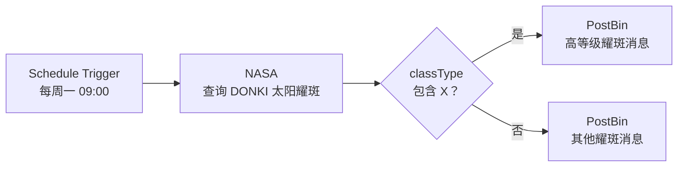

# n8n 第一个工作流实战

> **Key Takeaways（核心要点概览）**
>
> 1. 一个最小的 n8n 工作流可由 **触发器 → 数据获取 → 条件判断 → 输出** 四段构成。
> 2. 该示例每周一上午运行，查询最近七天的 NASA DONKI 太阳耀斑数据，再按耀斑等级分别发送结果。
> 3. 凭据应只保存在 n8n 的 Credentials 中；表达式可让日期等参数随每次运行动态变化。

## 笔记概览

### 知识鸟瞰

- **[概念]** 工作流：由多个节点串联的自动化过程。
- **[操作]** 用 Schedule Trigger 定时触发、NASA 节点获取数据、If 节点分流、PostBin 节点观察输出。
- **[判断]** 先在编辑器中手动执行验证，再发布为定时运行的工作流。



### 各节内容概要

| 环节 | 节点/能力 | 本例配置 | 你学到的能力 |
| --- | --- | --- | --- |
| 触发 | Schedule Trigger | 每周一 09:00 | 定时启动工作流 |
| 获取 | NASA | DONKI Solar Flare，最近 7 天 | 配置 API 凭据与请求参数 |
| 判断 | If | `classType` 包含 `X` | 基于字段进行条件分支 |
| 输出 | PostBin | 发送动态文本到两个分支 | 使用表达式查看和组织结果 |
| 运行 | Execute / Publish | 先测试，后发布 | 区分手动测试与自动运行 |

## 操作步骤

### 1. 新建工作流并配置定时触发

1. 在 n8n 新建一个空白工作流。
2. 添加 **Schedule Trigger** 节点。
3. 选择按周运行，设为 **Monday / 09:00**。

这个节点只负责决定工作流何时开始；先手动执行时不需要等到下一个周一。

### 2. 查询 NASA 太阳耀斑数据

1. 在触发器后添加 **NASA** 节点，选择 **Get a DONKI solar flare**。
2. 新建或选择 NASA API 凭据；密钥仅保存在 n8n 凭据管理中，不要写进节点说明、笔记或版本库。
3. 将 Start date 切换为表达式，并填写：

```javascript
{{ $today.minus(7, 'days') }}
```

该表达式会在每次运行时计算“今天往前七天”，因此工作流无需每周手动改日期。

### 3. 按耀斑等级分流

1. 在 NASA 节点后添加 **If** 节点。
2. 将 `classType` 字段拖入判断值。
3. 设为字符串 **Contains**，比较值填写 `X`。

`true` 分支代表本次结果中包含 X 级耀斑，`false` 分支代表其余等级。NASA 数据是实时的；如果没有 X 级结果，可临时改用 `A`、`B`、`C` 或 `M` 来练习分支效果。

### 4. 将两条分支输出到 PostBin

1. 在 `true` 分支添加 **PostBin** 节点，并新建一个临时 bin。
2. 在输出文本中使用表达式：

```text
There was a solar flare of class {{$json["classType"]}}
```

3. 复制该 PostBin 节点并连接到 `false` 分支。

PostBin 适合本教程观察 HTTP 输出。官方示例中的临时 bin 约 30 分钟后过期，因此不要把它当作长期通知或存储方案。

### 5. 测试、检查并发布

1. 依次执行节点或执行整个工作流，检查 NASA 返回字段与 If 的实际走向。
2. 打开 PostBin，确认动态文本中的 `classType` 已被实际值替换。
3. 测试成功后，点击 **Publish**，工作流便会按照周一 09:00 自动运行。

## 核心概念速查

| 概念 | 简明解释 | 本例中的作用 | 实操提示 |
| --- | --- | --- | --- |
| Workflow | 多个节点组成的自动化流程 | 串联触发、查询、判断、输出 | 从最小闭环开始搭建 |
| Credentials | API 等服务的认证信息 | 让 NASA 节点能访问数据 | 仅存于 n8n，避免明文传播 |
| Expression | 运行时计算的动态值 | 计算过去七天的开始日期、拼接输出文本 | 用节点输出中的字段名核对路径 |
| If | 根据条件选择后续路径 | 区分 X 级与其他耀斑 | 真实数据不足时换一个等级测试 |
| Publish | 使工作流按触发规则正式运行 | 启用每周自动执行 | 发布前先完成手动验证 |

## 常见问题与注意事项

- **没有走到 true 分支怎么办？** 这通常是正常的实时数据结果；将比较等级改为当前返回数据中存在的值后重新执行。
- **API Key 能否直接放在表达式里？** 不建议。应通过 Credentials 引用，避免密钥出现在导出文件、截图或笔记中。
- **为什么手动执行和定时执行都要做？** 手动执行用于验证节点配置；发布后才会按 Schedule Trigger 的周期自动运行。
- **PostBin 能替代通知工具吗？** 不能。它在这里仅用于学习和调试；生产场景应换成邮件、Slack、飞书或其他长期可用的目标节点。

## 核心要点

1. **先形成闭环，再增加复杂度：** 触发、取数、判断、输出四步足以验证一个工作流的关键机制。
2. **日期参数应动态化：** 用表达式代替固定日期，工作流才能持续复用。
3. **测试数据具有偶然性：** 外部实时接口的返回会变化，判断条件要能随数据调整。
4. **凭据与业务配置分离：** 节点使用 Credentials，笔记只记录配置方法与占位说明。

## 关联概念

- [[2. 实用工具/AI工具手册/AI短视频与漫剧制作自动化 Workflow 与 HitL 落地指南.md|AI短视频与漫剧制作自动化 Workflow 与 HitL 落地指南]]

## 参考来源

- [n8n 官方教程：Build your first workflow](https://docs.n8n.io/build-your-first-workflow/)
