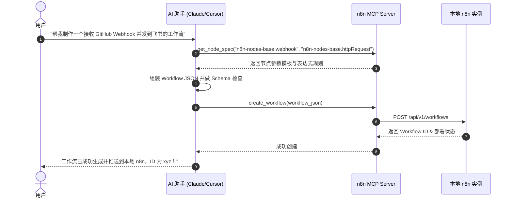

# n8n 集成 MCP 与 AI 自动工作流生成指南

## 笔记概览

### 知识鸟瞰

1. 概念与双向架构定义                  [前提·定义]
   └─ n8n 双向角色 ↔ MCP 协议支撑

2. n8n 作为 MCP Server 模式             [核心·机制]
   ├─ 节点 Spec 与 API 暴露
   └─ AI 客户端主动拉取与构建
   └─ 关系：AI 指令 ➔ MCP 工具调用 ➔ n8n 部署

3. MCP Server 配置实战                  [实践·落地]
   ├─ 社区方案 czlonkowski/n8n-mcp
   └─ 官方原生 MCP Server (v2.14+)

4. AI 制作与运维 Workflow 闭环           [实践·深化]
   └─ 需求表达 → Spec 查询 → 语法校验 → 自动发布

主线：通过将 n8n 作为 MCP Server 暴露给 AI 客户端，使 AI 拥有感知 n8n 节点规范与操作本地 API 的能力，从而实现自然语言生成、校验与部署自动化工作流的全闭环。

### 各节内容概要

| 章节/部分 | 核心内容 | 关键要点 |
| :--- | :--- | :--- |
| **1. 交互模式** | 剖析 n8n 充当 MCP Server（被 AI 控制）与 MCP Client（调用外部工具）的双向架构 | 区分控制端与被控端角色 |
| **2. 实战配置** | 详细介绍社区 `czlonkowski/n8n-mcp` 与官方原生 MCP 的配置方法 | 提供包含 API Key 与 Endpoint 的 JSON 配置 |
| **3. 生成闭环** | 阐述 AI 如何利用 MCP 执行“查规范-建结构-校验-发布”四步法 | 强调 Schema 校验避免语法错误 |
| **4. 核心概念** | 整理 MCP 交互中的关键技术词汇表 | 覆盖 Server/Client、Schema Validation 等 |
| **5. 核心要点** | 总结 AI 制作 Workflow 的行动原则与局限 | 梳理生产落地的前提条件 |

---

## n8n 与 MCP 的双向架构与交互模式

Model Context Protocol (MCP) 是连接 AI 模型与外部数据/工具的开放标准。n8n 支持以下**两种方向**的集成：

```mermaid
flowchart TD
    subgraph 模式一：n8n 作为 MCP Server（AI 生成/管理 Workflow）
        AIClient[AI 客户端\nClaude / Cursor / Antigravity] -- "1. 查询节点规范 / 部署 Workflow" --> MCPServer[n8n MCP Server\n社区版或官方原生]
        MCPServer -- "2. 调用 REST API" --> LocalN8N[本地 n8n 实例]
    end

    subgraph 模式二：n8n 作为 MCP Client（工作流内调用外部 MCP 工具）
        N8NWorkflow[n8n AI Agent Node] -- "1. 发现并调用工具" --> ExternalMCP[外部 MCP Server\nGitHub / SQL / Slack MCP]
    end
```

1. **n8n 作为 MCP Server（AI 控制 n8n）**：
   * **定位**：将 n8n 的几百种 Node 规范、凭据列表以及工作流 CRUD API 暴露给外部 AI 客户端。
   * **能力**：AI 可以直接读取 n8n 文档、生成合法的 Workflow JSON、校验参数并一键部署到本地 n8n。
2. **n8n 作为 MCP Client（n8n 扩展外部能力）**：
   * **定位**：在 n8n 工作流内部使用 `MCP Client Tool` 节点连接外部 MCP 服务器。
   * **能力**：n8n 内部的 AI Agent 无需为每个外部服务写特定代码，即可动态调用外部 MCP 提供的工具。

---

## 基于 MCP 让 AI 制作 Workflow 的配置实战

### 方案一：社区方案 `czlonkowski/n8n-mcp`（强烈推荐用于 Workflow 生成）

`czlonkowski/n8n-mcp` 是专门为“AI 编写 n8n 工作流”优化的 MCP 服务，它打包了 500+ n8n 节点的完整 Schema 与参数校验逻辑。

#### 配置步骤 (以 Claude Desktop / Cursor / Antigravity 为例)

在你的 AI 客户端 MCP 配置文件（如 `claude_desktop_config.json` 或 AI 工具的 MCP 选项）中添加以下内容：

```json
{
  "mcpServers": {
    "n8n-mcp": {
      "command": "npx",
      "args": [
        "-y",
        "n8n-mcp"
      ],
      "env": {
        "N8N_API_URL": "http://localhost:5678",
        "N8N_API_KEY": "your_n8n_api_key_here"
      }
    }
  }
}
```

* **`N8N_API_URL`**：本地或远程 n8n 实例的访问地址。
* **`N8N_API_KEY`**：在 n8n 界面 `Settings -> API` 中生成的个人访问令牌。

### 方案二：n8n 官方原生 MCP Server (v2.14+)

在较新版本的 n8n 中，系统已提供原生的 MCP 支撑：

1. 打开 n8n 控制台，进入 **Settings** ➔ **Advanced AI / MCP**。
2. 开启 **Instance MCP Server** 选项并获取专属 Token 与 SSE/HTTP Endpoint。
3. 在 AI 客户端中配置该 SSE 链接即可完成对接。

---

## AI 自动生成与更新 Workflow 的闭环流程

当 AI 客户端与 n8n MCP Server 建立连接后，自然语言制作工作流将遵循以下四步闭环：



1. **自然语言意图理解**：用户提出业务需求（如“定时抓取文章并摘要”）。
2. **规范查询 (Node Spec Lookup)**：AI 主动调用 MCP 工具查询 `Schedule Trigger` 和 `HTTP Request` 等节点的正确参数字段。
3. **结构组装与表达式校验**：AI 组装 `nodes` 和 `connections`，并按 n8n 规范写入节点表达式（如 `{{ $json.body.title }}`）。
4. **API 自动发布**：通过 MCP 提供的 API 接口将 JSON 推送到本地 n8n 数据库，实现即刻生效。

---

## 核心概念速查

| 概念 | 一句话 | 类比 | 为什么重要 |
| :--- | :--- | :--- | :--- |
| **n8n MCP Server** | 将 n8n 节点规范与 API 暴露给 AI 的服务中枢 | n8n 给 AI 颁发的“操作手册与驾驶执照” | 让 AI 具备精准操控 n8n 的底层依据，避免胡乱猜测节点参数 |
| **n8n MCP Client Tool** | n8n 节点，用于在工作流内调用外部 MCP 服务 | 工具箱里的“万能适配插件接口” | 允许 n8n 内的 AI Agent 无缝使用全网开源的 MCP 工具扩展能力 |
| **czlonkowski/n8n-mcp** | 社区构建的针对 n8n 节点 Schema 深入优化的 MCP 封装 | 内置几百个节点规格的“n8n 专家系统” | 极大提高了 AI 编写 n8n Workflow JSON 的语法正确率 |

---

## 核心要点

- **[结论]** n8n 原生且全面支持 MCP 协议，支持被 AI 控制（Server 模式）与在流程中扩展 AI（Client 模式）。
- **[机制]** 通过将 n8n 作为 MCP Server，AI 可以完成“查询节点 Specs ➔ 组装 Workflow JSON ➔ 校验参数 ➔ 调用 REST API 部署”的全自动化闭环。
- **[条件]** 使用 MCP 自动部署工作流的前提是必须开启本地 n8n 的 API 访问权限并生成有效的 `N8N_API_KEY`。
- **[限制]** 在复杂多分支流程中，建议让 AI 先输出 Workflow JSON 或可视化逻辑预览，确认无误后再授权 API 写入 n8n 实例。
- **[行动原则]** 优先推荐使用社区 `czlonkowski/n8n-mcp` 或官方 native MCP 作为客户端配置，确保 AI 掌握最新的节点字段定义。

---

## 参考来源

- [n8n Official Documentation - Accessing n8n MCP Server](https://docs.n8n.io/advanced-ai/mcp/accessing-n8n-mcp-server/)
- [GitHub Repository - czlonkowski/n8n-mcp](https://github.com/czlonkowski/n8n-mcp)
- [Model Context Protocol Specification](https://modelcontextprotocol.io/)
