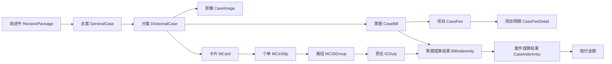

# TPA 理赔业务术语词典

这篇文档不是讲某个功能怎么写，而是把 TPA 理赔平台里最常见、最容易混淆的一批业务术语统一讲清楚。你以后看需求、看案件、看问题件、看理算结果，很多卡点本质上都不是“不懂代码”，而是“不知道同事口中的这个词到底指哪一层对象、哪一个环节、哪一种结果”。

## Key Takeaways

- 这套系统里最核心的流转对象是“分案”，不是收进件，也不是保单。
- 真正执行赔付计算的核心对象是“责任 `ICDuty`”，不是案件总金额。
- `收进件 -> 总案 -> 分案 -> 票据 -> 项目 -> 明细` 是数据对象主轴。
- `生产 -> 理算 -> 核赔 -> 保司复核/单位复核 -> 回传/返还` 是流程主轴。
- `receiveState`、`dockingMode`、`proType`、`checkRule`、`backState` 这几个字段，是你排查案件时最值得先看的几个业务字段。

## 一张对象关系图

## 一、参与方与系统术语

| 术语 | 业务含义 | 你要怎么理解 |
| --- | --- | --- |
| `TPA` | 第三方理赔服务方 | 你们公司扮演的角色，不是保险公司本身，而是承接理赔处理、录入、理算、核赔、回传等服务。 |
| `保司` | 保险公司 | 最终保险责任归属方。很多复核、问题件、回传、冻结都要和保司侧规则或核心系统联动。 |
| `投保单位` | 买团险或组织保单的单位 | 某些案件除了保司复核，还要经过投保单位复核。 |
| `事故人` | 实际出险的人 | 不一定等于申请人，也不一定等于主被保险人。 |
| `申请人` | 提交理赔申请的人 | 可能是事故人本人，也可能是家属、单位或代办人。 |
| `athena` | 生产系统 | 负责把原始资料加工成结构化案件数据。 |
| `adjustment` | 理算系统 | 负责找可理算保单/个单/责任，并算出赔付金额。 |
| `hyperion` | 核赔系统 | 负责自动核赔、人工审核、提交和后续流转。 |
| `themis` | 保司中台 | 负责保司侧复核、问题件、冻结/解冻、回传和返还。 |
| `uranus` | 外部桥接与基础服务 | 负责承载共享实体、外部系统调用、辅助信息查询。 |

## 二、案件层级术语

| 术语 | 对应对象 | 业务含义 | 常见误区 |
| --- | --- | --- | --- |
| `收进件` | `ReceivePackage` / `TrReceivePackage` | 一批案件进入平台的入口批次，带有保司、单位、进件方式、流程类型等入口配置。 | 它不是最终流转的最小案件。 |
| `总案` | `GeneralCase` | 收进件下的聚合层，一个收进件下可以拆成多个总案。 | 很多人以为总案就是最终理算对象，其实不是。 |
| `分案` | `DivisionalCase` | 真正流转、录入、理算、核赔、回传的最小案件单元。 | 日常说“这个案件”，大多数时候指的就是分案。 |
| `影像` | `CaseImage` | 案件图片或文档记录，包括发票、结算单、身份证、银行卡等。 | 影像不等于票据，很多影像只是辅助材料。 |
| `报案信息` | 案件层字段集合 | 事故人、申请人、收款人、出险信息、银行信息等。 | 报案信息不是票据信息。 |
| `票据` | `CaseBill` | 一张参与理赔判断和金额计算的账单对象。 | 一张图片不一定对应一张有效票据。 |
| `项目` | `CaseFee` | 票据下的项目层费用，例如西药费、床位费、检查费。 | 不是所有案件都开启项目层理算。 |
| `项目明细` | `CaseFeeDetail` | 项目下面更细的药品、诊疗、手术明细。 | 明细层常用于控费、风险识别、特殊规则。 |

## 三、保障与理算对象术语

| 术语 | 对应对象 | 业务含义 | 你排查时最该关注什么 |
| --- | --- | --- | --- |
| `卡片` | `MCard` | 被保险人或主被保险人的承保卡片载体。 | 能不能从这张卡找到可理算个单。 |
| `个单` | `MCInSlip` | 某个被保险人在某张保单下的个人保障记录。 | 最终额度、余额、责任生效经常落在这个层级。 |
| `属组` | `MCISGroup` | 个单下某一套责任规则的归属层。 | 属组变化会影响责任生效期和历史规则。 |
| `责任` | `ICDuty` | 真正执行赔付计算的规则单元。 | 免赔额、赔付比例、限额、分段、分组方式都在这里。 |
| `票据理算结果` | `BillIndemnity` | 某张票在某个责任下的计算结果。 | 用来回答“这张票为什么赔这么多”。 |
| `案件理算结果` | `CaseIndemnity` | 某责任在整个案件里的汇总结果。 | 用来回答“这个责任最终赔多少”。 |

## 四、流程术语

| 术语 | 业务含义 | 常见字段/状态 | 说明 |
| --- | --- | --- | --- |
| `进件` | 案件进入平台 | `receiveState` | 重点看案件是线下、拍照、对接、FTP、OCR 进来的。 |
| `生产` | 影像、OCR、录入、质检 | `0~28/38` | 把原始资料变成可理算的结构化数据。 |
| `理算` | 匹配保障并计算金额 | `31 -> 41` | 关注保单、个单、责任、票据、项目、免赔、限额。 |
| `核赔` | 对理算结果做风险判断和放行 | `41 -> 42/43/44/45` | 不只是看金额，还看风险票、资料、白名单、配置规则。 |
| `保司复核` | 保险公司再审 | `43` | 保司自己要求再看一遍，常见于特殊单位、零赔、风险案。 |
| `二次核赔` | 内部高级复核 | `44` | 命中特定金额、责任、属组或指定复核人时进入。 |
| `单位复核` | 投保单位再确认 | `45` | 某些单位有复核阈值或强制复核规则。 |
| `回传` | 把案件结果发回外部系统/保司 | `backState` | 不是结案动作，而是结果发送动作。 |
| `返还` | 案件业务闭环收尾 | `51` | 可以理解为主流程完成。 |

## 五、状态词和问题件术语

| 术语 | 状态/字段 | 业务含义 | 如何理解 |
| --- | --- | --- | --- |
| `待理算` | `31` | 生产前置校验通过，可以进入理算 | 这是生产到理算的分界点。 |
| `理算结束` | `41` | 系统算完了 | 不代表结案，也不代表已赔。 |
| `数据已人工审核` | `42` | 人工审核完成 | 后面还可能继续分到 `43/44/45`。 |
| `系统问题件` | `33` | 系统自动打成的问题件 | 更像规则自动拦截。 |
| `人工问题件` | `34` | 人工审核员打成的问题件 | 更像业务人员主动判定不能继续。 |
| `生产问题件` | `38` | 生产阶段就发现数据不合格 | 还没进入理算核赔。 |
| `冻结问题件` | `39` | 冻结/解冻或额度一致性异常 | 更偏后半段资金与额度控制问题。 |
| `用户问题件` | `40` | 需要用户侧补资料或解释 | 通常不是单纯的系统数据错误。 |
| `保司问题件处理中` | `35/36/37` | 问题件发给保司处理、延后、完成 | 说明问题已经出平台内部，进入保司链路。 |

## 六、进件与入口术语

| 术语 | 典型值 | 业务含义 |
| --- | --- | --- |
| `receiveState` | `0` | 线下收件(普通收件)。 |
| `receiveState` | `1/6/7` | 拍照收单。 |
| `receiveState` | `2/4/5` | 拍照理赔。 |
| `receiveState` | `3/8` | 对接收单。 |
| `receiveState` | `9` | 保司中台 OCR 识别。 |
| `receiveState` | `10` | FTP 进件。 |
| `proType=0` | 全流程 | 平台从进件到理算核赔都要处理。 |
| `proType=1` | 半流程 | 平台只处理部分环节，主链路会比全流程短。 |
| `dockingMode=0` | 无系统对接 | 纯平台内部处理，外部回传和核心联动少。 |
| `dockingMode!=0` | 某家保司对接 | 表示后面可能涉及保司核心、冻结、解冻、回传等联动。 |

## 七、生产侧术语

| 术语 | 业务含义 | 说明 |
| --- | --- | --- |
| `OCR` / `二维码识别` | 机器识别发票和影像字段 | 本质是预填建议，不是最终录入结果。 |
| `报案信息录入` | 录案件层字段 | 事故人、申请人、银行信息等。 |
| `票据录入` | 录发票和结算单等票据数据 | 金额、医院、日期、疾病、票据类型等。 |
| `项目录入` | 录票据下项目层费用 | 为项目层理算和控费提供基础。 |
| `数据复核` | 录入后的校验与返工 | 常见于字段缺失、金额不一致、分类错误。 |
| `质量检验` | 生产质检 | 不只是看有没有录，还看录得对不对。 |
| `外包录入` | 第三方代录 | 平台仍然保留最终校验责任。 |
| `sendFlag` | 是否发给第三方录入 | `0` 不发，`1/2` 发送给不同外包方。 |

## 八、理算侧术语

| 术语 | 业务含义 | 重点理解 |
| --- | --- | --- |
| `指定保单理赔` | 案件限定只能在指定保单集合内理算 | 不是让系统自由挑所有可赔保单。 |
| `跨投保单位理赔` | 允许跨单位找个单和责任 | 需要配置支持。 |
| `项目层理算` | 金额先拆到项目层再算 | 需要案件/对接允许且责任 `openFeeCalc = 1`。 |
| `票据分组方式` | `billGroupMode` | 决定按次、按日、按疾病、按住院周期等口径累计。 |
| `免赔额` | 扣完后剩余部分才赔 | 常见有按次免赔、累计免赔。 |
| `赔付比例` | 对可赔金额再乘比例 | 例如 80%、90%、100%。 |
| `责任余额` | 该责任还剩多少可赔额度 | 很多“为什么少赔”都和余额有关。 |
| `共享额度` | 多个责任共用一份额度 | 一个责任赔了，另一个责任可赔余额会受影响。 |
| `非责任扣除` | 不属于保险责任的扣减 | 常表现为 `notDutyDeductionAmount`。 |
| `特殊扣减` | 定制规则导致的额外扣减 | 常表现为 `specialDeductionAmount`。 |
| `余额不足扣减` | 因责任余额不足而被扣减 | 常表现为 `lackBalanceDeductionAmount`。 |
| `责任调整` | 后置规则导致的金额调整 | 常表现为 `adjustmentAmount`。 |

## 九、核赔与结案字段速查

| 字段 | 业务含义 | 常见值 |
| --- | --- | --- |
| `checkRule` | 自动核赔结果 | `0` 不需要自动核赔；`1` 已开通但未判定；`2` 需人工；`3` 自动通过。 |
| `backState` | 案件回传状态 | `0` 不需要；`1` 需要且等待回传；`2` 已回传；`3` 部分回传。 |
| `doubtBackState` | 问题件回传状态 | `0` 不需要；`1` 等待回传；`2` 已回传。 |
| `haveWrongState` | 是否经历过问题件 | `0` 未经历；`1` 亿保系统问题件；`2` 保险公司问题件。 |
| `oldState` | 问题件前的原状态 | 用来判断案件是从哪一步退回来的。 |
| `refused` | 赔付还是拒付 | `0` 赔付；`1` 拒付。 |
| `remitState` | 打款状态 | `0` 不需要；`1` 需要；`2` 已导出打款批次；`3` 已打款。 |
| `returnReceiptFlag` | 票据返还标志 | `0` 不返还；`1` 处理完成后返还票据；`2` 需要回销。 |
| `inputFinishFlag` | 录入完成标志 | `0` 否；`1` 是。 |

## 十、金额字段速查

| 字段 | 业务含义 | 适合拿来回答什么问题 |
| --- | --- | --- |
| `originCalcIndemnityAmount` | 原始理算赔付金额 | 系统初步理算出的赔付口径。 |
| `calcIndemnityAmount` | 理算赔付金额 | 当前理算阶段输出的金额。 |
| `checkIndemnityAmount` | 审核赔付金额 | 人工审核或复核后确认的金额。 |
| `realIndemnityAmount` | 实际赔付金额 | 最终业务上认定的实际赔付金额。 |
| `onaccountAmount` | 挂账金额 | 部分金额未进入正常赔付闭环时关注。 |

## 十一、最容易混淆的概念对照

| 概念 A | 概念 B | 关键差别 |
| --- | --- | --- |
| 收进件 | 分案 | 收进件是入口批次，分案是实际流转单位。 |
| 保单 | 个单 | 保单是保障框架，个单是个人可理算保障记录。 |
| 属组 | 责任 | 属组是规则归属层，责任是实际赔付执行单元。 |
| OCR 识别 | 人工录入 | OCR 是预填，人工录入才是最终业务数据。 |
| 理算结束 | 返还 | 理算结束只是算完，返还是业务闭环完成。 |
| 回传 | 返还 | 回传是把结果发出去，返还是案件流程收尾。 |
| 系统问题件 | 生产问题件 | 前者多发生在理算/核赔规则判断，后者发生在生产阶段。 |
| 保司复核 | 单位复核 | 一个是保险公司再审，一个是投保单位再确认。 |
| 自动核赔 | 人工审核 | 一个靠规则批量筛案，一个靠人工确认复杂风险。 |

## 十二、你以后看案子时的术语使用顺序

1. 先确认案件现在说的是收进件、总案还是分案。
2. 再确认当前讨论的是生产、理算、核赔、回传还是问题件。
3. 如果在算钱，先问是保单层、个单层、责任层、票据层还是项目层。
4. 如果在看异常，先区分是生产问题件、系统问题件、人工问题件、保司问题件还是冻结问题件。
5. 如果在看状态，优先看 `state`、`checkRule`、`backState`、`haveWrongState`、`oldState`。

## 需确认

- 你们日常口语里的“博司/博识”具体是指哪一个外部能力、哪条业务链路，还需要再结合真实业务叫法确认。
- 个别保司会把同一业务词汇用成自己的口径，例如“复核”“调查”“中台审核”，落地时仍要以具体保司配置为准。
