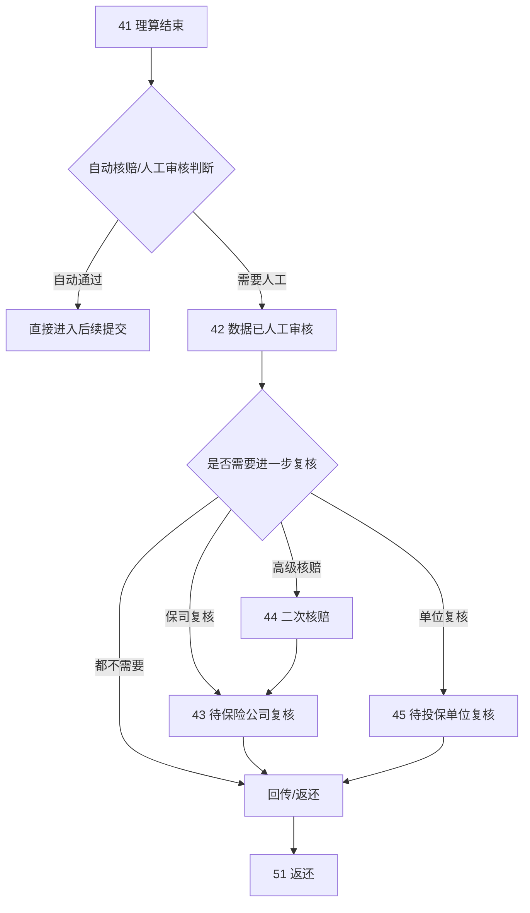

# 核赔、复核、回传与结案分流

这篇文档专门讲理算之后的事情：为什么有的案件理算结束后就能往前走，有的会进人工审核，有的还要保司复核、二次核赔、投保单位复核，最后又是怎么回传和返还的。

## Key Takeaways

- `41 理算结束` 只是“系统算完”，不是“业务彻底结束”。
- `hyperion` 重点负责自动核赔判断、人工审核提交和后续流转。
- `themis` 重点负责保司中台视角的复核、问题件、冻结/解冻、回传与返还。
- 自动核赔是否通过，不只看金额，还看风险票、废票、假票、明细关键字、影像类型、VIP、免责列表等很多条件。

## 一、理算结束之后会面临哪些分流

## 二、系统如何判断“自动核赔”还是“人工审核”

这块核心逻辑主要在 `hyperion` 的 `CaseClaimValidationService`。

## 1. 系统先看案件有没有明显高风险

只要命中高风险，系统就会把自动核赔打成“否”，进入人工审核。

从当前代码里能直接确认的高风险因素包括：

- 录入人员错误率高
- 保单配置了“全部人工审核”
- 理赔金额大于等于配置阈值
- 理赔金额小于等于 `0`
- 存在重复票风险
- 存在假票或未校验票据
- 审核结论包含指定关键字
- 命中人工审核脚本
- 增值税发票药品名称或药品数量受限

## 2. 新版人工质检判断更细

在 `needManual(...)` 逻辑里，还会继续看这些条件：

| 触发点 | 业务解释 |
| --- | --- |
| 红冲票 | 发票冲红，风险高 |
| 重复票风险 | 同票重复报销风险 |
| 废票 | 已判定无效票据 |
| 假票/未查验票 | 票据真伪风险 |
| 未参与理算票据 | 案件里有票没有真正进入理算 |
| 黑名单医院 | 命中医院限制 |
| 明细控费风险 | 明细层已被标风险 |
| 零赔案件 | 赔付金额为 0 |
| 命中人工质检明细名称 | 例如特定药品、诊疗项目 |
| VIP 案件 | 高价值/高关注案件 |
| 案件备注/注意事项 | 有特殊说明 |
| 非责任扣除金额 >= 票据总金额 | 赔付口径异常 |
| 命中医院名称关键字 | 例如废票关键字 |
| 存在免责列表 | 免责风险 |
| 发票数量/影像数量超限 | 案件复杂度超限 |
| 实际赔付金额超限 | 金额复杂度超限 |
| 票据总金额超限 | 金额复杂度超限 |
| 缺少指定影像类型 | 资料不完整 |
| 特殊人员案件 | 人员标签风险 |
| 存在结算单影像 | 默认强制人工审核，除非配置放开 |
| 票据白名单未命中 | 例如疾病代码、收据类型、病种类型、医院等级/性质不在白名单 |

可以看到，自动核赔本质上是“批量风险过滤”。不是说系统会完全像人工一样理解案件，而是先把简单、低风险、规则明确的案子筛出去。

## 3. `checkRule` 是案件级自动核赔结果

分案实体上的 `checkRule` 很关键：

| 值 | 业务含义 |
| --- | --- |
| `0` | 不需要自动核赔 |
| `1` | 开通自动核赔但还没判定 |
| `2` | 开通自动核赔且需要人工核赔 |
| `3` | 开通自动核赔且不需要人工核赔 |

这意味着你以后看一个案子“为什么没自动过”，先看 `checkRule` 就能知道它是在“没开通”“还没判”“判定必须人工”还是“本来可以自动过”。

## 三、人工审核之后为什么还会继续分流

人工审核完成，只说明“内部第一层审核做完了”，不代表后面没人看。

后续还可能分到三类：

### 1. 高级核赔 / 二次核赔 `44`

这是一种内部更高层级的复核。

当前代码能确认，它可以按这些条件配置：

- 指定高级复核人
- 命中指定属组
- 命中指定责任
- 命中指定审核人
- 命中金额下限

所以它不是“所有案件都走”，而是命中特定配置才会进入。

### 2. 保险公司复核 `43`

保单配置里可以直接要求案件进入保司复核：

- `needAgentReview = 1`

典型场景是：

- 某些保司要求自己再看一遍
- 某些零赔/特殊赔付/拒付案件必须保司确认
- 某些项目或单位有特定复核门槛

### 3. 投保单位复核 `45`

有些业务不是只让保司看，还要让投保单位确认。这通常出现在：

- 单位关心员工报销合理性
- 单位需要在赔前再做一层业务确认

## 四、问题件在核赔阶段怎么分

核赔阶段的问题件和生产阶段的问题件不是一回事。

### 核赔阶段常见问题件

- 系统问题件 `33`
- 人工问题件 `34`
- 问题件待保险公司处理 `35`
- 问题件保险公司延后处理 `36`
- 问题件保险公司处理完成 `37`
- 冻结问题件 `39`
- 用户问题件 `40`

### 业务理解

- `33` 更像系统自动拦截
- `34` 更像人工明确认为当前案子不能直接通过
- `35/36/37` 表示问题已经发到保司侧处理
- `39` 常和金额冻结/解冻一致性相关
- `40` 更像需要面向用户或客户侧补动作

## 五、为什么核赔会关心冻结和解冻

一旦案件进入赔付确认、保司复核、回传等后半段，系统不只是在“看金额”，而是在“占额度、锁额度、扣额度”。

这时就会出现：

- 冻结成功，后续再扣减
- 冻结失败，需要异常兜底
- 业务打回时，需要解冻
- 外部接口异常，内部状态和外部冻结状态可能不一致

因此 `themis` 里会有很多：

- 冻结
- 解冻
- 冻结记录号
- 外部核心接口调用

这说明核赔后半段已经不是单纯判断逻辑，而是和真实额度占用强绑定。

## 六、回传是什么，和返还有什么区别

### 回传

回传是把案件结果、责任结果、影像或报文回传给外部系统或保司。

代码里你会看到：

- `backState`
- `ClaimFileLog`
- `ClaimFileDetail`
- `ReturnCase`

它们说明回传不是一个简单的“发消息”，而是一整套可重传、可失败、可部分回传的机制。

### 返还

返还是案件在业务上的闭环动作，对应状态 `51`。

所以理解上可以记成：

- 回传是“把结果发出去”
- 返还是“案件流程收尾”

## 七、结案前你最容易误判的几个点

### 1. `41` 不是结案

它只是理算结束。

### 2. `42` 也不一定马上结束

人工审核后，还可能去 `43/44/45`。

### 3. 已回传不代表一定已返还

回传和返还是两个动作。

### 4. 问题件处理完成也不代表直接结束

很多案件在 `37` 之后还要重新回主链路继续推进。

## 八、你以后看核赔侧案件时的最小排查顺序

1. 看当前状态是 `41/42/43/44/45/51` 中哪一个。
2. 看 `checkRule`，判断自动核赔结果。
3. 看人工审核原因或自动核赔拒绝原因。
4. 看保单配置是否要求保司复核、高级复核、单位复核。
5. 看是否经历过问题件，尤其是 `35/36/37/39/40`。
6. 看有没有冻结、解冻、回传失败或部分回传。

## 九、你可以怎么把这块记住

一句话版：

`adjustment` 负责“算出来”，`hyperion` 负责“先筛一遍和提交流转”，`themis` 负责“保司侧继续看、继续控、继续推到闭环”。

## 需确认

- 不同保司在“拒付是否直接返还”“零赔是否必复核”“问题件是否自动重传”上的差异，还需要结合真实业务规则进一步核对。
- 冻结/解冻的外部系统细节很多是保司定制，这里只讲了公共业务意义，没有展开到每家保司接口差异。
