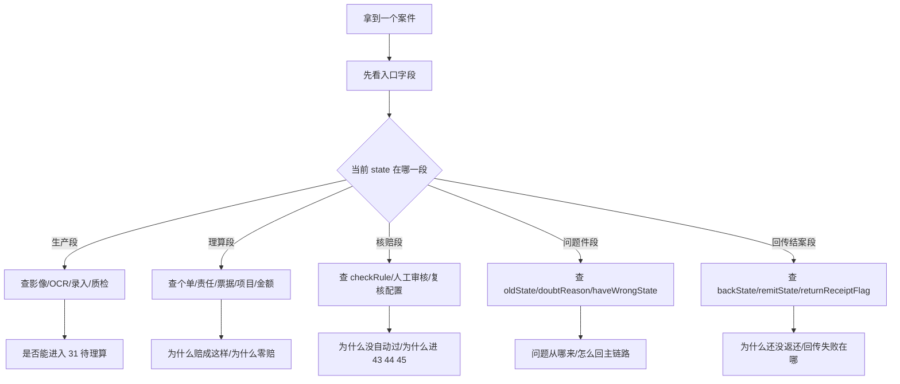
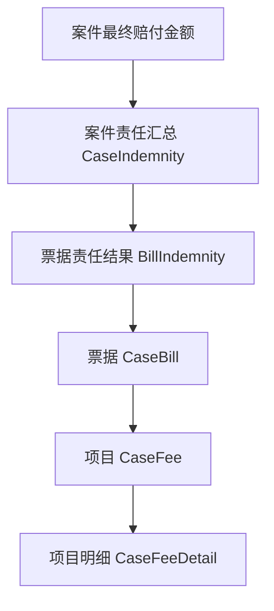

# 案件排查与诊断手册

这篇文档的目标非常直接：当你拿到一个真实案件，想知道“它为什么卡在这里”“为什么赔成这样”“为什么没自动过”“为什么没回传”，应该先看什么、按什么顺序看。它不是概念解释，而是一份实战排查手册。


## Key Takeaways

- 真正高效的排查，不是到处翻页面，而是先抓一组关键字段。
- 你几乎永远都应该先看：`state`、`oldState`、`receiveState`、`proType`、`dockingMode`、`checkRule`、`backState`、`haveWrongState`。
- 案件排查通常分成三条线：状态线、金额线、异常线。
- 先判断“它在哪条主链路上”，再判断“它为什么偏离主链路”。

## 一张排查决策图



## 一、拿到案件先抓哪些字段

## 1. 最小字段清单

| 字段 | 为什么先看它 |
| --- | --- |
| `divisionalCaseNo` | 分案号是所有排查的主键。 |
| `state` | 当前到底卡在哪个阶段。 |
| `oldState` | 如果是问题件或回退案，能看出它从哪掉出来。 |
| `receiveState` | 进件方式决定前半段路径。 |
| `proType` | 全流程还是半流程。 |
| `dockingMode` | 后半段是否有保司对接复杂度。 |
| `checkRule` | 自动核赔结果。 |
| `backState` | 回传有没有发出去。 |
| `haveWrongState` | 是否经历过问题件。 |
| `realIndemnityAmount` | 最终业务赔付金额。 |
| `refused` | 当前是赔付还是拒付。 |
| `remitState` | 打款到哪一步了。 |
| `returnReceiptFlag` | 是否还有票据返还/回销动作。 |

## 2. 先把案件粗分到五大类

| `state` 范围 | 你该怎么理解 |
| --- | --- |
| `0~28` | 生产前半段 |
| `31` | 待理算 |
| `41~45` | 理算后与核赔/复核段 |
| `33~40` | 问题件段 |
| `51` | 返还闭环段 |

## 二、状态线排查

## 1. 如果案件卡在生产段

优先问这几个问题：

1. 这是哪种进件方式？
2. 有没有文档影像阶段？
3. 现在卡在影像、OCR、报案录入、票据录入、质检还是事故人检查？
4. 有没有被第三方录入回传失败打回？

### 生产段诊断表

| 当前状态 | 优先怀疑什么 |
| --- | --- |
| `5` 影像分类 | 图片分类错、重切、材料顺序混乱 |
| `9` 二维码识别 | OCR 预填不可信、字段清洗没通过 |
| `10/11` 报案信息/数据录入 | 录入不完整、票据字段缺失 |
| `21/22/25` 检查/复核/质检 | 数据质量不过、字段矛盾、第三方回传异常 |
| `23/24` 事故人/投保人审核 | 人员关系、卡片、保单匹配问题 |

## 2. 如果案件卡在 `31 待理算`

这通常意味着：

- 生产大体过关了
- 但理算还没真正跑完或者被前置校验拦住

优先查：

- 有无有效卡片
- 有无可理算个单
- 是否指定保单
- 银行信息、疾病信息、主被关系是否满足理算前校验

## 3. 如果案件卡在 `41~45`

先不要直接问“为什么没结案”，先问：

- 是刚理算结束，还是已经人工审核完
- 是不是进了二次核赔
- 是不是进了保司复核
- 是不是进了单位复核

### 核赔段诊断表

| 当前状态 | 核心问题 |
| --- | --- |
| `41` 理算结束 | 系统算完了，为什么还没自动过？ |
| `42` 数据已人工审核 | 人工审完了，后面还要不要继续复核？ |
| `43` 待保险公司复核 | 为什么必须让保司再看？ |
| `44` 二次核赔 | 为什么进入高级复核？ |
| `45` 待投保单位复核 | 为什么还要让单位确认？ |

## 4. 如果案件卡在问题件段

优先查：

- `oldState`
- `doubtReason`
- `haveWrongState`
- 是系统问题件、人工问题件、保司问题件、冻结问题件还是用户问题件

## 5. 如果案件卡在返还前

优先查：

- `backState`
- `doubtBackState`
- `remitState`
- `returnReceiptFlag`

因为这已经不是“能不能赔”的问题，而是“结果有没有成功落地”的问题。

## 三、金额线排查

当用户问“为什么赔这么少/这么多/为什么是零赔”时，不要先盯总金额，要按层级拆。

## 1. 先按五层拆



## 2. 金额排查顺序

1. 先看最终理算到了哪些个单。
2. 再看命中了哪些责任。
3. 再看每个责任下匹配了哪些票据。
4. 再看责任有没有开启项目层理算。
5. 再看免赔额、限额、责任余额、共享额度、特殊扣减。

## 3. 常见金额异常和优先怀疑点

| 现象 | 优先怀疑什么 |
| --- | --- |
| 赔付金额为 0 | 医保/自费/免赔后已无可赔金额，或责任不生效，或余额不足。 |
| 比预期少很多 | 责任余额、共享额度、特殊扣减、非责任扣除。 |
| 同票据逐张加总和案件总额对不上 | 多责任汇总、项目层拆分、四舍五入、最后一票调差。 |
| 某票没参与理算 | 票据类型与责任不匹配、票据无效、已废票。 |
| 项目金额和票据金额理解不一致 | 开启了项目层理算。 |

## 四、自动核赔线排查

当用户问“为什么没自动过”时，优先看 `checkRule`。

| `checkRule` | 业务含义 |
| --- | --- |
| `0` | 不需要自动核赔 |
| `1` | 开通自动核赔但未判定 |
| `2` | 已判定需要人工核赔 |
| `3` | 已判定无需人工核赔 |

## 1. `checkRule = 2` 时先查什么

- 赔付金额是否超过阈值
- 是否有重复票、假票、未校验票
- 是否有零赔
- 是否命中医院/影像/明细白名单限制
- 是否保单配置全部人工审核

## 2. 为什么人工审核后还会继续流转

因为人工审核不是最终一层，它后面还可能继续分到：

- `44` 二次核赔
- `43` 保司复核
- `45` 单位复核

## 五、问题件线排查

## 1. 先判断问题来自哪条主线

| 问题件类型 | 先回看哪条主线 |
| --- | --- |
| `38` 生产问题件 | 影像、OCR、录入、质检 |
| `33` 系统问题件 | 理算前校验、理算规则、核赔规则 |
| `34` 人工问题件 | 人工审核意见 |
| `39` 冻结问题件 | 冻结/解冻、时效挂起、额度控制 |
| `40` 用户问题件 | 用户补件、影像错误、票据图像问题 |

## 2. 最有价值的问题件字段组合

```text
state + oldState + doubtReason + haveWrongState
```

你只要先把这四个字段看明白，往往就已经理解了一半。

## 六、回传与结案线排查

## 1. 为什么案件已经审完了还没结束

因为后半段还有这些动作：

- 回传
- 冻结/解冻
- 打款
- 票据返还/回销

## 2. 后半段字段速看

| 字段 | 你可以据此判断什么 |
| --- | --- |
| `backState` | 案件结果是否回传出去 |
| `doubtBackState` | 问题件结果是否回传出去 |
| `remitState` | 打款是否还没做、已导批次还是已打款 |
| `returnReceiptFlag` | 是否还有票据返还或回销动作 |

## 七、三个最常见的业务提问，应该怎么查

## 1. “这个案子为什么还在系统里没结束？”

先查：

1. `state`
2. `backState`
3. `remitState`
4. `returnReceiptFlag`
5. 是否处于 `43/44/45/39`

## 2. “这个案子为什么赔这么少？”

先查：

1. `realIndemnityAmount`
2. 命中责任
3. 是否项目层理算
4. 免赔额、限额、余额、共享额度
5. 非责任扣除和特殊扣减

## 3. “这个案子为什么没自动核赔通过？”

先查：

1. `checkRule`
2. 人工审核原因
3. 自动核赔规则命中项
4. 票据风险和影像完整性

## 八、你以后做排查时的推荐顺序

1. 先定入口：`receiveState/proType/dockingMode`
2. 再定阶段：`state`
3. 再看有没有偏离主链路：`oldState/haveWrongState`
4. 再看金额或审核：`realIndemnityAmount/checkRule`
5. 最后看后半段落地：`backState/remitState/returnReceiptFlag`

## 九、最容易犯的排查错误

| 错误 | 为什么错 |
| --- | --- |
| 一上来就看金额 | 你可能连它为什么还没到金额稳定阶段都没搞清楚。 |
| 只看当前状态 | 不看 `oldState` 根本看不懂问题件和回退案。 |
| 只看页面文案 | 不看关键字段会漏掉入口配置和后半段动作。 |
| 看到 `41` 就当结案 | `41` 只是理算结束。 |

## 需确认

- 某些保司对回传失败、部分回传、打款批次和票据返还的业务口径差异较大，具体排查动作还要结合该保司定制。
- 页面上实际展示的字段名、按钮名和数据库/实体字段名可能不完全一致，现场排查时要做一下映射。
