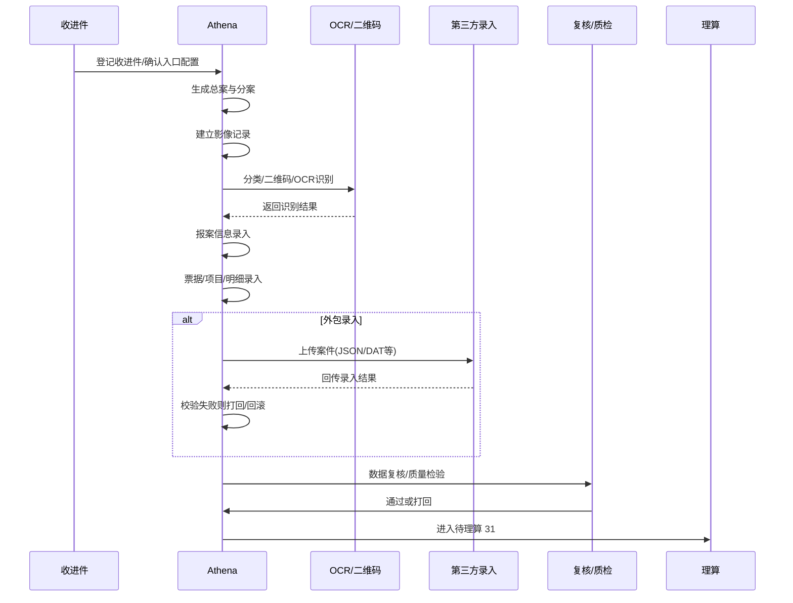

# 案件生产系统的全过程

这篇文档专门讲 `athena` 这一侧的业务：案件进件后，怎么变成可理算的结构化数据。你可以把它理解成“理算前的生产流水线”。

## Key Takeaways

- 生产系统的核心任务，是把原始资料变成结构化案件数据，而不是直接算赔付。
- 它处理的重点是：影像、OCR、二维码、报案信息、票据、项目、明细、外包录入、质检和打回。
- 生产阶段结束的理想目标，是让案件进入 `31 待理算`，并且票据/报案信息已经足够干净。

## 生产主链路总图

## 一、进件时系统先拿到什么

生产系统最先依赖的是收进件信息。

收进件里最关键的业务字段是：

- 来自哪家保险公司
- 来自哪种进件方式
- 当前是否指定保单
- 当前是全流程还是半流程
- 是否需要影像文档阶段
- 预估录入完成时间、预估核赔完成时间

这些信息会直接影响：

- 是否要先扫描/分类
- 是否直接进 OCR
- 是否要走外包录入
- 是否要录报案信息
- 后续能不能直接进入投保人审核

## 二、生产处理的起点不是“录入”，而是“影像”

### 1. 影像先入库

生产开始时，系统会先为案件建立影像记录。代码里可以看到，某些场景会在状态切换到二维码识别前就提前把 `CaseImage` 记录插入。

这一步的本质是：

- 先把这案子“有哪些图片”固定下来
- 每张图片有自己的影像序号、版本、分类结果、识别结果
- 后续所有票据和 OCR 字段都要回挂到影像

### 2. 先分清“影像类型”，后面才知道怎么录

不是所有图片都是发票。

生产系统里，图片可能是：

- 发票/票据
- 结算单
- 报案材料
- 身份证/银行卡
- 其他证明材料

影像类型分错，后面就会连带造成：

- OCR 识别字段错位
- 报案字段缺失
- 票据和影像对不上
- 最终被打回重切

## 三、二维码识别 / OCR 在生产里起什么作用

### 1. 它不是最终录入结果，而是“机器预填”

`OcrRecognitionResultService` 做的事情不是直接决定案件内容，而是：

- 读取某张影像的 OCR 识别结果
- 按字段组整合
- 只挑可信度更高、字段更完整的一组结果
- 和历史票据数据联动
- 再把可带出的字段带给录入界面

所以业务上要这样理解：

- OCR 是“预录入建议”
- 人工录入才是最终业务数据
- OCR 不完整或医院编码匹配不上时，字段还会被主动清掉，避免错带

### 2. OCR 不只是看文字，还会做业务清洗

例如系统会做这些处理：

- 医院名称有了，但医院 ID/医院代码没匹上，则医院整组信息移除
- 根据票据号回带历史票据信息
- 对发票真伪、自信度、字段组完整性做选择

所以你以后看到“为什么 OCR 明明识别到了，页面却没带出来”，通常不是 OCR 没识别，而是业务清洗阶段故意不让它带出。

## 四、报案信息录入和票据录入是两条并行但相关的线

### 1. 报案信息

报案信息是案件层数据，典型包括：

- 事故人信息
- 申请人信息
- 出险信息
- 收款人和银行信息

这部分录错，后面常见后果是：

- 无法通过事故人检查
- 无法通过投保人审核
- 回传前银行信息校验失败
- 直接进入问题件

### 2. 票据与项目明细

票据录入不只是“录发票号和金额”，还会延伸到：

- 票据类型
- 就诊日期 / 入出院日期
- 医院名称和医院代码
- 疾病编码 / 疾病名称
- 项目层费用
- 项目明细，例如药品通用名、手术名称、手术代码

这些数据决定后续理算能不能正确匹配责任与公式。

## 五、外包录入是怎么插进主链路的

### 1. Athena 会把案件发给第三方录入

当案件状态切到 `14 待上传第三方录入` 后，系统会触发消息，把案件发给外包录入方。

从代码里能看到比较典型的做法是：

- 上传案件主数据和影像索引
- 使用 JSON / DAT 这一类文件做收发握手
- 案件状态变成 `15 已上传第三方录入`

### 2. 第三方回传后，不是直接成功，而是先校验

第三方回传的数据回来以后，生产系统会继续做：

- 报案信息是否有
- 票据信息是否有
- 影像排序是否合理
- 是否有重复票据
- 是否要自动转生产问题件
- 是否需要进入事故人检查或投保人审核

如果校验失败，系统会：

- 生成失败回执
- 执行回滚
- 把案件打回第三方或打回重切

这说明一个关键点：

- 外包录入只是“代录”
- 业务责任并没有转移
- 最终是否能进理算，仍由平台自己的校验规则决定

## 六、生产阶段的“打回”主要有三种

### 1. 打回重切

常见触发：

- 图片分类错误
- 图片不清晰
- 影像和票据绑定错位

这类会让案件回到 `5 影像分类` 附近重做。

### 2. 打回第三方录入

常见触发：

- 回传票据缺失
- 回传报案信息缺失
- 字段不满足平台校验
- 重复票风险或其他关键风险

### 3. 进入生产问题件

这意味着问题还没上升到理算核赔逻辑，而是在生产阶段就已经判定“数据不合格，不能继续”。

## 七、生产阶段常见的业务校验点

从 `CaseValidationService` 和 `CaseBillService` 的逻辑看，生产阶段会非常关注这些点：

- 票据号是否必填
- 票据类型是否必填
- 票据金额是否和项目金额匹配
- 医院代码、医院名称是否为空
- 疾病编码和疾病名称是否为空
- 银行信息是否录全
- 事故人和主被信息是否匹配卡片
- 是否存在重复票
- 某些保司定制的手术名称、手术代码、医保结构字段是否录全

也就是说，生产不是在“补美观字段”，而是在清掉会直接影响理算、核赔、回传的结构性错误。

## 八、生产阶段结束时，应该沉淀出什么

一个可以进入理算的案件，至少应该沉淀出这些东西：

| 层级 | 产物 |
| --- | --- |
| 案件层 | 分案、报案信息、事故人/申请人/银行信息 |
| 影像层 | 影像记录、影像类型、影像排序、OCR 结果 |
| 票据层 | 发票号、票据类型、医院、日期、金额、疾病信息 |
| 项目层 | 项目名称、项目金额、项目分类 |
| 明细层 | 药品/诊疗/手术等关键明细 |
| 风险层 | 重复票、假票、废票、录入错误、问题件原因 |

## 九、你要怎么理解“博识/博司获取信息”

从 `uranus` 里的 `BoShiServiceImpl` 命名看，系统具备至少两类外部查询能力：

- `patientScreen`
- `getReceiptInfoDetail`

从业务语义上看，它更像是：

- 外部患者/就诊信息查询
- 外部票据详情补充

但仅凭当前代码命名，无法百分百确认它就是你口中的“博司”全链路场景。因此这里给出的稳妥理解是：

- 生产系统不是完全闭门造车
- 某些字段和详情会通过外部服务补充或核验
- 这类能力更偏“信息增强”或“辅助校验”，不替代主录入流程

## 十、生产系统最核心的业务价值

如果只用一句话概括生产系统的价值，就是：

它负责把“原始理赔资料”加工成“理算和核赔能真正消费的结构化案件”。

换句话说：

- 理算关心“怎么算”
- 核赔关心“让不让过”
- 生产关心“数据能不能拿来算、拿来审”

## 需确认

- “博司/博识”在你们业务口径里的准确中文名称、使用场景和接入范围，还需要结合真实业务说明再核对。
- 不同第三方录入商，例如云景、医数，具体字段边界和回执协议可能不同，这里只写了公共逻辑。
