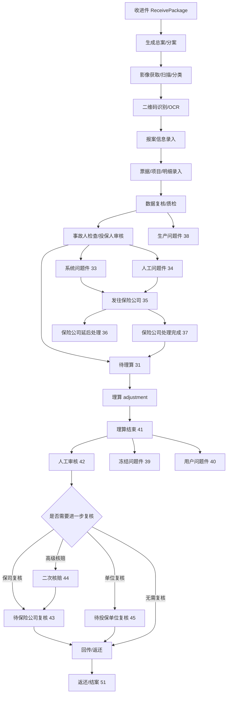

# 案件生命周期以及流程

这篇文档回答一个最核心的问题：一个案件从进件到结案，平台里到底经历了哪些阶段，哪些阶段是生产在处理，哪些阶段是理算和核赔在处理，哪些地方会被打成问题件或退回重做。

[TOC]

## Key Takeaways

- 在这套 TPA 系统里，真正流转的核心对象是“分案”。
- 一个分案通常会经历：收进件 -> 影像/录入 -> 理算 -> 核赔/复核 -> 回传/返还。
- `33/34/35/36/37/38/39/40` 这批状态基本都属于“问题件或异常分支”。
- `41` 只是理算结束，不等于真的完全结案；后面还可能走人工审核、保司复核、投保单位复核、冻结/回传。

## 一张总图

## 先把“案件层级”想清楚

### 1. 收进件

收进件是案件进入平台的入口批次，记录了这批业务是从哪家保险公司、哪种渠道、哪张保单、哪个投保单位进来的。

代码里它主要对应：

- `ReceivePackage` / `TrReceivePackage`
- 关键字段：`policyId`、`policyNo`、`unitId`、`unitName`、`dockingMode`、`receiveState`、`proType`

### 2. 总案

总案是收进件下面的聚合层，一个收进件可以拆成多个总案。

### 3. 分案

分案才是平台真正拿来流转、录入、理算、核赔、回传的核心对象。你日常排查、看状态、看金额、看问题件，基本都落在分案。

## 案件主状态

下面这个表是最值得记住的状态脉络。状态码来自公共 `CaseStatus` 枚举。

| 状态码 | 状态名 | 业务含义 | 主要责任系统 |
| --- | --- | --- | --- |
| `0` | 待扫描 | 线下或文档型进件刚进来，还没开始生产处理 | `athena` |
| `5` | 影像分类 | 影像已入库，等待分类或重切 | `athena` |
| `7` | 图片审核 | 影像待审核 | `athena` |
| `8` | 自动整件 | 自动处理影像和票据信息 | `athena` |
| `9` | 二维码识别 | 进入 OCR/二维码识别前后的一段生产状态 | `athena` |
| `10` | 报案信息 | 报案基础信息录入 | `athena` |
| `11` | 数据录入 | 票据、项目、字段录入主环节 | `athena` |
| `14` | 待上传第三方录入 | 准备发给外包录入方 | `athena` |
| `15` | 已上传第三方录入 | 已发给外包方等待回传 | `athena` |
| `21` | 待事故人检查 | 录入校验通过，待下一步业务检查 | `athena` |
| `22` | 数据复核 | 录入有疑点，需要复核 | `athena` |
| `23` | 待投保人审核 | 事故人检查通过，进入投保人/保单匹配审核 | `athena` |
| `26` | 报案复核 | 报案信息层面的复核 | `athena` |
| `31` | 待理算 | 已通过生产前置校验，可以进入理算 | `adjustment` |
| `33` | 系统问题件 | 系统自动判断当前案件不能继续，需要问题件处理 | `adjustment` / `hyperion` |
| `34` | 人工问题件 | 人工打成问题件 | `hyperion` / `themis` |
| `35` | 问题案件待保险公司处理 | 已把问题件发给保险公司 | `themis` |
| `36` | 问题案件保险公司延后处理 | 保司暂缓处理问题件 | `themis` |
| `37` | 问题案件保险公司处理完成 | 保司完成处理，案件可继续推进 | `themis` |
| `38` | 生产问题件 | 还没到理算核赔，生产阶段就发现问题 | `athena` |
| `39` | 冻结问题件 | 金额冻结相关的异常分支 | `hyperion` / `themis` |
| `40` | 用户问题件 | 需要面向用户侧处理的异常分支 | `hyperion` / `themis` |
| `41` | 理算结束 | 理算结果已经出来 | `adjustment` |
| `42` | 数据已人工审核 | 人工审核完成 | `hyperion` |
| `43` | 待保险公司复核 | 还要过保司复核 | `themis` / `hyperion` |
| `44` | 二次核赔 | 内部高级核赔/高级复核 | `themis` / `hyperion` |
| `45` | 待投保单位复核 | 还要过投保单位复核 | `hyperion` |
| `51` | 返还 | 基本可视为业务闭环完成 | `themis` / `hyperion` |
| `99` | 作废 | 案件或流程作废 | 各系统 |

## 生命周期分阶段理解

## 第一阶段：案件进入平台

这一阶段的核心问题不是“赔多少”，而是“案子能不能被系统接住”。

主要动作包括：

- 收进件登记
- 确认属于哪家保司、哪个投保单位、哪种进件方式
- 是否指定保单
- 是否全流程/半流程
- 是否需要影像文档阶段

### 常见进件方式

进件方式来自 `ReceiveStateEnum`，典型包括：

| 进件方式 | 含义 |
| --- | --- |
| `0` 线下收件 | 纸质或普通线下进件 |
| `1/6/7` 拍照收单 | 来自亿保、中邮或保司的拍照收单 |
| `2/4/5` 拍照理赔 | 员工或第三方在线提交的拍照理赔 |
| `3/8` 对接收单 | 外部系统直连进入 |
| `9` 中台 OCR 识别 | 中台 OCR 方式接入 |
| `10` FTP 进件 | 通过 FTP 批量传入 |

## 第二阶段：生产处理

生产处理的目标是把“原始影像/资料”变成“结构化案件数据”。

这里通常会经历：

- 影像扫描或入库
- 影像分类
- OCR / 二维码识别
- 报案信息录入
- 票据和项目录入
- 质检、复核、打回重做

如果在这个阶段发现影像不清晰、分类错误、字段不全、外包回传不合格，案件会先在生产链路被打回，而不是直接进入理算。

## 第三阶段：理算

理算阶段的目标是回答：

- 这个案件能赔吗
- 能理算到哪些保单/个单
- 对应哪些责任
- 每张票、每个项目、每个责任分别赔多少

理算成功后，分案通常会进入 `41 理算结束`。

但要注意：

- `41` 不代表“已赔付”
- `41` 只是“系统算完了”
- 后面还有核赔、复核、冻结、回传、返还等环节

## 第四阶段：核赔与复核

理算结束后，系统会根据自动核赔规则、人工审核规则、保司复核规则、投保单位复核规则，决定案件往哪条路走。

典型分流：

- 自动核赔通过，直接进入后续回传/返还链路
- 自动核赔失败，进入人工审核
- 人工审核后还需保险公司复核，进入 `43`
- 命中高级核赔规则，进入 `44`
- 需要投保单位复核，进入 `45`

这一部分的详细规则放在单独文档里讲。

## 第五阶段：问题件与异常分支

问题件不是一个点，而是一整条旁路。

### 常见问题件来源

- 生产问题件：影像、录入、质检阶段就发现问题
- 系统问题件：理算或核赔规则自动判断不能继续
- 人工问题件：审核人员主动打成问题件
- 冻结问题件：金额冻结/解冻一致性异常
- 用户问题件：需要用户侧补充或解释

### 问题件典型流向

1. 系统或人工打问题件
2. 发往保险公司处理
3. 保司延后处理或处理完成
4. 处理完成后再回主链路继续理算或审核

## 第六阶段：回传、返还与结案

当案件完成理算、审核、复核后，系统会进入回传和返还阶段。

这里要区分三个概念：

- `backState`：案件回传状态，表示需不需要回传、是否已回传
- `doubtBackState`：问题件回传状态
- `51 返还`：案件业务流程已经进入返还闭环

从业务理解上，你可以把 `51` 当成“这一案在 TPA 平台主流程上已基本完结”。

## 为什么同一个案件会反复回来

这类系统里，案件不是只沿着一条直线往前走，经常会出现“回退-修正-再提交”。

常见原因包括：

- 生产发现影像分类错，退回重切
- 报案信息或票据录入有误，进入复核
- 理算后发现保单、责任、银行信息、疾病信息有问题，转问题件
- 保司要求补资料或延后处理
- 冻结/解冻失败，需要异常修复

所以你以后看案件时，不能只问“当前状态是什么”，还要问：

- 它是从哪个状态退回来的
- 已经经历过哪些问题件
- `oldState` 是什么
- `haveWrongState` 是否已经记录过问题件历史

## 你以后看案子时的最小排查顺序

1. 先看收进件：哪家保司、哪种进件方式、是否指定保单、是否全流程。
2. 再看分案状态：当前处在生产、理算、核赔、复核还是问题件。
3. 再看有没有历史问题件：系统问题件、人工问题件、保司问题件分别是什么。
4. 如果已经到 `41` 以后，再区分是自动通过、人工审核、保司复核还是单位复核。

## 需确认

- 不同保司/单位下，`31 -> 41 -> 42/43/45/51` 的人工操作细节会有定制差异，这里只写了公共主线。
- 某些拍照理赔、半流程、复制案件、社保导入案件会跳过部分生产节点，需要结合具体进件方式再看。
