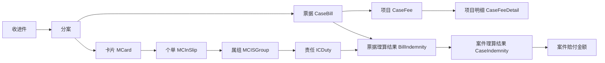

# 案件的理算设计

这篇文档专门回答“钱到底怎么算出来”的问题。不是讲代码怎么写，而是讲业务对象怎么关联、理算顺序是什么、为什么同一个案件在票据层、责任层、案件层会看到不同金额。


## Key Takeaways

- 理算不是“案件总金额减一点再乘比例”，而是“保单/个单/属组/责任/票据/项目”多层联动后的结果。
- 真正执行理赔计算的核心对象是 `责任 ICDuty`，不是案件本身。
- 项目层理算开启时，系统会把票据金额拆到项目层再算；不开启时，主要按票据层算。
- 影响最终金额的关键因素通常有：医保支付、第三方支付、非责任扣除、特殊扣除、免赔额、赔付比例、责任余额、责任组共享、限额、分段。

## 一、先把对象关系想明白



## 二、核心业务对象怎么理解

| 对象              | 业务理解      | 为什么重要                                       |
| --------------- | --------- | ------------------------------------------- |
| `MCard`         | 被保险人/卡片载体 | 案件会先根据卡片去找可理算个单。                            |
| `MCInSlip`      | 个单        | 某个被保险人在某张保单下的个人保障记录。真正扣额度、算余额时，经常落在这个层级。    |
| `MCISGroup`     | 属组        | 个单下面一组责任规则的归属。属组变更后，责任有效期、历史规则、历史额度都可能发生变化。 |
| `GroupDutyRel`  | 属组与责任关联   | 说明当前属组下有哪些责任。                               |
| `ICDuty`        | 责任        | 免赔额、赔付比例、责任类型、分段、限额、账单分组方式都在这里。             |
| `CaseBill`      | 票据        | 一张票是不是参与理算、归到哪个责任、在该责任下赔多少，从这里开始。           |
| `CaseFee`       | 项目        | 当开启项目层理算时，赔付不再只停在票据总额，而是要拆到项目层。             |
| `BillIndemnity` | 票据责任结果    | 某张票在某个责任下的计算结果。                             |
| `CaseIndemnity` | 案件责任结果    | 某个责任在整个案件里的汇总结果。                            |

## 三、理算的主顺序

根据 `BaseCalService.processCase`，公共主链路可以概括成下面 10 步。

### 1. 删除旧结果，重新开始

理算前会先清掉当前分案已有的理算结果，包括：

- 责任层结果
- 票据层结果
- 扣减说明
- 错误信息

这意味着系统默认“当前展示的是最近一次完整理算结果”。

### 2. 做理算前校验

重点校验包括：

- 有没有有效卡片
- 卡片是否注销
- 有没有开通 TPA 的个单
- 是否允许重新理算
- 是否存在回传中的案件
- 银行信息、事故人信息、疾病信息等是否具备继续理算的基础

如果这些前置条件不过，案件通常不会进入正常理算，而是停在错误或问题件。

### 3. 找到当前案件可理算的个单

这一步由 `SlipService` 主导，核心逻辑包括：

- 先拿到卡片下全部 TPA 个单
- 根据是否允许跨投保单位理赔过滤
- 根据收进件或案件上是否指定保单过滤
- 按保单赔付顺序、承保时间排序
- 跳过当前案件不允许理算的个单

你可以把它理解成：

“不是案件挂了哪张保单就一定赔哪张，而是系统先算出哪些个单有资格参与这次理算。”

### 4. 找到当前个单下有效责任

责任是否有效，不只是看“这责任存不存在”，还要看：

- 责任是否在个单有效期内
- 责任是否在当前属组生效区间内
- 责任类型是否匹配当前票据
- 等待期、追溯期是否满足
- 属组变更后，当前票据落在哪个责任期间里

`SlipPeriodService` 和 `DutyUtils` 说明得很清楚：

- 责任可以有自己的生效/终止时间
- 个单也有生效/终止时间
- 属组变更后，同一个责任可能对应多段有效期
- 票据是否能落进某段有效期，是理算的关键

### 5. 把票据匹配到责任

不是每张票都能参与每个责任。

系统会按责任类型和匹配规则去找有效票据，例如：

- 门诊责任看门诊票
- 住院责任看住院票
- 药房责任看药房票
- 津贴责任还会额外看住院天数

如果某张票不满足责任匹配规则，它在这个责任下就不会参与计算。

### 6. 按责任定义“次”或“累计口径”

这是理算里特别容易被忽略的一层。

责任不只是有免赔额和比例，还定义了“按什么口径累计/分组”。

代码里叫 `billGroupMode`，常见口径有：

- 按住院入出院时间
- 按门诊就诊时间
- 按案件
- 按日期+医院+科室
- 按日期+医院+疾病
- 按疾病代码
- 按事故日期+疾病代码
- 按事故天数 3/7/14/30/90/180 + 疾病代码

业务上要这么理解：

- 有些责任是“每次门诊扣一次免赔额”
- 有些责任是“同医院同科室同日算一次”
- 有些责任是“同一疾病 90 天内算同一次”

所以你看到“为什么两张票明明分开，却只扣了一次免赔额”，通常不是 bug，而是责任的分组方式决定的。

### 7. 计算票据层可理赔金额

票据层计算使用 `BillCalEntity` 里的公式变量。常用变量如下：

| 变量 | 业务含义 |
| --- | --- |
| `A` | 票据总金额 |
| `B` | 医保报销合计 |
| `C` | 第三方支付 |
| `O` | 自付一 |
| `P` | 起付线金额 |
| `Q` | 超封顶金额 |
| `R` | 自付二 |
| `S` | 自费 |
| `T` | 个人支付 |
| `U` | 医保范围外金额 |
| `V0~V6` | 当前票据在同类型责任上的累计值 |
| `W` | 日/次津贴 |
| `X` | 住院天数 |
| `Y` | 附加金额 |

代码里的默认基础思路可以概括为：

`可理赔基础 = 总费用 - 医保支付 - 第三方支付 - 部分自付/自费 - 其他规则扣减`

再往下叠加：

- 特殊扣除
- 免赔额
- 赔付比例
- 责任余额限制

### 8. 如果开启项目层理算，再把票据拆到项目层

项目层理算是否启用，至少要同时满足两层条件：

1. 对接或案件层允许项目层理算
2. 责任 `openFeeCalc = 1`

项目层变量来自 `FeeCalEntity`：

| 变量 | 业务含义 |
| --- | --- |
| `FA` | 项目总金额 |
| `FB` | 分摊到该项目的医保报销金额 |
| `FC` | 分摊到该项目的第三方支付 |
| `FD` | 项目中的乙类药部分 |
| `FE` | 项目中的丙类药部分 |
| `FR` | 项目乙类金额 |
| `FS` | 项目丙类金额 |
| `FX0` | 分摊到该项目的免赔额 |
| `FX1` | 项目赔付比例 |
| `FX2` | 自费赔付比例 |
| `FX3` | 自付赔付比例 |

`FeeCalEntity` 给出的典型项目层公式是：

```text
(FA - FB - FC - FR + FD - FS - FX0) * FX1 + FE * FX2
```

业务翻译如下：

1. 先从项目金额里扣掉医保和第三方
2. 再扣乙类/丙类不赔部分
3. 再分摊项目免赔额
4. 剩余部分乘项目赔付比例
5. 对某些自费部分再按单独比例处理

所以项目层理算的本质，是把“票据总额口径”进一步拆成“项目口径”。

### 9. 再处理免赔额、分段、限额、共享和余额

这一步是最终金额最容易被拉低的地方。

#### 免赔额

`dedutionMode` 里至少有两种核心口径：

- `1`：按次免赔
- `5`：按累计免赔

并且免赔额还会受到这些因素影响：

- 历史已使用免赔额
- 同责任共享免赔额
- 同责任组共享免赔额
- 第三方支付是否计入免赔
- 首次免赔额定制
- 住院津贴按天折算免赔

#### 分段

责任可以配置分段赔付，例如：

- 不同累计金额区间用不同赔付比例
- 不同年度区间用不同口径

#### 限额

除了保单/个单余额外，还可能有：

- 发生次数限制
- 单次限额
- 年累计限额
- 项目限额
- 责任组共享额度

#### 共享责任组

系统里存在“共享保额”“共享免赔额”“比大小责任组”等概念。

这意味着：

- 两个责任可能共用同一份额度
- 两个责任可能共用同一份免赔额
- 多个责任可能先各自试算，再取较大/较小结果

### 10. 生成结果并汇总到案件层

理算完成后，系统会生成：

- `BillIndemnity`：票据在责任下的结果
- `CaseIndemnity`：责任在案件下的汇总结果

然后再把案件上的几个关键金额写回分案：

- `originCalcIndemnityAmount`
- `calcIndemnityAmount`
- `checkIndemnityAmount`
- `realIndemnityAmount`

## 四、保单、个单、属组、责任之间到底什么关系

## 1. 保单不是最细执行单元，个单才是

在代码里，很多理算动作并不是直接对“保单”做，而是对 `MCInSlip` 做。

业务上可以理解为：

- 保单定义了保障框架
- 个单代表“某个被保险人在该保单下实际可用的个人保障记录”

所以一个案件最终可能会：

- 只落到一个个单
- 跨多个个单理算
- 甚至跨投保单位理算，但必须满足配置条件

## 2. 属组是责任的业务归属层

`MCISGroup` 可以理解成：

- 这一段时间内，这个人适用哪一套责任规则
- 这套规则的赔付顺序、历史规则、历史额度怎么继承

当存在属组变更时，系统不会粗暴地用“当前属组”去套历史票据，而是会按票据落入的有效期间去找对应的责任期。

## 3. 责任是真正执行赔付的对象

责任里装的不是一个简单“赔付比例”，而是一整套理赔规则：

- 责任类型
- 理算公式
- 免赔额
- 赔付比例
- 分段规则
- 账单分组方式
- 是否开启项目层理算
- 个人/公共额度使用顺序

所以你以后看金额时，最应该问的不是“这张票赔不赔”，而是：

- 它在这张保单下落到了哪个责任
- 这个责任的公式、免赔、限额和余额是什么

## 五、为什么“票据层金额”和“案件层金额”经常不一样

## 1. 票据层是细结果，案件层是责任汇总结果

票据层看到的是：

- 某一张票在某一责任下赔多少

案件层看到的是：

- 某一个责任把多张票汇总后赔多少

所以天然不会一一相等。

## 2. 项目层理算开启后，票据金额会再次被拆分

当项目层理算开启时：

- 票据总额只是一个入口值
- 真正赔付可能在各项目上重新分摊
- 再汇总回票据层和案件层

因此你会看到：

- 项目层赔付合计 = 票据层责任结果
- 多责任累计后 = 案件层责任结果

## 3. 四舍五入和最后一张票调差

系统里明确提到：

- 计算时保留更高精度
- 展示时通常保留 2 位
- 最后一张票可能承担分币差调整

所以你在票据逐张相加和案件汇总时，偶尔出现几分钱差异，是正常现象。

## 六、一个最简理算示意

下面例子只是帮助你建立直觉，不代表任何特定保司定制。

### 示例 1：不开启项目层理算

假设某票据：

- 总金额 `A = 1000`
- 医保支付 `B = 200`
- 第三方支付 `C = 0`
- 自付二 `R = 100`
- 自费 `S = 50`
- 免赔额 `100`
- 赔付比例 `80%`

那它的基础可理赔口径可以粗略理解为：

```text
1000 - 200 - 0 - 100 - 50 = 650
650 - 100 = 550
550 * 80% = 440
```

如果责任余额只剩 `300`，最终还要再被责任余额限制到 `300`。

### 示例 2：开启项目层理算

假设一张票据下有 3 个项目：

- 西药费 500
- 检查费 300
- 床位费 200

系统会先把医保支付、第三方、免赔额等按项目重新分摊，然后每个项目按自己的项目金额和项目比例再算，最后汇总回票据层。

这时你就不能再用“票据总额直接减一减”去理解最终赔付了。

## 七、你以后排查“为什么赔成这样”时的顺序

1. 先看案件最终理算到了哪些个单。
2. 再看每个个单下有哪些责任参与。
3. 再看每个责任匹配到了哪些票据。
4. 再看该责任是否开启项目层理算。
5. 再看免赔额、限额、责任余额、共享责任组有没有生效。
6. 最后才看四舍五入或分币差。

## 需确认

- 某些保司的脚本公式、特殊扣减、共享逻辑和实时余额口径有大量定制，这篇文档只抽了公共骨架。
- 如果你后面希望我继续深化，我建议下一步再单独做一篇“按真实案件走一遍理算”的案例文档，那会比纯概念更容易吃透。
