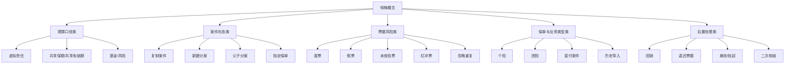

# 特殊概念、边界场景与历史词汇词典

这篇文档专门整理那些不会出现在“主链路骨架”里、但你在真实业务里一定会经常遇到的词。它们的共同特点是：名字听起来像内部黑话、历史包袱词、边界场景词或者定制词；如果不单独解释，你即使看懂了主流程，也会反复在这些词上卡住。

## Key Takeaways

- 这批概念不是“零碎边角料”，很多会直接影响金额展示、冻结口径、审核分流、案件复制和问题件处理。
- `虚拟责任`、`复制案件`、`基金/风险`、`个险/团险`、`废票/假票/红冲票` 是最值得优先搞明白的一组。
- 很多特殊概念并不是单纯定义问题，而是“为什么系统要这样设计”的问题。
- 同一个词在不同保司定制下可能口径不同，所以文档里会明确区分“公共骨架”和“需确认”的部分。

## 一张总图

## 一、虚拟责任

## 1. 它是什么

从代码能直接确认，责任上有 `isVirtual` 标记。虚拟责任不是普通用户直觉里的“真实赔付责任”，它更像一类辅助计算责任、比较责任、过渡责任或公账处理责任。

可以从几个证据看出来：

- 前端展示案件责任结果时，虚拟责任的 `showIndemnityAmount` 会被直接显示为 `0`
- 某些金额调整场景不允许调整虚拟责任金额
- 某些冻结场景会主动过滤虚拟责任
- 某些反洗钱判断会把虚拟责任理赔明细剔除后再算

所以业务上最稳妥的理解是：

- 虚拟责任“参与系统内部逻辑”
- 但“不一定代表最终要对外展示或对外冻结的一笔真实赔付责任”

## 2. 它为什么存在

当前代码里至少能看出两类典型用途：

### 用途 A：做“比大小/择优”的中间责任

`CompareCalService` 里非常明确：

- 主责任会找到两个虚拟责任
- 用虚拟责任 A 段/B 段做金额比较
- 然后再决定最终保留哪条赔付结果

这说明有些责任不是简单直接赔，而是：

1. 先按不同口径试算多套结果
2. 把中间结果挂在虚拟责任上
3. 最终再选一套真实结果对外生效

### 用途 B：只用于扣减保额，不用于案件最终展示金额

代码里有明确注释：

- “虚拟责任的扣减只用于扣减保额，不用于理算”
- “案件最终赔付金额只展示真实责任赔付金额”

这说明某些虚拟责任存在的意义，是为了：

- 让系统内部额度、扣减、共享规则能跑通
- 但不让用户把它误认为是一条真正对外赔付的责任

## 3. 它会影响你哪些观察结果

| 观察点 | 影响 |
| --- | --- |
| 前端责任金额 | 你可能看到某责任金额显示为 `0`，但它其实参与过内部计算。 |
| 金额调整 | 某些场景不允许直接调虚拟责任。 |
| 冻结金额 | 某些单位冻结时会过滤虚拟责任。 |
| 反洗钱判断 | 某些逻辑会把虚拟责任剔除后再判断。 |
| 公账赔付 | 代码会区分“公账赔付的虚拟责任”和“公账赔付的非虚拟责任”。 |

## 4. 你以后怎么识别它

最简单的业务判断框架：

- 如果一个责任参与了内部金额逻辑，但前端展示结果为 0，要怀疑它是不是虚拟责任
- 如果某笔冻结或实际赔付口径和理算责任明细看起来不一致，要查有没有虚拟责任被过滤

## 二、复制案件

## 1. 它是什么

复制案件不是简单“复制一条数据库记录”，而是一类正式的业务动作。代码里能看到：

- 存在明确的 `COPY_CASE` 操作类型
- 存在调用中控 `copyCase` 接口的逻辑
- 存在“中控按钮复制案件”的操作日志
- 存在 `receiveState = COPY_CASE`

所以业务上可以这样理解：

- 复制案件是把原案件的部分或全部资料、状态基础、票据数据复制出一个新的案件/分案继续处理

## 2. 它为什么存在

复制案件常见业务动机通常有：

- 原案某些票据需要拆出去单独处理
- 原案废票或异常票要重开新案继续走
- 不同单位/不同处理口径需要分开承接
- 原案已经走到某一步，但部分资料需要形成新分案继续流转

## 3. 它在系统里可能体现为哪几种形态

### 形态 A：新建分案

`createNewCase` / `copyDivisionalCase` 这套逻辑说明：

- 系统会基于原分案生成一个新的分案号
- 复制状态流转表、案件信息、关系、影像、票据、费用、明细、自定义属性
- 新分案默认会被置为人工问题件

这说明“新建分案”本质上就是一种更受控的复制案件。

### 形态 B：中控复制案件

代码里还存在显式调用中控 `copyCase` 接口的逻辑：

- 会传原分案号
- 会打复制案件标记
- 某些场景会记录为“中邮山东团险废单复制案件”

这说明有些复制不是在当前系统本地完成，而是由中控系统生成新的案件。

### 形态 C：录审分离场景下的复制案件

自动核赔任务里存在固定规则：

- 某些 `receiveSource` 命中的“录审分离复制案件”
- 会直接标记为无需人工核赔

这说明“复制案件”在你们业务里不只是补数据动作，有时还是一种特殊承接模式。

## 4. 复制案件会影响什么

| 影响点 | 说明 |
| --- | --- |
| 自动核赔 | 某些复制案件可直接自动通过，某些则强制进入保司复核或二次核赔。 |
| 保司复核 | 代码里存在“保单开通保险公司复核且为复制案件”的强制条件。 |
| 问题件时间口径 | 某些复制案件没有问题件完成时间时，会回退用复制时间。 |
| 票据处理 | 原分案废票在新建分案场景下不允许随便恢复正常。 |
| 分案结构 | 常与父子分案、拆分标志一起出现。 |

## 三、父子分案 / 新建分案 / 拆分标志

系统里存在 `spiltFlag`：

| 值 | 业务含义 |
| --- | --- |
| `0` | 非拆分 |
| `1` | 父分案 |
| `2` | 子分案 |
| `3` | 子分案拆分 |

业务理解：

- 一个原分案可能变成父分案
- 新复制出来的案子可能是子分案
- 后面子分案还可能继续拆

所以“复制案件”不是孤立动作，常常意味着案件结构已经从单分案演变成父子分案关系。

## 四、基金案件 / 风险案件 / 医疗+基金

这类概念在你们系统里非常重要，因为很多保司会把保障体系拆成：

- 基金型保单
- 风险型保单
- 医疗+基金组合场景

## 1. 怎么理解

从代码注释看：

- `claimType` 有基金与风险口径区分
- 某些保司进入待理算前，会先做“医疗转基金理算”
- 某些规则要求“仅基金”“仅医疗”“医疗+基金”分别走不同逻辑

业务上可以先记住：

- 基金，不完全等于普通商业医疗责任
- 风险型，常常更接近商业保险给付或医疗责任
- 医疗+基金，意味着同一案可能同时挂多套保障口径

## 2. 它为什么重要

因为它会直接影响：

- 匹配到哪些保单
- 是否指定保单
- 理算顺序
- 剩余可赔金额
- 是否还能全转半
- 某些案件是否必须进保司复核

## 五、指定保单理赔

## 1. 它是什么

指定保单理赔，指的是案件理算时不是让系统在所有可用保单里自由挑，而是限制在指定保单集合中。

可能来源有两层：

- 收进件上指定
- 案件层再指定

## 2. 它为什么存在

业务原因通常包括：

- 客户或保司明确要求走某张保单
- 某类费用只能在特定保单理赔
- 避免系统按默认顺序跨保单赔付

## 3. 它会影响什么

- 个单筛选范围
- 跨投保单位判断
- 保单赔付顺序
- 指定保单不生效时直接报错或进问题件

## 六、个险 / 团险

## 1. 团险

团险一般是单位统一投保，典型特征是：

- 有投保单位
- 常见于企业员工福利类保障
- 复核、单位审核、基金/风险组合更常见

## 2. 个险

个险更偏个人保单场景，代码里也明确有：

- “个险服务”
- “个险保单没有投保时间，只有险种维度生效时间”的特殊逻辑

所以业务上要理解为：

- 个险的保单结构、投保时间口径、部分外部接口口径会不同于团险

## 七、直付案件 / 历史导入

## 1. 直付案件

分案实体里明确有：

- `caseType 1 = 直付案件`

直付可以理解为：

- 平台不是事后报销，而是更靠近消费/赔付现场的结算模式
- 其计费、打款、结算口径可能和普通理赔不完全一样

## 2. 历史导入

分案实体里也有：

- `caseType 2 = 历史导入`

历史导入说明：

- 这个案件不是完整从当前主链路自然生成
- 很可能是历史系统、Excel、存量数据迁移进来的

这类案件通常要特别小心：

- 时间字段口径
- 票据完整性
- 是否真的具备完整主链路痕迹

## 八、废票 / 假票 / 未查验票 / 红冲票 / 忽略重复

这组概念都属于“票据风险类词汇”，经常一起出现，但含义完全不同。

| 概念 | 业务含义 | 常见后果 |
| --- | --- | --- |
| 废票 | 这张票被判定无效，不参与正常赔付 | 自动核赔更难过，理算口径变化 |
| 假票 | 票据真伪存在问题 | 通常强制风险升级 |
| 未查验票 | 票据未通过或未完成真伪校验 | 自动核赔会更保守 |
| 红冲票 | 发票冲红、作废重开类风险 | 常直接进入人工审核 |
| 忽略重复 | 明知存在重复风险，但业务允许带原因继续放行 | 需要记录忽略原因 |

## 1. 废票

代码里能直接看到：

- 单张票可以被打成废票
- 废票可以有废票原因
- 某些新建分案场景下，原分案废票不允许直接恢复正常

## 2. 假票 / 未查验票

`fakeFlag` 会把票据风险大致分成：

- 真票
- 假票
- 未查验

在自动核赔里，这三者都非常敏感。

## 3. 红冲票

自动核赔里有明确判断：

- 案件存在红冲票时，会直接写入人工审核理由

这说明红冲票在你们业务里不是小瑕疵，而是明显风险点。

## 4. 忽略重复

这不是说“没有重复”，而是说：

- 系统已经识别出重复风险
- 但业务上允许带理由继续处理

所以“忽略重复”是一种带痕迹的放行，不是风险消失。

## 九、回销

`billCheck` / 总案上的回销字段说明，“回销”不是普通回传，它更像票据或业务结果的后置核销动作。

你可以先把它理解成：

- 某些案件处理完后，不只是返还票据
- 还需要对票据或某类业务记录做核销闭环

它常和这些词一起出现：

- 返还票据
- 打款
- 结案
- 特定保司定制需求

## 十、悬挂 / 挂起

这类词更偏时效控制和问题件处理中断：

- 进入问题件时可能发送悬挂开始
- 解除挂起后案件会恢复回之前状态
- 某些保司会把这类动作同步到外部核心

所以悬挂不是“作废”，而是：

- 暂停
- 占着问题件时效
- 等待外部或人工处理结束后恢复

## 十一、二次核赔 / 高级复核

这两个词在你们系统里基本可以视为同一条业务线的两种叫法。

它的本质不是普通人工审核，而是：

- 更高一层的复核
- 由保单配置决定是否开启
- 可按属组、责任、操作人、金额、特殊人员、复制案件等条件触发

所以以后看到“为什么从 42 又到了 44”，就不要理解成重复审核，而要理解成：

- 初核做完了
- 但还命中了高级复核规则

## 十二、你以后最该优先记住的 10 个特殊概念

1. 虚拟责任：参与内部逻辑，但不一定对外展示或冻结。
2. 复制案件：不是简单复制记录，而是一类正式业务承接动作。
3. 新建分案：复制案件的一种常见落地形式。
4. 父子分案：案件结构已经被拆开，不再是单案。
5. 指定保单：理算范围被人为限制。
6. 基金/风险：决定理算口径和复核路径的重要分类。
7. 个险/团险：决定保单结构和很多定制规则。
8. 废票/假票/红冲票：三种不同性质的票据风险。
9. 回销：后置核销闭环，不等于普通回传。
10. 二次核赔：不是重复劳动，而是更高层级复核。

## 十三、这篇文档怎么配合其他文档一起看

- 如果你先卡在词义，先看这篇和《TPA 理赔业务术语词典》。
- 如果你卡在路径差异，再配合《进件方式、流程类型与对接模式差异》。
- 如果你卡在问题件和复制案件怎么回链路，再配合《问题件、打回、恢复与回退手册》。
- 如果你卡在金额口径，再回到《案件的理算设计》看虚拟责任、基金/风险和责任层关系。

## 需确认

- “虚拟责任”在不同保司定制下的具体业务含义可能不完全一样，这里总结的是当前代码里能确认的公共作用。
- “复制案件”在不同中控、不同保司、不同单位下，可能有不同触发来源和限制条件，这里只抽了公共骨架。
