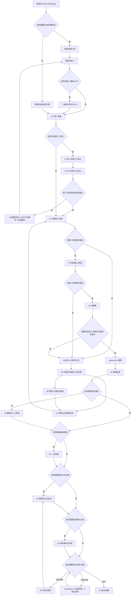
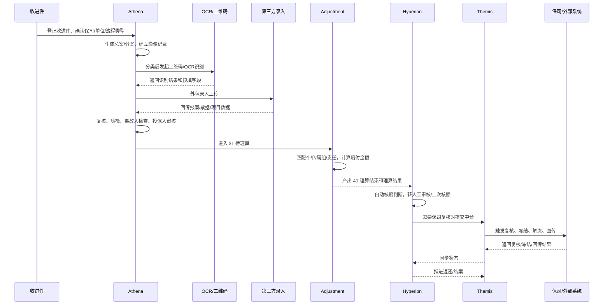
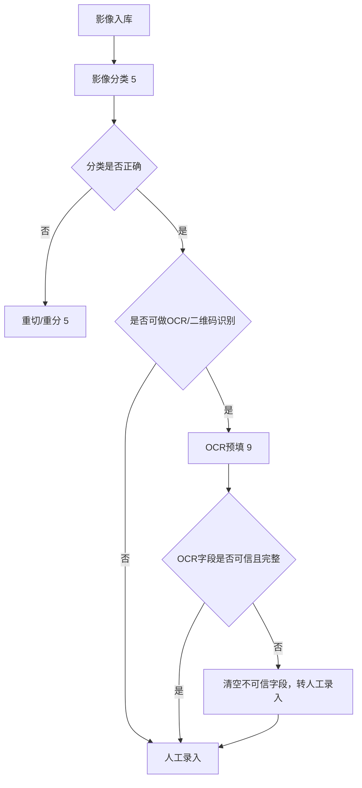
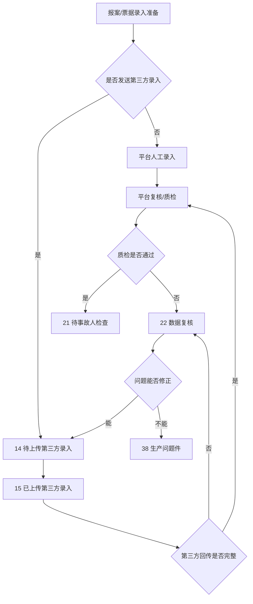
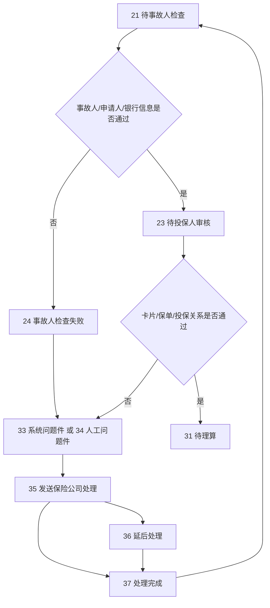
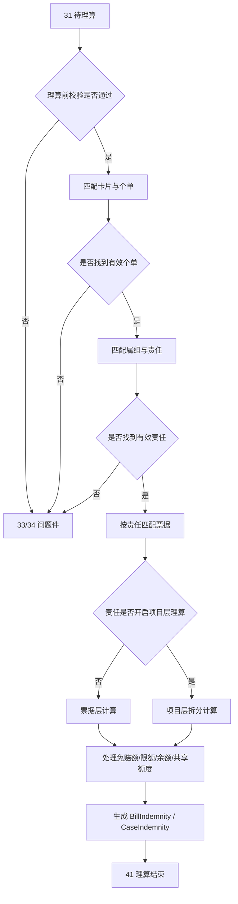
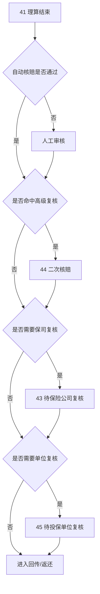
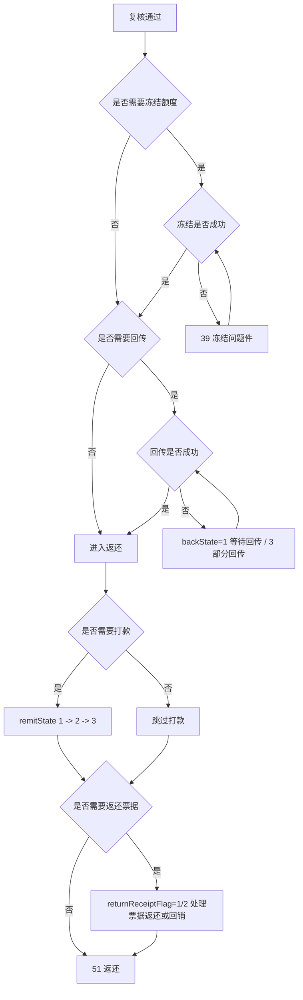

# 按一个典型真实案件走一遍：从进件到结案

这篇文档不是拿线上某个单号做脱敏复盘，而是基于当前仓库的公共主链路，拼出一个“足够真实、足够完整、能覆盖主要分支”的典型案件。目标不是记住一堆状态码，而是让你真正建立一个直觉：案件进来以后，每一步是谁在处理、产出什么数据、为什么会分流、为什么会退回、为什么会进入问题件、为什么最后才能结案。


## Key Takeaways

- 这类案件不是直线往前走，而是一路上布满了“入口判断”和“风险分流”。
- 生产阶段的目标是把资料变成结构化数据，理算阶段的目标是把规则算成金额，核赔阶段的目标是把风险案筛出来。
- 一个案件是否进入自动核赔、二次核赔、保司复核、单位复核，不是随机的，而是受配置、金额、票据风险、影像完整性等因素共同影响。
- 真正的全景理解方式，不是盯某个页面，而是同时看对象层级、状态流转、关键字段和异常分支。

## 一、案例设定

这次用一个“线下全流程住院案件”作为主案例，因为它能覆盖最多的核心链路。

| 项目 | 主案例设定 |
| --- | --- |
| 案件类型 | 普通住院理赔案件 |
| 进件方式 | `receiveState = 0`，线下收件 |
| 流程类型 | `proType = 0`，全流程 |
| 对接方式 | `dockingMode != 0`，已和保司系统对接 |
| 是否指定保单 | 否，由系统匹配可理算个单 |
| 是否走影像文档阶段 | 是 |
| 资料内容 | 住院发票、结算单、出院小结、身份证、银行卡 |
| 录入方式 | 主链路假设走外包录入后回传，再由平台复核 |
| 理算特征 | 命中住院医疗责任，开启项目层理算 |
| 核赔特征 | 自动核赔未通过，进入人工审核；命中高级复核和保司复核 |

## 二、一张总图先把完整分支看全



## 三、主案例的系统协作顺序



## 四、主案例一步一步怎么走

### 1. 进件登记

主案例先以收进件进入平台，收进件上已经带了这几个关键入口条件：

- 这案子属于哪家保司
- 属于哪个投保单位
- 是线下普通收件，不是拍照理赔
- 是全流程，不是半流程
- 需要影像文档阶段
- 未指定保单，后面让系统按个单和责任自动匹配

这一阶段的产物不是赔付金额，而是入口配置。入口一旦定了，后面很多分支已经被提前决定了。

### 这一阶段可能出现的分支

| 分支 | 触发条件 | 后果 |
| --- | --- | --- |
| 直接走文档影像链路 | `receiveState` 属于有文档阶段 | 进入扫描、分类、OCR。 |
| 跳过文档阶段 | 某些线上对接、拍照理赔、复制案件 | 直接进入录入或校验。 |
| 指定保单理赔 | 收进件带 `policyIdList/policyNoList` | 后续理算只能在指定保单集合里找个单。 |
| 半流程 | `proType = 1` | 平台不处理所有环节，主链路会缩短。 |

### 2. 影像入库、分类、OCR

主案例是线下全流程，所以先进入影像处理：

1. 建立影像记录。
2. 对发票、结算单、身份证、银行卡等材料做分类。
3. 对发票或二维码材料做 OCR 识别。
4. 把可用识别结果作为人工录入预填。

这里最重要的理解是：OCR 只是机器预填，不是最终业务事实。真正写入案件的，仍然是后面的人工录入或校验通过后的结构化数据。

### 生产分支图



### 这一阶段可能出现的分支

| 分支 | 触发条件 | 后果 |
| --- | --- | --- |
| 分类错误 | 发票/结算单/证件分错类 | 退回重切或重分。 |
| OCR 可用但字段不可信 | 医院编码没匹上、字段组不完整 | 不带入最终录入。 |
| 图片不清晰 | OCR 识别失败或人工看不清 | 进入生产返工。 |
| 影像缺失 | 没有必须的票据/证件图片 | 后续可能卡在录入校验或核赔。 |

### 3. 外包录入、报案录入、票据录入、质检

主案例为了覆盖更多真实链路，假设这案子被发给第三方录入。

### 主案例怎么走

1. 案件状态进入 `14 待上传第三方录入`。
2. 上传案件主数据、影像索引、收进件信息给第三方。
3. 第三方回传报案信息、票据、项目、明细。
4. 平台校验回传结果是否完整。
5. 平台内部继续做数据复核和质量检验。
6. 通过后进入 `21 待事故人检查`。

### 第三方录入分支图



### 这一阶段沉淀出的关键数据

| 数据层 | 主案例产物 |
| --- | --- |
| 案件层 | 事故人、申请人、收款人、银行信息、出险信息 |
| 影像层 | 发票、结算单、出院小结、身份证、银行卡图片 |
| 票据层 | 发票号、就诊日期、医院、疾病、票据金额 |
| 项目层 | 床位费、药品费、检查费、治疗费等项目金额 |
| 风险层 | 重复票、假票、影像缺失、字段异常等质检结果 |

### 4. 事故人检查和投保人审核

主案例在生产完成后，不会立刻理算，而是先过两层前置业务检查：

1. `21 待事故人检查`
2. `23 待投保人审核`

业务上可以把这两步理解成：

- 事故人检查：基础报案和人员信息是否能站住脚
- 投保人审核：能不能正确匹配卡片、个单、投保关系，并进入理算

### 前置校验分支图



### 这一阶段最常见的失败原因

| 失败点 | 典型原因 |
| --- | --- |
| 事故人检查失败 | 事故人信息、银行信息、疾病信息不完整或不一致。 |
| 投保人审核失败 | 找不到有效卡片、主被关系不匹配、指定保单不满足、投保关系不成立。 |
| 问题件回主链路 | 保司处理完成后再回到事故人检查或投保人审核继续走。 |

### 5. 理算

主案例进入 `31 待理算` 后，`adjustment` 会做下面这些事：

1. 清掉旧理算结果。
2. 做理算前校验。
3. 找卡片下可理算的个单。
4. 找个单下有效属组和责任。
5. 用票据匹配责任。
6. 如果责任开启项目层理算，就按项目层继续算。
7. 生成票据理算结果和案件理算结果。
8. 案件状态变成 `41 理算结束`。

### 主案例的一个简化金额示意

主案例假设住院发票总金额为 `12000`，其中：

- 医保支付 `3500`
- 第三方支付 `0`
- 自付二 `1000`
- 自费 `500`
- 责任免赔额 `200`
- 赔付比例 `80%`

如果只看票据层直觉，大致可理解为：

```text
12000 - 3500 - 1000 - 500 = 7000
7000 - 200 = 6800
6800 * 80% = 5440
```

但主案例又开启了项目层理算，所以真实系统不会只拿票据总额直接算，而是会把项目金额、医保分摊、自费分摊、免赔额分摊重新拆到项目层再汇总回来。你实际看到的结果，可能会是：

- 住院医疗责任赔付 `5210`
- 手术或附加责任赔付 `1380`
- 最终案件 `realIndemnityAmount = 6590`

这个例子的重点不是精确公式，而是帮助你建立一个认识：

- 票据总额不是最终赔付
- 项目层拆分会改变结果
- 多责任汇总后才得到案件最终金额

### 理算分支图



### 这一阶段常见的异常分支

| 分支 | 触发条件 | 后果 |
| --- | --- | --- |
| 找不到有效卡片或个单 | 人员匹配失败、无 TPA 保障记录 | 进问题件或直接中断理算。 |
| 责任不生效 | 等待期、有效期、属组区间不满足 | 该责任不参与赔付。 |
| 票据不匹配责任 | 门诊票跑到住院责任、药房票不满足规则 | 该票在该责任下不赔。 |
| 余额不足 | 责任额度已被历史赔案消耗 | 金额被 `lackBalanceDeductionAmount` 拉低。 |
| 零赔 | 扣完医保、自费、免赔、责任限制后为 0 | 后续更容易进入人工审核或保司复核。 |

### 6. 自动核赔、人工审核、高级复核、保司复核

主案例在 `41 理算结束` 后，假设没有自动通过，而是命中了人工审核和高级复核。

### 主案例怎么走

1. 系统先做自动核赔判断。
2. 因为赔付金额超过阈值，且案件含复杂住院资料，`checkRule = 2`。
3. 案件进入人工审核。
4. 因保单配置了高级复核金额阈值和指定复核规则，进入 `44 二次核赔`。
5. 高级复核通过后，因保单 `needAgentReview = 1`，进入 `43 待保险公司复核`。
6. 保司复核通过后，进入后续回传与返还阶段。

### 核赔分支图



### 自动核赔常见失败原因

| 失败原因 | 业务解释 |
| --- | --- |
| 保单配置全部人工审核 | 保单不允许自动放行。 |
| 赔付金额达到阈值 | 超过自动核赔容忍金额。 |
| 零赔或负向结果 | 风险高，需要人工确认。 |
| 重复票、假票、未校验票 | 票据风险。 |
| 审核结论/备注命中关键字 | 风险说明不适合自动过。 |
| 明细、医院、影像类型不满足白名单 | 资料或业务规则不满足。 |

### 这一阶段需要特别记住的字段

| 字段 | 主案例表现 |
| --- | --- |
| `checkRule` | 从 `1` 或默认值变成 `2`，表示需要人工核赔 |
| `state` | `41 -> 42 -> 44 -> 43` |
| `haveWrongState` | 如果中途打成问题件，会被更新 |
| `oldState` | 如果从复核/问题件打回，用来记录原状态 |

### 7. 回传、冻结、打款、返还

主案例在保司复核通过后，还没有马上结束。它还要经过后半段的“结果落地”。

### 主案例怎么走

1. 判断是否需要回传给保司或外部系统。
2. 如果对接保司需要额度控制，可能先触发冻结。
3. 冻结和回传都成功后，再进入返还。
4. 如果案件需要打款，还会继续推进 `remitState`。
5. 如果案件需要返还票据，还要按 `returnReceiptFlag` 做实物或回销闭环。

### 回传与结案分支图



### 这一阶段最容易误判的点

| 误判 | 正确认识 |
| --- | --- |
| 理算结束就算结案 | 不对，后面还有审核、复核、冻结、回传、返还。 |
| 已回传就一定返还 | 不对，回传和返还是两个动作。 |
| 冻结问题件是理算问题 | 不完全对，它更偏后半段额度控制和状态一致性问题。 |
| 保司复核过了就没事了 | 不一定，回传失败、打款异常、票据返还都可能继续挂住案件。 |

## 五、如果主案例在不同节点出问题，会怎么分支

### 1. 如果生产阶段出问题

- 影像分类错，回到分类或重切。
- OCR 字段不可信，转人工录入。
- 第三方回传缺字段，回到数据复核或生产问题件。
- 关键资料缺失，卡在事故人检查前。

### 2. 如果理算阶段出问题

- 找不到有效个单，进问题件。
- 找不到有效责任，进问题件。
- 命中零赔或责任限制，虽然能算完，但很容易后续进入人工审核或保司复核。

### 3. 如果核赔阶段出问题

- 自动核赔不过，转人工审核。
- 人工审核发现异常，转人工问题件。
- 高级复核发现需补充说明，可再打回初核或进入问题件。
- 保司复核要求延后处理，会进入 `35/36/37` 支线。

### 4. 如果结案阶段出问题

- 冻结失败，进 `39`。
- 回传失败，`backState` 维持等待或部分回传。
- 打款未完成，`remitState` 不能收尾。
- 票据返还未完成，业务上也不算真正收尾。

## 六、你以后拿一个真实案件怎么套这篇文档

1. 先看 `ReceivePackage`：进件方式、流程类型、是否指定保单、是否对接保司。
2. 再看 `DivisionalCase.state`：当前卡在生产、理算、核赔、问题件还是返还。
3. 再看 `checkRule`：自动核赔到底是没开、没判、必须人工，还是自动通过。
4. 再看 `backState`、`doubtBackState`、`remitState`、`returnReceiptFlag`：判断后半段闭环到了哪一步。
5. 再看 `haveWrongState` 和 `oldState`：判断这案子是不是退回来过、是从哪一步退回来的。
6. 如果是金额问题，再回到理算文档，按个单、属组、责任、票据、项目逐层拆。

## 七、这篇案例文档和前面几篇怎么配合

- 如果你现在对对象层级还混乱，先看《TPA 理赔业务术语词典》。
- 如果你对状态主线还不稳，先看《案件生命周期以及流程》。
- 如果你对生产环节不熟，配合《案件生产系统的全过程》看本篇前三章。
- 如果你对金额来源不熟，配合《案件的理算设计》看本篇理算章节。
- 如果你对人工审核、保司复核、单位复核有疑问，配合《核赔、复核、回传与结案分流》看本篇后半段。

## 需确认

- 主案例里“高级复核后再保司复核”的组合路径，在不同保司和单位的实际落地上可能有定制差异，这里写的是公共理解主线。
- 不同保司对冻结、回传、打款、票据返还的后置动作差异很大，这篇文档重点讲公共主骨架，没有展开到每一家保司的专有流程。
