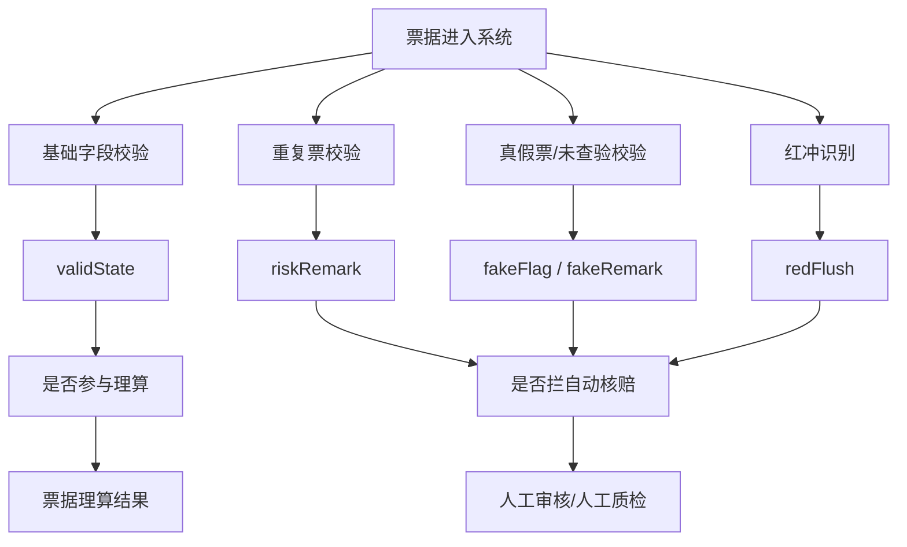
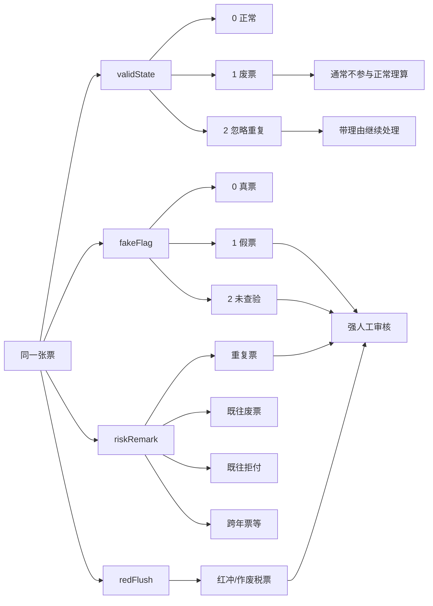

# 票据风控专题与风险处理手册

这篇文档专门讲票据风控，不讲案件主流程。目标是让你分清楚“票据有问题”到底是哪些问题、分别落在哪个字段、会不会影响理算、会不会拦自动核赔、哪些可以人工覆盖。

## Key Takeaways

- `废票`、`假票`、`未查验票`、`重复票风险提示`、`红冲票` 不是一回事，它们落在不同字段上。
- `validState` 解决“这张票当前算不算有效票”；`fakeFlag` 解决“真假票/未查验”；`riskRemark` 解决“重复票及其它风险提醒”；`redFlush` 解决“红冲票”。
- `忽略重复` 不是把重复票变成正常票，而是把它从“重复票风险拦截”里人工放行，字段上通常表现为 `validState=2`。
- 理算阶段会过滤部分废票/假票；自动核赔阶段则会把红冲票、重复票风险、废票、假票/未查验票整体当成强风险因子。
- 看到票据异常时，先问自己：这是“票据无效”问题，还是“票据有风险提示但还在票池里”的问题。

## 1. 先建立总框架

## 2. 四条主线要分开看

| 主线 | 主要字段 | 它回答的问题 |
| --- | --- | --- |
| 有效性 | `validState`、`validRemark` | 这张票现在算不算有效票 |
| 真假票 | `fakeFlag`、`fakeRemark` | 这张票是真票、假票，还是未查验 |
| 重复票/既往风险 | `riskRemark` | 这张票是不是和别的案件重复、既往废票、既往拒付等 |
| 红冲票 | `TcCaseBillExt.redFlush` | 这张票是不是税票红冲/被冲红 |

理解业务时，最容易犯的错就是把这四条线混成一个“票据有问题”。

## 3. 废票：这张票不作为正常有效票使用

### 3.1 对应字段

`validState`

| 值 | 含义 |
| --- | --- |
| `0` | 正常票 |
| `1` | 无效票 / 废票 |
| `2` | 忽略重复票 |

### 3.2 废票的业务含义

废票的重点不是“真假”，而是：

- 这张票在当前案件里不再作为正常可理算票使用。

系统里还能配合 `validRemark` 记录废票原因。

### 3.3 废票怎么产生

常见来源：

- 人工在核赔环节手工废单
- 某些规则自动作废
- 既往赔付或特殊业务规则触发

代码里能直接看到一个自动作废例子：

- 众诚微信理赔单张票据金额超过 `2000` 时，自动作废，备注“发票金额超2000元，请线下提交”。

### 3.4 废票对理算有什么影响

在理算相关代码里，废票会被优先过滤。至少在部分疾病限制/历史账单筛选逻辑中，系统明确做了：

- 过滤 `validState=1` 的票
- 过滤假票

所以“废票”首先影响的是“能不能进理算票池”。

## 4. 假票与未查验票：这是票据真伪维度，不是有效性维度

## 4.1 对应字段

- `fakeFlag`
- `fakeRemark`

`TcCaseBill.getFakeFlag()` 不是原始值，而是被归一后的结果：

| 归一值 | 含义 |
| --- | --- |
| `-1` | 原始未处理状态 |
| `0` | 真票 |
| `1` | 假票 |
| `2` | 未查验 |
| `3` | 其它未知状态 |

### 4.2 假票是什么

假票是指校验结果明确落到了假票原因枚举里，比如：

- 发票信息不一致
- 所查发票不存在
- 金额错误
- 开票日期错误
- 票据号码错误

### 4.3 未查验票是什么

未查验票不是“真票”，也不是“假票”，而是系统没拿到确定结果。常见原因包括：

- 当天查验次数超限
- 网络超时
- 查验异常
- 票据不清晰
- 区块链票据
- 税局服务关闭/维护

所以未查验票更接近“风险未消除”，不是“已经证明真”。

### 4.4 一个容易误解的点

有些原始 `fakeFlag` 值其实表示“金额录错导致校验不通过”，系统在页面上会做额外提示。说明：

- 原始真假票结果
- 页面最终给人的业务解释

并不总是一层映射。

## 5. 重复票与风险提示：它不一定废票，但会被强提醒

## 5.1 对应字段

`riskRemark`

这不是一个简单布尔值，而是一个风险信息集合，里面可能装：

- 重复票
- 既往废票
- 既往整案拒付
- 跨年票
- OA 支付重复票
- 其它定制风险

### 5.2 重复票校验怎么做

理算阶段会调用外部重复票校验：

1. 生成票据集合
2. 调用 Uranus 侧重复票接口
3. 把结果写回每张票的 `riskRemark`

如果外部“强校验”失败，案件甚至会直接进入特殊失败状态，而不是只是提示。

### 5.3 风险提示和废票的区别

| 项目 | 重复票风险提示 | 废票 |
| --- | --- | --- |
| 主要字段 | `riskRemark` | `validState=1` |
| 含义 | 系统提示这张票和别的历史票存在风险关系 | 这张票当前被判定为无效票 |
| 是否一定不能看 | 不一定 | 基本视为不参与正常理算 |
| 是否能人工覆盖 | 可以，常见方式是“忽略重复” | 可以恢复正常，但限制更多 |

## 6. 忽略重复：不是恢复正常，而是人工放过“重复票拦截”

### 6.1 对应字段

- `validState=2`
- `ignoreRepeatReason`

### 6.2 它到底意味着什么

忽略重复不是把票改成“完全正常票”，而是：

- 这张票存在重复票风险；
- 但业务人员认为这次可以带着风险继续走；
- 因此记录原因后，允许继续处理。

### 6.3 系统限制

`CaseBillService.updateForRepulseBill(...)` 里能直接看到：

- 只能同一个分案一起操作
- 当前状态不支持时会直接报错
- 忽略重复必须填写原因

所以忽略重复是一个受控人工动作，不是随便点一下。

## 7. 红冲票：税票维度的强风险

### 7.1 对应字段

`TcCaseBillExt.redFlush`

字段注释很明确：

| 值 | 含义 |
| --- | --- |
| `0` | 正常 |
| `1` | 被冲红 |
| `2` | 已作废（税票） |
| `3` | 未知 |
| `4` | 未支持 |

### 7.2 红冲票和废票的关系

它们不是一回事：

- 红冲票来自税票校验维度；
- 废票来自业务有效性维度。

一张票可能：

- 是红冲票，但还没被人工改成 `validState=1`
- 也可能既是红冲票，又已经被作废

### 7.3 红冲票对审核的影响

自动核赔/人工质检判断里，红冲票会直接成为强人工原因：

- “案件存在红冲票”

所以它通常不会被当成普通提示略过。

## 8. 它们之间的关系图

## 9. 在不同阶段，它们分别怎么生效

## 9.1 生产/录入阶段

- 录入票据基础信息
- 真假票校验结果逐步回填
- 重复票风险回填 `riskRemark`
- 某些场景有假票会回质检而不是直接去待理算

## 9.2 理算阶段

常见影响：

- 废票会被过滤
- 假票会被过滤
- 某些校验失败直接让案件无法继续正常理算

所以理算看的是“这张票能不能当作可用票”。

## 9.3 自动核赔/人工质检阶段

`CaseClaimValidationService` 里可以直接看到以下强人工原因：

- 案件存在红冲票
- 案件存在风险提醒重复票据
- 案件存在废票
- 案件存在假票/未查验的票据
- 案件存在未参与理算票据

这说明核赔阶段看的是“这张票是否带风险”，不只是“是否参与计算”。

## 10. 人工操作能改什么，不能改什么

### 10.1 可以人工改的

- 废票
- 恢复正常
- 忽略重复

### 10.2 改的时候系统会做的事

- 写 `validState`
- 写 `validRemark`
- 写 `ignoreRepeatReason`
- 某些场景记录废票操作人和时间
- 某些定制场景还要解锁票据或回收对应金额

### 10.3 有哪些明显限制

- 新建分案的原分案废票，不允许恢复正常
- 当前状态不支持时，不能废单/不能忽略重复/不能恢复
- 忽略重复必须填原因

## 11. 一个高频误区：看到风险提示就以为票不能算

不是。

要分三种情况：

1. `riskRemark` 非空
   - 表示有风险关系，不一定已经无效。
2. `validState=1`
   - 表示这张票在当前案件里已经被作废/无效。
3. `fakeFlag=1/2`
   - 表示真假票或未查验问题，常常会强制人工。

所以你看到一张票“有风险”，先别急着说它“不能赔”，先看它具体挂在哪个字段上。

## 12. 一张表记住所有概念

| 概念 | 主要字段 | 是否常参与理算 | 是否常拦自动核赔 | 是否可人工处理 |
| --- | --- | --- | --- | --- |
| 正常票 | `validState=0` | 是 | 否 | 不需要 |
| 废票 | `validState=1` | 否 | 是 | 可恢复正常 |
| 忽略重复票 | `validState=2` | 通常继续处理 | 风险已人工放行 | 需要填写原因 |
| 假票 | `fakeFlag=1` | 通常不应按正常票处理 | 是 | 可重查/人工判断 |
| 未查验票 | `fakeFlag=2` | 视场景 | 是 | 可重查 |
| 重复票风险 | `riskRemark` | 不一定拦理算 | 常拦自动核赔 | 可忽略重复 |
| 红冲票 | `redFlush=1/2` | 视场景 | 是 | 需人工核实 |

## 13. 排查顺序建议

拿到一张“有问题的票”，按这个顺序看最稳：

1. `validState`：它是不是已经被废了。
2. `validRemark`：废票原因是什么。
3. `fakeFlag` / `fakeRemark`：是真假票问题，还是未查验。
4. `riskRemark`：是不是重复票、既往废票、既往拒付。
5. `redFlush`：是不是红冲票。
6. 票据有没有参与理算：看案件层是否有“未参与理算票据”提示。
7. 案件是否因这些风险被打回人工：看 `41/42/43/44` 前后的审核原因。

## 依据与边界

- 直接依据的核心代码：
  - `hyperion/.../entity/TcCaseBill.java`
  - `hyperion/.../entity/TcCaseBillExt.java`
  - `hyperion/.../constant/ValidStateEnum.java`
  - `hyperion/.../constant/FakeTicketReasonEnum.java`
  - `hyperion/.../constant/TicketNotCheckReasonEnum.java`
  - `adjustment/.../validation/CaseValidationService.java`
  - `adjustment/.../service/calculation/BaseCalService.java`
  - `hyperion/.../service/CaseBillService.java`
  - `hyperion/.../service/CaseClaimValidationService.java`
  - `athena/.../service/DivisionalCaseService.java`
- 这篇文档讲的是“票据风控语义”和“字段作用链”，不是所有保司定制规则的穷尽清单。
- 某些保司会对重复票、真假票、跨保司过滤有定制放宽或定制增强，这类差异后续适合再单独做“保司专题”。
