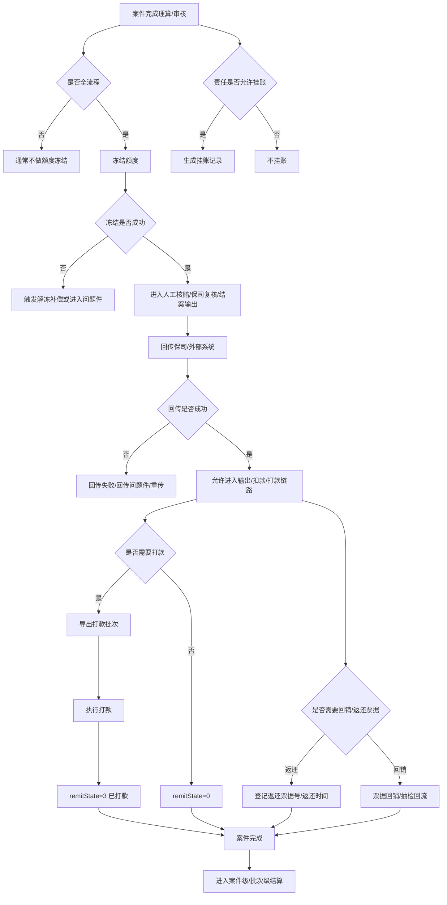
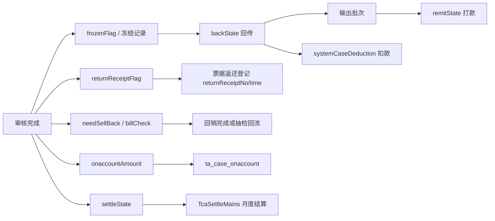

# 资金与结算专题：冻结、解冻、打款、回传、回销、返还票据、挂账、结算状态

这篇文档讲的不是“理赔金额怎么算出来”，而是案件进入审核和输出阶段以后，钱、额度、票据、回传和结算状态是怎么流转的。

## Key Takeaways

- `冻结` 不是打款，它更像“先占住额度”，防止案件审核通过后超赔或重复占用保额。
- `解冻` 往往发生在打回核赔、拒付、回退、异常补偿等场景，目标是把之前占住的额度释放掉。
- `回传` 是把案件结果发给保司或外部系统；`打款` 是赔款实际支付动作；`扣款` 是部分对接保单上的后续资金确认动作，三者不是一回事。
- `回销` 在这套系统里更接近“票据后处理/票据核销/抽检回流”的历史业务词，不等于普通会计语境下的销账。
- `挂账` 表示当前案件没完全消化掉的可赔金额，先挂在卡或人身上，等后续案件继续承接。
- `结算状态` 至少有两层：案件级 `settleState`，以及月度/批次级 `tca_settle_mains` 结算状态，两者不要混看。

## 先把几个容易混的词分开

| 词 | 它在系统里的含义 | 常见字段/对象 |
| --- | --- | --- |
| 冻结 | 审核通过后先占用额度 | `TcDivisionalCaseExt.frozenFlag`、`frozenSerialNo`、`caseFrozen(...)` |
| 解冻 | 把已占用额度释放 | `unFreeze4Case(...)` |
| 回传 | 把理赔结果发给保司/外部 | `backState`、`ReturnCase`、`ClaimFileLog` |
| 打款 | 实际发起赔款支付 | `remitState`、输出批次、银行打款 |
| 扣款 | 某些对接模式下，对外部结算链路做资金确认 | `systemCaseDeduction(...)` |
| 回销 | 票据后处理/核销/抽检回流 | `needSellBack`、`billCheck`、`sellBack(...)` |
| 返还票据 | 实体票据是否要退回客户 | `returnReceiptFlag`、`returnReceiptNo`、`returnReceiptTime` |
| 挂账 | 当前案件没消化完的可赔金额暂挂 | `onaccountAmount`、`ta_case_onaccount` |
| 结算 | 案件或月度费用进入财务结算 | `settleState`、`TcaSettleMains` |

## 全景图

## 1. 冻结：为什么审核通过后还要先占额度

### 1.1 冻结的业务目的

- 防止案件审核通过后，责任余额、个人账户、主卡账户被别的案件先占走。
- 防止一个案件已经准备给付，但保单可用额度还没有“锁住”。
- 对接保司时，还要尽量保证“我方已通过”和“对方也认这笔额度”尽量一致。

### 1.2 冻结发生在什么时点

从 `CaseSubmitPayService.submitCore(...)` 和后续 `caseSubmit(...)` 看，典型时点是：

1. 案件在 `41/44` 后提交审核通过。
2. 如果不再继续走人工/保司/单位复核，就进入 `42` 主链路。
3. 对全流程案件，系统会继续执行冻结相关逻辑。

### 1.3 冻结冻结的是什么

- 个人账户额度
- 主卡账户额度
- 某些保司自己的外部余额/保额接口额度

代码里能直接确认的点：

- OA 侧冻结通过 `caseFrozen(...)` 触发。
- 会分别构造“个人账户冻结数据”和“主卡账户冻结数据”。
- 某些保司还会额外调用自己的冻结接口。

### 1.4 哪些案件不一定冻结

- 半流程案件：打回时的解冻逻辑里明确写了“半流程案件不需要解除冻结金额”，高概率意味着半流程通常不走这条冻结主链，但这条结论更像代码推断，`需确认`。
- 风险保单子案件：在按保单拆子案件时，代码写了“风险保单无需冻结金额，只需拆分”。
- 某些特殊单位/特殊虚拟责任场景：冻结前会先过滤虚拟责任。

### 1.5 冻结与拆分案件的关系

有些对接模式下，案件不会直接按“一个母案件”冻结，而是：

1. 先按理算保单拆出子案件。
2. 子案件记录各自的理算保单和金额。
3. 非风险保单子案件再逐个冻结。

这解释了为什么你会看到“案件已经审核完成了，但还多了一层子案件/冻结记录”。

## 2. 解冻：什么情况下要把额度放回来

### 2.1 最常见的解冻触发

- 打回核赔 `backToClaim(...)`
- 拒付
- 回退
- 外部冻结失败后的补偿
- 某些保司定制的重传/重做流程

### 2.2 打回核赔时会发生什么

`OutputService.backToClaim(...)` 这条链路里可以直接看到：

1. 先校验案件当前是否允许回滚。
2. 先把回传中的失败记录处理掉。
3. 执行 `unFreeze4Case(...)` 解冻。
4. 清掉一部分回传/风控/回销相关标记。
5. 把案件状态退回到 `41` 或 `44` 前的可重新审核位置。

这说明“打回核赔”不是单纯改个状态，而是要把前面已经占住的额度、已经形成的输出副作用一起撤回。

### 2.3 解冻时会不会区分保司

会。`unFreeze4Case(...)` 明确按 `dockingMode` 分不同实现：

- 人保健康
- 中华
- 中信保诚
- 新鼎和
- 国宝鼎级
- 中邮
- 英大新核心
- 其它对接模式

也就是说，业务上统一叫“解冻”，但底层不一定是同一套接口。

### 2.4 冻结失败后的补偿

代码里有一条很关键的兜底：

1. 先做 OA 冻结。
2. 再做保司冻结。
3. 如果保司冻结失败，但 OA 已经冻结成功，就触发 OA 解冻补偿。
4. 如果补偿也失败，案件被要求进入核赔问题件人工处理。

这条逻辑非常重要，因为它解释了“为什么有的案件不是纯技术报错，而是被要求打到问题件”。

## 3. 回传：把案件结果送出系统

### 3.1 回传不是打款

回传的核心含义是：

- 把案件结果、责任结果、票据信息、赔付信息发送给保险公司或外部系统。

相关字段：

| 字段 | 含义 |
| --- | --- |
| `backState=0` | 不需要回传 |
| `backState=1` | 需要回传，等待回传 |
| `backState=2` | 已回传 |
| `backState=3` | 部分回传 |
| `doubtBackState` | 问题件回传状态 |

### 3.2 回传前会做哪些校验

`adjustment` 里的回传校验很重，能直接看到会校验：

- 收款人信息
- 事故人姓名/证件号
- 申报金额
- 票据医保字段加总关系
- 医院代码/医院名称
- 疾病编码/地点编码

所以很多“明明理算完成了但回不出去”的案子，本质上不是状态问题，而是数据完整性问题。

### 3.3 回传失败有什么后果

- 不能随便重新理算
- 不能随便再打回
- 可能进入回传问题件
- 某些保司要看失败记录是否允许重传

这就是为什么排查案件时一定要看 `backState` 和回传日志，而不是只盯着 `state`。

## 4. 打款与扣款：结果发出以后，钱怎么真正动起来

## 4.1 打款状态怎么看

`TcDivisionalCase.remitState` 的含义可以直接确认：

| 值 | 含义 |
| --- | --- |
| `0` | 不需要打款 |
| `1` | 需要打款 |
| `2` | 已导出打款批次 |
| `3` | 已打款 |

### 4.2 什么决定一个案件要不要打款

至少有三层相关配置概念：

- `needPay`：保单/配置层是否需要打款
- `batchPayment`：是否走批量打款
- `autoPayAfterReturnCase`：回传成功后是否允许/自动推进打款链路

这里要区分两件事：

- `needPay` 更像“这类业务有没有打款诉求”的基础配置口径。
- `paymentFlag(...)` 这段代码直接决定的是“批量打款链路怎么走”，不是 `needPay` 的完整唯一入口。

从 `paymentFlag(...)` 看，批量打款配置优先看：

1. 投保单位层
2. 保险公司层
3. 保单层逻辑目前代码中暂时下线

### 4.3 打款前为什么常常要求先导出批次

`confirmRemitByCase(...)` 里写得很直白：

- 状态不是 `42`，不打款。
- `remitState=1` 时，先报错“请先导出打款报表”。
- 只有 `remitState=2` 才允许真正确认打款并改到 `3`。

所以“导出打款批次”不是附带动作，而是打款前置条件。

### 4.4 批次打款和单案打款

- 批次打款：`confirmRemit(batchId, user)`
- 单案打款：在输出链路里针对单个分案推进 `remitState`

批次状态不是简单取一个案件状态，而是综合分案集合推导：

- 全部 `0` -> 批次不需要打款
- 全部 `3` -> 批次已完成打款
- 有 `3` 也有其它 -> 批次部分打款

### 4.5 扣款又是什么

`systemCaseDeduction(...)` 是另一条和回传强相关的资金动作。它的特点是：

- 只支持部分对接模式。
- 常常要求案件已经有成功回传记录。
- 更像“外部系统资金确认/扣款”而不是“给客户发钱”。

因此不要把 `扣款` 和 `打款` 混成一个词。

## 5. 回销：这个系统里的“回销”到底在说什么

### 5.1 先说结论

这套系统里的 `回销` 不是一个纯财务术语，而是一个历史上带有“票据后处理、票据核销、抽检回流”含义的业务词。

相关配置和字段：

- `needSellBack`：配置上是否需要回销
- `billCheck`：运行时是否待回销/部分回销/回销完成

### 5.2 配置层和运行层不是一个概念

| 层次 | 字段 | 含义 |
| --- | --- | --- |
| 配置层 | `needSellBack` | 这类保单/单位/保司是否要求回销 |
| 总案运行层 | `TcGeneralCase.billCheck` | `0-不需要 1-需要 2-部分 3-完成` |
| 分案运行层 | `TcDivisionalCase.billCheck` | 在很多场景下更像“待回销标记”，并不完整表达总案级进度 |

### 5.3 回销完成会发生什么

`Athena GeneralCaseService.sellBack(...)` 里能确认两条典型路径：

- 非抽检路径：
  - 要求总案下完成人工审核的案件齐全。
  - `billCheck` 必须是 `1` 或 `2`。
  - 操作后总案 `billCheck=3`。
  - 给各分案写一条“回销完成”操作日志。

- 抽检路径：
  - 某些随机抽检场景下，回销会把案件重新推回 `PENDING_AUDIT_IMAGE`。
  - 这意味着“回销”在部分业务里带有“抽检返工”的意思。

这也是为什么你会发现“回销”这个词在不同保单/流程里有点像两个概念叠在一起。

## 6. 返还票据：票据要不要退回客户

### 6.1 案件级标记

`returnReceiptFlag` 可直接确认：

| 值 | 含义 |
| --- | --- |
| `0` | 不返还 |
| `1` | 案件完成后要返还给客户 |
| `2` | 需要回销 |

注意这里的 `2` 再次说明：系统把“返还票据”和“回销需求”放在了一条相邻语义链上。

### 6.2 票据级返还信息

在 `TcCaseBillExt` 上还能看到：

- `returnReceiptNo`
- `returnReceiptTime`

也就是说，案件级决定“要不要返”，票据级还可以进一步登记“返的是哪张、什么时候返”。

## 7. 挂账：为什么案件已经赔了一部分，还会看到历史挂账金额

### 7.1 挂账是什么

挂账不是拒赔，也不是冻结。

它更像：

- 当前案件本来还能赔，但这次没有完全消化；
- 先把可赔余额挂起来；
- 等后续案件继续承接。

### 7.2 什么责任可以挂账

责任上有明确配置：

- `canOnaccount=0` 不允许挂账
- `canOnaccount=1` 允许挂账

### 7.3 挂账怎么落地

`OnaccountService` 里能看到几个关键动作：

1. 先统计当前卡下历史挂账金额。
2. 把历史挂账金额回填到 `dCase.onaccountAmount`。
3. 当前案件理算时，优先尝试把历史挂账继续消化。
4. 如果还有剩余，就插入新的 `ta_case_onaccount` 记录。

还有两个很重要的细节：

- 系统会插入一条 `dutyId=-1` 的挂账赔付明细，说明挂账不是普通责任赔付。
- 新插入的挂账记录先是“待承接”状态，不立刻影响其他案件，等后续确认扣款时才真正落地。

### 7.4 你看到的 `onaccountAmount` 是什么

它更接近：

- 这个人的历史挂账余额，被当前案件继承后计算出的案件视角挂账金额。

所以它不是单一票据字段，也不是当次案件独立产生的金额。

## 8. 结算状态：案件级结算和月度财务结算不是一回事

### 8.1 案件级 `settleState`

`TcDivisionalCase` 上的注释是：

| 值 | 含义 |
| --- | --- |
| `0` | 未结算 |
| `1` | 结算中 |
| `2` | 已结算 |

这更像“这个案件有没有被纳入后续财务/结算处理”。

### 8.2 月度/批次级结算

另一层是 `TcaSettleMains` / `SettleBatchDto`，它管理的是：

- 结算月份
- 应收金额
- 调整金额
- 已开票金额
- 已到账金额
- 结算周期

这明显不是单案件赔款动作，而是 TPA 与保司之间的月度费用结算。

### 8.3 这里存在一处历史口径差异

代码里对批次级结算状态有两种注释口径：

- `SettleBatchDto.settleState`：`0-待结算 1-结算中 2-已结算`
- `TcaSettleMains.settleState`：`0-未结束 1-已结算`
- `TcaSettleMains.state`：`0-未到账 1-已到账`

这说明“页面展示口径”和“底层实体口径”不是完全一一对应，这里建议你在真实业务里继续确认。

标记为：`需确认`

## 9. 一张图看懂资金相关字段

## 10. 排查这类问题时先看什么

如果你拿到一个“金额/回传/打款/回销”问题案件，建议按这个顺序看：

1. `state`：案件现在停在哪个主节点。
2. `backState` / `doubtBackState`：有没有正常回传，还是卡在回传问题件。
3. `TcDivisionalCaseExt.frozenFlag`：有没有冻结过。
4. `remitState`：需不需要打款，是否只是没导出批次。
5. `returnReceiptFlag`：这案子是返票还是回销。
6. `billCheck`：总案是不是待回销/部分回销。
7. `onaccountAmount`：是不是挂账问题，不是当前案件纯赔付问题。
8. `settleState`：案件是否已经纳入结算。

## 依据与边界

- 直接依据的核心代码：
  - `hyperion/.../entity/TcDivisionalCase.java`
  - `hyperion/.../entity/TcDivisionalCaseExt.java`
  - `hyperion/.../service/submit/CaseSubmitService.java`
  - `hyperion/.../service/submit/CaseSubmitPayService.java`
  - `hyperion/.../service/OutputService.java`
  - `athena/.../service/GeneralCaseService.java`
  - `adjustment/.../service/calculation/OnaccountService.java`
  - `hyperion/.../service/SettleService.java`
- 能从代码直接确认的字段定义，我已直接写结论。
- “回销”在不同模块里存在历史语义叠加，业务上建议你再结合真实保单和实际操作页面继续确认。
- 月度结算批次的 `settleState/state` 展示口径存在不完全一致，已标记为 `需确认`。
