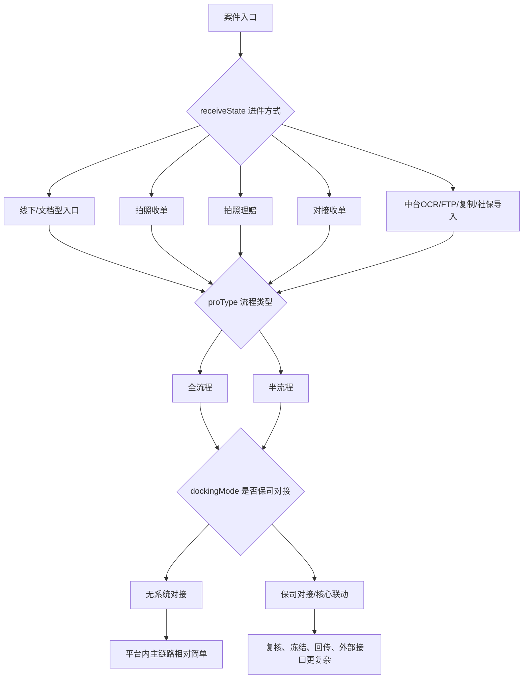

# 进件方式、流程类型与对接模式差异

这篇文档专门回答一个很实际的问题：为什么两个看起来差不多的案件，会走出完全不同的处理路径。答案通常不在票据内容，而在入口配置。最关键的三条轴就是：`receiveState`、`proType`、`dockingMode`。


## Key Takeaways

- `receiveState` 决定案件“从哪里进来、是否带影像文档阶段、偏线下还是偏线上”。
- `proType` 决定案件是全流程还是半流程，平台自己到底处理多少环节。
- `dockingMode` 决定案件后半段与哪家保司/核心系统联动，以及回传、冻结、复核会不会更复杂。
- 真正理解案件路径时，要把这三条轴叠起来看，而不是只盯一个状态码。

## 一张总图



## 一、先把三条轴区分开

| 维度 | 主要字段 | 它回答的问题 |
| --- | --- | --- |
| 进件方式 | `receiveState` | 这个案子是怎么进来的？有没有文档影像阶段？ |
| 流程类型 | `proType` | 平台要不要自己跑完整条链路？ |
| 对接模式 | `dockingMode` | 后半段要不要和保司/核心系统深度联动？ |

## 二、进件方式 `receiveState`

## 1. 进件方式速查

| `receiveState` | 名称 | 业务理解 | 一般特点 |
| --- | --- | --- | --- |
| `0` | 线下收件(普通收件) | 传统纸质或线下资料进入 | 通常有文档影像阶段。 |
| `1` | 亿保拍照收单 | 通过拍照收单进入 | 有一定影像流程，但入口比线下轻。 |
| `2` | 第三方拍照理赔进件 | 用户或第三方在线拍照提交 | 更偏线上，流程更短。 |
| `3` | 对接收单 | 外部系统直连接入 | 更依赖对接数据质量。 |
| `4` | 拍照理赔(智慧E保) | 线上拍照理赔 | 常常没有完整线下文档阶段。 |
| `5` | 德科拍照理赔 | 特定渠道拍照理赔 | 线上化程度高。 |
| `6` | 中邮拍照收单 | 中邮拍照收单入口 | 入口和保司定制关系更强。 |
| `7` | 保险公司拍照收单 | 保司侧拍照收单入口 | 更贴近保司流程。 |
| `8` | 对接收单(线下扫描) | 对接收单但仍有线下扫描特点 | 兼具对接和文档阶段特征。 |
| `9` | 保险公司中台 OCR 识别 | 保司中台直接送 OCR 结果 | 生产侧字段清洗意义更大。 |
| `10` | FTP 进件 | 文件批量传入 | 常见于批量案件或特定保司对接。 |
| `11` | 复制案件进件 | 基于已有案件复制 | 不是从零录入。 |
| `12` | 社保数据进件 | 社保数据导入 | 起点不是影像，而是结构化外部数据。 |

## 2. 哪些进件方式天然带“文档阶段”

从枚举定义能直接确认，下面这些进件方式通常包含文档/影像阶段：

- `0` 线下收件
- `1` 亿保拍照收单
- `8` 对接收单(线下扫描)
- `6` 中邮拍照收单
- `7` 保险公司拍照收单

业务上这意味着：

- 更容易先经历扫描、分类、OCR、影像整理
- 生产系统在其中的权重更高

## 3. 哪些进件方式更偏线上结构化

更偏线上或外部结构化输入的典型包括：

- `2/4/5` 拍照理赔
- `3/8` 对接收单
- `9` 中台 OCR
- `10` FTP
- `11/12` 复制案件、社保数据导入

这类案件常见特点：

- 不一定经历完整的线下文档整理
- 更依赖入口数据质量
- 某些生产节点会被跳过或压缩

## 三、流程类型 `proType`

| `proType` | 名称 | 业务理解 |
| --- | --- | --- |
| `0` | 全流程 | 平台从生产、理算、核赔到回传/返还都深度参与。 |
| `1` | 半流程 | 平台只承接部分环节，主链路通常更短。 |

## 1. 全流程怎么理解

全流程通常意味着：

- 平台要处理影像、OCR、录入、质检
- 平台要处理理算和核赔
- 平台还会承担更多回传、复核和后置流程

你在系统里看到的状态也会更完整。

## 2. 半流程怎么理解

半流程通常意味着：

- 某些前置资料或后置动作不由平台全做
- 案件可能跳过部分生产节点
- 某些系统问题件在半流程下的可修改性和恢复逻辑会不同

所以看半流程案件时，不能拿线下全流程的完整路径去硬套。

## 四、对接模式 `dockingMode`

`dockingMode` 不是单纯“哪个公司”标签，它真正决定的是：

- 后半段是否要连保司核心
- 是否存在冻结/解冻
- 是否存在保司特有复核
- 是否存在特殊回传和失败重试

## 1. 业务上最该先分成两大类

| 类别 | 业务意义 |
| --- | --- |
| `dockingMode = 0` | 无系统对接，更多事情在平台内部闭环完成。 |
| `dockingMode != 0` | 已对接保司或外部核心，后半段更复杂。 |

## 2. 为什么对接模式会让同类案件走法不同

即使两个案件都属于住院医疗、都走全流程，只要对接模式不同，后半段就可能完全不一样：

- 有的需要保司复核
- 有的要冻结额度
- 有的要走中台调查
- 有的回传失败会卡住
- 有的零赔案件必须保司再看

这就是为什么你看同类案件时，不能只问“它是不是住院案”，还要问“它挂的是哪家对接模式”。

## 五、三条轴叠起来，路径才完整

## 1. 一个典型线下全流程对接案

```text
receiveState = 0
proType = 0
dockingMode != 0
```

通常特点：

- 有文档阶段
- 生产环节完整
- 理算、核赔、复核、回传都比较完整

## 2. 一个拍照理赔半流程案

```text
receiveState = 2/4/5
proType = 1
dockingMode 可能为 0 或某保司
```

通常特点：

- 文档阶段弱或没有
- 平台不一定全做前后流程
- 更依赖入口影像和前置数据质量

## 3. 一个 FTP 对接批量案

```text
receiveState = 10
proType 依保司配置
dockingMode != 0
```

通常特点：

- 批量导入
- 更偏外部系统推送
- 生产异常和回传异常都可能更偏接口层

## 六、最实用的一张差异表

| 观察维度 | 线下/文档型入口 | 拍照理赔/线上入口 | 对接/FTP/中台入口 |
| --- | --- | --- | --- |
| 影像文档阶段 | 强 | 中等或弱 | 可能弱，依赖外部数据 |
| OCR/分类重要性 | 高 | 中 | 中到高 |
| 人工录入占比 | 高 | 中 | 低到中 |
| 第三方录入可能性 | 高 | 中 | 低到中 |
| 入口数据质量风险 | 中 | 中 | 高 |
| 回传/对接复杂度 | 取决于 `dockingMode` | 取决于 `dockingMode` | 通常更高 |

## 七、你以后看案件路径时的最小顺序

1. 先看 `receiveState`，确认这是线下、拍照、对接、FTP 还是复制/导入案。
2. 再看 `proType`，确认平台是不是承接全流程。
3. 再看 `dockingMode`，确认后半段是否会有保司核心、冻结、回传等复杂动作。
4. 最后再结合当前 `state` 看它在具体链路的哪一段。

## 八、最容易误判的几个点

| 误判 | 正确认识 |
| --- | --- |
| 只看当前状态就能知道全貌 | 不对，不看 `receiveState/proType/dockingMode`，你不知道它本来该走哪条路。 |
| 线上案和线下案只是入口不同 | 不对，它们往往连生产链路长度都不同。 |
| 半流程只是少几步 | 不完全对，很多修改权限、恢复逻辑、后置动作也会跟着变。 |
| 对接模式只是保司名称 | 不对，它实质上决定了大量后半段处理复杂度。 |

## 需确认

- 各家保司对 `receiveState + proType + dockingMode` 的定制组合非常多，这篇文档只总结公共理解模型。
- 某些特定对接模式下，案件可能会直接跳到特殊节点或附加定制录入环节，需要结合具体保司再看。
