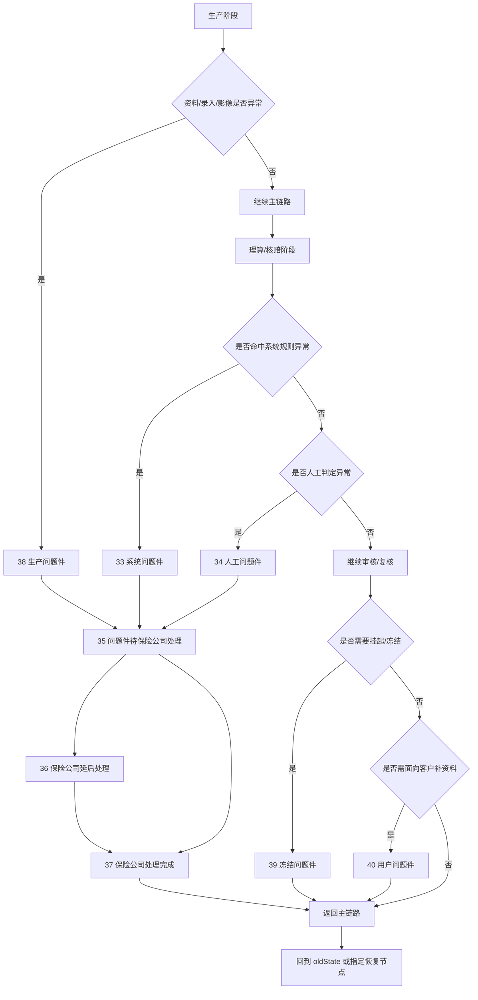
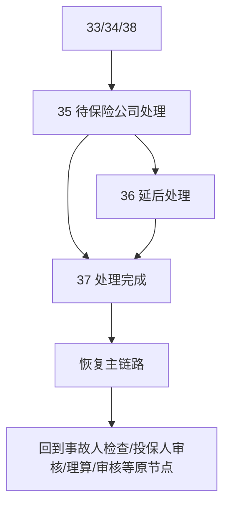
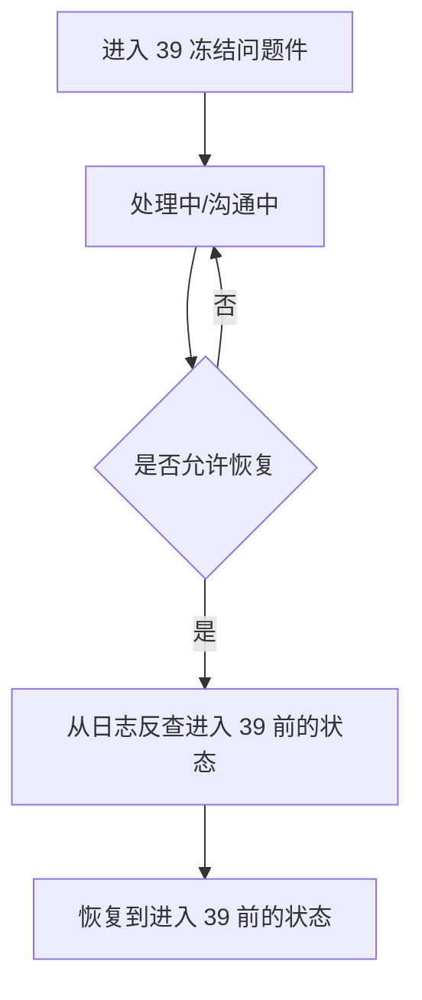

# 问题件、打回、恢复与回退手册

这篇文档专门讲 TPA 理赔平台里最容易把人看晕的一块：问题件。它回答的不是“问题件是什么”这么简单，而是“为什么会进问题件”“不同问题件有什么差别”“进了以后谁处理”“处理完怎么回主链路”“为什么有的会打回质检、有的会打给客户、有的会发给保险公司”。

## Key Takeaways

- 问题件不是一个单点状态，而是一整套异常处理旁路。
- 不同问题件最大的差别，不在名字，而在“问题发生在哪一阶段、由谁处理、能不能继续改数据、怎么回主链路”。
- `oldState`、`doubtReason`、`haveWrongState`、`doubtBackState` 是理解问题件的四个关键字段。
- 有些打回动作会清空理算结果，有些恢复动作会回到问题前状态，而不是回到固定节点。

## 一张总图

## 一、问题件到底解决什么问题

正常主链路的假设是：

- 数据够完整
- 规则能算通
- 风险可接受
- 外部处理能衔接

只要这四类假设中任意一类不成立，案件就很容易离开主链路，进入问题件旁路。

业务上可以把问题件理解成：

- 暂时不能正常往前推
- 需要额外说明、补充、确认、纠偏或外部处理
- 处理完以后再决定是恢复主链路、继续挂起，还是彻底退件/作废

## 二、问题件类型怎么分

| 状态 | 名称 | 典型发生阶段 | 谁主处理 | 业务含义 |
| --- | --- | --- | --- | --- |
| `38` | 生产问题件 | 影像、OCR、录入、质检 | `athena` | 还没进入理算核赔，生产数据本身就不合格。 |
| `33` | 系统问题件 | 理算、核赔、校验 | `adjustment` / `hyperion` | 系统规则自动判定不能继续。 |
| `34` | 人工问题件 | 核赔、人工审核 | `hyperion` / `themis` | 业务人员明确判定当前案子不能直接继续。 |
| `35` | 问题件待保险公司处理 | 问题件外发后 | `themis` | 问题已经提交保司，等待保司处理。 |
| `36` | 问题件保险公司延后处理 | 保司处理中 | `themis` | 保司暂缓，不是拒绝，而是延后。 |
| `37` | 问题件保险公司处理完成 | 保司处理完成后 | `themis` | 问题处理结束，案件可重新回主链路。 |
| `39` | 冻结问题件 | 回传/额度控制后半段 | `hyperion` / `themis` | 多与冻结、解冻、时效挂起、额度一致性相关。 |
| `40` | 用户问题件 | 用户/客户交互场景 | `hyperion` / `themis` | 需要客户、用户或资料提供方补动作。 |

## 三、每类问题件通常是怎么触发的

## 1. 生产问题件 `38`

更偏“资料和录入不能直接用”：

- 影像分类错误
- 图片不清晰
- 第三方回传字段缺失
- OCR/录入和影像对应关系错误
- 票据或报案信息结构不满足平台校验

它的核心特点是：

- 还没到真正算钱的环节
- 问题集中在数据成型之前

## 2. 系统问题件 `33`

更偏“规则自动拦截”：

- 找不到有效个单或责任
- 银行信息规则不通过
- 关键字段缺失但已进入理算/核赔校验
- 某些对接或申请书生成失败
- 系统脚本判断当前案子不能继续

代码里常见做法是：

- 记录 `oldState`
- 写入 `doubtReason`
- 切到系统问题件状态
- 某些场景会清空已有理算历史

## 3. 人工问题件 `34`

更偏“人工业务判断要拦下来”：

- 人工审核发现资料风险
- 特殊药房票、大额票据需要人工核实
- 审核员判断不能直接通过，需要发保司处理
- 保单或保司要求异常案件转人工问题件

代码里明确能看到：

- 打成人工问题件前会校验当前状态是否允许
- 会清空理算历史
- 会把 `realIndemnityAmount` 归零
- 会把 `haveWrongState` 标成已经历问题件

## 4. 冻结问题件 `39`

这类问题件不是“录错了”或“算错了”，而是后半段的额度控制与时效控制问题：

- 冻结失败
- 解冻失败
- 案件挂起
- 外部沟通未结束
- 外部额度状态与内部状态不一致

特别要记住：

- `39` 恢复时不是简单回固定节点
- 代码会从日志里反查“进入 39 之前的状态”，再恢复回去

## 5. 用户问题件 `40`

这类问题件更像“需要客户或材料提供方补动作”：

- 某张票的图片有错误，需要重新补图
- 某些材料缺失，需要用户补件
- 图像级别问题需要明确标到具体影像或票据

代码里能看到：

- 可以按图片维度记录错误原因
- 如果是收据类图片，还会把错误原因挂到票据扩展信息上

## 四、问题件关键字段怎么读

| 字段 | 业务含义 | 你要怎么用 |
| --- | --- | --- |
| `oldState` | 进入问题件前的原状态 | 先看它，才能知道这个案子是从哪一步掉出来的。 |
| `doubtReason` | 问题件原因 | 这是理解当前问题最直接的描述字段。 |
| `haveWrongState` | 是否经历过问题件 | `0` 未经历；`1` 亿保系统问题件；`2` 保险公司问题件。 |
| `doubtBackState` | 问题件回传状态 | 判断问题件结果有没有发回外部。 |
| `doubtSendTime` | 问题件发送保司时间 | 适合判断是否已经真正外发。 |
| `doubtBelong` | 问题件归属 | 用来区分偏系统处理还是偏业务处理。 |
| `doubtIgnore` | 问题件是否忽略 | 某些特定问题可被业务忽略后继续流转。 |
| `errorMsg` | 错误信息 | 有时会叠加客户反馈或系统报错。 |

## 五、打回动作与问题件动作不是一回事

很多人会把“打回质检”和“打问题件”混成一件事，其实不是。

| 动作 | 本质 | 典型去向 |
| --- | --- | --- |
| 打回质检 | 认为案件还可以回生产修正 | `25 质量检验` 或前置生产节点 |
| 打到系统问题件 | 系统规则认定当前不能继续 | `33` |
| 打到人工问题件 | 审核员认定当前不能继续 | `34` |
| 打到用户问题件 | 需要客户侧补资料/处理 | `40` |
| 发送保险公司处理 | 问题已升级到保司 | `35/36/37` |

## 六、打回质检时，系统通常会做什么

从核赔打回质检，不只是改个状态，常常还会做一整套“回退清理”动作：

- 清空理算历史
- 清空质检字节表信息
- 某些保司场景删除赔案号
- 写入“打回质检”原因
- 删除后续状态链路
- 重新打回质检指派

所以业务上要这么理解：

- 打回质检不是“备注一下再回去”
- 它是一次真正意义上的主链路回退

## 七、问题件怎么回主链路

问题件不是终点，关键是“恢复规则”。

### 1. 保司问题件处理完成后回主链路

常见链路是：

这里最关键的是：

- 它恢复到哪，不只看当前状态
- 更重要的是看它进问题件前是从哪掉下来的

### 2. 冻结问题件 `39` 恢复

这类恢复的关键点是：

- `oldState` 本身可能不会被直接覆盖成 39 前状态
- 恢复时会通过日志反查更早的前置状态

### 3. 用户问题件恢复

用户问题件通常意味着：

- 用户/客户已经补充反馈
- 影像或材料问题已解决
- 平台可重新进入主链路

这类恢复往往会带着新的错误说明、客户反馈或补充材料继续推进。

## 八、哪些问题件还能改数据

这点非常实用。不是所有问题件都还能直接改内容。

从当前代码逻辑能确认一些典型情况：

- 投保人审核失败、事故人检查失败，允许继续修改
- 系统问题件如果 `oldState` 属于录入阶段或待事故人检查，通常允许修改
- 系统问题件且为半流程，也存在允许修改的特例
- 已经发送给保险公司的问题件，很多场景下不允许随便改

## 九、你以后排查问题件的最小顺序

1. 先看当前是不是 `33/34/35/36/37/38/39/40`。
2. 再看 `oldState`，判断它是从哪一步掉出来的。
3. 看 `doubtReason` 和 `errorMsg`，确认是资料问题、规则问题、人工判断还是外部处理问题。
4. 看 `haveWrongState` 和 `doubtSendTime`，判断是否已经外发过保司。
5. 如果是 `39`，再看它是不是冻结/挂起类问题，不要按普通问题件理解。
6. 如果是 `40`，优先回到影像和票据层，找具体是哪张图、哪张票出问题。

## 十、你最容易误判的几个点

| 误判 | 正确认识 |
| --- | --- |
| 所有问题件都一样 | 不对，生产问题件、系统问题件、人工问题件、冻结问题件、用户问题件性质完全不同。 |
| 打回质检就是问题件 | 不对，打回质检更像主链路回退，不一定进入问题件状态。 |
| 处理完问题件就一定结案 | 不对，很多问题件只是回主链路继续走。 |
| `39` 和普通问题件一样 | 不对，它更偏冻结/时效/额度控制。 |
| 看当前状态就够了 | 不对，不看 `oldState` 基本看不懂问题件。 |

## 需确认

- 不同保司下，哪些问题件类型会被自动发送保险公司，哪些需要人工发送，存在大量定制差异。
- 用户问题件恢复后的具体目标节点，在不同对接模式和客户流程里可能不同，这里只写了公共理解。
