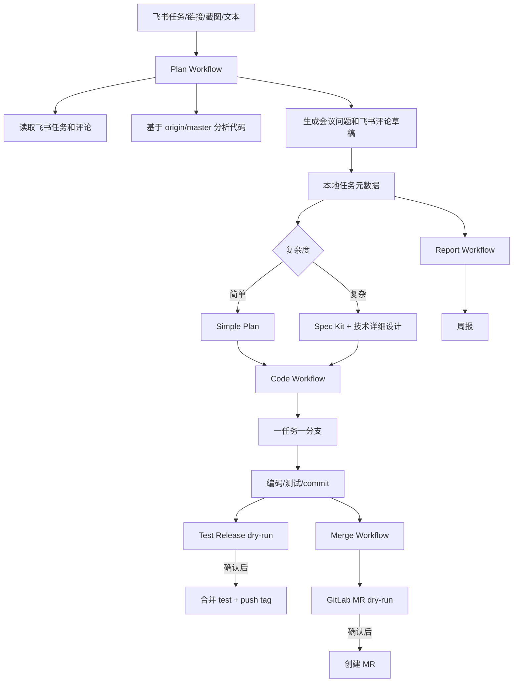
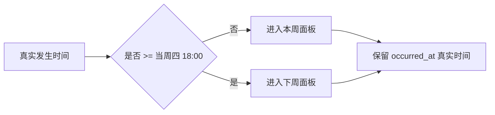
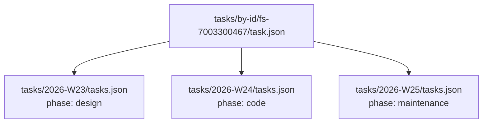
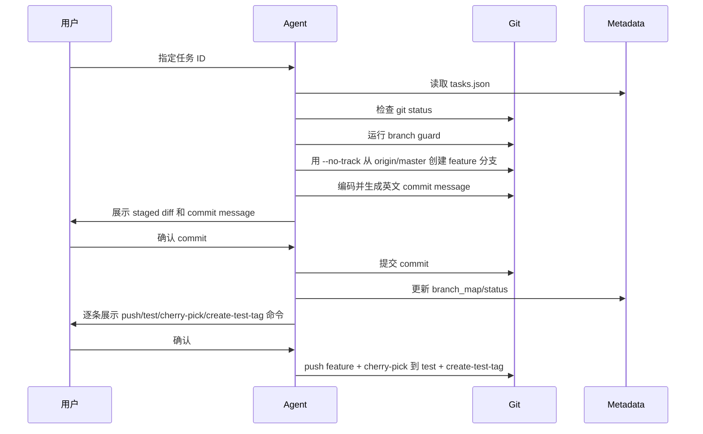

# Yibao 飞书工单闭环 Workflow Plugin 使用手册

这份笔记记录 `yibao-workflow` 插件的完整闭环：飞书工单拉取、需求分析、设计文档、编码分支、测试发布、GitLab 合并请求和周报。当前实现已经集成到 Codex、opencode 和 Claude Code，三边共用同一套 workflow 元数据和脚本。

## 目录

- [Key Takeaways](#key-takeaways)
- [整体架构](#整体架构)
- [已安装位置](#已安装位置)
- [跨工具集成状态](#跨工具集成状态)
- [闭环事实源模型](#闭环事实源模型)
- [工作流拆分](#工作流拆分)
- [启动目录与三端执行顺序](#启动目录与三端执行顺序)
- [命令总表](#命令总表)
- [使用实例](#使用实例)
- [元数据结构](#元数据结构)
- [分支与仓库映射](#分支与仓库映射)
- [安全边界](#安全边界)
- [维护与更新](#维护与更新)
- [排查手册](#排查手册)

## Key Takeaways

- `yibao-workflow` 是个人本地插件，安装根目录是 `/Users/yuanjianwei/plugins/yibao-workflow`。
- 三个工具共享同一个事实源：`/Users/yuanjianwei/work/clients/yibao/workflow`。
- 事实源采用“任务主档 + 周面板索引”：`tasks/by-id/<task_uid>/task.json` 是唯一主档，`tasks/YYYY-Www/tasks.json` 只是周视图。
- 周归属采用评审节奏：周一为自然起点，但周四 18:00 后产生的 workflow 记录进入下周面板。
- 同一需求跨多周时只保留一个 `task_uid`，多周面板引用同一个任务主档，避免重复和上下文断裂。
- 每个阶段结束必须执行 `checkpoint`，让 plan/design/code/merge/report 形成可续接的链式闭环。
- 截图/图片默认跳过解析，只有明确要求“解析截图/图片”时才启用，降低 token 消耗和多模态依赖。
- 飞书评论、Git push、测试 tag、GitLab MR 都不是静默写入，默认先生成草稿或 dry-run。
- opencode 通过 `~/.opencode/plugins/yibao-workflow.js` 和 `~/.opencode/skills/*` 使用。
- Claude Code 通过 `~/.claude/plugins/marketplaces/yibao-workflow`、`~/.claude/plugins/cache/yibao-workflow/...` 和 `~/.claude/skills/*` 使用。
- GitLab token 不写入文件，建议保存到 macOS Keychain 的 `yibao_gitlab_token` 服务名。

## 整体架构



核心设计原则：

| 原则 | 说明 |
| --- | --- |
| 任务主档先行 | 所有任务先进入 `tasks/by-id/<task_uid>/task.json`，后续 design/code/merge/report 都读它 |
| 读写分离 | 读取飞书和代码自动执行，外部写入必须确认 |
| 一任务一分支 | 任务和分支双向映射，方便测试发布和正式合并 |
| 简单/复杂分流 | 简单任务只写轻量 plan，复杂任务走 Spec Kit |
| 周维度汇报 | 周一为起点，周四 18:00 后进下周面板，只汇报写代码或输出文档的任务 |

## 已安装位置

| 类型 | 路径 | 说明 |
| --- | --- | --- |
| 插件根目录 | `/Users/yuanjianwei/plugins/yibao-workflow` | Codex personal plugin 源 |
| Codex marketplace | `/Users/yuanjianwei/.agents/plugins/marketplace.json` | 已加入 `yibao-workflow` |
| workflow 事实源 | `/Users/yuanjianwei/work/clients/yibao/workflow` | 任务、周报、模板、配置 |
| opencode 插件 | `/Users/yuanjianwei/.opencode/plugins/yibao-workflow.js` | opencode JS plugin |
| opencode skills | `/Users/yuanjianwei/.opencode/skills/yibao-*` | workflow skills |
| Claude marketplace | `/Users/yuanjianwei/.claude/plugins/marketplaces/yibao-workflow` | Claude local marketplace |
| Claude cache | `/Users/yuanjianwei/.claude/plugins/cache/yibao-workflow/yibao-workflow/0.1.0` | Claude installed plugin cache |
| Claude skills | `/Users/yuanjianwei/.claude/skills/yibao-*` | workflow skills |
| 手册 | `/Users/yuanjianwei/plugins/yibao-workflow/docs/manual.md` | 插件自带手册 |

## 跨工具集成状态

| 工具 | 集成方式 | 已做改动 | 触发方式 |
| --- | --- | --- | --- |
| Codex | personal plugin + skills + MCP config | `~/.agents/plugins/marketplace.json` 加入插件 | 在 Codex 中使用 `yibao-workflow` 或子 workflow skill |
| opencode | JS plugin + skills 目录 | `~/.opencode/opencode.json` 和 `~/.config/opencode/opencode.json` 加入插件路径 | 输入包含飞书、工单、核赔、中台、周报等关键词时自动提示；也可使用 `yibao_workflow` tool |
| Claude Code | local marketplace/cache + skills 目录 | `~/.claude/settings.json` 启用 `yibao-workflow@yibao-workflow` | 直接说“使用 yibao-workflow / yibao plan workflow” |

opencode 已更新配置：

| 配置文件 | 新增项 |
| --- | --- |
| `~/.opencode/opencode.json` | `.opencode/plugins/yibao-workflow.js` |
| `~/.config/opencode/opencode.json` | `/Users/yuanjianwei/.opencode/plugins/yibao-workflow.js` |

Claude 已更新配置：

| 配置文件 | 新增项 |
| --- | --- |
| `~/.claude/settings.json` | `enabledPlugins.yibao-workflow@yibao-workflow = true` |
| `~/.claude/plugins/known_marketplaces.json` | local marketplace `yibao-workflow` |
| `~/.claude/plugins/installed_plugins.json` | cache install path `.../0.1.0` |

## 闭环事实源模型

### 目录结构

```text
/Users/yuanjianwei/work/clients/yibao/workflow/
  index.json
  tasks/
    by-id/
      <task_uid>/
        task.json
        requirements.md
        plan.md
        design.md
        code.md
        merge.md
        comments.md
        events.jsonl
    2026-W24/
      tasks.json
      tasks.md
  reports/
    2026-W24-weekly.md
```

| 文件 | 角色 | 用法 |
| --- | --- | --- |
| `tasks/by-id/<task_uid>/task.json` | 唯一任务主档 | 保存标题、飞书链接、系统、仓库、分支、状态、阶段、周归属、产物索引 |
| `events.jsonl` | 追加式事件流 | 每次 plan/design/code/merge/report 的 checkpoint 都追加一行 |
| `plan.md` | 会前分析产物 | 需求理解、用户已答问题、待问飞书问题、代码上下文 |
| `design.md` | 设计阶段产物 | 简单计划或复杂设计文档索引 |
| `code.md` | 编码阶段产物 | 分支、commit、测试结果、实现备注 |
| `merge.md` | 合并阶段产物 | MR dry-run、MR URL、指派人 |
| `comments.md` | 飞书评论草稿 | 默认草稿，确认后才写飞书 |
| `tasks/YYYY-Www/tasks.json` | 周面板索引 | 只保存当周展示和周报需要的摘要 |
| `index.json` | 全局索引 | 按飞书链接、任务号、标题、分支快速定位任务 |

设计阶段结束时，最终设计摘要会压缩保存到 `task.json.phase_summaries.design`，并同步追加到 `design.md`。这份摘要供后续 `yibao-code-workflow` 快速恢复上下文，不覆盖 `plan.summary`。

### 阶段 Checkpoint

每个子 workflow 完成阶段后都要执行：

```bash
python3 ~/plugins/yibao-workflow/scripts/yibao_workflow.py checkpoint \
  --phase plan \
  --task-uid <task_uid> \
  --status planned \
  --summary "本阶段摘要"
```

`checkpoint` 会自动完成：

| 动作 | 说明 |
| --- | --- |
| 识别任务 | 按 `task_uid`、飞书链接、story id、任务号、标题匹配 |
| 创建/更新主档 | 写入 `tasks/by-id/<task_uid>/task.json` |
| 追加事件 | 写入 `events.jsonl` |
| 更新阶段文件 | 更新或追加 `plan.md/design.md/code.md/merge.md/comments.md` |
| 更新周面板 | 写入当前 board week 的 `tasks.json/tasks.md` |
| 更新索引 | 重建 `index.json` |

### 周归属规则



示例：

| 真实时间 | Board Week | 说明 |
| --- | --- | --- |
| 2026-06-04 17:59 | `2026-W23` | 周四 18 点前，仍属于本周 |
| 2026-06-04 18:00 | `2026-W24` | 从这个时间点开始进入下周面板 |
| 2026-06-05 10:00 | `2026-W24` | 周五记录用于下周评审/工作安排 |

### 跨周任务维护

同一个需求只维护一个任务主档，多周只做引用：



这样第一周设计、第二周开发、第三周测试反馈都能从同一个 `task_uid` 续接，不会把问题、分支、设计文档分散到三条任务里。

## 工作流拆分

| Skill | 用途 | 典型输入 | 典型输出 |
| --- | --- | --- | --- |
| `yibao-workflow` | 总入口和路由 | “使用 Yibao workflow 处理这些任务” | 路由到 plan/design/code/merge/report |
| `yibao-plan-workflow` | 会前分析、代码上下文、问题清单 | 飞书任务链接、需求列表、截图 | 任务表、复杂度、会议问题、飞书评论草稿 |
| `yibao-design-workflow` | 简单 plan 或复杂 Spec Kit | 已计划任务、补充信息 | 轻量 plan 或技术详细设计 |
| `yibao-code-workflow` | 编码和测试发布 | 本地任务 ID、飞书链接、任务清单 | 分支、commit、测试结果、test 发布 dry-run |
| `yibao-merge-workflow` | 批量 GitLab MR | 今日合并列表、截图、assignee | MR dry-run payload，确认后创建 MR |
| `yibao-report-workflow` | 周报 | 当前周或指定周 | `reports/YYYY-Www-weekly.md` |

## 启动目录与三端执行顺序

### 总原则

| 使用场景 | 应该进入的目录 | 原因 | 推荐工具 |
| --- | --- | --- | --- |
| 飞书任务分析、会前问题、任务台账、周报、批量 MR | `/Users/yuanjianwei/work/clients/yibao` | 这是 Yibao 总工作区，能看到 `projects/`、`docs/`、`workflow/` 和总 `AGENTS.md` | Codex / opencode / Claude 均可 |
| 核赔 Hyperion 后端编码 | `/Users/yuanjianwei/work/clients/yibao/projects/hyperion/Hyperion` | 这是 `Hyperion` 独立 Git 仓库 | Codex 或 Claude |
| 核赔 tpa-common 编码 | `/Users/yuanjianwei/work/clients/yibao/projects/hyperion/tpa-commom` | 这是 `tpa-common` 独立 Git 仓库 | Codex 或 Claude |
| 中台 themis-ins 编码 | `/Users/yuanjianwei/work/clients/yibao/projects/themis/themis-ins` | 这是 `themis-ins` 独立 Git 仓库 | Codex 或 Claude |
| 中台 themis_ins_core 编码 | `/Users/yuanjianwei/work/clients/yibao/projects/themis/themis_ins_core` | 这是 `themis_ins_core` 独立 Git 仓库 | Codex 或 Claude |
| 标注平台 linklabel 编码 | `/Users/yuanjianwei/work/clients/yibao/projects/linklabel` | 这是 `linklabel` 独立 Git 仓库 | Codex 或 Claude |

简单记法：

- **分析、设计、周报、批量合并**：从 `/Users/yuanjianwei/work/clients/yibao` 启动。
- **真正改代码**：从对应 Git 仓库目录启动。
- **不要在 `/Users/yuanjianwei/work/clients/yibao/projects/hyperion` 直接做 Git 操作**，因为它本身不是 Git 仓库，下面的 `Hyperion` 和 `tpa-commom` 才是仓库。

### Workflow 自动预检

现在 `yibao-workflow` 已内置 `preflight`，Codex/opencode/Claude 触发任一子 workflow 时都应先自动执行：

```bash
cd /Users/yuanjianwei/work/clients/yibao
python3 ~/plugins/yibao-workflow/scripts/yibao_workflow.py preflight
```

`preflight` 做四件事：

| 动作 | 说明 |
| --- | --- |
| 补齐目录 | 缺失时创建 `workflow/tasks/reports/inbox/comments/config/templates` |
| 补齐模板 | 缺失时复制插件内模板到 workflow 目录 |
| 补齐当前周任务文件 | 只在 `tasks/YYYY-Www/tasks.json` 不存在时创建 |
| 校验元数据 | 等价于自动跑 `validate`，并输出当前 `week-id` |

正常使用时你不需要手动执行 `init/validate/week-id`。只有排查问题或直接操作脚本时，才单独运行这些命令。

### Codex 启动顺序

适合：需求分析、复杂设计、代码实现、批量 MR、周报。

| 步骤 | 终端命令或 Codex 输入 | 说明 |
| --- | --- | --- |
| 1 | `cd /Users/yuanjianwei/work/clients/yibao` | 进入总工作区 |
| 2 | `codex` | 启动 Codex |
| 3 | `使用 yibao-workflow，检查当前周任务元数据，并说明当前 workflow 根目录和可用子流程。` | 验证插件和元数据是否被识别 |
| 4 | `使用 yibao-plan-workflow 分析这些飞书任务：...` | 开始需求分析 |
| 5 | `使用 yibao-report-workflow 生成本周工作汇报。` | 生成周报 |

Codex 需求分析完整示例：

```text
使用 yibao-plan-workflow 分析这些飞书任务：
1. 【核赔】【6.4上线】中宏个险核赔展示产品责任次定义 https://...
2. 【中台】增加保司赔案号的展示和检索 https://...

要求：
- 基于 origin/master 找代码上下文
- 输出需求理解、涉及仓库、复杂度、会议问题
- 只生成飞书评论草稿，不要直接写评论
- 更新本周任务元数据
```

Codex 编码时从具体仓库启动，例如：

```bash
cd /Users/yuanjianwei/work/clients/yibao/projects/hyperion/Hyperion
codex
```

进入后输入：

```text
使用 yibao-code-workflow 实现任务 260513008。
先读取本地任务元数据和飞书评论，检查 git status，再从 origin/master 创建 feature 分支。
编码完成后先展示测试发布 dry-run，不要直接 push/tag。
```

### opencode 启动顺序

适合：快速调用 workflow 工具、生成周报、校验 metadata，也可以做需求分析。

| 步骤 | 终端命令或 opencode 输入 | 说明 |
| --- | --- | --- |
| 1 | `cd /Users/yuanjianwei/work/clients/yibao` | 进入总工作区 |
| 2 | `opencode` | 启动 opencode |
| 3 | `Use yibao_workflow action preflight` | 验证 opencode tool 是否加载，并完成 workflow 自动预检 |
| 4 | `使用 yibao-plan-workflow 分析这些飞书工单...` | 开始需求分析 |
| 5 | `Use yibao_workflow action render-report` | 生成周报 |

opencode 快速验证示例：

```text
Use yibao_workflow action preflight
```

```text
Use yibao_workflow action render-report
```

opencode 需求分析示例：

```text
使用 yibao-plan-workflow 分析这些飞书工单。
请基于 origin/master 找代码上下文，输出会议问题和任务元数据。
飞书评论只生成草稿，不要直接写入。
```

### Claude Code 启动顺序

适合：复杂设计文档、代码实现、重构、较长上下文工作。

| 步骤 | 终端命令或 Claude 输入 | 说明 |
| --- | --- | --- |
| 1 | `cd /Users/yuanjianwei/work/clients/yibao` | 进入总工作区 |
| 2 | `claude` | 启动 Claude Code |
| 3 | `使用 yibao-workflow，检查当前周任务元数据，并说明当前 workflow 根目录和可用子流程。` | 验证插件/skills 是否加载 |
| 4 | `使用 yibao-design-workflow ...` | 生成简单 plan 或复杂设计 |
| 5 | `使用 yibao-report-workflow 生成本周工作汇报。` | 生成周报 |

Claude 复杂设计示例：

```text
使用 yibao-design-workflow，对【核赔】审核环节增加时效冻结的需求走复杂任务流程。
请读取飞书需求、评论和我补充的内容，使用 Spec Kit 生成 spec/plan/tasks/technical-design。
详细设计文档要给产品和测试看，不要直接贴代码。
```

Claude 编码时从具体仓库启动，例如：

```bash
cd /Users/yuanjianwei/work/clients/yibao/projects/themis/themis-ins
claude
```

进入后输入：

```text
使用 yibao-code-workflow 实现本地任务元数据中的【中台】任务。
一个任务一个 feature 分支，完成后提交 commit。
测试发布、push、MR 都先 dry-run，不要直接执行。
```

### 三端怎么选择

| 任务类型 | 首选工具 | 备选工具 | 原因 |
| --- | --- | --- | --- |
| 批量飞书任务分析 | Codex | Claude / opencode | Codex 当前已具备 GitHub/本地插件和较完整工具链 |
| 快速校验 metadata、生成周报 | opencode | Codex / Claude | opencode 有 `yibao_workflow` tool，调用快 |
| 复杂设计文档 | Claude | Codex | Claude Code 长文档和设计输出体验好 |
| 代码实现和测试 | Codex | Claude | Codex 在当前工作区有更强的代码编辑和校验约束 |
| 批量 MR | Codex | opencode / Claude | 需要读 metadata、生成 GitLab payload、确认后执行 |

### 启动后最小验收清单

| 工具 | 验收输入 | 通过标准 |
| --- | --- | --- |
| Codex | `使用 yibao-workflow，检查当前周任务元数据。` | 能说明 workflow 根目录和当前周任务文件 |
| opencode | `Use yibao_workflow action week-id` | 返回当前周 ID |
| opencode | `Use yibao_workflow action validate` | 返回 `Metadata OK` |
| Claude | `使用 yibao-workflow，说明可用子流程。` | 能列出 plan/design/code/merge/report |
| 任意工具 | `使用 yibao-report-workflow 生成本周工作汇报。` | 生成或指出 `workflow/reports/YYYY-Www-weekly.md` |

## 命令总表

### 初始化与集成命令

| 场景 | 命令 | 说明 |
| --- | --- | --- |
| 自动预检 workflow | `python3 ~/plugins/yibao-workflow/scripts/yibao_workflow.py preflight` | 补齐缺失目录/模板/当前周任务文件，校验 metadata，并输出当前周 |
| 初始化 workflow 目录 | `python3 ~/plugins/yibao-workflow/scripts/yibao_workflow.py init` | 创建 `workflow/config/templates/tasks/reports` |
| 刷新 Codex 插件缓存 | `codex plugin add yibao-workflow@personal` | 让新 Codex 会话加载最新 plugin/skills/MCP |
| 同步 opencode/Claude | `python3 ~/plugins/yibao-workflow/scripts/integrate_external.py` | 同步 skills、opencode plugin、Claude marketplace/cache |
| 校验插件 manifest | `PYTHONPATH=/private/tmp/yibao-workflow-pydeps python3 ~/.codex/skills/.system/plugin-creator/scripts/validate_plugin.py ~/plugins/yibao-workflow` | 需要 PyYAML |
| 校验本周元数据 | `python3 ~/plugins/yibao-workflow/scripts/yibao_workflow.py validate` | 检查 `tasks.json` 字段和 repo 映射 |
| 查看当前周 ID | `python3 ~/plugins/yibao-workflow/scripts/yibao_workflow.py week-id` | 例如 `2026-W23` |
| 查看自然周 ID | `python3 ~/plugins/yibao-workflow/scripts/yibao_workflow.py week-id --actual` | 不应用周四 18 点切换 |

### 任务元数据命令

| 场景 | 命令 | 说明 |
| --- | --- | --- |
| 新增核赔任务 | `python3 ~/plugins/yibao-workflow/scripts/yibao_workflow.py add-task --title "【核赔】示例需求" --system 核赔 --feishu-url "https://..." --complexity simple --effort-days 0.5` | 默认 repo 为 `Hyperion` + `tpa-common` |
| 新增中台任务 | `python3 ~/plugins/yibao-workflow/scripts/yibao_workflow.py add-task --title "【中台】示例需求" --system 中台 --repo-key themis-ins --feishu-url "https://..."` | 可显式指定 repo |
| 新增设计文档任务 | `python3 ~/plugins/yibao-workflow/scripts/yibao_workflow.py add-task --title "【核赔】详细设计示例" --system 核赔 --complexity complex --report-category design_doc --effort-days 0` | 周报进入“详细设计文档” |
| 覆盖分支 slug | `python3 ~/plugins/yibao-workflow/scripts/yibao_workflow.py add-task --title "xxx" --system 核赔 --branch-slug claim-time-freeze` | 分支变为 `feature/claim-time-freeze` |
| 阶段 checkpoint | `python3 ~/plugins/yibao-workflow/scripts/yibao_workflow.py checkpoint --phase plan --title "【核赔】示例需求 260529005" --system 核赔 --feishu-url "https://..." --status planned --summary "需求理解"` | 创建或更新任务主档、周面板和索引 |
| 查看任务主档 | `python3 ~/plugins/yibao-workflow/scripts/yibao_workflow.py show-task --task-uid fs-7003300467` | 输出 canonical task JSON |
| 按飞书链接查看任务 | `python3 ~/plugins/yibao-workflow/scripts/yibao_workflow.py show-task --feishu-url "https://..."` | 自动通过 index 匹配 |
| 查看当前周面板 | `python3 ~/plugins/yibao-workflow/scripts/yibao_workflow.py list-week` | 输出当前 board week 的 `tasks.json` |
| 查看指定周面板 | `python3 ~/plugins/yibao-workflow/scripts/yibao_workflow.py list-week --week-start 2026-06-08` | 输出指定周视图 |

### 分支守卫命令

| 场景 | 命令 | 说明 |
| --- | --- | --- |
| 编码前 dry-run 检查 | `python3 ~/plugins/yibao-workflow/scripts/git_branch_guard.py --task-uid fs-7003300467` | 检查当前分支、本地工单分支、远端同名分支、upstream 和脏工作区 |
| 指定任务号检查 | `python3 ~/plugins/yibao-workflow/scripts/git_branch_guard.py --task-no 260529005` | 通过 `index.json` 匹配任务 |
| 只检查一个仓库 | `python3 ~/plugins/yibao-workflow/scripts/git_branch_guard.py --task-uid fs-7003300467 --repo-key Hyperion` | 多仓库任务时限制范围 |
| 执行本地修复 | `python3 ~/plugins/yibao-workflow/scripts/git_branch_guard.py --task-uid fs-7003300467 --repo-key Hyperion --execute` | 只执行本地切分支/创建分支/upstream 修复，不 push |
| 覆盖分支检查 | `python3 ~/plugins/yibao-workflow/scripts/git_branch_guard.py --task-uid fs-7003300467 --branch Hyperion=feature/add-remark-field` | 临时覆盖 `branch_map` |

分支创建标准：

```bash
git switch --no-track -c feature/xxx origin/master
```

首次推送标准：

```bash
git push -u origin feature/xxx
```

不要使用：

```bash
git checkout -b feature/xxx origin/master
```

原因：从远端跟踪分支创建本地分支时，部分 Git 配置会让 `feature/xxx` 继承 upstream 到 `origin/master`，后续 push/status 都会指向错误的上游分支。

### Checkpoint 命令实例

| 阶段 | 命令示例 | 产物 |
| --- | --- | --- |
| plan | `python3 ~/plugins/yibao-workflow/scripts/yibao_workflow.py checkpoint --phase plan --title "【核赔】备注字段 260529005" --system 核赔 --feishu-url "https://..." --status planned --summary "一键修改增加备注字段" --open-question "备注保存范围是什么？" --comment-draft "请确认备注字段保存范围"` | `task.json`、`plan.md`、`comments.md`、周面板 |
| design | `python3 ~/plugins/yibao-workflow/scripts/yibao_workflow.py checkpoint --phase design --task-uid fs-7003300467 --status designed --artifact design=specs/xxx/technical-design.md --report-category design_doc --summary "详细设计完成"` | `design.md`、设计文档索引、周报设计分组 |
| code | `python3 ~/plugins/yibao-workflow/scripts/yibao_workflow.py checkpoint --phase code --task-uid fs-7003300467 --status coding --branch Hyperion=feature/add-remark-field --artifact code=Hyperion@abc123 --note "单测通过"` | `code.md`、分支映射、commit 记录 |
| test | `python3 ~/plugins/yibao-workflow/scripts/yibao_workflow.py checkpoint --phase test --task-uid fs-7003300467 --status test_published --tag Hyperion=1.0-test --note "已发布测试环境"` | 测试 tag 记录 |
| merge | `python3 ~/plugins/yibao-workflow/scripts/yibao_workflow.py checkpoint --phase merge --task-uid fs-7003300467 --status mr_created --mr Hyperion=http://git/.../merge_requests/1` | `merge.md`、MR URL |

### 周报命令

| 场景 | 命令 | 输出 |
| --- | --- | --- |
| 生成本周周报 | `python3 ~/plugins/yibao-workflow/scripts/yibao_workflow.py render-report` | `workflow/reports/YYYY-Www-weekly.md` |
| 生成指定周周报 | `python3 ~/plugins/yibao-workflow/scripts/yibao_workflow.py render-report --week-start 2026-06-01` | 指定周一所在周 |
| 查看周报 | `sed -n '1,120p' /Users/yuanjianwei/work/clients/yibao/workflow/reports/2026-W23-weekly.md` | 只读查看 |

### GitLab MR 命令

| 场景 | 命令 | 说明 |
| --- | --- | --- |
| MR dry-run | `python3 ~/plugins/yibao-workflow/scripts/gitlab_mr.py --repo-key Hyperion --source-branch feature/example --target-branch 0522Uat --title "【核赔】示例需求" --feishu-url "https://..." --assignee zhangsan` | 只打印 payload，不创建 MR |
| 创建 MR | `python3 ~/plugins/yibao-workflow/scripts/gitlab_mr.py --repo-key Hyperion --source-branch feature/example --target-branch 0522Uat --title "【核赔】示例需求" --feishu-url "https://..." --assignee zhangsan --execute` | 真实调用 GitLab API |
| assignee 用用户 ID | `python3 ~/plugins/yibao-workflow/scripts/gitlab_mr.py --repo-key linklabel --source-branch feature/example --title "【标注平台】示例" --assignee 123 --execute` | 跳过 username 查询 |
| 保存 GitLab token | `security add-generic-password -a "$(id -un)" -s "yibao_gitlab_token" -w "<token>" -U` | token 存 Keychain，不写入配置文件 |

### 测试发布命令

| 场景 | 命令 | 说明 |
| --- | --- | --- |
| 测试发布 dry-run | `python3 ~/plugins/yibao-workflow/scripts/test_release.py --repo-key Hyperion --source-branch feature/example --commit-sha abc123` | 打印 fetch/push/switch test/pull/cherry-pick/create-test-tag 步骤 |
| 真实测试发布 | `python3 ~/plugins/yibao-workflow/scripts/test_release.py --repo-key Hyperion --source-branch feature/example --commit-sha abc123 --execute` | 执行完整测试发布链路；执行前必须获得你的明确确认 |
| 指定测试分支 | `python3 ~/plugins/yibao-workflow/scripts/test_release.py --repo-key linklabel --source-branch feature/example --target-branch test --commit-sha abc123` | 默认是配置中的 test 分支 |

### opencode 专用入口

| 场景 | opencode 输入 | 效果 |
| --- | --- | --- |
| 自动预检 | `Use yibao_workflow action preflight` | 补齐缺失目录/模板/当前周任务文件，校验 metadata |
| 初始化 | `Use yibao_workflow action init` | 调用 opencode tool 初始化元数据 |
| 当前周 | `Use yibao_workflow action week-id` | 返回当前周 ID |
| 校验元数据 | `Use yibao_workflow action validate` | 检查本周任务元数据 |
| 生成周报 | `Use yibao_workflow action render-report` | 输出周报文件路径 |
| 查看周面板 | `Use yibao_workflow action list-week` | 输出当前 board week 的任务视图 |
| 查看任务主档 | `Use yibao_workflow action show-task raw_args "--task-uid fs-7003300467"` | 输出任务 canonical JSON |
| 写 checkpoint | `Use yibao_workflow action checkpoint raw_args "--phase plan --title '【核赔】示例' --system 核赔 --status planned --summary '需求理解'"` | 创建/更新任务主档和周面板 |
| 分支守卫 | `Use yibao_workflow action branch-guard raw_args "--task-uid fs-7003300467"` | dry-run 检查工单分支和 upstream |
| 触发工作流提示 | `帮我分析这些飞书工单...` | JS plugin 自动追加 yibao workflow 手册路径和写入边界 |

## 使用实例

### 示例 1：会前批量需求分析

输入：

```text
使用 yibao-plan-workflow 分析这些飞书任务：
1. 【核赔】【6.4上线】中宏个险核赔展示产品责任次定义 https://...
2. 【中台】增加保司赔案号的展示和检索 https://...
```

预期输出：

| 任务 | 系统 | 仓库 | 复杂度 | 下一步 |
| --- | --- | --- | --- | --- |
| 中宏个险核赔展示产品责任次定义 | 核赔 | Hyperion, tpa-common | simple/complex | 简单 plan 或 Spec Kit |
| 增加保司赔案号展示和检索 | 中台 | themis-ins/themis_ins_core | simple/complex | 待确认接口和检索范围 |

会议问题会先生成草稿，不会自动写飞书评论区；确认后再写。

### 示例 2：复杂任务生成详细设计

输入：

```text
对【核赔】审核环节增加时效冻结的需求走 yibao-design-workflow，读取飞书评论和我的补充，生成详细设计文档。
```

预期产物：

| 文件 | 说明 |
| --- | --- |
| `spec.md` | 需求规格 |
| `plan.md` | 实施计划 |
| `tasks.md` | 任务拆解 |
| `technical-design.md` | 给产品和测试评审的详细设计 |

设计文档遵守三条规则：

1. 给产品和测试解释开发逻辑，避免黑盒。
2. 不直接贴代码。
3. 不复制 PRD 原文。

### 示例 3：编码和测试发布

输入：

```text
使用 yibao-code-workflow 实现任务 260513008。
```

典型过程：



编码阶段硬规则：

| 规则 | 说明 |
| --- | --- |
| 不加无必要注释 | 默认不新增代码注释，尤其不新增中文注释 |
| commit 前确认 | 展示 staged diff、文件列表和英文 Conventional Commit message，确认后才执行 `git commit` |
| push 前确认 | 展示 `git push -u origin <feature-branch>`，确认后才 push |
| test 发布逐条确认 | `git switch test`、`git pull --ff-only`、`git cherry-pick`、`create-test-tag` 都要先确认 |
| cherry-pick 替代 merge | 测试分支发布使用 cherry-pick 本次 commit，不使用 `merge --no-ff` |

### 示例 4：批量发 MR

输入：

```text
使用 yibao-merge-workflow，把今天要合并的这些任务发起 MR，指派 zhangsan：
【核赔】中宏个险核赔展示产品责任次定义 https://...
【中台】增加保司赔案号展示和检索 https://...
```

预期输出：

| 任务 | 仓库 | 源分支 | 目标分支 | assignee | 状态 |
| --- | --- | --- | --- | --- | --- |
| 中宏个险核赔展示产品责任次定义 | Hyperion | `feature/...` | `0522Uat` | zhangsan | dry-run |
| 增加保司赔案号展示和检索 | themis-ins | `feature/...` | `master` | zhangsan | dry-run |

确认后才会加 `--execute` 创建 MR。

### 示例 5：生成周报

输入：

```text
使用 yibao-report-workflow 生成本周工作汇报。
```

输出格式：

```text
- 工单
    - 【核赔】【中宏个险】【6.4上线】中宏个险核赔展示产品责任次定义 0.5人天[🔗飞书链接]
    - 【中台】【广东人保健康】中台——增加保司赔案号的展示和检索 0.5人天[🔗飞书链接]
- 详细设计文档
    - 【核赔】核赔中心关于审核环节增加时效冻结的需求[🔗飞书链接]
```

## 元数据结构

本地事实源已经从单一周文件升级为任务主档模型：

```text
/Users/yuanjianwei/work/clients/yibao/workflow/tasks/by-id/<task_uid>/task.json
```

| 字段 | 含义 | 示例 |
| --- | --- | --- |
| `task_uid` | 稳定任务 ID | `260513008` |
| `title` | 任务名称 | `【中台】增加保司赔案号展示和检索` |
| `feishu_url` | 飞书链接 | `https://...` |
| `system` | 标准系统 | `hyperion` / `themis` / `linklabel` |
| `repo_keys` | 涉及仓库 | `["Hyperion"]` |
| `complexity` | 复杂度 | `simple` / `complex` / `unknown` |
| `board_weeks` | 任务出现过的周面板 | `["2026-W23", "2026-W24"]` |
| `week_roles` | 每周阶段角色 | `{"2026-W23": "design", "2026-W24": "code"}` |
| `status` | 状态 | `new/planned/designed/coding/test_published/mr_created/done` |
| `phase` | 当前阶段 | `plan/design/code/test/merge/maintenance/done` |
| `phase_summaries` | 各阶段压缩摘要 | `{"design": {"summary": "..."}}` |
| `branch_map` | 仓库到分支 | `{"Hyperion": "feature/example"}` |
| `target_branch_map` | 仓库到正式目标分支 | `{"Hyperion": "0522Uat"}` |
| `stage_files` | 本地阶段文件索引 | `{"plan": "tasks/by-id/.../plan.md"}` |
| `artifact_map` | 主要产物索引 | `{"design": "specs/xxx/technical-design.md", "code": "Hyperion@abc123"}` |
| `artifacts` | 文档和产物历史 | `["specs/xxx/technical-design.md"]` |
| `comments` | 飞书评论草稿/状态 | `posted=false` |
| `mrs` | GitLab MR 信息 | repo/source/target/url |
| `tags` | 测试 tag | `1.0-test` |
| `effort_days` | 人天 | `0.5` |
| `reportable` | 是否进入周报 | `true` |
| `report_category` | 周报分组 | `work_item` / `design_doc` |

## 分支与仓库映射

| 系统 | repo_key | 路径 | 测试分支 | 正式 MR 目标 |
| --- | --- | --- | --- | --- |
| 核赔 | `Hyperion` | `projects/hyperion/Hyperion` | `test` | `0522Uat` |
| 核赔 | `tpa-common` | `projects/hyperion/tpa-commom` | `test` | `0522uat` |
| 中台 | `themis-ins` | `projects/themis/themis-ins` | `test` | `master` |
| 中台 | `themis_ins_core` | `projects/themis/themis_ins_core` | `test` | `master` |
| 标注平台 | `linklabel` | `projects/linklabel` | `test` | `master` |

## 安全边界

| 动作 | 默认策略 |
| --- | --- |
| 读取飞书任务、评论 | 自动 |
| 搜索代码、读取文件 | 自动 |
| 创建本地 metadata、文档、周报 | 自动 |
| 解析截图/图片 | 默认跳过，明确要求后才解析 |
| 分支守卫 dry-run | 自动 |
| 写飞书评论 | 先展示草稿，确认后写 |
| 切分支、创建分支 | branch guard 通过后执行；本地修复需 `--execute` |
| Git commit | 展示 staged diff 和 commit message，确认后执行 |
| Git push | 确认后执行 |
| 切换 test 分支 | 确认后执行 |
| cherry-pick 到 test | 确认后执行 |
| create-test-tag | 确认后执行，无参调用 |
| 推送 tag/test 相关变更 | dry-run 后确认 |
| GitLab MR | dry-run payload 后确认 |
| GitLab token | Keychain 保存，不落明文配置 |

## 维护与更新

更新插件本体后，重新同步到 Codex/opencode/Claude：

```bash
rsync -a --exclude __pycache__ workflow-build/yibao-workflow/ ~/plugins/yibao-workflow/
python3 ~/plugins/yibao-workflow/scripts/integrate_external.py
```

自动预检或修复 workflow 目录：

```bash
python3 ~/plugins/yibao-workflow/scripts/yibao_workflow.py preflight
```

检查三边集成：

| 检查项 | 命令 |
| --- | --- |
| opencode JSON | `python3 -m json.tool ~/.opencode/opencode.json >/dev/null` |
| opencode config JSON | `python3 -m json.tool ~/.config/opencode/opencode.json >/dev/null` |
| opencode plugin import | `node -e "import('/Users/yuanjianwei/.opencode/plugins/yibao-workflow.js').then(m=>console.log(Object.keys(m)))"` |
| Claude settings JSON | `python3 -m json.tool ~/.claude/settings.json >/dev/null` |
| Claude installed plugins JSON | `python3 -m json.tool ~/.claude/plugins/installed_plugins.json >/dev/null` |
| metadata | `python3 ~/plugins/yibao-workflow/scripts/yibao_workflow.py preflight` |


## Feishu MCP 暴露与认证

`yibao-workflow` 的 Feishu MCP 配置在插件根目录：

```text
/Users/yuanjianwei/plugins/yibao-workflow/.mcp.json
```

当前 MCP server：

| 名称 | URL | 说明 |
| --- | --- | --- |
| `feishu-project` | `https://project.feishu.cn/mcp_server/v1` | 飞书项目 MCP，用于读取任务、评论和写评论 |

三端暴露状态：

| 客户端 | 暴露方式 | 当前验证命令 | 当前状态 |
| --- | --- | --- | --- |
| Codex | `codex plugin add yibao-workflow@personal` 安装 personal plugin，插件内 `.mcp.json` 自动进入 MCP 列表 | `codex plugin list`；`codex mcp list` | 已安装并显示 `feishu-project enabled`，且已执行 `codex mcp login feishu-project` 完成 OAuth；当前旧会话不会热加载，需要新开 Codex 线程 |
| opencode | 在 `~/.opencode/opencode.json` 和 `~/.config/opencode/config.json` 写入 `mcp.feishu-project` remote server | `opencode mcp list`；`opencode mcp debug feishu-project` | 已写入配置；当前健康检查报 `unknown certificate verification error`，需要处理本机 Node/公司证书信任或网络代理 |
| Claude Code | `claude mcp add --transport http feishu-project https://project.feishu.cn/mcp_server/v1` 写入当前项目 local config | `claude mcp list`；`claude mcp get feishu-project` | 已写入配置；健康检查显示 `Needs authentication`，需要在 Claude 中完成 Feishu 授权后使用 |

完整验证命令：

| 动作 | 命令 |
| --- | --- |
| 安装 Codex 插件 | `codex plugin add yibao-workflow@personal` |
| 查看 Codex 插件状态 | `codex plugin list` |
| 查看 Codex MCP | `codex mcp list` |
| 查看 Codex 单个 MCP | `codex mcp get feishu-project` |
| 登录 Codex Feishu MCP | `codex mcp login feishu-project` |
| 写入 Claude MCP | `claude mcp add --transport http feishu-project https://project.feishu.cn/mcp_server/v1` |
| 查看 Claude MCP | `claude mcp list` |
| 查看 Claude 单个 MCP | `claude mcp get feishu-project` |
| 查看 opencode MCP | `opencode mcp list` |
| 调试 opencode MCP | `opencode mcp debug feishu-project` |
| opencode 认证 | `opencode mcp auth feishu-project` |

注意：MCP 工具是在新会话启动时注入的。安装或修改插件/MCP 配置后，需要重新打开 Codex/opencode/Claude 会话；当前已经启动的对话通常不会立刻出现新工具。

## 排查手册

| 问题 | 可能原因 | 处理方式 |
| --- | --- | --- |
| opencode 不触发提示 | 配置未加载或会话未重启 | 重启 opencode，检查 `~/.config/opencode/opencode.json` |
| opencode JS import 有 ESM warning | `~/.opencode/package.json` 未声明 `type: module` | 当前不影响加载；如需消除 warning，可评估给 package 加 `type: module` |
| Claude 不识别 skill | 会话未重启或 skills 未同步 | 重启 Claude Code，检查 `~/.claude/skills/yibao-workflow/SKILL.md` |
| GitLab MR 创建失败 | token 缺失、用户不存在、分支未推送 | 检查 Keychain token、assignee、source branch |
| feature 分支 upstream 指到 origin/master | 使用 `git checkout -b feature/xxx origin/master` 创建分支导致继承远端跟踪 | 先 `git branch --unset-upstream`，首次推送用 `git push -u origin feature/xxx`；以后用 branch guard |
| code workflow 不在工单分支 | 未先读取 `branch_map` 或未跑 branch guard | 运行 `git_branch_guard.py --task-uid <task_uid>`，按 dry-run 结果处理 |
| 周报为空 | 周面板没可交付任务、`reportable=false`，或阶段还停在 plan | 用 `checkpoint --phase code/design/...` 更新任务状态 |
| 新 session 找不到之前 plan | 未执行 checkpoint 或 index 未生成 | 运行 `preflight`，再用 `show-task --task-uid/--feishu-url` |
| 周五记录跑到下周 | 这是预期规则 | 周四 18:00 后自动进入下周面板，可用 `--board-week` 手动覆盖 |
| 复杂任务没有设计文档 | 未走 `yibao-design-workflow` | 补跑 design workflow |
| 飞书评论未写入 | 未确认或 MCP 权限不足 | 先保留草稿，确认 MCP 可写权限 |

## 参考路径

- 插件手册：`/Users/yuanjianwei/plugins/yibao-workflow/docs/manual.md`
- 插件配置：`/Users/yuanjianwei/plugins/yibao-workflow/config/projects.json`
- 本地事实源：`/Users/yuanjianwei/work/clients/yibao/workflow`
- opencode 插件：`/Users/yuanjianwei/.opencode/plugins/yibao-workflow.js`
- Claude marketplace：`/Users/yuanjianwei/.claude/plugins/marketplaces/yibao-workflow`
