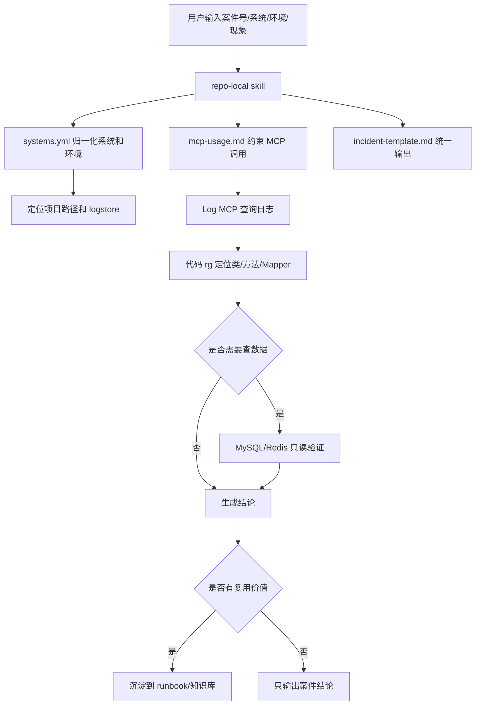

# 亿保技术支持排障 Agent 落地方案与使用指南

这份文档整理本次关于“用 agent 辅助排查技术支持反馈和线上应用问题”的方案、实施过程和使用方式。当前首版目标不是做复杂工作流系统，而是先落地一套项目内维护的排障 skill，让 agent 能按固定流程完成日志定位、代码定位、只读数据验证和问题结论输出。

## 目录

- [Key Takeaways](#key-takeaways)
- [背景与目标](#背景与目标)
- [整体设计](#整体设计)
- [已落地内容](#已落地内容)
- [Skill 可发现性与最佳实践](#skill-可发现性与最佳实践)
- [排障工作流](#排障工作流)
- [使用方式](#使用方式)
- [安全边界](#安全边界)
- [维护和沉淀规则](#维护和沉淀规则)
- [后续演进](#后续演进)

## Key Takeaways

- 首版采用“项目内 skill + reference 配置 + 复盘模板”的轻量方案。
- MCP 按能力分层：Log/MySQL/Redis 适合全局配置，Arthas 因依赖 Pod IP，首版按案件临时接入。
- agent 默认只读：日志查询、代码阅读、MySQL `SELECT`、Redis 只读命令可以作为默认动作。
- 高风险动作必须确认：数据修复、Redis 写入/删除、Arthas heapdump/profiler/watch/trace 等需要用户明确授权。
- 知识沉淀只记录可复用模式，不记录完整案件载荷、凭据、个人敏感信息。

## 背景与目标

日常技术支持排障主要有两类：

| 类型 | 典型输入 | 主要手段 | 输出 |
| --- | --- | --- | --- |
| 技术支持案件问题 | 案件号、接口、系统、环境、报错现象 | 查阿里云日志、查代码、只读查库 | 问题原因、解决方案、是否数据问题 |
| 线上应用运行问题 | 系统、Pod、时间、OOM/CPU/慢接口 | 监控平台、Arthas、日志、代码定位 | 热点线程、内存/线程原因、处理建议 |

目标是让 agent 接收案件号、系统、环境、接口或现象后，能按稳定流程推进：

1. 识别系统和环境。
2. 拼接并查询日志。
3. 找到异常位置和 trace。
4. 回到代码中定位具体路径。
5. 必要时只读查询 MySQL/Redis 验证数据。
6. 输出原因、证据和解决方案。
7. 判断是否值得沉淀为可复用知识。

## 整体设计

首版选择轻量实现：



### 为什么不是一开始做完整 workflow 系统

| 方案 | 优点 | 问题 | 首版选择 |
| --- | --- | --- | --- |
| 只靠口头 prompt | 快 | 不稳定，容易忘流程和安全边界 | 不选 |
| 项目内 skill | 简单、可维护、贴合当前仓库 | 需要 agent 主动读取 | 选择 |
| 自动化脚本/CLI | 标准化更强 | 需要处理凭据、MCP 可用性、交互授权 | 后续再做 |
| 新 MCP 网关 | 能统一 Log/MySQL/Redis/Arthas | 成本高，需要服务端开发 | 后续演进 |

## 已落地内容

本次已经在 `/Users/yuanjianwei/work/clients/yibao` 下新增项目内排障资产。

### 文件结构

```text
/Users/yuanjianwei/work/clients/yibao/
├── AGENTS.md
├── projects/
│   └── AGENTS.md
└── docs/skills/yibao-tech-support-troubleshooting/
    ├── SKILL.md
    └── references/
        ├── systems.yml
        ├── mcp-usage.md
        └── incident-template.md

/Users/yuanjianwei/.codex/skills/
└── yibao-tech-support-troubleshooting -> /Users/yuanjianwei/work/clients/yibao/docs/skills/yibao-tech-support-troubleshooting
```

### 各文件职责

| 文件 | 作用 |
| --- | --- |
| `AGENTS.md` | 告诉后续 agent：遇到技术支持、线上排障、日志、MySQL/Redis、Arthas 诊断时使用该 skill。 |
| `projects/AGENTS.md` | 从 `projects` 子目录或各项目目录进入时，也能路由到同一份排障 skill。 |
| `SKILL.md` | 核心流程和安全边界，保持短小，作为 agent 的排障入口。 |
| `references/systems.yml` | 系统别名、服务 topic、项目路径、环境 logstore、候选数据库。 |
| `references/mcp-usage.md` | Log/MySQL/Redis/Arthas MCP 的使用约定、查询模板和高风险动作边界。 |
| `references/incident-template.md` | 统一问题结论输出和典型问题沉淀格式。 |
| `~/.codex/skills/yibao-tech-support-troubleshooting` | 全局符号链接，保证从任意目录新开 Codex session 时也能发现这个 skill。 |

## Skill 可发现性与最佳实践

### 推荐结构

最佳实践是“两层结构”：

1. **项目内维护源文件**：`/Users/yuanjianwei/work/clients/yibao/docs/skills/yibao-tech-support-troubleshooting`
2. **全局可发现入口**：`~/.codex/skills/yibao-tech-support-troubleshooting` 符号链接到项目内源文件

这样做的原因：

| 方案 | 优点 | 问题 | 结论 |
| --- | --- | --- | --- |
| 只放项目内 `docs/skills` | 和业务代码、文档一起维护 | 从项目外启动 Codex 不会自动发现 | 作为源文件保留 |
| 只复制到 `~/.codex/skills` | 任意目录都能触发 | 容易和项目内版本分叉 | 不推荐复制 |
| 项目内源文件 + 全局符号链接 | 既能全局发现，又只维护一份 | 需要初次创建 symlink | 推荐 |
| 直接放到 `projects/` | 离项目近 | 多项目会重复，路径容易混乱 | 不推荐作为 skill 源 |

### 当前安装状态

当前已经建立全局符号链接：

```bash
ln -s /Users/yuanjianwei/work/clients/yibao/docs/skills/yibao-tech-support-troubleshooting \
  /Users/yuanjianwei/.codex/skills/yibao-tech-support-troubleshooting
```

验证方式：

```bash
ls -la /Users/yuanjianwei/.codex/skills/yibao-tech-support-troubleshooting
readlink /Users/yuanjianwei/.codex/skills/yibao-tech-support-troubleshooting
```

### 新 session 如何使用

有三种使用方式：

| 入口 | 使用方式 | 适用场景 |
| --- | --- | --- |
| 任意目录启动 Codex | 直接说“排查技术支持问题”或点名 `yibao-tech-support-troubleshooting` | 依赖全局 symlink 自动发现 skill |
| 在 `/Users/yuanjianwei/work/clients/yibao` 下启动 | 直接提排障请求 | 根目录 `AGENTS.md` 会路由到项目内 skill |
| 在 `/Users/yuanjianwei/work/clients/yibao/projects` 或子项目下启动 | 直接提排障请求 | `projects/AGENTS.md` 或子项目 `AGENTS.md` 会路由到项目内 skill |

如果自动触发不稳定，可以显式指定：

```text
使用 yibao-tech-support-troubleshooting skill 排查技术支持问题
系统: hyperion
环境: prod
案件号: xxx
接口: /backToAudit
```

### 维护规则

- 修改 skill 时，只改项目内源文件：`docs/skills/yibao-tech-support-troubleshooting/...`
- 不要手工编辑 `~/.codex/skills/yibao-tech-support-troubleshooting` 的“副本”；它应该只是符号链接。
- 不要把明文密码写入 `SKILL.md`、`systems.yml`、`mcp-usage.md` 或复盘文档。
- 如果迁移 yibao 目录，需要重建全局 symlink。

### 当前系统映射

| 业务叫法 | 标准系统 | 服务 topic | 项目路径 |
| --- | --- | --- | --- |
| 核赔 / hyperion | `hyperion` | `tpa-hyperion` | `projects/hyperion/Hyperion`, `projects/hyperion/tpa-commom` |
| 中台 / themis | `themis` | `tpa-themisins` | `projects/themis/themis-ins`, `projects/themis/themis_ins_core` |
| 标注平台 / linklabel | `linklabel` | `LinkLabel` | `projects/linklabel` |

### 当前环境映射

| 叫法 | 标准环境 | 应用日志 logstore | 集群 |
| --- | --- | --- | --- |
| 线上 / 生产 | `prod` | `applog` | `k8s-prod` |
| 线下 / 测试 | `test` | `applog-test` | `k8s-test` |
| uat / 预发 | `uat` | `applog-test` | `k8s-uat` |
| sit | `sit` | `applog-test` | `k8s-sit` |

## 排障工作流

### 1. 技术支持案件问题

适用场景：

- 接口 submit 报错
- 案件状态不对
- 金额不对
- NPE、索引冲突、字段缺失
- 某个案件无法继续流转

流程：

1. 归一化输入：系统、环境、案件号、接口、时间范围、现象。
2. 查应用日志：优先使用服务 topic + 案件号 + 接口/关键词。
3. 定位异常：提取 `ERROR`、异常类、`location`、trace id、关键 stack frame。
4. 回代码定位：在对应 repo 用 `rg` 查类名、方法名、接口路径、日志文本、Mapper SQL。
5. 判断是否需要查库：从 Mapper/entity/业务字段推导表和字段。
6. 只读查询数据：只允许 `SELECT`，优先加 `LIMIT`。
7. 输出结论：说明证据、根因、解决方案、风险和是否沉淀。

常用日志查询思路：

```text
__topic__:<serviceTopic> AND message:<caseNo>
__topic__:<serviceTopic> AND level:ERROR AND message:<caseNo>
message:submit AND message:<caseNo>
skw-trace-id:<traceId>
```

### 2. 线上应用运行问题

适用场景：

- OOM
- CPU 飙高
- 慢接口
- 线程阻塞
- JVM 异常

流程：

1. 先确认系统、环境、Pod、时间窗口和问题类型。
2. 先看监控和日志，再决定是否用 Arthas。
3. CPU：`dashboard` -> `thread -n 5` -> `thread <id>` -> 回代码找热点逻辑。
4. OOM：`memory` -> `jvm` -> GC/堆线索 -> 需要确认后才能 `heapdump --live`。
5. 慢接口：先从日志找 trace id 和入口方法，再确认后做窄范围 `trace`。
6. 阻塞：`thread -b` -> 看持锁线程和等待栈 -> 映射到代码/资源。

## 使用方式

### 推荐输入模板

```text
排查技术支持问题
系统: 核赔/hyperion
环境: 线上/applog
案件号: xxx
接口: submit 或具体 path
时间范围: 2026-06-03 10:00~11:00
现象: 页面报错/接口失败/状态不对/金额不对
是否允许查库: 是
```

### 简短输入也可以

```text
排查核赔线上问题，案件号 xxx，submit 报错，时间大概今天 10 点左右
```

agent 应该自动补全：

- `核赔` -> `hyperion`
- `线上` -> `prod` / `applog`
- repo -> `projects/hyperion/Hyperion`
- topic -> `tpa-hyperion`
- 初始查询 -> `message:submit AND message:<案件号>`

### 线上运行问题输入模板

```text
排查线上应用问题
系统: hyperion
环境: prod
问题: CPU 飙高
时间: 2026-06-03 10:30
Pod/IP: xxx
是否允许 Arthas: 是
```

### 期望输出格式

```text
结论:
- 当前最可能或已确认的问题。

证据:
- 日志证据。
- 代码路径。
- 数据字段，只有查库时写。

根因:
- 数据问题 / 代码缺陷 / 配置问题 / 外部依赖 / 并发幂等 / 资源问题。

解决方案:
- 短期处理。
- 长期修复。
- 验证方式。

风险和确认项:
- 需要业务确认或二次验证的点。

是否建议沉淀:
- 是/否，以及原因。
```

## MySQL MCP 数据库映射

当前 `mcp-mysql.test.ebaolife.net` 只支持测试环境数据库。排查线上问题时，可以用它做测试库复现、表结构确认、字段名确认，但不能把它当作线上库查询结果。

### 使用前置步骤

1. 先调用 `list_databases` 获取当前 MCP 可用库。
2. 对比目标系统、目标环境和可用库。
3. 只有目标库在列表中时才认证。
4. 默认只执行 `SELECT`。
5. 认证密码只在运行时输入，不写入文档、skill 或复盘记录。

### 已知库映射

| 系统 | 环境 | 主库 | 自定义库 | MCP 可用性 |
| --- | --- | --- | --- | --- |
| `hyperion` / 核赔 | 测试 | `jbao_tpa_dev` | `mms` | 可用 |
| `themis` / 中台 | 测试 | `jbao_tpa_dev` | `mms` | 可用 |
| `linklabel` / 标注平台 | 测试 | `link_label` | - | 可用 |
| `hyperion` / 核赔 | 正式 | `jbao_tpa` | `mms` | 当前 MCP 不支持 |
| `themis` / 中台 | 正式 | `jbao_tpa` | `mms` | 当前 MCP 不支持 |
| `linklabel` / 标注平台 | 正式 | `link_label` | - | 当前 MCP 不支持 |

### 认证模板

```json
{
  "name": "authenticate",
  "arguments": {
    "database": "jbao_tpa_dev",
    "username": "op_tpa_dev",
    "password": "<runtime password>"
  }
}
```

认证成功后只在本次 MCP 会话中使用返回的 `sessionToken`，排查结束后调用 `close_session`。

## 安全边界

### 默认允许

| 能力 | 默认策略 |
| --- | --- |
| 本地代码搜索和阅读 | 允许 |
| Log MCP 查询日志 | 允许 |
| MySQL MCP `SELECT` | 允许 |
| Redis `get/type/ttl/info` | 允许 |
| Arthas `dashboard/jvm/memory/thread` | 可作为初始诊断 |

### 必须确认

| 能力 | 原因 |
| --- | --- |
| MySQL `UPDATE/DELETE/INSERT/DDL` | 会修改生产或测试数据 |
| Redis `set/del` 或写命令 | 会改变缓存状态 |
| Arthas `heapdump` | 可能产生大文件和性能影响 |
| Arthas `profiler` | 有运行时开销 |
| Arthas `watch/trace` 打印参数/返回值 | 可能泄露敏感数据或影响性能 |
| Arthas `ognl/vmtool/redefine/retransform/mc` | 高风险运行时操作 |

### 不应写入文档的内容

- 完整案件载荷
- 完整手机号、证件号、银行卡号、姓名、地址
- 凭据、token、access key、session token
- 客户特定且没有复用价值的一次性细节

## 维护和沉淀规则

### 什么时候更新 skill

适合更新 `SKILL.md` 或 references 的情况：

- 新增一个稳定系统别名。
- 新增或修正服务 topic。
- 发现新的通用排障流程。
- 某个 MCP 的调用方式或安全边界变化。
- 常见问题模式已经重复出现。

### 什么时候不要更新 skill

不适合写入 skill 的情况：

- 只是某个案件的一次性状态。
- 涉及敏感个人信息。
- 只是临时操作记录。
- 还没有验证过的猜测。

### 典型问题沉淀位置

| 问题类型 | 推荐沉淀位置 |
| --- | --- |
| TPA 案件状态、问题件、核赔排查 | `projects/docs/tpa-claims/concepts/case-triage-and-diagnosis-playbook.md` |
| 问题件相关模式 | `projects/docs/tpa-claims/concepts/issue-case-and-fallback-playbook.md` |
| 标注平台操作/接口问题 | `projects/linklabel/docs/howto/runbook.md` |
| 一次性排查记录 | `reports/incidents`，需要脱敏 |

## 后续演进

首版完成的是“agent 行为规范化”，后续可以继续做三类增强。

### 1. 配置和安装自动化

- 提供脚本检查当前 agent 是否已配置 `log-mcp`、`mysql-mcp`、`redis-mcp`。
- 提供从项目内 skill 同步到全局 `~/.codex/skills` 的安装脚本。
- 给不同 agent 客户端生成对应 MCP 配置片段。

### 2. 更结构化的系统字典

- 补齐 hyperion/themis 的常用数据库和核心表。
- 补齐常见接口路径、Controller、Service、Mapper。
- 补齐案件状态、问题件状态、回传状态的枚举解释。

### 3. MCP 网关化

长期可以考虑由公司提供更统一的 MCP：

- `case-mcp`：输入案件号，返回核心案件状态、关键字段、关联表摘要。
- `arthas-gateway-mcp`：输入系统/环境/Pod，自动路由到目标 Arthas。
- `runbook-mcp`：按异常类、接口、状态码检索历史典型问题。

这样 agent 就不需要每次从零拼接大量查询条件，排障会更稳定。

## 当前结论

这套方案的价值在于：先把你日常排障经验固化成 agent 可执行的流程，而不是一开始追求全自动。首版已经具备使用基础：当你输入案件号、系统、环境和现象时，agent 有明确的系统映射、MCP 使用规则、安全边界和结论模板，可以按比较稳定的方式推进排查。
