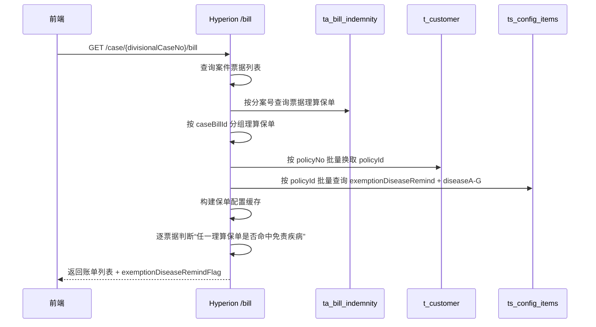
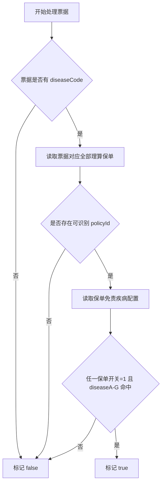

## 技术详细设计方案

## 需求概述
本次需求的核心痛点是：票据可能被理算到多个保单，而免责疾病配置是保单层配置，现有账单查询接口无法快速告诉核赔、中控和中台“这张票据是否命中了任一理算保单的免责疾病配置”。结果是前端只能靠人工查看理算结果和保单配置，容易漏看，也不利于后续废单决策。

本次实现覆盖两个模块：
1. 保单配置元数据：新增免责疾病提醒开关配置项，继续复用 `DISEASEA-G` 作为疾病代码存储位。
2. 账单查询聚合：在 `/case/{divisionalCaseNo}/bill` 与 `/pub/case/{divisionalCaseNo}/bill` 返回的票据数据中增加免责提醒标记。

新增配置项口径

| 配置项 | 层级 | 默认值 | 说明 |
| --- | --- | --- | --- |
| `exemptionDiseaseRemind` | 保单层 | `0` | 免责疾病提醒开关；`1` 表示开启票据免责提醒判定。 |
| `diseaseA` ~ `diseaseG` | 保单层 | 空 | 免责疾病代码分片存储字段；多个值使用逗号分隔。 |

| 序号 | 飞书需求名称 | 业务价值简述（100 字内说明功能解决的业务问题） | 飞书需求地址 | 需求 PRD 地址 |
| --- | --- | --- | --- | --- |
| 1 | 核赔中心关于免责疾病配置及废单的功能 | 将免责疾病配置从“保单层静态配置”转为“票据层可见提醒”，降低核赔漏判率，支持前端统一展示免责 icon，并为后续废单决策提供标准标记。 | 待补充 | 待补充 |

## 功能研发详细设计

### 飞书需求名称
核赔中心关于免责疾病配置及废单的功能

### 功能逻辑设计图

### 前端页面变更点
1. 账单列表新增免责提醒 icon 展示逻辑，触发条件为后端返回 `exemptionDiseaseRemindFlag=true`。
2. 前端展示文案继续沿用产品定义的“疾病名称 + 属于除外责任”，后端本次不返回文案，只返回标记。
3. 中控、核赔、中台共用账单查询接口，因此三个端只需要消费同一个新增字段。
4. 保单配置页新增免责疾病提醒开关对应的元数据，疾病录入继续复用 `DISEASEA-G`。

前端分支名称：

### 页面交互逻辑
操作步骤（页面交互逻辑）
1. 用户打开案件账单页。
2. 前端调用 `/case/{divisionalCaseNo}/bill` 或 `/pub/case/{divisionalCaseNo}/bill`。
3. 后端返回每张票据的免责提醒标记。
4. 前端根据标记显示或隐藏免责 icon。

字段依赖（A 字段填写后，B 字段清空）
1. 当免责疾病提醒开关为“否”时，疾病配置不参与票据提醒判定。
2. 当免责疾病提醒开关为“是”但 `DISEASEA-G` 均为空时，不产生提醒。

前端状态管理
1. 页面刷新后重新调用账单接口，不做本地缓存。
2. 免责提醒标记属于实时聚合结果，跟随最新理算保单和最新保单配置变化。

异常处理与用户提示
1. 后端不会因免责配置缺失而阻断账单查询。
2. 若保单号无法映射到保单 ID、或保单未配置免责疾病，则该票据默认不提示免责。
3. 本次无二次确认弹窗，无额外前端错误提示。

### 接口清单
| 序号 | 接口名称 | 接口相对路径 | ApiFox 地址 |
| --- | --- | --- | --- |
| 1 | 案件账单层信息查询 | `/case/{divisionalCaseNo}/bill` | 待补充 |
| 2 | 中台案件账单层信息查询 | `/pub/case/{divisionalCaseNo}/bill` | 待补充 |

### 后端业务逻辑实现
#### 接口 1：案件账单层信息查询
1. 接口相对路径
   `/case/{divisionalCaseNo}/bill`
2. 页面或功能权限名称
   核赔案件账单层查看；中台通过 `/pub` 入口复用同一套聚合逻辑。
3. 数据范围（查询及修改范围）
   仅查询当前分案下的账单、理算保单、保单配置，不修改业务数据。
4. 详细代码逻辑设计
   5. 查询案件下全部 `tc_case_bill`。
   6. 查询案件下全部 `ta_bill_indemnity`，按 `caseBillId` 聚合出票据对应的理算保单集合。
   7. 从 `ta_bill_indemnity.policy_no` 批量查询 `t_customer`，一次性换取全部 `policyId(crId)`。
   8. 按 `policyId` 一次性查询 `ts_config_items` 中的 `exemptionDiseaseRemind` 与 `diseaseA-G`。
   9. 以内存 Map 构建“保单 -> 免责疾病配置”缓存，避免逐票逐保单重复查库。
   10. 遍历票据时，取票据的 `diseaseCode` 与该票据全部理算保单的免责疾病配置做匹配。
   11. 匹配规则：只要任一理算保单满足“开关=1 且 diseaseA-G 中任一疾病片段命中票据 diseaseCode”，则该票据返回 `exemptionDiseaseRemindFlag=true`。
   12. 该标记随票据 Map 一并返回，重复票据的复制展示场景沿用原票据已计算好的标记结果。

#### 注意事项
1. 不新增加解密逻辑。
2. 不引入分布式锁、线程池、消息队列。
3. 全流程为同步查询。
4. 不新增第三方调用，不涉及熔断和重试。
5. 不写入新表，不修改既有业务数据。
6. 逻辑删除的 `ta_bill_indemnity.state=99` 不参与提醒判定。

#### 关键日志设计
1. 入口日志：记录分案号、账单数量、理算保单数量，便于确认接口是否进入免责判定链路。
2. 映射降级日志：若存在 `policyNo` 无法映射到 `policyId`，输出告警日志并展示保单号列表。
3. 配置加载日志：记录批量查询出的保单数量、配置条数，便于判断是否是配置缺失。
4. 结果日志：记录命中票据数量及命中的 `caseBillId` 集合，便于联调核对。

#### 新增及编辑表单的数据校验逻辑
1. `exemptionDiseaseRemind=0` 时，`DISEASEA-G` 即使有历史值，也不参与提醒。
2. `exemptionDiseaseRemind=1` 时，若 `DISEASEA-G` 全空，系统仍按“不命中提醒”处理，不抛异常。
3. 票据 `diseaseCode` 为空时，不返回免责提醒。

4. 批量修改或物理删除设计
5. 本次无批量修改逻辑。
6. 本次无物理删除逻辑。

### 边界场景设计
1. 一张票据理算到多个保单时，采用“任一命中即提醒”。
2. 同一保单疾病配置分散在 `DISEASEA-G` 多个字段时，先合并再判定。
3. 配置中存在重复疾病片段时，去重后判定。
4. 票据存在重复展示副本时，副本继承原票据的提醒标记。

### 历史数据兼容设计
1. 历史未配置该开关的保单，按默认值 `0` 处理。
2. 历史 `DISEASEA-G` 数据继续复用，无需迁移。
3. 老案件重新打开账单页时，按当前理算结果和当前配置实时计算提醒。

### 排除功能点
1. 本次不自动执行废单动作，只返回免责提醒标记。
2. 本次不返回“命中的是哪条疾病配置”或“命中的是哪个保单”。
3. 本次不改造理算逻辑，不改变 `ta_bill_indemnity` 写入方式。

### 异常场景设计
1. 若前端绕过页面直接调用接口，仍按统一聚合逻辑返回标记，不做额外分支。
2. 若技术支持手动删除 `t_customer` 中的保单映射，相关票据默认不提示免责，不阻断查询。
3. 若单案理算保单较多，仍通过两次批量查询完成，不会产生逐票 N+1。
4. 若配置表存在脏数据，例如疾病字段带空格或重复逗号，服务端会先 trim 并过滤空值。

后端分支名称：建议 `feature/260204004`

### 数据库设计
#### 本次不新增表结构，复用以下表：
1. `ta_bill_indemnity`：提供票据与理算保单关系。
2. `t_customer`：提供 `policyNo -> policyId(crId)` 映射。
3. `ts_config_items`：存储保单层免责提醒开关和疾病配置。

#### 索引使用说明
1. `ta_bill_indemnity` 依赖 `divisional_case_no`、`case_bill_id`、`policy_no` 查询路径。
2. `t_customer` 依赖 `policy_no`、`cr_id` 映射路径。
3. `ts_config_items` 依赖 `corr_type + corr_id + item_name + state` 查询路径。

#### DDL 语句（CREATE、ALTER、DROP）及 DML 语句（INSERT、UPDATE、DELETE）
1. 无新增 DDL。
2. 无上线 DML 强制脚本。
3. 配置数据由中控页面录入，不通过发布脚本初始化。

### 本需求影响其他功能改动点（提醒测试关注）
前端
1. 账单列表需验证免责 icon 在核赔、中控、中台三个入口均能显示。
2. 前端需验证 `false`、字段缺失、旧案件重开三种场景均不报错。

后端
1. `/case/{divisionalCaseNo}/bill` 返回结构新增 `exemptionDiseaseRemindFlag`。
2. 保单配置 DTO 新增 `exemptionDiseaseRemind` 元数据字段。

### 上线后历史数据处理
1. 历史数据处理逻辑
   无需回刷业务数据；历史案件重新打开时实时计算。
2. 数据库语句或数据清单
   无。
3. 是否需要停服更新
   否。

### 依赖条件
#### 内部模块依赖（同一系统）
1. `CaseBillService`：账单聚合入口。
2. `ExemptionDiseaseRemindService`：免责提醒批量判定服务。
3. `tpa-common-entity`：配置枚举和保单配置 DTO。

#### 外部系统依赖（跨系统）
1. 无新增跨系统依赖。

#### 前置功能依赖（同一功能模块）
1. `ta_bill_indemnity` 必须已存在票据理算结果。
2. 保单必须能通过 `policyNo` 在 `t_customer` 中映射到 `policyId`。

#### 环境配置依赖（中间件配置等）
1. 无新增中间件配置。

### 非功能设计
#### 安全性设计
1. 本次只读查询，不扩大数据权限范围。
2. 不新增敏感字段返回。

#### 性能设计
1. 单案最多执行三次核心查询：账单、理算保单、配置映射。
2. 通过批量查询和内存分组替代逐票逐保单查询，避免 N+1。

#### 高可用设计
1. 免责提醒计算失败不应影响账单主体查询成功率。
2. 缺失配置、缺失映射按“不提醒”降级。

#### 限流、熔断、日志监控等
1. 不新增限流和熔断。
2. 新增入口、映射降级、配置加载、命中结果四类日志，便于排查“为什么某票据出现/未出现免责提醒”。

### 风险记录
涉及模块：账单聚合、保单配置、客户保单映射。

风险点概述：
1. 若 `policyNo -> policyId` 映射缺失，票据无法命中免责配置。
2. 若业务侧录入的疾病配置不是疾病代码而是非标准文本，命中率会受影响。
3. 若后续产品希望“自动废单”真正自动执行，需要单独定义触发时机、幂等策略和撤销方案，本次实现不覆盖。
