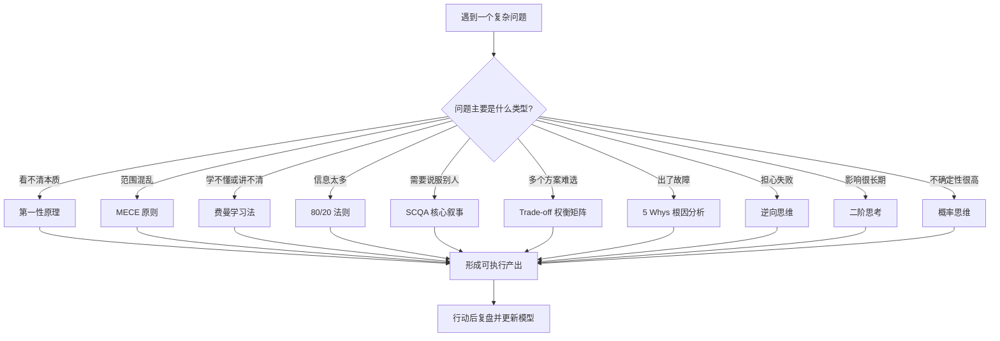

# 高杠杆思维模型实战手册

思维模型不是“聪明话术”，而是帮助你更稳定地理解问题、拆解问题、表达问题和解决问题的认知工具。真正有价值的模型通常满足三个条件：适用频率高、迁移能力强、能改变行动质量。

这篇笔记优先服务学习与工作，也兼顾生活决策。排序标准不是概念知名度，而是对日常学习、技术工作、沟通表达、复杂决策的综合杠杆。

## 目录

- [Key Takeaways](#key-takeaways)
- [如何使用这份手册](#如何使用这份手册)
- [高优先级总览表](#高优先级总览表)
- [模型选择流程](#模型选择流程)
- [核心模型详解](#核心模型详解)
- [组合打法](#组合打法)
- [不作为核心模型的常见框架](#不作为核心模型的常见框架)
- [实践训练计划](#实践训练计划)
- [参考来源](#参考来源)
- [相关笔记](#相关笔记)

## Key Takeaways

- 最高优先级的思维模型不是最多，而是最常被复用：`第一性原理`、`MECE`、`费曼学习法`、`80/20`、`刻意练习`、`SCQA`、`Trade-off`。
- 学习新知识时，先用 `80/20` 找主干，再用 `费曼学习法` 检验理解，最后用 `刻意练习` 和反馈闭环把知识变成能力。
- 做方案和汇报时，先用 `SCQA` 组织叙事，再用 `MECE` 拆结构，用 `Trade-off` 解释为什么这么选。
- 排查问题时，不要一开始就套结论。先收集事实，再用 `5 Whys` 找根因，用 `逆向思维` 补防线。
- 做长期决策时，必须同时看 `机会成本`、`二阶影响`、`概率与期望值`，否则很容易被短期收益或单点风险误导。
- `奥卡姆剃刀` 适合减少不必要解释，但不能代替证据；简单解释不是自动正确。

## 如何使用这份手册

不要把思维模型当成背诵材料。更有效的方式是把它们当成问题处理器：

1. 先识别问题类型：学习、表达、拆解、选择、排障、决策、迭代。
2. 从总览表里选择 1 到 3 个模型组合使用，不要一次套十几个。
3. 用模型产出可检查的结果，例如一张表、一段 SCQA、一棵问题树、一份复盘记录。
4. 事后检查模型有没有改善结果，而不是只检查自己有没有“用过模型”。

一个简单原则：

> 模型必须落到动作、判断或产出上。不能改变行动的模型，只是漂亮名词。

## 高优先级总览表

| 优先级 | 模型 | 主要解决什么问题 | 最适合场景 | 典型产出 |
| --- | --- | --- | --- | --- |
| P0 | 第一性原理 | 穿透表象，回到底层约束 | 学新领域、重构方案、突破惯性 | 基础事实清单、不可变约束、重新设计方案 |
| P0 | MECE 原则 | 避免遗漏和重复 | 拆需求、写方案、排查范围、总结汇报 | 分类框架、问题树、模块边界 |
| P0 | 费曼学习法 | 检验是否真的理解 | 学习新概念、跨领域迁移、面试表达 | 白话解释、类比、反向追问 |
| P0 | 80/20 法则 | 从海量信息里抓重点 | 学习路线、任务优先级、知识筛选 | 关键 20% 清单、行动优先级 |
| P0 | 刻意练习与反馈闭环 | 把知道变成会做 | 技能提升、语言学习、编码、表达 | 训练任务、反馈记录、改进循环 |
| P1 | SCQA 核心叙事 | 让复杂问题更容易被理解 | 汇报、方案背景、文章开头、会议沟通 | 背景-冲突-问题-答案 |
| P1 | Trade-off 权衡矩阵 | 解释选择而不是只给结论 | 技术选型、资源分配、架构取舍 | 方案对比表、决策理由 |
| P1 | 5 Whys 根因分析 | 避免停在表层原因 | 故障排查、质量问题、流程问题 | 根因链路、纠正措施 |
| P1 | 逆向思维 / 事前验尸 | 提前发现失败路径 | 风险评估、上线前检查、重大选择 | 失败清单、防线清单 |
| P1 | 二阶思考 / 系统思考 | 看到长期和连锁影响 | 政策变化、职业选择、产品策略 | 影响链、长期后果 |
| P2 | 概率思维 / 期望值 | 在不确定性下做判断 | 投入产出、风险选择、机会评估 | 概率-收益-损失表 |
| P2 | OODA / PDCA 迭代闭环 | 快速从反馈中修正 | 项目推进、学习计划、实验验证 | 观察-判断-行动-复盘循环 |
| P2 | 机会成本 | 看见被放弃的选择 | 时间管理、职业选择、资源投入 | 取舍说明、替代方案 |
| P2 | 能力圈 | 判断自己该不该下场 | 投资、职业方向、技术选型 | 已知/未知边界 |
| P2 | 奥卡姆剃刀 | 在多个解释中优先简化 | 现象解释、排查假设、商业判断 | 最小假设解释 |

## 模型选择流程

## 核心模型详解

### 1. 第一性原理

#### 定义

第一性原理是把问题拆回最基础、最确定、不能再继续假设的事实和约束，再从这些底层要素重新推导解决方案。

它的反面是“类比推理”：因为别人这么做、行业一直这么做、过去经验这么做，所以我也这么做。类比不是错误，但它容易把历史路径当成自然规律。

#### 核心元素

- `基础事实`：已经被验证的客观条件。
- `不可变约束`：成本、时间、物理限制、法规、用户需求等。
- `可变假设`：过去做法、流程惯例、默认方案。
- `重新组合`：基于底层约束设计新方案。

#### 适用场景

- 学习一个陌生领域时，先找它最底层的概念。
- 技术方案卡住时，拆掉“以前就是这样”的路径依赖。
- 工作流程低效时，重新定义目标、约束和必要步骤。
- 生活中做重大选择时，区分真实需求和社会默认答案。

#### 如何实践

1. 写下当前结论或方案。
2. 问：“这个结论依赖哪些假设？”
3. 把假设分成事实、约束、惯例、偏好。
4. 删除只是惯例的部分，保留真实约束。
5. 从约束重新推导一个更小、更直接的方案。

#### 具体例子

学习 Redis 时，不要一开始背各种命令和数据结构细节，而是先问：

- Redis 要解决的底层问题是什么？高性能内存数据访问。
- 为什么快？内存访问、事件驱动、数据结构贴近使用场景。
- 它的约束是什么？内存容量、持久化风险、单线程执行模型、网络 I/O。

这样再学缓存、分布式锁、排行榜、消息队列，就不会把 Redis 当成“命令集合”，而是理解它在系统设计中的位置。

#### 常见误区

- 误区一：把“我自己的直觉”当成第一性原理。
- 误区二：无限追问到底，导致无法行动。
- 误区三：否定所有经验。经验可以作为候选方案，但不能替代底层推导。

### 2. MECE 原则

#### 定义

MECE 是 `Mutually Exclusive, Collectively Exhaustive`，意思是“相互独立，完全穷尽”。它用于把复杂问题拆成不重叠、不遗漏的分类。

#### 核心元素

- `相互独立`：每个分类之间边界清楚，避免重复统计和重复讨论。
- `完全穷尽`：所有重要情况都能被覆盖。
- `同一维度`：同一层级的分类标准一致，不能混用。

#### 适用场景

- 需求分析：用户、场景、流程、异常路径。
- 技术设计：模块边界、数据流、接口职责。
- 故障排查：时间、组件、环境、版本、用户群。
- 总结汇报：把一堆散点整理成清晰结构。

#### 如何实践

1. 明确要拆的对象：问题、用户、模块、原因还是方案。
2. 选择一个分类维度，例如时间、角色、流程、组件、状态。
3. 先画一级分类，再检查是否重叠。
4. 增加“其他/未知”作为临时兜底，但不要长期停在那里。
5. 对每个分类继续拆到可以行动的粒度。

#### 具体例子

排查“订单支付失败率上升”：

- 按链路拆：前端提交、订单服务、支付网关、第三方回调、库存服务。
- 按用户拆：新用户、老用户、特定渠道、特定地区。
- 按时间拆：发布前、发布后、峰值时段、非峰值时段。
- 按错误类型拆：超时、参数错误、余额不足、签名失败、系统异常。

如果一上来只看支付网关，就可能漏掉前端版本、订单服务参数变更或库存锁定失败。

#### 常见误区

- 误区一：分类维度混乱，例如把“前端、后端、超时、VIP 用户”放在同一层。
- 误区二：追求形式完整，但每类都不可行动。
- 误区三：把 MECE 当成最终答案。它只是拆问题的方法，不负责判断优先级。

### 3. 费曼学习法

#### 定义

费曼学习法是用简单语言解释复杂概念，并通过解释过程暴露自己的理解漏洞。它的核心不是“讲得浅”，而是“讲得准确且别人能懂”。

#### 核心元素

- `白话解释`：不用术语堆砌。
- `类比迁移`：用熟悉场景解释陌生概念。
- `反向追问`：别人问为什么时，你还能继续解释。
- `漏洞回补`：讲不清的地方回到资料重新学习。

#### 适用场景

- 学习技术概念、论文、框架源码。
- 准备面试、分享、方案评审。
- 跨领域理解抽象概念。
- 判断自己是“熟悉名词”还是真正掌握。

#### 如何实践

1. 选一个概念，用 3 句话解释给外行听。
2. 标出解释里所有含糊词，例如“高性能”“解耦”“一致性”。
3. 对每个含糊词继续问：“具体是什么意思？为什么会这样？”
4. 用一个具体例子验证解释是否成立。
5. 把最终解释写成一段可以复用的笔记。

#### 具体例子

解释“事务隔离级别”：

> 多个人同时改同一份数据时，数据库要决定每个人能看到什么。隔离级别越高，越像大家排队一个个改，结果更稳定但效率更低；隔离级别越低，越像大家同时改，速度可能更快但容易看到中间状态。

接着再补：

- 读未提交：可能读到别人还没确认的改动。
- 读已提交：只能读到别人已经确认的改动。
- 可重复读：一次事务里多次读同一数据，结果保持一致。
- 串行化：最像排队执行，最安全但成本最高。

#### 常见误区

- 误区一：类比过度，导致类比对象和真实机制不一致。
- 误区二：只追求通俗，不追求准确。
- 误区三：解释一次就结束，没有用追问暴露漏洞。

### 4. 80/20 法则

#### 定义

80/20 法则也叫帕累托原则，指很多结果往往由少数关键因素贡献。它不是精确的数学比例，而是一种优先级思维：先找到影响最大的少数变量。

#### 核心元素

- `少数关键因素`：对结果贡献最大的动作、知识点、客户、问题。
- `边际收益递减`：投入越往后，新增收益可能越低。
- `优先级排序`：先做高影响事项。

#### 适用场景

- 面对海量新知识时，先找主干。
- 时间不足时，决定先做什么。
- 工作任务很多时，识别真正影响结果的事项。
- 故障处理中，优先处理影响面最大的错误。

#### 如何实践

1. 写下目标结果。
2. 列出所有可能影响结果的因素。
3. 估算每个因素的影响力和投入成本。
4. 找出最高收益的 20%。
5. 先集中完成这些，再决定是否处理剩余部分。

#### 具体例子

学习 Java 后端，不应该平均学习所有知识点。更高杠杆的 20% 可能是：

- HTTP 与网络基础。
- Java 集合、并发、JVM 基础。
- Spring MVC / Spring Boot 请求链路。
- 数据库事务、索引、慢查询。
- Redis 缓存和常见一致性问题。
- 日志、监控、排障方法。

这些知识能覆盖多数真实工作问题。等主干建立后，再补充边缘主题。

#### 常见误区

- 误区一：把 80/20 当成偷懒理由。
- 误区二：只做容易的 20%，而不是高价值的 20%。
- 误区三：没有定期重排优先级。不同阶段的关键 20% 会变化。

### 5. 刻意练习与反馈闭环

#### 定义

刻意练习是围绕明确目标、可反馈任务和持续修正来提升能力的方法。它强调的是“有设计的训练”，不是简单重复。

#### 核心元素

- `明确目标`：知道这次练什么。
- `略高难度`：任务要超出舒适区，但不能完全做不了。
- `即时反馈`：知道哪里错、为什么错。
- `持续修正`：根据反馈调整下一轮练习。

#### 适用场景

- 编码能力、算法题、系统设计。
- 英语表达、写作、演讲。
- 技术排障、方案设计、沟通汇报。
- 任何需要从“知道”到“熟练”的能力。

#### 如何实践

1. 把能力拆成子技能。
2. 选择一个子技能，设计小任务。
3. 设置评价标准，例如正确率、耗时、清晰度、缺陷数。
4. 练习后立刻获得反馈。
5. 记录问题，下一次只针对一个关键问题改进。

#### 具体例子

训练“技术方案表达”：

- 第 1 周只练背景说明：用 SCQA 写 5 个需求背景。
- 第 2 周只练方案对比：每个需求写一张 Trade-off 表。
- 第 3 周只练风险说明：每个方案写失败路径和兜底策略。
- 第 4 周做整合：输出完整设计文档，并请同事指出不清楚的地方。

这比“多写几篇文档”更有效，因为每次练习都有目标和反馈。

#### 常见误区

- 误区一：把重复劳动当刻意练习。
- 误区二：只练自己擅长的部分。
- 误区三：没有反馈来源，只靠自我感觉。

### 6. SCQA 核心叙事

#### 定义

SCQA 是一种组织表达的结构：`Situation` 背景、`Complication` 冲突、`Question` 问题、`Answer` 答案。它适合把复杂背景整理成别人能快速理解的叙事。

#### 核心元素

- `S 背景`：当前共识或客观现状。
- `C 冲突`：出现了什么变化、矛盾或痛点。
- `Q 问题`：因此我们现在必须回答什么问题。
- `A 答案`：你的主张、方案或结论。

#### 适用场景

- 解释方案背景与演进。
- 写需求文档、设计文档、周报。
- 向上汇报复杂问题。
- 面试中讲项目经历。

#### 如何实践

1. 先写答案，避免背景写太散。
2. 倒推听众需要哪些背景。
3. 只保留会制造冲突的信息。
4. 把冲突收束成一个明确问题。
5. 用一句话给出答案，再展开细节。

#### 具体例子

技术方案汇报：

- S：当前核赔系统能查询账单理算结果，但免责疾病配置在保单维度维护。
- C：一张票据可能命中多个保单，前端无法直接判断是否涉及免责疾病，人工核对容易漏判。
- Q：如何在票据维度快速提示是否命中任一相关保单的免责疾病配置？
- A：新增票据维度的免责疾病命中标记，在查询接口中统一返回，前端据此展示提醒。

这个结构比直接说“我要加一个字段”更容易让人理解为什么要做。

#### 常见误区

- 误区一：背景过长，听众还没听到问题就失去耐心。
- 误区二：冲突不清楚，导致方案显得像个人偏好。
- 误区三：问题和答案不匹配。

### 7. Trade-off 权衡矩阵

#### 定义

Trade-off 权衡矩阵用于在多个方案之间做透明比较。它的重点不是“找完美方案”，而是说明每个选择牺牲了什么、换来了什么。

#### 核心元素

- `候选方案`：至少两个可行选项。
- `评价维度`：成本、性能、复杂度、风险、扩展性、上线速度等。
- `权重`：不同维度的重要性不同。
- `结论`：选择方案和放弃方案的理由。

#### 适用场景

- 技术选型与框架对比。
- 架构设计中的取舍。
- 资源投入优先级。
- 生活中的重大选择，例如买房、换城市、转方向。

#### 如何实践

1. 明确决策目标。
2. 列出 2 到 4 个候选方案。
3. 选择 4 到 6 个评价维度。
4. 给每个维度打分或写定性判断。
5. 明确推荐方案和不选其他方案的理由。

#### 具体例子

缓存方案选择：

| 方案 | 性能 | 开发成本 | 一致性风险 | 运维复杂度 | 适用判断 |
| --- | --- | --- | --- | --- | --- |
| 本地缓存 | 极高 | 低 | 高 | 低 | 适合少量、低一致性要求数据 |
| Redis 缓存 | 高 | 中 | 中 | 中 | 适合跨实例共享缓存 |
| 不加缓存 | 低 | 低 | 低 | 低 | 适合访问量不高或数据强一致场景 |

结论不是“Redis 最好”，而是：如果访问量高、数据可接受短暂不一致、需要跨实例共享，则 Redis 更合适。

#### 常见误区

- 误区一：只列优点，不列代价。
- 误区二：评价维度太多，反而看不出重点。
- 误区三：用打分制造精确幻觉。很多时候定性判断更诚实。

### 8. 5 Whys 根因分析

#### 定义

5 Whys 是连续追问“为什么”来从表层现象追到根因的方法。数字 5 不是硬性要求，关键是不要停在第一个看似合理的解释。

#### 核心元素

- `事实起点`：可观察的问题，而不是猜测。
- `因果链`：每一步都能解释上一步为什么发生。
- `根因`：修复后能降低复发概率的原因。
- `纠正措施`：针对根因的动作。

#### 适用场景

- 线上故障、死锁、超时、数据异常。
- 流程问题，例如反复延期、反复漏测。
- 个人习惯问题，例如总是拖延、学习中断。

#### 如何实践

1. 用事实描述问题：什么时候、影响谁、表现是什么。
2. 问第一个为什么，并用证据回答。
3. 对回答继续追问为什么。
4. 直到找到流程、系统、设计或认知层面的根因。
5. 给出纠正措施和预防措施。

#### 具体例子

线上接口超时：

1. 为什么接口超时？因为数据库查询耗时突然升高。
2. 为什么查询耗时升高？因为某个条件没有命中索引。
3. 为什么没有命中索引？因为新需求增加了组合筛选条件，但没有同步评估索引。
4. 为什么没有评估索引？因为需求评审和代码评审没有性能检查项。
5. 为什么没有检查项？因为团队没有把慢查询风险纳入发布前 checklist。

根因不是“某个开发忘了加索引”，而是流程里缺少性能风险检查。

#### 常见误区

- 误区一：把追责当根因分析。
- 误区二：每一步没有证据，只是在编故事。
- 误区三：停在“人为失误”，没有继续追系统原因。

### 9. 逆向思维 / 事前验尸

#### 定义

逆向思维是从反面推导问题：如果目标失败了，最可能因为什么失败？事前验尸是其在项目和决策中的实践形式，假设事情已经失败，再倒推失败原因。

#### 核心元素

- `失败画面`：明确什么叫失败。
- `失败路径`：失败可能如何发生。
- `预防措施`：提前降低概率。
- `兜底措施`：失败发生后降低损失。

#### 适用场景

- 上线前风险评估。
- 项目计划、考试备考、职业选择。
- 安全、合规、财务等损失较大的领域。

#### 如何实践

1. 写下目标。
2. 假设 3 个月后彻底失败。
3. 列出最可能的 5 个失败原因。
4. 对每个原因设计预防动作。
5. 对不可完全避免的风险设计兜底。

#### 具体例子

准备一次技术分享：

- 失败原因 1：内容太散，听众不知道结论。
  - 预防：用 SCQA 写开头，用 3 个核心结论限制范围。
- 失败原因 2：例子太抽象。
  - 预防：每个概念配一个工作中的真实例子。
- 失败原因 3：时间超出。
  - 预防：提前彩排，删掉非关键章节。

#### 常见误区

- 误区一：只想失败，不设计行动。
- 误区二：把所有小风险都列出来，真正大风险被淹没。
- 误区三：用逆向思维制造焦虑，而不是降低损失。

### 10. 二阶思考 / 系统思考

#### 定义

二阶思考是看一个行动的后续影响：不仅问“然后会发生什么”，还要问“再然后会发生什么”。系统思考则关注多个变量之间的反馈、延迟和连锁反应。

#### 核心元素

- `一阶结果`：立刻发生的直接结果。
- `二阶结果`：后续连锁影响。
- `反馈回路`：结果反过来改变原因。
- `延迟效应`：短期看不到，长期才显现。

#### 适用场景

- 评估长远影响与政策变化。
- 产品策略、组织管理、职业规划。
- 技术债、架构演进、流程制度设计。
- 生活习惯和健康管理。

#### 如何实践

1. 写下一个行动。
2. 写出短期直接结果。
3. 继续写 3 到 5 个后续影响。
4. 标出哪些影响会反过来改变系统。
5. 判断短期收益是否会换来长期成本。

#### 具体例子

为了赶进度跳过测试：

- 一阶结果：本周可以更快上线。
- 二阶结果：潜在缺陷进入生产，排查成本增加。
- 三阶结果：团队开始接受“紧急时可以不测”的默认规则。
- 长期结果：质量下降，发布信任降低，后续每次上线都更慢。

真正的问题不是这一次少测，而是它会改变团队系统的默认行为。

#### 常见误区

- 误区一：只看长期，忽视当前生存约束。
- 误区二：把二阶思考变成无限脑补。
- 误区三：没有区分高概率后果和低概率想象。

### 11. 概率思维 / 期望值

#### 定义

概率思维是在不确定条件下做判断：不是问“会不会发生”，而是问“发生概率多大，收益和损失分别是什么”。期望值则把概率和结果大小结合起来评估选择。

#### 核心元素

- `概率`：事件发生的可能性。
- `收益`：成功带来的价值。
- `损失`：失败付出的代价。
- `期望值`：概率加权后的长期平均结果。

#### 适用场景

- 投入一个新技术方向。
- 决定是否跳槽、转岗、创业。
- 判断风险事件是否值得预防。
- 在信息不完整时做取舍。

#### 如何实践

1. 列出可能结果。
2. 粗略估计每个结果的概率。
3. 写出每个结果的收益和损失。
4. 看最坏损失是否可承受。
5. 如果可承受，再比较期望值。

#### 具体例子

是否投入时间学习一个新框架：

| 结果 | 概率估计 | 收益/损失 | 判断 |
| --- | --- | --- | --- |
| 公司项目采用 | 中 | 直接提升工作效率和影响力 | 高价值 |
| 不采用但行业常用 | 中 | 增加职业筹码 | 仍有价值 |
| 很快过时 | 低到中 | 损失学习时间 | 可控 |

如果学习成本低、最坏损失只是少量时间，而上行收益较大，就值得小规模试探。

#### 常见误区

- 误区一：只看成功收益，不看失败概率。
- 误区二：用一次结果否定决策质量。好决策也可能有坏结果。
- 误区三：把估算当精确计算。很多场景只需要粗略量级判断。

### 12. OODA / PDCA 迭代闭环

#### 定义

OODA 是 `Observe, Orient, Decide, Act`，强调在变化环境中快速观察、判断、决策和行动。PDCA 是 `Plan, Do, Check, Act`，强调计划、执行、检查和改进。两者都属于反馈闭环模型。

#### 核心元素

- `观察/计划`：明确现状和目标。
- `行动`：做一个小步实验。
- `检查`：收集反馈。
- `调整`：更新下一轮行动。

#### 适用场景

- 新项目探索。
- 学习计划调整。
- 产品实验、技术验证。
- 工作节奏优化。

#### 如何实践

1. 不要一次设计完美方案，先定义最小可验证行动。
2. 明确验证指标，例如耗时、错误率、反馈质量。
3. 快速执行一轮。
4. 根据反馈修正假设。
5. 进入下一轮。

#### 具体例子

学习算法：

- Plan：本周只练二叉树遍历。
- Do：每天 2 道题，写完后复述解法。
- Check：记录卡住原因，是递归边界、状态定义还是模板不熟。
- Act：下一周针对最薄弱点练习，而不是盲目刷更多题。

#### 常见误区

- 误区一：只计划，不检查。
- 误区二：只行动，不复盘。
- 误区三：每轮变化太大，无法判断到底哪个因素有效。

### 13. 机会成本

#### 定义

机会成本是指选择一个选项时，被放弃的最佳替代选择的价值。它提醒你：成本不只是花出去的钱和时间，也包括因此不能做的其他事情。

#### 核心元素

- `当前选择`：你打算做什么。
- `最佳替代`：如果不做它，最值得做的是什么。
- `隐性成本`：注意力、精力、窗口期、人际关系、健康等。
- `净收益`：当前选择相对替代方案是否值得。

#### 适用场景

- 时间管理和任务优先级。
- 职业选择、学习路线、项目投入。
- 是否参加会议、是否接额外任务。
- 消费和投资决策。

#### 如何实践

1. 写下你准备投入的时间、金钱、精力。
2. 问：“如果不做这件事，我最应该做什么？”
3. 比较两个选择的长期收益。
4. 如果当前选择只是情绪驱动，重新评估。
5. 对高机会成本事项设置退出条件。

#### 具体例子

晚上花 3 小时刷短视频，表面成本是 0 元，真实成本可能是：

- 少了一次系统学习的机会。
- 少了一次运动和恢复精力的机会。
- 第二天注意力下降。

机会成本不是为了禁止娱乐，而是让你意识到：每个选择都在购买一种未来。

#### 常见误区

- 误区一：只计算金钱成本。
- 误区二：把所有时间都功利化，忽视休息本身的价值。
- 误区三：不承认“注意力”也是稀缺资源。

### 14. 能力圈

#### 定义

能力圈是指你真正理解、能判断风险、能解释变量关系的范围。它不是你听说过什么，而是你能可靠做判断的边界。

#### 核心元素

- `已知已知`：你能清楚解释和验证的部分。
- `已知未知`：你知道自己还不懂的部分。
- `未知未知`：你甚至不知道要问什么的部分。
- `边界意识`：知道什么时候该学习、请教或退出。

#### 适用场景

- 技术选型和架构决策。
- 职业方向选择。
- 投资、创业、合作判断。
- 判断是否应该接某个任务。

#### 如何实践

1. 写下你对某领域能稳定解释的内容。
2. 写下你无法判断的关键变量。
3. 找专家、资料或小实验缩小未知。
4. 对能力圈外的高风险决策保持谨慎。
5. 通过刻意练习扩大能力圈，而不是假装已经懂。

#### 具体例子

选择是否在生产系统引入一个新框架：

- 能力圈内：你理解框架的核心模型、部署方式、监控方式、常见失败模式。
- 能力圈边界：你不确定高并发下的稳定性和团队维护成本。
- 行动：先做 PoC 和压测，再决定是否引入，而不是因为“社区很火”直接上线。

#### 常见误区

- 误区一：把兴趣圈当能力圈。
- 误区二：因为不懂就永远不碰。能力圈可以扩展，但要分阶段试探。
- 误区三：只看自己会什么，不看团队整体能力圈。

### 15. 奥卡姆剃刀

#### 定义

奥卡姆剃刀的常见表达是：在多个解释都能解释现象时，优先选择假设更少、更简单的解释。它用于减少不必要的复杂假设。

#### 核心元素

- `多个解释`：至少有两个可选假设。
- `解释力相近`：它们都能解释现象。
- `假设数量`：哪个需要引入更少额外条件。
- `证据校验`：简单解释仍然需要被证据验证。

#### 适用场景

- 解释复杂的人事或商业现象。
- 排查问题时筛选优先假设。
- 判断一个方案是否过度设计。
- 写作和表达中删掉不必要前提。

#### 如何实践

1. 列出所有可能解释。
2. 删除无法解释关键事实的假设。
3. 在剩余解释中，优先检查假设最少的那个。
4. 用数据或事实验证。
5. 如果简单解释无法覆盖证据，再升级到复杂解释。

#### 具体例子

某个接口发布后报错率上升：

- 复杂解释：底层网络、数据库、缓存、用户行为同时发生变化。
- 简单解释：刚发布的代码改动引入了兼容性问题。

按照奥卡姆剃刀，应先检查发布差异和错误日志，而不是一开始就假设整个基础设施异常。

#### 常见误区

- 误区一：把“简单”当成“正确”。
- 误区二：忽视复杂系统中真实存在的多因一果。
- 误区三：用奥卡姆剃刀否定自己不熟悉的解释。

## 组合打法

### 学习一个新领域

推荐组合：`80/20 -> 第一性原理 -> 费曼学习法 -> 刻意练习 -> OODA/PDCA`

实践方式：

1. 用 80/20 找出最核心的概念和技能。
2. 用第一性原理理解这个领域到底解决什么底层问题。
3. 用费曼学习法把核心概念讲清楚。
4. 把知识拆成小技能，设计刻意练习任务。
5. 每周复盘，调整下一周学习路线。

例子：学习 Elasticsearch 时，先抓住倒排索引、分词、相关性评分、分片副本、查询 DSL、聚合、性能调优这些主干，再深入细节。

### 写技术方案或汇报

推荐组合：`SCQA -> MECE -> Trade-off -> 逆向思维`

实践方式：

1. 用 SCQA 写清楚背景、冲突、问题和答案。
2. 用 MECE 拆需求范围、系统模块和异常路径。
3. 用 Trade-off 表说明为什么选择当前方案。
4. 用逆向思维补风险、失败路径和兜底策略。

一句话模板：

> 当前背景是 X，但出现了 Y 冲突，所以我们要解决 Z 问题。候选方案有 A/B/C，按成本、风险、复杂度和扩展性比较后，推荐 A；主要风险是 R，对应兜底是 M。

### 排查线上故障

推荐组合：`MECE -> 5 Whys -> 奥卡姆剃刀 -> 逆向思维`

实践方式：

1. 用 MECE 划分排查范围，避免遗漏链路。
2. 用奥卡姆剃刀优先检查最近变更和最少假设路径。
3. 用 5 Whys 从表层故障追到系统根因。
4. 用逆向思维补预防措施，避免复发。

注意：故障处理中先恢复服务，再追根因。根因分析不能阻碍止血。

### 做长期职业或生活决策

推荐组合：`机会成本 -> 二阶思考 -> 概率思维 -> 能力圈`

实践方式：

1. 明确每个选择会放弃什么。
2. 看短期收益之后的二阶影响。
3. 粗略估计概率、上行收益和下行损失。
4. 判断这个选择是否在能力圈内；如果不在，先用小实验学习。

例子：是否转向 AI 应用开发，不只看“热门”，还要看自己的工程基础、学习成本、市场变化、可迁移能力和最坏情况下的损失。

### 管理每天的任务和注意力

推荐组合：`80/20 -> 机会成本 -> OODA/PDCA`

实践方式：

1. 每天开始时列出最重要的 1 到 3 件事。
2. 问每件事不做会怎样，做了会推进什么结果。
3. 优先处理高影响、不可逆或有时间窗口的任务。
4. 晚上复盘：今天真正产生结果的动作是什么？

## 不作为核心模型的常见框架

这些框架不是没用，而是不适合作为高优先级核心模型：

| 框架 | 为什么不放入核心 | 更推荐替代 |
| --- | --- | --- |
| SWOT | 容易停留在填表，缺少行动优先级 | Trade-off、机会成本、能力圈 |
| SMART | 适合写目标，但不能帮助理解问题本质 | 80/20、刻意练习、PDCA |
| 六顶思考帽 | 适合会议引导，但个人日常使用频率较低 | MECE、逆向思维、二阶思考 |
| 金字塔原理完整体系 | 很有价值，但对日常使用可先压缩为 SCQA + MECE | SCQA、MECE |
| OKR | 更偏组织目标管理，不是通用认知工具 | 80/20、PDCA |

## 实践训练计划

### 第 1 周：学习与理解

- 每天选一个正在学的概念，用费曼学习法写 150 字解释。
- 对一个学习主题做 80/20 清单，找出最关键的 5 个知识点。
- 用第一性原理重写一个你过去“死记硬背”的概念。

### 第 2 周：拆解与表达

- 对一个工作需求画 MECE 问题树。
- 用 SCQA 写一段方案背景。
- 把一个技术选择写成 Trade-off 表。

### 第 3 周：排障与风险

- 复盘一个曾经出过的问题，用 5 Whys 追根因。
- 对一个即将开始的任务做事前验尸。
- 用奥卡姆剃刀列出排查优先级。

### 第 4 周：长期决策与迭代

- 对一个职业或学习选择写机会成本分析。
- 写出该选择的一阶、二阶、三阶影响。
- 用概率思维判断最坏损失是否可承受。
- 做一次月度复盘，保留最有效的 3 个模型组合。

## 参考来源

- Barbara Minto, *The Pyramid Principle*：SCQA 和结构化表达的重要来源之一。
- Richard P. Feynman 相关教学思想：费曼学习法的通俗名称来自后人总结，具体命名归属需确认。
- Vilfredo Pareto 相关研究：80/20 法则常被称为帕累托原则。
- Taiichi Ohno / Toyota Production System：5 Whys 常与丰田生产方式关联。
- Gary Klein, *The Power of Intuition*：事前验尸 `premortem` 方法的重要来源之一。
- Charlie Munger, *Poor Charlie's Almanack*：多元思维模型、能力圈、逆向思维等概念的经典传播来源之一。
- John Boyd：OODA Loop 的提出者。
- W. Edwards Deming：PDCA / PDSA 循环的重要传播者之一。
- William of Ockham：奥卡姆剃刀思想的历史来源通常与其相关，现代简化表述需确认。

## 相关笔记

- [[英语单词学习最佳实践：词根词缀、词源与间隔重复]]
