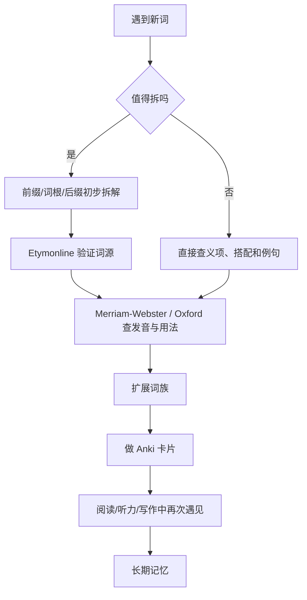

# 英语单词学习最佳实践：词根词缀、词源与间隔重复

把长单词看成“可复用积木”是很有效的底层方法。对中高级词汇、学术词汇、考试词汇和大量拉丁/希腊来源的单词来说，`前缀 + 词根 + 后缀` 确实能显著提高理解和记忆效率。

但它不是万能钥匙。真正高效的方式不是“见词就硬拆”，而是把 `词根词缀拆解`、`词源验证`、`例词族群`、`发音规律` 和 `间隔重复` 组合成一个系统。

截至 `2026-05-19` 核对，文中推荐的网站和软件链接可正常访问。

[TOC]

## 目录

- [Key Takeaways](#key-takeaways)
- [先给结论：最稳的学习框架](#先给结论最稳的学习框架)
- [为什么这套方法有效](#为什么这套方法有效)
- [这套方法的边界](#这套方法的边界)
- [推荐工具栈](#推荐工具栈)
- [推荐学习流程](#推荐学习流程)
- [建议先背的高频构词模块](#建议先背的高频构词模块)
- [Anki 卡片怎么做](#anki-卡片怎么做)
- [Comparison Table](#comparison-table)
- [Learning Flow](#learning-flow)
- [常见误区](#常见误区)
- [30 天起步方案](#30-天起步方案)
- [参考来源](#参考来源)

## Key Takeaways

- 词根词缀学习法本质上是 `morphology + etymology-based vocabulary learning`，尤其适合长单词和学术词汇。
- 最关键的动作不是“拆”，而是 `先拆 -> 再验证 -> 再扩词族 -> 再复习`。
- `同后缀` 往往更稳定地体现词性，`同前缀` 往往更稳定地体现语义方向，但 `同词缀 != 发音一定相同`。
- 不要把所有单词都用拉丁/希腊词根解释。大量高频短词、古英语词、习语和固定搭配并不适合这样学。
- 对长期记忆来说，`Anki` 这类间隔重复工具比单纯刷表更重要。

## 先给结论：最稳的学习框架

最推荐的框架不是“纯背词根”，而是四层结构：

1. `高频词先直接掌握`
2. `中长单词优先做词根词缀拆解`
3. `用词源工具验证拆法，不靠想当然`
4. `把单词放回词族、例句、发音和复习系统`

可以把它理解成：

`单词识别` -> `构词理解` -> `用法确认` -> `长期记忆`

如果只做前两步，你会出现一个常见问题：看到词似乎“懂了”，但不会用、不会读、也记不牢。

## 为什么这套方法有效

这套方法有效，主要因为它降低了“逐个死记”的成本。

### 1. 它把记忆单位从“单词”升级成“模块”

比如你掌握了：

- `dict` = say / speak
- `duct` = lead
- `ject` = throw
- `spect` = look

你就能更快理解一整组词：

- `predict / dictate / contradict`
- `conduct / introduce / reduce`
- `project / reject / inject`
- `inspect / respect / perspective`

### 2. 它天然适合扩展词族

比起孤立背一个词，更有效的是背“同一家族”：

- `act -> action -> active -> activate -> activity`
- `form -> reform -> transform -> formation -> formal`

这样不仅记得更快，还更容易掌握词性变化。

### 3. 它能帮助处理陌生词

对阅读来说，词根词缀法最大的价值，不是让你把所有词都背下来，而是让你遇到陌生词时更容易做“高质量猜测”。

## 这套方法的边界

这是最需要强调的一部分。

### 1. 不是所有词都适合拆

很多高频词来自古英语，本身就不适合用拉丁/希腊构词去解释，例如：

- `come`
- `go`
- `make`
- `take`
- `good`
- `wrong`

这些词更适合通过高频输入、例句和搭配掌握。

### 2. 同一个前缀可能有多个义项

例如 `in-` 既可能表示：

- `not`：`incomplete`
- `in / into`：`insert`

所以不要只看字形就下结论。

### 3. 词源解释不等于现代定义

`Etymonline` 明确提醒：词源不是定义，而是单词历史来源的解释。一个词今天怎么用，仍然要看现代词典、例句和搭配。

### 4. 发音不会完全跟着“拆法”走

构词相近，不代表读音完全相近。尤其要注意：

- 重音移动：`photograph -> photography -> photographic`
- 音变/同化：`in- -> im- / il- / ir-`
- 弱读与元音弱化：很多非重读音节会读成 `/ə/`

## 推荐工具栈

### 查词源与验证拆法

### 1. Etymonline

- 官网：<https://www.etymonline.com/>
- Android App：<https://play.google.com/store/apps/details?id=com.etymonline.app>

适合做什么：

- 判断一个词到底能不能这样拆
- 看某个前缀在该词里到底表示什么
- 看一个词是拉丁来源、希腊来源，还是后来转借进英语

适合场景：

- `predict` 能不能拆成 `pre- + dict`
- `manufacture` 里的 `manu-` 和 `fact` 到底怎么来的
- `in-` 在具体词里是“否定”还是“进入”

### 2. Merriam-Webster

- 官网：<https://www.merriam-webster.com/>
- 词源说明：<https://www.merriam-webster.com/help/faq/etymology.htm>

适合做什么：

- 查定义
- 查音标和发音
- 查词性
- 看简明词源说明

使用原则：

- `Etymonline` 负责追根溯源
- `Merriam-Webster` 负责确认这个词现在是什么意思、怎么读、属于什么词性

### 3. Oxford Learner's Dictionaries

- 官网：<https://www.oxfordlearnersdictionaries.com/us/>

适合做什么：

- 查学习者友好的英文解释
- 查英美发音
- 查例句和常见搭配
- 用 `Oxford 3000 / 5000` 判断词汇优先级

它不是你最主要的词源工具，但非常适合补“现在怎么用”这一层。

### 系统整理词根词缀

### 4. LearnThat Root Words & Prefixes Directory

- 目录页：<https://www.learnthat.org/pages/view/roots.html>

适合做什么：

- 按 root / prefix 扩词族
- 快速看一个词根对应的多个例词
- 用作做表、做卡片时的扩展索引

### 5. Florida DOE: Master List of Morphemes

- PDF：<https://www.fldoe.org/core/fileparse.php/16294/urlt/morphemeML.pdf>

适合做什么：

- 拿来整理成自己的“高频词素表”
- 系统性建立 prefix / root / suffix 总表

### 6. Reading Rockets

- 相关文章：<https://www.readingrockets.org/topics/vocabulary/articles/linking-language-cross-disciplinary-vocabulary-approach>
- 相关文章：<https://www.readingrockets.org/topics/spelling-and-word-study/articles/use-words-teach-words>

适合做什么：

- 理解“为什么词素意识有助于阅读和词汇扩展”
- 把词根词缀放回真实阅读教学和词汇习得语境里

### 记忆与复习

### 7. Anki

- 官网/下载：<https://apps.ankiweb.net/>
- Manual：<https://docs.ankiweb.net/background.html>

适合做什么：

- 做长期复习
- 管理词根、前缀、后缀和例词族
- 把“知道”变成“记住”

官方手册明确把 `active recall` 和 `spaced repetition` 作为核心机制。这也是为什么它比“看表格”更适合长期掌握词汇。

### 8. Quizlet / Memrise

- Quizlet：<https://quizlet.com/>
- Memrise：<https://www.memrise.com/>

适合做什么：

- 入门时快速上手现成材料
- 做轻量刷题和碎片练习

但如果你想长期、系统地建立自己的词根词缀体系，优先级仍然低于 `Anki`。

### 9. YouGlish

- 官网：<https://youglish.com/?lang=en>
- About：<https://youglish.net/about-us/>

适合做什么：

- 查一个单词在真实语境里的发音
- 听不同口音下的自然表达
- 做 shadowing，顺手把词汇学习和听力/发音训练打通

## 推荐学习流程

最实用的不是“先背一本词根书”，而是把新词放进一个固定流程。

### Step 1. 先判断这个词值不值得拆

优先拆这些词：

- 长词
- 学术词
- 考试词
- technical English
- 明显带前后缀的派生词

不优先拆这些词：

- 高频基础词
- 固定搭配
- 习语
- 古英语短词

### Step 2. 做初步拆解

例如：

- `predict = pre- + dict`
- `submarine = sub- + marine`
- `transport = trans- + port`
- `biography = bio- + graph + -y`

### Step 3. 用 Etymonline 验证

这一步的目标不是看“像不像”，而是确认：

- 你的拆法是否成立
- 这个前缀在该词里到底是什么意思
- 这个词是否经历过音变或词义转移

### Step 4. 用现代词典确认现在怎么用

去 `Merriam-Webster` 或 `Oxford Learner's Dictionaries` 看：

- 词性
- 发音
- 例句
- 常见搭配

### Step 5. 扩成一个词族

不要只记一个词，要顺手扩成 3 到 8 个“同家族词”。

例如 `dict` 这一组：

- `predict`
- `dictate`
- `dictionary`
- `verdict`
- `contradict`

### Step 6. 加入 Anki

卡片里不要只写“词根 = 中文意思”，至少要带上：

- 核心义
- 词性线索
- 例词
- 发音或重音提醒
- 一句真实例句

### Step 7. 在阅读和输出里反复碰到

真正让词汇稳固的，不只是复习软件，而是：

- 阅读里再次遇见
- 听力里再次听见
- 写作/口语里真的用出来

## 建议先背的高频构词模块

### 高频前缀

| 前缀 | 核心义 | 例词 |
| --- | --- | --- |
| `re-` | again / back | `rewrite`, `return` |
| `un-` | not / reverse | `unfair`, `unlock` |
| `dis-` | apart / not / reverse | `disagree`, `disconnect` |
| `pre-` | before | `preview`, `predict` |
| `sub-` | under / below | `subway`, `submarine` |
| `super-` | above / beyond | `superior`, `superhuman` |
| `trans-` | across | `transport`, `transform` |
| `inter-` | between | `interact`, `international` |
| `anti-` | against | `antiwar`, `antibiotic` |
| `in- / im- / il- / ir-` | not / into | `impossible`, `illegal`, `insert` |

### 高频词根

| 词根 | 核心义 | 例词 |
| --- | --- | --- |
| `dict` | say / speak | `predict`, `dictate`, `contradict` |
| `duct / duc` | lead | `conduct`, `introduce`, `reduce` |
| `fact / fect / fic` | make / do | `factory`, `effect`, `efficient` |
| `graph` | write | `biography`, `photograph`, `graphic` |
| `geo` | earth | `geography`, `geology` |
| `port` | carry | `transport`, `import`, `export` |
| `form` | shape | `transform`, `reform`, `uniform` |
| `ject` | throw | `project`, `reject`, `inject` |
| `scrib / script` | write | `describe`, `manuscript`, `script` |
| `vis / vid` | see | `vision`, `video`, `evidence` |
| `spect` | look | `inspect`, `respect`, `perspective` |
| `mit / miss` | send | `transmit`, `mission`, `submit` |
| `ten / tain` | hold | `retain`, `contain`, `maintain` |
| `rupt` | break | `interrupt`, `corrupt`, `erupt` |
| `cred` | believe | `credit`, `credible`, `incredible` |

### 高频后缀

| 后缀 | 常见词性 | 功能 | 例词 |
| --- | --- | --- | --- |
| `-tion / -sion / -ion` | 名词 | action / state / result | `action`, `condition` |
| `-ment` | 名词 | result / process | `movement`, `development` |
| `-ness` | 名词 | state / quality | `kindness`, `darkness` |
| `-ity` | 名词 | state / quality | `ability`, `activity` |
| `-er / -or` | 名词 | person / thing | `teacher`, `actor` |
| `-ate` | 动词 | make / cause | `activate`, `separate` |
| `-ify` | 动词 | make / become | `simplify`, `clarify` |
| `-ize / -ise` | 动词 | make / become | `modernize`, `organise` |
| `-ive` | 形容词 | having tendency | `active`, `passive` |
| `-ous` | 形容词 | full of | `dangerous`, `curious` |
| `-less` | 形容词 | without | `hopeless`, `careless` |
| `-able / -ible` | 形容词 | able to be | `readable`, `visible` |

## Anki 卡片怎么做

最不推荐的卡片：

- 正面：`dict`
- 反面：`说`

这种卡片信息太薄，很快会变成“看到眼熟，但用不出来”。

更推荐以下三类卡片。

### 1. 词素卡

正面：

```text
dict
```

反面：

```text
say / speak
predict, dictate, contradict, verdict
提醒：常和“说、宣布、断言”有关
```

### 2. 单词拆解卡

正面：

```text
contradict
```

反面：

```text
contra- + dict
against + say
含义：反驳，矛盾
词性：verb
例句：His actions contradict his words.
```

### 3. 发音/重音卡

正面：

```text
photograph / photography / photographic
```

反面：

```text
注意重音迁移：
PHOtograph
phoTOGraphy
photoGRAPHic
```

## Comparison Table

| 学习方式 | 优点 | 局限 | 最适合 |
| --- | --- | --- | --- |
| 纯背单词表 | 上手快 | 容易遗忘，迁移差 | 入门突击 |
| 纯词根词缀法 | 适合长词，扩展快 | 容易过度拆词 | 中高级词汇 |
| 词源 + 现代词典 | 理解更准 | 查询成本较高 | 深度学习 |
| 词族 + Anki | 长期 retention 最强 | 前期建卡较慢 | 系统积累 |
| 真实阅读/听力输入 | 用法自然，语感强 | 短期见效慢 | 长期能力建设 |

## Learning Flow



## 常见误区

- 把所有单词都强行拆词。
- 只背中文释义，不背词性、搭配和例句。
- 看懂词源后，以为自己已经会用这个词。
- 只做输入，不做间隔重复。
- 只做 Anki，不做真实阅读和听力接触。
- 认为“同词缀 = 发音一定相似”。

## 30 天起步方案

如果你要快速建立系统，可以直接这样开始：

### 第 1 周

- 背 20 个高频前缀
- 背 20 个高频后缀
- 学会用 `Etymonline`、`Merriam-Webster`、`Oxford Learner's Dictionaries`

### 第 2 周

- 背 30 个高频词根
- 每个词根配 3 到 5 个例词
- 开始做 `Anki` 词素卡和单词拆解卡

### 第 3 周

- 每天从阅读材料里抓 10 个可拆词
- 走一遍“拆解 -> 验证 -> 词族 -> 建卡”流程

### 第 4 周

- 开始补发音层：重音、弱读、同化
- 用 `YouGlish` 听高频构词词族的真实发音
- 开始在写作或口头复述里主动使用这些词

## 参考来源

- Etymonline: <https://www.etymonline.com/>
- Etymonline Android App: <https://play.google.com/store/apps/details?id=com.etymonline.app>
- Merriam-Webster: <https://www.merriam-webster.com/>
- Merriam-Webster Etymology FAQ: <https://www.merriam-webster.com/help/faq/etymology.htm>
- Oxford Learner's Dictionaries: <https://www.oxfordlearnersdictionaries.com/us/>
- LearnThat Root Words & Prefixes Directory: <https://www.learnthat.org/pages/view/roots.html>
- Florida DOE Master List of Morphemes: <https://www.fldoe.org/core/fileparse.php/16294/urlt/morphemeML.pdf>
- Reading Rockets, Linking the Language: <https://www.readingrockets.org/topics/vocabulary/articles/linking-language-cross-disciplinary-vocabulary-approach>
- Reading Rockets, Use Words to Teach Words: <https://www.readingrockets.org/topics/spelling-and-word-study/articles/use-words-teach-words>
- Anki 下载页: <https://apps.ankiweb.net/>
- Anki Manual Background: <https://docs.ankiweb.net/background.html>
- Quizlet: <https://quizlet.com/>
- Memrise: <https://www.memrise.com/>
- YouGlish: <https://youglish.com/?lang=en>
- YouGlish About: <https://youglish.net/about-us/>
