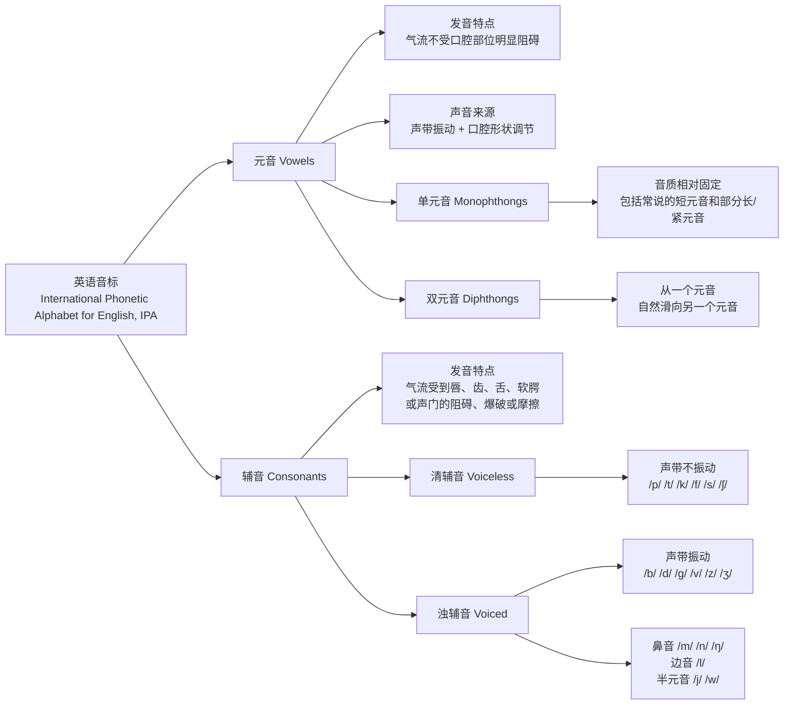
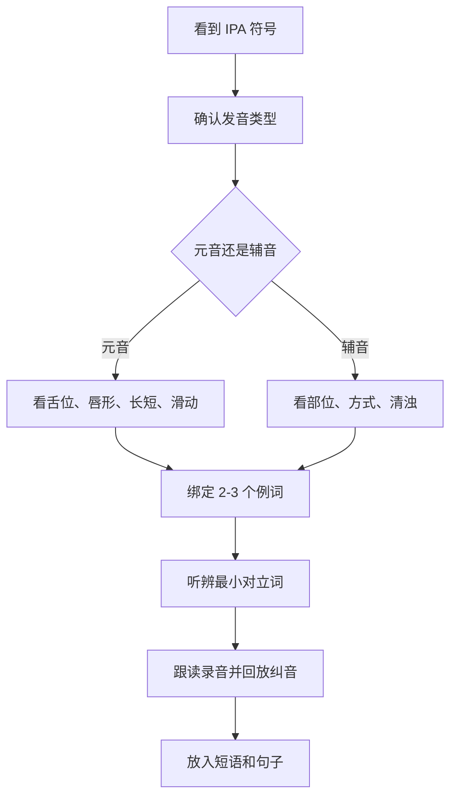

# 英语音标 IPA 学习笔记

IPA，全称 `International Phonetic Alphabet`，是一套用符号标记语音的系统。学英语音标时，重点不是把符号当成“另一套字母”死背，而是把每个音和 `口型、舌位、声带振动、气流方式、例词` 绑定起来。

本文以 `General American English`（通用美式英语）为主。不同词典、口音和教学体系可能对少数音的记法不同，例如 `bird` 可写作 `/bɝd/` 或 `/bɜːrd/`，`cot/caught` 在许多美式口音中可能合并。遇到差异时，以目标口音和所用词典为准。

## 目录

- [Key Takeaways](#key-takeaways)
- [分类总览](#分类总览)
- [IPA 学习框架](#ipa-学习框架)
- [元音 Vowels](#元音-vowels)
- [辅音 Consonants](#辅音-consonants)
- [完整音标表与基础例词](#完整音标表与基础例词)
- [最容易混淆的音](#最容易混淆的音)
- [练习方法](#练习方法)
- [学习网站](#学习网站)
- [参考来源](#参考来源)

## Key Takeaways

- 元音的核心是 `舌位高低 + 舌位前后 + 唇形 + 是否滑动`；气流不被明显阻碍。
- 辅音的核心是 `发音部位 + 发音方式 + 清浊`；气流会被唇、齿、舌、软腭或声门阻碍、爆破或摩擦。
- 中文母语者最容易混淆的不是所有音，而是少数高频对立：`/i/ vs /ɪ/`、`/ɛ/ vs /æ/`、`/ʌ/ vs /ɑ/`、`/θ/ vs /s/`、`/ð/ vs /z/`、`/l/ vs /r/`、`/v/ vs /w/`。
- 学 IPA 要“听辨优先，发音跟上”：先能听出差异，再稳定模仿，最后放入单词和句子。
- 单词拼写不能可靠推出发音。英语发音学习要以词典音标和真人音频为准。

## 分类总览

先记住这棵树，再进入具体符号表，会更容易判断一个音属于哪一类、应该从哪个发音维度入手。

这份总览解决的是“分类定位”问题：看到一个 IPA 符号时，先判断它是元音还是辅音；如果是元音，再看舌位、唇形和滑动；如果是辅音，再看发音部位、发音方式和清浊。

## IPA 学习框架

## 元音 Vowels

元音发音时，气流不受口腔部位明显阻碍，声音主要靠声带振动和口腔形状调节。学习元音时，不要只记“长短音”，更要记四个维度：

- `舌位高低`：high / mid / low，例如 `/i/` 比 `/æ/` 舌位高。
- `舌位前后`：front / central / back，例如 `/i/` 靠前，`/u/` 靠后。
- `唇形`：rounded / unrounded，例如 `/u/` 通常圆唇，`/i/` 不圆唇。
- `是否滑动`：单元音音质基本固定，双元音会从一个元音滑向另一个元音。

### 单元音 Monophthongs

单元音发音过程中音质相对固定。美式英语学习中常见单元音如下：

| IPA | 常见关键词 | 基础例词 | 发音提示 |
|---|---|---|---|
| `/i/` | FLEECE | see, green, seat | 舌位高且靠前，嘴角略向两侧拉 |
| `/ɪ/` | KIT | sit, pink, ship | 比 `/i/` 更短、更放松，嘴不要咧太开 |
| `/e/` 或 `/eɪ/` 的起点 | FACE 起点 | 需结合 `/eɪ/` 学习 | 美式里常以双元音 `/eɪ/` 出现 |
| `/ɛ/` | DRESS | red, bed, ten | 中低前元音，口腔比 `/ɪ/` 更打开 |
| `/æ/` | TRAP | cat, sand, apple | 低前元音，嘴张大，舌位靠前 |
| `/ɑ/` | LOT / PALM | coffee, father, hot | 低后元音，嘴张开，舌头靠后 |
| `/ɔ/` | THOUGHT | law, mauve, talk | 圆唇后元音；美式部分口音与 `/ɑ/` 合并 |
| `/ʊ/` | FOOT | wood, good, book | 短促、放松的后高元音，圆唇不夸张 |
| `/u/` | GOOSE | blue, food, two | 舌位高后，圆唇，声音更紧更长 |
| `/ʌ/` | STRUT | dust, cup, sun | 中央偏低，短促放松，不要读成中文“啊” |
| `/ə/` | schwa | about, sofa, support | 非重读音节中最常见的弱读元音 |
| `/ɝ/` | NURSE | bird, purple, learn | 重读卷舌元音，美式明显带 r 色彩 |
| `/ɚ/` | unstressed r-colored | teacher, better, color | 非重读卷舌元音，常见于词尾 `-er/-or` |

### 双元音 Diphthongs

双元音会从一个元音滑向另一个元音。关键不是把两个音机械拼起来，而是保留自然滑动。

| IPA | 常见关键词 | 基础例词 | 发音提示 |
|---|---|---|---|
| `/eɪ/` | FACE | jade, day, name | 从 `/e/` 向 `/ɪ/` 方向滑动 |
| `/aɪ/` | PRICE | lime, my, time | 从低位 `/a/` 向 `/ɪ/` 滑动 |
| `/aʊ/` | MOUTH | brown, now, house | 从低位 `/a/` 向 `/ʊ/` 滑动 |
| `/oʊ/` | GOAT | gold, go, home | 从 `/o/` 向 `/ʊ/` 滑动，美式常见 |
| `/ɔɪ/` | CHOICE | turquoise, boy, choice | 从 `/ɔ/` 向 `/ɪ/` 滑动 |

## 辅音 Consonants

辅音发音时，气流会受到唇、齿、舌、软腭或声门的阻碍、爆破、摩擦或引导。学习辅音时，用三维分类最稳：

- `发音部位`：双唇、唇齿、齿间、齿龈、硬腭后、软腭、声门等。
- `发音方式`：爆破音、摩擦音、塞擦音、鼻音、边音、近音。
- `清浊`：清辅音声带不振动，浊辅音声带振动。

### 清辅音 Voiceless

| IPA | 类型 | 基础例词 | 发音提示 |
|---|---|---|---|
| `/p/` | 双唇爆破音 | pig, pen, map | 双唇闭合后爆破，词首常送气 |
| `/t/` | 齿龈爆破音 | turtle, ten, late | 舌尖抵齿龈后释放，词首常送气 |
| `/k/` | 软腭爆破音 | cat, key, back | 舌后部抵软腭后释放，词首常送气 |
| `/f/` | 唇齿摩擦音 | frog, five, leaf | 上齿轻触下唇，气流摩擦 |
| `/θ/` | 齿间摩擦音 | thin, think, bath | 舌尖轻放上下齿之间，送气摩擦 |
| `/s/` | 齿龈摩擦音 | snake, see, bus | 舌尖靠近齿龈，气流成窄缝 |
| `/ʃ/` | 后齿龈摩擦音 | sheep, she, fish | 舌面略后，唇可轻微前突 |
| `/tʃ/` | 塞擦音 | chicken, chair, watch | `/t/` 起头，接 `/ʃ/` 摩擦 |
| `/h/` | 声门摩擦音 | horse, he, ahead | 喉部送气，口型跟随后面的元音 |

### 浊辅音 Voiced

| IPA | 类型 | 基础例词 | 发音提示 |
|---|---|---|---|
| `/b/` | 双唇爆破音 | bear, bad, cab | 双唇闭合后释放，声带振动 |
| `/d/` | 齿龈爆破音 | dog, day, red | 舌尖抵齿龈，声带振动 |
| `/g/` | 软腭爆破音 | goat, go, bag | 舌后部抵软腭，声带振动 |
| `/v/` | 唇齿摩擦音 | beaver, very, five | 上齿轻触下唇，声带振动 |
| `/ð/` | 齿间摩擦音 | feather, this, breathe | 舌尖轻放齿间，声带振动 |
| `/z/` | 齿龈摩擦音 | zebra, zoo, buzz | `/s/` 的浊音版本 |
| `/ʒ/` | 后齿龈摩擦音 | television, measure, genre | `/ʃ/` 的浊音版本，英语中较少见 |
| `/dʒ/` | 塞擦音 | giraffe, job, judge | `/d/` 起头，接 `/ʒ/` 摩擦 |
| `/m/` | 双唇鼻音 | mouse, man, come | 双唇闭合，气流从鼻腔出 |
| `/n/` | 齿龈鼻音 | dinosaur, no, ten | 舌尖抵齿龈，气流从鼻腔出 |
| `/ŋ/` | 软腭鼻音 | penguin, sing, long | 舌后部抵软腭，不要在词尾加 `/g/` |
| `/l/` | 边音 | lion, light, feel | 舌尖抵齿龈，气流从舌两侧通过 |
| `/r/` 或 `/ɹ/` | 近音 | rabbit, red, car | 美式 r 常卷舌或舌根后缩，避免读成中文“日” |
| `/j/` | 半元音/近音 | yak, yes, yellow | 类似 `yes` 开头音，不等于字母 j 的 `/dʒ/` |
| `/w/` | 半元音/近音 | wolf, we, quick | 圆唇并快速滑向后续元音 |

## 完整音标表与基础例词

### 元音总表

| 类别 | IPA | 关键词 | 基础例词 |
|---|---|---|---|
| 单元音 | `/i/` | FLEECE | see, green |
| 单元音 | `/ɪ/` | KIT | sit, ship |
| 单元音 | `/ɛ/` | DRESS | red, bed |
| 单元音 | `/æ/` | TRAP | cat, sand |
| 单元音 | `/ɑ/` | LOT / PALM | coffee, father |
| 单元音 | `/ɔ/` | THOUGHT | law, talk |
| 单元音 | `/ʊ/` | FOOT | wood, good |
| 单元音 | `/u/` | GOOSE | blue, food |
| 单元音 | `/ʌ/` | STRUT | dust, cup |
| 单元音 | `/ə/` | schwa | about, sofa |
| r 色彩元音 | `/ɝ/` | NURSE | bird, learn |
| r 色彩元音 | `/ɚ/` | unstressed -er | teacher, color |
| 双元音 | `/eɪ/` | FACE | jade, day |
| 双元音 | `/aɪ/` | PRICE | lime, my |
| 双元音 | `/aʊ/` | MOUTH | brown, now |
| 双元音 | `/oʊ/` | GOAT | gold, home |
| 双元音 | `/ɔɪ/` | CHOICE | boy, choice |

### 辅音总表

| 清浊 | IPA | 类型 | 基础例词 |
|---|---|---|---|
| 清 | `/p/` | 爆破音 | pig, pen |
| 浊 | `/b/` | 爆破音 | bear, bad |
| 清 | `/t/` | 爆破音 | turtle, ten |
| 浊 | `/d/` | 爆破音 | dog, day |
| 清 | `/k/` | 爆破音 | cat, key |
| 浊 | `/g/` | 爆破音 | goat, go |
| 清 | `/f/` | 摩擦音 | frog, five |
| 浊 | `/v/` | 摩擦音 | beaver, very |
| 清 | `/θ/` | 齿间摩擦音 | thin, think |
| 浊 | `/ð/` | 齿间摩擦音 | this, feather |
| 清 | `/s/` | 摩擦音 | snake, see |
| 浊 | `/z/` | 摩擦音 | zebra, zoo |
| 清 | `/ʃ/` | 摩擦音 | sheep, she |
| 浊 | `/ʒ/` | 摩擦音 | television, measure |
| 清 | `/tʃ/` | 塞擦音 | chicken, chair |
| 浊 | `/dʒ/` | 塞擦音 | giraffe, job |
| 浊 | `/m/` | 鼻音 | mouse, man |
| 浊 | `/n/` | 鼻音 | no, ten |
| 浊 | `/ŋ/` | 鼻音 | sing, long |
| 浊 | `/l/` | 边音 | lion, light |
| 浊 | `/r/` 或 `/ɹ/` | 近音 | rabbit, red |
| 浊 | `/j/` | 半元音 | yak, yes |
| 浊 | `/w/` | 半元音 | wolf, we |
| 清 | `/h/` | 声门摩擦音 | horse, he |

## 最容易混淆的音

| 易混音 | 最小对立词 | 混淆原因 | 练习要点 |
|---|---|---|---|
| `/i/` vs `/ɪ/` | sheep / ship, seat / sit | 中文里缺少这种稳定的松紧对立 | `/i/` 更紧更长；`/ɪ/` 更短更放松 |
| `/ɛ/` vs `/æ/` | bed / bad, men / man | 都是前元音，但开口大小不同 | `/æ/` 嘴张更大，舌位更低 |
| `/ʌ/` vs `/ɑ/` | cup / cop, luck / lock | 容易都读成“啊” | `/ʌ/` 更短更中央；`/ɑ/` 更低更靠后 |
| `/ʊ/` vs `/u/` | full / fool, pull / pool | 容易只用“长短”理解 | `/ʊ/` 放松短促；`/u/` 更紧更圆唇 |
| `/eɪ/` vs `/ɛ/` | late / let, pain / pen | 双元音滑动容易丢失 | `/eɪ/` 结尾要向 `/ɪ/` 滑动 |
| `/oʊ/` vs `/ɔ/` | coat / caught, low / law | 口音差异和拼写干扰明显 | `/oʊ/` 有滑动；`/ɔ/` 更稳定，且部分美式口音会合并 |
| `/θ/` vs `/s/` | thin / sin, mouth / mouse | 中文没有齿间摩擦音 | 舌尖轻放齿间，不要缩回齿龈 |
| `/ð/` vs `/z/` | then / zen, breathe / breeze | 齿间浊摩擦不熟悉 | 保持舌尖齿间，同时让声带振动 |
| `/ʃ/` vs `/s/` | she / see, ship / sip | 舌位前后和唇形不同 | `/ʃ/` 舌位更靠后，可轻微圆唇 |
| `/tʃ/` vs `/dʒ/` | cheap / jeep, chin / gin | 塞擦音清浊不稳 | `/dʒ/` 声带振动，前面元音通常更长 |
| `/l/` vs `/r/` | light / right, glass / grass | 舌尖位置和气流方式不同 | `/l/` 舌尖抵齿龈；`/r/` 舌尖不贴住齿龈 |
| `/v/` vs `/w/` | vine / wine, vest / west | 中文母语者常把唇齿音和圆唇音混淆 | `/v/` 上齿碰下唇；`/w/` 双唇圆起 |
| `/n/` vs `/ŋ/` | sin / sing, ran / rang | 词尾鼻音位置不稳 | `/ŋ/` 舌后部抵软腭，词尾不要额外加 `/g/` |
| `/j/` vs `/dʒ/` | yes / Jess, yet / jet | 字母 j 和 IPA `/j/` 容易混淆 | `/j/` 是 `yes` 开头音；`/dʒ/` 是 `job` 开头音 |

## 练习方法

### 1. 每个音固定 3 个锚点词

不要只背 `/i/ = 长 i`。更好的方式是：

- `/i/`：see, green, seat
- `/ɪ/`：sit, ship, pink
- `/æ/`：cat, apple, sand

每次看到符号，就立刻回忆锚点词和口型。

### 2. 用最小对立词练听辨

最小对立词是只差一个音的词，例如 `ship/sheep`、`bed/bad`、`thin/sin`。练习顺序：

1. 先听 10 组，只判断 A/B。
2. 再跟读 10 组，录音回放。
3. 最后放入短句，例如 `I saw a ship.` / `I saw a sheep.`

### 3. 辅音先练清浊，再练部位

清浊可以用手摸喉咙验证：

- `/s/`：声带不振动。
- `/z/`：声带振动。
- `/f/`：声带不振动。
- `/v/`：声带振动。

部位则用镜子检查，例如 `/θ/` 和 `/ð/` 要看到舌尖轻触上下齿之间。

### 4. 不要脱离重音和弱读

真实英语里，很多非重读音节会弱化成 `/ə/` 或 `/ɚ/`。例如：

- `about`：`/əˈbaʊt/`
- `teacher`：`/ˈtiːtʃɚ/`
- `support`：`/səˈpɔrt/`

所以 IPA 学习后期要从单音过渡到 `单词重音 -> 短语节奏 -> 句子弱读`。

## 学习网站

- American IPA Chart：<http://americanipachart.com/>
  - 适合学习美式英语音标。
  - 页面当前指向一张可交互的美式 IPA SVG 图表，包含辅音、元音和双元音示例。
  - 建议用法：先点单音听音素，再听例词；每次只练 2-3 个易混音，不要一次刷完整张表。

## 参考来源

- American IPA Chart：<http://americanipachart.com/>
- American IPA Chart SVG：<https://americanipachart.s3.amazonaws.com/american-IPA-chart-english.svg>
- International Phonetic Association：<https://www.internationalphoneticassociation.org/>
