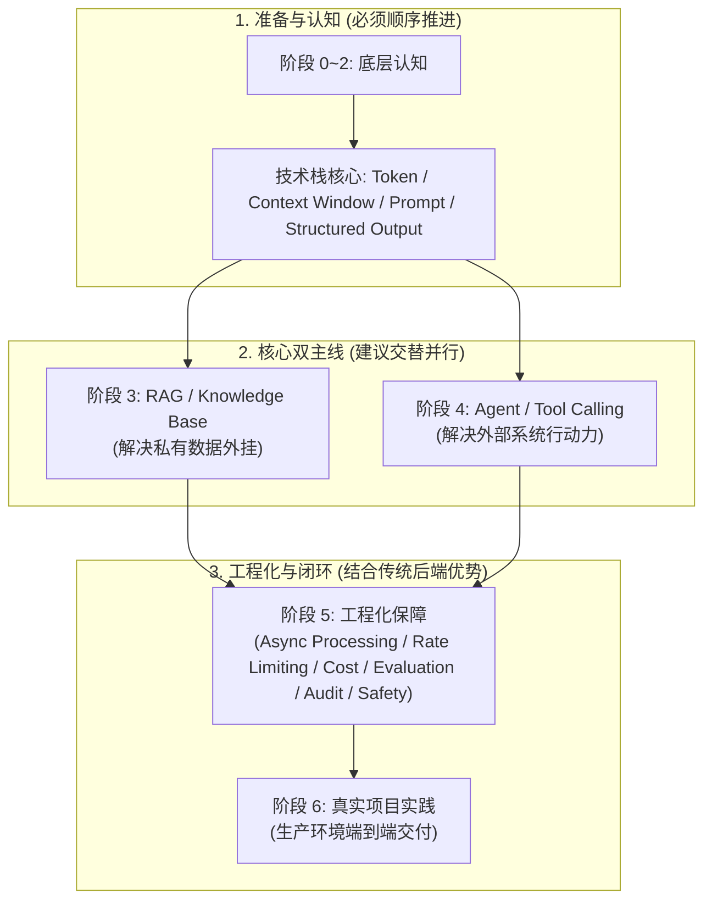

> 核心方向：将大模型接入到业务系统中。转型是将核心关注点从传统的并发与一致性、扩展到对模型输出不确定性、上下文污染、Token 成本和幻觉的控制；将传统的“确定性架构能力”复用到“不确定性的 AI 上游（LLM）”中。

## 前言
工程落地的路线总体分为三个阶段： 


### 核心知识矩阵与落地策略（关联大纲目录）

将原 MECE 表格重构为**结构化关联目录**，更方便作为学习笔记的索引或 Obsidian/Git 知识库的目录大纲（TOC）。

* **📂 1. 底层认知体系 (阶段 0 ~ 阶段 2)**
* **🔗 关联知识节点 (Nodes):** `Token` / `Context Window` / `Prompt` / `Structured Output`
* **🎯 核心攻坚点 (Focus):** 解决大模型输入输出的边界控制。重中之重是 **Structured Output**（通过 Schema 强约束，防止大模型返回的 JSON 发生格式破碎、字段缺失或乱序）。
* **💡 落地执行策略:** **必须前置且顺着走。** 底层认知不扎实，后续在排查线上大模型幻觉、长文本上下文污染等故障时会极其痛苦。


* **📂 2. 双主线演进路线 (阶段 3 ~ 阶段 4)**
* **🔗 关联知识节点 (Nodes):**
* **主线 A:** `RAG (Retrieval-Augmented Generation)` / `Knowledge Base`
* **主线 B:** `Agent` / `Tool Calling`


* **🎯 核心攻坚点 (Focus):** * **RAG:** 解决企业私有资产、动态数据的外挂与精准检索。
* **Agent:** 赋予大模型调用外部 API、数据库和业务系统的行动力。


* **💡 落地执行策略:** **交替进行，刻意拆开练习。** 初学者切忌一上来就做 RAG + Agent 的复杂融合体，应先在干净的环境下理清两条主线的边界，再做工程融合。


* **📂 3. 工程化支撑保障 (阶段 5)**
* **🔗 关联知识节点 (Nodes):** `Async Processing` / `Rate Limiting` / `Cost` / `Evaluation` / `Audit` / `Safety`
* **🎯 核心攻坚点 (Focus):** 解决大模型在高并发业务系统下“慢、贵、不稳定、不安全”的天然缺陷。
* **💡 落地执行策略:** **边做边补，充分复用后端老本行经验。** 流式异步（Stream）、Token 计费审计、限流熔断等架构设计属于后端工程师的绝对主场，结合 AI 特性做技术平移（如利用 Java 侧的 LangChain4j 或 Spring AI 生态）即可快速上手。


* **📂 4. 真实项目闭环 (阶段 6)**
* **🔗 关联知识节点 (Nodes):** `Real-World Projects` (技术栈：以 **Java** 生态为主，关键位置补充 **Go** 方案)
* **🎯 核心攻坚点 (Focus):** 用真实的端到端业务场景，将上述的认知、双主线、工程化保障彻底串联，对冲 LLM 上游的不确定性。
* **💡 落地执行策略:** **最终大集成。** 完成从“技术Demo学习”到“商业生产力交付”的彻底闭环。

- 沉淀底层认知：Token / Context Window / Prompt / Structured Output...  
- 拆分 RAG 与 Agent 双主线: Agent / Tool Calling & RAG / Knowledge Base  
- 工程化和项目实践：Async Processing / Rate Limiting / Cost / Evaluation / Audit / Safety / Real-World Projects...
建议阅读转型相关的思考和建议：[后端开发者转型 AI Agent 学习建议（2026 最新版）](https://javaguide.cn/roadmap/backend-to-ai-agent-roadmap.html)。
## Phase 1 - Fundamental Concepts
> FAQ：Tokenizer / Context window Limit / Non-deterministic output / Prompt engineering essentials (Roles \ Task \ Context \ Format \ Constraint \ Example \ Goal) / RAG
### 思维校准：从“确定性”到“概率性”
> AI 应用开发的转型必须完成从“输入 $\rightarrow$ 确定性输出”到“输入 $\rightarrow$ 概率分布”的思维校准。服务端架构设计不再是绝对的业务逻辑编写，而是通过工程约束（Guardrails）将概率性的黑盒输出转化为确定性的业务场景。
#### 确定性 业务 架构 vs 概率性 LLM 架构

| 维度 | 传统 业务 架构 | LLM 应用架构 |
| --- | --- | --- |
| **核心机制** | 确定性状态机 / 规则引擎 | 自回归生成（Autoregressive Generation） |
| **输入输出关系** | 相同输入 $\rightarrow$ 绝对相同输出 | 相同输入 $\rightarrow$ 概率性 Token 采样序列 |
| **核心影响变量** | 代码逻辑、数据库状态、API 契约 | Temperature、Top-P/K、上下文顺序、模型版本 |
| **稳定性控制** | 单元测试、异常捕获（Try-Catch） | **工程约束（格式/字段校验、降级、重试）** |

#### 核心机制：LLM 概率性的本质

* **自回归生成（Autoregressive Generation）**：LLM 并非整体输出，而是基于当前上下文**逐个预测下一个 Token**，并将其拼回上下文继续预测。任何微小的扰动（如前序 Token 采样的变化）都会在长文本生成中产生蝴蝶效应。
* **采样参数控制**：
	* `Temperature`：平滑或陡峭化概率分布。值越高，低概率 Token 被采样的几率越大，随机性增强。
	* `Top-P` & `Top-K`：动态或静态截断低概率 Token 集合，直接改变采样候选池。
* **上下文敏感性**：Prompt 的微妙顺序变化、Few-shot 样本的排列、甚至模型微版本的静默升级，都会改变模型内部的激活路径。
#### 工程约束：服务端应对概率性的约束
为了建立系统鲁棒性，服务端必须围绕 LLM 的输出构建一套**防御性工程架构**：
```
[LLM 原始输出] 
       │
       ▼
 1. 格式校验 (Schema Validation)  ───► 失败 ───► [2. 策略重试 (Retry with Hints)]
       │ 成功
       ▼
 2. 字段与业务逻辑校验  ───────────────► 失败 ───► [4. 降级兜底 (Fallback)]
       │ 成功
       ▼
[进入下游业务系统]

```

1. **格式校验（Schema Validation）**：采用 `Pydantic`、`Jsonformer` 或模型原生的 Structured Outputs（如 JSON Mode），对模型输出进行强行闭合与语法解析，防止格式碎片化。
2. **字段校验**：验证业务核心字段的类型、枚举值及合法性。
3. **失败重试（Retry with Hints）**：当校验失败时，将**错误信息作为上下文**重新喂给模型进行修正重试，而非盲目重试。
4. **降级提示（Fallback）**：设定边界条件，当信息不足、多次重试失败或模型触发安全策略时，执行主动拒绝或输出默认兜底数据。

### 基础概念 
> Token / Context window / Context Engineering
Token 是模型处理的底层最小语义单位, Tokenizer 通过 BPE（Byte Pair Encoding）算法将原始文本切分为 Subword 子词片段（Token ID 序列），高频词保留为一个 token，低频词会拆分为更碎的字符片段。Token 一般采用非对称计费：Output Token 价格通常是 Input Token 的 2~4 倍，因此工程取向上，更推荐 “长 Prompt + 短 Output” 的模式。  
- 核心风险与约束：中文“吃窗口”；不同 Tokenizer 间无法直接换算。 - 工程关注点：：Tokenizer 选型、计费控制等。
- Context Window 是模型单次 Request 能接收并处理的最大 Token 总量限制。在实际业务请求中，静态开销和动态开销会剧烈挤压业务内容的实际可用空间。窗口结果拓扑：System Prompt / Hardcoded Instructions & RAG Retrieved Context & Chat History & Current User Input & Tool Schema - 核心风险与约束：Lost in the Middle 效应；首字延迟（TTFT）随窗口增加而飙升 - 工程关注点：动态预算分配、长文本注意力衰减。  
Context Engineering 是指在有限窗口内组织、优化和淘汰上下文的工程手段，上下文包含：System prompt / Prompt \ Rag \ Memory \ Tool Schema... - 核心风险与约束：核心指令被噪声淹没；淘汰策略不当导致 Agent 行为失控 - 工程关注点：状态机流转、记忆淘汰策略（Eviction）、信息密度最大化
### 调度控制
### Prompt 工程
1. 前期 Prompt 没有规范，会影响后期服务的可维护性和服务解析层的负担
2. Prompt 组成部分：Roles \ Task \ Context \ Format \ Constraint \ Example \ Goal
3. 区分 System Prompt 和 User Prompt ：行为约束和任务输入的边界，越界会干扰模型行为
4. 生产环境的复杂推理任务的 
5. Few-Shot 的实用性和控制
6. 复杂任务分解
7. Prompt Injection - 隔离和过滤
### 结构化输出
### RAG
### 能力边界与技术选型
不能用同一个方案解决所有问题，需根据任务复杂度设定系统边界：

| 技术方案 | 适用场景 | 优势 | 劣势/风险点 |
| --- | --- | --- | --- |
| **Prompt Engineering** | 通用逻辑、简单格式化、无私有知识依赖的任务。 | 上线极快，几乎无固定成本。 | 受限于上下文长度，无法处理海量动态数据。 |
| **RAG (检索增强生成)** | 时效性强、动态变化、高准确度要求的私有知识库检索。 | 缓解幻觉，可追溯信息源，知识更新成本低。 | 严重依赖检索（Retrieval）召回率；容易引入非相关噪声。 |
| **Fine-tuning (微调)** | 特定风格定制、复杂领域格式强约束、追求低延迟/低 Token 消耗。 | 内化领域知识，提升轻量模型表现。 | 训练成本高，容易造成泛化能力下降（Overfitting）。 |
## Phase 2 - 