# 吴恩达 Agentic AI 课程笔记

Andrew Ng（吴恩达）关于 Agentic AI（智能体人工智能）的系列课程笔记。课程聚焦于如何构建基于 LLM 的智能体工作流应用，强调规范化开发流程与错误分析，是当前 AI 领域最重要的工程技能之一。

> 当前进度：已完成课程介绍 + 第 1~5 节。后续课程内容将持续补充。

## 目录

- [Key Takeaways](#key-takeaways)
- [课程介绍](#课程介绍)
- [第一节：Agentic AI 与 Agentic 工作流](#第一节agentic-ai-与-agentic-工作流)
  - [什么是 Agentic AI Workflow](#什么是-agentic-ai-workflow)
  - [Prompt vs Agentic Workflow 对比](#prompt-vs-agentic-workflow-对比)
  - [构建 Agentic 工作流的两个关键问题](#构建-agentic-工作流的两个关键问题)
- [第二节：自主性程度](#第二节自主性程度)
  - [自主性光谱](#自主性光谱)
  - [低自主性 vs 高自主性 对比](#低自主性-vs-高自主性-对比)
  - [实际应用分布](#实际应用分布)
- [第三节：Agentic AI 的优势](#第三节agentic-ai-的优势)
  - [三大核心优势](#三大核心优势)
  - [性能提升：工作流可以弥补模型代际差距](#性能提升工作流可以弥补模型代际差距)
  - [并行化：让研究任务快于人类顺序处理](#并行化让研究任务快于人类顺序处理)
  - [模块化：工具和模型都可以替换](#模块化工具和模型都可以替换)
  - [关于时间成本的工程判断](#关于时间成本的工程判断)
  - [第三节文字稿整理版](#第三节文字稿整理版)
- [第四节：Agentic AI 的应用](#第四节agentic-ai-的应用)
  - [四类应用案例](#四类应用案例)
  - [案例 1：发票处理](#案例-1发票处理)
  - [案例 2：基础客户订单查询](#案例-2基础客户订单查询)
  - [案例 3：高级客户服务智能体](#案例-3高级客户服务智能体)
  - [案例 4：计算机使用与网页浏览](#案例-4计算机使用与网页浏览)
  - [什么任务适合 Agentic AI](#什么任务适合-agentic-ai)
  - [实现 Agentic 工作流的核心方法](#实现-agentic-工作流的核心方法)
  - [第四节文字稿整理版](#第四节文字稿整理版)
- [第五节：任务分解](#第五节任务分解)
  - [任务分解的核心问题](#任务分解的核心问题)
  - [任务分解的判断循环](#任务分解的判断循环)
  - [案例 1：研究智能体](#案例-1研究智能体)
  - [案例 2：基础客户订单查询](#案例-2基础客户订单查询)
  - [案例 3：发票处理](#案例-3发票处理)
  - [Agentic 工作流的构建模块](#agentic-工作流的构建模块)
  - [从初始工作流到持续迭代](#从初始工作流到持续迭代)
  - [第五节文字稿整理版](#第五节文字稿整理版)
- [符号约定](#符号约定)
- [概念关系图](#概念关系图)
- [最佳实践与注意事项](#最佳实践与注意事项)

## Key Takeaways

1. **Agentic AI workflow** 是指 LLM 应用通过**多步骤执行**来完成任务的过程，而非一次性输出。
2. **Prompt 方式**是线性的一次性生成；**Agentic 方式**是迭代式的多步骤流程（研究 → 草稿 → 修订 → 再研究 → 最终稿）。
3. **自主性是一个光谱**：从完全预定义的确定性步骤（低自主），到 LLM 自主决定步骤序列甚至动态创建工具（高自主）。
4. 构建 Agentic 工作流的两个核心能力：**任务分解** + **组件构建**（让每个步骤都能高质量执行）。
5. **低自主性系统在当前企业应用中价值巨大**，因为更可控、更可预测；高自主性系统仍在积极研究中。
6. Agentic AI 的主要优势包括：**并行处理任务**、**模块化替换组件**、以及**显著提升应用性能**。
7. Agentic AI 更适合**流程明确、有标准作业程序、以文本资产为主**的任务；步骤未知、多模态输入丰富的任务难度更高。
8. **任务分解**的关键是观察人类或企业正在做的工作，识别离散步骤，并判断每一步能否由 LLM、短代码、API 或工具调用实现。
9. 吴恩达强调：真正擅长构建 Agentic 工作流的人与普通开发者之间最大的差异在于**规范化的开发流程**，尤其是**错误分析（Error Analysis）**。

## 课程介绍

吴恩达在课程开篇指出，**"Agentic"（智能体化）** 这个术语被他提出后，被营销人员过度使用，导致生成式 AI 的炒作迅速飙升。但好消息是：

- 尽管存在炒作，**真正有价值且实用的应用数量也在快速增长**。
- 这些应用包括：客户支持代理、深度研究报告撰写、复杂法律文件处理、患者输入分析与医学诊断建议等。
- 吴恩达团队构建的许多项目，**如果没有 Agentic 工作流将完全不可能实现**。

> **核心观点**：掌握如何构建 Agentic 应用是当今 AI 领域最重要的技能之一。

## 第一节：Agentic AI 与 Agentic 工作流

### 什么是 Agentic AI Workflow

**Agentic AI workflow（智能体化 AI 工作流）** 是指：一个基于 LLM 的应用通过执行**多个步骤**来完成一项任务的过程。

以"撰写一篇关于某个主题的论文"为例：

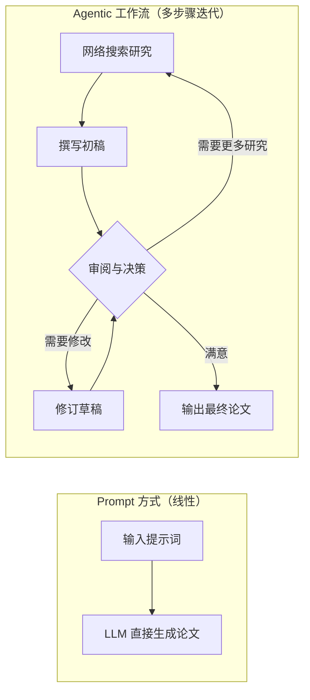

### Prompt vs Agentic Workflow 对比

| 维度 | Prompt 方式 | Agentic Workflow 方式 |
|------|------------|----------------------|
| **执行模式** | 线性，一次性生成 | 多步骤，迭代循环 |
| **过程控制** | 无中间控制，直接输出 | 每步可检查、可修正、可回溯 |
| **输出质量** | 依赖单次推理质量 | 通过多轮优化逐步提升 |
| **外部交互** | 无 | 可调用搜索、API、工具等 |
| **典型场景** | 简单问答、短文本生成 | 研究报告、法律分析、复杂决策 |
| **可调试性** | 低（黑箱） | 高（每步可观测） |

**实例对比（撰写论文）：**

- **Prompt 方式**：直接给 LLM 一个提示词，一次性生成整篇论文。
- **Agentic 方式**：
  1. 先进行网络搜索收集资料
  2. 撰写初稿
  3. 检查初稿 → 发现不足 → 补充研究或修改
  4. 反复迭代直到满意
  5. 输出比单纯 Prompt 更详尽的报告

> 吴恩达表示，他在法律文件合规分析、医疗健康、商业产品研究等领域已经构建了许多专用研究代理，这种方式远比单纯让 LLM 写论文效果好得多。

### 构建 Agentic 工作流的两个关键问题

1. **如何将任务分解为步骤（Task Decomposition）**
   - 将一个复杂任务拆解为可管理的子步骤
   - 确定步骤之间的依赖关系和执行顺序

2. **如何构建组件来高质量地执行每个步骤（Component Building）**
   - 每个步骤需要什么能力？（LLM 推理、工具调用、API 访问等）
   - 如何确保每个步骤的输出质量？

## 第二节：自主性程度

### 自主性光谱

AI 系统可以是**不同程度**的 Agentic（智能体化）。"Agentic" 一词源自 "agent"（智能体），核心含义是系统能够**自主地感知环境并采取行动**。

自主性并非二元的"是或否"，而是一个连续的光谱：

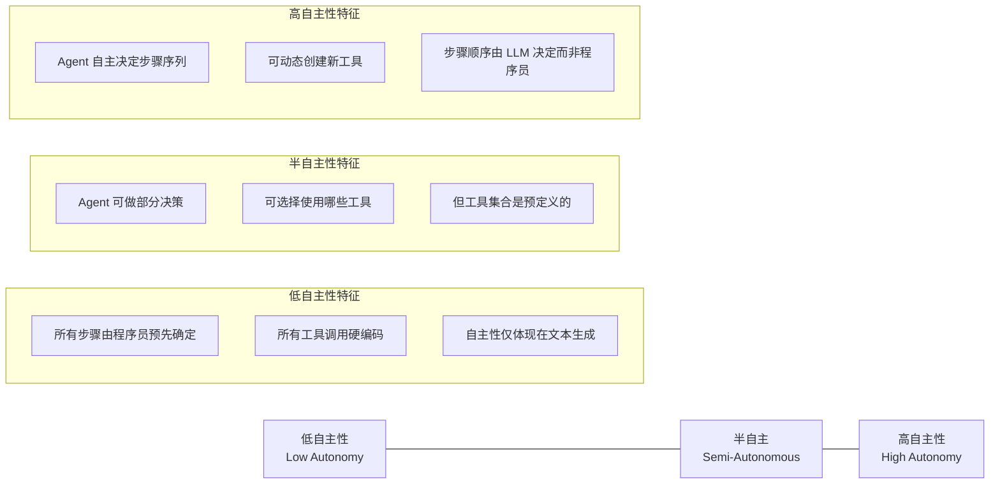

### 低自主性 vs 高自主性 对比

| 维度 | 低自主性（Less Autonomous） | 高自主性（Highly Autonomous） |
|------|--------------------------|---------------------------|
| **步骤确定方式** | 程序员预先定义所有步骤 | LLM 自主决定步骤顺序 |
| **工具使用** | 硬编码调用哪些工具 | Agent 自主选择甚至创建工具 |
| **自主性体现** | 主要在文本生成内容上 | 在决策、规划、工具选择等各方面 |
| **可控性** | 高，行为完全可预测 | 低，行为较难预测 |
| **适用场景** | 企业级确定性任务 | 开放域研究、探索性任务 |
| **开发难度** | 相对较低 | 高，仍在研究中 |

**具体示例（以研究代理为例）：**

- **低自主性**：程序员规定了固定的步骤链——先搜索 → 再抓取网页 → 然后生成报告。LLM 只管生成内容。
- **高自主性**：让 LLM 自行决定是否需要搜索、搜索什么来源、抓取多少网页、是否需要将 PDF 转换为文本、是否反思后重新搜索等。具体步骤序列由 Agent 自行决定。

### 实际应用分布

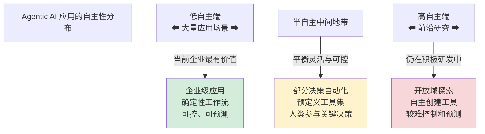

> **关键洞察**：低自主性系统在当前有**大量实际应用场景**，对当今企业非常有价值；高自主性系统虽然更有想象力，但**更难控制、更不可预测**，相关研究仍在进行中。

## 第三节：Agentic AI 的优势

### 三大核心优势

这一节讨论为什么要使用 Agentic AI workflow。吴恩达将它的核心红利概括为三点：

1. **Parallelization（并行化）**：能够把人类必须顺序完成的任务拆成多个可并行步骤，从而缩短复杂任务的实际完成时间。
2. **Modular Design（模块化设计）**：可以替换或升级工作流中的工具、模型和子任务组件，而不是把全部能力压在一次端到端生成上。
3. **Much Better Performance（显著提升性能）**：通过反思、迭代、工具调用、检索和任务分解，让应用表现超过单次 Prompt 的上限。

> 课程中的重点不是“Agentic 工作流一定更快”，而是：当任务足够复杂时，它可以用更工程化的流程换取更高质量、更可控、可并行扩展的结果。

### 性能提升：工作流可以弥补模型代际差距

吴恩达用代码生成基准 HumanEval 说明 Agentic 工作流对性能的影响：

| 对比项 | 直接生成方式 | Agentic 工作流方式 |
|--------|--------------|-------------------|
| **GPT-3.5** | 在 HumanEval 上约 40% 正确率（pass@k 指标，按课程转写） | 通过“生成 → 反思 → 改进”等技术可进一步提升 |
| **GPT-4** | 直接生成性能提升到约 67% | 继续叠加 Agentic 工作流后表现更好 |
| **核心含义** | 更强模型本身会带来明显提升 | 好的工作流也能带来巨大提升，甚至可能超过单纯升级模型的收益 |

这里的关键洞察是：**模型能力不是应用性能的唯一来源**。同一个模型如果被包进更好的工作流中，比如让它先写代码、再检查错误、再修订方案，最终效果可能显著高于一次性生成。

这对工程实践很重要：

- 不要只依赖“换更大的模型”解决质量问题。
- 应该把系统拆成可评估的步骤，再针对失败环节优化。
- 旧一代模型如果配合好的 Agentic 流程，也可能在某些任务上超过新模型的直接生成结果。

### 并行化：让研究任务快于人类顺序处理

Agentic 工作流的另一个优势是**并行处理能力**。虽然多步骤 Agentic 系统的绝对耗时通常比“输入一句话，让模型直接回答”更长，但它可以把许多人类只能顺序做的事情并行化。

以“撰写一篇关于黑洞的论文”为例：

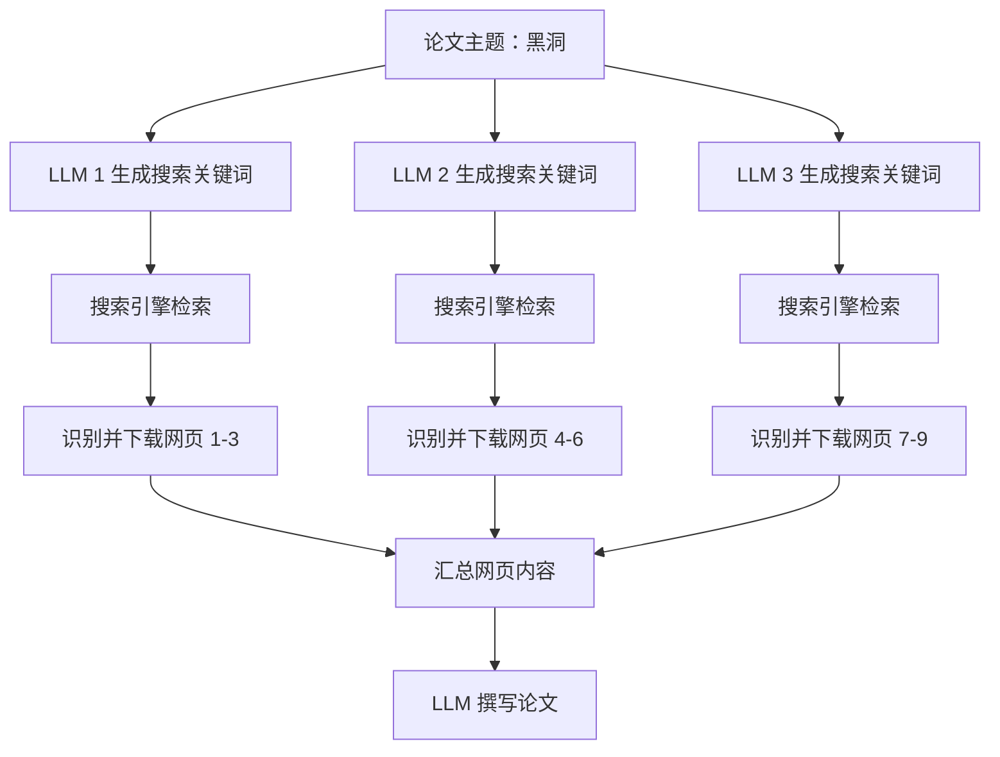

人类做研究时，通常需要一个网页接一个网页地读完。Agentic 系统则可以让多个 LLM 并行生成搜索查询，并并行下载多个网页，最后再把这些材料交给 LLM 汇总、写作。

| 维度 | 人类研究方式 | Agentic 研究方式 |
|------|--------------|------------------|
| **资料检索** | 顺序搜索、逐个打开网页 | 多个查询并行搜索 |
| **网页处理** | 按顺序阅读 9 个网页 | 批量、并行下载 9 个网页 |
| **信息汇总** | 人类手动整理笔记 | LLM 汇总后生成草稿 |
| **速度优势来源** | 主要依赖个人阅读速度 | 依赖并发检索、并发下载和自动摘要 |
| **适合任务** | 深度判断、批判性阅读 | 大规模资料收集、初稿生成、横向调研 |

因此，判断 Agentic 系统“快不快”要看比较对象：

- 和**一次性直接生成**相比：Agentic 工作流通常更慢。
- 和**人类完成同等资料收集与写作任务**相比：Agentic 工作流可能快得多。

### 模块化：工具和模型都可以替换

Agentic 工作流不是一个不可拆开的黑盒，而是一组组件的组合。这种模块化设计让开发者可以持续优化局部组件。

常见可替换位置包括：

| 模块 | 可替换内容 | 示例 |
|------|------------|------|
| **搜索工具** | 换不同搜索引擎或检索 API | Google / SerpAPI、Bing、DuckDuckGo、You.com |
| **垂直工具** | 用专门工具替代通用工具 | 在查询“黑洞最新突破”时使用新闻搜索引擎 |
| **语言模型** | 为不同步骤选择不同模型 | 查询生成用小模型，最终写作用强模型 |
| **工作流步骤** | 添加、删除或重排子步骤 | 增加反思、事实核查、重写、评分等环节 |

这种设计带来的直接好处是：

- **可调试**：能定位是搜索差、网页抓取差、摘要差，还是最终写作差。
- **可升级**：某个工具或模型变强时，可以只替换对应模块。
- **可控成本**：不同步骤使用不同模型，避免所有环节都调用最贵模型。
- **可做实验**：可以 A/B 测试不同搜索引擎、不同提示词、不同模型组合。

### 关于时间成本的工程判断

吴恩达在这一节强调了一个务实判断：Agentic 工作流并不是为了让每个简单任务都更快，而是为了让复杂任务**更可靠、更高质量，并且在适合并行的地方更快**。

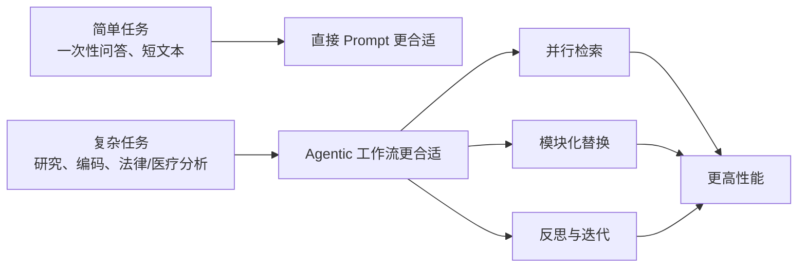

**本节结论**：使用 Agentic 工作流的主要原因是它能在许多应用中显著提升性能；除此之外，它还能并行处理人类必须顺序完成的任务，并通过模块化设计持续加入新工具、替换旧模型、优化局部步骤。

课程在这一节结尾承上启下：接下来会通过一系列 AI 应用案例，展示人们已经构建了哪些类型的 Agent，以及学习者可以如何开始构建自己的 Agent 应用。

### 第三节文字稿整理版

> 以下为基于课程中文转写的整理版文字稿，已修正明显的语音识别错误，如将“enic / 基因 / 遗传工作流”统一为 “Agentic 工作流”，将 “Mudular” 修正为 “Modular”。

我认为 Agentic 工作流最大的优势在于，它使你能够高效完成许多仅靠普通单次提示难以实现的任务。当然，它还有其他优势，包括并行处理能力，可以更快完成某些任务；以及模块化设计，可以从不同来源组合多个组件的最佳部分，构建高效工作流。

我们来看一些编码基准测试数据。这个基准测试评估不同语言模型编写代码、完成特定任务的能力。测试名称是 HumanEval。结果显示，GPT-3.5 直接编写代码时，在这个基准测试中的正确率约为 40%（课程中以 pass@k 指标描述）。GPT-4 是更强的模型，直接生成时性能提升到约 67%。

但事实证明，尽管从 GPT-3.5 到 GPT-4 的模型代际提升已经很大，使用 Agentic 工作流包装 GPT-3.5 后，也可以带来非常显著的改进。你可以提示 GPT-3.5 编写代码，然后让它反思代码、找出改进方法，并通过这类技术进一步提升表现。同样，GPT-4 放在 Agentic 工作流中也会表现得更好。

因此，即使使用当今最先进的语言模型，Agentic 工作流仍然能够显著提升性能。这个例子说明：不同代模型之间的性能提升固然巨大，但在旧一代模型上实施更好的 Agentic 工作流，也可能带来非常可观的提升。

使用 Agentic 工作流的另一个优势是可以并行处理某些任务，从而以远超人类的速度完成特定工作。例如，如果让 Agentic 工作流撰写一篇关于黑洞的论文，可以让三个语言模型并行生成网络搜索关键词，并把这些关键词输入搜索引擎进行检索。基于第一次网络搜索，可以识别出前三个需要获取的网页；基于第二次网络搜索，可以识别出另一组网页；依此类推。

人类进行这项研究时，通常需要按顺序阅读这九个网页。而在 Agentic 工作流中，可以并行下载所有九个网页，最后把这些内容输入给 LLM 来撰写文章。

尽管 Agentic 工作流比直接生成更耗时，也就是比“只提示一次就生成答案”的方式更慢，但如果把它和人类完成同等任务的方式比较，并行下载和处理大量网页的能力，实际上能让它比人类顺序处理数据更快完成某些任务。

我发现构建工作流时经常要做的一件事，是分析各个组件，并添加或替换组件。例如，我可能会查看当前使用的网络搜索引擎，并决定替换为新的网络搜索引擎。在构建通用工作流时，也可以使用多个网络搜索引擎，包括 Google（可通过 SerpAPI 访问）、Bing、DuckDuckGo、You.com 等。现在也有很多专为语言模型设计的网络搜索引擎选项。

或者，与其只进行三次普通网络搜索，也许可以在某一步替换为新闻搜索引擎，以获取关于黑洞信号或近期突破的最新新闻。

最后，不一定要在所有步骤中使用同一个语言模型。我通常会尝试不同的大型语言模型，也会尝试不同的模型提供商，观察哪一种模型在系统的不同步骤中效果最好。

总结来说，使用 Agentic 工作流的主要原因，是它在许多应用中可以显著提升性能。除此之外，它还能并行处理人类必须顺序完成的任务；许多 Agentic 工作流的模块化设计，也允许我们添加或更新工具，有时替换模型。接下来课程将详细讨论构建 Agentic 工作流的关键组件，并通过一系列 AI 应用案例，了解人们已经构建了哪些类型的 Agent，以及你可以如何自行构建 Agent 应用。

## 第四节：Agentic AI 的应用

这一节通过四个从简单到困难的案例，说明 Agentic AI 在企业场景中如何落地，也给出一个判断任务复杂度的实用框架。

### 四类应用案例

| 应用案例 | 典型任务 | 难度 | 核心特点 |
|----------|----------|------|----------|
| **发票处理** | 从 PDF 发票中提取字段并写入数据库 | 低 | 步骤清晰，有标准流程 |
| **基础客户订单查询** | 读取客户邮件、查订单、草拟回复、人工审核 | 中低 | 流程明确，但需要工具调用和人工审核 |
| **高级客户服务** | 回答库存、退货、政策等复杂问题 | 中高 | 步骤无法完全提前确定，需要动态规划 |
| **计算机使用 / 网页浏览** | 像人一样操作浏览器完成任务 | 高 | 多模态、网页 UI 复杂、可靠性仍不足 |

### 案例 1：发票处理

发票处理是企业中非常典型的 Agentic AI 应用。财务部门常常需要从发票中提取关键信息，例如承包商名称、公司地址、应付金额、到期日，并把这些信息记录到数据库中，确保后续能按时付款。

一个可行的 Agentic 工作流如下：

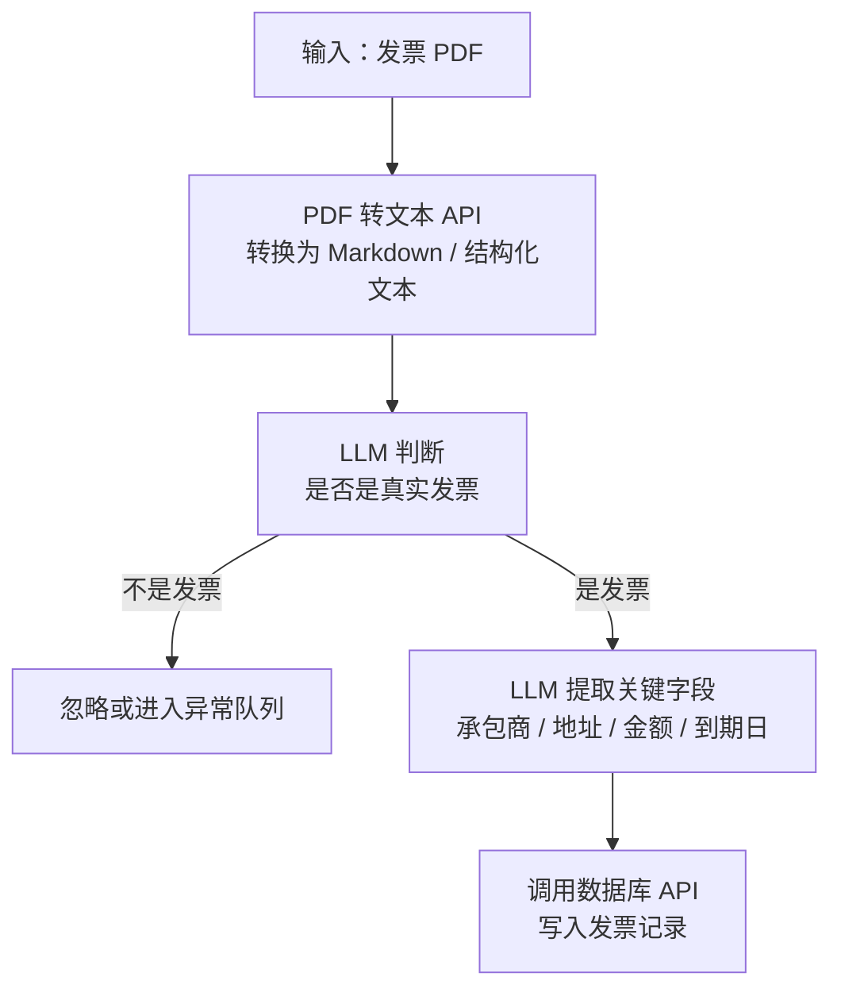

这个案例的价值在于：它有明确的标准作业程序（SOP）。系统只需要按照固定步骤执行：识别文档、转换格式、校验类型、抽取字段、更新数据库。因为步骤清晰、输入以文档文本为主，所以非常适合 Agentic 工作流。

### 案例 2：基础客户订单查询

第二个案例是处理基础客户订单查询。客户可能通过邮件询问订单状态，系统需要识别客户身份、提取订单信息、查询数据库，并生成回复。

典型流程如下：

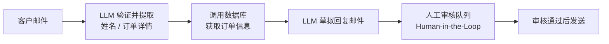

这个场景比发票处理稍复杂，因为它不仅需要信息提取，还需要调用数据库，并把 LLM 草拟的回复放入人工审核队列。课程中特别提到，这类客户订单查询 Agent 已经在许多企业中部署。

它的工程特点是：

- **流程仍然明确**：收邮件、提取信息、查库、草拟回复、人工审核、发送。
- **引入工具调用**：数据库查询是关键外部工具。
- **引入人工审核**：降低错误回复客户的风险。

### 案例 3：高级客户服务智能体

高级客户服务比基础订单查询更难，因为客户问题更开放，处理步骤无法完全提前写死。

课程给了两个例子：

| 用户请求 | Agent 需要做的事 | 难点 |
|----------|------------------|------|
| “你们有黑色或蓝色的牛仔裤吗？” | 分别查询黑色库存和蓝色库存，再整合结果回复 | 需要规划多个数据库查询 |
| “我要退掉买的沙滩毛巾。” | 验证购买记录、检查退货政策、判断是否在 30 天内、确认是否未使用、开具退货凭证、更新数据库 | 需要结合订单事实和业务规则决策 |

与前两个案例不同，高级客服的步骤不是完全预先确定的。LLM 应用必须根据用户输入，决定下一步要调用什么工具、查询什么信息、是否需要检查政策、是否可以触发后续操作。

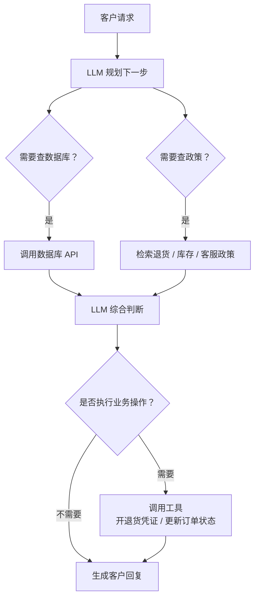

这个案例说明：当任务需要“边执行边规划”时，Agentic 工作流会明显更复杂，也更不可预测。

### 案例 4：计算机使用与网页浏览

最后一个案例是计算机使用智能体（Computer Use Agent）。这类 Agent 能访问浏览器，像人一样点击页面、填写表单、读取网页内容，并完成复杂任务。

课程示例是：让 Agent 查询从旧金山到华盛顿特区 DCA 机场的特定美联航机票是否还有座位。Agent 的行为包括：

1. 打开并浏览美联航网站。
2. 点击页面元素并填写搜索条件。
3. 分析页面内容，判断下一步操作。
4. 在美联航网站遇到困难时，改用 Google Flights 搜索可用航班。
5. 找到合适航班后，再返回美联航网站确认座位情况。

这个例子展示了 Agent 的灵活性：它不是只按固定脚本执行，而是在网页环境中遇到困难后切换路径。但课程也明确指出，Computer Use 仍处于前沿研究阶段，尚未达到关键业务场景所需的商用可靠性。

主要困难包括：

- 网页加载缓慢时，Agent 可能无法正确理解当前状态。
- 复杂网页 UI、动态元素和弹窗会增加解析难度。
- 视觉信息、网页结构和交互动作共同构成多模态任务，可靠性比纯文本任务低。
- Agent 可能完成一次演示任务，但在真实生产环境中仍不够稳定。

### 什么任务适合 Agentic AI

吴恩达给出的判断框架可以概括为：越靠左越适合当前落地，越靠右越接近前沿研究。

| 维度 | 更容易实现 | 更困难 |
|------|------------|--------|
| **流程清晰度** | 步骤明确，已有标准作业程序（SOP） | 步骤无法提前知道 |
| **执行方式** | 按固定流程逐步执行 | 需要边执行边规划 |
| **输入类型** | 主要是文本资产 | 包含声音、视觉、网页、视频等多模态输入 |
| **可预测性** | 高，便于测试和调试 | 低，行为更难预测 |
| **商业落地成熟度** | 更适合当前部署 | 更偏前沿研究，可靠性仍需提升 |

**当前商业落地的甜蜜点**：流程明确、文本为主、遵循标准作业程序的任务。比如发票处理、基础订单查询、合规文档分析、结构化信息抽取等。

### 实现 Agentic 工作流的核心方法

实现 Agentic 工作流时，最关键的技能是**流程拆解能力**。开发者需要观察一个复杂业务流程，并识别其中可独立执行的离散步骤。

可以按下面的问题拆解：

1. 输入是什么？是文本、PDF、邮件、网页，还是多模态内容？
2. 第一步必须做什么？格式转换、身份验证、分类、检索，还是字段提取？
3. 哪些步骤需要 LLM 判断？哪些步骤只是确定性的工具调用？
4. 哪些外部工具必须接入？数据库、搜索引擎、PDF 转换器、邮件系统、浏览器？
5. 哪些环节需要人工审核？
6. 每一步失败时应该如何处理？忽略、重试、进入异常队列，还是转人工？

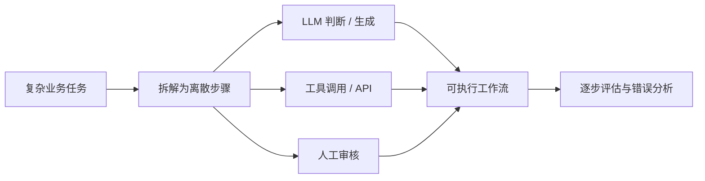

下一节课程会进一步展开任务分解（Task Decomposition）：如何把研究报告写作、客服回复等复杂目标，拆成可以被 Agentic 工作流逐项执行的步骤。

### 第四节文字稿整理版

> 以下为基于课程中文转写的整理版文字稿，已修正明显的语音识别错误，如将“Enic / 基因型 AI 工作流”统一为 “Agentic AI 工作流”，将 “slovw” 按上下文理解为 “solve / plan as you go”。

让我们看一些 Agentic AI 应用的例子。许多企业都会做的一类任务是发票处理。给定一张发票，你可能需要编写软件来提取最重要的字段。对于这个应用，假设要提取承包商、公司地址、应付金额三千美元，以及到期日 2025 年 8 月。

在许多财务部门中，可能会有人查看发票，识别最重要的字段，判断需要在什么时候付款，并把这些信息记录到数据库中，以确保及时付款。如果用 Agentic 工作流实现，可以输入一张发票，然后调用 PDF 转文本 API，把 PDF 转换为格式化文本，例如 Markdown 文本，供语言模型处理。接着，语言模型查看文档并判断这是否是真实发票，还是应忽略的其他类型文档。如果是发票，就提取所需字段，同时调用 API 或工具更新数据库，把最重要的字段保存到数据库记录中。

这个工作流的一个特点是，它有明确流程可遵循：识别所需字段并记录到数据库。像这样有明确流程的任务，更容易由 Agentic 工作流执行，因为它能可靠地分步完成任务。

再看一个稍微复杂的例子。如果你想构建一个处理基础客户订单查询的 Agent，可能需要提取关键信息，确定客户具体订购了什么、客户姓名是什么，然后查找相关客户记录，最后草拟回复，供人工审核后再发送邮件。

这里同样有一个明确流程：处理邮件，把输入交给语言模型进行验证或提取订单详情。假设客户邮件确实涉及订单，模型可能调用数据库获取信息，这些信息再交给模型草拟邮件回复。模型也可能使用请求-响应工具，把生成的草稿邮件放入人工审核队列，审核通过后即可发送。这类客户订单查询 Agent 正在许多企业中部署。

再看一个更具挑战性的例子。如果你想构建一个客户服务 Agent，不只是回答客户下单问题，而是回应更广泛的问题，客户可能会问任何问题。例如，客户问：“你们有黑色牛仔裤或蓝色牛仔裤吗？”为了回答这个问题，系统可能需要多次调用数据库 API，先检查黑色牛仔裤库存，再检查蓝色牛仔裤库存，然后回复客户。这是更复杂的查询，因为给定用户输入后，系统实际上需要规划数据库查询顺序来检查库存。

另一个例子是客户说：“我要退掉我买的沙滩毛巾。”为了回答这个问题，系统可能需要验证客户是否确实购买了沙滩毛巾，然后检查退货政策。也许退货政策只允许购买后 30 天内退货，并且毛巾必须未使用过。如果允许退货，Agent 就可以开具退货凭证，并将数据库记录设为退货待处理。在这个例子中，处理客户请求所需的步骤事先未知，因此流程更复杂，LLM 应用必须自行决定完成任务所需的步骤。

最后再举一个例子：计算机使用与网页浏览。这可能是特别困难的视觉系统。目前有很多关于 Agent 使用计算机的工作，其中 Agent 会尝试使用网络浏览器、阅读网页，并完成复杂任务。在这个例子中，我让 Agent 检查两张特定美联航机票是否可用，航线是从旧金山到华盛顿特区 DCA 机场。Agent 可以访问浏览器来执行任务。

在视频中可以看到，Agent 独立浏览美联航网站，点击页面元素并填写文本，查看页面内容来执行搜索请求。Agent 会分析页面内容，确定完成任务所需的操作和下一步行动。在这个案例中，它在美联航网站查询航班时遇到困难，于是转而访问 Google Flights 搜索可用航班。在那里它发现多个符合用户查询的航班选项，选择其中一个后返回美联航网站，并最终确定我询问的航班仍有空座。

计算机使用是当前最令人兴奋的前沿研究领域之一，许多公司正在努力让计算机使用 Agent 正常运作。虽然你看到的 Agent 最终找到了答案，但我也经常看到 Agent 在使用网页浏览时遇到困难。例如，如果网页加载缓慢，Agent 可能无法理解发生了什么。许多网页仍超出 Agent 准确解析和处理的能力。因此，计算机使用 Agent 虽然还没有可靠到可以投入关键实际应用，但仍然是未来发展中令人兴奋且重要的方向。

所以，当我考虑构建 Agentic AI 工作流时，更简单的任务通常是步骤非常明确的流程，或者企业已有标准作业程序，只需要把这些程序转化为 AI Agent 的指令。使用纯文本资源会更容易，因为大型语言模型擅长处理文本。如果需要处理其他输入模态，可能仍然可行，但难度会增加。

如果步骤无法提前预知，例如更高级客服 Agent 所需的任务，Agent 可能需要边执行边规划，这会更难，也更不可预测。正如前面提到的，如果需要处理丰富的多模态输入，例如声音和视觉，可靠性也会降低。

这能帮助你理解可以构建哪些类型的工作流。自行实现时，最重要的技能是分析复杂流程，并把它拆解为具体步骤，以便在 Agentic 工作流中逐项执行。下一视频将详细讲解任务分解，比如撰写研究报告或让客服 Agent 回复客户时，如何将复杂任务拆解为离散步骤来构建工作流。

## 第五节：任务分解

这一节专门讨论 Task Decomposition（任务分解）：如何把复杂的商业或个人任务拆成 Agentic Workflow 可以逐步执行的离散步骤。

### 任务分解的核心问题

任务分解要解决的问题是：**人类和企业正在做很多有价值的事情，如何把这些事情拆成可由 LLM、工具、API、代码执行器组合完成的步骤？**

吴恩达给出的核心方法是：

1. 观察一个真实工作流，而不是从抽象技术能力出发。
2. 找出人类完成这个任务时实际执行的离散步骤。
3. 对每一步追问：这一步能否由语言模型、短代码片段、现有工具或函数调用完成？
4. 如果不能，就继续向下拆，把它拆成更小、更具体、更容易自动化的子步骤。

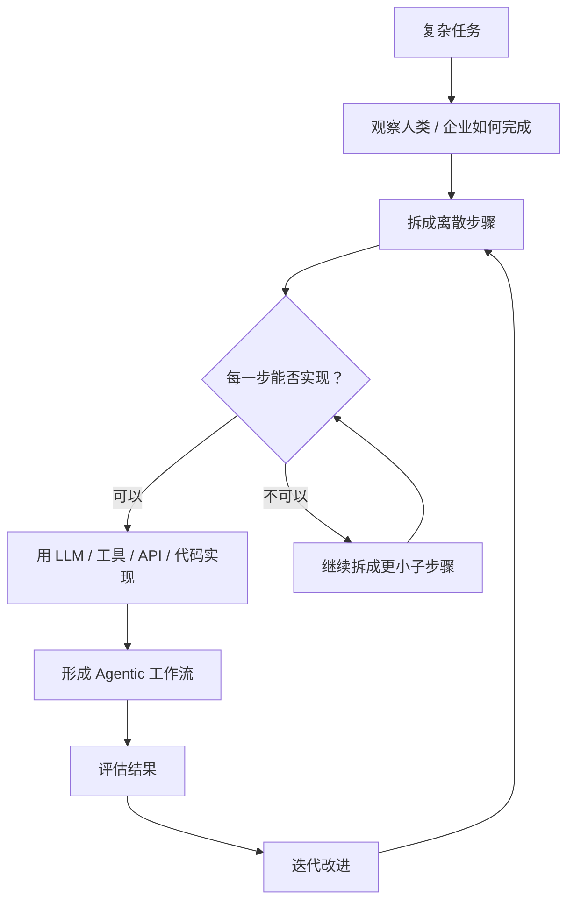

### 任务分解的判断循环

任务分解不是一次性的设计动作，而是一个循环：

| 判断问题 | 如果答案是“是” | 如果答案是“否” |
|----------|----------------|----------------|
| 这一步能否由 LLM 完成？ | 写提示词、定义输入输出、加入评估 | 继续拆小，或换成工具调用 |
| 这一步能否由短代码完成？ | 写脚本或函数处理确定性逻辑 | 判断是否需要模型或外部系统 |
| 这一步能否调用现有 API / 工具完成？ | 接入数据库、搜索、邮件、PDF 转换等工具 | 重新定义目标或增加人工审核 |
| 这一步失败后能否被检测？ | 加入错误处理和重试逻辑 | 需要重新设计可观测性 |

核心原则是：**不要强迫 LLM 一次性完成过大的任务。先把任务拆到足够小，再选择合适的构建模块。**

### 案例 1：研究智能体

如果目标是让 AI 撰写一篇需要深入研究的文章，最简单的做法是直接提示模型生成整篇文章。但课程指出，这种方式通常只覆盖表层信息，容易包含明显事实，却缺少深入分析。

#### 从直接生成到基础工作流

一个更合理的初始工作流是：

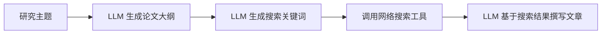

这比直接生成更好，因为它引入了结构规划和外部资料。但实现后仍可能发现问题：文章虽然更丰富，但可能显得零散，开头、中段和整体结构不够协调。

#### 继续拆解写作步骤

当“撰写文章”这一步仍然太大时，可以继续拆成更细的子步骤：

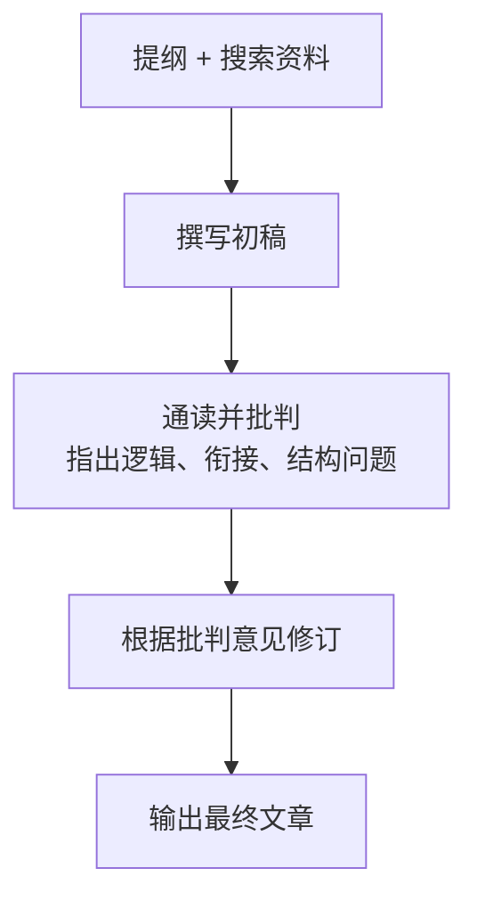

这实际上是在模仿人类写作：先有草稿，再读一遍，发现问题，再修订。这个例子说明，任务分解的深度取决于输出质量。如果三步工作流仍不够好，就把其中某一步继续向下拆。

| 版本 | 工作流 | 典型问题 | 改进方向 |
|------|--------|----------|----------|
| **直接生成** | 一次 Prompt 生成全文 | 表层、泛泛而谈 | 引入大纲和检索 |
| **V1 基础拆解** | 大纲 → 搜索 → 撰写 | 内容更丰富，但可能零散 | 拆解写作步骤 |
| **V2 深度迭代** | 初稿 → 批判 → 修订 | 质量更高，但成本更高 | 继续评估瓶颈 |

### 案例 2：基础客户订单查询

处理客户订单邮件也可以拆成三个离散步骤：

1. **提取关键信息**：识别发件人、订购了什么、订单号是什么。
2. **查找客户记录**：生成数据库查询，调用订单数据库，获取订单状态、发货时间等信息。
3. **撰写并发送回复**：基于查到的信息生成回复，并通过邮件 API 发送，或先进入人工审核。

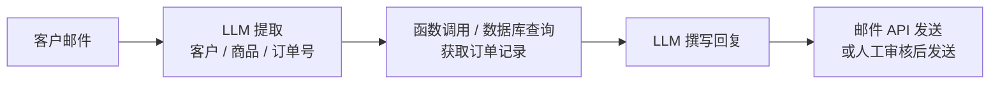

这个例子的重点是：拆解后的每一步都可以单独判断是否可实现。信息提取适合 LLM；数据库查询适合函数调用；邮件发送适合 API；回复生成再次适合 LLM。

### 案例 3：发票处理

发票处理也可以拆成很少但清晰的步骤：

1. **提取所需信息**：PDF 发票转文本后，用 LLM 提取账单名称、地址、到期日期、金额等字段。
2. **保存到数据库**：检查信息是否正确，并调用函数或后端 API 创建 / 更新数据库记录。

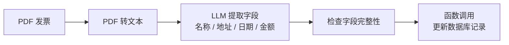

这个案例说明：任务分解不一定意味着很多步骤。好的任务分解是让每一步都清晰、可执行、可测试。

### Agentic 工作流的构建模块

吴恩达把构建 Agentic Workflow 的过程类比为组合多个 Building Blocks（构建模块）。开发者需要清楚自己手上有哪些积木，才能把复杂任务拆成可实现的系统。

| 构建模块 | 典型能力 | 适合承担的步骤 |
|----------|----------|----------------|
| **大型语言模型（LLM）** | 文本生成、总结、判断、意图识别、结构化抽取、决定下一步调用什么 | 大纲生成、邮件回复、字段提取、草稿批判 |
| **大型多模态模型（LMM）** | 处理图像、音频、视觉输入，并与文本推理结合 | 图像理解、音频理解、视觉文档处理 |
| **专用 AI 模型** | 针对特定模态或任务优化 | PDF 转文本、文本转语音、图像分析 |
| **软件工具 / API** | 获取外部信息或执行现实操作 | 搜索网页、查天气、发邮件、看日历 |
| **信息检索 / RAG** | 从数据库或大规模文档库中找到相关内容 | 查询企业知识库、检索客户记录、查政策 |
| **代码执行工具** | 让模型编写并运行代码，完成计算、转换、数据处理 | 数据分析、格式转换、复杂计算、批处理 |

这些模块的作用不是相互替代，而是互补。一个实用 Agentic 工作流往往是多种模块的组合：LLM 负责判断和生成，API 负责外部动作，RAG 负责找资料，代码执行负责确定性计算。

### 从初始工作流到持续迭代

构建 Agentic 工作流很少能一次到位。更常见的路径是：

1. 先设计一个初始工作流（Initial Workflow）。
2. 跑真实或接近真实的样例。
3. 阅读输出，找出失败点或质量不足的步骤。
4. 继续拆解瓶颈步骤，或替换构建模块。
5. 反复迭代，直到达到目标性能。

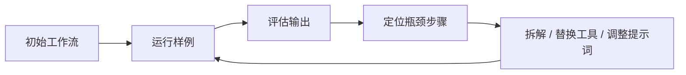

这一节最后引出下一节主题：**Evaluation / Evals（评估）**。要持续改进 Agentic 工作流，必须知道如何评估它。只有能评估，才能定位瓶颈；只有能定位瓶颈，才能持续迭代到想要的性能水平。

### 第五节文字稿整理版

> 以下为基于课程中文转写的整理版文字稿，已修正明显的语音识别错误，如将“enworkflow / enic / 遗传工作流 / asic 工作流”统一为 “Agentic Workflow / Agentic 工作流”。

人们和企业会做很多有用的事情。问题是：如何将这些事情分解成离散步骤，供 Agentic Workflow 执行？

以构建研究 Agent 为例。如果你想让 AI 系统撰写某个主题的论文，可以直接提示模型生成所需内容。但如果主题需要深入研究，你可能会发现输出只涵盖表面信息，包含一些明显事实，却没有深入探讨你真正想研究的主题。

在这种情况下，可以反思：作为人类，我们如何撰写特定主题的论文？我们是直接坐下来开始写，还是应该分步骤进行？例如，先撰写论文大纲，然后进行网络搜索，再根据网络搜索结果撰写论文正文。

当我把任务分解为步骤时，我始终会问自己：第一步、第二步、第三步，是否都能由语言模型处理，或由短代码片段完成，或通过工具调用 / 函数调用完成？在这个例子中，我认为语言模型可以为许多主题生成不错的提纲；我也知道如何用语言模型生成搜索关键词，所以第二步可行；基于网络搜索结果，我认为语言模型也可以读取搜索结果并撰写论文。因此，这会形成一个合理的初始文章写作工作流，比直接生成更深入。

但如果实现这个工作流并查看结果，可能仍会发现结果不够理想。文章的思考深度可能仍然不足，内容可能略显零散。过去使用这个工作流构建研究 Agent 时，我读到输出结果，感觉内容衔接不够流畅，开头和中间部分不完全一致，也没有完全服务于整体结构。

这时就需要反思如何调整工作流。如果人类发现论文略显零散，可能会进一步分解“撰写文章”这一步，不再一次性完成整篇文章。可以先写初稿，然后思考哪些部分需要修改，接着进行修订。作为人类，我通常不会第一次尝试就写出最终文章，而是先写初稿，再通读一遍；根据对自己文章的批判，再修改草稿。

回顾一下，最开始是直接生成，一步完成，但效果不够好；于是把它拆成三个步骤，但可能仍不够完善；这时可以把其中一个步骤进一步拆成三个更细的步骤，形成更复杂、更丰富的文章生成流程。根据对结果的满意度，还可以继续调整生成流程。

再看第二个分解复杂任务的例子：处理基础客户订单咨询。人类客服机构可能执行的第一步，是提取关键信息，例如发件人是谁、他们订购了什么，以及订单号是什么。这个步骤可以用 LLM 完成。

第二步是查找相关客户记录，也就是生成相应数据库查询，调取客户订单信息、发货时间等。我认为，具备函数调用能力的语言模型可以访问订单数据库并完成这一步。

最后，在调取客户记录或订单记录后，系统可以撰写并发送回复给客户。我认为利用获取的信息，第三步也可以用语言模型完成；如果提供发送邮件的 API，系统就可以调用 API 发送邮件。这就是另一个将任务分解为步骤的例子：把处理客户邮件的任务拆成三个独立步骤，并逐一确认查询数据库或发送邮件是否可行。

再看一个发票处理的例子。当 PDF 发票转换为文本后，第一步是提取所需信息，例如账单名称、地址、到期日期、金额等。现在语言模型应该可以做到。然后，如果要检查信息是否提取正确，并保存到新的数据库条目中，语言模型应该可以帮助调用函数，更新数据库记录。因此，要实现这个功能，可以构建一个 Agentic 工作流执行这两个步骤。

在构建工作流时，我把自己看作拥有多个构建模块。一个重要构建模块是大型语言模型，或者在需要处理图像或音频时使用大型多模态模型。它们擅长生成文本、决定调用什么工具、提取高度专业任务的信息。我也可能使用其他 AI 模型，比如 PDF 转文本模型、文本转语音模型、图像分析模型。

除了 AI 模型，我还可以使用多个软件工具，包括可调用 API，比如网络搜索、实时天气数据、发送邮件、查看日历等。我还可能使用信息检索工具，从数据库中提取数据，或实现 RAG（检索增强生成），让系统能够查阅大型文本数据库并找到最相关内容。

我也可能使用代码执行工具。这是一种让语言模型编写代码，并在电脑上运行代码来完成各种任务的工具。如果这些工具对你来说有些陌生，不用担心，后续模块会详细讲解重要工具。

我在构建 Agent 和工作流时，很多工作就是分析个人或企业正在执行的任务，然后尝试用这些构建模块组合起来，完成系统需要执行的任务。这就是为什么了解可用构建模块非常重要。希望你现在对此有更清晰的认识；到课程结束时，你会更好地理解如何通过组合这些模块构想可以构建的 Agentic 工作流。

总结来说，构建 Agentic 工作流的关键技能之一，是观察他人可能执行的操作，并识别其中的步骤以及这些步骤的可能实现方式。当我分析这些独立步骤时，我始终会问自己：这一步能否通过语言模型或现有工具实现，比如 API 或可调用函数？

如果答案是否定的，我通常会继续思考：作为人类，我会如何完成这一步？是否可以进一步拆解，或把这一步拆成更小的步骤，使这些步骤更适合用语言模型或现有软件工具实现？

希望这能让你初步理解任务分解的方法。如果还没有完全掌握，不必担心，本课程会提供更多示例。课程结束时，你会对此有更深入的理解。

构建工作流时，通常需要先创建一个初始 Agentic 工作流，然后多次迭代和改进，直到达到所需的性能水平。要推动这个改进过程，我发现对许多项目来说，关键技能之一是学会评估工作流。下一视频将讨论评估方法，这是构建工作流的关键环节，也能帮助你持续优化工作流，直到达到预期性能。

## 符号约定

课程中使用了统一的视觉符号系统来表示工作流中的不同组件：

| 符号 | 颜色 | 含义 | 示例 |
|------|------|------|------|
| 🟥 红色方框 | 红色 | **用户输入** | 用户查询、输入到 Agentic 流程的文档 |
| ⬜ 灰色方框 | 灰色 | **LLM 调用** | 调用语言模型进行推理或生成 |
| 🟩 绿色方框 | 绿色 | **工具/外部操作** | 网络搜索、API 调用、代码执行、网页抓取 |

这个符号约定帮助我们在设计和沟通 Agentic 工作流时，清晰区分"人在哪里介入"、"LLM 在哪里推理"、"外部工具在哪里被调用"。

## 概念关系图

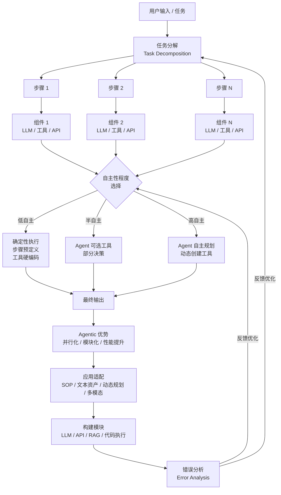

## 最佳实践与注意事项

1. **不要急于追求高自主性**：低自主性的确定性工作流在当前有大量高价值应用场景，且更可靠。
2. **注重错误分析（Error Analysis）**：这是吴恩达强调的核心差异化能力。规范化地分析每一步的失败原因，针对性优化。
3. **选择合适的问题**：并非所有问题都适合 Agentic 工作流。如果一个简单 Prompt 就能做好，不必引入额外复杂度。
4. **任务分解是起点**：花时间仔细设计任务分解方案，这决定了整个工作流的上限。
5. **步骤间可观测**：确保每个步骤的输出是可检查和评估的，便于调试和优化。
6. **优先优化瓶颈组件**：Agentic 工作流是模块化的，不必一次性重构整个系统；先定位失败环节，再替换搜索、模型、提示词或工具。
7. **把并行化用在合适的位置**：检索、网页下载、候选方案生成等任务适合并行；需要综合判断、事实核查和最终取舍的步骤仍要谨慎设计。
8. **从 SOP 任务开始落地**：发票处理、基础订单查询这类流程清晰、文本为主的任务，更适合作为企业 Agentic AI 的早期场景。
9. **谨慎处理 Computer Use**：网页浏览和计算机使用很有前景，但当前可靠性仍受网页加载、复杂 UI、多模态解析影响，不宜直接用于高风险关键流程。
10. **把过大的步骤继续拆小**：如果某一步无法稳定由 LLM 或工具完成，先不要硬做，回到人类流程，继续拆成更小的可执行子步骤。
11. **先搭初始工作流，再评估迭代**：Agentic 工作流通常需要反复调整任务拆解、提示词、工具和模型组合，直到达到目标性能。

## 后续课程预告

根据课程脉络，后续可能涉及：
- 评估方法（Evaluation / Evals）
- 工具使用（Tool Use）的深入讲解
- 具体的 Agent 架构模式
- 错误分析与规范化开发流程的实操

> 笔记将持续更新，跟进后续课程内容。

## 参考来源

- Andrew Ng - Agentic AI 课程（官方课程视频及文字稿）
- 本笔记基于课程第 0~5 节的课堂笔记与中文文字稿整理
