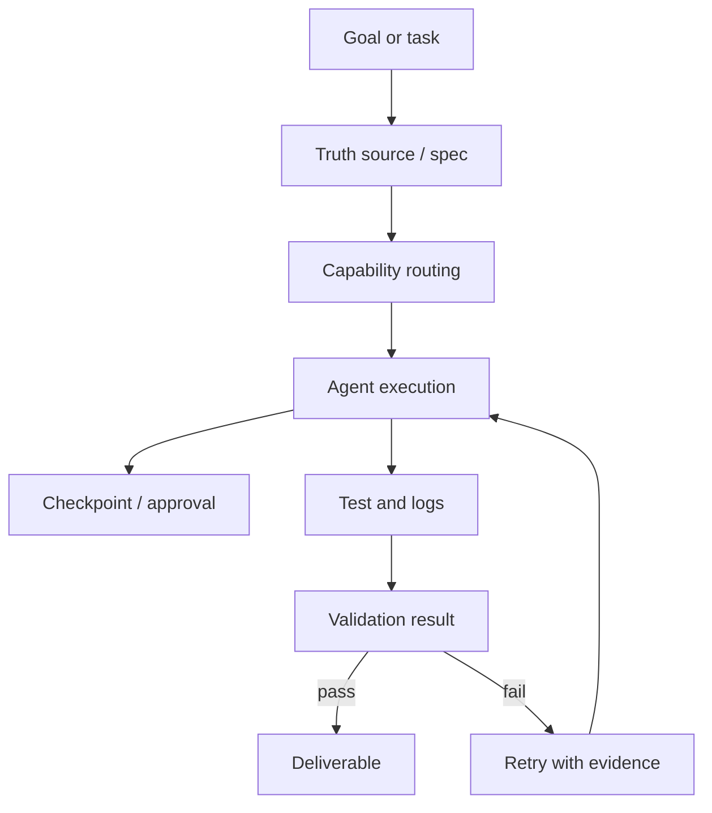

# AI Agent 的 Harness Engineering

这篇笔记整理 `Harness Engineering` 作为 AI Agent 工程方法论的核心思想。它关注的不是“如何把 prompt 写得更巧”，而是如何把一个强但非确定性的模型，嵌进一条可验证、可回退、可交接的工程流水线。

官方/来源：

- 微信文章：<https://mp.weixin.qq.com/s/xLdQ9Z3n3SNwaQtmrM28FA?click_id=2>
- vault 原始剪藏：[[../../Clippings/从玩具到生产力：用真实项目讲透 AI Agent 的 Harness Engineering]]
- 域内 raw 记录：[[../_kb/raw/Harness Engineering 文章来源记录]]

[TOC]

## 目录

- [Key Takeaways](#key-takeaways)
- [Harness Engineering 是什么](#harness-engineering-是什么)
- [它和传统软件工程的区别](#它和传统软件工程的区别)
- [架构边界：四象限理解](#架构边界四象限理解)
- [好的 Harness 包含什么](#好的-harness-包含什么)
- [为什么企业环境里它比 Prompt 更重要](#为什么企业环境里它比-prompt-更重要)
- [工程师角色迁移](#工程师角色迁移)
- [落地流程](#落地流程)
- [Comparison Table](#comparison-table)
- [Architecture or Flow](#architecture-or-flow)
- [Related Pages](#related-pages)
- [参考来源](#参考来源)

## Key Takeaways

- `Harness Engineering` 解决的是大模型的非确定性，而不是普通编码错误。
- 生产级 Agent 的稳定性主要来自模型外部的控制面，而不是更长的 prompt。
- 真相源、Checkpoint、Approval、Capability、日志反馈、测试回归是关键结构件。
- 对工程师来说，价值重心会从“亲手实现”迁移到“定义目标、约束边界、掌控节奏、验收结果”。

## Harness Engineering 是什么

可以把 `Harness Engineering` 理解成一套物理控制面，用来把一个“聪明但缺乏工程常识的非确定性引擎”夹进确定性的业务系统里。

这里的 `Harness` 不是单个 prompt、单个 tool、单个规则文件，而是多种约束的组合，例如：

- 外部真相源
- 显式状态管理
- 批准点与执行门禁
- 能力路由
- 日志与测试反馈闭环
- 可恢复、可交接的任务状态

## 它和传统软件工程的区别

传统软件工程主要防的是“人会犯错，但程序本身是确定的”。而 `Harness Engineering` 关注的是“模型本身就是概率引擎”。

所以两者的焦点不同：

- 传统软件工程：函数一旦实现正确，相同输入就应得到相同输出。
- Harness Engineering：即使输入相似，模型行为仍可能漂移，因此要把关键约束外置。

## 架构边界：四象限理解

文章里一个很有用的视角，是用两条轴来区分 Agent 结构：

- X 轴：执行流是静态预设，还是动态自主
- Y 轴：状态和上下文是在模型内部隐式维持，还是由外部显式系统接管

这能帮助区分四类典型形态：

- 无状态链：一次性调用，轻量高吞吐
- 提示词驱动：模型自由度高，但稳定性差
- 传统管道：流程固定，模型只做局部处理
- Harness Engineering：模型给意图，外部系统给边界、状态与验证

## 好的 Harness 包含什么

从工程角度看，至少要有这些组件：

### 1. 真相源

- 用 Spec、handoff 文档、状态文档或仓库结构化文档，承接跨轮上下文
- 不把全部状态押在聊天窗口里

### 2. 执行边界

- 对危险动作设置 Checkpoint 和 Approval
- 在破坏性修改前，要求模型复述目标、下一步和风险

### 3. 能力路由

- 不靠一个超级 prompt 穷举所有分支
- 把不同任务拆到更小的 capability 或脚本管道

### 4. 反馈闭环

- 把测试、日志、回归验证前置
- 不让模型“口头宣布成功”，而是用外部证据确认

### 5. 恢复与交接

- 任务中断后，能靠外部工件恢复
- 让其他工程师或新会话可以接手

## 为什么企业环境里它比 Prompt 更重要

在本地 demo 里，很多问题会被人工兜底掩盖。但企业环境不同：

- 链路长
- 接口多
- 权限和边界严格
- 错误代价高
- 任务经常跨天、跨人、跨会话

因此真正决定系统能否持续交付的，不是某次 prompt 写得有多漂亮，而是：

- 是否有统一真相源
- 是否能稳定恢复状态
- 是否能把危险动作拦住
- 是否能在失败后沿着日志和测试自我修复

## 工程师角色迁移

这篇文章强调了一个判断：有了 Agent 以后，工程师的高价值工作会逐渐从“亲手写出每一行代码”迁移到“控盘”。

这里的控盘不是不懂技术，而是：

- 平时不过度干涉局部实现
- 在关键边界、关键架构、关键异常上随时下潜
- 判断什么时候放权、什么时候接管

这和技术负责人、交付负责人、架构 owner 的工作方式更接近。

## 落地流程

一个更稳的落地顺序是：

1. 建最小真相源
2. 建执行边界和审批点
3. 明确 capability 与 tool 边界
4. 接入测试、日志、回归
5. 让任务具备恢复与交接能力
6. 再逐步提高 Agent 自由度

## Comparison Table

| 维度 | Prompt-first Agent | Harness-first Agent |
| --- | --- | --- |
| 核心控制方式 | 依赖 prompt 约束 | 依赖模型外部控制面 |
| 状态位置 | 主要在上下文窗口 | 主要在外部真相源与状态系统 |
| 失败处理 | 继续重试或改 prompt | 基于日志、测试、审批做闭环修正 |
| 可交接性 | 弱 | 强 |
| 团队维护性 | 低 | 高 |
| 适用场景 | demo、探索、小任务 | 企业工程、长任务、可持续交付 |

## Architecture or Flow

## Related Pages

- [[../_kb/index]]
- [[../_kb/raw/Harness Engineering 文章来源记录]]

## 参考来源

- 微信文章：<https://mp.weixin.qq.com/s/xLdQ9Z3n3SNwaQtmrM28FA?click_id=2>
- Vault 原始剪藏：[[../../Clippings/从玩具到生产力：用真实项目讲透 AI Agent 的 Harness Engineering]]
- 域内 raw 记录：[[../_kb/raw/Harness Engineering 文章来源记录]]
